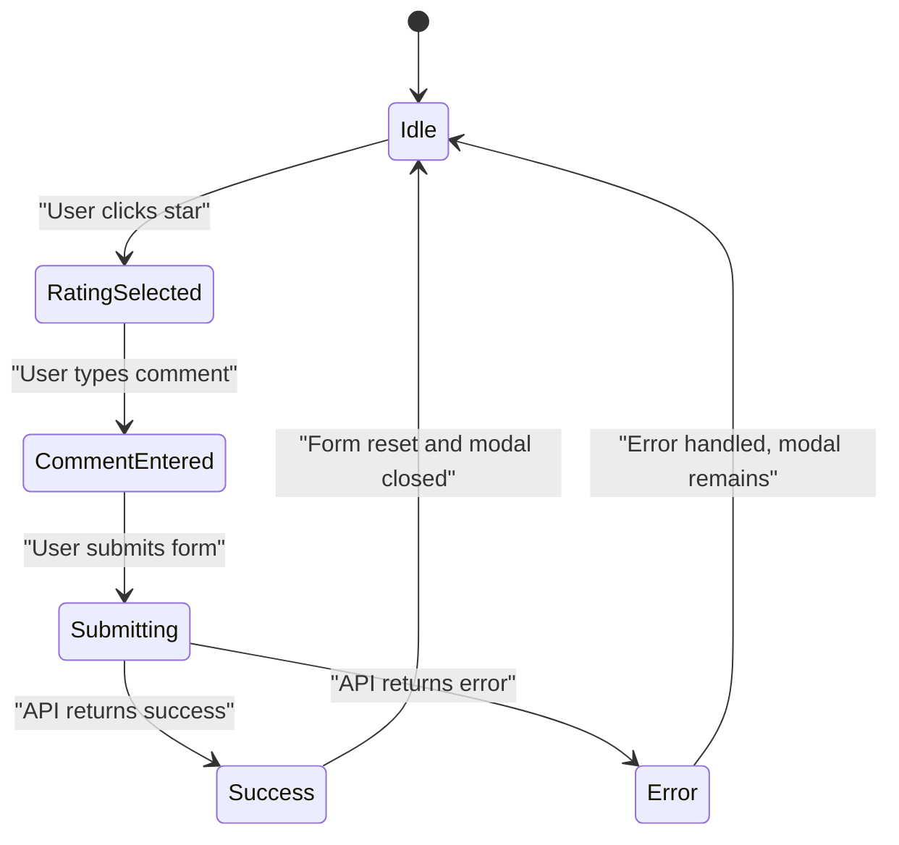
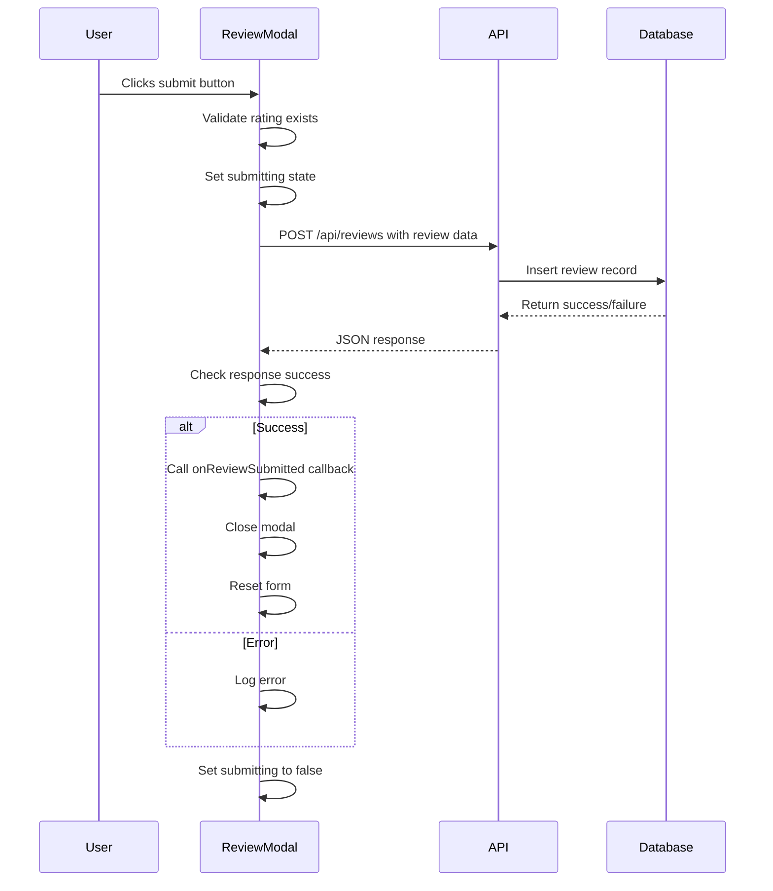
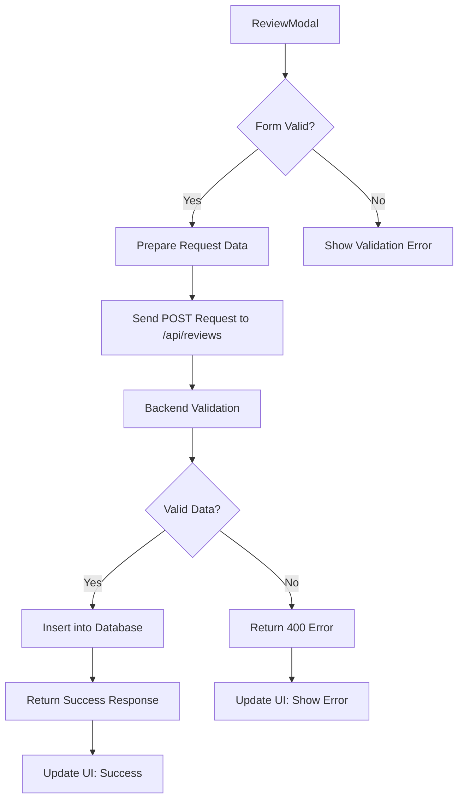
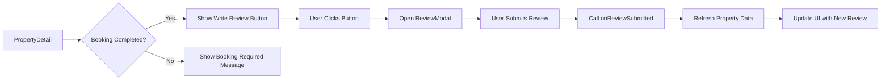

# Review Modal

<cite>
**Referenced Files in This Document**   
- [ReviewModal.tsx](file://src/react-app/components/ReviewModal.tsx)
- [PropertyDetail.tsx](file://src/react-app/pages/PropertyDetail.tsx)
- [index.ts](file://src/worker/index.ts)
- [types.ts](file://src/shared/types.ts)
</cite>

## Table of Contents
1. [Review Modal Implementation](#review-modal-implementation)
2. [State Management](#state-management)
3. [Form Validation and Submission](#form-validation-and-submission)
4. [Backend Integration](#backend-integration)
5. [Accessibility Features](#accessibility-features)
6. [Usage Context](#usage-context)
7. [Best Practices](#best-practices)

## Review Modal Implementation

The ReviewModal component implements a star-based rating system with dynamic feedback for property reviews. It provides a user-friendly interface for guests to submit their experiences after a booking. The modal displays property information, allows users to select a rating from 1 to 5 stars, and optionally add a written comment.

The component uses React's useState hook to manage various states including rating selection, comment input, and submission status. The star rating system provides visual feedback through color changes (yellow for selected stars, gray for unselected) and displays descriptive text based on the selected rating (e.g., "Excellent" for 5 stars, "Poor" for 1 star).

**Section sources**
- [ReviewModal.tsx](file://src/react-app/components/ReviewModal.tsx#L1-L186)

## State Management

The ReviewModal component manages several states to handle user interactions and form submission:

:rating: - Tracks the selected star rating (1-5), initialized to 5 as the default
:comment: - Stores the user's written review text
:submitting: - Indicates whether the form is currently being submitted
:hoveredStar: - Manages visual feedback during hover interactions with stars
:isOpen: - Controls modal visibility (passed as a prop)

The component implements a resetForm function that clears all input fields after successful submission, resetting the rating to 5, clearing the comment field, and resetting the hovered star state.

**Diagram sources**
- [ReviewModal.tsx](file://src/react-app/components/ReviewModal.tsx#L1-L186)

**Section sources**
- [ReviewModal.tsx](file://src/react-app/components/ReviewModal.tsx#L1-L186)

## Form Validation and Submission

The form validation is implemented through both client-side and server-side mechanisms. Client-side validation prevents submission when no rating is selected. The submit button is disabled when either no rating is selected or the form is currently submitting.

The handleSubmit function processes the form submission with the following workflow:
1. Prevents default form submission behavior
2. Validates that a user is authenticated and a rating is selected
3. Sets submitting state to true
4. Sends a POST request to the /api/reviews endpoint
5. Handles the response and updates the UI accordingly
6. Resets the form and closes the modal on success
7. Logs errors and resets submitting state in case of failure

**Diagram sources**
- [ReviewModal.tsx](file://src/react-app/components/ReviewModal.tsx#L1-L186)
- [index.ts](file://src/worker/index.ts#L1960-L2008)

**Section sources**
- [ReviewModal.tsx](file://src/react-app/components/ReviewModal.tsx#L1-L186)

## Backend Integration

The ReviewModal integrates with the backend through the /api/reviews POST endpoint. The component sends review data in the following structure:
:property_id: - The ID of the property being reviewed
:booking_id: - The ID of the booking (optional)
:rating: - The star rating (1-5)
:comment: - The written review (optional, can be null)

The backend validation rules, as defined in the CreateReviewSchema, enforce:
- :property_id: must be a positive number
- :rating: must be an integer between 1 and 5 (inclusive)
- :comment: is optional and can be omitted or null

The worker implementation in index.ts handles the database insertion, using the provided data to create a new review record with the current timestamp.

**Diagram sources**
- [index.ts](file://src/worker/index.ts#L1960-L2008)
- [types.ts](file://src/shared/types.ts#L74-L83)

**Section sources**
- [index.ts](file://src/worker/index.ts#L1960-L2008)
- [types.ts](file://src/shared/types.ts#L74-L83)

## Accessibility Features

The ReviewModal component includes several accessibility features to ensure usability for all users:

- **Keyboard Navigation**: The star rating buttons are focusable and can be operated via keyboard using the tab and enter/space keys
- **Screen Reader Support**: Star buttons have appropriate focus outlines and semantic HTML structure
- **Visual Feedback**: Hover effects on stars provide clear visual indication of selection
- **Error Messaging**: Form validation errors are logged to the console, providing feedback for debugging
- **Clear Labels**: Form fields have descriptive labels and instructions
- **Focus Management**: The modal traps focus within its content when open

The star rating system uses button elements rather than divs, ensuring proper keyboard accessibility. Each star button has a focus outline that appears when navigated to via keyboard, and the onClick handler responds to both mouse clicks and keyboard interactions.

**Section sources**
- [ReviewModal.tsx](file://src/react-app/components/ReviewModal.tsx#L1-L186)

## Usage Context

The ReviewModal is integrated within the PropertyDetail component, where it is triggered after a user has completed a booking. The modal is conditionally rendered based on the isOpen prop, which is controlled by the parent component.

In the PropertyDetail context, the modal is used to collect post-booking feedback from guests. The component receives the property data and optional booking ID as props, ensuring the review is associated with the correct property and booking.

The onReviewSubmitted callback is used to refresh the property data and update the UI to reflect the new review. This creates a seamless user experience where the review is immediately reflected in the property's rating and review count.

**Diagram sources**
- [PropertyDetail.tsx](file://src/react-app/pages/PropertyDetail.tsx#L0-L561)
- [ReviewModal.tsx](file://src/react-app/components/ReviewModal.tsx#L1-L186)

**Section sources**
- [PropertyDetail.tsx](file://src/react-app/pages/PropertyDetail.tsx#L0-L561)

## Best Practices

To ensure optimal user experience and data integrity, the following best practices should be followed when using the ReviewModal:

**Preventing Duplicate Reviews**
- Implement backend checks to prevent multiple reviews for the same booking
- Use the booking_id to uniquely identify review opportunities
- Consider adding a database constraint to prevent duplicate user-booking review combinations

**Managing User Expectations**
- Clearly communicate that reviews may require moderation before appearing
- Provide feedback on review status (e.g., "Your review is awaiting moderation")
- Set expectations about display timing in the review guidelines

**Enhancement Recommendations**
- Implement client-side validation for comment length (currently only backend validation exists)
- Add character count for comments to guide users
- Include success toast notifications after submission
- Implement loading states for better user feedback
- Add more detailed error handling with user-friendly messages

**Moderation Workflow**
- Reviews should be marked as "pending" upon submission
- Admins should have a dashboard to review and approve/reject submissions
- Users should be notified when their review is published
- Consider implementing automated content filtering for inappropriate language

**Section sources**
- [ReviewModal.tsx](file://src/react-app/components/ReviewModal.tsx#L1-L186)
- [PropertyDetail.tsx](file://src/react-app/pages/PropertyDetail.tsx#L0-L561)
- [index.ts](file://src/worker/index.ts#L1960-L2008)
- [types.ts](file://src/shared/types.ts#L74-L83)