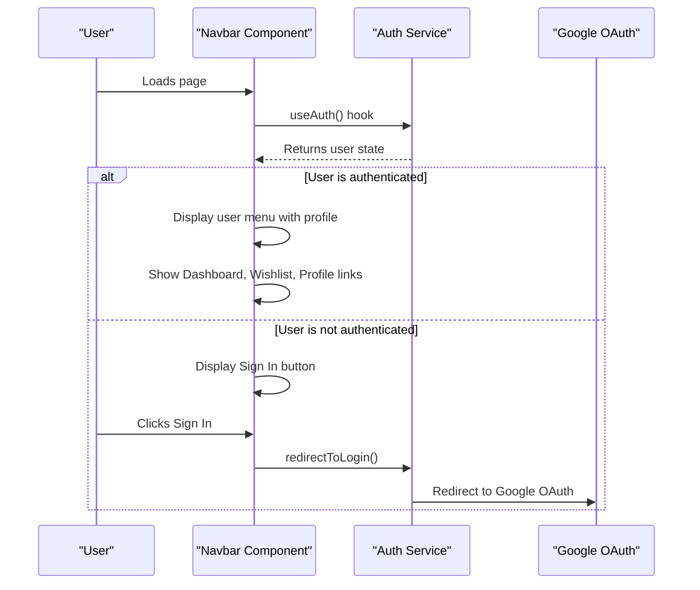
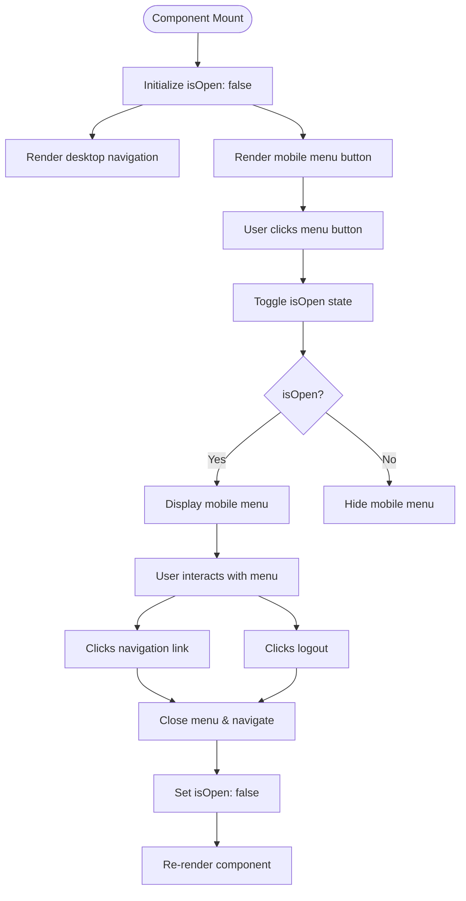
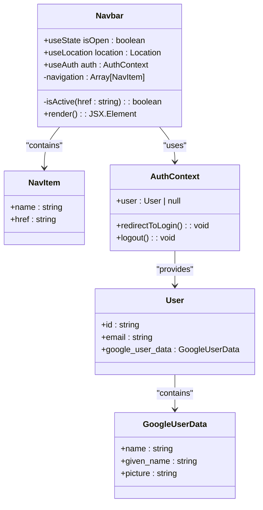
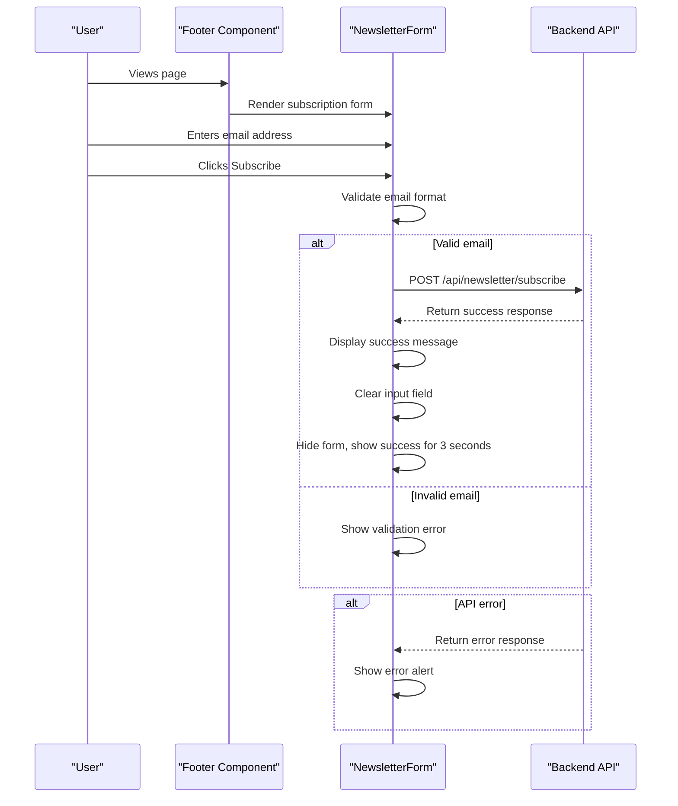
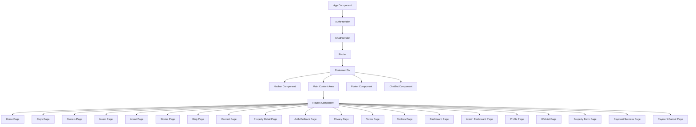
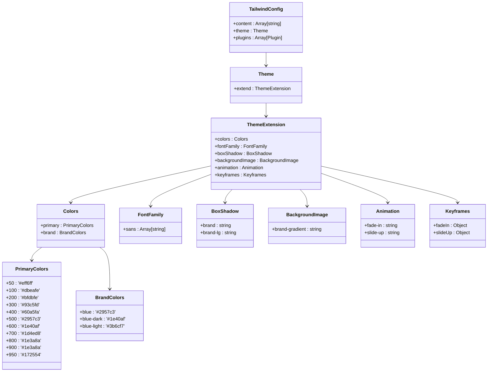
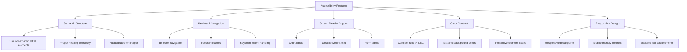

# Navbar and Footer Components

<cite>
**Referenced Files in This Document**   
- [Navbar.tsx](file://src/react-app/components/Navbar.tsx)
- [Footer.tsx](file://src/react-app/components/Footer.tsx)
- [App.tsx](file://src/react-app/App.tsx)
- [AuthCallback.tsx](file://src/react-app/pages/AuthCallback.tsx)
- [tailwind.config.js](file://tailwind.config.js)
</cite>

## Table of Contents
1. [Introduction](#introduction)
2. [Component Overview](#component-overview)
3. [Navbar Component Analysis](#navbar-component-analysis)
4. [Footer Component Analysis](#footer-component-analysis)
5. [Integration and Mounting](#integration-and-mounting)
6. [Design System and Styling](#design-system-and-styling)
7. [Accessibility Compliance](#accessibility-compliance)
8. [Conclusion](#conclusion)

## Introduction
The Navbar and Footer components serve as essential global UI elements in the HabibiStay application, providing consistent navigation, branding, and user interaction across all pages. These components are designed with responsive layouts, authentication state awareness, and accessibility compliance to ensure a seamless user experience. This document provides a comprehensive analysis of their implementation, functionality, and integration within the application architecture.

## Component Overview
The Navbar and Footer components are fundamental structural elements that appear on every page of the application. They provide persistent navigation, branding, and user interaction capabilities regardless of the current route. Both components are built using React with Tailwind CSS for styling and are integrated with the application's authentication system to provide personalized user experiences.

**Section sources**
- [Navbar.tsx](file://src/react-app/components/Navbar.tsx)
- [Footer.tsx](file://src/react-app/components/Footer.tsx)

## Navbar Component Analysis

### Navigation Structure and Authentication Integration
The Navbar component implements a responsive navigation system that adapts to different screen sizes and user authentication states. It uses the `useAuth` hook from the `@getmocha/users-service/react` package to determine the current user's authentication status and render appropriate navigation elements.

The navigation structure consists of a primary navigation menu with links to key application sections:
- Home
- Stays
- Owners
- Invest
- About
- Stories
- Blog
- Contact

When a user is authenticated, the Navbar displays personalized user information including profile picture (from Google OAuth), name, and links to Dashboard, Wishlist, and Profile. For unauthenticated users, a "Sign In" button is displayed that triggers the Google OAuth flow.



**Diagram sources**
- [Navbar.tsx](file://src/react-app/components/Navbar.tsx#L1-L222)
- [AuthCallback.tsx](file://src/react-app/pages/AuthCallback.tsx#L1-L107)

**Section sources**
- [Navbar.tsx](file://src/react-app/components/Navbar.tsx#L1-L222)

### Responsive Hamburger Menu Implementation
The Navbar implements a responsive hamburger menu for mobile devices using a state-controlled toggle mechanism. The mobile menu is hidden on desktop screens (using Tailwind's `hidden md:block` classes) and appears as a collapsible drawer on smaller screens.

Key implementation details:
- Uses `useState` hook to manage the `isOpen` state
- Mobile menu button toggles between Menu and X icons from Lucide React
- Menu slides in from the top with a smooth transition
- Clicking any navigation link closes the mobile menu
- The menu has a maximum height and scrollable content for long lists



**Diagram sources**
- [Navbar.tsx](file://src/react-app/components/Navbar.tsx#L133-L195)

**Section sources**
- [Navbar.tsx](file://src/react-app/components/Navbar.tsx#L133-L195)

### Active Link Highlighting Mechanism
The Navbar implements active link highlighting to indicate the current page to users. This is achieved through a custom `isActive` function that compares the current route pathname with the navigation link's href value.

Implementation details:
- Uses `useLocation` hook from react-router to access current route
- Compares `location.pathname` with navigation item href
- Applies distinct styling to active links (blue text with light blue background)
- Uses Tailwind CSS classes for visual feedback
- Includes hover effects for inactive links

The active link styling provides clear visual feedback to users about their current location within the application, enhancing navigation usability.



**Diagram sources**
- [Navbar.tsx](file://src/react-app/components/Navbar.tsx#L1-L222)

**Section sources**
- [Navbar.tsx](file://src/react-app/components/Navbar.tsx#L1-L222)

## Footer Component Analysis

### Layout Structure and Content Organization
The Footer component implements a comprehensive multi-column layout that organizes content into logical sections for easy navigation and information discovery. The layout adapts responsively from a six-column grid on large screens to a single column on mobile devices.

The footer contains the following sections:
- Brand section with logo, tagline, and contact information
- Company links (About Us, Our Story, Blog, Contact)
- Services links (Book Stays, List Property, Invest, Dashboard)
- Support links (Help Center, Safety, Cancellation, Report Issue)
- Legal links (Privacy Policy, Terms of Service, Cookie Policy)
- Newsletter subscription form
- Social media links
- Copyright information and Vision 2030 badge

```mermaid
graph TB
Footer[Footer Component] --> BrandSection["Brand Section"]
Footer --> NavigationColumns["Navigation Columns"]
Footer --> Newsletter["Newsletter Form"]
Footer --> Social["Social Links"]
Footer --> Copyright["Copyright & Badge"]
BrandSection --> Logo["Logo Image"]
BrandSection --> Tagline["Brand Tagline"]
BrandSection --> Contact["Contact Information"]
NavigationColumns --> Company["Company Links"]
NavigationColumns --> Services["Services Links"]
NavigationColumns --> Support["Support Links"]
NavigationColumns --> Legal["Legal Links"]
Newsletter --> Form["Subscription Form"]
Newsletter --> Success["Success Message"]
Social --> Facebook["Facebook Link"]
Social --> Twitter["Twitter Link"]
Social --> Instagram["Instagram Link"]
Social --> LinkedIn["LinkedIn Link"]
Copyright --> Text["Copyright Text"]
Copyright --> Badge["Vision 2030 Badge"]
```



**Diagram sources**
- [Footer.tsx](file://src/react-app/components/Footer.tsx#L1-L284)

**Section sources**
- [Footer.tsx](file://src/react-app/components/Footer.tsx#L1-L284)

### Social Links and Legal Page References
The Footer component includes social media links and legal page references to ensure compliance and provide users with important information. The social links use Lucide React icons for consistent visual design and include proper accessibility attributes.

Social media platforms included:
- Facebook
- Twitter
- Instagram
- LinkedIn

Legal pages referenced:
- Privacy Policy (links to /privacy)
- Terms of Service (links to /terms)
- Cookie Policy (links to /cookies)

Each link is implemented with proper accessibility attributes, including `aria-label` for screen readers. The links open in the same tab as they navigate within the application.

```mermaid
flowchart LR
A[Footer Component] --> B[Social Links Section]
B --> C[Facebook Link]
B --> D[Twitter Link]
B --> E[Instagram Link]
B --> F[LinkedIn Link]
C --> G[Facebook Icon]
C --> H[aria-label=\"Facebook\"]
C --> I[href=\"#\"]
D --> J[Twitter Icon]
D --> K[aria-label=\"Twitter\"]
D --> L[href=\"#\"]
E --> M[Instagram Icon]
E --> N[aria-label=\"Instagram\"]
E --> O[href=\"#\"]
F --> P[LinkedIn Icon]
F --> Q[aria-label=\"LinkedIn\"]
F --> R[href=\"#\"]
A --> S[Legal Links Section]
S --> T[Privacy Policy]
S --> U[Terms of Service]
S --> V[Cookie Policy]
T --> W[href=\"/privacy\"]
U --> X[href=\"/terms\"]
V --> Y[href=\"/cookies\"]
```

**Diagram sources**
- [Footer.tsx](file://src/react-app/components/Footer.tsx#L70-L282)

**Section sources**
- [Footer.tsx](file://src/react-app/components/Footer.tsx#L70-L282)

### Newsletter Subscription Integration
The Footer component includes a newsletter subscription form that allows users to subscribe to email updates. The form is implemented as a nested component within the Footer and handles the complete subscription workflow.

Key features of the newsletter subscription:
- Email input validation (required field)
- Loading state during submission
- Success message display
- Error handling with user feedback
- POST request to /api/newsletter/subscribe endpoint
- Source tracking (identifies subscription from footer)

The subscription process follows this flow:
1. User enters email address
2. User clicks Subscribe button
3. Form validates input
4. POST request sent to API with email and source
5. API responds with success or error
6. UI updates based on response (success message or error alert)



**Diagram sources**
- [Footer.tsx](file://src/react-app/components/Footer.tsx#L1-L71)
- [worker/index.ts](file://src/worker/index.ts#L1787-L1822)

**Section sources**
- [Footer.tsx](file://src/react-app/components/Footer.tsx#L1-L71)

## Integration and Mounting

### App Component Integration
The Navbar and Footer components are mounted in the App.tsx file, where they are positioned to remain persistent across all routes. The App component serves as the root component that wraps all pages with necessary providers and layout elements.

The integration follows this structure:
1. AuthProvider wraps the entire application for authentication context
2. ChatProvider wraps the application for chat functionality
3. Router provides routing capabilities
4. Navbar is rendered at the top of the page
5. Main content area contains route-specific pages
6. Footer is rendered at the bottom of the page
7. ChatBot is rendered as an overlay

This structure ensures that the Navbar and Footer remain visible and functional regardless of the current route, providing consistent navigation and branding throughout the user journey.



**Diagram sources**
- [App.tsx](file://src/react-app/App.tsx#L1-L68)

**Section sources**
- [App.tsx](file://src/react-app/App.tsx#L1-L68)

### Route Persistence Mechanism
The Navbar and Footer components remain persistent across route changes due to their placement in the App component's render tree. This persistence is achieved through React Router's component structure, where layout components are rendered outside the Routes component.

Key aspects of the persistence mechanism:
- Navbar and Footer are siblings to the Routes component
- They are not re-rendered when routes change
- They maintain their state between route transitions
- They have access to the same authentication context as page components
- They respond to route changes through the useLocation hook

This approach provides a seamless user experience by maintaining navigation and branding elements while only updating the main content area during route transitions.

## Design System and Styling

### Tailwind CSS Implementation
Both Navbar and Footer components utilize Tailwind CSS for styling, following a utility-first approach that promotes consistency and maintainability. The styling implementation leverages Tailwind's responsive design features, color system, and spacing utilities.

Key Tailwind features used:
- Responsive breakpoints (sm, md, lg) for adaptive layouts
- Color palette based on brand colors (#2957c3 as primary blue)
- Flexbox and grid for layout organization
- Hover and focus states for interactive elements
- Transition and animation utilities for smooth interactions
- Border and shadow utilities for depth and separation

The Tailwind configuration extends the default theme with custom colors, fonts, and animations that align with the HabibiStay brand identity.



**Diagram sources**
- [tailwind.config.js](file://tailwind.config.js#L1-L57)

**Section sources**
- [tailwind.config.js](file://tailwind.config.js#L1-L57)

### Dark Mode Support Assessment
Based on the code analysis, the current implementation does not include dark mode support. The Tailwind configuration does not specify a dark mode variant, and the component styling uses fixed color values rather than theme-aware classes.

Evidence of no dark mode implementation:
- No `darkMode` configuration in tailwind.config.js
- No `dark:` prefix classes in Navbar or Footer components
- Fixed color values (e.g., bg-white, text-gray-700) instead of theme variables
- No state management for theme toggling
- No user preference persistence for theme selection

While the application could be extended to support dark mode, the current implementation focuses on a light theme with blue accent colors that align with the HabibiStay brand.

### Accessibility Compliance
Both Navbar and Footer components implement several accessibility features to ensure compliance with web accessibility standards. These features enable users of assistive technologies to navigate and interact with the components effectively.

Key accessibility implementations:
- Proper semantic HTML structure with appropriate heading levels
- ARIA labels for interactive elements (e.g., social media links)
- Keyboard navigation support through tab order
- Sufficient color contrast for text and interactive elements
- Focus indicators for keyboard navigation
- Alt text for images (e.g., logo)
- Form labels and input associations
- Responsive design for various screen sizes and devices

The components follow accessibility best practices by providing clear navigation, descriptive link text, and proper focus management, ensuring an inclusive user experience.



**Diagram sources**
- [Navbar.tsx](file://src/react-app/components/Navbar.tsx)
- [Footer.tsx](file://src/react-app/components/Footer.tsx)

**Section sources**
- [Navbar.tsx](file://src/react-app/components/Navbar.tsx)
- [Footer.tsx](file://src/react-app/components/Footer.tsx)

## Conclusion
The Navbar and Footer components in the HabibiStay application serve as critical global UI elements that provide consistent navigation, branding, and user interaction across all pages. These components are thoughtfully designed with responsive layouts, authentication state awareness, and accessibility compliance to ensure a seamless user experience.

Key strengths of the implementation include:
- Clean integration with the Google OAuth authentication system
- Responsive design that adapts to various screen sizes
- Persistent layout that remains stable across route changes
- Comprehensive footer with organized content sections
- Effective use of Tailwind CSS for consistent styling
- Attention to accessibility requirements

The components work together to create a cohesive user interface that guides users through the application while maintaining brand identity and functionality. Their placement in the App component ensures they remain available throughout the user journey, providing reliable navigation and access to important information and actions.