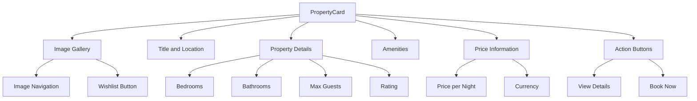
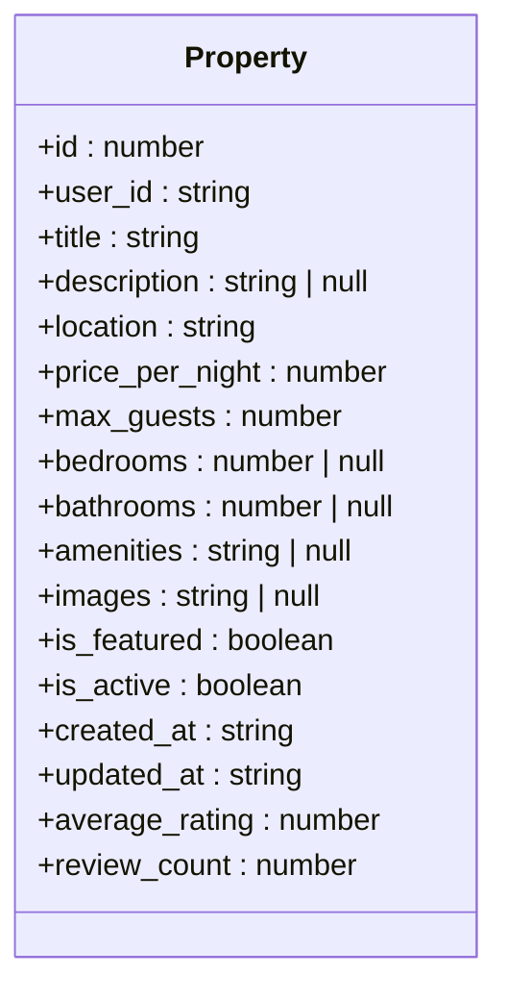
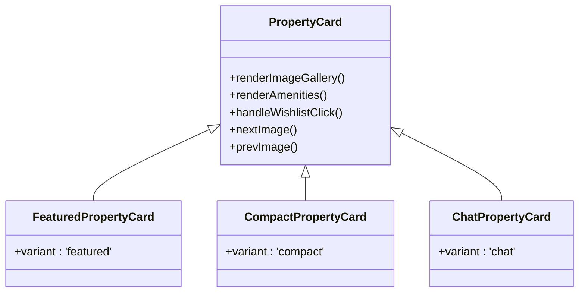

# PropertyCard Component

<cite>
**Referenced Files in This Document**   
- [PropertyCard.tsx](file://src/react-app/components/PropertyCard.tsx) - *Updated with mobile optimization patterns*
- [MobilePropertyCard.tsx](file://src/react-app/components/MobilePropertyCard.tsx) - *Added in recent commit for mobile optimization*
- [types.ts](file://src/shared/types.ts) - *Shared types for property data structure*
- [Home.tsx](file://src/react-app/pages/Home.tsx) - *Usage example on Home page*
- [Stays.tsx](file://src/react-app/pages/Stays.tsx) - *Usage example on Stays page*
- [responsive.ts](file://src/react-app/utils/responsive.ts) - *Responsive design utilities*
</cite>

## Update Summary
**Changes Made**   
- Added documentation for new MobilePropertyCard component
- Updated responsive design section with mobile-specific patterns
- Enhanced accessibility features with touch target requirements
- Added mobile-specific usage examples
- Updated component variants to reflect mobile optimization patterns
- Added responsive utilities from shared responsive design system

## Table of Contents
1. [Introduction](#introduction)
2. [Component Overview](#component-overview)
3. [Props Interface](#props-interface)
4. [Property Data Structure](#property-data-structure)
5. [Component Variants](#component-variants)
6. [Usage Examples](#usage-examples)
7. [Responsive Design and Styling](#responsive-design-and-styling)
8. [Image Handling and Optimization](#image-handling-and-optimization)
9. [Accessibility Features](#accessibility-features)
10. [Extensibility and Customization](#extensibility-and-customization)

## Introduction
The PropertyCard component is a reusable UI element designed to display property listings in the HabibiStay application. It serves as a consistent visual representation of available properties across different pages of the application, providing users with essential information at a glance. The component is designed to be flexible and adaptable, supporting various use cases and display requirements throughout the application.

**Section sources**
- [PropertyCard.tsx](file://src/react-app/components/PropertyCard.tsx#L1-L50)

## Component Overview
The PropertyCard component is a comprehensive property listing card that displays key information about a property including its title, location, price, images, and amenities. It features interactive elements such as hover effects, click handlers, and wishlist functionality. The component is designed with responsiveness in mind, adapting its layout and content based on the available space and intended use case.

The card includes an image gallery with navigation controls, allowing users to browse through multiple property images. It displays property details such as bedroom and bathroom counts, maximum guest capacity, and average rating. Amenities are represented with appropriate icons for quick visual recognition. The component also includes action buttons for viewing details and booking, with variations based on the component's variant.



**Diagram sources**
- [PropertyCard.tsx](file://src/react-app/components/PropertyCard.tsx#L1-L425)

**Section sources**
- [PropertyCard.tsx](file://src/react-app/components/PropertyCard.tsx#L1-L425)

## Props Interface
The PropertyCard component accepts a comprehensive set of props that define its behavior, appearance, and interactions. These props allow the component to be flexible and reusable across different contexts within the application.

<details>
<summary>PropertyCardProps Interface</summary>

```typescript
interface PropertyCardProps {
  property: Property;
  showWishlist?: boolean;
  isInWishlist?: boolean;
  onAddToWishlist?: (propertyId: number) => void;
  onRemoveFromWishlist?: (propertyId: number) => void;
  onBook?: (propertyId: number) => void;
  onViewDetails?: (propertyId: number) => void;
  onCheckAvailability?: (propertyId: number) => void;
  variant?: 'default' | 'featured' | 'compact' | 'chat';
  className?: string;
}
```
</details>

### Prop Descriptions
- **property**: The property object containing all relevant data to display
- **showWishlist**: Controls visibility of the wishlist button (default: true)
- **isInWishlist**: Indicates if the property is currently in the user's wishlist
- **onAddToWishlist**: Callback function triggered when adding a property to wishlist
- **onRemoveFromWishlist**: Callback function triggered when removing a property from wishlist
- **onBook**: Optional callback for booking a property
- **onViewDetails**: Optional callback for viewing property details
- **onCheckAvailability**: Optional callback for checking property availability
- **variant**: Controls the visual style and layout of the card
- **className**: Additional CSS classes to apply to the card

**Section sources**
- [PropertyCard.tsx](file://src/react-app/components/PropertyCard.tsx#L25-L36)

## Property Data Structure
The PropertyCard component relies on the Property type defined in the shared types file. This type provides type safety and ensures consistency across the application.



**Diagram sources**
- [types.ts](file://src/shared/types.ts#L3-L19)
- [types.ts](file://src/shared/types.ts#L125)

**Section sources**
- [types.ts](file://src/shared/types.ts#L3-L19)

### Property Schema Details
The Property type is derived from a Zod schema that defines validation rules for property data:

- **id**: Unique identifier for the property (number)
- **user_id**: ID of the property owner (string)
- **title**: Property title or name (string)
- **description**: Detailed description of the property (nullable string)
- **location**: Geographic location of the property (string)
- **price_per_night**: Cost per night in base currency (number)
- **max_guests**: Maximum number of guests allowed (number)
- **bedrooms**: Number of bedrooms (nullable number)
- **bathrooms**: Number of bathrooms (nullable number)
- **amenities**: JSON string of amenities array (nullable string)
- **images**: JSON string of image URLs array (nullable string)
- **is_featured**: Flag indicating if property is featured (boolean)
- **is_active**: Flag indicating if property is currently available (boolean)
- **created_at**: Timestamp of property creation (string)
- **updated_at**: Timestamp of last update (string)

The component handles both direct array inputs and JSON string representations for amenities and images, providing flexibility in data handling.

## Component Variants
The PropertyCard component supports multiple variants to accommodate different use cases and layouts within the application. These variants are implemented as wrapper components that set the variant prop with specific values.



**Diagram sources**
- [PropertyCard.tsx](file://src/react-app/components/PropertyCard.tsx#L415-L425)

**Section sources**
- [PropertyCard.tsx](file://src/react-app/components/PropertyCard.tsx#L415-L425)

### Variant Descriptions
#### Default Variant
The default variant is used for standard property listings and displays the most comprehensive information including:
- Full image gallery with navigation
- Property title and location
- Detailed property information (bedrooms, bathrooms, max guests)
- Average rating and review count
- Property description (when available)
- Up to six amenities with icons
- Price information with currency
- "Details" and "Book Now" action buttons

#### Featured Variant
The featured variant is designed for highlighted properties and includes additional elements:
- "Featured" badge in the top-left corner
- Quick contact information for featured properties
- Phone and email contact options
- Special styling to make featured properties stand out

#### Compact Variant
The compact variant is optimized for space-constrained layouts:
- Smaller card size (max-w-sm)
- Reduced font sizes for text elements
- Limited to four amenities display
- Simplified action buttons with smaller padding
- Optimized for grid layouts with multiple cards

#### Chat Variant
The chat variant is designed for integration with the AI chatbot interface:
- Full-width layout (w-full)
- Minimal styling to fit within chat bubbles
- Icon-only action buttons to save space
- "View", "Check Availability", and "Book" actions represented by icons
- Optimized for conversational UI contexts

## Usage Examples
The PropertyCard component is used in multiple pages throughout the application, demonstrating its versatility and reusability.

### Home Page Implementation
On the Home page, the PropertyCard component is used to display featured properties in a grid layout.

```tsx
import PropertyCard from '@/react-app/components/PropertyCard';

// In HomePage component
<div className="grid grid-cols-1 md:grid-cols-2 gap-8">
  {featuredProperties.map((property) => (
    <PropertyCard 
      key={property.id} 
      property={property} 
      onBook={(id) => console.log('Book property:', id)}
      onViewDetails={(id) => console.log('View property:', id)} 
    />
  ))}
</div>
```

**Section sources**
- [Home.tsx](file://src/react-app/pages/Home.tsx#L130-L138)

### Stays Page Implementation
On the Stays page, the PropertyCard component is used to display search results in a responsive grid.

```tsx
import PropertyCard from '@/react-app/components/PropertyCard';

// In StaysPage component
<div className="grid grid-cols-1 md:grid-cols-2 lg:grid-cols-3 gap-8">
  {properties.map((property) => (
    <PropertyCard 
      key={property.id} 
      property={property}
      onBook={handleBookProperty}
      onViewDetails={handleViewDetails}
    />
  ))}
</div>
```

**Section sources**
- [Stays.tsx](file://src/react-app/pages/Stays.tsx#L458-L466)

### Mobile-Optimized Implementation
For mobile devices, the application uses a specialized MobilePropertyCard component that implements touch-optimized patterns:

```tsx
import MobilePropertyCard from '@/react-app/components/MobilePropertyCard';

// In mobile-specific component
<div className="grid grid-cols-1 gap-4">
  {properties.map((property) => (
    <MobilePropertyCard 
      key={property.id} 
      property={property}
      viewMode="grid"
      onWishlistToggle={handleWishlistToggle}
      onShare={handleShareProperty}
    />
  ))}
</div>
```

**Section sources**
- [MobilePropertyCard.tsx](file://src/react-app/components/MobilePropertyCard.tsx#L1-L294)

### Variant Usage Example
The component variants can be used directly when a specific presentation is required:

```tsx
import { FeaturedPropertyCard, CompactPropertyCard } from '@/react-app/components/PropertyCard';

// Using Featured variant
<FeaturedPropertyCard 
  property={property}
  onBook={handleBook}
  onViewDetails={handleViewDetails}
/>

// Using Compact variant
<CompactPropertyCard 
  property={property}
  onBook={handleBook}
  onViewDetails={handleViewDetails}
/>
```

## Responsive Design and Styling
The PropertyCard component implements responsive design principles using Tailwind CSS, ensuring optimal display across different screen sizes and devices.

### Responsive Features
- **Flexible Layout**: Uses Tailwind's responsive grid system to adapt to different screen widths
- **Font Scaling**: Text elements adjust size based on the variant and screen size
- **Image Optimization**: Image height adjusts based on variant (h-48 for default, h-32 for compact/chat)
- **Grid Adaptation**: Changes from single column on mobile to multi-column layouts on larger screens
- **Touch-Friendly**: Adequate tap targets for mobile users with minimum 44px touch targets

### Styling Implementation
The component uses Tailwind CSS utility classes for styling, with the `clsx` library for conditional class application:

```tsx
const cardClasses = clsx(
  'bg-white border border-gray-200 rounded-lg shadow-sm overflow-hidden transition-all duration-200',
  {
    'hover:shadow-md': variant !== 'chat',
    'cursor-pointer': variant !== 'chat',
    'max-w-sm': variant === 'compact',
    'w-full': variant === 'chat',
  },
  className
);
```

The styling includes subtle animations and transitions for enhanced user experience:
- Hover effects with shadow elevation
- Smooth transitions for image gallery navigation
- Opacity transitions for navigation buttons
- Color transitions for interactive elements

The component leverages the shared responsive design system from `responsive.ts` which provides consistent patterns across the application, including touch target optimization and mobile-specific interactions.

**Section sources**
- [PropertyCard.tsx](file://src/react-app/components/PropertyCard.tsx#L232-L238)
- [responsive.ts](file://src/react-app/utils/responsive.ts#L1-L297)

## Image Handling and Optimization
The PropertyCard component includes sophisticated image handling capabilities to ensure reliable display of property images.

### Image Gallery Features
- **Multiple Image Support**: Displays the first image from the property's images array
- **Image Navigation**: Previous/next buttons for browsing through multiple images
- **Image Indicators**: Visual indicators showing current image position
- **Error Handling**: Fallback content when images fail to load
- **Responsive Sizing**: Different image heights based on component variant

### Image Processing Logic
The component includes logic to handle different data formats for images:

```tsx
const images = React.useMemo(() => {
  if (Array.isArray(property.images)) return property.images;
  if (typeof property.images === 'string') {
    try {
      return JSON.parse(property.images) || [];
    } catch {
      return [];
    }
  }
  return [];
}, [property.images]);
```

This implementation allows the component to work with both direct array inputs and JSON string representations, providing flexibility in data handling from different sources.

### Fallback Content
When no images are available or an image fails to load, the component displays fallback content:

```tsx
<div className="bg-gray-200 flex items-center justify-center text-gray-400">
  <div className="text-center">
    <Bed className="h-8 w-8 mx-auto mb-2" />
    <span className="text-sm">No image available</span>
  </div>
</div>
```

The fallback includes a relevant icon and descriptive text, maintaining visual consistency even without images.

**Section sources**
- [PropertyCard.tsx](file://src/react-app/components/PropertyCard.tsx#L65-L111)

## Accessibility Features
The PropertyCard component incorporates several accessibility features to ensure usability for all users.

### ARIA Labels and Semantics
- **Image Alt Text**: Images include descriptive alt attributes that include the property title and image number
- **Interactive Elements**: Buttons have appropriate labels and roles
- **Keyboard Navigation**: All interactive elements are accessible via keyboard
- **Focus Indicators**: Visible focus states for interactive elements

### Accessibility Implementation
```tsx
 setImageError(true)}
/>
```

The component ensures that:
- All interactive elements are properly labeled
- Color contrast meets accessibility standards
- Text is resizable without breaking the layout
- Interactive elements have sufficient size for touch users
- Screen reader users can access all important information

The component also prevents event propagation when interacting with child elements like the wishlist button, ensuring that clicking these elements doesn't trigger the parent card's onClick handler.

For mobile devices, the component follows WCAG guidelines for touch targets with a minimum size of 44px, implemented through the `utils.touchTarget` class from the responsive design system.

**Section sources**
- [PropertyCard.tsx](file://src/react-app/components/PropertyCard.tsx#L113-L120)
- [responsive.ts](file://src/react-app/utils/responsive.ts#L200-L210)

## Extensibility and Customization
The PropertyCard component is designed to be extensible for new use cases while maintaining its core functionality.

### Amenity Icon Mapping
The component includes a mapping of amenity names to icon components, allowing for visual representation of common amenities:

```tsx
const amenityIcons: Record<string, React.ComponentType<any>> = {
  wifi: Wifi,
  parking: Car,
  pool: Waves,
  gym: Dumbbell,
  kitchen: Utensils,
  coffee: Coffee,
  air_conditioning: Wind,
  garden: Trees,
  balcony: Trees,
};
```

This mapping can be extended to support additional amenities as needed.

### Extension Points
The component can be extended for new use cases such as:

#### Admin Views
For administrative interfaces, the component could be extended to include:
- Edit/delete action buttons
- Property status indicators
- Management statistics
- Booking history summaries

#### Wishlist Displays
For wishlist-specific views, the component could include:
- Removal confirmation dialogs
- Sharing options
- Comparison features
- Price tracking information

#### Mobile-Optimized Views
For mobile-specific layouts, the component could be adapted to:
- Vertical layout for better touch interaction
- Swipe gestures for image navigation
- Collapsible sections to save space
- Voice command integration

### Customization Approach
To extend the component for new use cases:
1. Create a new variant by exporting a wrapper component
2. Add new props to support additional functionality
3. Implement conditional rendering based on the variant
4. Ensure backward compatibility with existing implementations
5. Update documentation to reflect new capabilities

The component's modular design and clear separation of concerns make it well-suited for future enhancements while maintaining its core functionality.

**Section sources**
- [PropertyCard.tsx](file://src/react-app/components/PropertyCard.tsx#L58-L63)