# Frontend Architecture

<cite>
**Referenced Files in This Document**   
- [src/react-app/main.tsx](file://src/react-app/main.tsx)
- [src/react-app/App.tsx](file://src/react-app/App.tsx)
- [src/react-app/contexts/ChatContext.tsx](file://src/react-app/contexts/ChatContext.tsx)
- [src/react-app/contexts/CMSContext.tsx](file://src/react-app/contexts/CMSContext.tsx)
- [src/react-app/components/ChatBot.tsx](file://src/react-app/components/ChatBot.tsx)
- [src/react-app/components/BookingModal.tsx](file://src/react-app/components/BookingModal.tsx) - *Updated in recent commit*
- [src/react-app/components/PaymentModal.tsx](file://src/react-app/components/PaymentModal.tsx)
- [src/react-app/pages/PropertyDetail.tsx](file://src/react-app/pages/PropertyDetail.tsx)
- [src/react-app/pages/Dashboard.tsx](file://src/react-app/pages/Dashboard.tsx)
- [src/react-app/pages/CMSPage.tsx](file://src/react-app/pages/CMSPage.tsx) - *Added in recent commit*
- [src/react-app/components/Navbar.tsx](file://src/react-app/components/Navbar.tsx)
- [src/shared/types.ts](file://src/shared/types.ts)
- [vite.config.ts](file://vite.config.ts)
- [tailwind.config.js](file://tailwind.config.js)
- [src/react-app/utils/responsive.ts](file://src/react-app/utils/responsive.ts) - *Updated in recent commit*
- [src/react-app/components/ErrorBoundary.tsx](file://src/react-app/components/ErrorBoundary.tsx) - *Added in recent commit*
- [src/react-app/components/LoadingStates.tsx](file://src/react-app/components/LoadingStates.tsx) - *Added in recent commit*
- [src/react-app/components/MobilePropertyCard.tsx](file://src/react-app/components/MobilePropertyCard.tsx) - *Added in recent commit*
- [src/react-app/components/MobileSearchBar.tsx](file://src/react-app/components/MobileSearchBar.tsx) - *Added in recent commit*
</cite>

## Update Summary
**Changes Made**   
- Updated App component documentation to include CMSProvider and CMSPage route integration
- Added documentation for the CMSContext state management and API integration
- Added CMSPage component analysis with routing and content rendering details
- Enhanced architecture overview to include CMS functionality
- Added new sections for CMS-related components and their interactions
- Updated dependency analysis to include CMS context and page
- Added section sources for newly analyzed CMS files
- Integrated CMS functionality into the component hierarchy diagram

## Table of Contents
1. [Introduction](#introduction)
2. [Project Structure](#project-structure)
3. [Core Components](#core-components)
4. [Architecture Overview](#architecture-overview)
5. [Detailed Component Analysis](#detailed-component-analysis)
6. [Dependency Analysis](#dependency-analysis)
7. [Performance Considerations](#performance-considerations)
8. [Troubleshooting Guide](#troubleshooting-guide)
9. [Conclusion](#conclusion)

## Introduction
This document provides comprehensive architectural documentation for the HabibiStay frontend application, a React-based platform for property booking and management. The application features an AI-powered chatbot named Sara that assists users with property searches and bookings. The frontend is built with React, TypeScript, and Vite, using Tailwind CSS for styling and React Router for client-side navigation. The architecture emphasizes component reusability, state management through React Context, and seamless integration with backend APIs for property data, user authentication, and booking functionality. Recent updates have introduced robust error handling, loading states, mobile-optimized components, and a comprehensive content management system (CMS) for dynamic page creation and management.

## Project Structure
The frontend application follows a feature-based organization within the `src/react-app` directory, with separate folders for components, contexts, and pages. Shared types and utilities are located in the `src/shared` directory for cross-platform consistency. The project uses Vite as the build tool with a configuration that includes React support, Cloudflare integration, and Mocha plugins for enhanced development capabilities. New components for error handling, loading states, mobile-specific UI, and CMS functionality have been added to improve reliability, user experience, and content management capabilities.

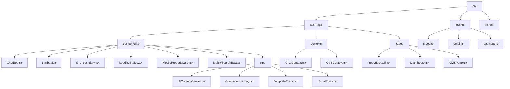

**Diagram sources**
- [src/react-app/components/ChatBot.tsx](file://src/react-app/components/ChatBot.tsx)
- [src/react-app/components/Navbar.tsx](file://src/react-app/components/Navbar.tsx)
- [src/react-app/components/ErrorBoundary.tsx](file://src/react-app/components/ErrorBoundary.tsx)
- [src/react-app/components/LoadingStates.tsx](file://src/react-app/components/LoadingStates.tsx)
- [src/react-app/components/MobilePropertyCard.tsx](file://src/react-app/components/MobilePropertyCard.tsx)
- [src/react-app/components/MobileSearchBar.tsx](file://src/react-app/components/MobileSearchBar.tsx)
- [src/react-app/components/cms/AIContentCreator.tsx](file://src/react-app/components/cms/AIContentCreator.tsx)
- [src/react-app/components/cms/ComponentLibrary.tsx](file://src/react-app/components/cms/ComponentLibrary.tsx)
- [src/react-app/components/cms/TemplateEditor.tsx](file://src/react-app/components/cms/TemplateEditor.tsx)
- [src/react-app/components/cms/VisualEditor.tsx](file://src/react-app/components/cms/VisualEditor.tsx)
- [src/react-app/contexts/ChatContext.tsx](file://src/react-app/contexts/ChatContext.tsx)
- [src/react-app/contexts/CMSContext.tsx](file://src/react-app/contexts/CMSContext.tsx)
- [src/react-app/pages/PropertyDetail.tsx](file://src/react-app/pages/PropertyDetail.tsx)
- [src/react-app/pages/Dashboard.tsx](file://src/react-app/pages/Dashboard.tsx)
- [src/react-app/pages/CMSPage.tsx](file://src/react-app/pages/CMSPage.tsx)

**Section sources**
- [src/react-app/main.tsx](file://src/react-app/main.tsx)
- [src/react-app/App.tsx](file://src/react-app/App.tsx)
- [vite.config.ts](file://vite.config.ts)

## Core Components
The application's core components include the main App component that manages routing and global context providers, the ChatContext for AI chatbot state management, the CMSContext for content management functionality, and key page components like PropertyDetail and Dashboard that handle specific user journeys. The architecture uses React Context for state management rather than external libraries like Redux, with the ChatContext providing a centralized store for chat messages, conversation state, and booking context, while the CMSContext manages content pages, templates, components, and AI-powered content generation. New components include ErrorBoundary for global error handling, LoadingStates for consistent loading experiences, mobile-optimized components for enhanced mobile UX, and CMS components for dynamic content management.

**Section sources**
- [src/react-app/App.tsx](file://src/react-app/App.tsx)
- [src/react-app/contexts/ChatContext.tsx](file://src/react-app/contexts/ChatContext.tsx)
- [src/react-app/contexts/CMSContext.tsx](file://src/react-app/contexts/CMSContext.tsx)
- [src/react-app/components/ErrorBoundary.tsx](file://src/react-app/components/ErrorBoundary.tsx)
- [src/react-app/components/LoadingStates.tsx](file://src/react-app/components/LoadingStates.tsx)
- [src/react-app/pages/PropertyDetail.tsx](file://src/react-app/pages/PropertyDetail.tsx)
- [src/react-app/pages/Dashboard.tsx](file://src/react-app/pages/Dashboard.tsx)
- [src/react-app/pages/CMSPage.tsx](file://src/react-app/pages/CMSPage.tsx)

## Architecture Overview
The frontend architecture follows a component-based React pattern with client-side routing, context-based state management, and direct API consumption. The application bootstraps through main.tsx, which renders the App component within a StrictMode boundary. The App component provides AuthProvider, ChatProvider, and CMSProvider contexts and sets up client-side routing with React Router. The architecture supports both desktop and mobile interfaces with responsive design principles. Global error handling is implemented through ErrorBoundary, and loading states are managed through dedicated components. The CMS functionality enables dynamic page creation and management through the CMSContext and CMSPage components.

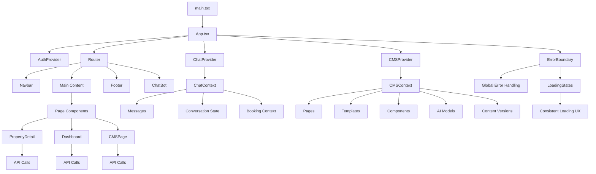

**Diagram sources**
- [src/react-app/main.tsx](file://src/react-app/main.tsx#L1-L11)
- [src/react-app/App.tsx](file://src/react-app/App.tsx#L1-L68)
- [src/react-app/contexts/ChatContext.tsx](file://src/react-app/contexts/ChatContext.tsx#L1-L452)
- [src/react-app/contexts/CMSContext.tsx](file://src/react-app/contexts/CMSContext.tsx#L1-L647)
- [src/react-app/components/ErrorBoundary.tsx](file://src/react-app/components/ErrorBoundary.tsx#L1-L146)
- [src/react-app/components/LoadingStates.tsx](file://src/react-app/components/LoadingStates.tsx#L1-L325)
- [src/react-app/pages/CMSPage.tsx](file://src/react-app/pages/CMSPage.tsx#L1-L105)

## Detailed Component Analysis

### App Component Analysis
The App component serves as the root component that orchestrates the application's structure, routing, and context providers. It wraps the entire application with AuthProvider for authentication state, ChatProvider for AI chatbot functionality, and CMSProvider for content management capabilities. The component uses React Router to define client-side routes for all application pages, enabling seamless navigation without page reloads. The App component now includes ErrorBoundary to catch and handle runtime errors globally and has been updated to include the CMSPage route for dynamic content pages.

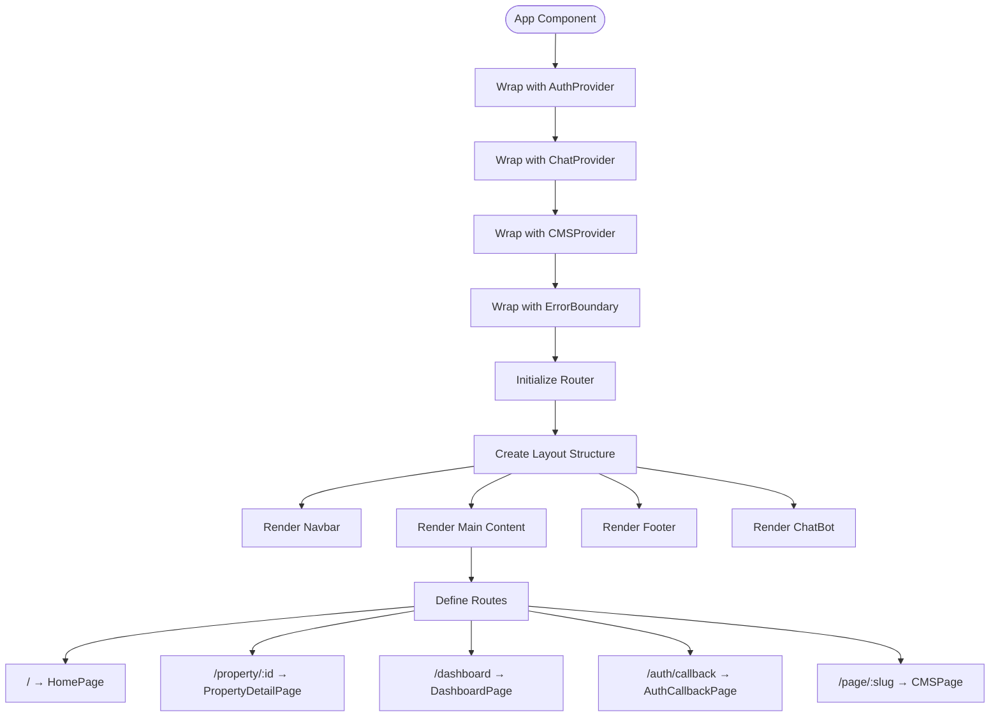

**Diagram sources**
- [src/react-app/App.tsx](file://src/react-app/App.tsx#L1-L68)

**Section sources**
- [src/react-app/App.tsx](file://src/react-app/App.tsx#L1-L68)

### ChatContext Analysis
The ChatContext provides a comprehensive state management solution for the AI chatbot functionality. It manages chat messages, conversation state, voice interaction capabilities, and booking context. The context implements localStorage persistence to maintain conversation state across sessions and includes sophisticated features like speech recognition and synthesis for voice interaction.

```mermaid
classDiagram
class ChatContextType {
+messages : ChatMessage[]
+isOpen : boolean
+isLoading : boolean
+conversationId : string | null
+featuredProperties : Property[]
+currentBooking : Partial<CreateBookingData> | null
+voiceEnabled : boolean
+isListening : boolean
+sendMessage(content : string, action? : string) : Promise~void~
+addMessage(message : ChatMessage) : void
+toggleChat() : void
+closeChat() : void
+openChat() : void
+showPropertyCard(property : Property) : void
+initiateBooking(propertyId : number) : void
+updateBookingData(data : Partial<CreateBookingData>) : void
+handleButtonClick(button : ChatButton) : void
+toggleVoice() : void
+startListening() : void
+stopListening() : void
+clearConversation() : void
}
class ChatProvider {
-messages : ChatMessage[]
-isOpen : boolean
-isLoading : boolean
-conversationId : string | null
-featuredProperties : Property[]
-currentBooking : Partial<CreateBookingData> | null
-voiceEnabled : boolean
-isListening : boolean
-recognition : any
-synthesis : SpeechSynthesis | null
+sendMessage()
+addMessage()
+toggleChat()
+initializeSara()
+saveConversationState()
+fetchFeaturedProperties()
}
ChatProvider --> ChatContextType : "implements"
ChatProvider --> "localStorage" : "persists state"
ChatProvider --> "Web Speech API" : "voice interaction"
ChatProvider --> "/api/chat/enhanced" : "AI integration"
ChatProvider --> "/api/properties/featured" : "data fetching"
```

**Diagram sources**
- [src/react-app/contexts/ChatContext.tsx](file://src/react-app/contexts/ChatContext.tsx#L1-L452)

**Section sources**
- [src/react-app/contexts/ChatContext.tsx](file://src/react-app/contexts/ChatContext.tsx#L1-L452)

### CMSContext Analysis
The CMSContext provides a comprehensive state management solution for the content management system. It manages pages, templates, components, media, AI providers, AI models, and AI content jobs. The context includes methods for CRUD operations on all CMS entities, content versioning, and permission management. It implements API integration for all CMS functionality and includes AI-powered content generation capabilities.

```mermaid
classDiagram
class CMSContextType {
+pages : Page[]
+templates : Template[]
+components : Component[]
+media : Media[]
+aiProviders : AIProvider[]
+aiModels : AIModel[]
+aiJobs : AIContentJob[]
+loading : boolean
+error : string | null
+fetchPages() : Promise~void~
+fetchTemplates() : Promise~void~
+fetchComponents() : Promise~void~
+fetchMedia() : Promise~void~
+fetchAIProviders() : Promise~void~
+fetchAIModels(providerId : number) : Promise~void~
+fetchAIJobs() : Promise~void~
+refreshAIModels(providerId : number) : Promise~void~
+processAIJobs() : Promise~void~
+createPage(page : Omit<Page, 'id' | 'created_at' | 'updated_at'>) : Promise~Page | null~
+updatePage(id : number, page : Partial<Page>) : Promise~Page | null~
+deletePage(id : number) : Promise~boolean~
+createTemplate(template : Omit<Template, 'id' | 'created_at' | 'updated_at'>) : Promise~Template | null~
+updateTemplate(id : number, template : Partial<Template>) : Promise~Template | null~
+deleteTemplate(id : number) : Promise~boolean~
+createComponent(component : Omit<Component, 'id' | 'created_at' | 'updated_at'>) : Promise~Component | null~
+updateComponent(id : number, component : Partial<Component>) : Promise~Component | null~
+deleteComponent(id : number) : Promise~boolean~
+uploadMedia(media : Omit<Media, 'id' | 'created_at'>) : Promise~Media | null~
+deleteMedia(id : number) : Promise~boolean~
+createAIProvider(provider : Omit<AIProvider, 'id' | 'created_at' | 'updated_at'>) : Promise~AIProvider | null~
+updateAIProvider(id : number, provider : Partial<AIProvider>) : Promise~AIProvider | null~
+deleteAIProvider(id : number) : Promise~boolean~
+createAIModel(model : Omit<AIModel, 'id' | 'created_at'>) : Promise~AIModel | null~
+updateAIModel(id : number, model : Partial<AIModel>) : Promise~AIModel | null~
+deleteAIModel(id : number) : Promise~boolean~
+createAIJob(job : Omit<AIContentJob, 'id' | 'created_at' | 'status'>) : Promise~AIContentJob | null~
+updateAIJob(id : number, job : Partial<AIContentJob>) : Promise~AIContentJob | null~
+createContentVersion(version : Omit<ContentVersion, 'id' | 'created_at'>) : Promise~ContentVersion | null~
+getContentVersions(contentId : number, contentType : string) : Promise~ContentVersion[]~
+getUserPermissions() : Promise~string[]~
+getAllPermissions() : Promise~{name : string, description : string}[]~
+checkPermission(permission : string) : Promise~boolean~
+grantPermission(userId : string, permission : string) : Promise~void~
+revokePermission(userId : string, permission : string) : Promise~void~
+getUsersWithPermission(permission : string) : Promise~any[]~
}
class CMSProvider {
-pages : Page[]
-templates : Template[]
-components : Component[]
-media : Media[]
-aiProviders : AIProvider[]
-aiModels : AIModel[]
-aiJobs : AIContentJob[]
-loading : boolean
-error : string | null
+apiCall(url : string, options : RequestInit = {}) : Promise~any~
+fetchPages()
+fetchTemplates()
+fetchComponents()
+fetchMedia()
+fetchAIProviders()
+fetchAIModels()
+fetchAIJobs()
+refreshAIModels()
+processAIJobs()
+createPage()
+updatePage()
+deletePage()
+createTemplate()
+updateTemplate()
+deleteTemplate()
+createComponent()
+updateComponent()
+deleteComponent()
+uploadMedia()
+deleteMedia()
+createAIProvider()
+updateAIProvider()
+deleteAIProvider()
+createAIModel()
+updateAIModel()
+deleteAIModel()
+createAIJob()
+updateAIJob()
+createContentVersion()
+getContentVersions()
+getUserPermissions()
+getAllPermissions()
+checkPermission()
+grantPermission()
+revokePermission()
+getUsersWithPermission()
}
CMSProvider --> CMSContextType : "implements"
CMSProvider --> "/api/cms/pages" : "data fetching"
CMSProvider --> "/api/cms/templates" : "data fetching"
CMSProvider --> "/api/cms/components" : "data fetching"
CMSProvider --> "/api/cms/media" : "data fetching"
CMSProvider --> "/api/cms/ai/providers" : "AI integration"
CMSProvider --> "/api/cms/ai/models" : "AI integration"
CMSProvider --> "/api/cms/ai/jobs" : "AI integration"
CMSProvider --> "/api/cms/content-versions" : "versioning"
CMSProvider --> "/api/cms/permissions" : "permission management"
```

**Diagram sources**
- [src/react-app/contexts/CMSContext.tsx](file://src/react-app/contexts/CMSContext.tsx#L1-L647)

**Section sources**
- [src/react-app/contexts/CMSContext.tsx](file://src/react-app/contexts/CMSContext.tsx#L1-L647) - *Added in recent commit*

### PropertyDetail Page Analysis
The PropertyDetail page provides a comprehensive view of individual properties, including images, amenities, host information, and booking functionality. The component manages its own state for image galleries, wishlist status, and booking forms. It integrates with authentication to control access to booking features and uses direct API calls to fetch property data and manage wishlist operations.

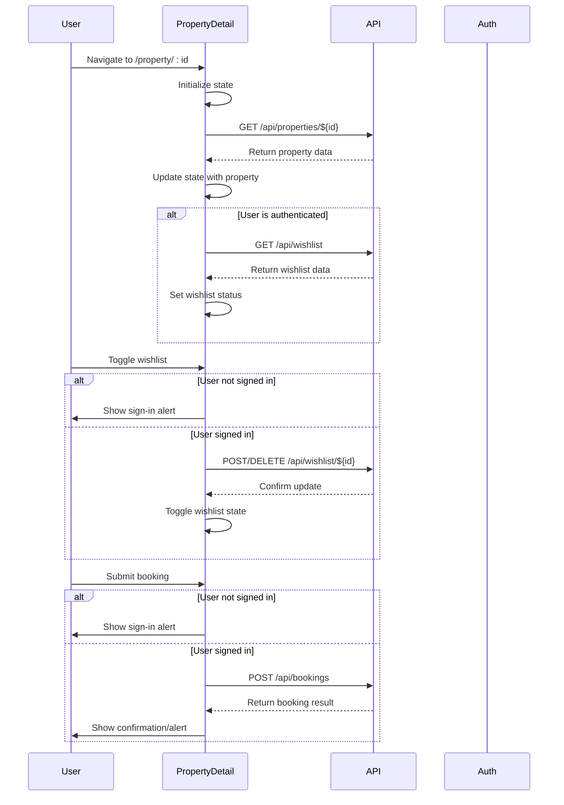

**Diagram sources**
- [src/react-app/pages/PropertyDetail.tsx](file://src/react-app/pages/PropertyDetail.tsx#L1-L562)

**Section sources**
- [src/react-app/pages/PropertyDetail.tsx](file://src/react-app/pages/PropertyDetail.tsx#L1-L562)

### Dashboard Page Analysis
The Dashboard page serves as the central hub for authenticated users, providing an overview of their properties, bookings, and earnings. The component uses authentication state to control access and redirects unauthenticated users to the login page. It fetches data from multiple endpoints to populate statistics and recent activity sections, demonstrating the application's data aggregation capabilities.

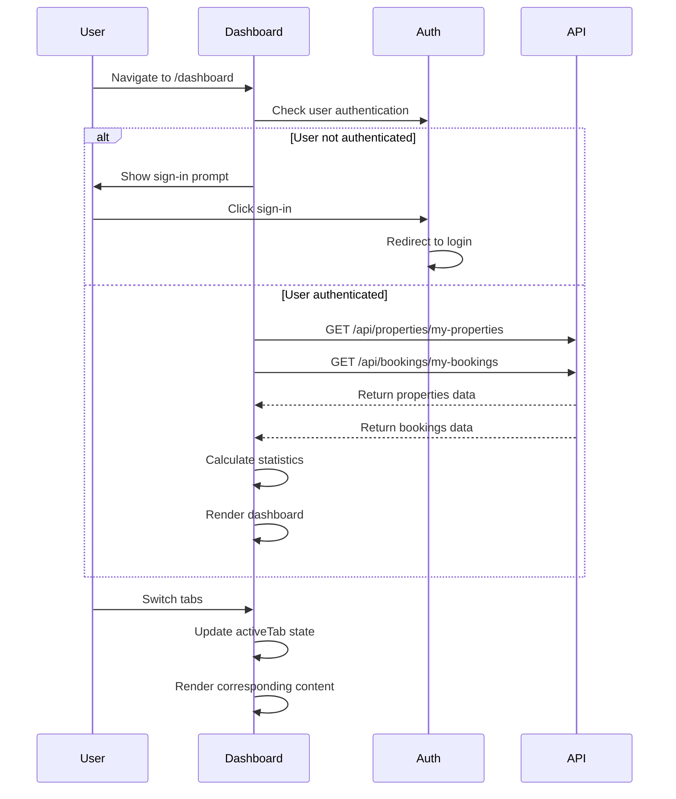

**Diagram sources**
- [src/react-app/pages/Dashboard.tsx](file://src/react-app/pages/Dashboard.tsx#L1-L485)

**Section sources**
- [src/react-app/pages/Dashboard.tsx](file://src/react-app/pages/Dashboard.tsx#L1-L485)

### CMSPage Component Analysis
The CMSPage component renders dynamic content pages created through the CMS system. It uses the page slug from the URL to fetch the corresponding page content from the CMS API. The component handles loading states, error conditions, and displays the page content with proper styling. It supports SEO metadata and provides a fallback for non-existent pages.

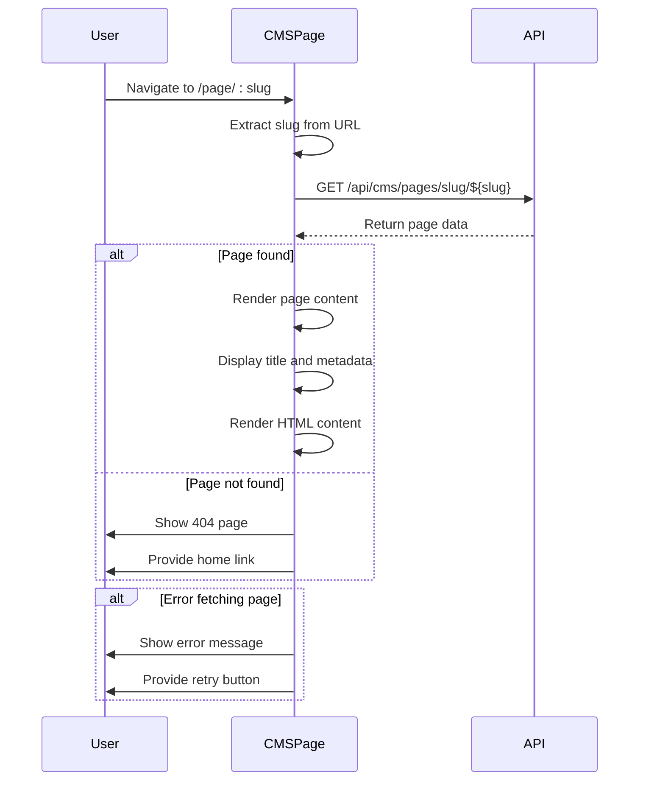

**Diagram sources**
- [src/react-app/pages/CMSPage.tsx](file://src/react-app/pages/CMSPage.tsx#L1-L105)

**Section sources**
- [src/react-app/pages/CMSPage.tsx](file://src/react-app/pages/CMSPage.tsx#L1-L105) - *Added in recent commit*

### ChatBot Component Analysis
The ChatBot component provides the user interface for interacting with the AI assistant Sara. It renders chat messages, input controls, and interactive elements like property cards and action buttons. The component integrates with the ChatContext to access message state and dispatch actions, creating a seamless conversational interface with rich media elements.

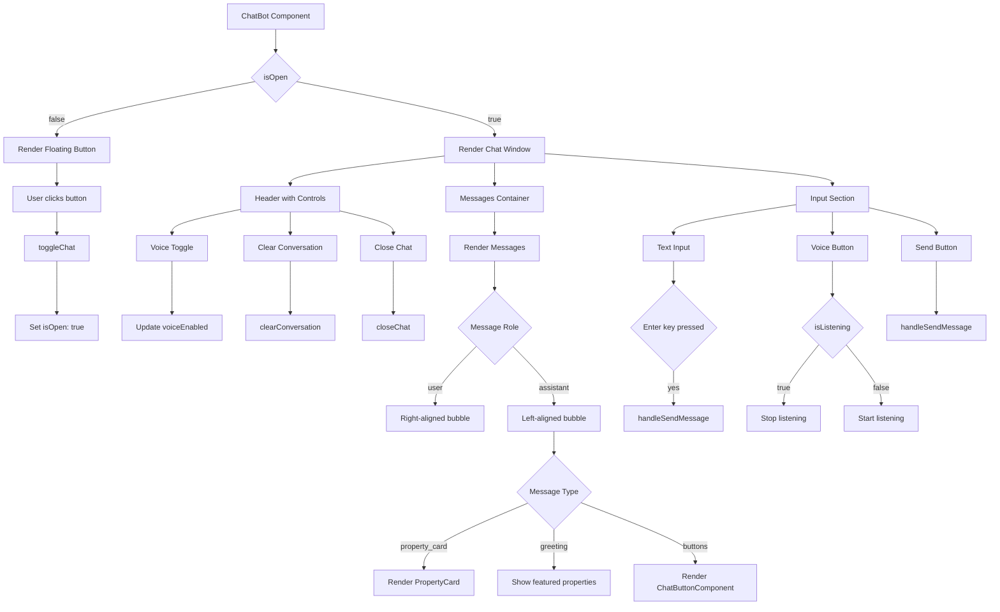

**Diagram sources**
- [src/react-app/components/ChatBot.tsx](file://src/react-app/components/ChatBot.tsx#L1-L452)

**Section sources**
- [src/react-app/components/ChatBot.tsx](file://src/react-app/components/ChatBot.tsx#L1-L452)

### BookingModal Component Analysis
The BookingModal component has been updated with enhanced UI and responsive styling. It now utilizes the responsiveClasses utility for consistent responsive design across breakpoints and the cn utility for class name composition. The modal implements a multi-step booking process with form validation, price calculation, and integration with the PaymentModal for secure payment processing.

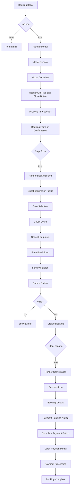

**Diagram sources**
- [src/react-app/components/BookingModal.tsx](file://src/react-app/components/BookingModal.tsx#L1-L490)
- [src/react-app/utils/responsive.ts](file://src/react-app/utils/responsive.ts#L1-L189)

**Section sources**
- [src/react-app/components/BookingModal.tsx](file://src/react-app/components/BookingModal.tsx#L1-L490) - *Updated in recent commit*
- [src/react-app/utils/responsive.ts](file://src/react-app/utils/responsive.ts#L1-L189) - *Updated in recent commit*
- [src/react-app/components/PaymentModal.tsx](file://src/react-app/components/PaymentModal.tsx#L1-L167)

### ErrorBoundary Component Analysis
The ErrorBoundary component provides global error handling for the application, catching JavaScript errors anywhere in the component tree and displaying a fallback UI. It implements a user-friendly error interface with retry and navigation options, and includes development-mode error details for debugging. The component uses responsiveClasses for consistent styling and integrates with the application's design system.

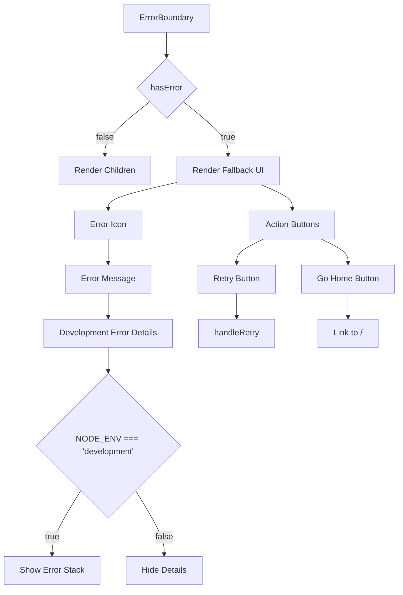

**Diagram sources**
- [src/react-app/components/ErrorBoundary.tsx](file://src/react-app/components/ErrorBoundary.tsx#L1-L146)

**Section sources**
- [src/react-app/components/ErrorBoundary.tsx](file://src/react-app/components/ErrorBoundary.tsx#L1-L146) - *Added in recent commit*

### LoadingStates Component Analysis
The LoadingStates component provides a suite of loading indicators and skeletons for consistent user experience during data fetching. It includes LoadingSpinner, LoadingState, Skeleton, EmptyState, NetworkError, and specialized skeletons for property cards and form fields. The components use responsiveClasses for adaptive design across devices.

```mermaid
classDiagram
class LoadingSpinner {
+size : 'sm'|'md'|'lg'|'xl'
+color : 'primary'|'white'|'gray'
+render() : JSX.Element
}
class LoadingState {
+type : 'page'|'section'|'inline'|'overlay'
+message : string
+render() : JSX.Element
}
class Skeleton {
+variant : 'text'|'circular'|'rectangular'
+width : string|number
+height : string|number
+lines : number
+render() : JSX.Element
}
class EmptyState {
+title : string
+description : string
+action : {label : string, onClick : function}
+render() : JSX.Element
}
class NetworkError {
+onRetry : function
+render() : JSX.Element
}
class PropertyCardSkeleton {
+render() : JSX.Element
}
class FormFieldSkeleton {
+render() : JSX.Element
}
```

**Diagram sources**
- [src/react-app/components/LoadingStates.tsx](file://src/react-app/components/LoadingStates.tsx#L1-L325)

**Section sources**
- [src/react-app/components/LoadingStates.tsx](file://src/react-app/components/LoadingStates.tsx#L1-L325) - *Added in recent commit*

### MobilePropertyCard Component Analysis
The MobilePropertyCard component provides an optimized property listing card for mobile devices with two view modes (grid and list). It includes touch-optimized controls for wishlist and sharing, responsive layout, and performance features like image loading states. The component uses responsiveClasses and utility functions for consistent mobile UX.

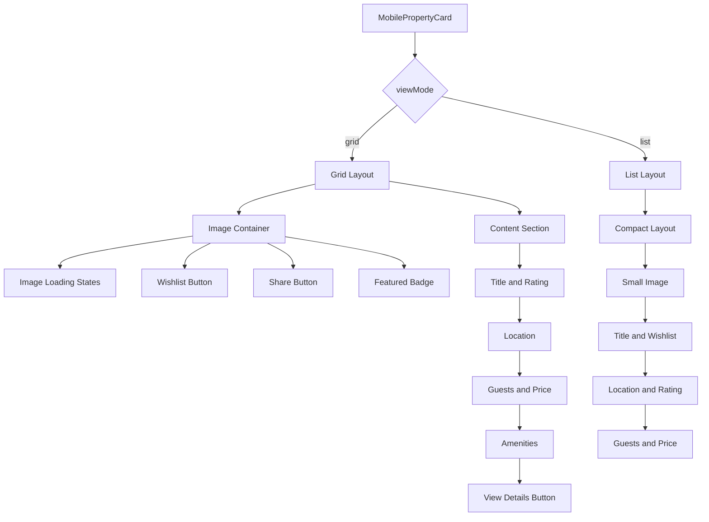

**Diagram sources**
- [src/react-app/components/MobilePropertyCard.tsx](file://src/react-app/components/MobilePropertyCard.tsx#L1-L293)

**Section sources**
- [src/react-app/components/MobilePropertyCard.tsx](file://src/react-app/components/MobilePropertyCard.tsx#L1-L293) - *Added in recent commit*

### MobileSearchBar Component Analysis
The MobileSearchBar component provides a mobile-optimized search interface with a bottom-sheet filter modal. It includes touch-friendly controls, keyboard handling, and safe area awareness for modern mobile devices. The component manages search state and filter parameters with a clean, intuitive interface.

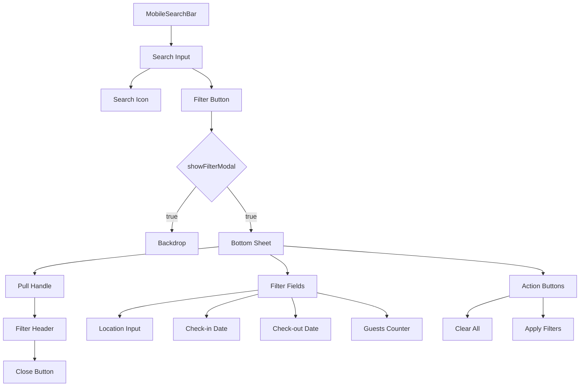

**Diagram sources**
- [src/react-app/components/MobileSearchBar.tsx](file://src/react-app/components/MobileSearchBar.tsx#L1-L262)

**Section sources**
- [src/react-app/components/MobileSearchBar.tsx](file://src/react-app/components/MobileSearchBar.tsx#L1-L262) - *Added in recent commit*

## Dependency Analysis
The frontend application has a well-defined dependency structure with clear separation of concerns. The component hierarchy flows from the App component down to specific page and utility components, with context providers enabling state sharing across distant components. The application uses several external libraries for UI components, routing, and authentication. New dependencies include enhanced error handling, loading state components, and CMS functionality with AI-powered content generation.

```mermaid
graph TD
A[react] --> B[App.tsx]
A --> C[main.tsx]
D[react-router] --> B
E[@getmocha/users-service/react] --> B
E --> F[Navbar.tsx]
F --> B
G[lucide-react] --> F
G --> H[ChatBot.tsx]
G --> I[PropertyDetail.tsx]
G --> J[BookingModal.tsx]
G --> K[ErrorBoundary.tsx]
G --> L[LoadingStates.tsx]
G --> M[VisualEditor.tsx]
G --> N[AIContentCreator.tsx]
H --> B
I --> B
J --> B
K --> B
L --> B
M --> B
N --> B
O[clsx] --> K
P[@radix-ui/react-dialog] --> J
Q[@radix-ui/react-form] --> J
R[clsx] --> J
S[vite] --> T[vite.config.ts]
T --> U[tailwindcss]
U --> V[tailwind.config.js]
B --> W[ChatContext.tsx]
B --> X[CMSContext.tsx]
W --> H
W --> I
W --> Y[Dashboard.tsx]
W --> J
X --> Z[CMSPage.tsx]
X --> M
X --> N
J --> AA[PaymentModal.tsx]
B --> AB[ErrorBoundary.tsx]
B --> AC[LoadingStates.tsx]
AC --> AD[MobilePropertyCard.tsx]
AC --> AE[MobileSearchBar.tsx]
```

**Diagram sources**
- [package.json](file://package.json)
- [vite.config.ts](file://vite.config.ts#L1-L22)
- [tailwind.config.js](file://tailwind.config.js)
- [src/react-app/components/BookingModal.tsx](file://src/react-app/components/BookingModal.tsx#L1-L490)
- [src/react-app/components/ErrorBoundary.tsx](file://src/react-app/components/ErrorBoundary.tsx#L1-L146)
- [src/react-app/components/LoadingStates.tsx](file://src/react-app/components/LoadingStates.tsx#L1-L325)
- [src/react-app/pages/CMSPage.tsx](file://src/react-app/pages/CMSPage.tsx#L1-L105)
- [src/react-app/components/cms/VisualEditor.tsx](file://src/react-app/components/cms/VisualEditor.tsx#L1-L849)
- [src/react-app/components/cms/AIContentCreator.tsx](file://src/react-app/components/cms/AIContentCreator.tsx#L1-L351)

**Section sources**
- [vite.config.ts](file://vite.config.ts#L1-L22)
- [tailwind.config.js](file://tailwind.config.js)
- [src/react-app/components/BookingModal.tsx](file://src/react-app/components/BookingModal.tsx#L1-L490) - *Updated in recent commit*
- [src/react-app/components/ErrorBoundary.tsx](file://src/react-app/components/ErrorBoundary.tsx#L1-L146) - *Added in recent commit*
- [src/react-app/components/LoadingStates.tsx](file://src/react-app/components/LoadingStates.tsx#L1-L325) - *Added in recent commit*
- [src/react-app/pages/CMSPage.tsx](file://src/react-app/pages/CMSPage.tsx#L1-L105) - *Added in recent commit*
- [src/react-app/contexts/CMSContext.tsx](file://src/react-app/contexts/CMSContext.tsx#L1-L647) - *Added in recent commit*

## Performance Considerations
The application implements several performance optimizations to ensure a responsive user experience. The Vite configuration includes a chunk size warning limit of 5000KB, encouraging code splitting and bundle optimization. The ChatContext implements localStorage persistence to reduce redundant API calls for conversation state. The property detail page uses lazy loading for images and implements efficient state management to minimize re-renders. The updated BookingModal component uses responsiveClasses for consistent styling and the cn utility for optimized class name composition, reducing CSS bloat and improving rendering performance. New loading states and skeletons provide immediate visual feedback during data fetching, enhancing perceived performance. The CMS functionality includes content versioning and caching mechanisms to minimize redundant API calls for frequently accessed content.

## Troubleshooting Guide
Common issues in the application typically relate to authentication state, API connectivity, chatbot functionality, and CMS operations. For authentication issues, verify that the AuthProvider is properly configured and that user session state is being maintained. For API connectivity problems, check network requests in the browser developer tools and verify endpoint URLs. For chatbot issues, ensure that the Web Speech API is supported in the user's browser and that the /api/chat/enhanced endpoint is accessible. The localStorage key 'habibistay_chat_state' can be inspected or cleared to resolve conversation state issues. For BookingModal issues, verify that the responsiveClasses and cn utilities are properly imported and that form validation is correctly configured. For error handling issues, check that ErrorBoundary is properly wrapped around components and that error details are visible in development mode. For CMS-related issues, verify that the CMSContext is properly initialized and that the /api/cms endpoints are accessible. Check that AI providers are properly configured and enabled for AI-powered content generation features.

**Section sources**
- [src/react-app/contexts/ChatContext.tsx](file://src/react-app/contexts/ChatContext.tsx#L1-L452)
- [src/react-app/contexts/CMSContext.tsx](file://src/react-app/contexts/CMSContext.tsx#L1-L647)
- [src/react-app/components/ChatBot.tsx](file://src/react-app/components/ChatBot.tsx#L1-L452)
- [src/react-app/main.tsx](file://src/react-app/main.tsx#L1-L11)
- [src/react-app/components/BookingModal.tsx](file://src/react-app/components/BookingModal.tsx#L1-L490)
- [src/react-app/components/ErrorBoundary.tsx](file://src/react-app/components/ErrorBoundary.tsx#L1-L146)
- [src/react-app/components/LoadingStates.tsx](file://src/react-app/components/LoadingStates.tsx#L1-L325)
- [src/react-app/pages/CMSPage.tsx](file://src/react-app/pages/CMSPage.tsx#L1-L105)

## Conclusion
The HabibiStay frontend architecture demonstrates a well-structured React application with effective use of context for state management and clean separation of concerns. The integration of an AI-powered chatbot enhances the user experience while maintaining a consistent design system through Tailwind CSS. The application's reliance on client-side routing and direct API consumption creates a responsive single-page application experience. Recent updates to the BookingModal component have improved the user interface with responsive styling and enhanced accessibility. New components for error handling, loading states, and mobile optimization significantly improve reliability and user experience. The addition of the CMS functionality with AI-powered content generation represents a significant enhancement to the platform's capabilities, enabling dynamic content creation and management. Future improvements could include implementing code splitting for better initial load performance, adding TypeScript interfaces for better type safety, enhancing error handling for more robust user feedback, and expanding the CMS functionality with additional AI-powered features.

**Section sources**
- [src/react-app/App.tsx](file://src/react-app/App.tsx#L1-L68)
- [src/react-app/contexts/CMSContext.tsx](file://src/react-app/contexts/CMSContext.tsx#L1-L647)
- [src/react-app/pages/CMSPage.tsx](file://src/react-app/pages/CMSPage.tsx#L1-L105)