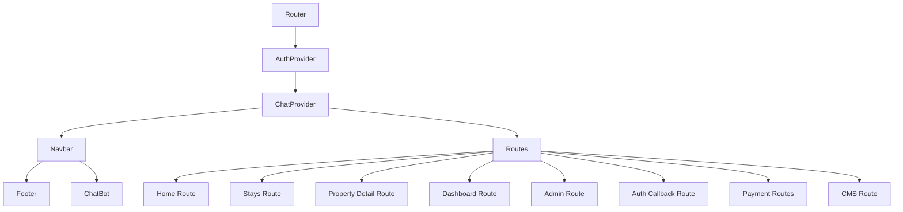
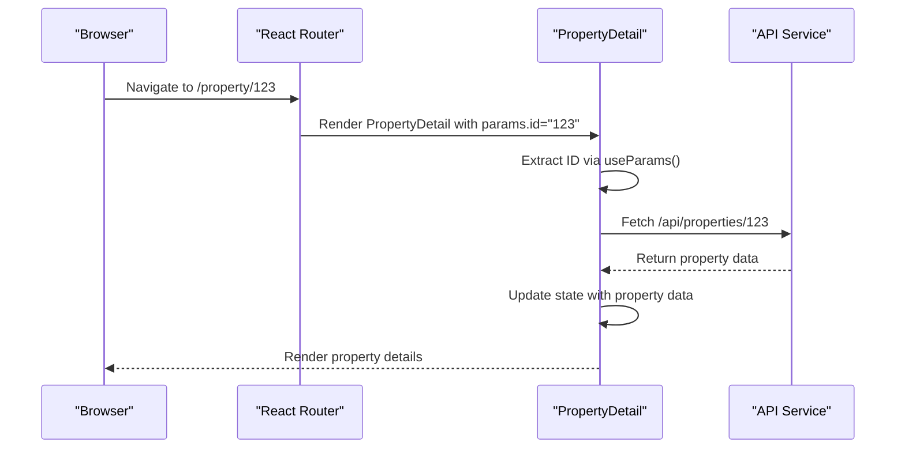
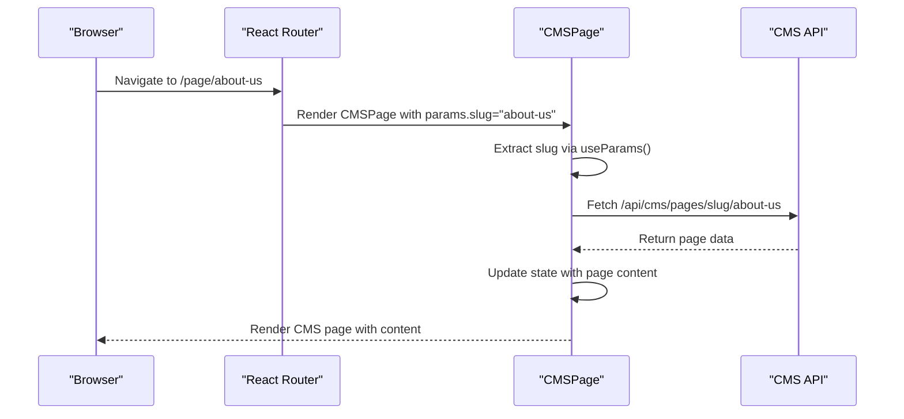
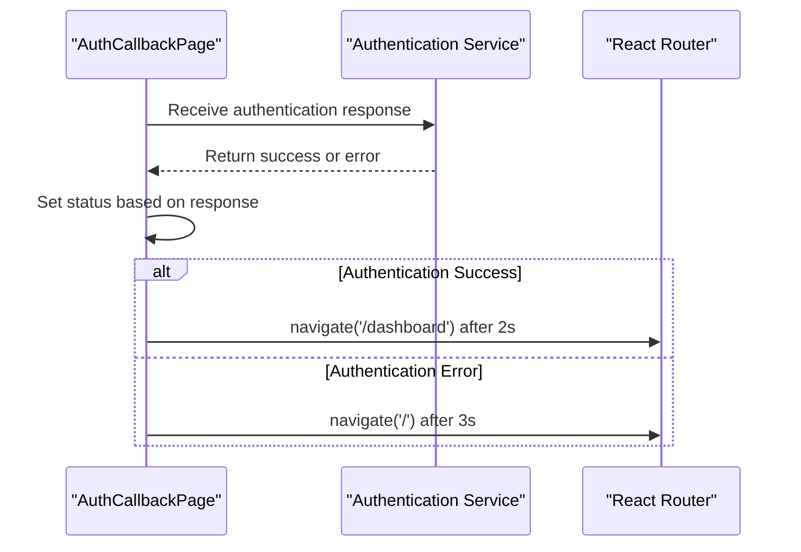
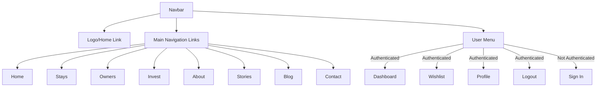
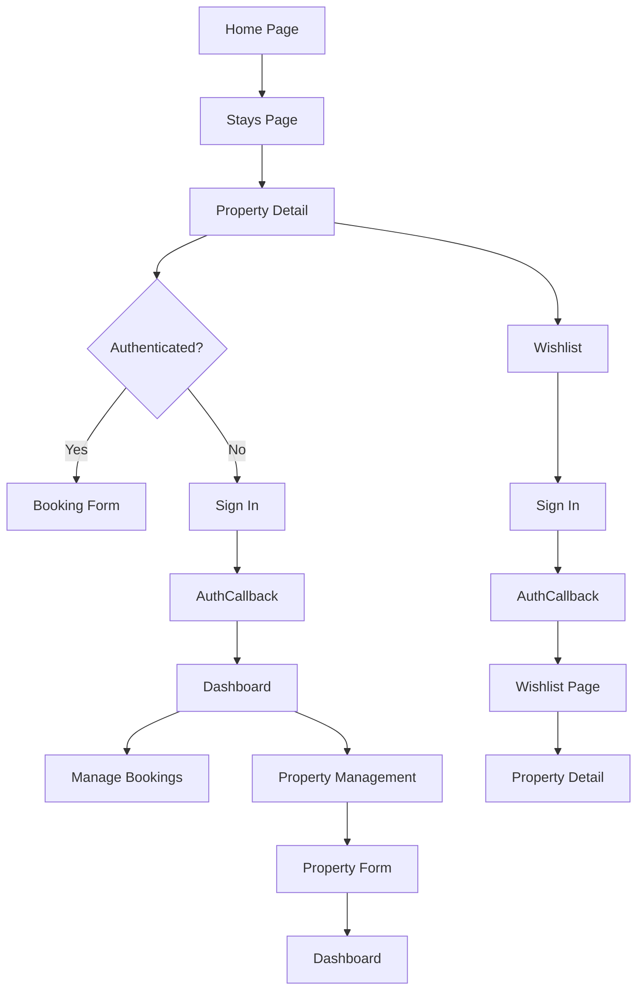

# Routing & Navigation

<cite>
**Referenced Files in This Document**   
- [App.tsx](file://src/react-app/App.tsx) - *Updated with CMS route*
- [PropertyDetail.tsx](file://src/react-app/pages/PropertyDetail.tsx)
- [Dashboard.tsx](file://src/react-app/pages/Dashboard.tsx)
- [Stays.tsx](file://src/react-app/pages/Stays.tsx)
- [AuthCallback.tsx](file://src/react-app/pages/AuthCallback.tsx)
- [PropertyForm.tsx](file://src/react-app/pages/PropertyForm.tsx)
- [Navbar.tsx](file://src/react-app/components/Navbar.tsx)
- [WishlistPage.tsx](file://src/react-app/pages/WishlistPage.tsx)
- [CMSPage.tsx](file://src/react-app/pages/CMSPage.tsx) - *Added in recent commit*
- [CMSContext.tsx](file://src/react-app/contexts/CMSContext.tsx) - *Added CMS context*
</cite>

## Update Summary
**Changes Made**   
- Added documentation for new CMSPage route and dynamic CMS routing
- Updated route configuration section to include CMS route
- Added new section for CMS routing implementation
- Updated diagram sources to reflect new CMS implementation
- Enhanced source tracking with new CMS-related files

## Table of Contents
1. [Introduction](#introduction)
2. [Route Configuration](#route-configuration)
3. [Dynamic Routing](#dynamic-routing)
4. [CMS Routing Implementation](#cms-routing-implementation)
5. [Protected Routes & Authentication Guards](#protected-routes--authentication-guards)
6. [Programmatic Navigation](#programmatic-navigation)
7. [Navigation Components](#navigation-components)
8. [User Journey & State Management](#user-journey--state-management)
9. [SEO Implications](#seo-implications)
10. [Performance Optimization](#performance-optimization)

## Introduction
This document provides a comprehensive overview of the client-side routing and navigation system in the HabibiStay application. The routing architecture is built on React Router, enabling seamless navigation between key pages including Home, Stays, PropertyDetail, Dashboard, and other user-facing components. The system implements declarative route definitions, dynamic routing for property details, protected routes for authenticated users, and programmatic navigation for complex user flows. This documentation explains the implementation details, user journey across pages, and opportunities for performance optimization.

## Route Configuration
The application's routing system is configured in the App.tsx file using React Router's BrowserRouter, Routes, and Route components. The router is wrapped with AuthProvider and ChatProvider to ensure authentication and chat context are available throughout the application.



**Diagram sources**
- [App.tsx](file://src/react-app/App.tsx#L1-L77)

**Section sources**
- [App.tsx](file://src/react-app/App.tsx#L1-L77)

The route configuration defines both static and dynamic routes for the application:

- **Static Routes**: Home (/), Stays (/stays), Owners (/owners), Invest (/invest), About (/about), Stories (/stories), Blog (/blog), Contact (/contact), Privacy (/privacy), Terms (/terms), Cookies (/cookies)
- **Dynamic Routes**: Property Detail (/property/:id), Property Form (/properties/new, /properties/:id/edit), CMS Pages (/page/:slug)
- **Authentication Routes**: Auth Callback (/auth/callback), Dashboard (/dashboard), Admin (/admin), Profile (/profile), Wishlist (/wishlist)
- **Payment Routes**: Payment Success (/payment/success), Payment Cancel (/payment/cancel)

The routing structure follows a logical organization that separates public content from user-specific and administrative functionality. The recent addition of the CMSPage route enables dynamic content management system pages to be served through the same routing infrastructure.

## Dynamic Routing
Dynamic routing is implemented for property details and property management, allowing the application to display specific property information based on URL parameters.

### Property Detail Routing
The PropertyDetail page uses dynamic routing to display information about individual properties based on their ID parameter in the URL.



**Diagram sources**
- [App.tsx](file://src/react-app/App.tsx#L40)
- [PropertyDetail.tsx](file://src/react-app/pages/PropertyDetail.tsx#L10)

**Section sources**
- [App.tsx](file://src/react-app/App.tsx#L40)
- [PropertyDetail.tsx](file://src/react-app/pages/PropertyDetail.tsx#L1-L199)

The dynamic route is defined in App.tsx:
```jsx
<Route path="/property/:id" element={<PropertyDetailPage />} />
```

In the PropertyDetail component, the ID parameter is extracted using React Router's useParams hook:
```typescript
const { id } = useParams<{ id: string }>();
```

The component then uses this ID to fetch the specific property data from the API endpoint `/api/properties/${id}`. This implementation allows for clean, shareable URLs for individual properties while maintaining a single component to handle all property detail views.

### Property Management Routing
The application also implements dynamic routing for property management, with a single PropertyForm component handling both creation and editing of properties:

```jsx
<Route path="/properties/new" element={<PropertyFormPage />} />
<Route path="/properties/:id/edit" element={<PropertyFormPage />} />
```

The PropertyForm component determines whether it's in create or edit mode by checking the presence of the ID parameter:
```typescript
const { id } = useParams<{ id: string }>();
const isEditing = !!id;
```

When editing an existing property, the component fetches the property data using the ID parameter and pre-fills the form fields. This approach reduces code duplication by using a single component for both operations.

## CMS Routing Implementation
The application has been enhanced with a Content Management System (CMS) that enables dynamic page creation and management through the CMSPage component. This new routing feature allows for flexible content management without requiring code changes for new pages.

### CMS Route Configuration
The CMS route is configured in App.tsx to handle dynamic page slugs:
```jsx
<Route path="/page/:slug" element={<CMSPage />} />
```

This route uses the :slug parameter to identify pages by their SEO-friendly URL slugs rather than numeric IDs, improving both user experience and search engine optimization.

### CMS Page Implementation
The CMSPage component implements dynamic content loading based on the URL slug parameter:



**Diagram sources**
- [App.tsx](file://src/react-app/App.tsx#L76)
- [CMSPage.tsx](file://src/react-app/pages/CMSPage.tsx#L5)

**Section sources**
- [App.tsx](file://src/react-app/App.tsx#L76)
- [CMSPage.tsx](file://src/react-app/pages/CMSPage.tsx#L1-L104)
- [CMSContext.tsx](file://src/react-app/contexts/CMSContext.tsx#L1-L647)

In the CMSPage component, the slug parameter is extracted using React Router's useParams hook:
```typescript
const { slug } = useParams<{ slug: string }>();
```

The component then uses this slug to fetch the specific page data from the CMS API endpoint `/api/cms/pages/slug/${slug}`. The CMS context provides additional functionality for content management, including page creation, updating, and deletion, as well as template and component management.

The CMS implementation supports:
- Dynamic page content loading by slug
- Rich text content rendering with HTML support
- SEO metadata handling through page metadata
- Error handling for non-existent pages
- Loading states during content retrieval

This approach enables content editors to create and manage pages without developer intervention, while maintaining a consistent user experience across the application.

## Protected Routes & Authentication Guards
The application implements protected routes for pages that require user authentication, such as Dashboard, Profile, Wishlist, and administrative functionality. Unlike traditional route guards, the protection is implemented at the component level rather than through a dedicated ProtectedRoute component.

### Authentication State Management
The application uses the @getmocha/users-service/react library's useAuth hook to manage authentication state across components. The hook provides access to the user object and authentication methods:

```typescript
const { user, redirectToLogin, logout } = useAuth();
```

### Component-Level Protection
Protected routes are implemented by checking the user authentication state within each component that requires protection. When a user attempts to access a protected page without being authenticated, they are presented with a sign-in prompt and automatically redirected after authentication.

**Dashboard Protection Example:**
```mermaid
flowchart TD
A[User navigates to /dashboard] --> B{User authenticated?}
B --> |No| C[Display sign-in prompt]
C --> D[User clicks sign-in]
D --> E[redirectToLogin() called]
E --> F[Redirect to authentication service]
F --> G[AuthCallback page]
G --> H[Process authentication]
H --> I[Redirect to /dashboard]
B --> |Yes| J[Render dashboard content]
```

**Diagram sources**
- [Dashboard.tsx](file://src/react-app/pages/Dashboard.tsx#L19)
- [AuthCallback.tsx](file://src/react-app/pages/AuthCallback.tsx#L6)

**Section sources**
- [Dashboard.tsx](file://src/react-app/pages/Dashboard.tsx#L1-L199)
- [WishlistPage.tsx](file://src/react-app/pages/WishlistPage.tsx#L1-L199)

The Dashboard component implements protection as follows:
```typescript
useEffect(() => {
  if (!user) {
    redirectToLogin();
    return;
  }
  fetchDashboardData();
}, [user, redirectToLogin]);
```

If the user is not authenticated, the component calls `redirectToLogin()` which redirects the user to the authentication service. After successful authentication, the AuthCallback page processes the response and redirects back to the dashboard.

### Protected Pages
The following pages implement authentication guards:
- **Dashboard** (/dashboard): User dashboard with property and booking management
- **Profile** (/profile): User profile management
- **Wishlist** (/wishlist): User's saved properties
- **Admin** (/admin): Administrative functionality
- **PropertyForm** (/properties/new, /properties/:id/edit): Property creation and editing

Each of these components follows the same pattern of checking the user authentication state and either rendering the content or prompting for authentication.

## Programmatic Navigation
The application implements programmatic navigation in several scenarios where navigation occurs as a result of user actions or application events, rather than direct link clicks.

### useNavigate Hook Implementation
Programmatic navigation is handled using React Router's useNavigate hook, which provides a function to navigate to different routes programmatically.

**AuthCallback Navigation:**


**Diagram sources**
- [AuthCallback.tsx](file://src/react-app/pages/AuthCallback.tsx#L6)
- [PropertyForm.tsx](file://src/react-app/pages/PropertyForm.tsx#L18)

**Section sources**
- [AuthCallback.tsx](file://src/react-app/pages/AuthCallback.tsx#L1-L106)
- [PropertyForm.tsx](file://src/react-app/pages/PropertyForm.tsx#L1-L199)

The AuthCallback page uses programmatic navigation to redirect users after processing the authentication response:
```typescript
const navigate = useNavigate();

// After successful authentication
setTimeout(() => navigate('/dashboard'), 2000);

// After authentication error
setTimeout(() => navigate('/'), 3000);
```

### Form Submission Navigation
The PropertyForm component uses programmatic navigation to redirect users after successfully creating or updating a property:
```typescript
const handleSubmit = async (e: React.FormEvent) => {
  e.preventDefault();
  setSaving(true);

  try {
    // API call to create/update property
    const response = await fetch(url, { method, body });
    const data = await response.json();
    
    if (data.success) {
      navigate('/dashboard?tab=properties');
    }
  } catch (error) {
    console.error('Error saving property:', error);
  } finally {
    setSaving(false);
  }
};
```

After a successful form submission, the user is redirected to the dashboard with the properties tab active, providing a seamless user experience.

### Back Navigation
The PropertyForm also implements back navigation using programmatic routing:
```typescript
<button
  onClick={() => navigate('/dashboard?tab=properties')}
  className="inline-flex items-center text-gray-600 hover:text-[#2957c3] mb-4 transition-colors"
>
  <ArrowLeft className="h-5 w-5 mr-2" />
  Back to Properties
</button>
```

This allows users to return to the dashboard without using the browser's back button, maintaining the application's navigation flow.

## Navigation Components
The application implements navigation through both dedicated navigation components and contextual navigation elements.

### Navbar Component
The primary navigation is handled by the Navbar component, which provides access to key sections of the application.



**Diagram sources**
- [Navbar.tsx](file://src/react-app/components/Navbar.tsx#L1-L199)

**Section sources**
- [Navbar.tsx](file://src/react-app/components/Navbar.tsx#L1-L199)

The Navbar component uses React Router's Link component for navigation:
```jsx
<Link to="/" className="flex items-center space-x-2">
  
  <span className="text-xl font-bold text-[#2957c3]">HabibiStay</span>
</Link>
```

The component also uses the useLocation hook to determine the current route and highlight the active navigation item:
```typescript
const location = useLocation();

const isActive = (href: string) => {
  return location.pathname === href;
};
```

### Contextual Navigation
In addition to the main navigation, the application provides contextual navigation elements throughout various pages:

- **Property Cards**: Clicking on a property card in the Stays page navigates to the corresponding property detail page
- **Wishlist Button**: Allows users to save properties to their wishlist, with navigation to sign-in when not authenticated
- **Call-to-Action Buttons**: Various pages include buttons that navigate to key sections (e.g., "Browse Properties" on the Wishlist page)

These navigation elements enhance the user experience by providing multiple pathways through the application.

## User Journey & State Management
The routing system supports a comprehensive user journey from discovery to booking and management, with careful consideration of state preservation during navigation.

### User Journey Flow


**Diagram sources**
- [App.tsx](file://src/react-app/App.tsx#L1-L77)
- [AuthCallback.tsx](file://src/react-app/pages/AuthCallback.tsx#L1-L106)

**Section sources**
- [App.tsx](file://src/react-app/App.tsx#L1-L77)
- [AuthCallback.tsx](file://src/react-app/pages/AuthCallback.tsx#L1-L106)

### State Preservation
The application handles state preservation during navigation through several mechanisms:

1. **URL Parameters**: Search filters on the Stays page are maintained in the URL, allowing users to share search results
2. **Component State**: Form data in the PropertyForm is preserved in component state during editing
3. **Context API**: Chat context and authentication state are preserved across navigation through React Context
4. **Browser History**: React Router maintains the browser history stack, enabling standard back/forward navigation

The AuthCallback page demonstrates state preservation during the authentication flow:
```typescript
// After successful authentication, user is redirected to dashboard
// The authentication state is preserved through the redirect
setTimeout(() => navigate('/dashboard'), 2000);
```

### Navigation Guards and User Experience
The application implements navigation guards that balance security with user experience:

- Users attempting to access protected routes are not immediately redirected but are shown a sign-in prompt with context
- After authentication, users are redirected to their intended destination rather than the home page
- Error states in the authentication flow include automatic redirection with visual feedback

This approach ensures that users understand why they're being asked to authenticate and where they'll be taken after successful authentication.

## SEO Implications
The client-side routing implementation has several SEO implications that should be considered for production deployment.

### Current Limitations
- **Client-Side Rendering**: The application relies on client-side rendering, which can impact SEO as search engine crawlers may not execute JavaScript to render content
- **Dynamic Content**: Property details are loaded dynamically after the initial page render, potentially affecting indexing
- **Meta Tags**: The implementation does not show dynamic meta tag updates for different pages, which are important for SEO

### Recommendations
1. **Implement Server-Side Rendering (SSR)**: Consider using a framework like Next.js to enable SSR for better SEO
2. **Dynamic Meta Tags**: Implement react-helmet or similar library to update page titles, descriptions, and Open Graph tags for each route
3. **Sitemap Generation**: Create a dynamic sitemap.xml that includes all property pages and key content
4. **Structured Data**: Implement JSON-LD structured data for properties, reviews, and organization to enhance search results
5. **Canonical URLs**: Ensure proper canonical URL implementation to prevent duplicate content issues

The current routing structure with descriptive URLs (e.g., /property/123, /page/about-us) is SEO-friendly, but the client-side rendering approach limits search engine visibility. The addition of CMS pages with slug-based URLs further enhances the SEO potential of the application.

## Performance Optimization
The current routing implementation provides a solid foundation but has opportunities for performance optimization.

### Current Implementation Analysis
The application currently loads all page components eagerly when the application starts, which can impact initial load performance, especially as the application grows.

### Lazy Loading Recommendation
Implement code splitting and lazy loading for page components to improve initial load time:

```typescript
import { lazy, Suspense } from 'react';

const HomePage = lazy(() => import('@/react-app/pages/Home'));
const StaysPage = lazy(() => import('@/react-app/pages/Stays'));
const PropertyDetailPage = lazy(() => import('@/react-app/pages/PropertyDetail'));
const DashboardPage = lazy(() => import('@/react-app/pages/Dashboard'));
const CMSPage = lazy(() => import('@/react-app/pages/CMSPage'));

// In the App component
<Suspense fallback={<div>Loading...</div>}>
  <Routes>
    <Route path="/" element={<HomePage />} />
    <Route path="/stays" element={<StaysPage />} />
    <Route path="/property/:id" element={<PropertyDetailPage />} />
    <Route path="/dashboard" element={<DashboardPage />} />
    <Route path="/page/:slug" element={<CMSPage />} />
  </Routes>
</Suspense>
```

### Performance Benefits
1. **Reduced Initial Bundle Size**: Only load the code needed for the current page
2. **Faster Initial Load**: Users can start interacting with the application sooner
3. **Bandwidth Optimization**: Users only download code for pages they actually visit
4. **Memory Efficiency**: Unused components are not loaded into memory

### Additional Optimization Opportunities
1. **Route-Based Code Splitting**: Split code by route to ensure only necessary components are loaded
2. **Prefetching**: Implement link prefetching for likely next navigation steps
3. **Caching Strategy**: Implement proper caching headers for static assets and API responses
4. **Image Optimization**: Ensure property images are properly optimized and lazy-loaded

Implementing these optimizations would significantly improve the application's performance, particularly on mobile devices and slower network connections.