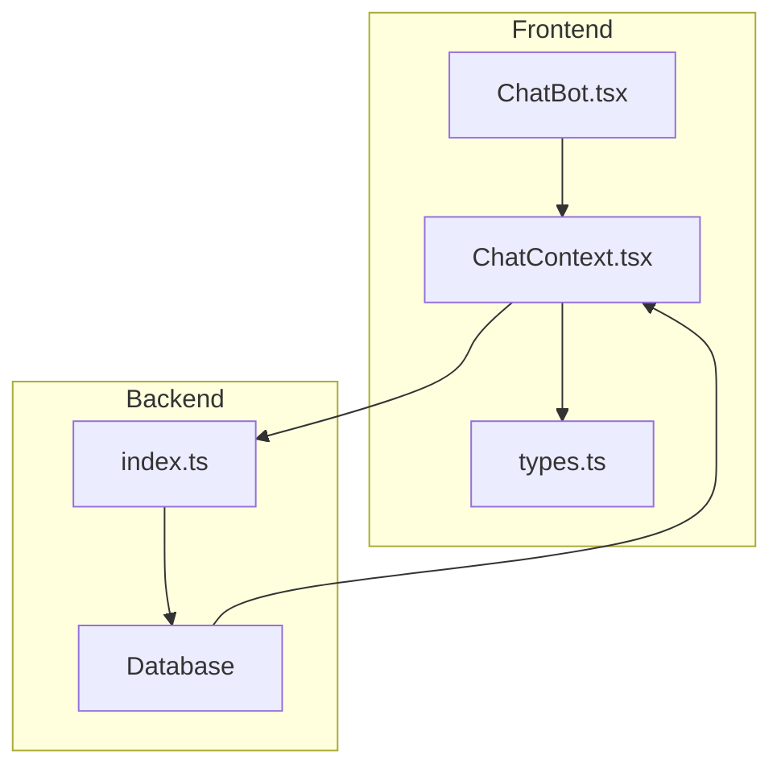
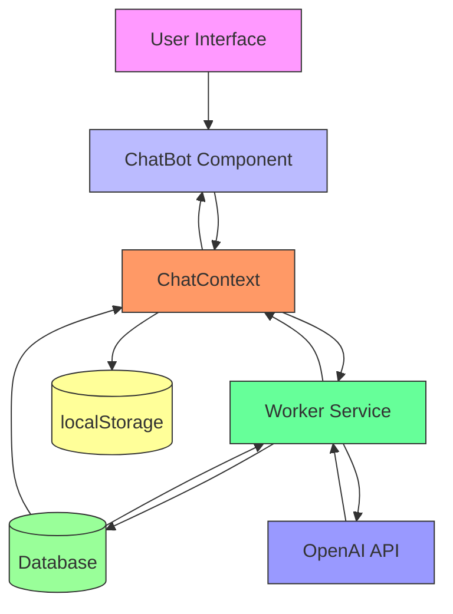
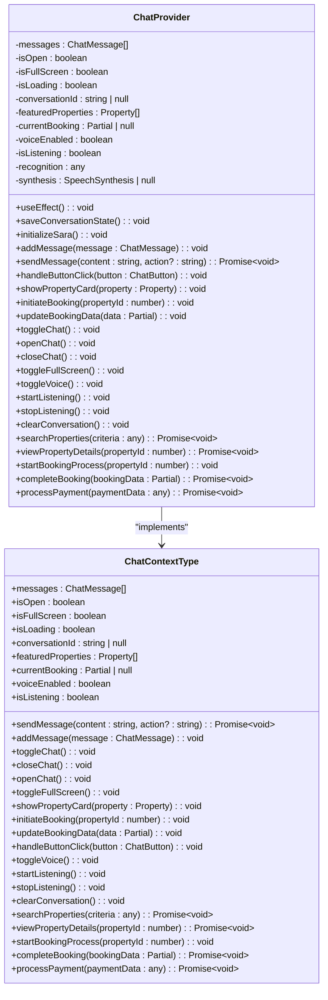
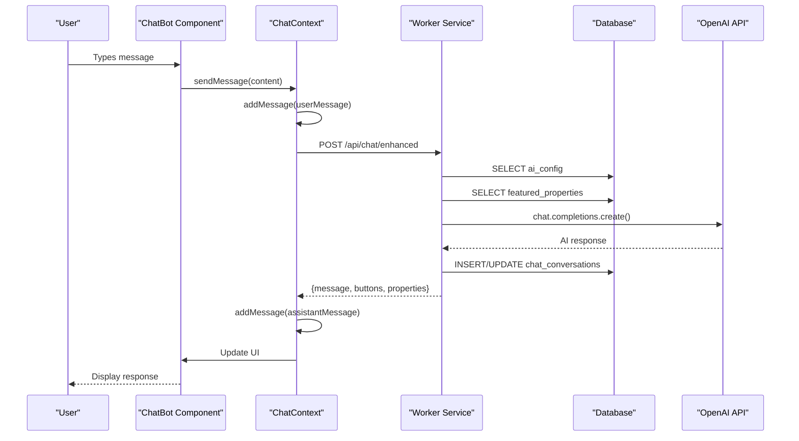
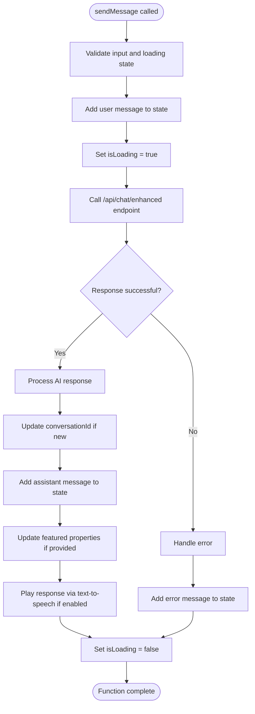
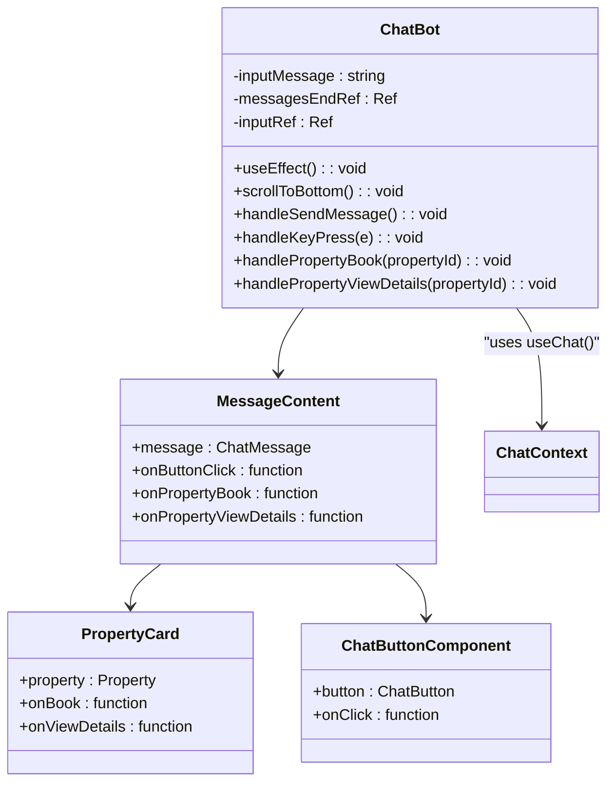
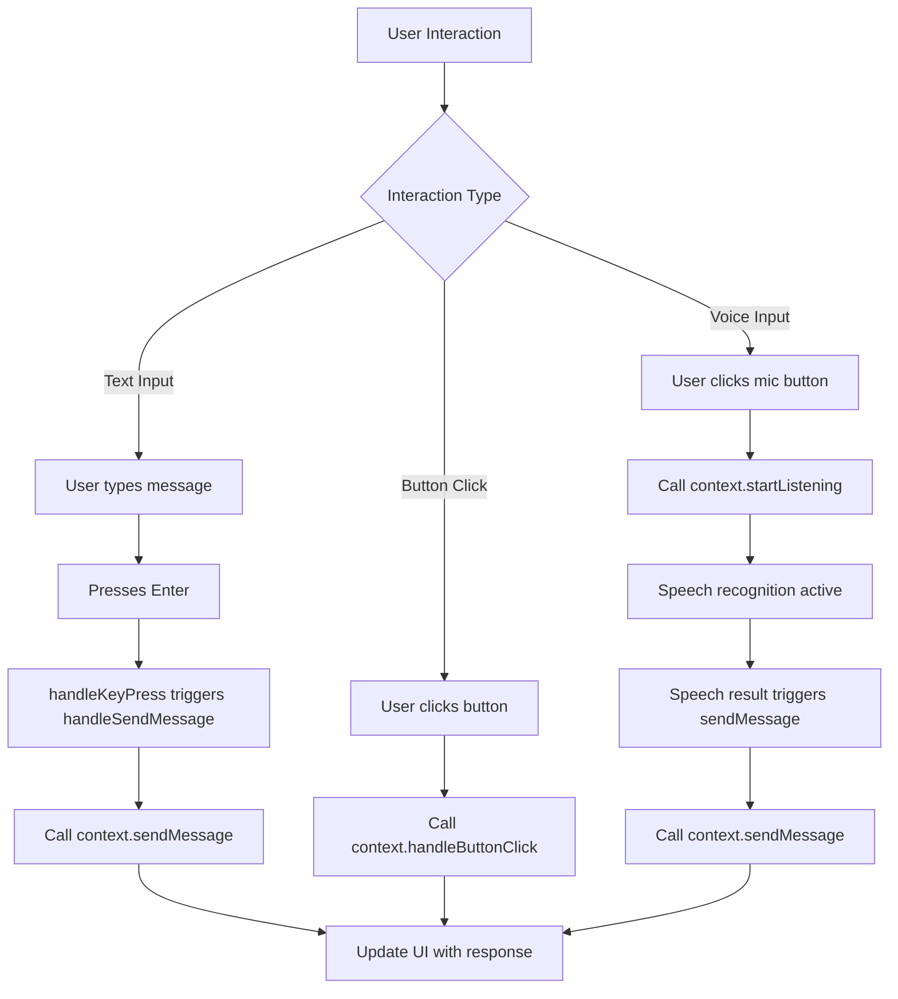
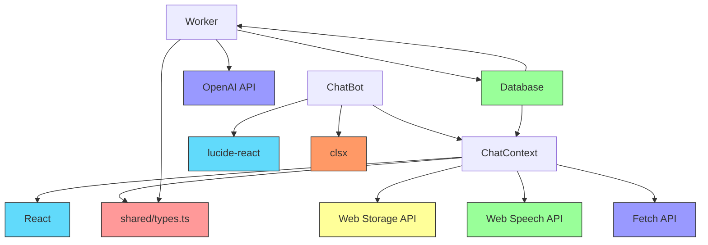

# State Management

<cite>
**Referenced Files in This Document**   
- [ChatContext.tsx](file://src/react-app/contexts/ChatContext.tsx) - *Updated with fullscreen mode and booking flow state management*
- [ChatBot.tsx](file://src/react-app/components/ChatBot.tsx) - *Enhanced with fullscreen mode and payment flow integration*
- [types.ts](file://src/shared/types.ts) - *Updated with enhanced AI and payment types*
- [index.ts](file://src/worker/index.ts) - *Backend processing for chat and booking flows*
- [1.sql](file://migrations/1.sql) - *Database schema for chat conversations*
</cite>

## Update Summary
**Changes Made**   
- Added documentation for fullscreen mode functionality in ChatBot component
- Updated state management details to include booking and payment flow state
- Enhanced context initialization section with new state variables
- Added new section for enhanced functionality methods in ChatContext
- Updated message flow diagram to include payment processing
- Added performance considerations for booking state management

## Table of Contents
1. [Introduction](#introduction)
2. [Project Structure](#project-structure)
3. [Core Components](#core-components)
4. [Architecture Overview](#architecture-overview)
5. [Detailed Component Analysis](#detailed-component-analysis)
6. [Dependency Analysis](#dependency-analysis)
7. [Performance Considerations](#performance-considerations)
8. [Troubleshooting Guide](#troubleshooting-guide)
9. [Conclusion](#conclusion)

## Introduction
This document provides a comprehensive analysis of the state management system in the HabibiStay application, focusing on the implementation of React Context API for managing the AI chatbot state. The ChatContext serves as the primary state container for handling chat messages, user interactions, voice interface functionality, and conversation persistence. The system integrates frontend components with backend AI processing through a worker service, enabling a seamless conversational experience for property discovery and booking. This documentation covers the architecture, implementation details, data flow, and performance characteristics of the state management solution.

## Project Structure
The project follows a modular structure with clear separation of concerns. The state management functionality is primarily located in the `src/react-app/contexts` directory, with supporting components in `src/react-app/components` and shared types in `src/shared/types.ts`. The backend processing for AI responses is handled by the worker service in `src/worker/index.ts`. The application uses a feature-based organization with distinct directories for contexts, components, pages, and shared utilities. Database schema for chat persistence is defined in migration files, with the chat_conversations table in `migrations/1.sql` providing long-term storage for conversation history.

**Diagram sources**
- [ChatBot.tsx](file://src/react-app/components/ChatBot.tsx)
- [ChatContext.tsx](file://src/react-app/contexts/ChatContext.tsx)
- [types.ts](file://src/shared/types.ts)
- [index.ts](file://src/worker/index.ts)
- [1.sql](file://migrations/1.sql)

**Section sources**
- [ChatBot.tsx](file://src/react-app/components/ChatBot.tsx)
- [ChatContext.tsx](file://src/react-app/contexts/ChatContext.tsx)
- [types.ts](file://src/shared/types.ts)
- [index.ts](file://src/worker/index.ts)
- [1.sql](file://migrations/1.sql)

## Core Components
The core state management components are the ChatContext and ChatBot. The ChatContext provides a centralized state container that manages chat messages, conversation state, voice interface settings, booking context, and fullscreen mode. It implements the provider-consumer pattern, exposing state and update functions through a context value. The ChatBot component consumes this context to render the chat interface in both widget and fullscreen modes, handle user input, and display AI responses. The system uses localStorage for short-term persistence and a backend database for long-term conversation storage. The worker service processes chat messages using OpenAI's API, with configurable AI parameters stored in the database.

**Section sources**
- [ChatContext.tsx](file://src/react-app/contexts/ChatContext.tsx)
- [ChatBot.tsx](file://src/react-app/components/ChatBot.tsx)
- [types.ts](file://src/shared/types.ts)
- [index.ts](file://src/worker/index.ts)

## Architecture Overview
The state management architecture follows a unidirectional data flow pattern. User interactions in the ChatBot component trigger actions that update the ChatContext state. The context manages communication with the backend worker service, which processes messages using AI models and returns enriched responses with suggested actions. The architecture includes multiple persistence layers: in-memory state for current session, localStorage for short-term recovery, and database storage for long-term conversation history. The system supports both text and voice input, with speech recognition and synthesis integrated into the context. The AI configuration is dynamically loaded from the database, allowing administrators to modify the chatbot's behavior without code changes.

**Diagram sources**
- [ChatContext.tsx](file://src/react-app/contexts/ChatContext.tsx)
- [ChatBot.tsx](file://src/react-app/components/ChatBot.tsx)
- [index.ts](file://src/worker/index.ts)
- [1.sql](file://migrations/1.sql)

## Detailed Component Analysis

### ChatContext Analysis
The ChatContext implementation follows React best practices for context management. It uses useState hooks to manage various aspects of the chat state including messages, open/closed status, loading state, conversation ID, featured properties, current booking data, voice interface settings, and fullscreen mode. The context provides a comprehensive API through its value object, exposing functions for sending messages, adding messages, toggling the chat interface, handling button clicks, and managing voice input. The implementation includes several useEffect hooks for initialization tasks such as loading saved state from localStorage, fetching featured properties, and setting up speech recognition.

#### Context Initialization and State Management

**Diagram sources**
- [ChatContext.tsx](file://src/react-app/contexts/ChatContext.tsx#L11-L55)

**Section sources**
- [ChatContext.tsx](file://src/react-app/contexts/ChatContext.tsx#L11-L55)

#### Message Flow and API Integration
The message flow from user input to AI response follows a well-defined sequence. When a user sends a message, the sendMessage function first validates the input and sets the loading state. It then adds the user message to the local state and makes a POST request to the /api/chat/enhanced endpoint. The worker service processes this request by retrieving the current AI configuration from the database, constructing a system prompt with contextual information, and forwarding the conversation to OpenAI's API. The response is enriched with interactive buttons and property information before being returned to the frontend, where it's added to the message list and optionally read aloud through the speech synthesis API.

**Diagram sources**
- [ChatContext.tsx](file://src/react-app/contexts/ChatContext.tsx#L200-L350)
- [index.ts](file://src/worker/index.ts#L1630-L1829)

**Section sources**
- [ChatContext.tsx](file://src/react-app/contexts/ChatContext.tsx#L200-L350)
- [index.ts](file://src/worker/index.ts#L1630-L1829)

#### State Update Mechanisms
The ChatContext employs useCallback to memoize its state update functions, preventing unnecessary re-renders of consuming components. Each state update function is carefully designed to maintain immutability and ensure predictable state transitions. The context uses multiple useState hooks to manage different aspects of the chat state, with useEffect hooks to synchronize related state changes. For example, when messages are updated, the saveConversationState callback is triggered to persist the state to localStorage. The context also manages side effects such as speech recognition lifecycle and automatic initialization of the chat interface when first opened.

**Diagram sources**
- [ChatContext.tsx](file://src/react-app/contexts/ChatContext.tsx#L250-L350)

**Section sources**
- [ChatContext.tsx](file://src/react-app/contexts/ChatContext.tsx#L250-L350)

### ChatBot Component Analysis
The ChatBot component is responsible for rendering the chat interface and handling user interactions. It consumes the ChatContext to access chat state and actions, providing a rich user experience with support for text input, voice input, and interactive buttons. The component manages its own local state for the input message and uses refs to handle scrolling and focus management. It renders messages in a scrollable container, automatically scrolling to the bottom when new messages arrive. The interface includes a header with controls for voice input, conversation reset, fullscreen mode, and closing the chat, as well as an input area with text and voice input options.

#### Component Structure and Rendering

**Diagram sources**
- [ChatBot.tsx](file://src/react-app/components/ChatBot.tsx#L254-L315)

**Section sources**
- [ChatBot.tsx](file://src/react-app/components/ChatBot.tsx#L254-L315)

#### User Interaction Flow
The ChatBot component handles multiple user interaction methods including keyboard input, button clicks, and voice input. When the user types a message and presses Enter, the handleSendMessage function is triggered, which calls the sendMessage function from the context. The component also supports voice input through the Web Speech API, with visual feedback when listening. Interactive buttons in AI responses are rendered with appropriate styling and click handlers that trigger the handleButtonClick function in the context. Property cards include action buttons for booking and viewing details, which initiate the booking process through the context's initiateBooking function.

**Diagram sources**
- [ChatBot.tsx](file://src/react-app/components/ChatBot.tsx#L350-L400)

**Section sources**
- [ChatBot.tsx](file://src/react-app/components/ChatBot.tsx#L350-L400)

## Dependency Analysis
The ChatContext has dependencies on several external systems and libraries. It relies on React's context API and hooks for state management, the Web Speech API for voice functionality, localStorage for persistence, and fetch API for communication with the worker service. The context imports type definitions from shared/types.ts to ensure type safety across the application. The worker service depends on OpenAI's API for AI processing and the application database for storing conversation history and AI configuration. The ChatBot component depends on UI libraries such as lucide-react for icons and clsx for conditional class names. The overall dependency graph shows a clean separation between frontend and backend concerns, with well-defined interfaces between components.

**Diagram sources**
- [ChatContext.tsx](file://src/react-app/contexts/ChatContext.tsx)
- [ChatBot.tsx](file://src/react-app/components/ChatBot.tsx)
- [types.ts](file://src/shared/types.ts)
- [index.ts](file://src/worker/index.ts)

**Section sources**
- [ChatContext.tsx](file://src/react-app/contexts/ChatContext.tsx)
- [ChatBot.tsx](file://src/react-app/components/ChatBot.tsx)
- [types.ts](file://src/shared/types.ts)
- [index.ts](file://src/worker/index.ts)

## Performance Considerations
The state management implementation includes several performance optimizations. The use of useCallback ensures that event handler functions are memoized and do not trigger unnecessary re-renders of child components. The context is designed to minimize re-renders by only updating the specific state variables that change, rather than the entire context value. The implementation includes debouncing for localStorage writes, batching them when multiple messages are added in quick succession. The chat interface uses virtualization principles by only rendering visible messages and using refs for scrolling rather than state updates. Network requests are optimized by including conversation context in each request, reducing the need for additional round trips to fetch conversation history.

For large-scale applications, the current Context-based approach may face performance challenges as the number of subscribers increases. Each state update triggers re-renders in all consuming components, regardless of whether they use the updated values. In such cases, migrating to a more sophisticated state management solution like Redux with selectors or using multiple focused contexts could improve performance. However, for the current use case with a single primary consumer (the ChatBot component) and limited secondary consumers, the Context API provides a simple and effective solution without the added complexity of external libraries.

The voice interface implementation is optimized to minimize battery usage by only activating speech recognition when explicitly requested by the user. Speech synthesis is also managed carefully to avoid overlapping audio output. The system includes error handling for speech recognition failures and provides fallback text-based interaction. Memory usage is monitored through the cleanup of event listeners in useEffect cleanup functions, preventing memory leaks during component unmounting.

## Troubleshooting Guide
Common issues with the state management system typically fall into several categories: initialization problems, API communication errors, voice interface issues, and state persistence failures. Initialization problems may occur if the context is used outside of the provider wrapper, resulting in the "useChat must be used within a ChatProvider" error. This can be resolved by ensuring the ChatProvider wraps all components that use the useChat hook.

API communication errors may manifest as failed message sends or timeouts. These can be diagnosed by checking the network tab in browser developer tools to verify the request payload and response. Common causes include missing or invalid API keys in the environment configuration, network connectivity issues, or rate limiting by the OpenAI API. The implementation includes error handling that displays user-friendly error messages and retry options.

Voice interface issues typically relate to browser permissions or unsupported features. The system checks for speech recognition and synthesis support during initialization and disables voice features if unavailable. Users may need to grant microphone permissions or use a supported browser (Chrome, Edge, or Safari). Speech recognition accuracy can be affected by background noise or accent differences, which may require users to speak clearly and at a moderate pace.

State persistence failures may occur if localStorage is disabled or full. The system includes error handling for localStorage operations, falling back to in-memory state if persistence fails. Conversation history may be lost if the user clears their browser data or if the 30-minute timeout expires. Administrators can monitor conversation persistence by checking the chat_conversations table in the database.

Performance issues may arise from excessive re-renders, particularly if multiple components consume the context. This can be mitigated by ensuring all context consumer components are memoized with React.memo or by breaking the context into smaller, more focused contexts. Memory leaks can occur if event listeners are not properly cleaned up, but the current implementation includes cleanup functions in useEffect hooks to prevent this.

**Section sources**
- [ChatContext.tsx](file://src/react-app/contexts/ChatContext.tsx)
- [ChatBot.tsx](file://src/react-app/components/ChatBot.tsx)
- [index.ts](file://src/worker/index.ts)

## Conclusion
The state management system implemented with React Context API effectively serves the needs of the HabibiStay AI chatbot. The ChatContext provides a centralized, well-organized state container that manages chat messages, user interactions, voice interface settings, and conversation persistence. The provider-consumer pattern enables clean separation between state management and UI components, with the ChatBot component consuming the context to provide a rich user experience. The integration with the backend worker service allows for sophisticated AI processing while maintaining a responsive frontend interface.

The system demonstrates thoughtful design choices, including multiple persistence layers, comprehensive error handling, and performance optimizations through useCallback and careful state management. The use of TypeScript ensures type safety across the application, reducing runtime errors and improving developer experience. The architecture supports future enhancements such as multi-user conversations, richer media messages, and integration with additional AI providers.

While the Context API is well-suited for this use case with a focused set of state requirements and limited component consumers, the system could benefit from additional optimizations as it scales. Potential improvements include message batching for high-frequency interactions, more sophisticated caching strategies, and enhanced error recovery mechanisms. Overall, the implementation provides a solid foundation for an AI-powered chat experience that enhances user engagement and supports the core functionality of property discovery and booking.