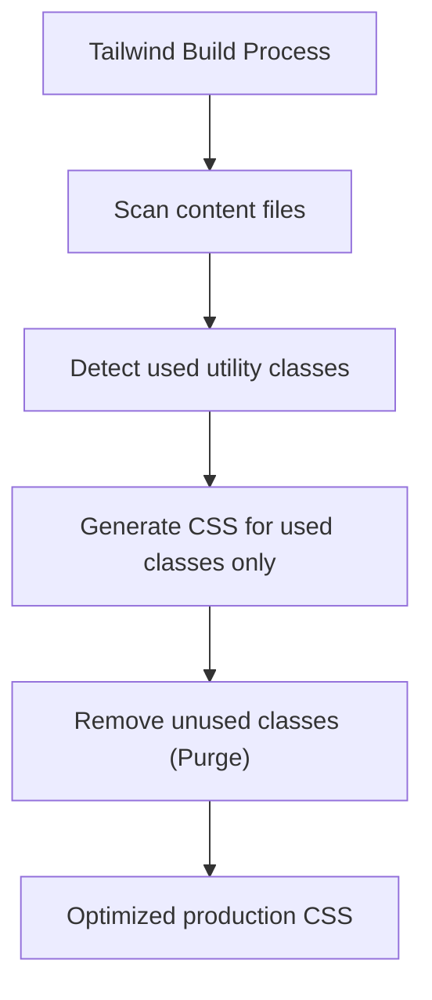
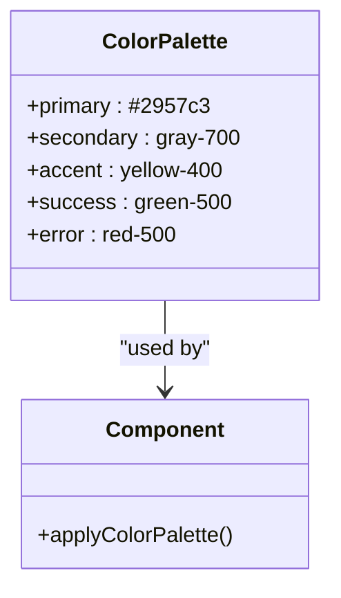
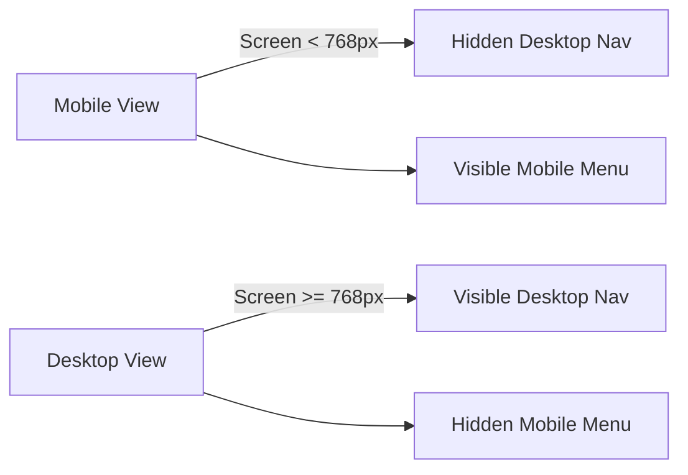
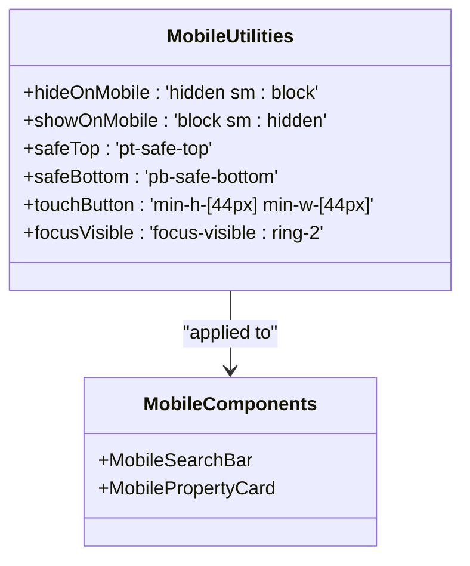
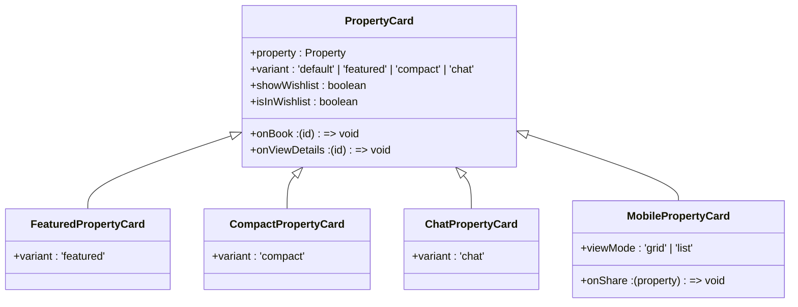
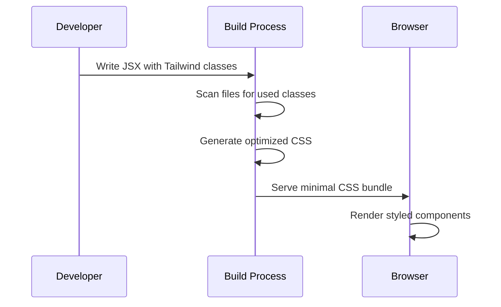
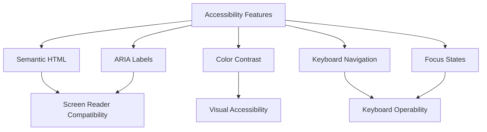

# Styling Strategy

<cite>
**Referenced Files in This Document**   
- [tailwind.config.js](file://tailwind.config.js)
- [index.css](file://src/react-app/index.css)
- [PropertyCard.tsx](file://src/react-app/components/PropertyCard.tsx)
- [postcss.config.js](file://postcss.config.js)
- [MobilePropertyCard.tsx](file://src/react-app/components/MobilePropertyCard.tsx) - *Added in recent commit*
- [MobileSearchBar.tsx](file://src/react-app/components/MobileSearchBar.tsx) - *Added in recent commit*
- [responsive.ts](file://src/react-app/utils/responsive.ts) - *Extended with mobile-specific utilities*
</cite>

## Update Summary
**Changes Made**   
- Added new sections for mobile-optimized components and responsive utility system
- Updated responsive design patterns to include mobile-first utility classes
- Enhanced PropertyCard analysis with mobile variant comparison
- Added documentation for new mobile components and their styling patterns
- Updated section sources to reflect new and modified files

## Table of Contents
1. [Introduction](#introduction)
2. [Utility-First Approach Implementation](#utility-first-approach-implementation)
3. [Tailwind Configuration and Theme Customization](#tailwind-configuration-and-theme-customization)
4. [Global Styles and CSS Architecture](#global-styles-and-css-architecture)
5. [Component-Specific Styling with className](#component-specific-styling-with-classname)
6. [Custom Color Palette Usage](#custom-color-palette-usage)
7. [Responsive Design Patterns](#responsive-design-patterns)
8. [Mobile-Optimized Component Styling](#mobile-optimized-component-styling)
9. [PropertyCard Component Analysis](#propertycard-component-analysis)
10. [Developer Experience and Production Optimization](#developer-experience-and-production-optimization)
11. [Accessibility Considerations](#accessibility-considerations)

## Introduction
This document provides a comprehensive overview of the styling strategy implemented in the HabibiStay application using Tailwind CSS. It details the utility-first approach, theme configuration, responsive design patterns, and component-level styling practices. The analysis covers how global and component-specific styles are applied, the use of custom color schemes, and considerations for developer experience and accessibility. Recent updates include mobile-optimized components with enhanced touch targeting and mobile-specific layout patterns.

## Utility-First Approach Implementation

The application implements a utility-first styling methodology using Tailwind CSS, where atomic utility classes are applied directly within JSX elements to construct user interfaces. This approach eliminates the need for writing custom CSS for most styling needs and enables rapid UI development through composition of pre-defined classes.

Instead of defining semantic class names in external stylesheets, developers apply utility classes directly to elements for spacing, layout, typography, colors, and states. This pattern is consistently used across all components in the codebase, promoting consistency and reducing CSS bloat.

For example, in the PropertyCard component, layout and spacing are controlled using Tailwind's flexbox and spacing utilities:
```tsx
<div className="flex items-center justify-between pt-2 border-t border-gray-100">
```

This utility combines multiple styling concerns—flex layout, alignment, padding, borders, and colors—into a single className declaration, making the styling intent immediately visible in the markup.

**Section sources**
- [PropertyCard.tsx](file://src/react-app/components/PropertyCard.tsx#L0-L425)

## Tailwind Configuration and Theme Customization

### Configuration Overview
The Tailwind configuration is defined in `tailwind.config.js`, which specifies the content sources for class purging and leaves the theme extension empty by default.

```js
/** @type {import('tailwindcss').Config} */
export default {
  content: [
    "./index.html",
    "./src/react-app/**/*.{js,ts,jsx,tsx}",
  ],
  theme: {
    extend: {},
  },
  plugins: [],
};
```

**Section sources**
- [tailwind.config.js](file://tailwind.config.js#L0-L11)

### Content Configuration and Purge Settings
The `content` array defines the files that Tailwind should scan during the build process to detect used utility classes. This configuration enables the production optimization feature that removes unused CSS:

- `"./index.html"` - Scans the main HTML file
- `"./src/react-app/**/*.{js,ts,jsx,tsx}"` - Recursively scans all source files in the React application

This setup ensures that only classes actually used in the application are included in the final CSS bundle, significantly reducing file size in production.



**Diagram sources**
- [tailwind.config.js](file://tailwind.config.js#L0-L11)

## Global Styles and CSS Architecture

### Base CSS Setup
Global styles are managed through the `index.css` file, which imports Tailwind's foundational layers and defines minimal custom global styles.

```css
@tailwind base;
@tailwind components;
@tailwind utilities;

:root {
  font-family: Inter, system-ui, Avenir, Helvetica, Arial, sans-serif;
}
```

The `@tailwind` directives import three key layers:
- `base`: Applies reset styles and base element styling
- `components`: Reserved for component classes (currently unused)
- `utilities`: Includes all Tailwind utility classes

**Section sources**
- [index.css](file://src/react-app/index.css#L0-L7)

### PostCSS Integration
The project uses PostCSS with Tailwind CSS and Autoprefixer plugins, configured in `postcss.config.js`:

```js
export default {
  plugins: {
    tailwindcss: {},
    autoprefixer: {},
  },
};
```

This configuration ensures proper vendor prefixing for cross-browser compatibility while processing Tailwind directives.

**Section sources**
- [postcss.config.js](file://postcss.config.js#L0-L5)

## Component-Specific Styling with className

### Conditional Class Handling with clsx
The application uses the `clsx` utility to manage conditional class names, allowing dynamic styling based on component props and state. This pattern is extensively used in the PropertyCard component to handle different variants and states.

```tsx
const cardClasses = clsx(
  'bg-white border border-gray-200 rounded-lg shadow-sm overflow-hidden transition-all duration-200',
  {
    'hover:shadow-md': variant !== 'chat',
    'cursor-pointer': variant !== 'chat',
    'max-w-sm': variant === 'compact',
    'w-full': variant === 'chat',
  },
  className
);
```

The `clsx` function combines:
- Static utility classes
- Conditional classes based on object notation
- Additional classes passed via props

This approach provides flexibility while maintaining the utility-first philosophy.

**Section sources**
- [PropertyCard.tsx](file://src/react-app/components/PropertyCard.tsx#L288-L295)

## Custom Color Palette Usage

### Primary Color Implementation
Although the Tailwind configuration does not define custom theme colors, the application implements a consistent color scheme using inline hex values, with `#2957c3` serving as the primary brand color.

This color is used across multiple components for:
- Text color: `text-[#2957c3]`
- Background color: `bg-[#2957c3]`
- Hover states: `hover:text-blue-700`

```tsx
<Link to="/contact" className="text-[#2957c3] hover:text-blue-700 text-sm font-medium">
  Contact Support
</Link>
```

### Color Application Patterns
The application uses bracket notation `[#2957c3]` to reference the primary color, which is a Tailwind feature for arbitrary value support. This allows the use of custom colors without defining them in the theme configuration.

Common color usage patterns include:
- Primary actions and links
- Active states in navigation
- Brand elements and icons
- Call-to-action buttons



**Diagram sources**
- [PropertyCard.tsx](file://src/react-app/components/PropertyCard.tsx#L232-L251)
- [BookingFlow.tsx](file://src/react-app/components/BookingFlow.tsx#L175-L177)

**Section sources**
- [PropertyCard.tsx](file://src/react-app/components/PropertyCard.tsx#L232-L251)

## Responsive Design Patterns

### Mobile-First Breakpoints
The application follows a mobile-first responsive design approach using Tailwind's responsive prefixes. The breakpoint system uses the default Tailwind scale:
- No prefix: Mobile (up to 640px)
- `sm`: 640px and above
- `md`: 768px and above
- `lg`: 1024px and above
- `xl`: 1280px and above
- `2xl`: 1536px and above

### Responsive Layout Implementation
Responsive design is implemented through grid and flexbox utilities with breakpoint prefixes:

```tsx
<div className="grid grid-cols-1 md:grid-cols-2 lg:grid-cols-6 gap-8">
```

This creates:
- 1 column on mobile
- 2 columns on medium screens and above
- 6 columns on large screens and above

### Navigation Responsive Pattern
The Navbar component demonstrates a common responsive pattern with mobile and desktop layouts:

```tsx
<div className="hidden md:block"> {/* Desktop navigation */ }
<div className="md:hidden">     {/* Mobile menu */ }
```

This approach hides elements at specific breakpoints to create optimized experiences for different device sizes.



**Diagram sources**
- [Navbar.tsx](file://src/react-app/components/Navbar.tsx#L41-L61)
- [Footer.tsx](file://src/react-app/components/Footer.tsx#L129-L130)

**Section sources**
- [Navbar.tsx](file://src/react-app/components/Navbar.tsx#L41-L61)

## Mobile-Optimized Component Styling

### Responsive Utility System
The application implements a comprehensive responsive utility system through the `responsiveClasses` object in `responsive.ts`, which provides pre-defined class combinations for common mobile-optimized patterns.

```ts
export const responsiveClasses = {
  mobile: {
    drawer: 'fixed bottom-0 left-0 right-0 bg-white rounded-t-xl shadow-2xl transform transition-transform duration-300 ease-out max-h-[90vh] overflow-hidden',
    bottomSheet: 'fixed bottom-0 left-0 right-0 bg-white rounded-t-2xl shadow-2xl p-4 max-h-[80vh] overflow-y-auto',
    pullHandle: 'w-12 h-1 bg-gray-300 rounded-full mx-auto mb-4',
    fab: 'fixed bottom-6 right-6 w-14 h-14 bg-[#2957c3] text-white rounded-full shadow-lg flex items-center justify-center z-40 active:scale-95 transition-transform',
    stickyHeader: 'sticky top-0 bg-white/95 backdrop-blur-sm border-b border-gray-100 z-30',
    swipeIndicator: 'relative overflow-hidden after:absolute after:bottom-0 after:left-1/2 after:transform after:-translate-x-1/2 after:w-8 after:h-1 after:bg-gray-300 after:rounded-full'
  }
};
```

These utilities enable consistent mobile component styling across the application.

### Mobile Search Bar Implementation
The `MobileSearchBar` component implements a mobile-optimized search interface with a bottom sheet modal pattern:

```tsx
<div className={cn(
  responsiveClasses.mobile.bottomSheet,
  utils.safeBottom,
  'z-50 animate-slide-up'
)}>
```

Key mobile-specific features:
- Bottom sheet modal with pull handle
- Safe area spacing for iOS notch devices
- Touch-optimized controls with 44px minimum touch targets
- Slide-up animation for modal presentation
- Backdrop with proper z-index stacking

### Mobile Property Card Variants
The `MobilePropertyCard` component supports two display modes optimized for mobile devices:

```tsx
if (viewMode === 'list') {
  return (
    <div className="flex gap-4">
      {/* Compact list view with image and content side-by-side */}
    </div>
  );
}

return (
  <div className="relative overflow-hidden">
    {/* Grid view with image overlay actions */}
  </div>
);
```

The component uses responsive utilities for:
- Touch target optimization with `utils.touchButton`
- Safe area spacing with `utils.safeTop` and `utils.safeBottom`
- Focus states optimized for mobile with `utils.focusVisible`
- Performance optimizations with `backfaceVisibility-hidden`

### Mobile-Specific Utilities
The `utils` object in `responsive.ts` provides mobile-specific utility classes:

```ts
export const utils = {
  hideOnMobile: 'hidden sm:block',
  showOnMobile: 'block sm:hidden',
  safeTop: 'pt-safe-top',
  safeBottom: 'pb-safe-bottom',
  focusVisible: 'focus:outline-none focus-visible:ring-2 focus-visible:ring-[#2957c3] focus-visible:ring-offset-2',
  touchButton: 'min-h-[44px] min-w-[44px] flex items-center justify-center touch-manipulation'
};
```

These utilities ensure proper mobile behavior for:
- Hiding/showing elements based on screen size
- Safe area spacing for mobile devices with notches
- Touch target sizing meeting WCAG accessibility requirements
- Mobile-optimized focus states



**Diagram sources**
- [responsive.ts](file://src/react-app/utils/responsive.ts#L140-L172)
- [MobileSearchBar.tsx](file://src/react-app/components/MobileSearchBar.tsx#L0-L262)
- [MobilePropertyCard.tsx](file://src/react-app/components/MobilePropertyCard.tsx#L0-L293)

**Section sources**
- [responsive.ts](file://src/react-app/utils/responsive.ts#L140-L172)
- [MobileSearchBar.tsx](file://src/react-app/components/MobileSearchBar.tsx#L0-L262)
- [MobilePropertyCard.tsx](file://src/react-app/components/MobilePropertyCard.tsx#L0-L293)

## PropertyCard Component Analysis

### Layout and Structure
The PropertyCard component demonstrates comprehensive use of Tailwind utilities for layout, spacing, and visual hierarchy.

```tsx
<div className="bg-white border border-gray-200 rounded-lg shadow-sm overflow-hidden transition-all duration-200">
```

Key layout features:
- Card container with border, shadow, and rounded corners
- Overflow hidden for image containment
- Smooth transitions for interactive states

### Spacing System
The component uses Tailwind's spacing scale (p-4, mt-1, mb-4, etc.) for consistent whitespace:

```tsx
<div className={clsx('p-4', variant === 'compact' || variant === 'chat' ? 'space-y-2' : 'space-y-3')}>
```

This applies:
- 1rem (16px) padding on all sides
- Vertical spacing between child elements (8px for compact, 12px for default)

### Hover Effects and Interactions
Interactive states are implemented with hover utilities and transition effects:

```tsx
className="absolute left-2 top-1/2 transform -translate-y-1/2 bg-black bg-opacity-50 text-white p-1 rounded-full opacity-0 group-hover:opacity-100 transition-opacity"
```

Features include:
- Opacity transition for navigation buttons
- Group hover effects on image container
- Smooth color transitions for interactive elements

### Variant System
The component supports multiple variants with conditional styling:

```tsx
{
  'hover:shadow-md': variant !== 'chat',
  'cursor-pointer': variant !== 'chat',
  'max-w-sm': variant === 'compact',
  'w-full': variant === 'chat',
}
```

Available variants:
- `default`: Standard card with full details
- `featured`: Enhanced version with contact options
- `compact`: Simplified layout for space-constrained areas
- `chat`: Optimized for chat interface integration
- `mobile`: Mobile-optimized version with touch targets and responsive layout

### Mobile Variant Comparison
The `MobilePropertyCard` component shares styling patterns with the desktop `PropertyCard` but includes mobile-specific optimizations:

```tsx
// MobilePropertyCard touch-optimized button
<button
  onClick={handleWishlistClick}
  className={cn(
    utils.touchButton,
    'p-2 bg-white/90 backdrop-blur-sm rounded-full shadow-sm hover:bg-white transition-all',
    isInWishlist ? 'text-red-500' : 'text-gray-600'
  )}
>
```

Key differences from desktop version:
- Larger touch targets (44px minimum)
- Bottom sheet modals instead of popovers
- Swipe-friendly layouts
- Safe area spacing for mobile devices
- Reduced motion animations



**Diagram sources**
- [PropertyCard.tsx](file://src/react-app/components/PropertyCard.tsx#L0-L425)
- [MobilePropertyCard.tsx](file://src/react-app/components/MobilePropertyCard.tsx#L0-L293)

**Section sources**
- [PropertyCard.tsx](file://src/react-app/components/PropertyCard.tsx#L0-L425)
- [MobilePropertyCard.tsx](file://src/react-app/components/MobilePropertyCard.tsx#L0-L293)

## Developer Experience and Production Optimization

### Development Workflow Benefits
The utility-first approach provides several developer experience advantages:

**Rapid Prototyping**
- No context switching between HTML and CSS files
- Immediate visual feedback when adding classes
- Reduced need for custom CSS writing

**Consistency**
- Enforced design system through utility constraints
- Predictable spacing and sizing scales
- Consistent breakpoints across components

**Maintainability**
- Styles co-located with markup
- Easy refactoring of UI components
- Reduced CSS specificity conflicts

### Production Optimization
The configuration enables critical production optimizations:

**Tree Shaking and Purging**
- Only used classes are included in production CSS
- Significant reduction in CSS bundle size
- Faster page load times and improved performance

**Build Process Integration**
- Automatic class detection during build
- No manual cleanup of unused styles required
- Safe refactoring without CSS debt accumulation



**Diagram sources**
- [tailwind.config.js](file://tailwind.config.js#L0-L11)
- [postcss.config.js](file://postcss.config.js#L0-L5)

**Section sources**
- [tailwind.config.js](file://tailwind.config.js#L0-L11)

## Accessibility Considerations

### Semantic HTML Structure
The styling implementation maintains semantic HTML structure, ensuring screen reader compatibility:

- Proper heading hierarchy (h3 for property titles)
- Semantic buttons for interactive elements
- Anchor tags for navigation links
- List structures for collections of items

### Interactive Element Accessibility
Interactive components include appropriate accessibility attributes:

```tsx
<button aria-label="Open chat with Sara">
```

```tsx
<button aria-label={isWishlisted ? 'Remove from wishlist' : 'Add to wishlist'}>
```

These ARIA labels provide clear descriptions of interactive elements for assistive technologies.

### Color and Contrast
The application maintains adequate color contrast:
- Primary blue (#2957c3) on white background meets WCAG AA standards
- Text colors provide sufficient contrast against backgrounds
- Hover states enhance visibility without compromising contrast

### Keyboard Navigation
Styling supports keyboard navigation through:
- Visible focus states with focus:ring utilities
- Logical tab order maintained through DOM structure
- Interactive elements styled to indicate keyboard focus
- Mobile-optimized focus states with `utils.focusVisible`



**Diagram sources**
- [ChatBot.tsx](file://src/react-app/components/ChatBot.tsx#L289)
- [WishlistButton.tsx](file://src/react-app/components/WishlistButton.tsx#L95)
- [responsive.ts](file://src/react-app/utils/responsive.ts#L160-L162)

**Section sources**
- [ChatBot.tsx](file://src/react-app/components/ChatBot.tsx#L289)
- [WishlistButton.tsx](file://src/react-app/components/WishlistButton.tsx#L95)
- [responsive.ts](file://src/react-app/utils/responsive.ts#L160-L162)