# Loading State Management

<cite>
**Referenced Files in This Document**   
- [LoadingStates.tsx](file://src/react-app/components/LoadingStates.tsx)
- [useAsync.ts](file://src/react-app/hooks/useAsync.ts)
- [errorHandling.ts](file://src/react-app/utils/errorHandling.ts)
- [Stays.tsx](file://src/react-app/pages/Stays.tsx)
- [AdminDashboard.tsx](file://src/react-app/pages/AdminDashboard.tsx)
- [LoadingStates.test.tsx](file://src/react-app/components/__tests__/LoadingStates.test.tsx)
- [useAsync.test.ts](file://src/react-app/hooks/__tests__/useAsync.test.ts)
</cite>

## Table of Contents
1. [Introduction](#introduction)
2. [Loading Patterns](#loading-patterns)
   - [Page Loading](#page-loading)
   - [Section Loading](#section-loading)
   - [Inline Loading](#inline-loading)
   - [Overlay Loading](#overlay-loading)
3. [Skeleton Components](#skeleton-components)
   - [Basic Skeleton](#basic-skeleton)
   - [Property Card Skeleton](#property-card-skeleton)
   - [Form Field Skeleton](#form-field-skeleton)
4. [Empty and Error States](#empty-and-error-states)
   - [Empty State](#empty-state)
   - [Network Error State](#network-error-state)
5. [Integration with Data Fetching](#integration-with-data-fetching)
   - [useAsync Hook](#useasync-hook)
   - [Error Handling Integration](#error-handling-integration)
6. [Best Practices](#best-practices)
7. [Testing](#testing)

## Introduction
This document provides comprehensive guidance on loading state management in the HabibiStay application. It covers various loading patterns, skeleton components, empty and error states, and their integration with data fetching hooks. The system is designed to provide clear feedback during data loading operations while maintaining a consistent user experience across the application.

The loading state system consists of several key components:
- **LoadingSpinner**: A reusable spinner component with configurable size and color
- **LoadingState**: A wrapper component that implements different loading patterns
- **Skeleton**: Placeholder components that mimic the structure of content
- **EmptyState**: UI for when no data is available
- **NetworkError**: Specialized component for network connectivity issues

These components work together with the `useAsync` hook to create a cohesive loading experience that handles both successful data loading and error scenarios.

**Section sources**
- [LoadingStates.tsx](file://src/react-app/components/LoadingStates.tsx#L1-L53)
- [useAsync.ts](file://src/react-app/hooks/useAsync.ts#L1-L20)

## Loading Patterns

### Page Loading
The page loading pattern is used when an entire page is being loaded. It creates a full-screen loading state with a large spinner and message centered in the viewport.

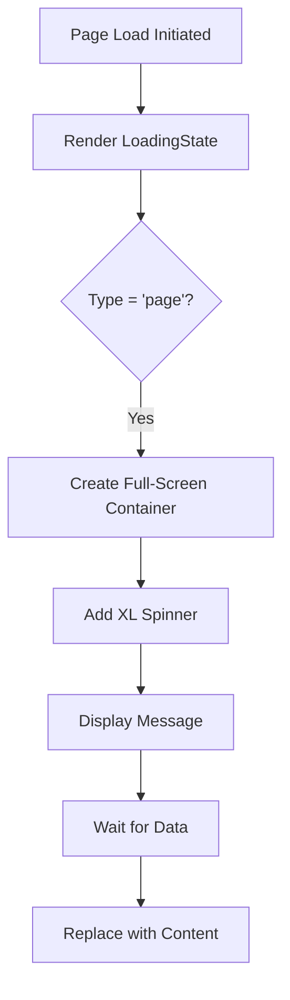

**Diagram sources**
- [LoadingStates.tsx](file://src/react-app/components/LoadingStates.tsx#L55-L72)

**Section sources**
- [LoadingStates.tsx](file://src/react-app/components/LoadingStates.tsx#L55-L72)
- [AdminDashboard.tsx](file://src/react-app/pages/AdminDashboard.tsx#L123-L156)

### Section Loading
Section loading is used for loading specific sections within a page. It provides a more focused loading experience with a large spinner and message.

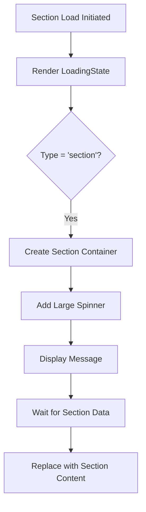

**Diagram sources**
- [LoadingStates.tsx](file://src/react-app/components/LoadingStates.tsx#L116-L130)

**Section sources**
- [LoadingStates.tsx](file://src/react-app/components/LoadingStates.tsx#L116-L130)

### Inline Loading
Inline loading is used for small, inline operations such as button clicks or form submissions. It displays a small spinner with a brief message.

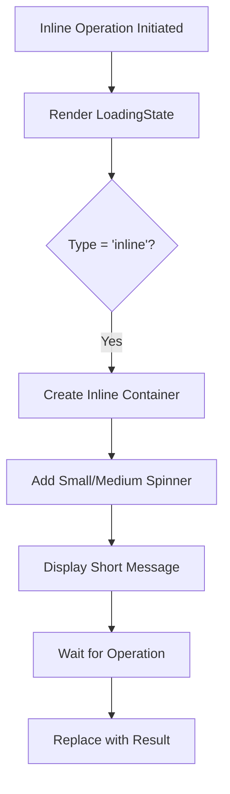

**Diagram sources**
- [LoadingStates.tsx](file://src/react-app/components/LoadingStates.tsx#L93-L114)

**Section sources**
- [LoadingStates.tsx](file://src/react-app/components/LoadingStates.tsx#L93-L114)

### Overlay Loading
Overlay loading creates a modal-style loading state that covers the entire viewport with a semi-transparent background, preventing user interaction.

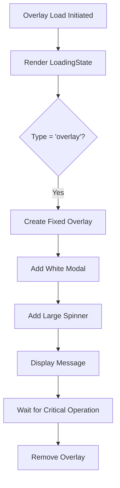

**Diagram sources**
- [LoadingStates.tsx](file://src/react-app/components/LoadingStates.tsx#L74-L91)

**Section sources**
- [LoadingStates.tsx](file://src/react-app/components/LoadingStates.tsx#L74-L91)

## Skeleton Components

### Basic Skeleton
The Skeleton component provides a flexible way to create placeholder content that mimics the structure of actual content. It supports different variants and can be customized with width, height, and line count.

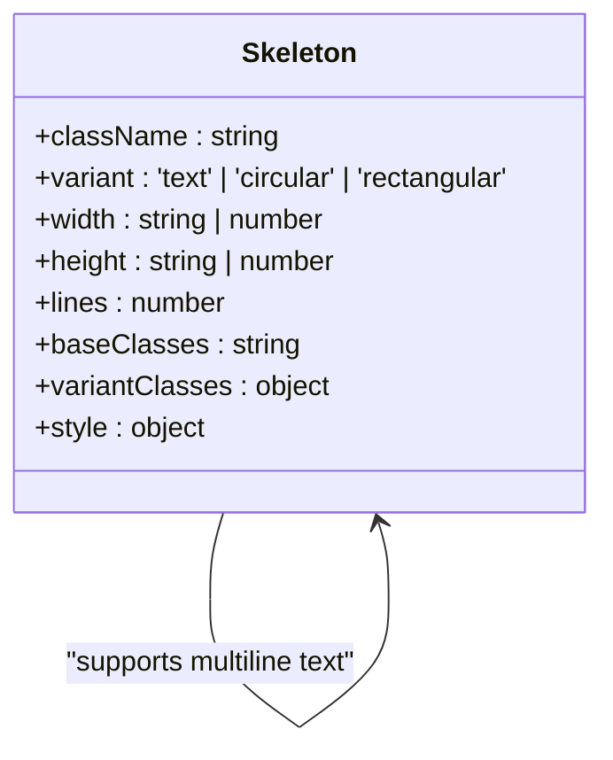

**Diagram sources**
- [LoadingStates.tsx](file://src/react-app/components/LoadingStates.tsx#L132-L178)

**Section sources**
- [LoadingStates.tsx](file://src/react-app/components/LoadingStates.tsx#L132-L178)

### Property Card Skeleton
The PropertyCardSkeleton component provides a consistent loading experience for property listings by mimicking the structure of the PropertyCard component.

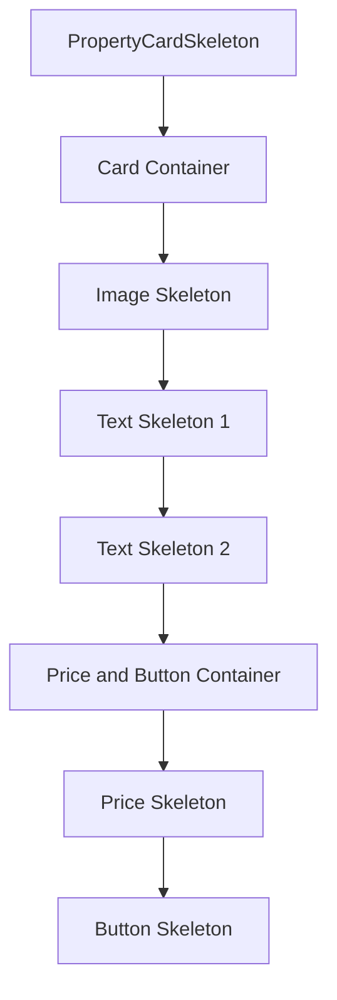

**Diagram sources**
- [LoadingStates.tsx](file://src/react-app/components/LoadingStates.tsx#L288-L308)

**Section sources**
- [LoadingStates.tsx](file://src/react-app/components/LoadingStates.tsx#L288-L308)
- [Stays.tsx](file://src/react-app/pages/Stays.tsx#L484-L499)

### Form Field Skeleton
The FormFieldSkeleton component provides placeholders for form fields, including label and input elements.

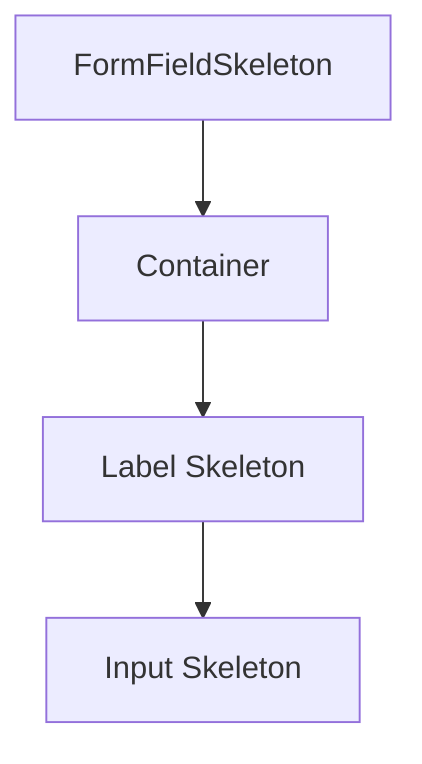

**Diagram sources**
- [LoadingStates.tsx](file://src/react-app/components/LoadingStates.tsx#L310-L325)

**Section sources**
- [LoadingStates.tsx](file://src/react-app/components/LoadingStates.tsx#L310-L325)

## Empty and Error States

### Empty State
The EmptyState component displays a user-friendly message when no data is available, optionally including an icon and action button.

```mermaid
classDiagram
class EmptyState {
+icon : React.ReactNode
+title : string
+description : string
+action : {label : string, onClick : function}
+className : string
}
EmptyState --> EmptyState : "displays title and description"
EmptyState --> EmptyState : "renders optional icon"
EmptyState --> EmptyState : "includes action button"
```

**Diagram sources**
- [LoadingStates.tsx](file://src/react-app/components/LoadingStates.tsx#L180-L220)

**Section sources**
- [LoadingStates.tsx](file://src/react-app/components/LoadingStates.tsx#L180-L220)
- [Stays.tsx](file://src/react-app/pages/Stays.tsx#L537-L553)

### Network Error State
The NetworkError component handles network connectivity issues with a clear message and optional retry button.

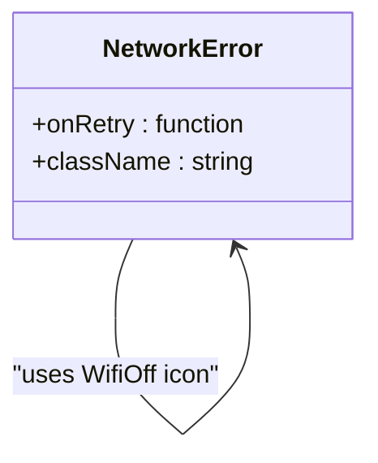

**Diagram sources**
- [LoadingStates.tsx](file://src/react-app/components/LoadingStates.tsx#L222-L268)

**Section sources**
- [LoadingStates.tsx](file://src/react-app/components/LoadingStates.tsx#L222-L268)
- [Stays.tsx](file://src/react-app/pages/Stays.tsx#L484-L487)

## Integration with Data Fetching

### useAsync Hook
The useAsync hook manages the state of asynchronous operations, providing data, loading, and error states that can be directly integrated with loading components.

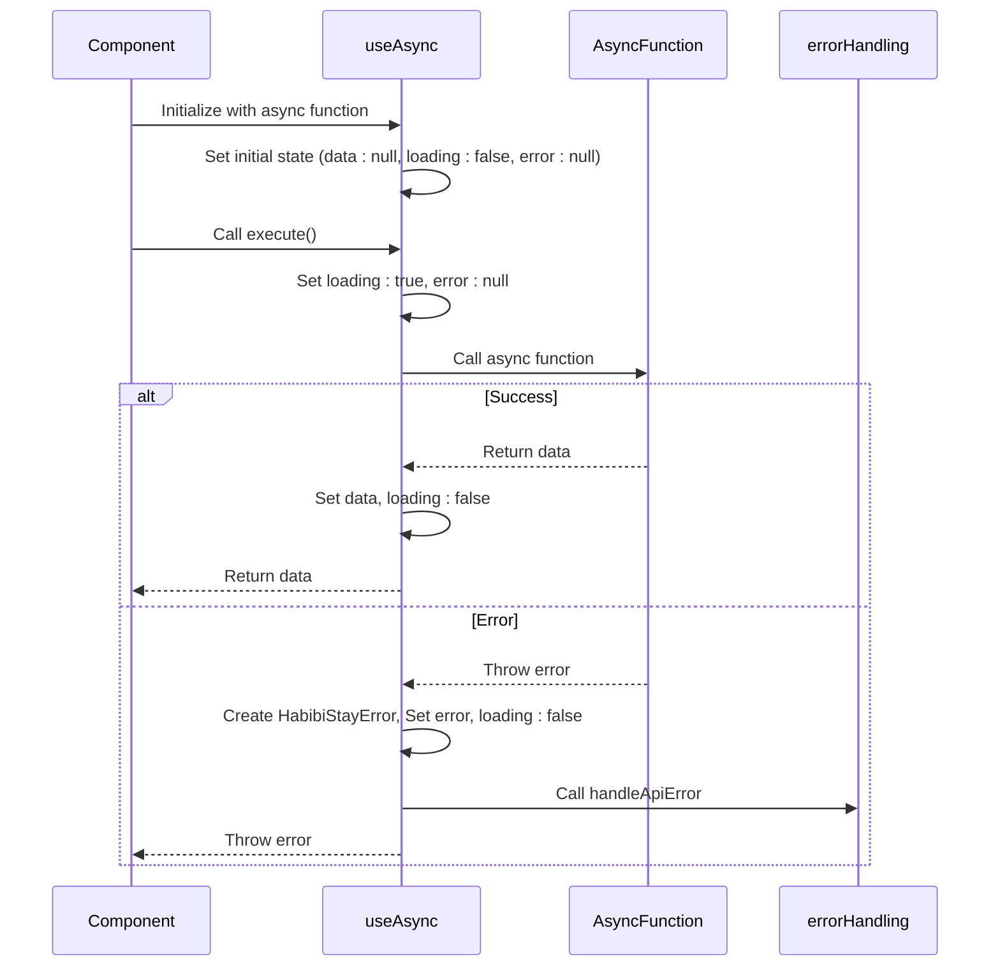

**Diagram sources**
- [useAsync.ts](file://src/react-app/hooks/useAsync.ts#L1-L53)
- [useAsync.ts](file://src/react-app/hooks/useAsync.ts#L55-L100)

**Section sources**
- [useAsync.ts](file://src/react-app/hooks/useAsync.ts#L1-L100)

### Error Handling Integration
The loading system integrates with the application's error handling system to provide consistent error feedback across different components.

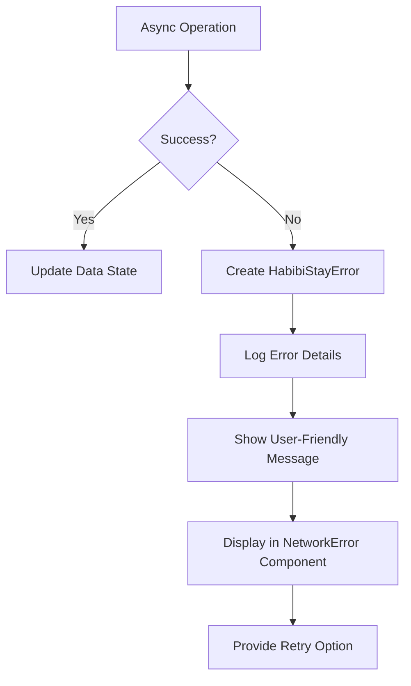

**Diagram sources**
- [useAsync.ts](file://src/react-app/hooks/useAsync.ts#L85-L100)
- [errorHandling.ts](file://src/react-app/utils/errorHandling.ts#L1-L50)

**Section sources**
- [useAsync.ts](file://src/react-app/hooks/useAsync.ts#L85-L100)
- [errorHandling.ts](file://src/react-app/utils/errorHandling.ts#L1-L50)

## Best Practices

### Loading State Selection Guidelines
- **Page Loading**: Use for initial page loads or major route changes
- **Section Loading**: Use for loading specific content sections
- **Inline Loading**: Use for small interactions like button clicks
- **Overlay Loading**: Use for critical operations that require user focus

### Performance Considerations
- Always clean up async operations on component unmount
- Use the `immediate` option in `useAsync` judiciously to avoid unnecessary requests
- Implement proper error boundaries to prevent cascading failures
- Consider using React's Suspense for code splitting and data fetching

### Accessibility
- Ensure loading indicators are visible to screen readers
- Provide meaningful messages that describe what is being loaded
- Maintain consistent loading patterns across the application
- Ensure sufficient color contrast for loading elements

### Error Recovery
- Always provide a way to retry failed operations
- Use appropriate error messages based on error type
- Implement exponential backoff for retry mechanisms
- Log errors for debugging while showing user-friendly messages

## Testing
The loading state components are thoroughly tested to ensure reliability and consistency.

```mermaid
flowchart TD
A[LoadingSpinner Tests] --> B[Default Props]
A --> C[Different Sizes]
A --> D[Different Colors]
E[LoadingState Tests] --> F[Section Loading]
E --> G[Page Loading]
E --> H[Overlay Loading]
E --> I[Inline Loading]
J[Skeleton Tests] --> K[Rectangular Variant]
J --> L[Text Variant]
J --> M[Circular Variant]
J --> N[Custom Dimensions]
J --> O[Multiple Lines]
P[EmptyState Tests] --> Q[Title and Description]
P --> R[Icon Rendering]
P --> S[Action Button]
T[NetworkError Tests] --> U[Message Display]
T --> V[Retry Button]
T --> W[No Retry Button]
```

**Diagram sources**
- [LoadingStates.test.tsx](file://src/react-app/components/__tests__/LoadingStates.test.tsx#L1-L202)

**Section sources**
- [LoadingStates.test.tsx](file://src/react-app/components/__tests__/LoadingStates.test.tsx#L1-L202)
- [useAsync.test.ts](file://src/react-app/hooks/__tests__/useAsync.test.ts#L1-L113)