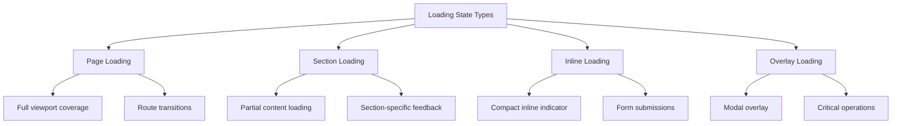
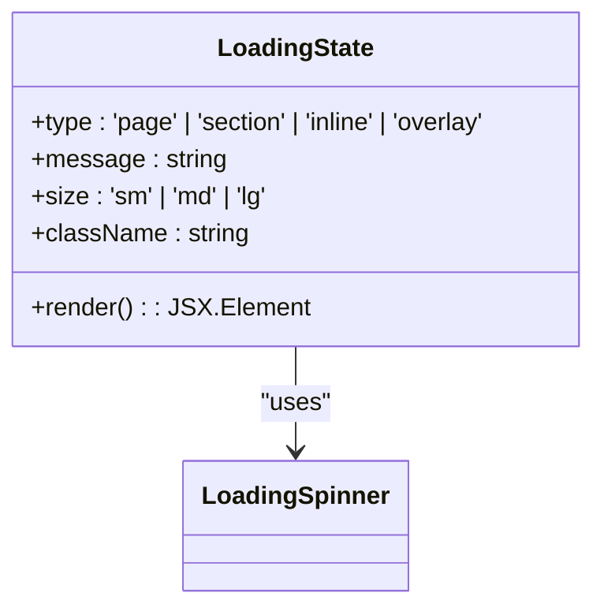
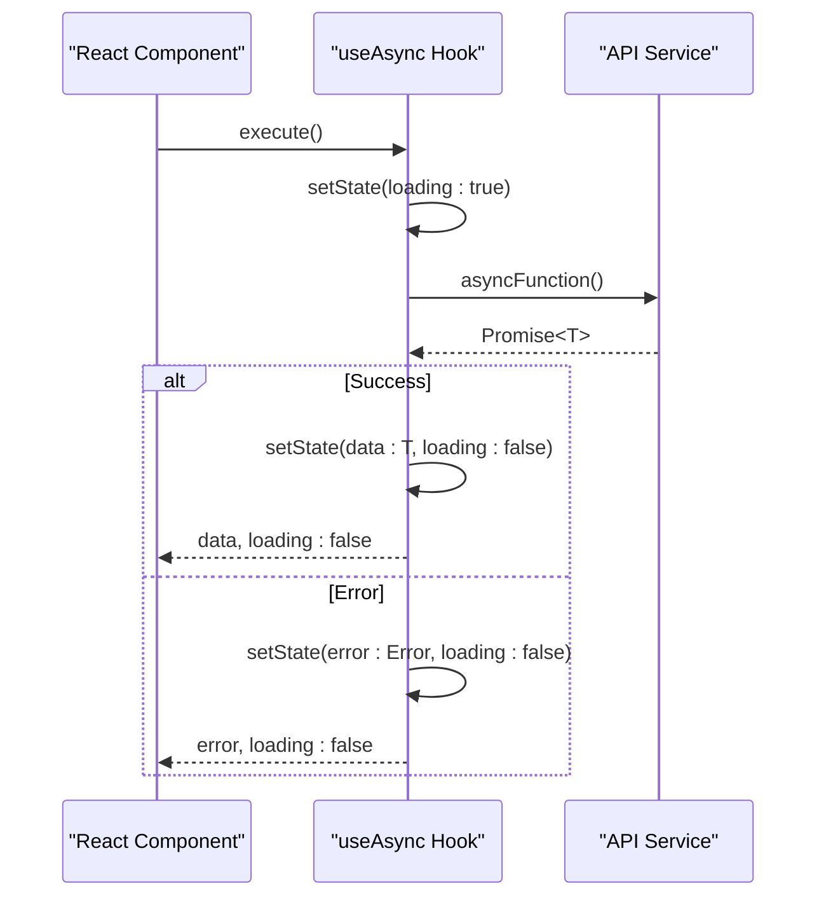
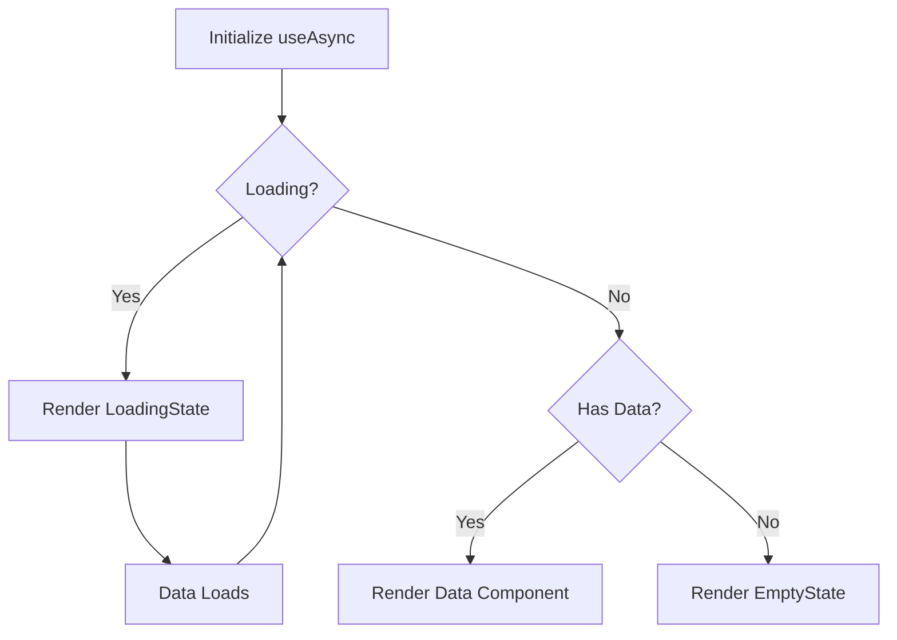
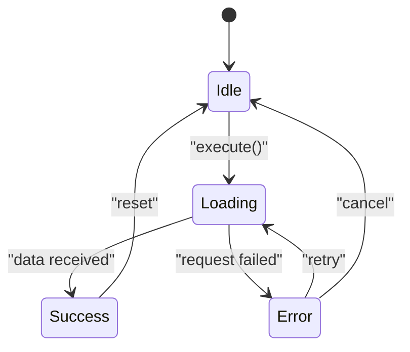
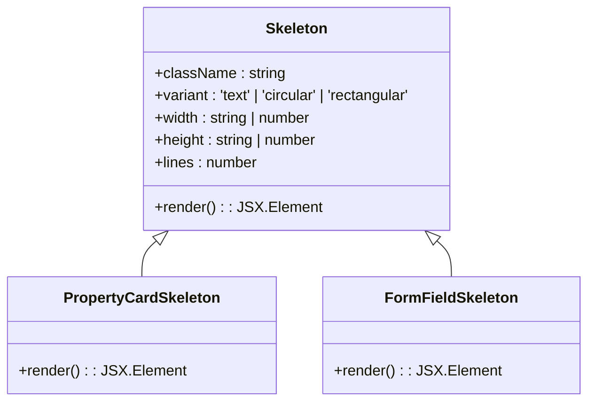
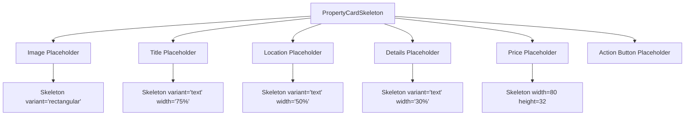
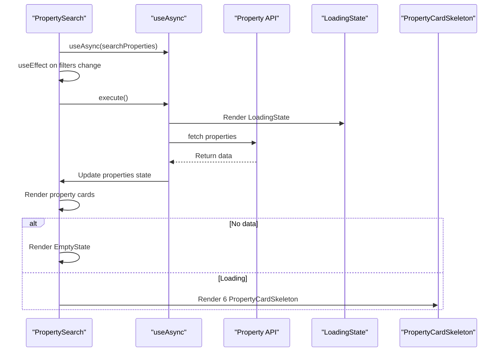

# Loading State Patterns

<cite>
**Referenced Files in This Document**   
- [LoadingStates.tsx](file://src/react-app/components/LoadingStates.tsx)
- [useAsync.ts](file://src/react-app/hooks/useAsync.ts)
- [errorHandling.ts](file://src/react-app/utils/errorHandling.ts)
- [PropertyCard.tsx](file://src/react-app/components/PropertyCard.tsx)
- [PropertySearch.tsx](file://src/react-app/pages/PropertySearch.tsx)
</cite>

## Table of Contents
1. [Introduction](#introduction)
2. [Loading State Types](#loading-state-types)
3. [Core Components](#core-components)
4. [Integration with Data Fetching](#integration-with-data-fetching)
5. [Error Handling Integration](#error-handling-integration)
6. [Skeleton Components](#skeleton-components)
7. [Implementation Examples](#implementation-examples)
8. [Best Practices](#best-practices)

## Introduction
This document provides comprehensive documentation for loading state patterns and implementation in the HabibiStay application. It covers different loading state types (page, section, inline, overlay), their appropriate use cases, and integration patterns with data fetching hooks. The documentation includes examples of combining loading states with error handling and skeleton components to create a seamless user experience during data loading operations.

## Loading State Types
The application implements four distinct loading state types, each designed for specific use cases and user experience requirements:

**Page Loading**: Used when loading entire pages or major route transitions. This type covers the full viewport with a loading indicator and message, preventing user interaction until content is ready.

**Section Loading**: Applied when loading specific sections within a page. This provides visual feedback for partial content loading while allowing users to interact with other parts of the interface.

**Inline Loading**: Designed for small, inline operations such as form submissions or button clicks. This type displays a compact loading indicator alongside a brief message within the existing content flow.

**Overlay Loading**: Implemented for critical operations that require user focus, such as payment processing or data submission. This type creates a modal overlay that blocks interaction with the underlying content.



**Diagram sources**
- [LoadingStates.tsx](file://src/react-app/components/LoadingStates.tsx#L55-L178)

**Section sources**
- [LoadingStates.tsx](file://src/react-app/components/LoadingStates.tsx#L55-L178)

## Core Components
The loading state system is built around several core components that provide consistent visual feedback across the application.

### LoadingSpinner Component
The `LoadingSpinner` component serves as the foundational visual element for all loading states. It provides configurable size and color options to match different contexts.

```mermaid
classDiagram
class LoadingSpinner {
+size : 'sm' | 'md' | 'lg' | 'xl'
+className : string
+color : 'primary' | 'white' | 'gray'
+render() : JSX.Element
}
LoadingSpinner --> "1" "1" LoadingState : "used by"
```

**Diagram sources**
- [LoadingStates.tsx](file://src/react-app/components/LoadingStates.tsx#L0-L53)

### LoadingState Component
The `LoadingState` component acts as a wrapper that implements the four loading state types with appropriate styling and layout for each use case.



**Diagram sources**
- [LoadingStates.tsx](file://src/react-app/components/LoadingStates.tsx#L55-L178)

**Section sources**
- [LoadingStates.tsx](file://src/react-app/components/LoadingStates.tsx#L55-L178)

## Integration with Data Fetching
The loading states are designed to work seamlessly with the application's data fetching hooks, particularly the `useAsync` hook which manages the loading, success, and error states of asynchronous operations.

### useAsync Hook Structure
The `useAsync` hook provides a standardized interface for managing asynchronous operations with built-in loading state management.



**Diagram sources**
- [useAsync.ts](file://src/react-app/hooks/useAsync.ts#L0-L53)

### Data Fetching Integration Pattern
The standard pattern for integrating loading states with data fetching involves using the `useAsync` hook to manage the asynchronous operation and conditionally rendering the appropriate loading component based on the loading state.



**Diagram sources**
- [useAsync.ts](file://src/react-app/hooks/useAsync.ts#L0-L53)
- [LoadingStates.tsx](file://src/react-app/components/LoadingStates.tsx#L55-L178)

**Section sources**
- [useAsync.ts](file://src/react-app/hooks/useAsync.ts#L0-L53)
- [LoadingStates.tsx](file://src/react-app/components/LoadingStates.tsx#L55-L178)

## Error Handling Integration
The loading state system is integrated with the application's error handling mechanisms to provide a comprehensive user experience that handles both loading and error states appropriately.

### Error State Management
When an asynchronous operation fails, the system transitions from the loading state to an appropriate error state, providing users with meaningful feedback and recovery options.



**Diagram sources**
- [useAsync.ts](file://src/react-app/hooks/useAsync.ts#L0-L53)
- [errorHandling.ts](file://src/react-app/utils/errorHandling.ts#L0-L53)

### NetworkError Component
The `NetworkError` component provides a specialized error state for network-related issues, including a retry mechanism.

```mermaid
classDiagram
class NetworkError {
+onRetry : () => void
+className : string
+render() : JSX.Element
}
NetworkError --> "1" "1" LoadingState : "alternative to"
useAsync --> NetworkError : "renders on network error"
```

**Diagram sources**
- [LoadingStates.tsx](file://src/react-app/components/LoadingStates.tsx#L238-L286)

**Section sources**
- [LoadingStates.tsx](file://src/react-app/components/LoadingStates.tsx#L238-L286)
- [errorHandling.ts](file://src/react-app/utils/errorHandling.ts#L0-L53)

## Skeleton Components
The application implements skeleton components to provide meaningful loading feedback that preserves the layout and structure of content before it loads.

### Skeleton Component Architecture
The `Skeleton` component provides a flexible foundation for creating loading placeholders with different shapes and sizes.



**Diagram sources**
- [LoadingStates.tsx](file://src/react-app/components/LoadingStates.tsx#L180-L286)

### PropertyCard Skeleton Implementation
The `PropertyCardSkeleton` component provides a structured loading state for property listings that maintains the visual hierarchy and layout of the final content.



**Diagram sources**
- [LoadingStates.tsx](file://src/react-app/components/LoadingStates.tsx#L288-L325)
- [PropertyCard.tsx](file://src/react-app/components/PropertyCard.tsx#L247-L271)

**Section sources**
- [LoadingStates.tsx](file://src/react-app/components/LoadingStates.tsx#L288-L325)

## Implementation Examples
This section provides concrete examples of how loading states are implemented in various parts of the application.

### Property Search Page Implementation
The PropertySearch page demonstrates the integration of loading states with data fetching and skeleton components.



**Diagram sources**
- [PropertySearch.tsx](file://src/react-app/pages/PropertySearch.tsx#L0-L626)
- [LoadingStates.tsx](file://src/react-app/components/LoadingStates.tsx#L55-L178)

**Section sources**
- [PropertySearch.tsx](file://src/react-app/pages/PropertySearch.tsx#L0-L626)

### Standard Loading Pattern
The most common implementation pattern combines the useAsync hook with conditional rendering of loading, error, and success states.

```typescript
const { data, loading, error, execute } = useAsync(fetchProperties);

if (loading) {
  return <LoadingState type="section" message="Loading properties..." />;
}

if (error) {
  return <NetworkError onRetry={execute} />;
}

if (!data || data.length === 0) {
  return <EmptyState title="No properties found" />;
}

return <PropertyList properties={data} />;
```

**Section sources**
- [useAsync.ts](file://src/react-app/hooks/useAsync.ts#L0-L53)
- [LoadingStates.tsx](file://src/react-app/components/LoadingStates.tsx#L55-L178)

## Best Practices
This section outlines the recommended practices for implementing loading states in the application.

### Appropriate Use Cases
- **Page Loading**: Use for initial page loads and major route transitions
- **Section Loading**: Apply for loading specific content sections within a page
- **Inline Loading**: Implement for small, discrete operations like form submissions
- **Overlay Loading**: Reserve for critical operations that require user focus

### Performance Considerations
- Use skeleton components to maintain layout stability during loading
- Implement loading state debouncing to avoid flickering for fast operations
- Consider lazy loading non-critical content to improve perceived performance
- Use appropriate loading message text that sets proper user expectations

### Accessibility Guidelines
- Ensure loading indicators are visible to users with visual impairments
- Provide meaningful loading messages that describe what is happening
- Maintain keyboard navigation during loading states
- Use ARIA attributes to communicate loading state to screen readers

### Error Recovery Patterns
- Always provide clear error messages and recovery options
- Implement retry mechanisms for transient errors
- Log errors for debugging while showing user-friendly messages
- Consider automatic retry for certain types of recoverable errors