# Mobile Component Patterns

<cite>
**Referenced Files in This Document**   
- [MobilePropertyCard.tsx](file://src/react-app/components/MobilePropertyCard.tsx)
- [responsive.ts](file://src/react-app/utils/responsive.ts)
- [responsive-design.ts](file://src/shared/responsive-design.ts)
- [MobileSearchBar.tsx](file://src/react-app/components/MobileSearchBar.tsx)
</cite>

## Table of Contents
1. [Introduction](#introduction)
2. [Project Structure](#project-structure)
3. [Core Components](#core-components)
4. [Architecture Overview](#architecture-overview)
5. [Detailed Component Analysis](#detailed-component-analysis)
6. [Responsive Design System](#responsive-design-system)
7. [Touch Target Optimization](#touch-target-optimization)
8. [Mobile Navigation Patterns](#mobile-navigation-patterns)
9. [Performance Optimization](#performance-optimization)
10. [Conclusion](#conclusion)

## Introduction
This document provides comprehensive documentation for mobile component implementation patterns in the HabibiStay application. It covers design principles, performance considerations, and responsive strategies specifically tailored for mobile devices. The documentation includes guidelines for touch targets, mobile navigation, and performance optimization on mobile networks, with a focus on the implementation patterns observed in key mobile components.

## Project Structure
The project follows a feature-based organization with clear separation of concerns. Mobile-specific components are integrated within the main component directory, leveraging shared utilities for responsive design.

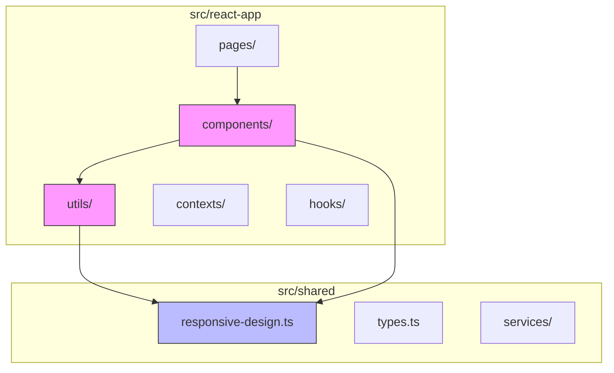

**Diagram sources**
- [MobilePropertyCard.tsx](file://src/react-app/components/MobilePropertyCard.tsx)
- [responsive.ts](file://src/react-app/utils/responsive.ts)
- [responsive-design.ts](file://src/shared/responsive-design.ts)

**Section sources**
- [MobilePropertyCard.tsx](file://src/react-app/components/MobilePropertyCard.tsx)
- [responsive.ts](file://src/react-app/utils/responsive.ts)

## Core Components
The mobile component implementation in HabibiStay focuses on two key components: `MobilePropertyCard` and `MobileSearchBar`. These components demonstrate best practices in mobile-first design, with optimized layouts, touch interactions, and performance considerations.

The `MobilePropertyCard` component serves as a primary interface element for property listings, designed to work efficiently on mobile devices with limited screen real estate. It supports multiple view modes (grid and list) and incorporates mobile-specific optimizations for touch interactions and visual hierarchy.

The `MobileSearchBar` component implements a mobile-optimized search interface with a bottom sheet filter modal, following modern mobile design patterns for form inputs and filter management.

**Section sources**
- [MobilePropertyCard.tsx](file://src/react-app/components/MobilePropertyCard.tsx#L1-L293)
- [MobileSearchBar.tsx](file://src/react-app/components/MobileSearchBar.tsx#L1-L262)

## Architecture Overview
The mobile component architecture follows a mobile-first, responsive design approach, leveraging utility-first CSS (Tailwind) and React components to create adaptive interfaces.

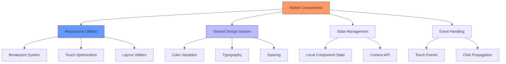

**Diagram sources**
- [MobilePropertyCard.tsx](file://src/react-app/components/MobilePropertyCard.tsx#L1-L293)
- [responsive.ts](file://src/react-app/utils/responsive.ts#L1-L297)
- [responsive-design.ts](file://src/shared/responsive-design.ts#L1-L310)

## Detailed Component Analysis

### MobilePropertyCard Analysis
The `MobilePropertyCard` component is a responsive property listing card optimized for mobile devices. It supports two view modes: grid and list, adapting its layout based on the context in which it's used.

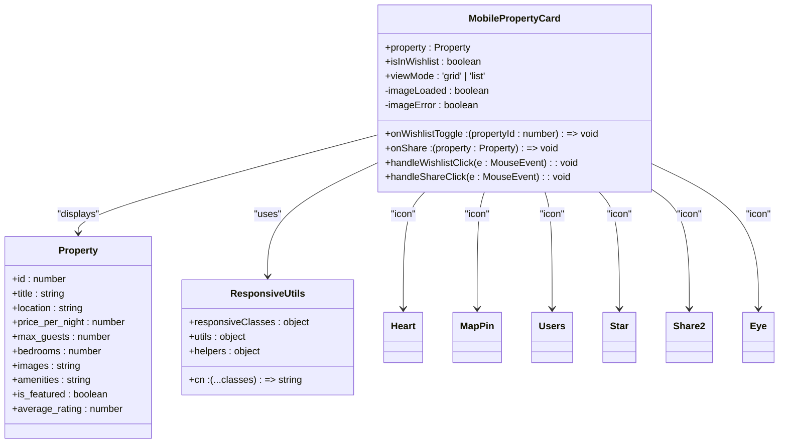

**Diagram sources**
- [MobilePropertyCard.tsx](file://src/react-app/components/MobilePropertyCard.tsx#L1-L293)
- [responsive.ts](file://src/react-app/utils/responsive.ts#L1-L297)

**Section sources**
- [MobilePropertyCard.tsx](file://src/react-app/components/MobilePropertyCard.tsx#L1-L293)

### MobileSearchBar Analysis
The `MobileSearchBar` component implements a mobile-optimized search interface with a bottom sheet filter modal, following modern mobile design patterns for form inputs and filter management.

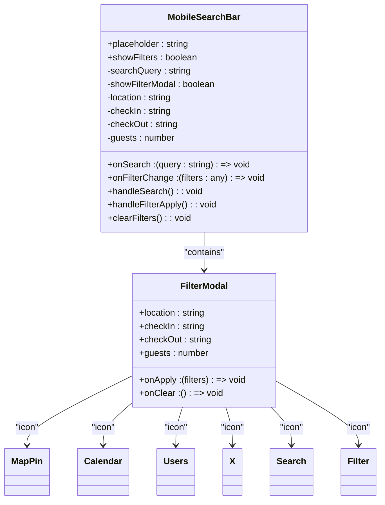

**Diagram sources**
- [MobileSearchBar.tsx](file://src/react-app/components/MobileSearchBar.tsx#L1-L262)
- [responsive.ts](file://src/react-app/utils/responsive.ts#L1-L297)

**Section sources**
- [MobileSearchBar.tsx](file://src/react-app/components/MobileSearchBar.tsx#L1-L262)

## Responsive Design System

### Responsive Utility Framework
The application implements a comprehensive responsive design system through the `responsive.ts` utility file, which provides a structured approach to responsive styling using Tailwind CSS classes.

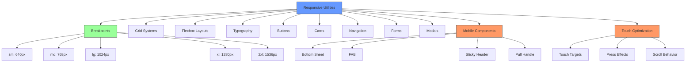

**Diagram sources**
- [responsive.ts](file://src/react-app/utils/responsive.ts#L1-L297)
- [responsive-design.ts](file://src/shared/responsive-design.ts#L1-L310)

**Section sources**
- [responsive.ts](file://src/react-app/utils/responsive.ts#L1-L297)

### Responsive Class Structure
The responsive design system organizes classes into logical categories, each with mobile-first responsive variants:

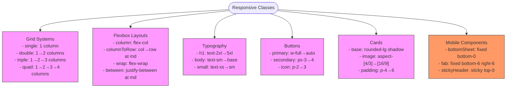

**Diagram sources**
- [responsive.ts](file://src/react-app/utils/responsive.ts#L15-L150)

## Touch Target Optimization

### Touch Target Guidelines
The application follows mobile accessibility guidelines for touch target sizing, ensuring all interactive elements meet minimum size requirements.

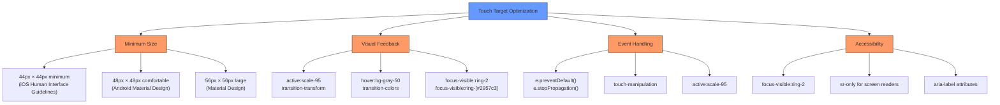

**Diagram sources**
- [responsive.ts](file://src/react-app/utils/responsive.ts#L243-L297)
- [responsive-design.ts](file://src/shared/responsive-design.ts#L194-L220)

### Touch Target Implementation
The touch target optimization is implemented through utility classes and component patterns:

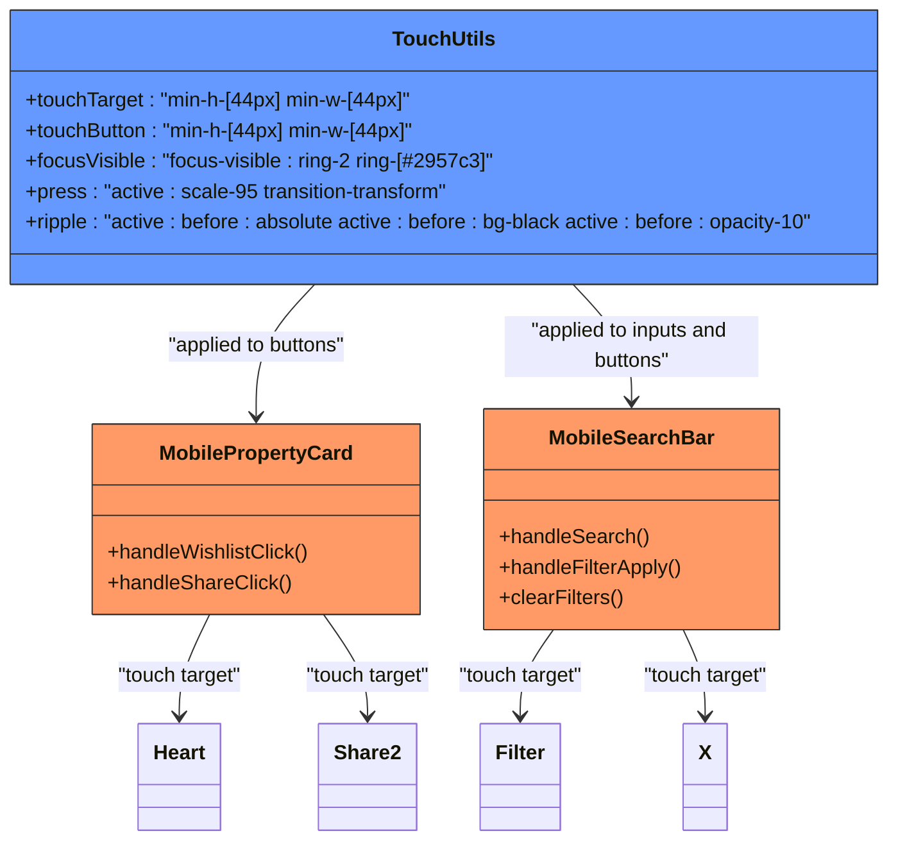

**Diagram sources**
- [responsive.ts](file://src/react-app/utils/responsive.ts#L243-L297)
- [MobilePropertyCard.tsx](file://src/react-app/components/MobilePropertyCard.tsx#L1-L293)
- [MobileSearchBar.tsx](file://src/react-app/components/MobileSearchBar.tsx#L1-L262)

## Mobile Navigation Patterns

### Bottom Sheet Navigation
The application implements a bottom sheet pattern for filter navigation on mobile devices, providing an intuitive interface for form inputs.

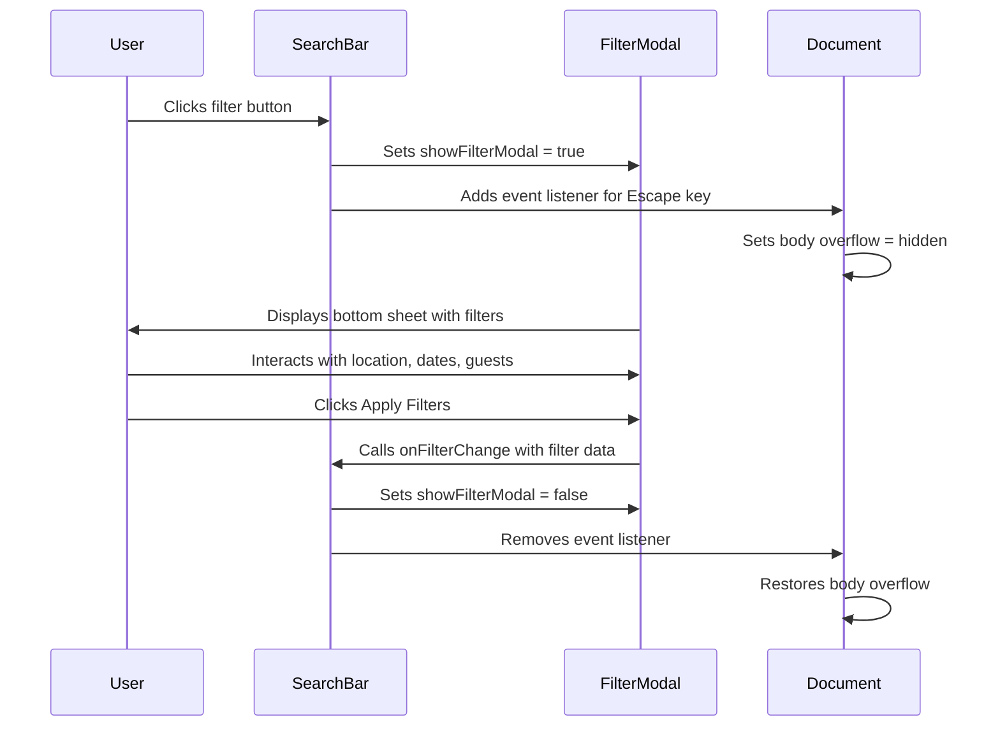

**Diagram sources**
- [MobileSearchBar.tsx](file://src/react-app/components/MobileSearchBar.tsx#L1-L262)

### Mobile Navigation Components
The responsive design system includes specialized components for mobile navigation:

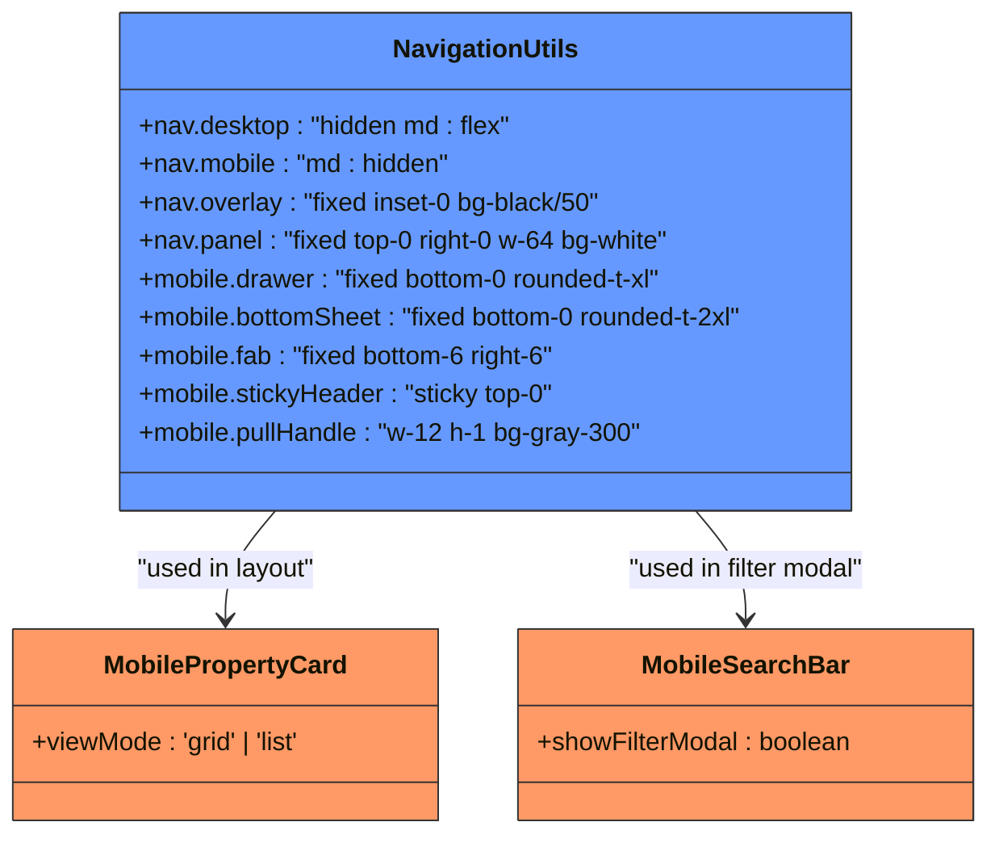

**Diagram sources**
- [responsive.ts](file://src/react-app/utils/responsive.ts#L88-L111)
- [MobileSearchBar.tsx](file://src/react-app/components/MobileSearchBar.tsx#L1-L262)

## Performance Optimization

### Image Loading Strategy
The application implements a progressive image loading strategy to optimize performance on mobile networks.

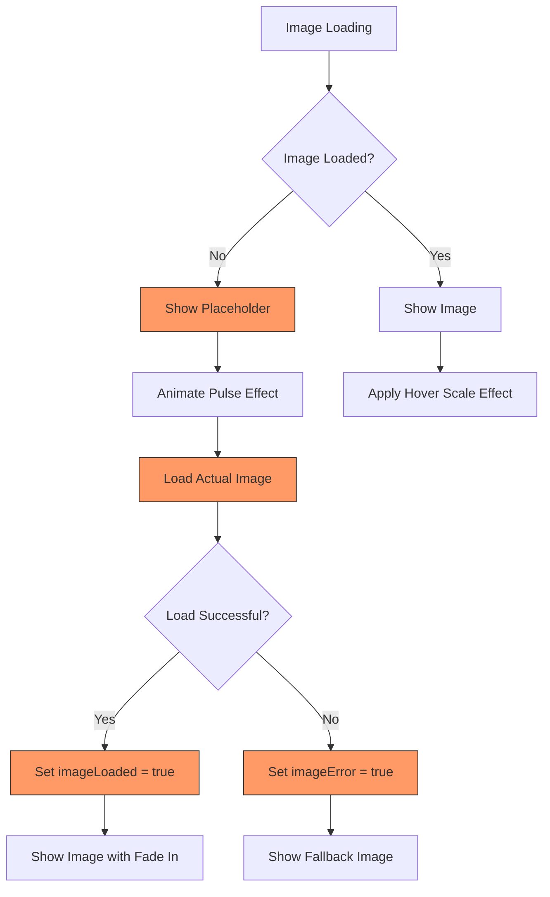

**Diagram sources**
- [MobilePropertyCard.tsx](file://src/react-app/components/MobilePropertyCard.tsx#L1-L293)

### Performance Optimization Techniques
The mobile components implement several performance optimization techniques:

```mermaid
graph TD
A[Performance Optimization] --> B[Image Optimization]
A --> C[Event Optimization]
A --> D[Rendering Optimization]
A --> E[Network Optimization]
B --> B1["Lazy loading with placeholder"]
B --> B2["Responsive image sizing"]
B --> B3["Fallback images"]
B --> B4["Optimized image URLs"]
C --> C1["e.stopPropagation()"]
C --> C2["e.preventDefault()"]
C --> C3["Debounced input handling"]
C --> C4["Escape key handling"]
D --> D1["Conditional rendering"]
D --> D2["Memoization"]
D --> D3["Efficient state updates"]
D --> D4["CSS transitions over JS animations"]
E --> E1["Minimized re-renders"]
E --> E2["Efficient data fetching"]
E --> E3["Caching strategies"]
E --> E4["Optimized API calls"]
style A fill:#69f,stroke:#333
style B fill:#f96,stroke:#333
style C fill:#f96,stroke:#333
style D fill:#f96,stroke:#333
style E fill:#f96,stroke:#333
```

**Diagram sources**
- [MobilePropertyCard.tsx](file://src/react-app/components/MobilePropertyCard.tsx#L1-L293)
- [MobileSearchBar.tsx](file://src/react-app/components/MobileSearchBar.tsx#L1-L262)
- [responsive.ts](file://src/react-app/utils/responsive.ts#L1-L297)

## Conclusion
The mobile component patterns in HabibiStay demonstrate a comprehensive approach to mobile-first design, with a strong emphasis on responsive layouts, touch optimization, and performance considerations. The implementation leverages a utility-first CSS approach with Tailwind, combined with React components that adapt to different screen sizes and interaction methods.

Key takeaways from the mobile component implementation include:

1. **Mobile-first responsive design**: The application uses a mobile-first approach with breakpoints that scale appropriately for different device sizes.

2. **Touch target optimization**: All interactive elements meet or exceed the recommended minimum touch target size of 44px × 44px, ensuring accessibility and ease of use.

3. **Performance-conscious rendering**: Components implement efficient rendering patterns, including lazy loading, conditional rendering, and optimized event handling.

4. **Consistent design system**: A shared responsive utility system ensures consistency across components while allowing for flexibility in implementation.

5. **Mobile-specific patterns**: The use of bottom sheets, floating action buttons, and sticky headers follows established mobile design patterns that users expect.

These patterns provide a solid foundation for building mobile-optimized interfaces that perform well across a range of devices and network conditions.