# Mobile UX Patterns

<cite>
**Referenced Files in This Document**   
- [MobilePropertyCard.tsx](file://src/react-app/components/MobilePropertyCard.tsx)
- [MobileSearchBar.tsx](file://src/react-app/components/MobileSearchBar.tsx)
- [responsive.ts](file://src/react-app/utils/responsive.ts)
- [responsive-design.ts](file://src/shared/responsive-design.ts)
- [PropertyCard.test.tsx](file://src/react-app/components/__tests__/PropertyCard.test.tsx)
- [MobilePropertyCard.test.tsx](file://src/react-app/components/__tests__/MobilePropertyCard.test.tsx)
- [PRODUCTION_IMPLEMENTATION_PLAN.md](file://PRODUCTION_IMPLEMENTATION_PLAN.md)
</cite>

## Table of Contents
1. [Introduction](#introduction)
2. [Project Structure](#project-structure)
3. [Core Components](#core-components)
4. [Architecture Overview](#architecture-overview)
5. [Detailed Component Analysis](#detailed-component-analysis)
6. [Responsive Design System](#responsive-design-system)
7. [Touch Target Optimization](#touch-target-optimization)
8. [Mobile Navigation Patterns](#mobile-navigation-patterns)
9. [Performance Optimization](#performance-optimization)
10. [Testing and Validation](#testing-and-validation)

## Introduction

This document provides comprehensive documentation for mobile-specific UX patterns and components in the HabibiStay application. The analysis covers design principles, component implementations, and responsive strategies for mobile devices, with detailed guidelines for touch targets, mobile navigation, and performance optimization on mobile networks.

The HabibiStay application implements a mobile-first approach with comprehensive responsive design patterns, ensuring optimal user experience across various device sizes and interaction methods. The system leverages Tailwind CSS for responsive styling and includes specialized components for mobile interactions.

## Project Structure

The project follows a feature-based organization with clear separation of concerns. Mobile-specific components are located within the components directory and are designed to work seamlessly with the responsive utilities system.

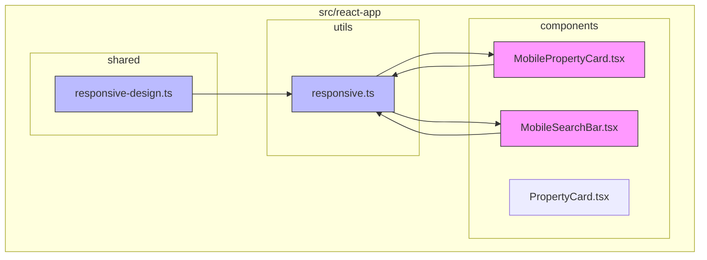

**Diagram sources**
- [MobilePropertyCard.tsx](file://src/react-app/components/MobilePropertyCard.tsx)
- [MobileSearchBar.tsx](file://src/react-app/components/MobileSearchBar.tsx)
- [responsive.ts](file://src/react-app/utils/responsive.ts)
- [responsive-design.ts](file://src/shared/responsive-design.ts)

**Section sources**
- [MobilePropertyCard.tsx](file://src/react-app/components/MobilePropertyCard.tsx)
- [MobileSearchBar.tsx](file://src/react-app/components/MobileSearchBar.tsx)
- [responsive.ts](file://src/react-app/utils/responsive.ts)

## Core Components

The mobile UX implementation centers around two primary components: MobilePropertyCard and MobileSearchBar. These components are specifically optimized for touch interactions and small screen layouts.

The MobilePropertyCard component displays property listings in a mobile-optimized format with appropriate touch targets and responsive layouts. The MobileSearchBar component implements a mobile-friendly search interface with a bottom sheet filter modal for enhanced usability on small screens.

Both components leverage the responsive utilities system to ensure consistent behavior across different device sizes and orientations.

**Section sources**
- [MobilePropertyCard.tsx](file://src/react-app/components/MobilePropertyCard.tsx)
- [MobileSearchBar.tsx](file://src/react-app/components/MobileSearchBar.tsx)

## Architecture Overview

The mobile UX architecture follows a layered approach with clear separation between presentation components and responsive utilities. The system is designed to be composable and maintainable, with reusable utility functions and class builders.

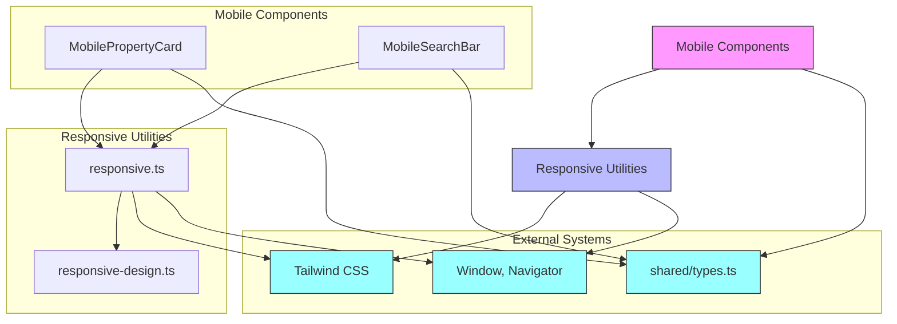

**Diagram sources**
- [MobilePropertyCard.tsx](file://src/react-app/components/MobilePropertyCard.tsx)
- [MobileSearchBar.tsx](file://src/react-app/components/MobileSearchBar.tsx)
- [responsive.ts](file://src/react-app/utils/responsive.ts)
- [responsive-design.ts](file://src/shared/responsive-design.ts)
- [types.ts](file://src/shared/types.ts)

## Detailed Component Analysis

### MobilePropertyCard Analysis

The MobilePropertyCard component is a key mobile-specific UI element that displays property listings in a format optimized for small screens and touch interactions.

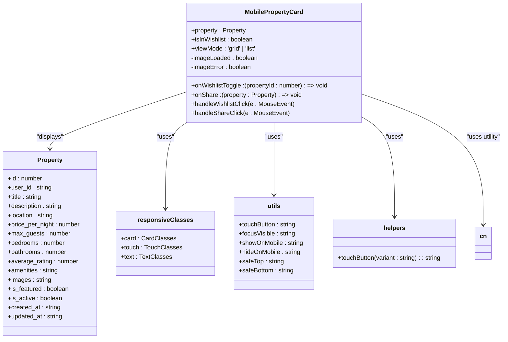

**Diagram sources**
- [MobilePropertyCard.tsx](file://src/react-app/components/MobilePropertyCard.tsx#L1-L293)
- [responsive.ts](file://src/react-app/utils/responsive.ts#L1-L296)

**Section sources**
- [MobilePropertyCard.tsx](file://src/react-app/components/MobilePropertyCard.tsx#L1-L293)

#### Grid vs List View Implementation

The MobilePropertyCard component supports two display modes: grid and list. This flexibility allows for optimal space utilization on different screen sizes and user preferences.

In grid view, the component displays properties with larger images and more prominent information, suitable for discovery and browsing. In list view, it uses a more compact format with reduced image size and condensed information, ideal for quick scanning of multiple properties.

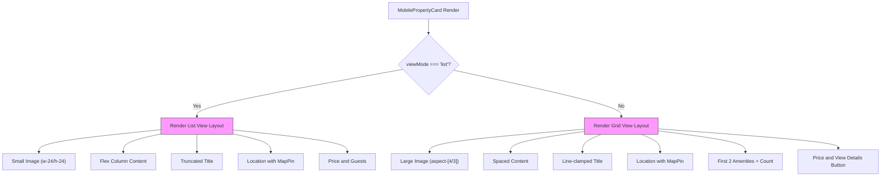

**Diagram sources**
- [MobilePropertyCard.tsx](file://src/react-app/components/MobilePropertyCard.tsx#L50-L293)

### MobileSearchBar Analysis

The MobileSearchBar component implements a mobile-optimized search interface with a bottom sheet filter modal for enhanced usability on small screens.

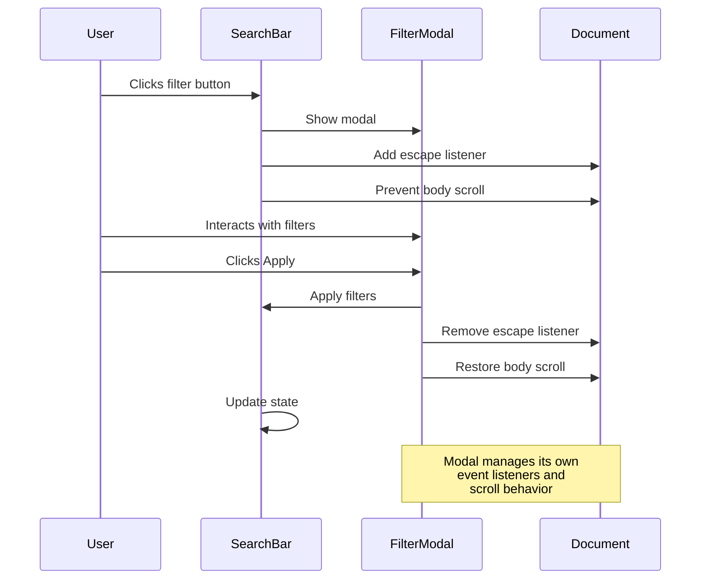

**Diagram sources**
- [MobileSearchBar.tsx](file://src/react-app/components/MobileSearchBar.tsx#L1-L262)

**Section sources**
- [MobileSearchBar.tsx](file://src/react-app/components/MobileSearchBar.tsx#L1-L262)

## Responsive Design System

The application implements a comprehensive responsive design system through utility functions and class patterns that ensure consistent mobile UX across components.

### Breakpoint System

The system uses Tailwind CSS breakpoints as the foundation for responsive design:

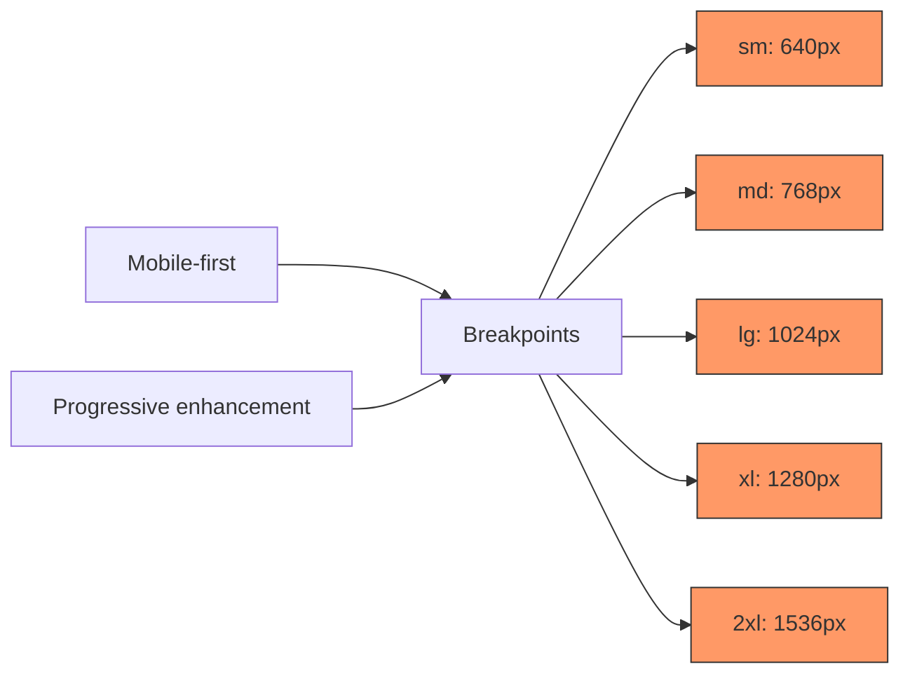

**Diagram sources**
- [responsive.ts](file://src/react-app/utils/responsive.ts#L6-L12)

### Responsive Class Patterns

The responsive system provides pre-defined class patterns for common layout scenarios:

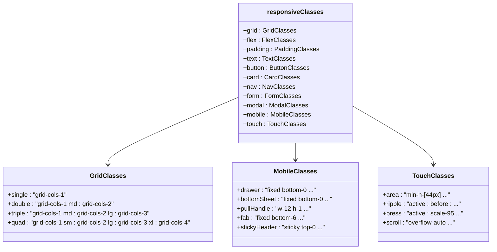

**Diagram sources**
- [responsive.ts](file://src/react-app/utils/responsive.ts#L14-L168)

## Touch Target Optimization

The application implements comprehensive touch target optimization to ensure accessibility and usability on touch devices.

### Touch Target Guidelines

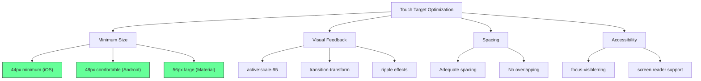

**Diagram sources**
- [responsive-design.ts](file://src/shared/responsive-design.ts#L194-L202)
- [responsive.ts](file://src/react-app/utils/responsive.ts#L138-L143)

### Implementation in Components

The touch target optimization is implemented consistently across mobile components:

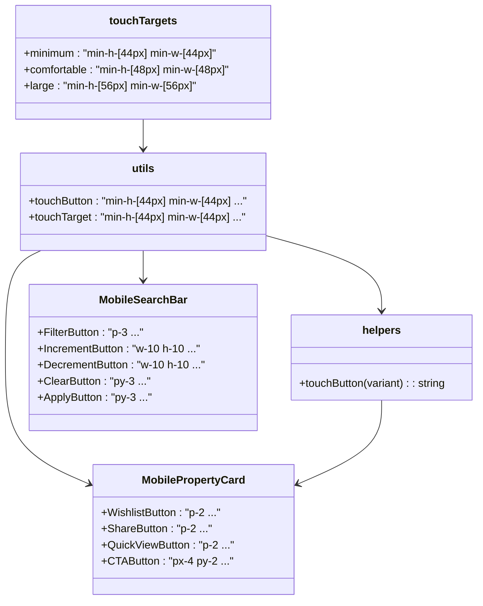

**Diagram sources**
- [responsive-design.ts](file://src/shared/responsive-design.ts#L194-L202)
- [responsive.ts](file://src/react-app/utils/responsive.ts#L138-L143)
- [MobilePropertyCard.tsx](file://src/react-app/components/MobilePropertyCard.tsx)
- [MobileSearchBar.tsx](file://src/react-app/components/MobileSearchBar.tsx)

## Mobile Navigation Patterns

The application implements several mobile-specific navigation patterns to enhance usability on small screens.

### Bottom Sheet Pattern

The MobileSearchBar component uses a bottom sheet pattern for filter selection, which is optimal for mobile devices:

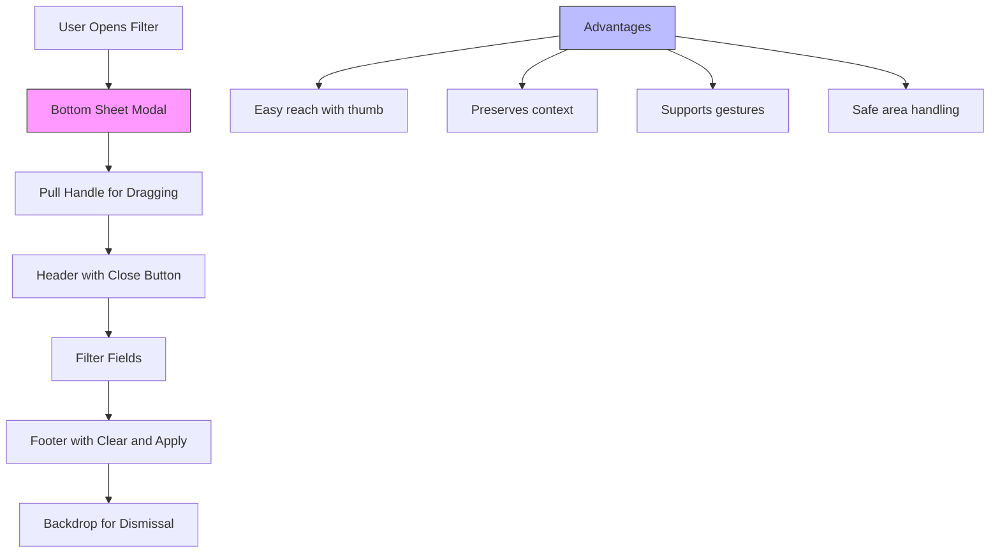

**Diagram sources**
- [MobileSearchBar.tsx](file://src/react-app/components/MobileSearchBar.tsx#L100-L250)

### Sticky Header Pattern

The search bar implements a sticky header pattern to maintain visibility during scrolling:

```mermaid
classDiagram
class utils {
+stickyHeader : "sticky top-0 bg-white/95 ..."
}
class MobileSearchBar {
+className : "... utils.stickyHeader ..."
}
utils --> MobileSearchBar
note right of utils
Uses backdrop-blur-sm for
translucent effect when
scrolling over content
end note
```

**Diagram sources**
- [responsive.ts](file://src/react-app/utils/responsive.ts#L132-L133)
- [MobileSearchBar.tsx](file://src/react-app/components/MobileSearchBar.tsx#L10)

## Performance Optimization

The application implements several performance optimizations specifically for mobile networks and devices.

### Image Optimization

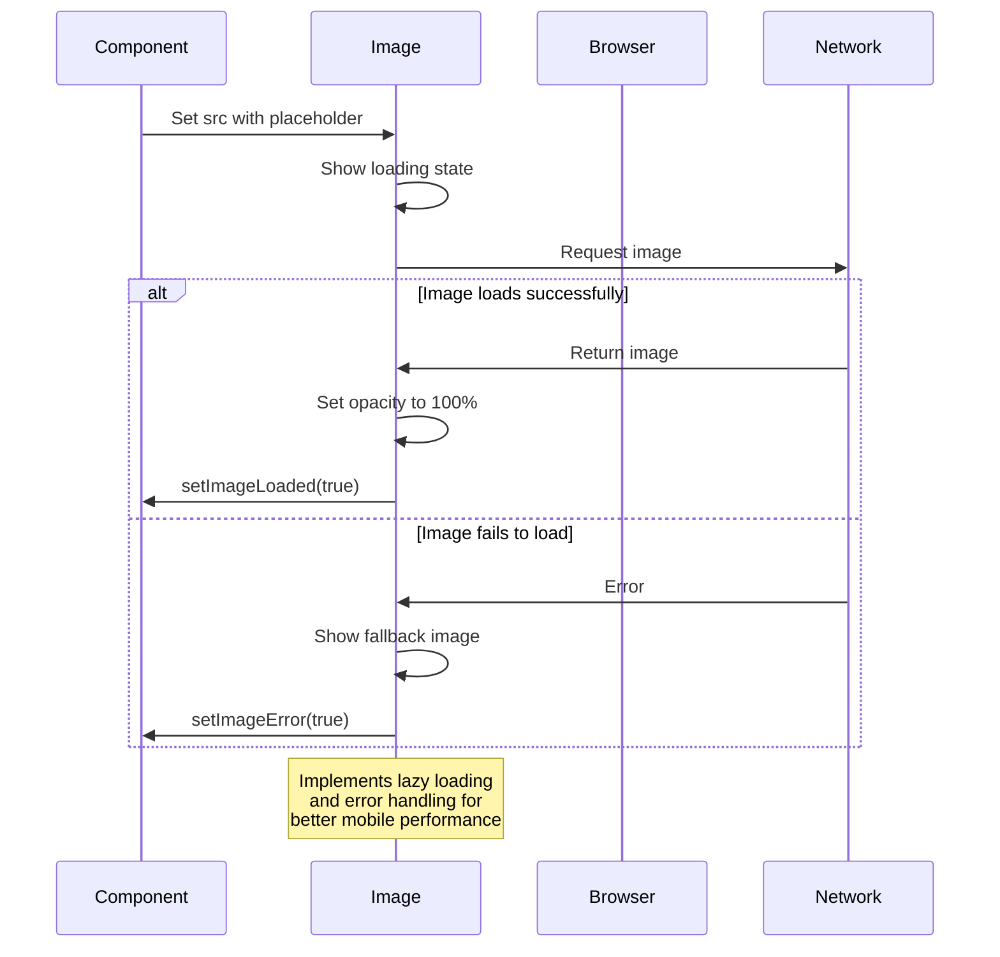

**Diagram sources**
- [MobilePropertyCard.tsx](file://src/react-app/components/MobilePropertyCard.tsx#L20-L45)

### Responsive Image Sizing

The system implements responsive image sizing to minimize bandwidth usage on mobile networks:

```mermaid
classDiagram
class responsive-design {
+getOptimalImageSize(breakpoint, containerWidth)
+width : number
+sizes : string
}
class PropertyCard {
+sizes attribute
+srcSet handling
}
responsive-design --> PropertyCard : "provides sizing"
note right of responsive-design
Calculates optimal width with<br/>device pixel ratio consideration<br/>and generates sizes attribute<br/>for responsive images
end note
```

**Diagram sources**
- [responsive-design.ts](file://src/shared/responsive-design.ts#L249-L275)
- [PRODUCTION_IMPLEMENTATION_PLAN.md](file://PRODUCTION_IMPLEMENTATION_PLAN.md#L224-L345)

## Testing and Validation

The mobile components are thoroughly tested to ensure consistent behavior across different scenarios.

### Test Coverage

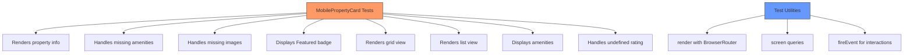

**Diagram sources**
- [MobilePropertyCard.test.tsx](file://src/react-app/components/__tests__/MobilePropertyCard.test.tsx)

### Testing Implementation

The testing strategy ensures comprehensive validation of mobile-specific behaviors:

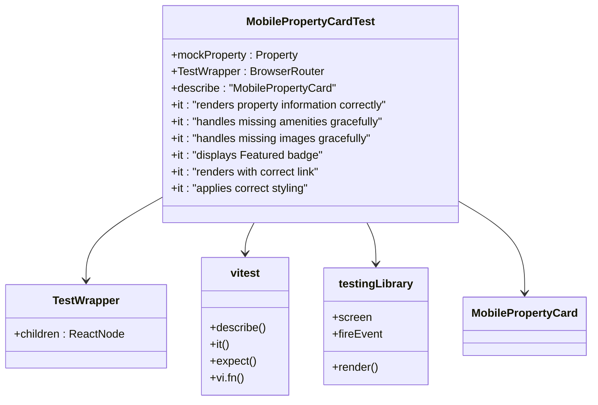

**Diagram sources**
- [MobilePropertyCard.test.tsx](file://src/react-app/components/__tests__/MobilePropertyCard.test.tsx#L1-L229)

**Section sources**
- [MobilePropertyCard.test.tsx](file://src/react-app/components/__tests__/MobilePropertyCard.test.tsx#L1-L229)