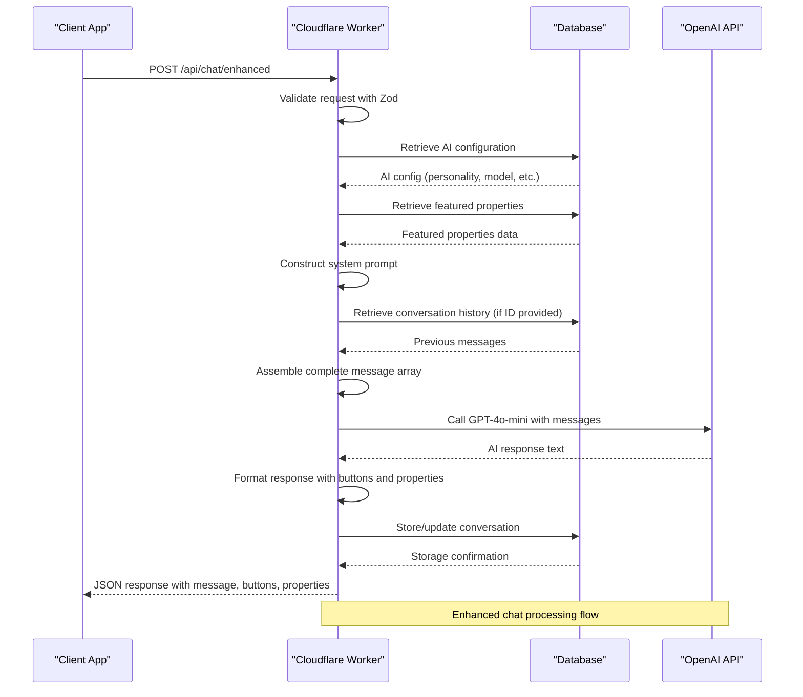
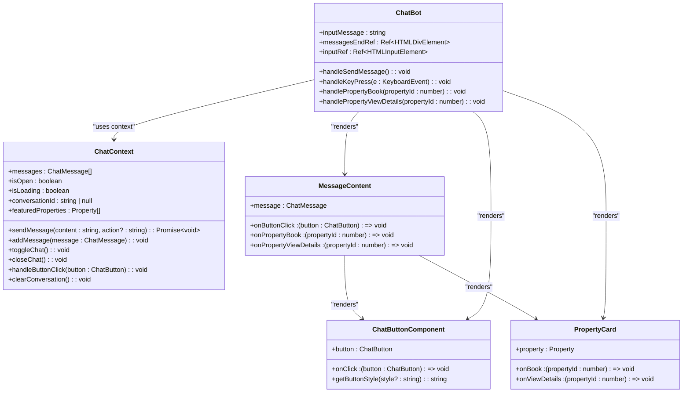

# Chat Endpoints

<cite>
**Referenced Files in This Document**   
- [index.ts](file://src/worker/index.ts#L559-L749)
- [index.ts](file://src/worker/index.ts#L1660-L1859)
- [ChatContext.tsx](file://src/react-app/contexts/ChatContext.tsx#L189-L219)
- [ChatContext.tsx](file://src/react-app/contexts/ChatContext.tsx#L200-L452)
- [ChatBot.tsx](file://src/react-app/components/ChatBot.tsx#L223-L282)
- [types.ts](file://src/shared/types.ts#L108-L111)
- [security-utils.test.ts](file://src/test/security-utils.test.ts#L152-L176)
</cite>

## Table of Contents
1. [Chat API Endpoints](#chat-api-endpoints)
2. [Request and Response Schema](#request-and-response-schema)
3. [Authentication and Rate Limiting](#authentication-and-rate-limiting)
4. [Server-Side Processing Flow](#server-side-processing-flow)
5. [Frontend Integration](#frontend-integration)
6. [Security Considerations](#security-considerations)

## Chat API Endpoints

The HabibiStay platform provides two primary chat endpoints for interacting with the AI assistant Sara, which interfaces with OpenAI's GPT-4o-mini model. These endpoints are implemented in the Cloudflare Worker at `src/worker/index.ts` and serve as the backend for the frontend chat interface.

The primary endpoint `/api/chat` provides basic AI functionality, while the enhanced endpoint `/api/chat/enhanced` offers advanced features including conversation history, dynamic system prompts, and interactive UI elements. Both endpoints use the POST method and accept JSON payloads containing user messages.

**Section sources**
- [index.ts](file://src/worker/index.ts#L559-L749)
- [index.ts](file://src/worker/index.ts#L1660-L1859)

## Request and Response Schema

### POST /api/chat

This endpoint serves as the basic interface to the OpenAI GPT-4o-mini model.

**:HTTP Method**
- POST

**:URL Pattern**
- `/api/chat`

**:Request Parameters (Body Only)**
The request body must be a JSON object with the following structure:

```json
{
  "message": "string"
}
```

**:Response Schema**
The response is a JSON object with the following structure:

```json
{
  "success": "boolean",
  "data": {
    "message": "string"
  },
  "error": "string"
}
```

**:Example Request**
```json
{
  "message": "Hello, can you tell me about HabibiStay?"
}
```

**:Example Response**
```json
{
  "success": true,
  "data": {
    "message": "I'm Sara, your personal accommodation assistant at HabibiStay. I'm here to help you find the perfect stay in Riyadh."
  }
}
```

### POST /api/chat/enhanced

This enhanced endpoint provides a richer chat experience with conversation context and interactive elements.

**:HTTP Method**
- POST

**:URL Pattern**
- `/api/chat/enhanced`

**:Request Parameters (Body Only)**
The request body must be a JSON object with the following structure:

```json
{
  "message": "string",
  "conversation_id": "string (optional)"
}
```

**:Response Schema**
The response is a JSON object with an extended structure that includes UI elements:

```json
{
  "success": "boolean",
  "data": {
    "message": "string",
    "conversation_id": "string",
    "buttons": [
      {
        "id": "string",
        "text": "string",
        "action": "string",
        "style": "string",
        "data": "object (optional)"
      }
    ],
    "featured_properties": [
      {
        "id": "number",
        "title": "string",
        "location": "string",
        "price_per_night": "number",
        "max_guests": "number",
        "description": "string",
        "images": "array",
        "bedrooms": "number",
        "bathrooms": "number",
        "amenities": "array",
        "is_featured": "boolean",
        "is_active": "boolean"
      }
    ]
  },
  "error": "string"
}
```

**:Example Request**
```json
{
  "message": "I want to find a luxury property in Riyadh",
  "conversation_id": "session_12345"
}
```

**:Example Response**
```json
{
  "success": true,
  "data": {
    "message": "I'd be happy to help you find a luxury property in Riyadh. Here are some of our featured properties:",
    "conversation_id": "session_12345",
    "buttons": [
      {
        "id": "search_properties",
        "text": "🏠 Browse Properties",
        "action": "search",
        "style": "primary"
      },
      {
        "id": "check_availability",
        "text": "📅 Check Availability",
        "action": "availability",
        "style": "secondary"
      }
    ],
    "featured_properties": [
      {
        "id": 101,
        "title": "Luxury Villa in Diplomatic Quarter",
        "location": "Diplomatic Quarter, Riyadh",
        "price_per_night": 1200,
        "max_guests": 8,
        "description": "Spacious villa with private pool and garden",
        "images": [
          "https://example.com/images/villa1.jpg"
        ],
        "bedrooms": 4,
        "bathrooms": 4,
        "amenities": ["wifi", "parking", "pool", "gym"],
        "is_featured": true,
        "is_active": true
      }
    ]
  }
}
```

**:Status Codes**
- **200**: Success - Request processed successfully
- **400**: Bad Request - Invalid request parameters
- **401**: Unauthorized - Authentication required
- **429**: Too Many Requests - Rate limit exceeded
- **500**: Internal Server Error - Server processing error

**:Error Response Structure**
```json
{
  "success": false,
  "error": "string - Descriptive error message"
}
```

**Section sources**
- [index.ts](file://src/worker/index.ts#L559-L749)
- [index.ts](file://src/worker/index.ts#L1660-L1859)
- [types.ts](file://src/shared/types.ts#L108-L111)

## Authentication and Rate Limiting

### Authentication Requirements

The `/api/chat` and `/api/chat/enhanced` endpoints do not require authentication for basic usage, allowing guests to interact with the AI assistant without logging in. However, certain enhanced features and administrative endpoints require authentication.

The `/api/chat/test` endpoint, used for testing AI configurations, requires authentication and is restricted to admin and owner users. This is enforced by the `authMiddleware` which verifies the user's credentials and checks if their email contains 'admin' or 'owner'.

```typescript
const user = c.get("user");
if (!user || (!user.email.includes('admin') && !user.email.includes('owner'))) {
  return c.json<ApiResponse>({
    success: false,
    error: "Unauthorized",
  }, 403);
}
```

### Rate Limiting Implementation

The system implements rate limiting to prevent abuse of the AI service and protect against denial-of-service attacks. The rate limiting mechanism is tested in `src/test/security-utils.test.ts` and follows these parameters:

**:Rate Limit Configuration**
- **Requests per window**: 5 requests
- **Time window**: 60,000 milliseconds (1 minute)
- **Identifier**: IP address

The rate limiter tracks requests by IP address and blocks clients that exceed the allowed number of requests within the specified time window. After the window expires, the request counter resets, allowing the client to make requests again.

**:Rate Limiting Test Cases**
```typescript
it('should allow requests within limit', () => {
  const limiter = new RateLimiter(5, 60000); // 5 requests per minute
  
  expect(limiter.isAllowed('127.0.0.1')).toBe(true);
  expect(limiter.isAllowed('127.0.0.1')).toBe(true);
  expect(limiter.isAllowed('127.0.0.1')).toBe(true);
});

it('should block requests that exceed limit', () => {
  const limiter = new RateLimiter(2, 60000); // 2 requests per minute
  
  expect(limiter.isAllowed('127.0.0.1')).toBe(true);
  expect(limiter.isAllowed('127.0.0.1')).toBe(true);
  expect(limiter.isAllowed('127.0.0.1')).toBe(false); // Third request blocked
});
```

When a client exceeds the rate limit, the server returns a 429 status code with an appropriate error message. This prevents excessive usage of the AI service, which could lead to high OpenAI API costs and degraded performance for other users.

**Section sources**
- [index.ts](file://src/worker/index.ts#L1660-L1859)
- [security-utils.test.ts](file://src/test/security-utils.test.ts#L152-L176)

## Server-Side Processing Flow

The server-side processing flow for the chat endpoints follows a structured sequence of operations that ensures robust handling of user requests and proper integration with external services.



**Diagram sources**
- [index.ts](file://src/worker/index.ts#L1660-L1859)

### Request Validation with Zod

The chat endpoints use Zod for request validation, ensuring that incoming requests conform to the expected schema. The `ChatRequestSchema` defined in `src/shared/types.ts` validates that the request contains a message string and an optional conversation_id string.

```typescript
export const ChatRequestSchema = z.object({
  message: z.string(),
  conversation_id: z.string().optional(),
});
```

The validation is applied using the `zValidator` middleware, which automatically parses and validates the JSON request body:

```typescript
app.post("/api/chat/enhanced", zValidator("json", ChatRequestSchema), async (c) => {
  const { message, conversation_id } = c.req.valid("json");
  // Process validated request
});
```

### Context Enrichment with User and Property Data

The enhanced chat endpoint enriches the AI context with relevant data from the database to provide more personalized and accurate responses.

First, the system retrieves the current AI configuration from the database, which includes settings such as:
- AI personality (professional, friendly, or casual)
- Model provider and name
- Temperature and token limits
- Custom system prompt

```typescript
const aiConfig = await c.env.DB.prepare(
  "SELECT * FROM ai_config WHERE is_active = 1 ORDER BY created_at DESC LIMIT 1"
).first();
```

Next, the system fetches featured properties to include in the context, allowing the AI to make specific recommendations:

```typescript
const { results: featuredProperties } = await c.env.DB.prepare(
  "SELECT * FROM properties WHERE is_featured = 1 AND is_active = 1 ORDER BY created_at DESC LIMIT 2"
).all();
```

### Formatting for OpenAI API

The system constructs a dynamic system prompt based on the AI configuration, which guides the behavior of the GPT-4o-mini model:

```typescript
const defaultSystemPrompt = `You are Sara, a ${config.personality} and helpful AI assistant for HabibiStay, a premium short-term rental platform in Riyadh, Saudi Arabia.

Your role is to help guests discover and book exceptional accommodations. You should:
- Be ${config.personality === 'professional' ? 'professional and formal' : config.personality === 'friendly' ? 'warm, friendly, and welcoming' : 'casual and conversational'}
- Focus on the guest experience and finding perfect stays
- Help with property search, booking questions, and local recommendations
- Always provide helpful, accurate information about our properties and services
- Use interactive buttons when possible to minimize text input
- Guide users through the booking process within the chat interface

Featured properties available:
${featuredProperties.map((p: any) => `- ${p.title} in ${p.location}: ${p.description || 'Luxury accommodation'} - ${p.price_per_night} SAR/night (Max ${p.max_guests} guests)`).join('\n')}

Always aim to create an exceptional guest experience while maintaining our brand values of trust, excellence, and shared growth.`;
```

The system then assembles the complete message array, including the system prompt, conversation history (if available), and the current user message:

```typescript
let messages = [{ role: 'system' as const, content: systemPrompt }];
    
if (conversation_id) {
  const conversation = await c.env.DB.prepare(
    "SELECT * FROM chat_conversations WHERE session_id = ? AND is_active = 1"
  ).bind(conversation_id).first();
  
  if (conversation) {
    const storedMessages = JSON.parse((conversation as any).messages || '[]');
    messages = [...messages, ...storedMessages];
  }
}
    
// Add current user message
messages.push({ role: 'user', content: message });
```

### Response Processing and Storage

After receiving the response from the OpenAI API, the system formats it with additional UI elements and stores the conversation for future context:

```typescript
// Store/update conversation
const sessionId = conversation_id || `session_${Date.now()}_${Math.random().toString(36).substr(2, 9)}`;
    
await c.env.DB.prepare(`
  INSERT OR REPLACE INTO chat_conversations (session_id, messages, is_active, updated_at)
  VALUES (?, ?, 1, CURRENT_TIMESTAMP)
`).bind(sessionId, JSON.stringify(messages.slice(1))).run(); // Skip system message
```

The final response includes not only the AI-generated message but also interactive buttons and featured properties to enhance the user experience:

```typescript
const response = {
  message: responseMessage || "I'm here to help you find the perfect stay!",
  conversation_id: sessionId,
  buttons: [
    { id: 'search_properties', text: '🏠 Browse Properties', action: 'search', style: 'primary' },
    { id: 'check_availability', text: '📅 Check Availability', action: 'availability', style: 'secondary' },
    { id: 'book_now', text: '💳 Book Now', action: 'book', style: 'success' },
    { id: 'get_support', text: '💬 Get Support', action: 'support', style: 'secondary' },
  ],
  featured_properties: featuredProperties.slice(0, 2),
};
```

**Section sources**
- [index.ts](file://src/worker/index.ts#L1660-L1859)
- [types.ts](file://src/shared/types.ts#L108-L111)

## Frontend Integration

The chat functionality is integrated into the frontend through two key components: `ChatBot.tsx` and `ChatContext.tsx`. These components work together to provide a seamless user experience with state management, UI rendering, and communication with the backend API.



**Diagram sources**
- [ChatBot.tsx](file://src/react-app/components/ChatBot.tsx#L223-L282)
- [ChatContext.tsx](file://src/react-app/contexts/ChatContext.tsx#L189-L219)

### ChatContext.tsx - State Management

The `ChatContext.tsx` file implements a React context for managing the global state of the chat interface. This context provides state and functions to all components that need to interact with the chat system.

**:Key State Variables**
- **messages**: Array of chat messages with role, content, timestamp, and metadata
- **isOpen**: Boolean indicating whether the chat window is open
- **isLoading**: Boolean indicating whether a message is being processed
- **conversationId**: Unique identifier for the current conversation
- **featuredProperties**: Array of featured property objects for recommendations
- **currentBooking**: Current booking data being collected
- **voiceEnabled**: Boolean indicating whether voice input/output is enabled
- **isListening**: Boolean indicating whether voice recognition is active

**:Key Functions**
- **sendMessage**: Sends a message to the backend API and updates the chat state
- **addMessage**: Adds a message to the chat history
- **toggleChat**: Toggles the visibility of the chat window
- **closeChat**: Closes the chat window
- **handleButtonClick**: Handles clicks on interactive buttons in AI responses
- **showPropertyCard**: Displays a property card in the chat
- **initiateBooking**: Starts the booking process for a property
- **clearConversation**: Clears the current conversation and starts a new one

The `sendMessage` function is particularly important as it handles the communication with the backend:

```typescript
const sendMessage = useCallback(async (content: string, action?: string) => {
  if (!content.trim() || isLoading) return;

  setIsLoading(true);
  
  // Add user message
  const userMessage: ChatMessage = {
    role: 'user',
    content: content.trim(),
    timestamp: new Date().toISOString(),
    metadata: { action },
  };
  
  addMessage(userMessage);

  try {
    // Send to enhanced chat endpoint
    const response = await fetch('/api/chat/enhanced', {
      method: 'POST',
      headers: {
        'Content-Type': 'application/json',
      },
      body: JSON.stringify({
        message: content.trim(),
        conversation_id: conversationId,
      }),
    });

    if (!response.ok) {
      throw new Error(`HTTP error! status: ${response.status}`);
    }

    const result = await response.json();
    
    if (result.success && result.data) {
      const aiResponse: any = result.data;
      
      // Update conversation ID if new
      if (aiResponse.conversation_id && aiResponse.conversation_id !== conversationId) {
        setConversationId(aiResponse.conversation_id);
      }
      
      // Add Sara's response
      const assistantMessage: ChatMessage = {
        role: 'assistant',
        content: aiResponse.message,
        timestamp: new Date().toISOString(),
        metadata: {
          buttons: aiResponse.buttons,
          properties: aiResponse.properties || aiResponse.featured_properties,
          action: aiResponse.action,
          data: aiResponse.data,
        },
      };
      
      addMessage(assistantMessage);
      
      // Update featured properties if provided
      if (aiResponse.featured_properties && aiResponse.featured_properties.length > 0) {
        setFeaturedProperties(aiResponse.featured_properties);
      }
      
      // Text-to-speech for Sara's response if voice is enabled
      if (voiceEnabled && synthesis && aiResponse.message) {
        const utterance = new SpeechSynthesisUtterance(aiResponse.message);
        utterance.rate = 0.9;
        utterance.pitch = 1.1;
        utterance.volume = 0.8;
        synthesis.speak(utterance);
      }
      
    } else {
      throw new Error(result.error || 'Failed to get response from Sara');
    }
  } catch (error) {
    console.error('Error sending message:', error);
    
    // Add error message
    const errorMessage: ChatMessage = {
      role: 'assistant',
      content: "I'm sorry, I'm having trouble connecting right now. Please try again in a moment.",
      timestamp: new Date().toISOString(),
      metadata: {
        error: true,
        buttons: [
          { id: 'retry', text: '🔄 Retry', action: 'retry', style: 'primary' },
          { id: 'contact_support', text: '📞 Contact Support', action: 'contact', style: 'secondary' },
        ],
      },
    };
    
    addMessage(errorMessage);
  } finally {
    setIsLoading(false);
  }
}, [isLoading, conversationId, addMessage, voiceEnabled, synthesis]);
```

### ChatBot.tsx - UI Component

The `ChatBot.tsx` component renders the visual interface for the chat system, including the message history, input field, and control buttons.

**:Key Features**
- Floating chat button that appears when the chat is closed
- Expandable chat window with header, message area, and input section
- Message bubbles with different styling for user and assistant messages
- Typing indicator when the AI is generating a response
- Input field with send button and voice input capability
- Control buttons for voice toggle, new conversation, and closing the chat

The component uses the `useChat` hook to access the chat context and its functions:

```typescript
const {
  messages,
  isOpen,
  isLoading,
  sendMessage,
  toggleChat,
  closeChat,
  handleButtonClick,
  voiceEnabled,
  isListening,
  toggleVoice,
  startListening,
  stopListening,
  clearConversation,
  showPropertyCard,
  initiateBooking,
  featuredProperties,
} = useChat();
```

The message rendering is handled by the `MessageContent` component, which can display various types of content including text, property cards, and interactive buttons:

```typescript
function MessageContent({ message, onButtonClick, onPropertyBook, onPropertyViewDetails }: MessageContentProps) {
  const metadata = message.metadata || {};
  
  return (
    <div className="space-y-3">
      {/* Message Text */}
      <div className="whitespace-pre-wrap">{message.content}</div>
      
      {/* Featured Properties */}
      {metadata.show_featured_properties && metadata.properties && (
        <div className="space-y-2">
          {metadata.properties.map((property: Property) => (
            <PropertyCard
              key={property.id}
              property={property}
              onBook={onPropertyBook}
              onViewDetails={onPropertyViewDetails}
            />
          ))}
        </div>
      )}
      
      {/* Single Property Card */}
      {metadata.type === 'property_card' && metadata.property && (
        <PropertyCard
          property={metadata.property}
          onBook={onPropertyBook}
          onViewDetails={onPropertyViewDetails}
        />
      )}
      
      {/* Action Buttons */}
      {metadata.buttons && metadata.buttons.length > 0 && (
        <div className="flex flex-wrap gap-2">
          {metadata.buttons.map((button: ChatButton) => (
            <ChatButtonComponent
              key={button.id}
              button={button}
              onClick={onButtonClick}
            />
          ))}
        </div>
      )}
    </div>
  );
}
```

**:Sample curl Commands**
```bash
# Send a chat message
curl -X POST https://habibistay.com/api/chat/enhanced \
  -H "Content-Type: application/json" \
  -d '{
    "message": "I want to find a luxury property in Riyadh",
    "conversation_id": "session_12345"
  }'

# Test the AI configuration (requires authentication)
curl -X POST https://habibistay.com/api/chat/test \
  -H "Authorization: Bearer <admin_token>" \
  -H "Content-Type: application/json" \
  -d '{
    "message": "Hello Sara! Can you tell me about HabibiStay and help me find a property?",
    "test_config": {
      "personality": "friendly",
      "model_name": "gpt-4o-mini",
      "temperature": 0.7
    }
  }'
```

**Section sources**
- [ChatBot.tsx](file://src/react-app/components/ChatBot.tsx#L223-L282)
- [ChatContext.tsx](file://src/react-app/contexts/ChatContext.tsx#L189-L219)
- [ChatContext.tsx](file://src/react-app/contexts/ChatContext.tsx#L200-L452)

## Security Considerations

The chat system implements several security measures to protect against common web vulnerabilities and ensure the safety of user data.

### Input Validation

All user input is validated both on the client and server side. The server uses Zod schema validation to ensure that incoming requests contain properly formatted data:

```typescript
export const ChatRequestSchema = z.object({
  message: z.string(),
  conversation_id: z.string().optional(),
});
```

This prevents malformed requests from being processed and reduces the risk of injection attacks.

### Rate Limiting

As previously discussed, the system implements rate limiting to prevent abuse of the AI service. This protects against denial-of-service attacks and controls costs associated with the OpenAI API usage.

### SQL Injection Prevention

The system uses parameterized queries with the Cloudflare D1 database, which prevents SQL injection attacks:

```typescript
const { results: featuredProperties } = await c.env.DB.prepare(
  "SELECT * FROM properties WHERE is_featured = 1 AND is_active = 1 ORDER BY created_at DESC LIMIT 2"
).all();
```

The test file `security-utils.test.ts` includes tests for SQL parameter validation:

```typescript
it('should validate SQL parameters', () => {
  expect(validateSQLParams({ name: 'John', age: 25 })).toBe(true);
  expect(validateSQLParams({ name: 'DROP TABLE users;' })).toBe(false);
  expect(validateSQLParams({ query: 'SELECT * FROM users' })).toBe(false);
});
```

### Authentication and Authorization

While the basic chat endpoints are publicly accessible, administrative functions require authentication. The system verifies user credentials and checks their role before allowing access to sensitive functionality:

```typescript
const user = c.get("user");
if (!user || (!user.email.includes('admin') && !user.email.includes('owner'))) {
  return c.json<ApiResponse>({
    success: false,
    error: "Unauthorized",
  }, 403);
}
```

### Data Privacy

User conversations are stored with a unique session ID and are not linked to personal information unless the user is authenticated. The system includes a "New conversation" button that clears the current conversation from local storage:

```typescript
const clearConversation = useCallback(() => {
  setMessages([]);
  setConversationId(null);
  setCurrentBooking(null);
  localStorage.removeItem(STORAGE_KEY);
  initializeSara();
}, [initializeSara]);
```

### AI-Generated Content Safety

The system uses a carefully crafted system prompt that guides the AI to provide helpful, brand-appropriate responses while avoiding inappropriate content. The prompt includes specific instructions on the AI's role, behavior, and response style.

```typescript
const defaultSystemPrompt = `You are Sara, a ${config.personality} and helpful AI assistant for HabibiStay...
```

The AI is instructed to focus on property recommendations and booking assistance, staying within the domain of short-term rentals in Riyadh.

**Section sources**
- [index.ts](file://src/worker/index.ts#L1660-L1859)
- [security-utils.test.ts](file://src/test/security-utils.test.ts#L152-L176)
- [ChatContext.tsx](file://src/react-app/contexts/ChatContext.tsx#L189-L219)