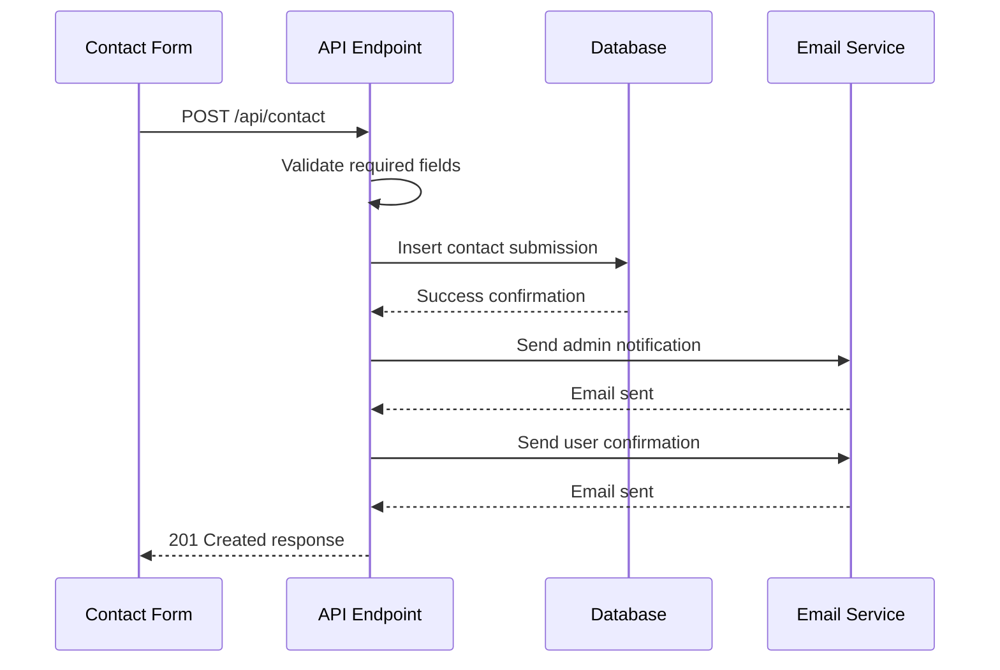
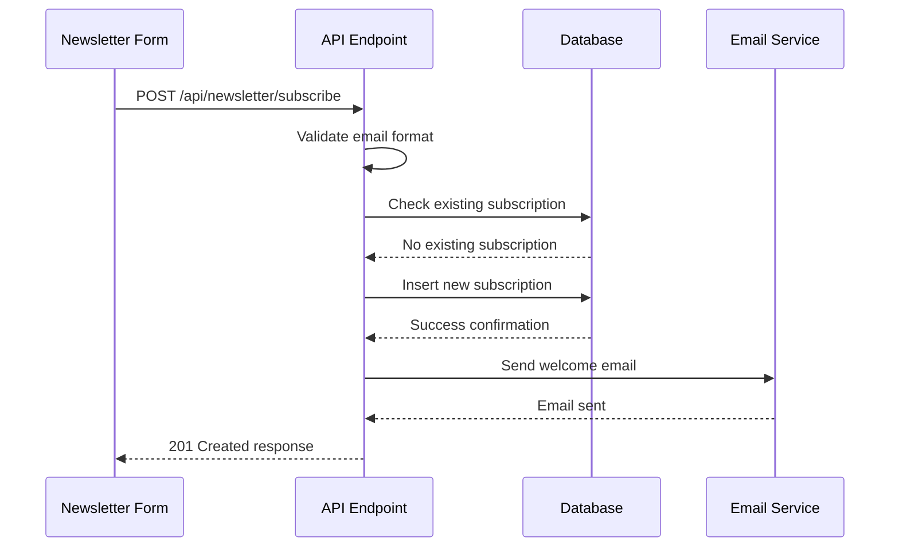

# Marketing Endpoints

<cite>
**Referenced Files in This Document**   
- [Contact.tsx](file://src/react-app/pages/Contact.tsx)
- [email.ts](file://src/shared/email.ts)
- [additional-email-templates.ts](file://src/shared/additional-email-templates.ts)
- [index.ts](file://src/worker/index.ts)
- [7.sql](file://migrations/7.sql)
</cite>

## Table of Contents
1. [Contact Form Endpoint](#contact-form-endpoint)
2. [Newsletter Subscription Endpoint](#newsletter-subscription-endpoint)
3. [Data Validation with Zod](#data-validation-with-zod)
4. [Server-Side Processing](#server-side-processing)
5. [Frontend Integration](#frontend-integration)
6. [Error Handling](#error-handling)
7. [Security and Compliance](#security-and-compliance)

## Contact Form Endpoint

The contact form endpoint allows users to submit inquiries from the website's contact page. This endpoint captures user information and message content, stores it in the database, and sends confirmation emails.

**HTTP Method**: POST  
**URL Pattern**: `/api/contact`

### Request Parameters (Body Only)

The request body must be sent as JSON with the following structure:

:Name: string (required)  
:Email: string (required)  
:Phone: string (optional)  
:Interest: string (required)  
:Message: string (required)

Example request body:
```json
{
  "name": "John Doe",
  "email": "john.doe@example.com",
  "phone": "+966 50 123 4567",
  "interest": "Property Investment",
  "message": "I'm interested in learning more about investment opportunities with HabibiStay."
}
```

### Response Schema

Successful response (201 Created):
```json
{
  "success": true,
  "message": "Contact form submitted successfully"
}
```

### Database Storage

The contact submission is stored in the `contact_submissions` table, which is defined in the database migration:

```sql
CREATE TABLE contact_submissions (
  id INTEGER PRIMARY KEY AUTOINCREMENT,
  name TEXT NOT NULL,
  email TEXT NOT NULL,
  phone TEXT,
  interest TEXT NOT NULL,
  message TEXT NOT NULL,
  status TEXT DEFAULT 'new',
  created_at DATETIME DEFAULT CURRENT_TIMESTAMP,
  updated_at DATETIME DEFAULT CURRENT_TIMESTAMP
);
```

**Section sources**
- [index.ts](file://src/worker/index.ts#L1490-L1584)
- [7.sql](file://migrations/7.sql#L1-L10)

## Newsletter Subscription Endpoint

The newsletter subscription endpoint enables users to subscribe to marketing communications. It validates email addresses, prevents duplicate subscriptions, and sends a welcome email with an unsubscribe link.

**HTTP Method**: POST  
**URL Pattern**: `/api/newsletter/subscribe`

### Request Parameters (Body Only)

The request body must be sent as JSON with the following structure:

:Email: string (required, must be valid email format)  
:Source: string (optional, indicates where the subscription originated)

Example request body:
```json
{
  "email": "jane.doe@example.com",
  "source": "footer"
}
```

### Response Schema

Successful response (201 Created):
```json
{
  "success": true,
  "message": "Successfully subscribed to newsletter"
}
```

### Database Storage

Subscriptions are stored in the `newsletter_subscriptions` table:

```sql
CREATE TABLE newsletter_subscriptions (
  id INTEGER PRIMARY KEY AUTOINCREMENT,
  email TEXT NOT NULL UNIQUE,
  source TEXT DEFAULT 'website',
  is_active BOOLEAN DEFAULT 1,
  subscribed_at DATETIME DEFAULT CURRENT_TIMESTAMP,
  unsubscribed_at DATETIME,
  created_at DATETIME DEFAULT CURRENT_TIMESTAMP,
  updated_at DATETIME DEFAULT CURRENT_TIMESTAMP
);
```

**Section sources**
- [index.ts](file://src/worker/index.ts#L1786-L1821)
- [7.sql](file://migrations/7.sql#L12-L23)

## Data Validation with Zod

The system implements robust data validation to prevent spam and ensure data quality. Although Zod schemas are not explicitly defined for these endpoints in the worker code, the validation logic is implemented directly in the route handlers.

### Contact Form Validation

The contact form validates that required fields are present before processing:

```typescript
if (!name || !email || !interest || !message) {
  return c.json<ApiResponse>({
    success: false,
    error: "Required fields missing",
  }, 400);
}
```

### Newsletter Validation

The newsletter subscription uses regex validation for email format:

```typescript
if (!email || !/\S+@\S+\.\S+/.test(email)) {
  return c.json<ApiResponse>({
    success: false,
    error: "Valid email address required",
  }, 400);
}
```

Additionally, it checks for existing subscriptions to prevent duplicates:

```typescript
const existing = await c.env.DB.prepare(
  "SELECT id FROM newsletter_subscriptions WHERE email = ? AND is_active = 1"
).bind(email).first();

if (existing) {
  return c.json<ApiResponse>({
    success: false,
    error: "Email already subscribed",
  }, 400);
}
```

**Section sources**
- [index.ts](file://src/worker/index.ts#L1490-L1584)
- [index.ts](file://src/worker/index.ts#L1786-L1821)

## Server-Side Processing

The server-side processing for marketing endpoints involves database storage and email notifications using the shared email service.

### Email Notification System

The system uses a modular email service located at `src/shared/email.ts` that defines schemas and utilities for sending emails. The service supports template-based emails with variable replacement.

### Contact Form Processing Flow



**Diagram sources**
- [index.ts](file://src/worker/index.ts#L1490-L1584)
- [email.ts](file://src/shared/email.ts)

### Newsletter Processing Flow



**Diagram sources**
- [index.ts](file://src/worker/index.ts#L1786-L1821)
- [email.ts](file://src/shared/email.ts)

### Email Templates

The system uses predefined email templates stored in the database. For contact forms, two templates are used:

- `contact_form_submission`: Notifies administrators of new inquiries
- `contact_form_confirmation`: Confirms receipt to users

For newsletter subscriptions:

- `newsletter_welcome`: Welcomes new subscribers with branding and expectations

These templates are initialized in the database migration and include HTML and text content with variable placeholders.

**Section sources**
- [7.sql](file://migrations/7.sql#L25-L161)
- [additional-email-templates.ts](file://src/shared/additional-email-templates.ts)

## Frontend Integration

The marketing endpoints are integrated into the frontend through specific components that handle user interaction and form submission.

### Contact Form Integration

The Contact.tsx component implements the contact form with React state management:

```typescript
const [formData, setFormData] = useState({
  name: '',
  email: '',
  phone: '',
  interest: '',
  message: ''
});
```

The form submission handler sends data to the API endpoint:

```typescript
const handleSubmit = async (e: React.FormEvent) => {
  e.preventDefault();
  setIsSubmitting(true);
  
  try {
    const response = await fetch('/api/contact', {
      method: 'POST',
      headers: {
        'Content-Type': 'application/json',
      },
      body: JSON.stringify(formData),
    });
  }
  // ... error handling and success states
};
```

### Newsletter Integration

The Footer component includes a newsletter subscription form that sends the source parameter to track subscription origins:

```typescript
body: JSON.stringify({ email, source: 'footer' })
```

### Frontend Validation

The frontend implements basic validation through HTML5 attributes:

```html
<input type="text" name="name" required />
<input type="email" name="email" required />
<textarea name="message" required></textarea>
```

This provides immediate feedback to users before form submission, complementing the server-side validation.

**Section sources**
- [Contact.tsx](file://src/react-app/pages/Contact.tsx)
- [Footer.tsx](file://src/react-app/components/Footer.tsx)

## Error Handling

The system implements comprehensive error handling for both endpoints, returning appropriate HTTP status codes and error messages.

### Status Codes

:201 Created: Successful submission for both endpoints  
:400 Bad Request: Validation errors or missing required fields  
:500 Internal Server Error: Server-side processing failures

### Error Response Structure

All error responses follow a consistent schema:

```json
{
  "success": false,
  "error": "Descriptive error message"
}
```

### Validation Error Examples

Contact form missing fields:
```json
{
  "success": false,
  "error": "Required fields missing"
}
```

Invalid email format:
```json
{
  "success": false,
  "error": "Valid email address required"
}
```

Duplicate newsletter subscription:
```json
{
  "success": false,
  "error": "Email already subscribed"
}
```

### Server Error Handling

Both endpoints use try-catch blocks to handle unexpected errors:

```typescript
catch (error) {
  console.error('Error processing contact form:', error);
  return c.json<ApiResponse>({
    success: false,
    error: "Failed to submit contact form",
  }, 500);
}
```

This ensures that server errors are logged for debugging while returning a generic error message to the client for security.

**Section sources**
- [index.ts](file://src/worker/index.ts#L1490-L1584)
- [index.ts](file://src/worker/index.ts#L1786-L1821)

## Security and Compliance

The marketing endpoints implement several security measures and comply with data protection regulations.

### Environment Configuration

The email service configuration is managed through environment variables, though the specific configuration file is not visible in the provided code. The system is designed to integrate with external email services like SendGrid, AWS SES, or Resend.

### User Data Protection

The system handles user contact information with the following considerations:

- Email addresses are stored as unique entries to prevent duplicates
- Phone numbers in contact forms are optional and can be null
- All submissions are timestamped for audit purposes
- The database includes updated_at fields for tracking changes

### GDPR Compliance

The implementation includes features that support GDPR compliance:

- **Right to be forgotten**: The newsletter table includes an `is_active` flag and `unsubscribed_at` timestamp, allowing for subscription management without complete data deletion when required
- **Unsubscribe mechanism**: The welcome email includes an unsubscribe link with the user's email parameter
- **Data minimization**: Only necessary information is collected for each purpose
- **Purpose limitation**: Contact form data is used only for responding to inquiries, while newsletter data is used only for marketing communications

### Security Considerations

- Input validation prevents injection attacks
- Email templates are pre-defined and stored securely in the database
- The system logs email sending attempts and failures for monitoring
- Rate limiting is not explicitly shown but would be recommended for production use to prevent abuse

**Section sources**
- [7.sql](file://migrations/7.sql)
- [additional-email-templates.ts](file://src/shared/additional-email-templates.ts)
- [index.ts](file://src/worker/index.ts)