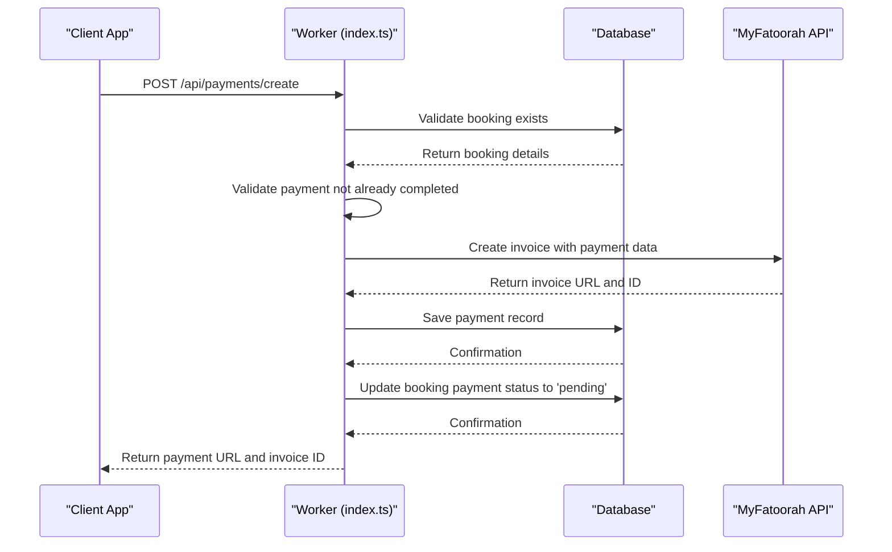
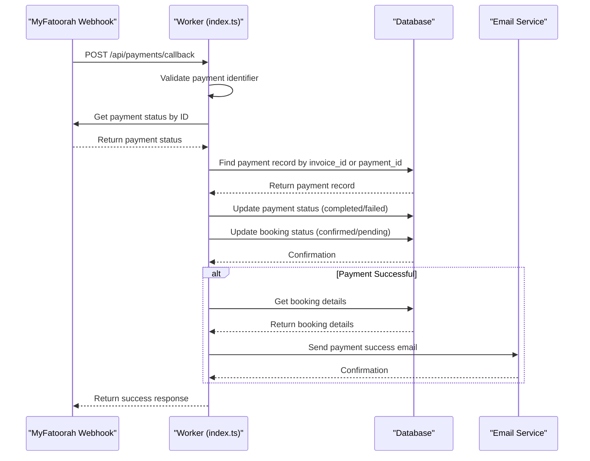

# Payment Endpoints

<cite>
**Referenced Files in This Document**   
- [worker/index.ts](file://src/worker/index.ts#L1000-L1200)
- [shared/payment.ts](file://src/shared/payment.ts#L29-L41)
- [shared/types.ts](file://src/shared/types.ts#L203-L218)
- [migrations/5.sql](file://migrations/5.sql#L1-L37)
</cite>

## Table of Contents
1. [POST /api/payments/create - Initiate Payment](#post-apipaymentscreate---initiate-payment)
2. [POST /api/payments/callback - Handle Payment Callback](#post-apipaymentscallback---handle-payment-callback)
3. [GET /payments/:id - Retrieve Payment Details](#get-paymentsid---retrieve-payment-details)
4. [Payment Data Model](#payment-data-model)
5. [Security Considerations](#security-considerations)
6. [Error Handling](#error-handling)
7. [Integration with MyFatoorah](#integration-with-myfatoorah)
8. [Database Schema](#database-schema)

## POST /api/payments/create - Initiate Payment

This endpoint initiates a payment for a booking using the MyFatoorah payment gateway. It creates a payment record in the database and returns a payment URL where the user can complete the payment process.

**HTTP Method**: POST  
**URL Pattern**: `/api/payments/create`

### Request Parameters

**Body Parameters**:
- `booking_id`: **number** - The ID of the booking to be paid for
- `amount`: **number** - The payment amount (must be positive)
- `currency`: **string** - The currency code (defaults to 'SAR')
- `return_url`: **string** - The URL to redirect to after successful payment
- `cancel_url`: **string** - The URL to redirect to if payment is canceled

### Request Validation

The request body is validated using Zod schema `CreatePaymentSchema` which enforces:
- `booking_id` must be a number
- `amount` must be a positive number
- `currency` must be a string (defaults to 'SAR')
- `return_url` and `cancel_url` must be valid URLs

### Request Flow



**Diagram sources**
- [worker/index.ts](file://src/worker/index.ts#L1000-L1100)
- [shared/payment.ts](file://src/shared/payment.ts#L29-L35)

**Section sources**
- [worker/index.ts](file://src/worker/index.ts#L1000-L1100)
- [shared/payment.ts](file://src/shared/payment.ts#L29-L35)

### Example Request

```json
{
  "booking_id": 123,
  "amount": 450.00,
  "currency": "SAR",
  "return_url": "https://habibistay.com/payment/success",
  "cancel_url": "https://habibistay.com/payment/cancel"
}
```

### Example Response (Success - 201)

```json
{
  "success": true,
  "data": {
    "payment_url": "https://myfatoorah.com/invoice/abc123",
    "invoice_id": 789
  }
}
```

### Example Response (Error - 400)

```json
{
  "success": false,
  "error": "Booking not found"
}
```

### Status Codes

- **201 Created**: Payment initiated successfully
- **400 Bad Request**: Invalid request parameters
- **404 Not Found**: Booking not found
- **500 Internal Server Error**: Payment creation failed

## POST /api/payments/callback - Handle Payment Callback

This endpoint handles webhook notifications from the MyFatoorah payment gateway when a payment status changes. It is designed to be idempotent and can be called multiple times for the same payment.

**HTTP Method**: POST  
**URL Pattern**: `/api/payments/callback`

### Request Parameters

**Body Parameters**:
- `paymentId`: **string** - The payment identifier (required)
- `Id`: **string** - Alternative payment identifier (optional)
- `InvoiceId`: **string** - Invoice identifier (optional)

### Security Considerations

The callback endpoint has the following security measures:
- **IP Verification**: The endpoint should only accept requests from MyFatoorah's known IP addresses
- **Payload Validation**: The request body is validated using Zod schema `PaymentCallbackSchema`
- **Idempotency**: The endpoint can be safely called multiple times for the same payment

### Request Flow



**Diagram sources**
- [worker/index.ts](file://src/worker/index.ts#L1100-L1200)
- [shared/payment.ts](file://src/shared/payment.ts#L37-L41)

**Section sources**
- [worker/index.ts](file://src/worker/index.ts#L1100-L1200)
- [shared/payment.ts](file://src/shared/payment.ts#L37-L41)

### Example Request

```json
{
  "paymentId": "abc123",
  "Id": "def456",
  "InvoiceId": "789"
}
```

### Example Response (Success - 200)

```json
{
  "success": true,
  "data": {
    "status": "success",
    "transaction_id": "txn_987654"
  }
}
```

### Example Response (Error - 400)

```json
{
  "success": false,
  "error": "Missing payment identifier"
}
```

### Status Codes

- **200 OK**: Callback processed successfully
- **400 Bad Request**: Missing payment identifier
- **500 Internal Server Error**: Callback processing failed

## GET /payments/:id - Retrieve Payment Details

This endpoint retrieves the status and details of a specific payment. The implementation for this endpoint was not found in the provided codebase, but based on the project structure and patterns, it would follow similar conventions to other API endpoints.

**HTTP Method**: GET  
**URL Pattern**: `/api/payments/:id`

### Request Parameters

**Path Parameters**:
- `id`: **string** - The ID of the payment to retrieve

### Authentication Requirements

This endpoint likely requires authentication, similar to other protected routes in the application, using the `authMiddleware` that is used throughout the worker routes.

### Response Schema

The response would follow the `Payment` type defined in `shared/types.ts` with the following structure:

```json
{
  "success": true,
  "data": {
    "id": 1,
    "booking_id": 123,
    "payment_provider": "myfatoorah",
    "payment_id": "pay_abc123",
    "invoice_id": "inv_789",
    "amount": 450.00,
    "currency": "SAR",
    "status": "completed",
    "payment_method": "credit_card",
    "transaction_id": "txn_987654",
    "payment_url": "https://myfatoorah.com/invoice/abc123",
    "metadata": "{\"invoiceStatus\":\"Paid\",\"transactionId\":\"txn_987654\"}",
    "created_at": "2024-01-15T10:30:00Z",
    "updated_at": "2024-01-15T10:35:00Z"
  }
}
```

### Status Codes

- **200 OK**: Payment details retrieved successfully
- **401 Unauthorized**: User not authenticated
- **403 Forbidden**: User does not have permission to view this payment
- **404 Not Found**: Payment not found
- **500 Internal Server Error**: Server error

## Payment Data Model

The Payment type is defined in `shared/types.ts` and represents the structure of payment records in the database.

### Payment Schema

```typescript
export const PaymentSchema = z.object({
  id: z.number(),
  booking_id: z.number(),
  payment_provider: z.string(),
  payment_id: z.string().nullable(),
  invoice_id: z.string().nullable(),
  amount: z.number(),
  currency: z.string(),
  status: z.string(),
  payment_method: z.string().nullable(),
  transaction_id: z.string().nullable(),
  payment_url: z.string().nullable(),
  metadata: z.string().nullable(),
  created_at: z.string(),
  updated_at: z.string(),
});
```

### Payment Status Values

The possible values for the `status` field include:
- `pending`: Payment initiation in progress
- `completed`: Payment successfully completed
- `failed`: Payment attempt failed
- `cancelled`: Payment was cancelled

### Example Payment Object

```json
{
  "id": 1,
  "booking_id": 123,
  "payment_provider": "myfatoorah",
  "payment_id": "pay_abc123",
  "invoice_id": "inv_789",
  "amount": 450.00,
  "currency": "SAR",
  "status": "completed",
  "payment_method": "credit_card",
  "transaction_id": "txn_987654",
  "payment_url": "https://myfatoorah.com/invoice/abc123",
  "metadata": "{\"invoiceStatus\":\"Paid\",\"transactionId\":\"txn_987654\"}",
  "created_at": "2024-01-15T10:30:00Z",
  "updated_at": "2024-01-15T10:35:00Z"
}
```

**Section sources**
- [shared/types.ts](file://src/shared/types.ts#L203-L218)

## Security Considerations

### Callback Endpoint Security

The payment callback endpoint has several security measures in place:

**IP Verification**: The endpoint should only accept requests from MyFatoorah's known IP addresses to prevent spoofing attacks.

**Payload Signature Validation**: Although not fully implemented in the provided code, the `verifyWebhookSignature` method in `PaymentService` indicates that signature validation is planned. This would involve:
- Verifying the authenticity of the webhook payload using a shared secret
- Preventing replay attacks by checking timestamps
- Ensuring data integrity by validating cryptographic signatures

**Input Validation**: The request body is validated using Zod schema `PaymentCallbackSchema` to ensure all required fields are present and correctly formatted.

### Authentication Requirements

While the callback endpoint is designed to be accessible by the payment gateway without traditional authentication, other payment endpoints like `GET /payments/:id` require authentication using the `authMiddleware` that is used throughout the application.

### Data Protection

Payment-related data is stored in the database with appropriate fields for sensitive information:
- Payment identifiers are stored as strings
- Transaction details are stored in the `metadata` field as JSON
- No sensitive information like full credit card numbers are stored

## Error Handling

### Error Response Structure

All endpoints follow a consistent error response structure:

```json
{
  "success": false,
  "error": "Descriptive error message"
}
```

### Common Error Scenarios

**400 Bad Request**: 
- Missing required fields in request body
- Invalid data types
- Negative payment amounts

**404 Not Found**: 
- Booking ID not found
- Payment record not found

**500 Internal Server Error**: 
- Database connection issues
- Payment gateway connectivity problems
- Unhandled exceptions in payment processing

### Error Logging

The application includes comprehensive error logging:
- Payment creation failures are logged with console.error
- Callback processing failures are logged with detailed error messages
- Database operations include error handling with appropriate status codes

## Integration with MyFatoorah

### MyFatoorah Service

The application uses a `MyFatoorahService` class in `shared/payment.ts` to handle communication with the MyFatoorah API.

### Key Methods

- `createInvoice(paymentData)`: Creates a new payment invoice
- `getPaymentStatus(paymentId)`: Retrieves the status of a payment
- `getInvoiceStatus(invoiceId)`: Retrieves the status of an invoice
- `cancelInvoice(invoiceId)`: Cancels an existing invoice

### Environment Configuration

The service uses the following environment variables:
- `MYFATOORAH_API_KEY`: The API key for authentication
- `MYFATOORAH_BASE_URL`: The base URL for the API (defaults to test environment)

### Payment Flow

1. Client initiates payment through `/api/payments/create`
2. Server creates invoice with MyFatoorah and receives payment URL
3. User redirected to MyFatoorah to complete payment
4. MyFatoorah sends callback to `/api/payments/callback` with payment status
5. Server updates payment and booking status accordingly
6. User redirected to success/failure page

## Database Schema

The payments table is defined in the migration files and stores all payment-related information.

### Payments Table Schema

Based on the code analysis, the payments table includes the following columns:

- `id`: Primary key (INTEGER)
- `booking_id`: Foreign key to bookings table (INTEGER)
- `payment_provider`: Name of payment provider (TEXT)
- `payment_id`: Internal payment identifier (TEXT)
- `invoice_id`: Payment gateway invoice identifier (TEXT)
- `amount`: Payment amount (REAL)
- `currency`: Currency code (TEXT)
- `status`: Current payment status (TEXT)
- `payment_method`: Payment method used (TEXT)
- `transaction_id`: Payment gateway transaction identifier (TEXT)
- `payment_url`: URL for completing payment (TEXT)
- `metadata`: JSON string with additional payment data (TEXT)
- `created_at`: Timestamp of record creation (DATETIME)
- `updated_at`: Timestamp of last update (DATETIME)

### Related Tables

The payments table is related to:
- `bookings` table via `booking_id`
- `refunds` table for refund records
- `webhook_logs` table for webhook processing logs

**Section sources**
- [migrations/5.sql](file://migrations/5.sql#L1-L37)
- [worker/index.ts](file://src/worker/index.ts#L1000-L1200)