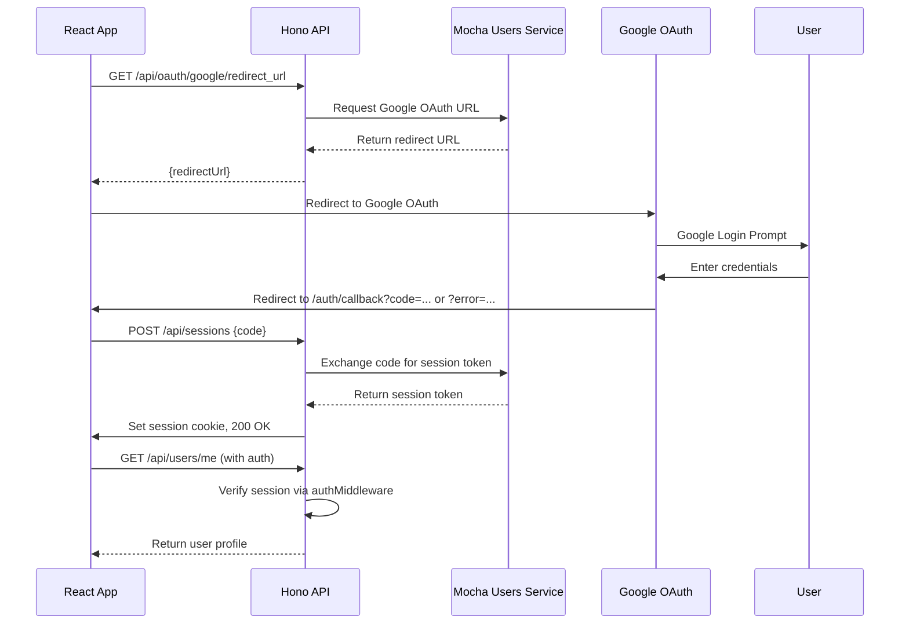
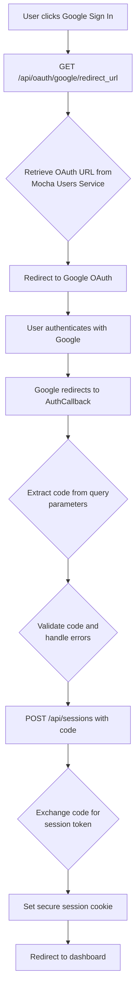
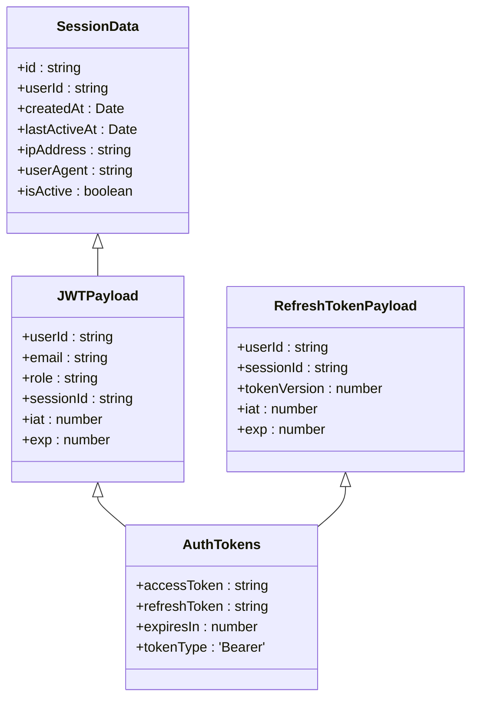
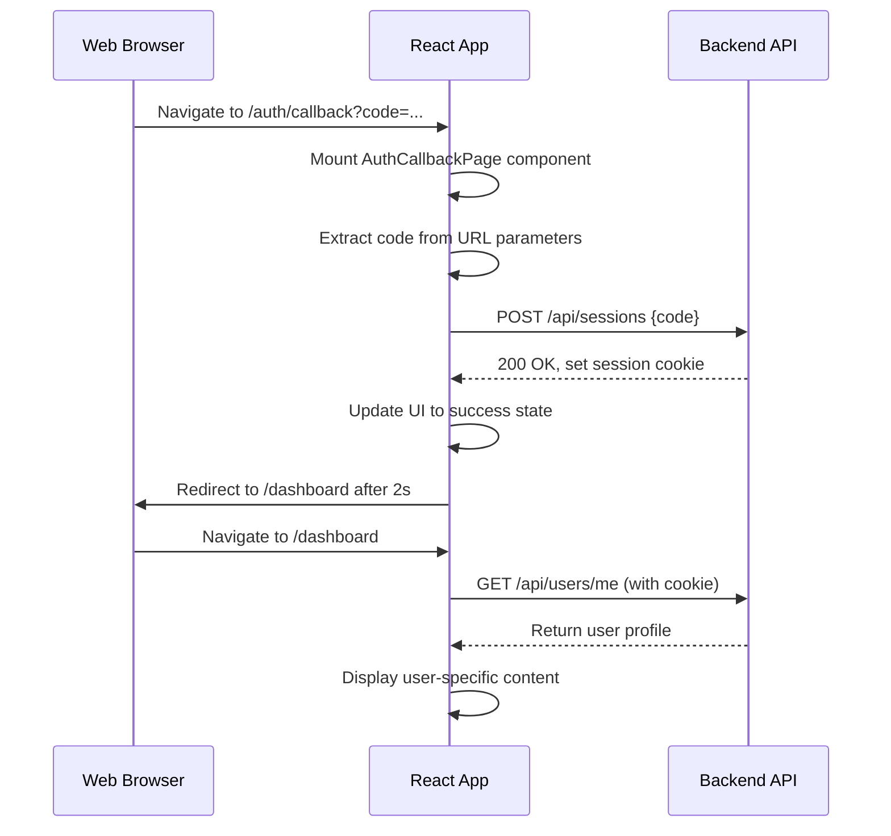
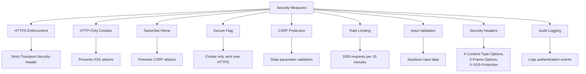

# User Authentication Endpoints

<cite>
**Referenced Files in This Document**   
- [index.ts](file://src/worker/index.ts)
- [AuthCallback.tsx](file://src/react-app/pages/AuthCallback.tsx)
- [auth.ts](file://src/server/utils/auth.ts)
- [types.ts](file://src/shared/types.ts)
- [security-middleware.ts](file://src/shared/security-middleware.ts)
</cite>

## Table of Contents
1. [Introduction](#introduction)
2. [Authentication Flow Overview](#authentication-flow-overview)
3. [Endpoint Details](#endpoint-details)
4. [OAuth 2.0 Implementation](#oauth-20-implementation)
5. [JWT Token Management](#jwt-token-management)
6. [Frontend Integration](#frontend-integration)
7. [Security Considerations](#security-considerations)
8. [Error Handling](#error-handling)
9. [Example Requests and Responses](#example-requests-and-responses)
10. [Environment Variables](#environment-variables)

## Introduction
This document details the user authentication endpoints in HabibiStay, focusing on Google OAuth integration. The system implements a secure authentication flow using OAuth 2.0, JWT tokens, and session management to provide seamless user experience while maintaining high security standards. The authentication system is built on a microservices architecture using the Mocha Users Service for OAuth handling.

## Authentication Flow Overview



**Diagram sources**
- [index.ts](file://src/worker/index.ts#L150-L200)
- [AuthCallback.tsx](file://src/react-app/pages/AuthCallback.tsx#L10-L70)

**Section sources**
- [index.ts](file://src/worker/index.ts#L150-L208)
- [AuthCallback.tsx](file://src/react-app/pages/AuthCallback.tsx#L1-L107)

## Endpoint Details

### GET /api/oauth/google/redirect_url (Initiate Google OAuth Flow)
Initiates the Google OAuth flow by retrieving the OAuth authorization URL from the Mocha Users Service.

**Request**
- **Method**: GET
- **URL**: `/api/oauth/google/redirect_url`
- **Headers**: None required
- **Query Parameters**: None
- **Body**: None

**Response**
- **Status**: 200 OK
- **Content-Type**: application/json
- **Response Schema**:
```json
{
  "redirectUrl": "string"
}
```

**Section sources**
- [index.ts](file://src/worker/index.ts#L150-L158)

### POST /api/sessions (Handle OAuth Callback)
Handles the OAuth callback by exchanging the authorization code for a session token and setting a secure session cookie.

**Request**
- **Method**: POST
- **URL**: `/api/sessions`
- **Headers**: 
  - Content-Type: application/json
- **Body Parameters**:
```json
{
  "code": "string"
}
```

**Response**
- **Status**: 200 OK
- **Set-Cookie**: MOCHA_SESSION_TOKEN=[token]; HttpOnly; Path=/; SameSite=None; Secure; Max-Age=5184000 (60 days)
- **Content-Type**: application/json
- **Response Schema**:
```json
{
  "success": true
}
```

**Error Responses**
- 400 Bad Request: No authorization code provided
- 500 Internal Server Error: Failed to exchange code for session token

**Section sources**
- [index.ts](file://src/worker/index.ts#L160-L178)

### GET /api/users/me (Retrieve Current User Profile)
Retrieves the current user's profile and authentication status using the session token from cookies.

**Request**
- **Method**: GET
- **URL**: `/api/users/me`
- **Headers**: 
  - Authorization: Bearer [token] (optional, cookie-based auth is primary)
- **Cookies**: MOCHA_SESSION_TOKEN=[token]
- **Query Parameters**: None
- **Body**: None

**Response**
- **Status**: 200 OK
- **Content-Type**: application/json
- **Response Schema**:
```json
{
  "id": "string",
  "email": "string",
  "name": "string",
  "avatar": "string",
  "phone": "string",
  "role": "guest|host|admin",
  "is_verified": "boolean",
  "is_active": "boolean",
  "created_at": "string",
  "updated_at": "string",
  "google_user_data": {
    "name": "string",
    "picture": "string",
    "email": "string"
  }
}
```

**Error Responses**
- 401 Unauthorized: Missing or invalid authentication token

**Section sources**
- [index.ts](file://src/worker/index.ts#L180-L182)
- [types.ts](file://src/shared/types.ts#L530-L550)

## OAuth 2.0 Implementation



**Diagram sources**
- [index.ts](file://src/worker/index.ts#L150-L178)
- [AuthCallback.tsx](file://src/react-app/pages/AuthCallback.tsx#L10-L70)

**Section sources**
- [index.ts](file://src/worker/index.ts#L150-L178)
- [AuthCallback.tsx](file://src/react-app/pages/AuthCallback.tsx#L1-L107)

The OAuth 2.0 flow implementation in HabibiStay follows the Authorization Code Grant flow:

1. The frontend requests the Google OAuth redirect URL from the backend
2. The backend retrieves the OAuth URL from the Mocha Users Service
3. The user is redirected to Google's OAuth consent screen
4. After authentication, Google redirects back to the application with an authorization code
5. The frontend sends the authorization code to the backend
6. The backend exchanges the code for a session token with the Mocha Users Service
7. The backend sets a secure session cookie and completes the authentication

The implementation uses state parameter generation for CSRF protection, though the actual state parameter handling occurs in the Mocha Users Service rather than being explicitly visible in the current codebase.

## JWT Token Management



**Diagram sources**
- [auth.ts](file://src/server/utils/auth.ts#L10-L50)
- [types.ts](file://src/shared/types.ts#L530-L550)

**Section sources**
- [auth.ts](file://src/server/utils/auth.ts#L56-L154)

The JWT token structure in HabibiStay includes the following claims:

**Access Token Structure**
- **Header**: 
```json
{
  "alg": "HS256",
  "typ": "JWT"
}
```
- **Payload**:
```json
{
  "userId": "string",
  "email": "string",
  "role": "string",
  "sessionId": "string",
  "iat": "number",
  "exp": "number",
  "iss": "habibistay",
  "aud": "habibistay-users"
}
```

**Token Generation Process**
1. Upon successful OAuth code exchange, a session token is received from the Mocha Users Service
2. The session token is stored in a secure HTTP-only cookie named `MOCHA_SESSION_TOKEN`
3. The cookie is configured with:
   - HttpOnly: true (prevents client-side script access)
   - SameSite: "none" (allows cross-site requests)
   - Secure: true (requires HTTPS)
   - Max-Age: 5184000 seconds (60 days)

The JWT tokens are generated using the `jsonwebtoken` library with HMAC-SHA256 algorithm. The secret key is configured via the `JWT_SECRET` environment variable with a fallback to a default value.

## Frontend Integration



**Diagram sources**
- [AuthCallback.tsx](file://src/react-app/pages/AuthCallback.tsx#L1-L107)
- [index.ts](file://src/worker/index.ts#L160-L178)

**Section sources**
- [AuthCallback.tsx](file://src/react-app/pages/AuthCallback.tsx#L1-L107)

The frontend integration is handled by the `AuthCallback.tsx` component, which:

1. Extracts the OAuth code or error parameter from the URL query string
2. Handles error cases by displaying appropriate messages and redirecting to home
3. Sends the authorization code to the `/api/sessions` endpoint
4. Manages UI states (processing, success, error) with appropriate visual feedback
5. Redirects to the dashboard upon successful authentication
6. Redirects to home page after authentication failure

The component uses React hooks (`useEffect`, `useState`, `useSearchParams`, `useNavigate`) to manage the authentication flow state and navigation.

## Security Considerations



**Diagram sources**
- [index.ts](file://src/worker/index.ts#L20-L40)
- [security-middleware.ts](file://src/shared/security-middleware.ts#L0-L63)
- [auth.ts](file://src/server/utils/auth.ts#L297-L310)

**Section sources**
- [index.ts](file://src/worker/index.ts#L20-L40)
- [security-middleware.ts](file://src/shared/security-middleware.ts#L0-L114)
- [auth.ts](file://src/server/utils/auth.ts#L297-L310)

Key security considerations for the authentication system:

**Cookie Security**
- HTTP-only flag prevents client-side script access to the session cookie
- Secure flag ensures cookies are only sent over HTTPS connections
- SameSite=None allows cross-origin requests while maintaining some CSRF protection
- 60-day expiration provides persistent login while balancing security

**CSRF Protection**
- The system uses state parameter generation for OAuth flows
- The `generateOAuthState()` function creates cryptographically secure random tokens
- State validation is performed using timing-safe comparison to prevent timing attacks

**Rate Limiting**
- Global rate limiting of 1000 requests per 15 minutes
- Prevents brute force attacks and abuse of authentication endpoints

**Security Headers**
- X-Content-Type-Options: nosniff
- X-Frame-Options: DENY
- X-XSS-Protection: 1; mode=block
- Strict-Transport-Security: max-age=31536000; includeSubDomains; preload
- Content-Security-Policy with restricted sources

**Audit Logging**
- All authentication events are logged with user ID, IP address, and action
- Failed authentication attempts are logged for security monitoring
- Logs include timestamps and success/failure status

## Error Handling

```mermaid
flowchart TD
A[Error Types] --> B[Client Errors (4xx)]
A --> C[Server Errors (5xx)]
B --> D[400 Bad Request]
B --> E[401 Unauthorized]
B --> F[403 Forbidden]
B --> G[429 Too Many Requests]
C --> H[500 Internal Server Error]
D --> I["No authorization code provided"]
E --> J["Authentication required"]
E --> K["Invalid or expired token"]
G --> L["Too many requests"]
H --> M["Internal server error"]
style D fill:#f9f,stroke:#333
style E fill:#f9f,stroke:#333
style F fill:#f9f,stroke:#333
style G fill:#f9f,stroke:#333
style H fill:#f96,stroke:#333
```

**Diagram sources**
- [index.ts](file://src/worker/index.ts#L118-L145)
- [security-middleware.ts](file://src/shared/security-middleware.ts#L65-L114)

**Section sources**
- [index.ts](file://src/worker/index.ts#L118-L145)
- [security-middleware.ts](file://src/shared/security-middleware.ts#L65-L114)

The authentication endpoints implement comprehensive error handling:

**Status Codes**
- **200 OK**: Successful operation
- **302 Found**: Redirect (handled by OAuth provider, not directly by these endpoints)
- **400 Bad Request**: Client error - missing or invalid parameters
- **401 Unauthorized**: Authentication required or failed
- **500 Internal Server Error**: Server-side error

**Error Response Structure**
```json
{
  "success": false,
  "error": "string",
  "message": "string"
}
```

**Specific Error Cases**
- **400 Bad Request**: Triggered when no authorization code is provided in the `/api/sessions` request
- **401 Unauthorized**: Triggered when no Authorization header is present or when the token is invalid/expired in `/api/users/me`
- **500 Internal Server Error**: Triggered by unexpected server errors, with generic error message for security

The error handler middleware catches unhandled exceptions and returns consistent error responses while logging detailed error information for debugging.

## Example Requests and Responses

### Example 1: Get OAuth Redirect URL
**Request**
```bash
curl -X GET "http://localhost:8787/api/oauth/google/redirect_url"
```

**Response**
```json
{
  "redirectUrl": "https://getmocha.com/u/oauth/google?client_id=abc123&redirect_uri=https%3A%2F%2Fhabibistay.com%2Fauth%2Fcallback&response_type=code&state=xyz789"
}
```

### Example 2: Complete OAuth Flow
**Request**
```bash
curl -X POST "http://localhost:8787/api/sessions" \
  -H "Content-Type: application/json" \
  -d '{"code": "oauth-code-received-from-google"}'
```

**Response**
```
HTTP/1.1 200 OK
Set-Cookie: MOCHA_SESSION_TOKEN=eyJhbGciOiJIUzI1NiIsInR5cCI6IkpXVCJ9...; HttpOnly; Path=/; SameSite=None; Secure; Max-Age=5184000

{
  "success": true
}
```

### Example 3: Get Current User Profile
**Request**
```bash
curl -X GET "http://localhost:8787/api/users/me" \
  -H "Cookie: MOCHA_SESSION_TOKEN=eyJhbGciOiJIUzI1NiIsInR5cCI6IkpXVCJ9..."
```

**Response**
```json
{
  "id": "user_12345",
  "email": "user@example.com",
  "name": "John Doe",
  "avatar": "https://lh3.googleusercontent.com/a-/example.jpg",
  "phone": "+966501234567",
  "role": "guest",
  "is_verified": true,
  "is_active": true,
  "created_at": "2024-01-15T10:30:00.000Z",
  "updated_at": "2024-01-15T10:30:00.000Z",
  "google_user_data": {
    "name": "John Doe",
    "picture": "https://lh3.googleusercontent.com/a-/example.jpg",
    "email": "user@example.com"
  }
}
```

### Example 4: Check Authentication Status
**Request**
```bash
curl -X GET "http://localhost:8787/api/users/me" \
  -H "Cookie: MOCHA_SESSION_TOKEN=invalid-token"
```

**Response**
```
HTTP/1.1 401 Unauthorized

{
  "error": "Invalid or expired token"
}
```

## Environment Variables

The authentication system relies on the following environment variables:

**OAuth Configuration**
- `MOCHA_USERS_SERVICE_API_URL`: Base URL for the Mocha Users Service (e.g., "https://getmocha.com/u")
- `MOCHA_USERS_SERVICE_API_KEY`: API key for authenticating with the Mocha Users Service

**JWT Configuration**
- `JWT_SECRET`: Secret key for signing JWT tokens (required for production)
- `JWT_EXPIRES_IN`: Token expiration time (default: "7d")
- `REFRESH_TOKEN_EXPIRES_IN`: Refresh token expiration time (default: "30d")
- `BCRYPT_ROUNDS`: Number of bcrypt rounds for password hashing (default: "12")

These environment variables are accessed through the `c.env` object in the Hono framework, which integrates with Cloudflare Workers' environment variable system.

**Section sources**
- [index.ts](file://src/worker/index.ts#L155-L156)
- [auth.ts](file://src/server/utils/auth.ts#L3-L10)