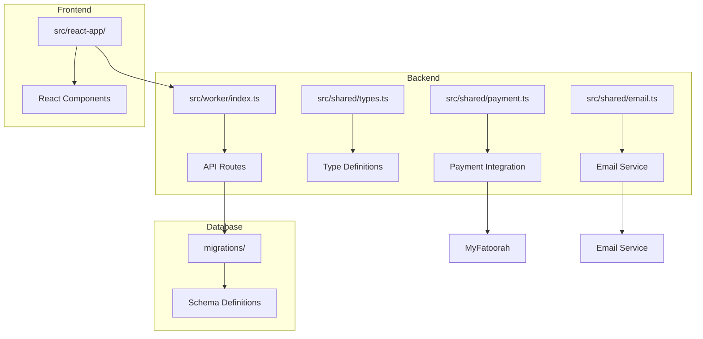
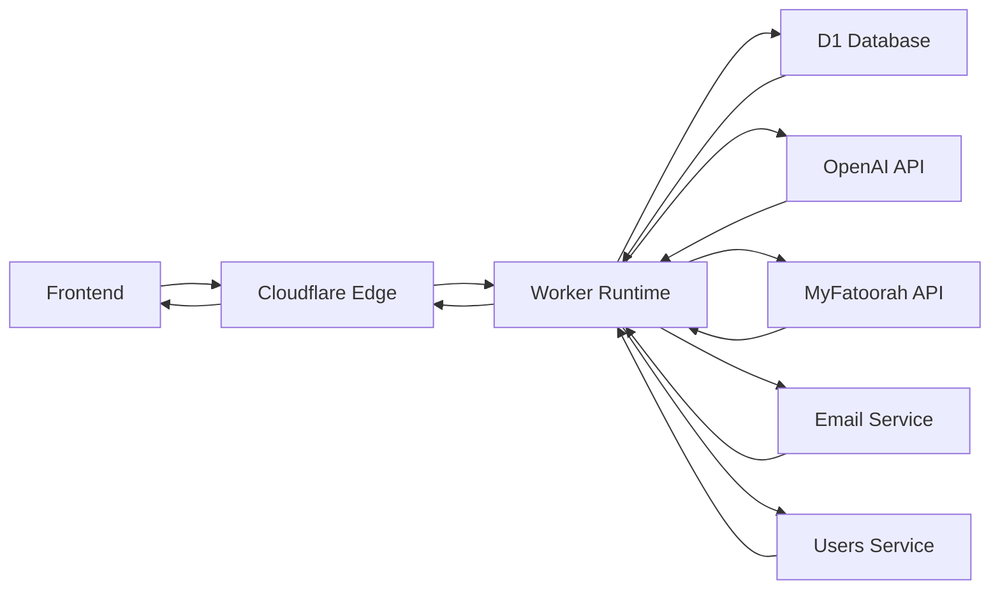
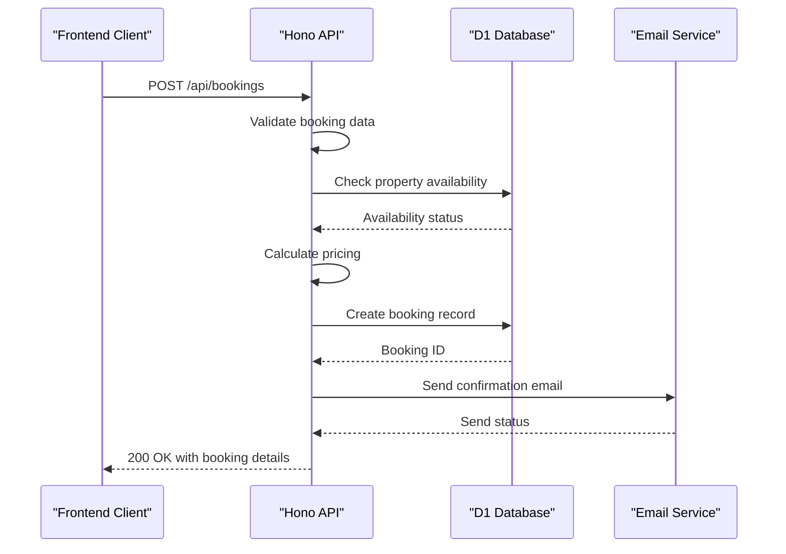
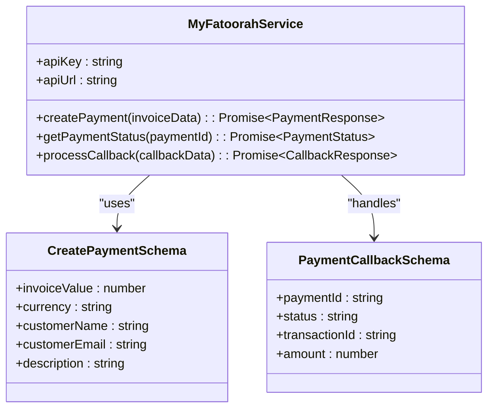
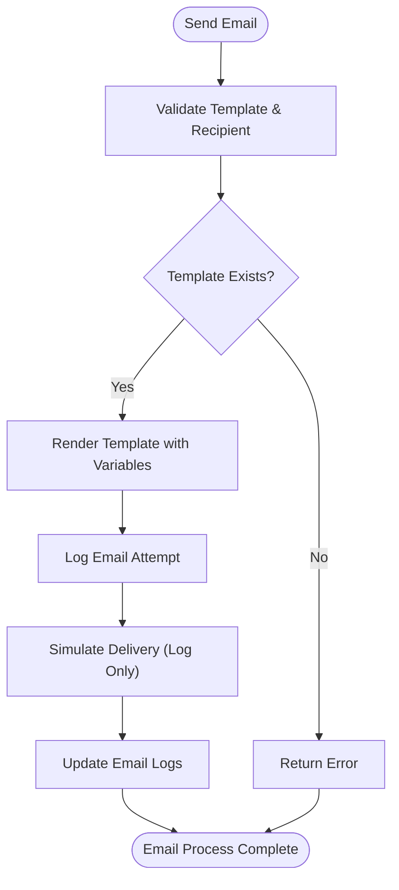
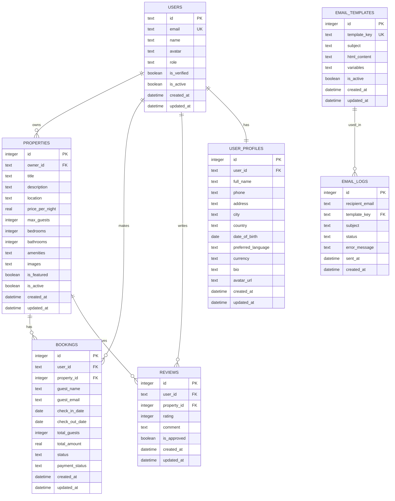

# Backend Architecture

<cite>
**Referenced Files in This Document**   
- [index.ts](file://src/worker/index.ts)
- [types.ts](file://src/shared/types.ts)
- [payment.ts](file://src/shared/payment.ts)
- [email.ts](file://src/shared/email.ts)
- [1.sql](file://migrations/1.sql)
- [4.sql](file://migrations/4.sql)
- [5.sql](file://migrations/5.sql)
- [6.sql](file://migrations/6.sql)
- [7.sql](file://migrations/7.sql)
</cite>

## Table of Contents
1. [Introduction](#introduction)
2. [Project Structure](#project-structure)
3. [Core Components](#core-components)
4. [Architecture Overview](#architecture-overview)
5. [Detailed Component Analysis](#detailed-component-analysis)
6. [Dependency Analysis](#dependency-analysis)
7. [Performance Considerations](#performance-considerations)
8. [Troubleshooting Guide](#troubleshooting-guide)
9. [Conclusion](#conclusion)

## Introduction
This document provides comprehensive architectural documentation for the backend component of HabibiStay, a premium short-term rental platform based in Riyadh, Saudi Arabia. The backend is built on Cloudflare Workers using the Hono framework to deliver a serverless, scalable API for property management, bookings, payments, and AI-powered chat functionality. The system leverages D1, Cloudflare's SQLite database, for persistent storage and integrates with external services like OpenAI for AI chat and MyFatoorah for payment processing. This architecture enables low-latency global access, cost-effective scaling, and rapid development through TypeScript and modern web standards.

## Project Structure
The project follows a modular structure with clear separation of concerns. The backend logic resides in the `src/worker` directory, while shared utilities and types are located in `src/shared`. Database schema and migrations are managed in the `migrations` directory, ensuring version-controlled database evolution. The frontend React application is contained within `src/react-app`, completely decoupled from the backend.



**Diagram sources**
- [index.ts](file://src/worker/index.ts)
- [types.ts](file://src/shared/types.ts)
- [payment.ts](file://src/shared/payment.ts)
- [email.ts](file://src/shared/email.ts)
- [1.sql](file://migrations/1.sql)

**Section sources**
- [index.ts](file://src/worker/index.ts)
- [types.ts](file://src/shared/types.ts)
- [payment.ts](file://src/shared/payment.ts)
- [email.ts](file://src/shared/email.ts)
- [1.sql](file://migrations/1.sql)

## Core Components
The backend architecture centers around several core components that work together to deliver the platform's functionality. The entry point is `index.ts`, which defines all RESTful API routes using the Hono framework. Business logic is encapsulated in shared utility modules for payment processing and email services. TypeScript interfaces in `types.ts` ensure type safety across the full stack. The database schema, defined in migration files, supports a comprehensive property booking system with user profiles, reviews, and analytics.

**Section sources**
- [index.ts](file://src/worker/index.ts#L1-L2050)
- [types.ts](file://src/shared/types.ts)
- [payment.ts](file://src/shared/payment.ts)
- [email.ts](file://src/shared/email.ts)
- [1.sql](file://migrations/1.sql)

## Architecture Overview
HabibiStay's backend operates within Cloudflare's serverless Workers runtime, providing a globally distributed, event-driven execution environment. The Hono framework serves as the web application framework, defining RESTful API endpoints for all core functionality. When a request arrives, it is routed through the Worker, which processes the request, interacts with the D1 database, and may call external services before returning a response. This serverless model eliminates server management, scales automatically, and reduces cold start times through Cloudflare's extensive edge network.



**Diagram sources**
- [index.ts](file://src/worker/index.ts)
- [1.sql](file://migrations/1.sql)

## Detailed Component Analysis

### API Routes and Request Flow
The API routes in `index.ts` are organized around core resources: properties, bookings, users, and chat. Each route is defined using Hono's routing syntax and may include middleware for validation and authentication. The request flow typically involves input validation, database interaction, business logic processing, and response generation. For example, creating a booking involves validating the request, checking property availability, calculating pricing, creating the booking record, and sending confirmation emails.

#### Properties and Bookings API Flow


**Diagram sources**
- [index.ts](file://src/worker/index.ts#L300-L450)
- [1.sql](file://migrations/1.sql)

**Section sources**
- [index.ts](file://src/worker/index.ts#L300-L450)
- [1.sql](file://migrations/1.sql)

### Shared Utilities and Service Integrations
The `/shared` directory contains critical utility modules that encapsulate external service integrations and shared logic. The `payment.ts` module handles interactions with MyFatoorah for payment processing, abstracting the complexity of the payment gateway API. The `email.ts` module manages email template rendering and delivery, using a database-stored template system for flexibility. These utilities promote code reuse and maintainability across the application.

#### Payment Service Integration


**Diagram sources**
- [payment.ts](file://src/shared/payment.ts)
- [types.ts](file://src/shared/types.ts)

**Section sources**
- [payment.ts](file://src/shared/payment.ts)
- [types.ts](file://src/shared/types.ts)

#### Email Service Implementation


**Diagram sources**
- [email.ts](file://src/shared/email.ts)
- [5.sql](file://migrations/5.sql)
- [6.sql](file://migrations/6.sql)

**Section sources**
- [email.ts](file://src/shared/email.ts)
- [5.sql](file://migrations/5.sql)
- [6.sql](file://migrations/6.sql)

### Data Model and Schema Design
The database schema is designed to support a comprehensive property booking platform with user management, reviews, and analytics. The core entities include users, properties, bookings, and reviews, with additional tables for user profiles, notification settings, and email templates. The schema uses SQLite with D1 and includes features like JSON storage for flexible data (amenities, images) and computed fields for analytics.

#### Entity Relationship Diagram


**Diagram sources**
- [1.sql](file://migrations/1.sql)
- [4.sql](file://migrations/4.sql)
- [5.sql](file://migrations/5.sql)

**Section sources**
- [1.sql](file://migrations/1.sql)
- [4.sql](file://migrations/4.sql)
- [5.sql](file://migrations/5.sql)

## Dependency Analysis
The backend architecture demonstrates a clean dependency structure with minimal coupling between components. The primary dependencies are the Hono framework for routing, Cloudflare's D1 for database access, and external services for payments and AI. The shared utilities have no dependencies on the main API routes, allowing them to be reused independently. The use of TypeScript interfaces ensures type safety without creating runtime dependencies.

```mermaid
graph TD
A[index.ts] --> B[Hono]
A --> C[D1]
A --> D[OpenAI]
A --> E[MyFatoorahService]
A --> F[authMiddleware]
A --> G[sendEmail]
A --> H[trackPropertyView]
E --> [payment.ts]
F --> [@getmocha/users-service]
G --> [email.ts]
H --> [index.ts]
I[types.ts] --> A
I --> E
I --> G
```

**Diagram sources**
- [index.ts](file://src/worker/index.ts)
- [types.ts](file://src/shared/types.ts)
- [payment.ts](file://src/shared/payment.ts)
- [email.ts](file://src/shared/email.ts)

**Section sources**
- [index.ts](file://src/worker/index.ts)
- [types.ts](file://src/shared/types.ts)
- [payment.ts](file://src/shared/payment.ts)
- [email.ts](file://src/shared/email.ts)

## Performance Considerations
The Cloudflare Workers architecture provides inherent performance benefits through global distribution and edge computing. API requests are processed at the nearest Cloudflare edge location, minimizing latency. The serverless model ensures automatic scaling to handle traffic spikes without provisioning overhead. However, cold starts can impact initial request performance, though Cloudflare's extensive network helps mitigate this. Database queries are optimized with indexing on key fields like property_id and user_id, and pagination is implemented for list endpoints to prevent excessive data transfer. The use of JSON fields for amenities and images provides flexibility but should be monitored for size limitations in SQLite.

## Troubleshooting Guide
Common issues in the HabibiStay backend typically relate to environment configuration, database connectivity, or external service integration. Ensure all environment variables (OPENAI_API_KEY, MYFATOORAH_API_KEY, etc.) are properly set in the Cloudflare Worker configuration. Database errors often stem from schema mismatches or missing migrations—verify that all migration files have been applied. For payment issues, check the MyFatoorah API credentials and endpoint configuration. Email template errors can be diagnosed by checking the email_templates table and the email_logs table for delivery status. The comprehensive error handling in the API routes logs errors to the console, which can be monitored through Cloudflare's logging infrastructure.

**Section sources**
- [index.ts](file://src/worker/index.ts#L100-L150)
- [errorHandler](file://src/worker/index.ts#L100-L115)
- [email.ts](file://src/shared/email.ts#L10-L50)
- [payment.ts](file://src/shared/payment.ts#L5-L30)

## Conclusion
The HabibiStay backend architecture effectively leverages Cloudflare Workers and the Hono framework to create a scalable, maintainable, and high-performance API for a property booking platform. The serverless model reduces operational overhead while providing global low-latency access. The clean separation of concerns between API routes, business logic, and shared utilities promotes code maintainability and reusability. The comprehensive database schema supports all core functionality from property management to user profiles and analytics. By integrating with external services for payments and AI, the architecture remains focused on core business logic while leveraging best-of-breed solutions for specialized functionality. This design provides a solid foundation for future growth and feature development.