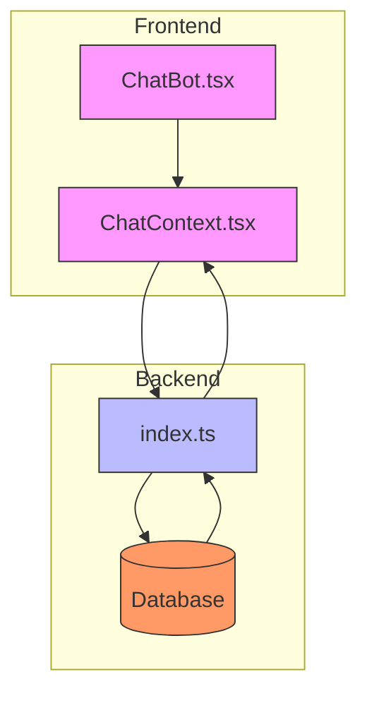
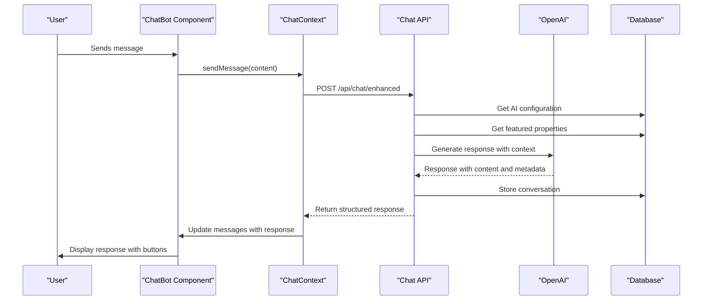
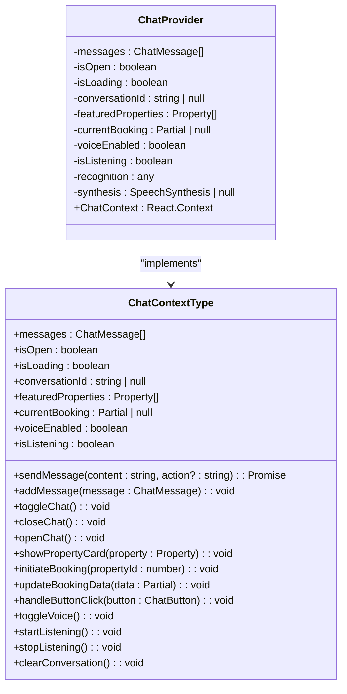
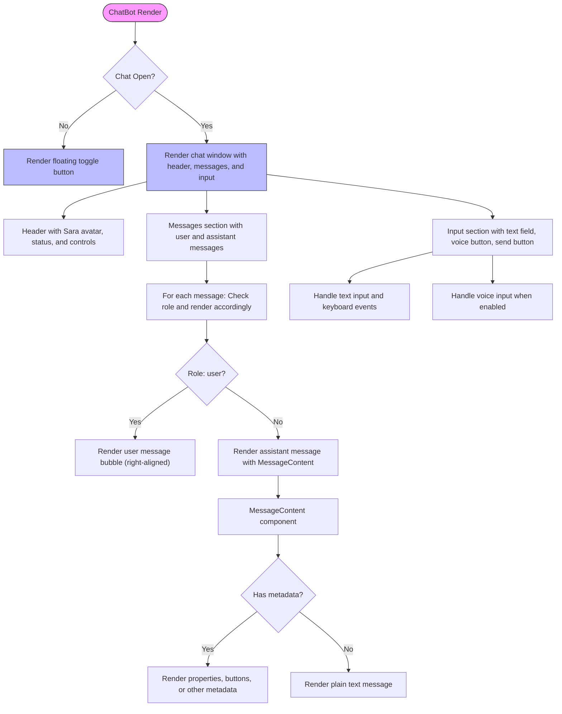
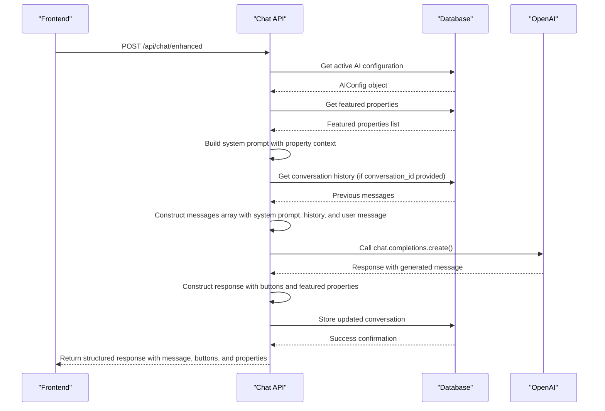
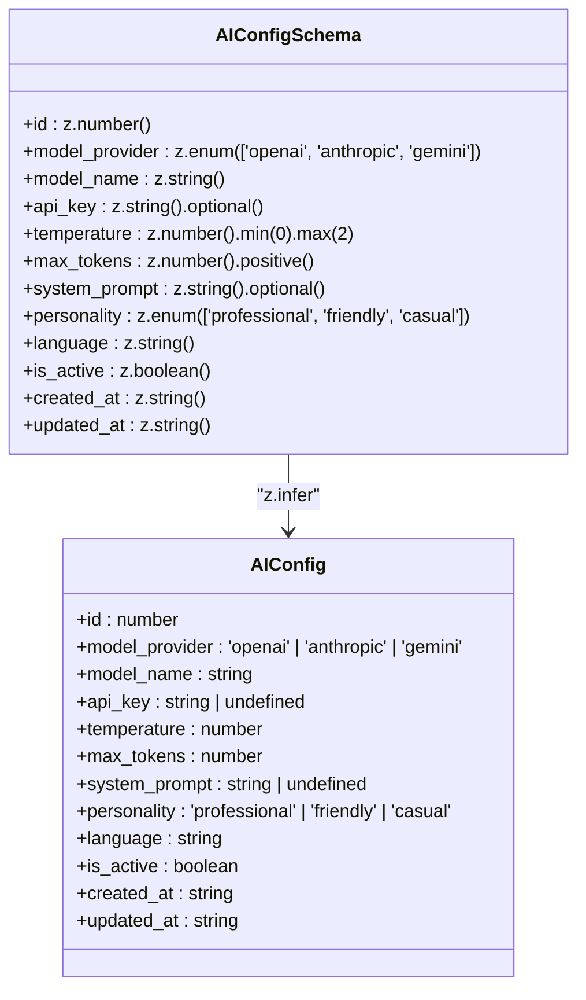
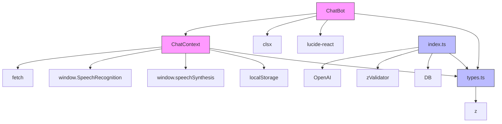

# AI Chat Response Generation

<cite>
**Referenced Files in This Document**   
- [ChatContext.tsx](file://src/react-app/contexts/ChatContext.tsx)
- [ChatBot.tsx](file://src/react-app/components/ChatBot.tsx)
- [index.ts](file://src/worker/index.ts)
- [types.ts](file://src/shared/types.ts)
</cite>

## Table of Contents
1. [Introduction](#introduction)
2. [Project Structure](#project-structure)
3. [Core Components](#core-components)
4. [Architecture Overview](#architecture-overview)
5. [Detailed Component Analysis](#detailed-component-analysis)
6. [Dependency Analysis](#dependency-analysis)
7. [Performance Considerations](#performance-considerations)
8. [Troubleshooting Guide](#troubleshooting-guide)
9. [Conclusion](#conclusion)

## Introduction
The AI chat response generation system in HabibiStay provides an intelligent conversational interface for guests to discover properties, check availability, and receive booking assistance. The system leverages OpenAI's GPT-4o-mini model to generate context-aware responses that are personalized to the user's intent and the platform's inventory. This document details the architecture, implementation, and functionality of the chat system, focusing on how user messages are processed through the backend API to generate helpful responses that guide users toward property recommendations and booking completion.

## Project Structure
The chat system is implemented across multiple components in the HabibiStay repository, with clear separation between frontend and backend concerns. The frontend components manage the user interface and state, while the backend handles AI processing, conversation persistence, and integration with property data.

**Diagram sources**
- [ChatBot.tsx](file://src/react-app/components/ChatBot.tsx)
- [ChatContext.tsx](file://src/react-app/contexts/ChatContext.tsx)
- [index.ts](file://src/worker/index.ts)

**Section sources**
- [ChatBot.tsx](file://src/react-app/components/ChatBot.tsx)
- [ChatContext.tsx](file://src/react-app/contexts/ChatContext.tsx)
- [index.ts](file://src/worker/index.ts)

## Core Components
The AI chat system consists of several core components that work together to provide a seamless conversational experience. The frontend implementation includes the ChatBot component that renders the chat interface and the ChatContext that manages the chat state and functionality. The backend implementation includes the enhanced chat endpoint that processes messages through the AI model and returns structured responses with interactive elements.

**Section sources**
- [ChatBot.tsx](file://src/react-app/components/ChatBot.tsx)
- [ChatContext.tsx](file://src/react-app/contexts/ChatContext.tsx)
- [index.ts](file://src/worker/index.ts)

## Architecture Overview
The AI chat system follows a client-server architecture where the frontend chat interface communicates with a backend API endpoint to process user messages through an AI model. The system maintains conversation state, incorporates property data into prompts, and returns responses with interactive buttons to guide users through the booking journey.

**Diagram sources**
- [ChatBot.tsx](file://src/react-app/components/ChatBot.tsx)
- [ChatContext.tsx](file://src/react-app/contexts/ChatContext.tsx)
- [index.ts](file://src/worker/index.ts)

## Detailed Component Analysis

### Frontend Chat Implementation
The frontend chat system is implemented using React components and context for state management. The ChatBot component renders the visual interface, while the ChatContext manages the chat state, message history, and communication with the backend.

#### ChatContext Analysis
The ChatContext provides a comprehensive API for managing the chat experience, including message sending, conversation persistence, voice input, and booking initiation.

**Diagram sources**
- [ChatContext.tsx](file://src/react-app/contexts/ChatContext.tsx#L15-L150)

**Section sources**
- [ChatContext.tsx](file://src/react-app/contexts/ChatContext.tsx)

#### ChatBot Component Analysis
The ChatBot component renders the chat interface with message history, input field, and control buttons. It uses the ChatContext to access chat state and functionality.

**Diagram sources**
- [ChatBot.tsx](file://src/react-app/components/ChatBot.tsx#L200-L450)

**Section sources**
- [ChatBot.tsx](file://src/react-app/components/ChatBot.tsx)

### Backend Chat Processing
The backend chat processing system handles incoming messages, retrieves AI configuration, generates responses using the OpenAI API, and returns structured responses with interactive elements.

#### Enhanced Chat Endpoint Analysis
The `/api/chat/enhanced` endpoint processes user messages through the AI model with contextual information about featured properties and conversation history.

**Diagram sources**
- [index.ts](file://src/worker/index.ts#L1679-L1855)

**Section sources**
- [index.ts](file://src/worker/index.ts)

#### AI Configuration Management
The system includes administrative endpoints for managing AI configuration, allowing administrators to customize the AI's behavior, personality, and parameters.

**Diagram sources**
- [types.ts](file://src/shared/types.ts#L235-L248)

**Section sources**
- [types.ts](file://src/shared/types.ts)
- [index.ts](file://src/worker/index.ts#L1582-L1637)

## Dependency Analysis
The chat system has well-defined dependencies between frontend and backend components, with clear data flow and integration points.

**Diagram sources**
- [ChatBot.tsx](file://src/react-app/components/ChatBot.tsx)
- [ChatContext.tsx](file://src/react-app/contexts/ChatContext.tsx)
- [index.ts](file://src/worker/index.ts)
- [types.ts](file://src/shared/types.ts)

**Section sources**
- [ChatBot.tsx](file://src/react-app/components/ChatBot.tsx)
- [ChatContext.tsx](file://src/react-app/contexts/ChatContext.tsx)
- [index.ts](file://src/worker/index.ts)
- [types.ts](file://src/shared/types.ts)

## Performance Considerations
The chat system implements several performance optimizations to ensure responsive interactions and efficient resource usage:

1. **Conversation State Persistence**: The system stores conversation state in localStorage to maintain context across sessions without requiring server round-trips for history retrieval.

2. **Featured Properties Caching**: Featured properties are fetched once on initialization and stored in context state, reducing redundant API calls.

3. **Voice Recognition Initialization**: Speech recognition and synthesis objects are initialized once on component mount and reused for subsequent interactions.

4. **Rate Limiting**: The system could benefit from implementing rate limiting on the chat endpoint to prevent abuse, though this is not currently implemented in the provided code.

5. **Token Usage Optimization**: The AI configuration includes max_tokens and temperature parameters that can be adjusted to control response length and creativity, helping to manage API costs.

6. **Error Handling and Fallbacks**: The system includes error handling that displays user-friendly messages and retry options when the AI service is unavailable, maintaining usability even during backend issues.

## Troubleshooting Guide
The chat system includes several mechanisms for handling common issues and providing a resilient user experience:

**Section sources**
- [ChatContext.tsx](file://src/react-app/contexts/ChatContext.tsx#L200-L250)
- [index.ts](file://src/worker/index.ts#L1800-L1855)

### Common Issues and Solutions

1. **AI Service Unavailable**
   - **Symptoms**: User receives error message about connection issues
   - **Cause**: Network issues, OpenAI API downtime, or invalid API key
   - **Solution**: The system automatically displays a retry button and contact support option. Administrators should verify the AI configuration and API key in the database.

2. **Voice Input Not Working**
   - **Symptoms**: Voice button is disabled or listening doesn't start
   - **Cause**: Browser doesn't support speech recognition or microphone permissions denied
   - **Solution**: The system checks for SpeechRecognition support on initialization. Users should ensure microphone permissions are granted and use a supported browser.

3. **Conversation State Lost**
   - **Symptoms**: Chat history disappears between sessions
   - **Cause**: localStorage cleared or conversation expired after 30 minutes
   - **Solution**: The system automatically clears expired conversations. Users can start a new conversation, and administrators could adjust the CONVERSATION_TIMEOUT value if needed.

4. **Slow Response Times**
   - **Symptoms**: Loading indicator shows for extended periods
   - **Cause**: Network latency or OpenAI API processing time
   - **Solution**: The system could implement streaming responses to show partial results sooner, rather than waiting for the complete response.

5. **Incorrect Property Data**
   - **Symptoms**: Featured properties displayed are outdated or incorrect
   - **Cause**: Database query returns stale data
   - **Solution**: The /api/properties/featured endpoint should be verified to return current featured properties. Cache headers could be added to control client-side caching.

## Conclusion
The AI chat response generation system in HabibiStay provides a sophisticated conversational interface that enhances the user experience by offering personalized property recommendations and booking assistance. The system effectively integrates frontend and backend components to create a seamless chat experience powered by OpenAI's GPT-4o-mini model. Key strengths include the dynamic system prompt that incorporates featured property data, the structured response format with interactive buttons, and the persistent conversation state that maintains context across interactions. The architecture allows for easy customization of the AI's personality and behavior through the admin configuration interface. Future enhancements could include streaming responses for faster perceived performance, more sophisticated intent detection to better guide users through the booking funnel, and integration with additional property data sources for more comprehensive recommendations.