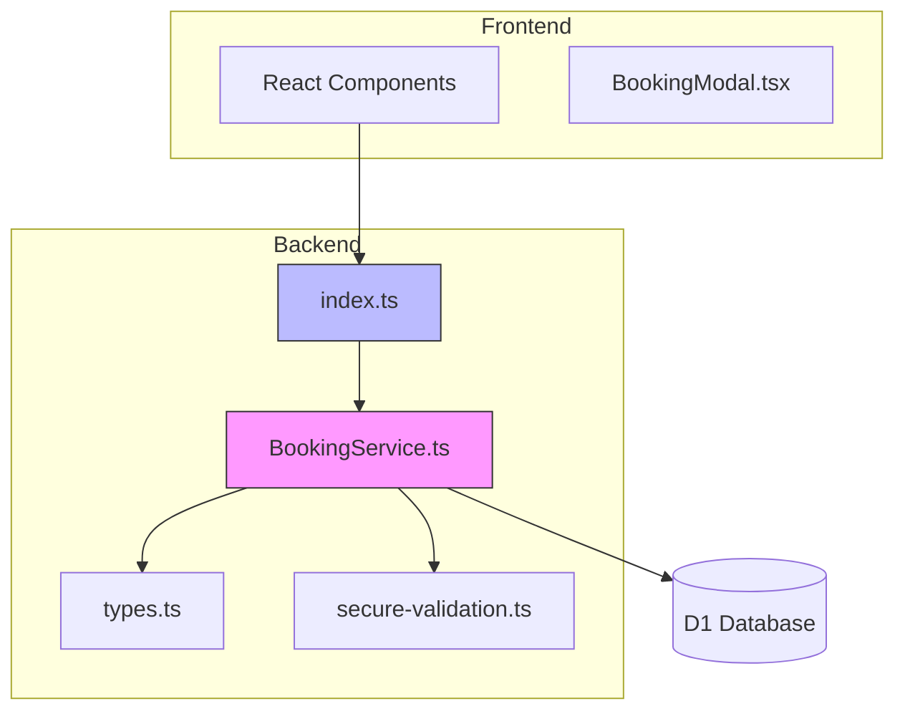
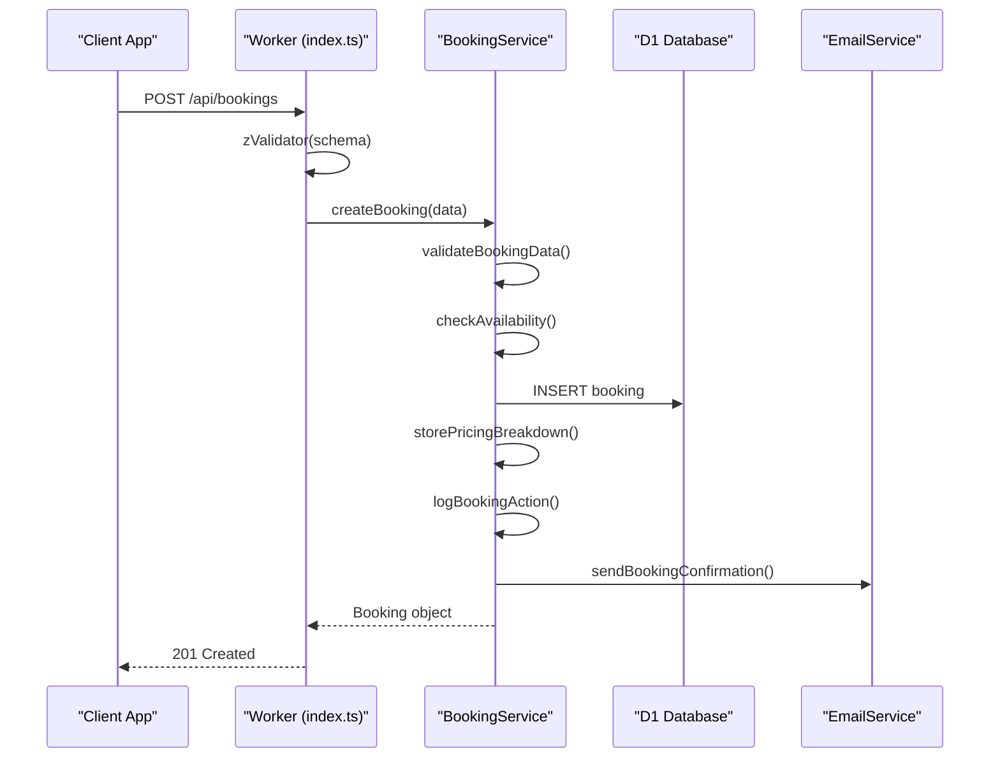
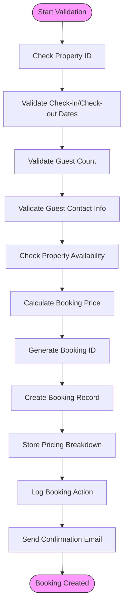
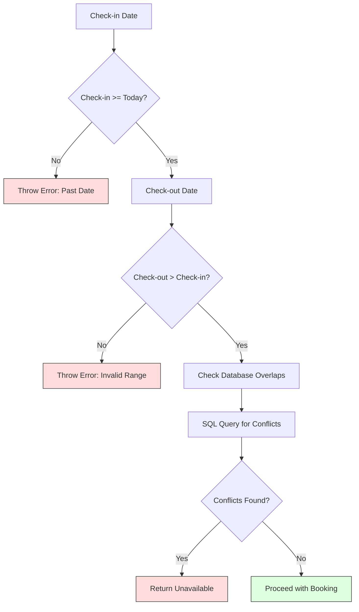
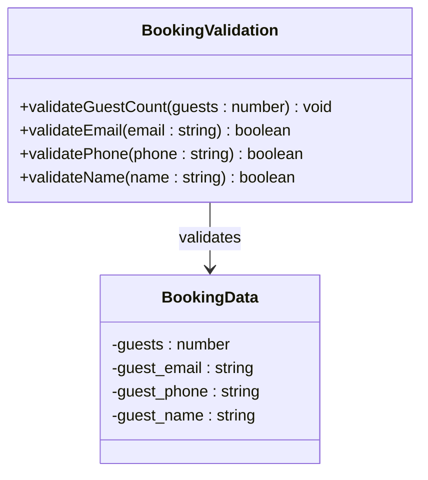
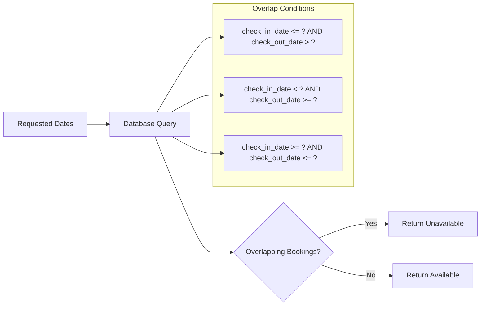
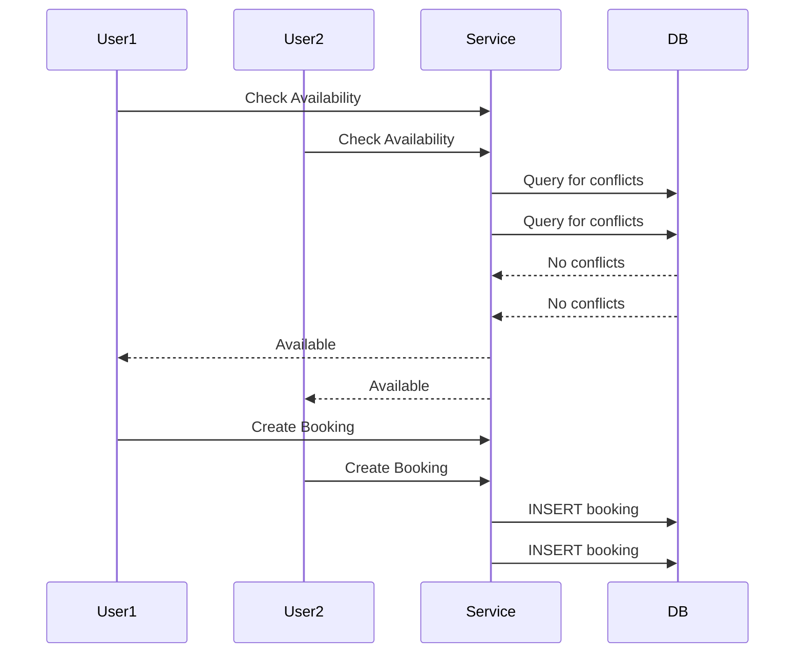
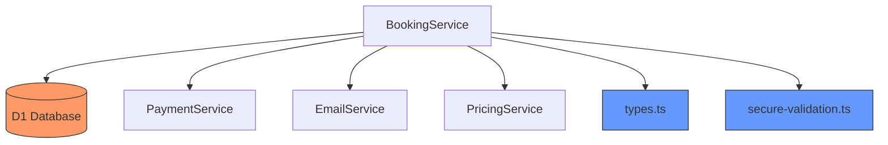

# Booking Validation

<cite>
**Referenced Files in This Document**   
- [BookingService.ts](file://src/server/services/BookingService.ts)
- [index.ts](file://src/worker/index.ts)
- [types.ts](file://src/shared/types.ts)
- [secure-validation.ts](file://src/shared/secure-validation.ts)
</cite>

## Table of Contents
1. [Introduction](#introduction)
2. [Project Structure](#project-structure)
3. [Core Components](#core-components)
4. [Architecture Overview](#architecture-overview)
5. [Detailed Component Analysis](#detailed-component-analysis)
6. [Dependency Analysis](#dependency-analysis)
7. [Performance Considerations](#performance-considerations)
8. [Troubleshooting Guide](#troubleshooting-guide)
9. [Conclusion](#conclusion)

## Introduction
This document provides a comprehensive analysis of the booking validation logic implemented in HabibiStay's backend system. The focus is on how the platform ensures data integrity, prevents double bookings, and enforces business rules during the booking creation and modification process. The system combines client-side validation, server-side checks, database queries, and shared TypeScript interfaces to maintain consistency across the application. Special attention is given to date range validation, guest count restrictions, property availability checks, and concurrency handling strategies.

## Project Structure
The HabibiStay project follows a modular architecture with clear separation of concerns. The backend logic resides in the `src/server` directory, while shared types and utilities are located in `src/shared`. The worker entry point is defined in `src/worker/index.ts`, which handles HTTP requests and routes them to appropriate services. The booking validation logic is primarily implemented in the `BookingService` class, with supporting functionality in payment, email, and pricing services.

**Diagram sources**
- [BookingService.ts](file://src/server/services/BookingService.ts)
- [index.ts](file://src/worker/index.ts)
- [types.ts](file://src/shared/types.ts)

**Section sources**
- [BookingService.ts](file://src/server/services/BookingService.ts)
- [index.ts](file://src/worker/index.ts)

## Core Components
The booking validation system consists of several key components that work together to ensure data integrity and business rule enforcement. The primary component is the `BookingService` class, which contains methods for creating, updating, and canceling bookings. This service performs comprehensive validation before any database operations are executed. The validation process includes checking date ranges, guest counts, contact information, and property availability. The system also integrates with external services for payment processing and email notifications.

**Section sources**
- [BookingService.ts](file://src/server/services/BookingService.ts)
- [types.ts](file://src/shared/types.ts)

## Architecture Overview
The booking validation architecture follows a layered approach with multiple levels of validation. Client-side validation occurs in React components using form state management. When a booking request reaches the server, it passes through middleware that performs schema validation using Zod. The request is then processed by the `BookingService`, which conducts business logic validation and database checks. The architecture ensures that all validation rules are enforced consistently across the application.

**Diagram sources**
- [index.ts](file://src/worker/index.ts)
- [BookingService.ts](file://src/server/services/BookingService.ts)

## Detailed Component Analysis

### Booking Validation Logic
The booking validation logic is implemented in the `BookingService` class and consists of multiple validation layers. The primary validation method is `validateBookingData()`, which checks all required fields and enforces business rules. This method ensures that check-in dates are not in the past, check-out dates are after check-in dates, guest counts are within acceptable limits, and contact information is valid.

**Diagram sources**
- [BookingService.ts](file://src/server/services/BookingService.ts#L569-L610)

**Section sources**
- [BookingService.ts](file://src/server/services/BookingService.ts#L569-L610)

### Date Range Validation
Date range validation is a critical aspect of the booking system, preventing overlapping reservations and ensuring logical date sequences. The system uses both client-side and server-side validation to enforce these rules. The `validateBookingData()` method checks that the check-in date is not in the past and that the check-out date is after the check-in date. The availability check uses SQL queries to detect overlapping bookings in the database.

**Diagram sources**
- [BookingService.ts](file://src/server/services/BookingService.ts#L569-L610)
- [index.ts](file://src/worker/index.ts#L440-L478)

**Section sources**
- [BookingService.ts](file://src/server/services/BookingService.ts#L569-L610)

### Guest Count and Contact Validation
The system enforces strict rules on guest counts and contact information to ensure data quality and operational feasibility. Guest counts must be between 1 and 20, preventing unrealistic booking requests. Contact validation ensures that guests can be reached for important booking information. The validation includes checking for valid email formats and minimum phone number lengths.

**Diagram sources**
- [BookingService.ts](file://src/server/services/BookingService.ts#L569-L610)
- [secure-validation.ts](file://src/shared/secure-validation.ts#L86-L128)

**Section sources**
- [BookingService.ts](file://src/server/services/BookingService.ts#L569-L610)

### Property Availability Checking
Property availability is determined by checking for overlapping bookings in the database. The `checkAvailability()` method executes a SQL query that identifies any existing bookings with date ranges that overlap with the requested dates. The query uses three conditions to detect overlaps: when the requested period starts during an existing booking, ends during an existing booking, or completely encompasses an existing booking.

**Diagram sources**
- [BookingService.ts](file://src/server/services/BookingService.ts#L700-L730)
- [index.ts](file://src/worker/index.ts#L440-L478)

**Section sources**
- [BookingService.ts](file://src/server/services/BookingService.ts#L700-L730)

### Concurrency and Race Condition Handling
The current implementation does not include explicit transaction handling or locking mechanisms to prevent race conditions during concurrent booking attempts. This represents a potential vulnerability where two users could simultaneously check availability and both receive positive responses, leading to double bookings. The system relies on the database query to detect conflicts, but without atomic transactions, there is a window for race conditions to occur.

**Diagram sources**
- [BookingService.ts](file://src/server/services/BookingService.ts)
- [index.ts](file://src/worker/index.ts)

**Section sources**
- [BookingService.ts](file://src/server/services/BookingService.ts)

## Dependency Analysis
The booking validation system has several key dependencies that enable its functionality. The primary dependency is the D1 database, which stores booking records and enables availability checks. The system also depends on shared TypeScript interfaces from `types.ts` to ensure payload consistency. Additional dependencies include the payment service for processing payments and the email service for sending confirmation messages.

**Diagram sources**
- [BookingService.ts](file://src/server/services/BookingService.ts)
- [types.ts](file://src/shared/types.ts)
- [secure-validation.ts](file://src/shared/secure-validation.ts)

**Section sources**
- [BookingService.ts](file://src/server/services/BookingService.ts)

## Performance Considerations
The booking validation system is designed with performance in mind, but there are several areas for potential optimization. The availability check query could benefit from database indexing on the `property_id`, `check_in_date`, and `check_out_date` columns to improve query performance. The current implementation makes multiple database calls during booking creation, which could be optimized using batch operations or transactions. Caching frequently accessed property data could also improve response times.

## Troubleshooting Guide
Common issues in the booking validation system include failed availability checks, validation errors, and race conditions. When troubleshooting availability issues, verify that the date range logic is correctly implemented and that the database query properly detects overlapping bookings. For validation errors, ensure that both client-side and server-side validation rules are consistent. To address race conditions, consider implementing database-level constraints or transaction isolation.

**Section sources**
- [BookingService.ts](file://src/server/services/BookingService.ts)
- [index.ts](file://src/worker/index.ts)

## Conclusion
The HabibiStay booking validation system implements comprehensive checks to ensure data integrity and business rule enforcement. The system effectively validates date ranges, guest counts, and contact information while checking property availability through database queries. However, the lack of explicit transaction handling represents a potential vulnerability to race conditions during high-concurrency scenarios. Future improvements should include implementing atomic transactions, adding database constraints, and optimizing query performance through indexing.