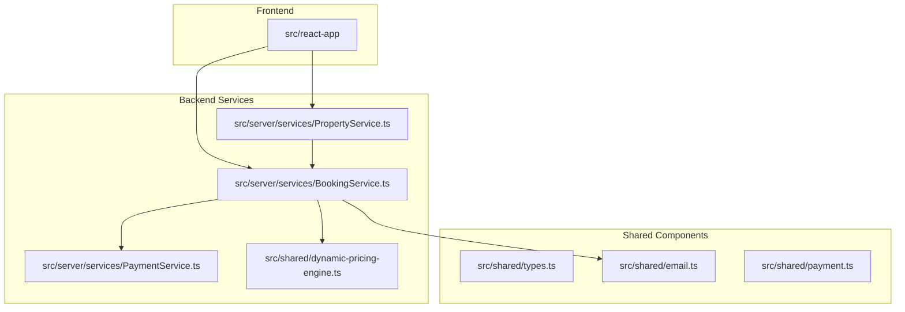
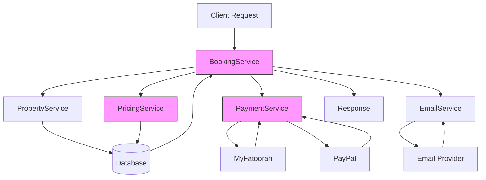
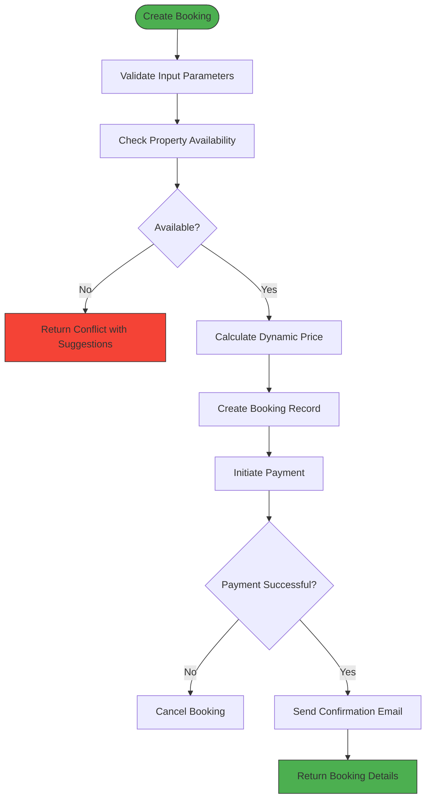
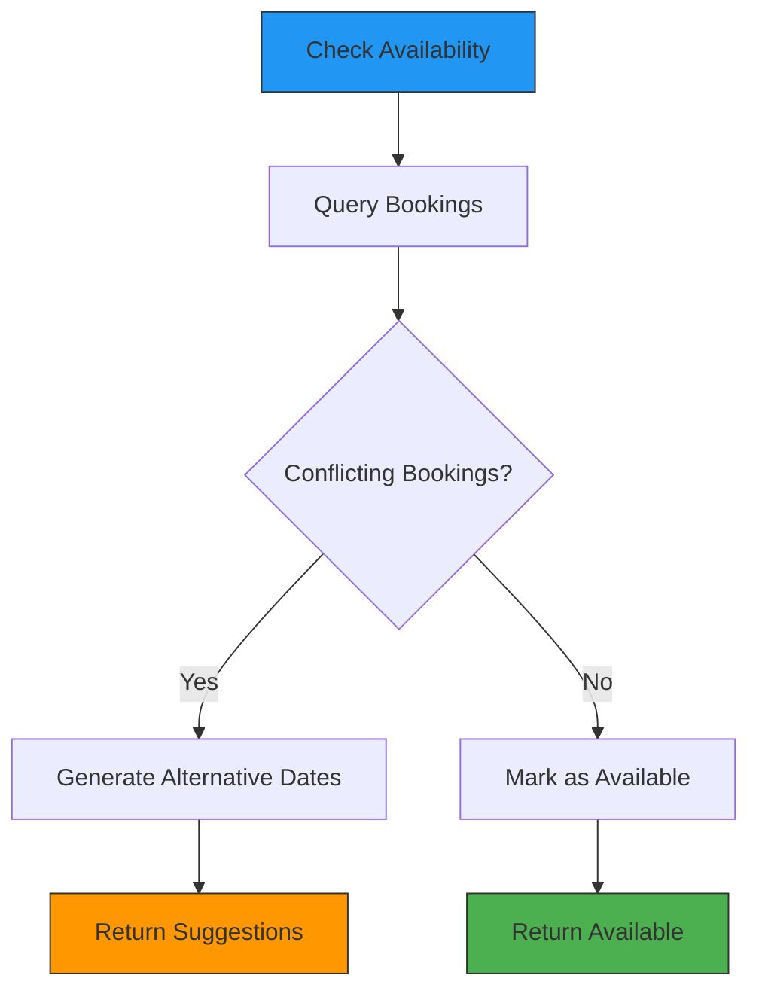
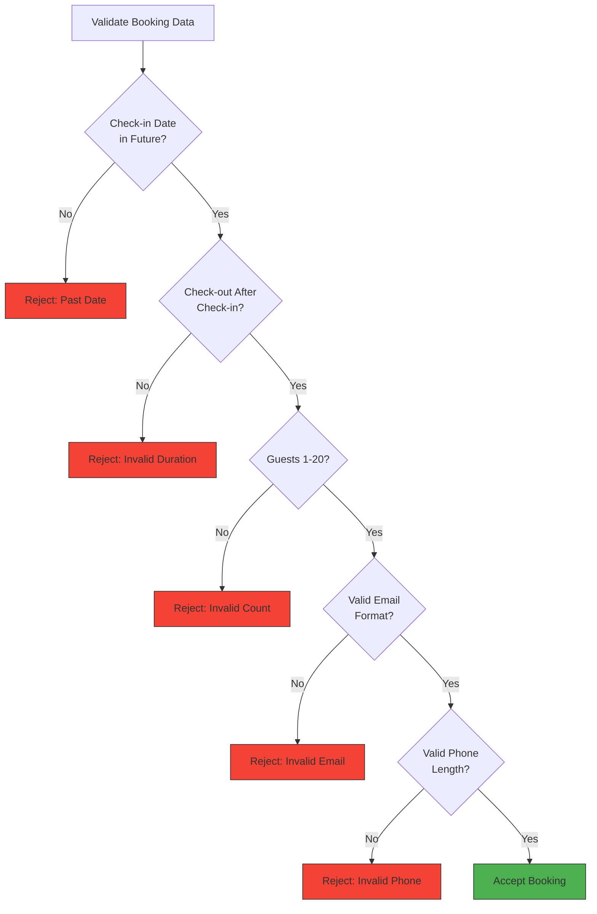
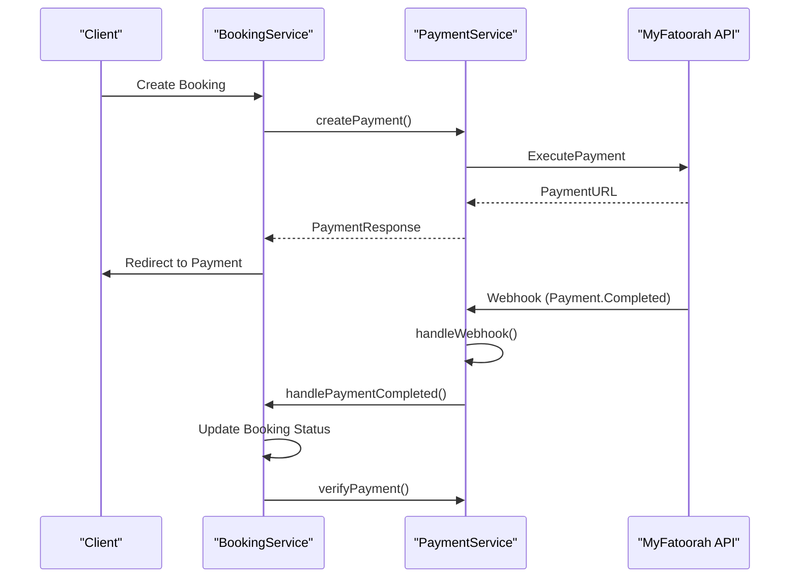
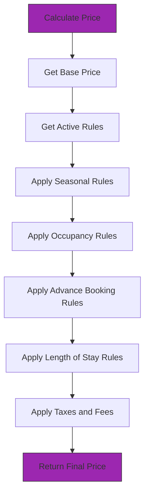
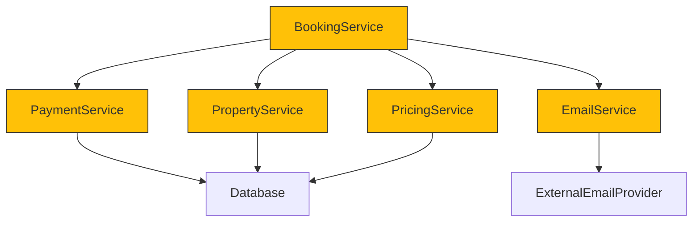

# Business Logic Layer

<cite>
**Referenced Files in This Document**   
- [BookingService.ts](file://src/server/services/BookingService.ts)
- [PaymentService.ts](file://src/server/services/PaymentService.ts)
- [email.ts](file://src/shared/email.ts)
- [types.ts](file://src/shared/types.ts)
- [dynamic-pricing-engine.ts](file://src/shared/dynamic-pricing-engine.ts)
- [PropertyService.ts](file://src/server/services/PropertyService.ts)
</cite>

## Table of Contents
1. [Introduction](#introduction)
2. [Project Structure](#project-structure)
3. [Core Components](#core-components)
4. [Architecture Overview](#architecture-overview)
5. [Detailed Component Analysis](#detailed-component-analysis)
6. [Dependency Analysis](#dependency-analysis)
7. [Performance Considerations](#performance-considerations)
8. [Troubleshooting Guide](#troubleshooting-guide)
9. [Conclusion](#conclusion)

## Introduction
The business logic layer of HabibiStay's backend encapsulates core domain functionality related to property bookings, availability management, pricing, payments, and communication. This document provides a comprehensive analysis of how these business rules are implemented, enforced, and coordinated across services. The system ensures data integrity through validation workflows, prevents invalid state transitions, and synchronizes with external services for payment processing and email notifications.

## Project Structure
The project follows a modular architecture with clear separation of concerns. Business logic is primarily located in the `src/server/services` directory, while shared types and utilities reside in `src/shared`. The worker entry point at `src/worker/index.ts` orchestrates business processes.



**Diagram sources**
- [BookingService.ts](file://src/server/services/BookingService.ts)
- [PaymentService.ts](file://src/server/services/PaymentService.ts)
- [PropertyService.ts](file://src/server/services/PropertyService.ts)
- [dynamic-pricing-engine.ts](file://src/shared/dynamic-pricing-engine.ts)

**Section sources**
- [BookingService.ts](file://src/server/services/BookingService.ts)
- [PaymentService.ts](file://src/server/services/PaymentService.ts)
- [PropertyService.ts](file://src/server/services/PropertyService.ts)

## Core Components
The business logic layer consists of several key components that handle specific domains of functionality:
- **BookingService**: Manages booking lifecycle including creation, validation, and cancellation
- **PaymentService**: Handles payment processing, verification, and refunds through external providers
- **DynamicPricingEngine**: Implements intelligent pricing strategies based on market conditions
- **PropertyService**: Manages property availability and search functionality
- **EmailService**: Coordinates communication with guests and hosts

These components work together to enforce business rules before any database operations occur, ensuring data consistency and preventing invalid states.

**Section sources**
- [BookingService.ts](file://src/server/services/BookingService.ts)
- [PaymentService.ts](file://src/server/services/PaymentService.ts)
- [dynamic-pricing-engine.ts](file://src/shared/dynamic-pricing-engine.ts)

## Architecture Overview
The business logic layer follows a service-oriented architecture where each service encapsulates a specific domain. Services interact through well-defined interfaces and share common types. The architecture emphasizes validation, error handling, and transaction integrity.



**Diagram sources**
- [BookingService.ts](file://src/server/services/BookingService.ts)
- [PaymentService.ts](file://src/server/services/PaymentService.ts)
- [PropertyService.ts](file://src/server/services/PropertyService.ts)

## Detailed Component Analysis

### Booking Service Analysis
The BookingService is the central component for managing reservations. It enforces business rules through comprehensive validation workflows and coordinates with other services to ensure a consistent booking experience.

#### Booking Validation Workflow


**Diagram sources**
- [BookingService.ts](file://src/server/services/BookingService.ts#L100-L200)

**Section sources**
- [BookingService.ts](file://src/server/services/BookingService.ts)

### Property Availability Checking
The system implements robust availability checking to prevent double bookings. When searching for properties or creating bookings, the system checks for date conflicts using precise overlap detection.



The availability check uses the following SQL logic to detect overlapping date ranges:
```sql
SELECT * FROM bookings 
WHERE property_id = ? 
AND status IN ('confirmed', 'pending')
AND (
  (check_in_date <= ? AND check_out_date > ?) OR
  (check_in_date < ? AND check_out_date >= ?) OR
  (check_in_date >= ? AND check_out_date <= ?)
)
```

This ensures that any overlapping period is detected, whether the new booking starts during an existing booking, ends during an existing booking, or completely encompasses an existing booking.

**Diagram sources**
- [BookingService.ts](file://src/server/services/BookingService.ts#L414-L456)
- [PropertyService.ts](file://src/server/services/PropertyService.ts#L252-L285)

**Section sources**
- [BookingService.ts](file://src/server/services/BookingService.ts#L414-L456)
- [PropertyService.ts](file://src/server/services/PropertyService.ts#L208-L285)

### Booking Validation and Guest Limits
The system enforces strict validation rules when creating or updating bookings. These rules are implemented in the BookingService and include date validation, guest count limits, and contact information requirements.



The validation is implemented in the `validateBookingData` method:

```typescript
private async validateBookingData(data: BookingCreate): Promise<void> {
  if (!data.property_id) {
    throw new Error('Property ID is required');
  }

  if (!data.check_in_date || !data.check_out_date) {
    throw new Error('Check-in and check-out dates are required');
  }

  const checkIn = new Date(data.check_in_date);
  const checkOut = new Date(data.check_out_date);
  const today = new Date();

  if (checkIn < today) {
    throw new Error('Check-in date cannot be in the past');
  }

  if (checkOut <= checkIn) {
    throw new Error('Check-out date must be after check-in date');
  }

  if (!data.guests || data.guests < 1 || data.guests > 20) {
    throw new Error('Number of guests must be between 1 and 20');
  }
  // ... additional validations
}
```

**Diagram sources**
- [BookingService.ts](file://src/server/services/BookingService.ts#L600-L650)

**Section sources**
- [BookingService.ts](file://src/server/services/BookingService.ts#L600-L650)

### Payment Processing and Synchronization
The PaymentService handles integration with external payment providers (MyFatoorah and PayPal) and ensures payment status is synchronized with booking records.



The payment service implements a comprehensive workflow:
1. Create a payment record in pending state
2. Initiate payment with the selected provider
3. Return payment URL for client redirection
4. Handle webhook notifications for payment status changes
5. Verify payment status with the provider
6. Update booking status accordingly

**Diagram sources**
- [PaymentService.ts](file://src/server/services/PaymentService.ts)
- [BookingService.ts](file://src/server/services/BookingService.ts)

**Section sources**
- [PaymentService.ts](file://src/server/services/PaymentService.ts)

### Dynamic Pricing Engine
The DynamicPricingEngine implements intelligent pricing strategies based on various factors including seasonality, occupancy rates, and advance booking patterns.



The pricing engine applies rules in priority order and supports various adjustment types:
- Percentage adjustments
- Fixed amount adjustments
- Set price (absolute price)
- Progressive adjustments based on stay length

```typescript
private calculateRuleAdjustment(
  rule: PricingRule,
  currentPrice: number,
  totalNights: number,
  request: PriceCalculationRequest
): { newPrice: number; adjustment: number } {
  let newPrice = currentPrice;

  switch (adjustment.type) {
    case 'percentage':
      newPrice = currentPrice * (1 + adjustment.value / 100);
      break;
      
    case 'fixed_amount':
      newPrice = currentPrice + (adjustment.value * totalNights);
      break;
      
    case 'set_price':
      newPrice = adjustment.value * totalNights;
      break;
  }
  // ... additional logic
}
```

**Diagram sources**
- [dynamic-pricing-engine.ts](file://src/shared/dynamic-pricing-engine.ts)
- [dynamic-pricing-types.ts](file://src/shared/dynamic-pricing-types.ts)

**Section sources**
- [dynamic-pricing-engine.ts](file://src/shared/dynamic-pricing-engine.ts)

## Dependency Analysis
The business logic components have well-defined dependencies that ensure loose coupling and maintainability.



The BookingService acts as the orchestrator, coordinating with other services to complete booking transactions. This dependency structure allows for independent development and testing of each service.

**Diagram sources**
- [BookingService.ts](file://src/server/services/BookingService.ts)
- [PaymentService.ts](file://src/server/services/PaymentService.ts)
- [PropertyService.ts](file://src/server/services/PropertyService.ts)

**Section sources**
- [BookingService.ts](file://src/server/services/BookingService.ts)

## Performance Considerations
The business logic layer implements several performance optimizations:
- Database queries use parameterized statements to prevent SQL injection and improve query plan caching
- JSON fields are used for flexible data storage while maintaining relational integrity
- Asynchronous operations are used throughout to prevent blocking
- Caching strategies could be implemented for frequently accessed data like pricing rules

Potential performance bottlenecks include:
- Complex availability queries with date range overlaps
- Multiple database round trips during booking creation
- External API calls to payment providers

## Troubleshooting Guide
Common issues and their solutions:

**Double Booking Issue**
- **Symptom**: Two bookings created for the same property and dates
- **Cause**: Race condition during availability check
- **Solution**: Implement database-level constraints or use transaction isolation

**Payment Status Not Updating**
- **Symptom**: Booking remains in "pending" state after successful payment
- **Cause**: Webhook delivery failure
- **Solution**: Implement payment status polling as backup

**Incorrect Pricing**
- **Symptom**: Final price doesn't match expected amount
- **Cause**: Rule priority conflicts or incorrect rule conditions
- **Solution**: Review rule priorities and test with specific date ranges

**Section sources**
- [BookingService.ts](file://src/server/services/BookingService.ts)
- [PaymentService.ts](file://src/server/services/PaymentService.ts)

## Conclusion
The business logic layer of HabibiStay's backend effectively encapsulates core domain rules and ensures data integrity through comprehensive validation and coordination between services. The modular architecture allows for maintainable code and clear separation of concerns. Key strengths include robust availability checking, intelligent dynamic pricing, and reliable payment processing. Future improvements could include implementing database transactions for critical operations and adding more sophisticated caching mechanisms.