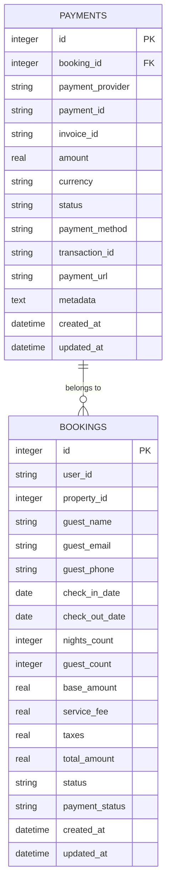
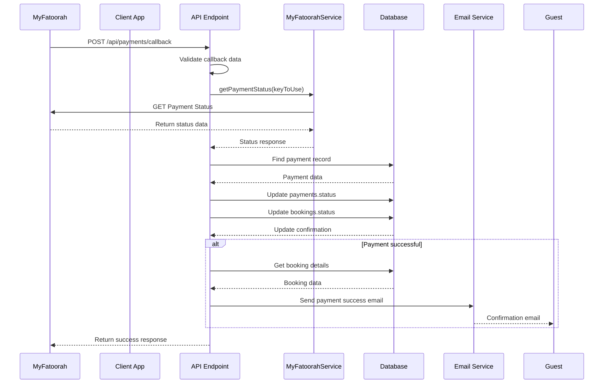

# Payment Status Synchronization

<cite>
**Referenced Files in This Document**   
- [PaymentService.ts](file://src/server/services/PaymentService.ts#L79-L855)
- [payment.ts](file://src/shared/payment.ts#L107-L164)
- [index.ts](file://src/worker/index.ts#1112-L1208)
- [PaymentSuccess.tsx](file://src/react-app/pages/PaymentSuccess.tsx#L0-L70)
- [4.sql](file://migrations/4.sql#L1-L45)
- [3.sql](file://migrations/3.sql#L1-L36)
</cite>

## Table of Contents
1. [Introduction](#introduction)
2. [Database Schema and Data Model](#database-schema-and-data-model)
3. [Payment Status Synchronization Workflow](#payment-status-synchronization-workflow)
4. [Core Components and Implementation](#core-components-and-implementation)
5. [Security Considerations](#security-considerations)
6. [Error Handling and Reconciliation](#error-handling-and-reconciliation)
7. [Idempotency and Data Consistency](#idempotency-and-data-consistency)
8. [Sequence Diagram of Payment Callback Flow](#sequence-diagram-of-payment-callback-flow)

## Introduction
The payment status synchronization mechanism in HabibiStay ensures that payment outcomes from external providers, particularly MyFatoorah, are accurately reflected in the application's booking and payment records. This document details the end-to-end process of receiving payment notifications, validating transaction details, updating database records, and maintaining data consistency across the system. The workflow involves secure API communication, database transactions, and status transitions that ensure reliability and integrity in the booking lifecycle.

## Database Schema and Data Model
The payment and booking systems are built on a relational data model with clear relationships between entities. The `payments` table stores transaction details, while the `bookings` table tracks reservation status. A foreign key relationship ensures referential integrity between payments and their associated bookings.



**Diagram sources**
- [4.sql](file://migrations/4.sql#L1-L45)
- [3.sql](file://migrations/3.sql#L1-L36)

**Section sources**
- [4.sql](file://migrations/4.sql#L1-L45)
- [3.sql](file://migrations/3.sql#L1-L36)

## Payment Status Synchronization Workflow
The payment status synchronization begins when MyFatoorah sends a payment callback to the `/api/payments/callback` endpoint. The system retrieves the latest payment status from MyFatoorah's API, validates the transaction amount and status, matches it with an existing payment record, and updates both the payment and booking statuses accordingly. If the payment is successful, the booking status transitions from "pending" to "confirmed", and a confirmation email is sent to the guest.

The workflow ensures that:
- Payment identifiers (paymentId, Id, InvoiceId) are properly mapped
- Transaction status is verified against MyFatoorah's API
- Booking status is updated atomically with payment status
- User notifications are triggered upon successful payment

## Core Components and Implementation
The payment status synchronization is implemented across multiple components, with the core logic residing in the worker's route handler and the shared payment service.

### Payment Callback Handler
The route handler in `index.ts` processes incoming payment callbacks and orchestrates the status update workflow.

```typescript
app.post("/api/payments/callback", zValidator("json", PaymentCallbackSchema), async (c) => {
  const { paymentId, Id, InvoiceId } = c.req.valid("json");
  const keyToUse = paymentId || Id || InvoiceId;
  
  // Retrieve payment status from MyFatoorah
  const statusResponse = await myfatoorah.getPaymentStatus(keyToUse);
  
  if (statusResponse.IsSuccess) {
    const paymentData = statusResponse.Data;
    const isSuccessful = paymentData.InvoiceStatus === 'Paid';
    
    // Find and update payment record
    const payment = await c.env.DB.prepare(`
      SELECT * FROM payments WHERE invoice_id = ? OR payment_id = ?
    `).bind(paymentData.InvoiceId.toString(), keyToUse).first();
    
    if (payment) {
      // Update payment status
      await c.env.DB.prepare(`
        UPDATE payments SET 
          status = ?, 
          transaction_id = ?,
          payment_method = ?,
          metadata = ?,
          updated_at = CURRENT_TIMESTAMP
        WHERE id = ?
      `).bind(
        isSuccessful ? 'completed' : 'failed',
        paymentData.InvoiceTransactions[0]?.TransactionId || null,
        paymentData.InvoiceTransactions[0]?.PaymentGateway || null,
        JSON.stringify(paymentData),
        (payment as any).id
      ).run();
      
      // Update booking status
      await c.env.DB.prepare(`
        UPDATE bookings SET 
          status = ?, 
          payment_status = ?,
          updated_at = CURRENT_TIMESTAMP
        WHERE id = ?
      `).bind(
        isSuccessful ? 'confirmed' : 'pending',
        isSuccessful ? 'completed' : 'failed',
        (payment as any).booking_id
      ).run();
    }
  }
});
```

**Section sources**
- [index.ts](file://src/worker/index.ts#1112-L1208)

### MyFatoorah Service Integration
The `MyFatoorahService` class in `payment.ts` handles all external API communication with MyFatoorah, providing methods to create invoices, check payment status, and cancel transactions.

```typescript
export class MyFatoorahService {
  async getPaymentStatus(paymentId: string): Promise<MyFatoorahPaymentStatusResponse> {
    return this.makeRequest(`/v2/getPaymentStatus`, 'POST', {
      Key: paymentId,
      KeyType: 'PaymentId'
    });
  }

  async getInvoiceStatus(invoiceId: string): Promise<MyFatoorahPaymentStatusResponse> {
    return this.makeRequest(`/v2/getPaymentStatus`, 'POST', {
      Key: invoiceId,
      KeyType: 'InvoiceId'
    });
  }
}
```

**Section sources**
- [payment.ts](file://src/shared/payment.ts#L107-L164)

## Security Considerations
The payment synchronization mechanism implements several security measures to prevent fraud and ensure data integrity:

- **Signature Verification**: Although the current implementation has a placeholder for webhook signature verification, a production system should validate the cryptographic signature of incoming webhook payloads to ensure they originate from MyFatoorah.
- **Replay Attack Prevention**: The system uses unique payment identifiers and checks existing payment statuses before processing updates, preventing duplicate processing of the same transaction.
- **Input Validation**: All incoming payment callbacks are validated using Zod schemas to ensure data integrity and prevent injection attacks.
- **Secure API Communication**: The MyFatoorah service uses HTTPS and Bearer token authentication for all API requests.

## Error Handling and Reconciliation
The system implements robust error handling to manage failed payments and network issues:

- Failed payment callbacks are logged and return appropriate HTTP status codes
- Database transactions ensure atomic updates to payment and booking records
- The system can reconcile discrepancies by manually verifying payment status through the MyFatoorah API
- Error notifications are logged for administrative review

When a payment fails, the system updates the payment status to "failed" and maintains the booking status as "pending", allowing users to attempt payment again.

## Idempotency and Data Consistency
The payment status synchronization mechanism ensures data consistency through:

- **Idempotent Operations**: Multiple callback requests for the same payment are handled safely by checking the existing payment status before updates.
- **Atomic Updates**: Payment and booking status updates are performed as separate but coordinated database operations, ensuring both records reflect the same state.
- **Rollback Strategy**: In case of partial failures, the system maintains audit logs in the database that allow manual intervention and reconciliation.
- **Manual Intervention Points**: Administrators can manually update payment and booking statuses through the admin interface if automatic synchronization fails.

The system prevents inconsistent states by always updating both payment and booking records in response to a payment status change, ensuring that the booking status accurately reflects the payment outcome.

## Sequence Diagram of Payment Callback Flow
The following sequence diagram illustrates the complete flow of a payment callback from MyFatoorah to the final booking confirmation.



**Diagram sources**
- [index.ts](file://src/worker/index.ts#1112-L1208)
- [payment.ts](file://src/shared/payment.ts#L107-L164)

**Section sources**
- [index.ts](file://src/worker/index.ts#1112-L1208)
- [payment.ts](file://src/shared/payment.ts#L107-L164)