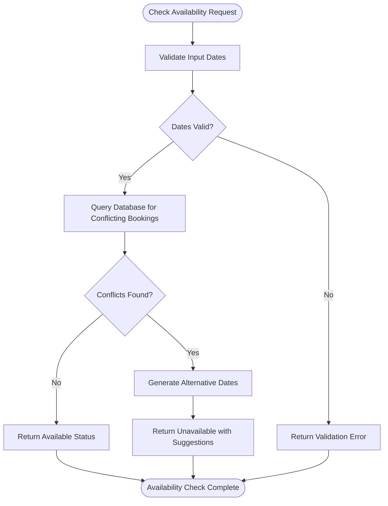
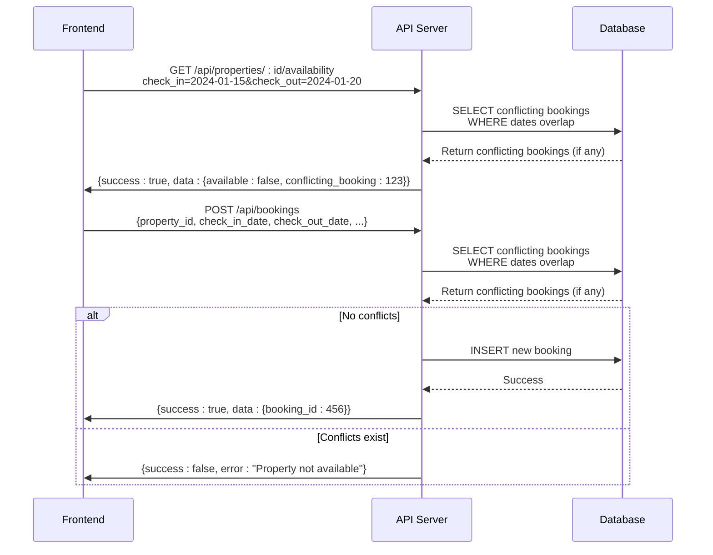
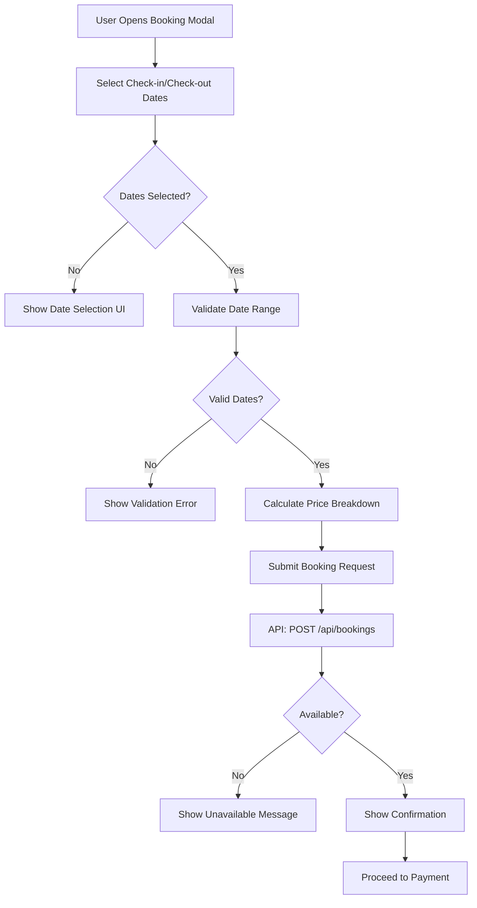
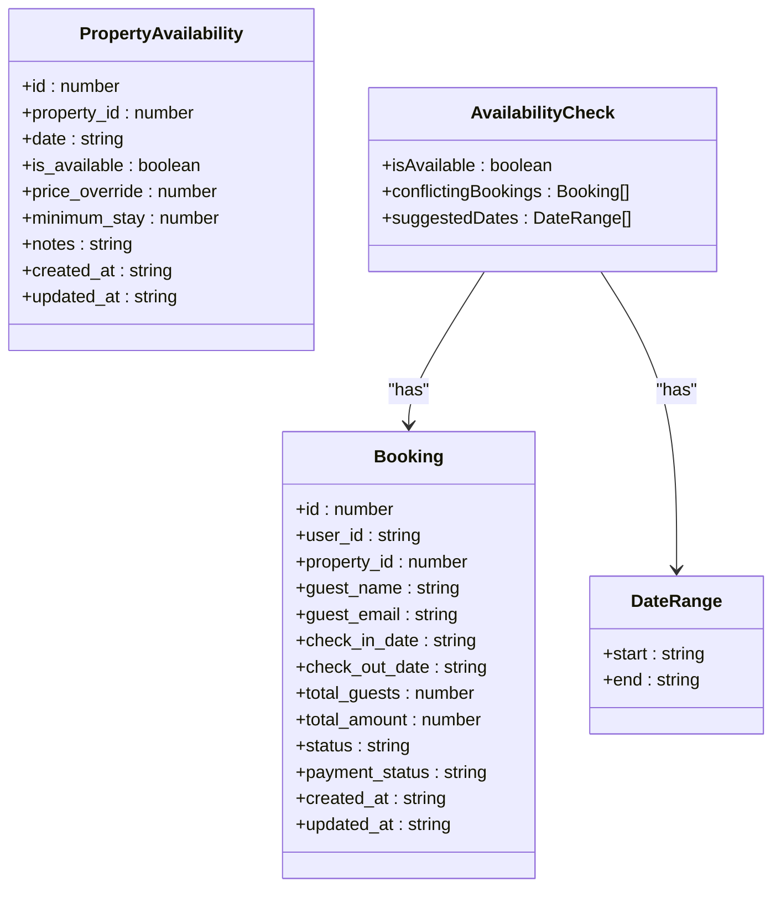

# Property Availability Checking

<cite>
**Referenced Files in This Document**   
- [BookingModal.tsx](file://src/react-app/components/BookingModal.tsx#L1-L473)
- [index.ts](file://src/worker/index.ts#L1-L2443)
- [types.ts](file://src/shared/types.ts#L384-L394)
- [BookingService.ts](file://src/server/services/BookingService.ts#L415-L456)
</cite>

## Table of Contents
1. [Introduction](#introduction)
2. [Core Components](#core-components)
3. [Availability Checking Logic](#availability-checking-logic)
4. [API Endpoints](#api-endpoints)
5. [Frontend Integration](#frontend-integration)
6. [Data Structures](#data-structures)
7. [Performance and Scalability](#performance-and-scalability)

## Introduction
This document details the property availability checking system in HabibiStay's backend. The system ensures that guests can only book properties during available time periods by checking for date conflicts with existing bookings. The implementation combines database queries with in-memory processing to provide real-time availability information to users.

## Core Components

The property availability system consists of several interconnected components that work together to provide a seamless booking experience. The main components include the frontend booking modal, API endpoints for availability checking, and backend services that handle the core logic.

**Section sources**
- [BookingModal.tsx](file://src/react-app/components/BookingModal.tsx#L1-L473)
- [index.ts](file://src/worker/index.ts#L1-L2443)
- [BookingService.ts](file://src/server/services/BookingService.ts#L415-L456)

## Availability Checking Logic

The availability checking logic is implemented in the BookingService class and follows a systematic approach to determine if a property can be booked for a given date range.

**Diagram sources**
- [BookingService.ts](file://src/server/services/BookingService.ts#L415-L456)

The core algorithm uses a SQL query to find overlapping bookings based on three possible conflict scenarios:
1. New booking starts before an existing booking ends and ends after the existing booking starts
2. New booking starts during an existing booking period
3. New booking is completely contained within an existing booking period

The SQL query uses the following conditions to detect overlapping date ranges:
- (check_in_date <= ? AND check_out_date > ?) OR
- (check_in_date < ? AND check_out_date >= ?) OR
- (check_in_date >= ? AND check_out_date <= ?)

This comprehensive approach ensures that all possible date range overlaps are detected, preventing double bookings.

**Section sources**
- [BookingService.ts](file://src/server/services/BookingService.ts#L415-L456)

## API Endpoints

The system exposes several API endpoints for checking property availability and handling bookings.

**Diagram sources**
- [index.ts](file://src/worker/index.ts#L1-L2443)

The main availability checking endpoint is:

**GET /api/properties/:id/availability**
- **Parameters**: property_id, check_in, check_out
- **Response**: Returns whether the property is available for the requested dates
- **Implementation**: Queries the bookings table for overlapping date ranges

The booking creation endpoint also performs availability checking:

**POST /api/bookings**
- **Function**: Creates a new booking after validating availability
- **Implementation**: Checks for conflicting bookings before insertion
- **Validation**: Ensures check-in is before check-out and dates are in the future

**Section sources**
- [index.ts](file://src/worker/index.ts#L1-L2443)

## Frontend Integration

The frontend integrates with the availability checking system through the BookingModal component, which provides a user-friendly interface for booking properties.

**Diagram sources**
- [BookingModal.tsx](file://src/react-app/components/BookingModal.tsx#L1-L473)

The BookingModal component handles the entire booking flow:
- Collects guest information and stay dates
- Validates form inputs including date ranges
- Calculates booking costs with service fees and taxes
- Submits booking requests to the API
- Handles success and error responses

Key validation rules implemented in the frontend:
- Check-in date cannot be in the past
- Check-out date must be after check-in date
- Number of guests cannot exceed property maximum
- Email address must be valid

The component also calculates the total booking cost including:
- Base amount (nights × price per night)
- Service fee (5% of base amount)
- Taxes (15% VAT on base amount)

**Section sources**
- [BookingModal.tsx](file://src/react-app/components/BookingModal.tsx#L1-L473)

## Data Structures

The system uses well-defined data structures to represent property availability and related information.

**Diagram sources**
- [types.ts](file://src/shared/types.ts#L384-L394)
- [BookingService.ts](file://src/server/services/BookingService.ts#L415-L456)

The PropertyAvailability interface defines the structure for daily availability records:
- **id**: Unique identifier for the availability record
- **property_id**: Reference to the associated property
- **date**: The specific date for which availability is set
- **is_available**: Boolean indicating if the property is available
- **price_override**: Optional price override for the date
- **minimum_stay**: Minimum number of nights required for booking
- **notes**: Optional notes about availability restrictions

The AvailabilityCheck response structure includes:
- **isAvailable**: Boolean indicating overall availability
- **conflictingBookings**: Array of bookings that conflict with the requested dates
- **suggestedDates**: Alternative date ranges that are available

**Section sources**
- [types.ts](file://src/shared/types.ts#L384-L394)

## Performance and Scalability

The availability checking system is designed with performance and scalability considerations to handle high traffic and large datasets.

### Database Indexing Strategy
To optimize query performance, the following database indexes are recommended:
- Index on bookings.property_id for fast property-based lookups
- Composite index on bookings.property_id and check_in_date for date range queries
- Index on bookings.status to quickly filter by booking status
- Composite index on check_in_date and check_out_date for range queries

### Caching Considerations
For high-traffic scenarios, caching strategies can be implemented:
- Cache availability results for popular properties and date ranges
- Use Redis or similar in-memory store for frequently accessed data
- Implement cache invalidation when bookings are created or modified
- Cache property details and availability calendars for 15-30 minutes

### Scalability Challenges
As the number of properties and bookings grows, several challenges emerge:
- Increased query times for availability checks
- Higher database load during peak booking periods
- Memory usage for in-memory date conflict detection
- Latency in response times for users

### Optimization Recommendations
1. **Database Optimization**: Implement proper indexing on booking date fields
2. **Query Optimization**: Use efficient date range overlap detection
3. **Caching Layer**: Implement Redis caching for availability data
4. **Rate Limiting**: Apply rate limiting to prevent abuse of availability endpoints
5. **Connection Pooling**: Use database connection pooling for better resource management
6. **Asynchronous Processing**: Handle email notifications and analytics updates asynchronously

The current implementation already includes several performance features:
- Rate limiting on API endpoints (1000 requests per 15 minutes)
- Input validation and sanitization to prevent malicious queries
- Efficient SQL queries for date range overlap detection
- Security middleware to prevent SQL injection attacks

**Section sources**
- [index.ts](file://src/worker/index.ts#L1-L2443)
- [BookingService.ts](file://src/server/services/BookingService.ts#L415-L456)