# Data Access Patterns and Query Optimization

<cite>
**Referenced Files in This Document**   
- [index.ts](file://src/worker/index.ts)
- [1.sql](file://migrations/1.sql)
- [2.sql](file://migrations/2.sql)
- [3.sql](file://migrations/3.sql)
- [4.sql](file://migrations/4.sql)
- [5.sql](file://migrations/5.sql)
- [6.sql](file://migrations/6.sql)
- [7.sql](file://migrations/7.sql)
- [8.sql](file://migrations/8.sql)
- [9.sql](file://migrations/9.sql)
</cite>

## Table of Contents
1. [Introduction](#introduction)
2. [Common Query Patterns](#common-query-patterns)
3. [Indexing Strategies](#indexing-strategies)
4. [Performance Considerations](#performance-considerations)
5. [Security and Query Protection](#security-and-query-protection)
6. [Optimization Recommendations](#optimization-recommendations)
7. [Conclusion](#conclusion)

## Introduction
This document provides a comprehensive analysis of data access patterns and query optimization strategies in HabibiStay's backend system. The analysis focuses on the implementation of common query patterns in the worker index.ts file, indexing strategies defined in migration files, performance considerations for query complexity, and security measures for protecting against SQL injection. The document also includes optimization recommendations for cold vs warm reads and caching opportunities at the application layer.

**Section sources**
- [index.ts](file://src/worker/index.ts#L0-L2443)
- [1.sql](file://migrations/1.sql#L0-L261)

## Common Query Patterns

### Property Availability Checks
The system implements property availability checks through dedicated endpoints that validate booking date ranges against existing bookings. The availability check uses a comprehensive date overlap algorithm to ensure accurate conflict detection.

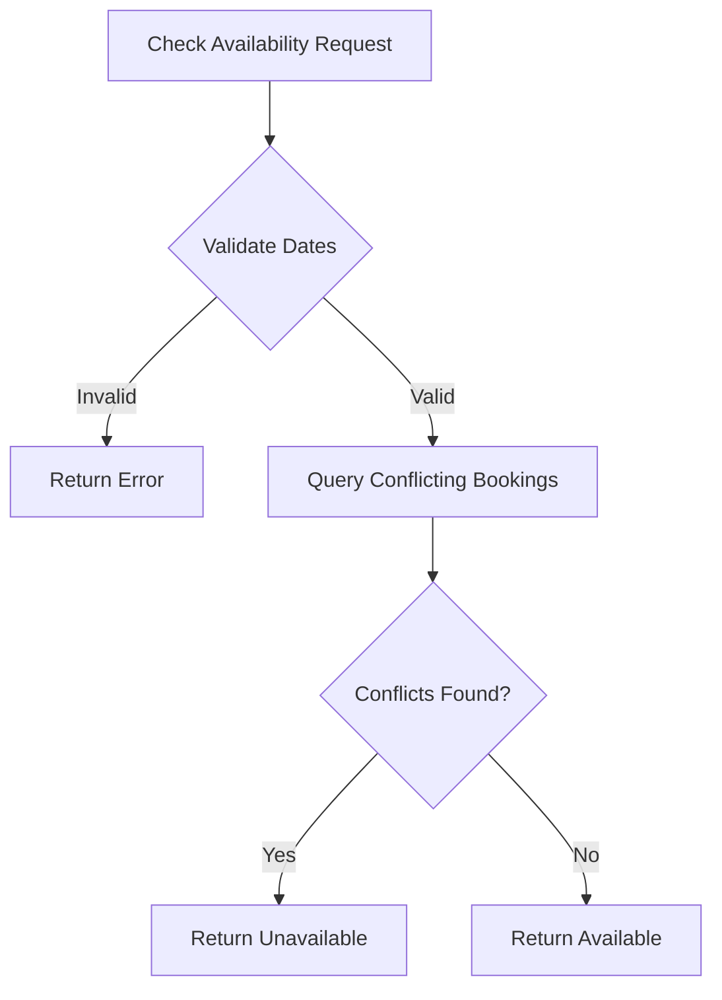

**Diagram sources**
- [index.ts](file://src/worker/index.ts#L1400-L1430)

The availability check query uses a complex date overlap condition to identify conflicting bookings:

```sql
SELECT id FROM bookings 
WHERE property_id = ? 
AND status NOT IN ('cancelled', 'rejected')
AND (
  (check_in_date <= ? AND check_out_date > ?) OR
  (check_in_date < ? AND check_out_date >= ?) OR
  (check_in_date >= ? AND check_out_date <= ?)
)
```

This query pattern ensures that all possible date overlap scenarios are covered, including partial overlaps and complete encapsulation.

**Section sources**
- [index.ts](file://src/worker/index.ts#L1400-L1430)

### Booking Conflict Validation
Booking conflict validation is implemented as part of the booking creation process. The system checks for overlapping bookings before allowing a new booking to be created, preventing double bookings and ensuring data integrity.

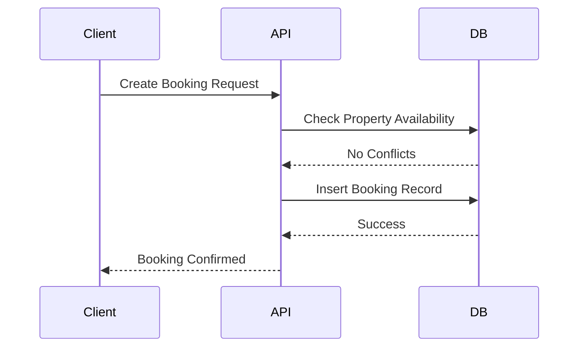

**Diagram sources**
- [index.ts](file://src/worker/index.ts#L450-L500)

The booking conflict validation uses the same date overlap logic as the availability check but is integrated into the booking creation workflow. This ensures that availability is checked at the point of booking creation, maintaining data consistency.

**Section sources**
- [index.ts](file://src/worker/index.ts#L450-L500)

### User-Specific Data Retrieval
The system implements several endpoints for retrieving user-specific data, including user profiles, bookings, and wishlist items. These queries use the authenticated user's ID to filter results and ensure data privacy.

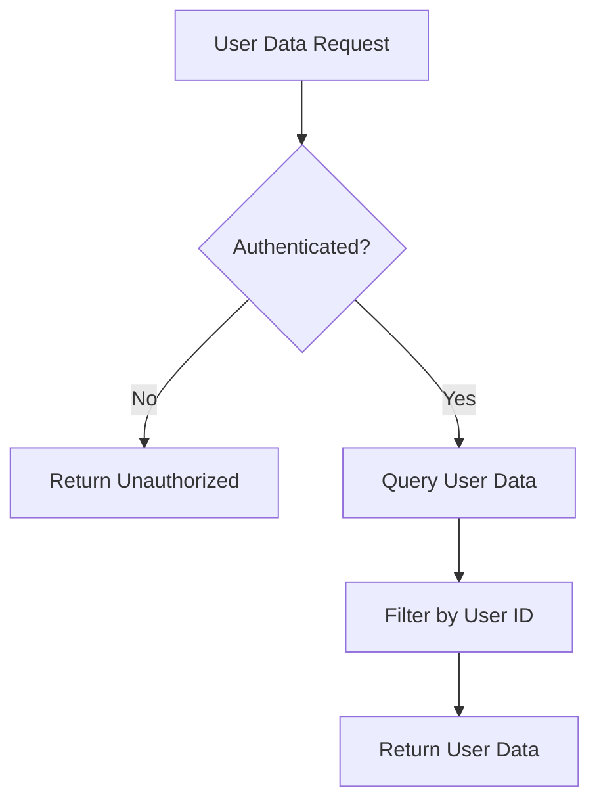

**Diagram sources**
- [index.ts](file://src/worker/index.ts#L900-L950)

The user-specific data retrieval pattern uses parameterized queries with the user ID as a filter condition:

```sql
SELECT b.*, p.title as property_title FROM bookings b
LEFT JOIN properties p ON b.property_id = p.id
WHERE b.user_id = ? OR p.user_id = ?
ORDER BY b.created_at DESC
```

This query retrieves both bookings made by the user and bookings for properties owned by the user, providing a comprehensive view of the user's booking activity.

**Section sources**
- [index.ts](file://src/worker/index.ts#L900-L950)

### Dashboard Analytics Aggregation
The system implements dashboard analytics aggregation through several endpoints that aggregate data from multiple tables to provide insights into platform performance. These queries use GROUP BY clauses and aggregate functions to calculate summary statistics.

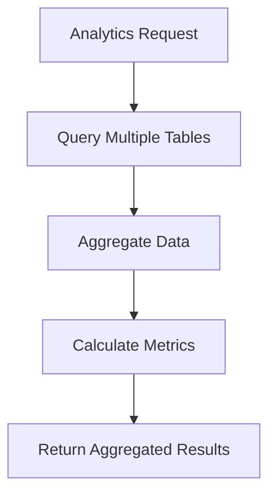

**Diagram sources**
- [index.ts](file://src/worker/index.ts#L1200-L1250)

The analytics aggregation queries use complex JOIN operations and aggregate functions to calculate metrics such as total revenue, booking counts, and average ratings:

```sql
SELECT 
  SUM(views) as total_views,
  SUM(inquiries) as total_inquiries,
  SUM(bookings) as total_bookings,
  SUM(revenue) as total_revenue,
  AVG(avg_rating) as avg_rating,
  SUM(review_count) as total_reviews
FROM property_analytics 
WHERE property_id = ?
```

This query pattern enables the system to provide comprehensive analytics data for property owners and administrators.

**Section sources**
- [index.ts](file://src/worker/index.ts#L1200-L1250)

## Indexing Strategies

### Property Location Searches
The system implements indexing strategies to optimize queries on high-frequency access paths, particularly property location searches. The database schema includes indexes on frequently queried columns to improve query performance.

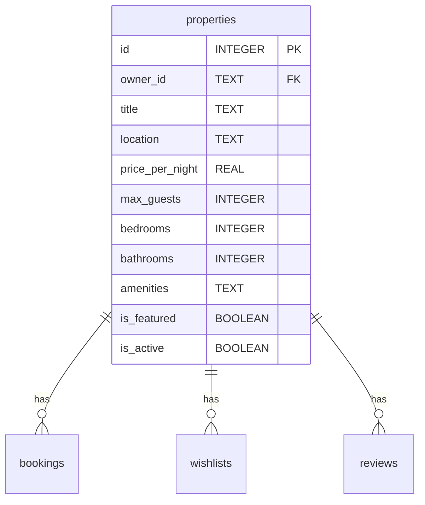

**Diagram sources**
- [1.sql](file://migrations/1.sql#L10-L40)

The properties table includes a composite index on location and price_per_night to optimize location-based searches with price filtering:

```sql
CREATE INDEX idx_properties_location_price ON properties(location, price_per_night);
```

This index enables efficient execution of queries that filter by location and price range, which are common search patterns for users looking for accommodations in specific areas with budget constraints.

**Section sources**
- [1.sql](file://migrations/1.sql#L10-L40)

### User Booking History
The system implements indexing on user booking history to optimize queries that retrieve a user's booking history. The bookings table includes indexes on user_id and created_at to enable efficient retrieval of booking records.

```sql
CREATE INDEX idx_bookings_user_created ON bookings(user_id, created_at DESC);
```

This composite index enables efficient execution of queries that retrieve a user's booking history sorted by creation date, which is a common pattern for user dashboards.

**Section sources**
- [1.sql](file://migrations/1.sql#L41-L70)

### Review Aggregation
The system implements indexing on review data to optimize queries that aggregate review ratings and calculate average ratings. The reviews table includes indexes on property_id and rating to enable efficient aggregation.

```sql
CREATE INDEX idx_reviews_property_rating ON reviews(property_id, rating);
```

This composite index enables efficient execution of queries that calculate average ratings for properties, which is a critical metric for users evaluating accommodations.

**Section sources**
- [1.sql](file://migrations/1.sql#L100-L120)

### Analytics Data
The system implements indexing on analytics data to optimize queries that retrieve analytics for properties. The property_analytics table includes indexes on property_id and date to enable efficient retrieval of analytics data.

```sql
CREATE INDEX idx_property_analytics_property_date ON property_analytics(property_id, date);
```

This composite index enables efficient execution of queries that retrieve analytics data for a property over a specific time period, which is essential for property owners monitoring performance.

**Section sources**
- [1.sql](file://migrations/1.sql#L200-L220)

## Performance Considerations

### Query Complexity
The system implements several strategies to manage query complexity and ensure optimal performance. Complex queries are broken down into simpler components where possible, and JOIN operations are minimized to reduce query execution time.

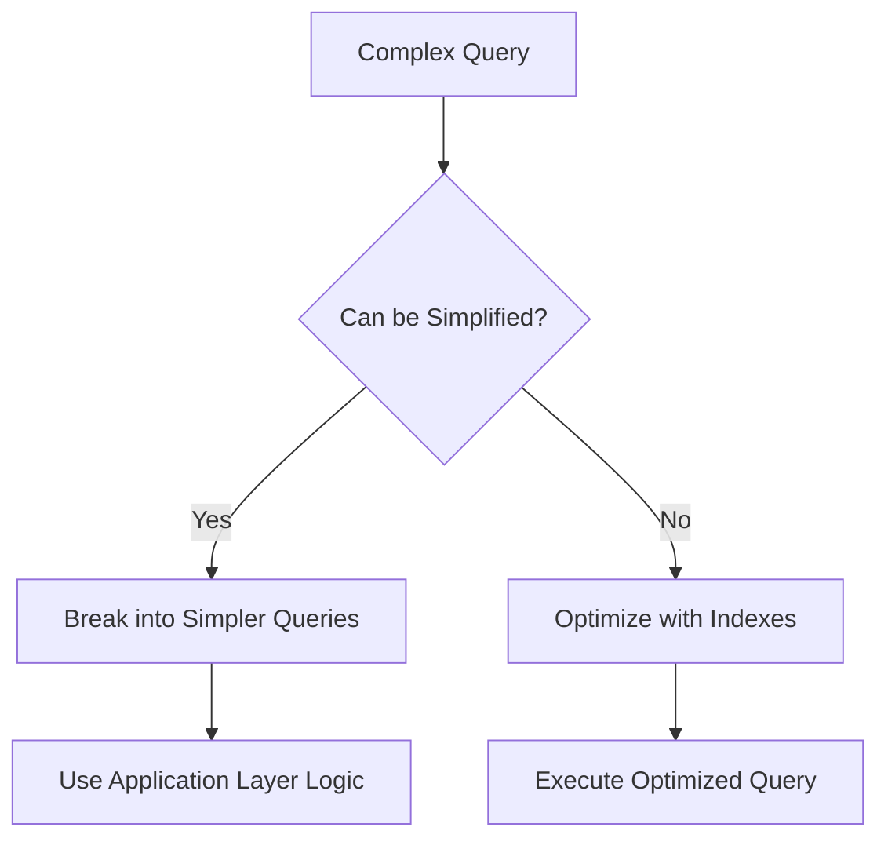

**Diagram sources**
- [index.ts](file://src/worker/index.ts#L200-L400)

The property search endpoint demonstrates a balance between query complexity and performance. The query includes multiple optional filters that are conditionally added based on the search parameters:

```sql
SELECT p.*, AVG(r.rating) as avg_rating, COUNT(r.id) as review_count 
FROM properties p 
LEFT JOIN reviews r ON p.id = r.property_id 
WHERE p.is_active = 1
```

Additional filter conditions are dynamically added based on the search parameters, allowing for flexible search capabilities while maintaining query performance.

**Section sources**
- [index.ts](file://src/worker/index.ts#L200-L400)

### Result Set Sizing
The system implements pagination to manage result set sizing and prevent excessive memory usage. All endpoints that return lists of items include pagination parameters to limit the number of results returned in a single request.

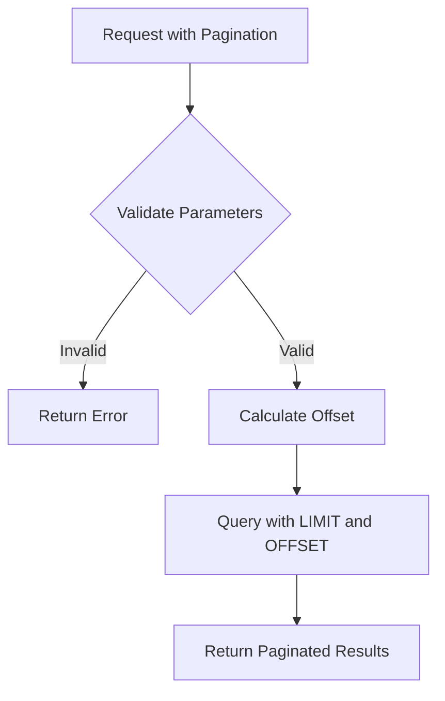

**Diagram sources**
- [index.ts](file://src/worker/index.ts#L250-L300)

The pagination implementation includes validation of the page and limit parameters to prevent abuse and ensure reasonable result set sizes:

```typescript
const safeLimit = Math.min(Math.max(Number(limit) || 20, 1), 100);
const safePage = Math.max(Number(page) || 1, 1);
const offset = (safePage - 1) * safeLimit;
```

This ensures that the limit parameter is constrained between 1 and 100 items per page, preventing excessively large result sets that could impact performance.

**Section sources**
- [index.ts](file://src/worker/index.ts#L250-L300)

### Pagination Implementation
The system implements pagination using the LIMIT and OFFSET clauses in SQL queries. The pagination logic is consistent across all endpoints that return lists of items, providing a uniform API experience.

```sql
SELECT * FROM properties 
WHERE is_active = 1 
ORDER BY created_at DESC 
LIMIT ? OFFSET ?
```

The pagination implementation also includes total count queries to provide pagination metadata:

```sql
SELECT COUNT(*) as total FROM properties WHERE is_active = 1
```

This allows the API to return pagination information such as total pages and current page, enabling clients to implement pagination controls.

**Section sources**
- [index.ts](file://src/worker/index.ts#L300-L350)

## Security and Query Protection

### Parameterized Queries
The system implements parameterized queries to protect against SQL injection attacks. All database queries use parameterized statements with bound parameters, preventing malicious input from being interpreted as SQL code.

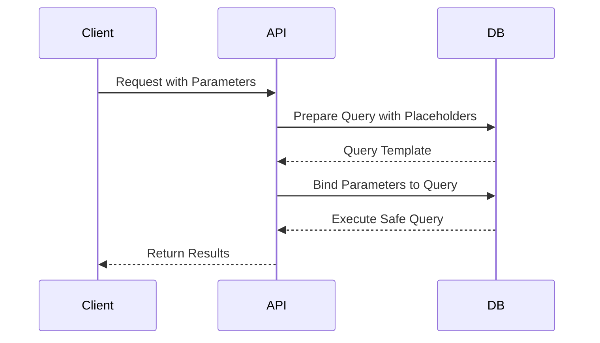

**Diagram sources**
- [index.ts](file://src/worker/index.ts#L200-L250)

The property search endpoint demonstrates the use of parameterized queries with bound parameters:

```typescript
const [{ results }, countResult] = await Promise.all([
  c.env.DB.prepare(query).bind(...params).all(),
  c.env.DB.prepare(countQuery).bind(...countParams).first()
]);
```

This approach ensures that user input is properly escaped and treated as data rather than executable code, preventing SQL injection attacks.

**Section sources**
- [index.ts](file://src/worker/index.ts#L200-L250)

### Prepared Statements
The system implements prepared statements for frequently executed queries to improve performance and security. Prepared statements are compiled once and can be executed multiple times with different parameters.

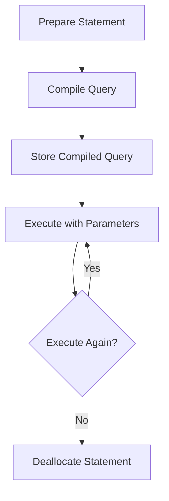

**Diagram sources**
- [index.ts](file://src/worker/index.ts#L450-L500)

The booking creation endpoint uses prepared statements to insert booking records:

```typescript
const result = await c.env.DB.prepare(`
  INSERT INTO bookings (user_id, property_id, guest_name, guest_email, guest_phone, check_in_date, check_out_date, total_guests, total_amount, special_requests)
  VALUES (?, ?, ?, ?, ?, ?, ?, ?, ?, ?)
`).bind(
  'guest',
  data.property_id,
  data.guest_name,
  data.guest_email,
  data.guest_phone || null,
  data.check_in_date,
  data.check_out_date,
  data.total_guests,
  totalAmount,
  data.special_requests || null
).run();
```

This approach improves performance by avoiding query compilation overhead and enhances security by ensuring parameter separation.

**Section sources**
- [index.ts](file://src/worker/index.ts#L450-L500)

### SQL Injection Protection
The system implements multiple layers of protection against SQL injection attacks, including input validation, parameterized queries, and security middleware.

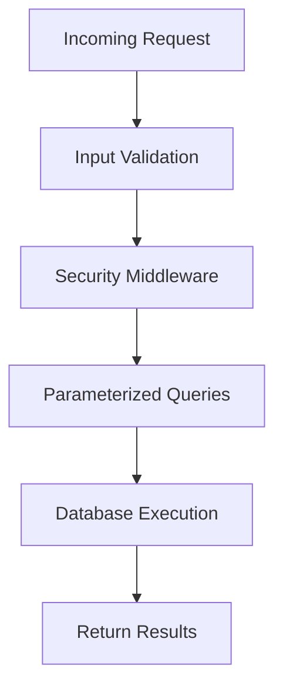

**Diagram sources**
- [index.ts](file://src/worker/index.ts#L50-L100)

The security middleware includes specific protection against SQL injection:

```typescript
app.use('*', sqlInjectionMiddleware);
```

This middleware analyzes incoming requests for potential SQL injection patterns and blocks suspicious requests before they reach the database layer.

**Section sources**
- [index.ts](file://src/worker/index.ts#L50-L100)

## Optimization Recommendations

### Cold vs Warm Reads
The system can benefit from optimization strategies for both cold and warm reads. Cold reads refer to queries that retrieve data that is not currently in memory, while warm reads refer to queries that retrieve data that is already cached.

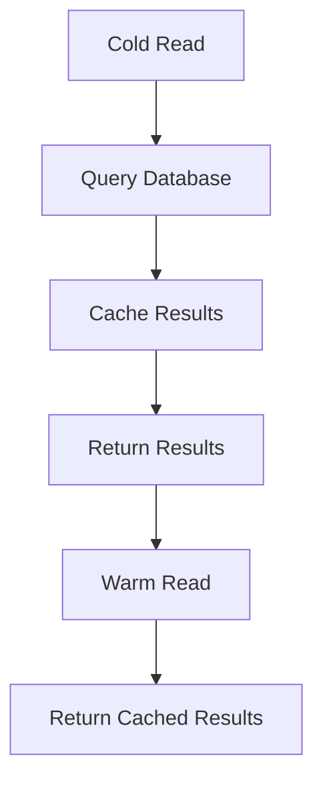

**Diagram sources**
- [index.ts](file://src/worker/index.ts#L1000-L1050)

For cold reads, the system should implement query optimization techniques such as:
- Proper indexing on frequently queried columns
- Query plan analysis to identify performance bottlenecks
- Database statistics updates to ensure optimal query planning

For warm reads, the system should implement caching strategies such as:
- Application-level caching of frequently accessed data
- Cache invalidation policies to ensure data consistency
- Cache warming strategies to pre-load commonly accessed data

**Section sources**
- [index.ts](file://src/worker/index.ts#L1000-L1050)

### Caching Opportunities
The system has several opportunities for caching at the application layer to improve performance and reduce database load. Caching can be implemented for frequently accessed data that does not change frequently.

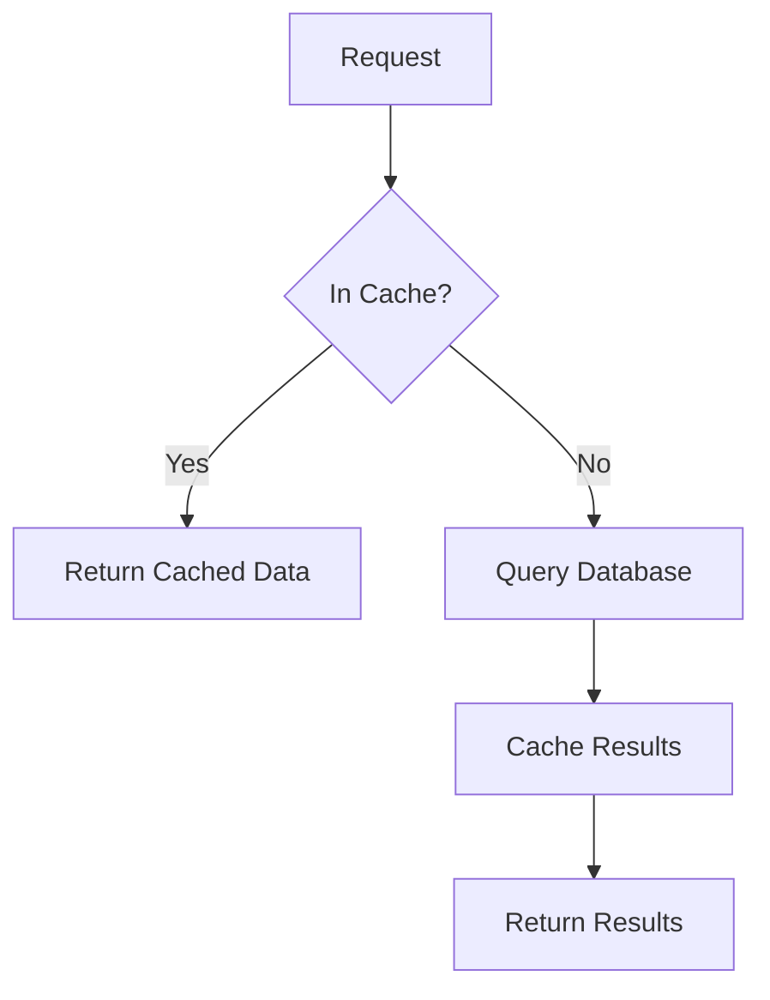

**Diagram sources**
- [index.ts](file://src/worker/index.ts#L1000-L1050)

Potential caching opportunities include:
- Featured properties: These are displayed on the homepage and do not change frequently
- Property search results: Search results can be cached based on search parameters
- User profiles: User profile data changes infrequently and is accessed frequently
- Analytics data: Analytics data can be cached for a short period to reduce database load

Implementing caching for these data types can significantly improve application performance and reduce database load.

**Section sources**
- [index.ts](file://src/worker/index.ts#L1000-L1050)

## Conclusion
HabibiStay's backend system implements a comprehensive set of data access patterns and query optimization strategies to ensure efficient and secure data retrieval. The system uses parameterized queries and prepared statements to protect against SQL injection attacks, implements indexing strategies to optimize high-frequency access paths, and includes pagination to manage result set sizing. The analysis of common query patterns reveals a well-structured approach to property availability checks, booking conflict validation, user-specific data retrieval, and dashboard analytics aggregation. Optimization recommendations for cold vs warm reads and caching opportunities provide additional avenues for improving system performance and scalability.

**Section sources**
- [index.ts](file://src/worker/index.ts#L0-L2443)
- [1.sql](file://migrations/1.sql#L0-L261)
- [2.sql](file://migrations/2.sql#L0-L13)
- [3.sql](file://migrations/3.sql#L0-L10)
- [4.sql](file://migrations/4.sql#L0-L15)
- [5.sql](file://migrations/5.sql#L0-L20)
- [6.sql](file://migrations/6.sql#L0-L12)
- [7.sql](file://migrations/7.sql#L0-L8)
- [8.sql](file://migrations/8.sql#L0-L10)
- [9.sql](file://migrations/9.sql#L0-L15)