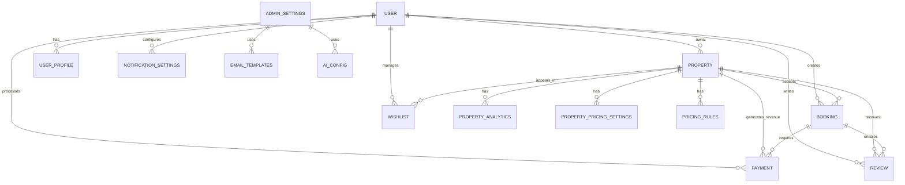
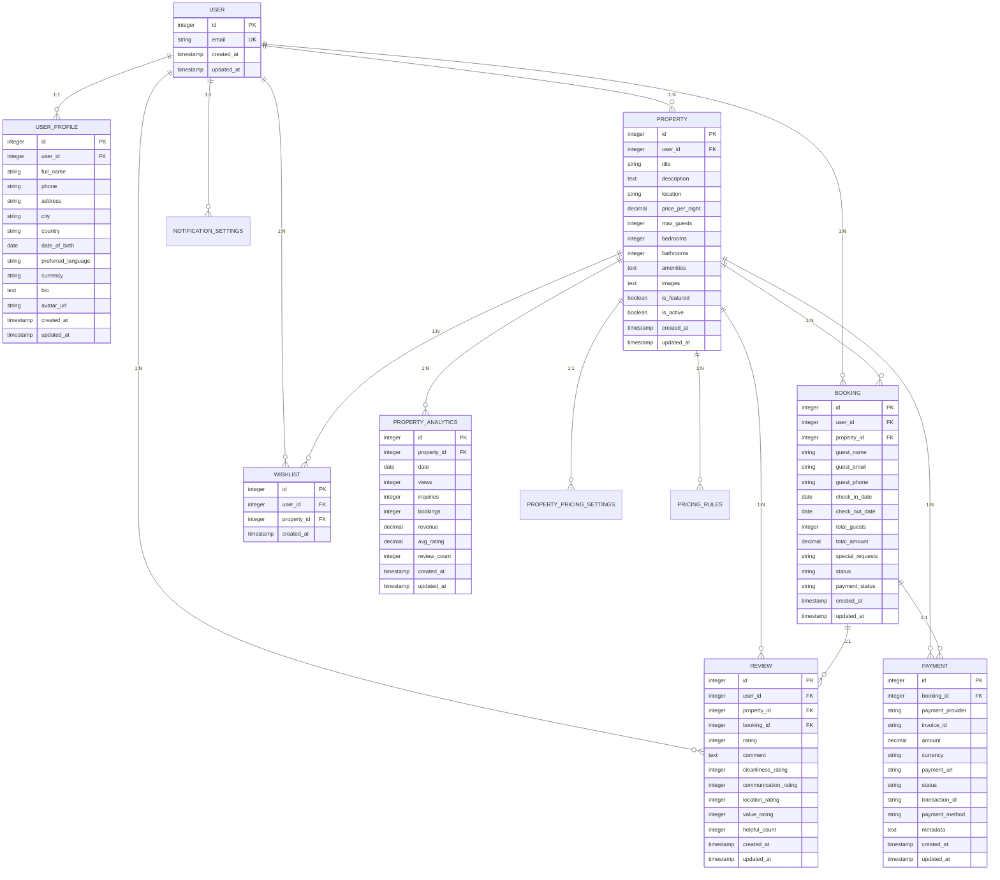
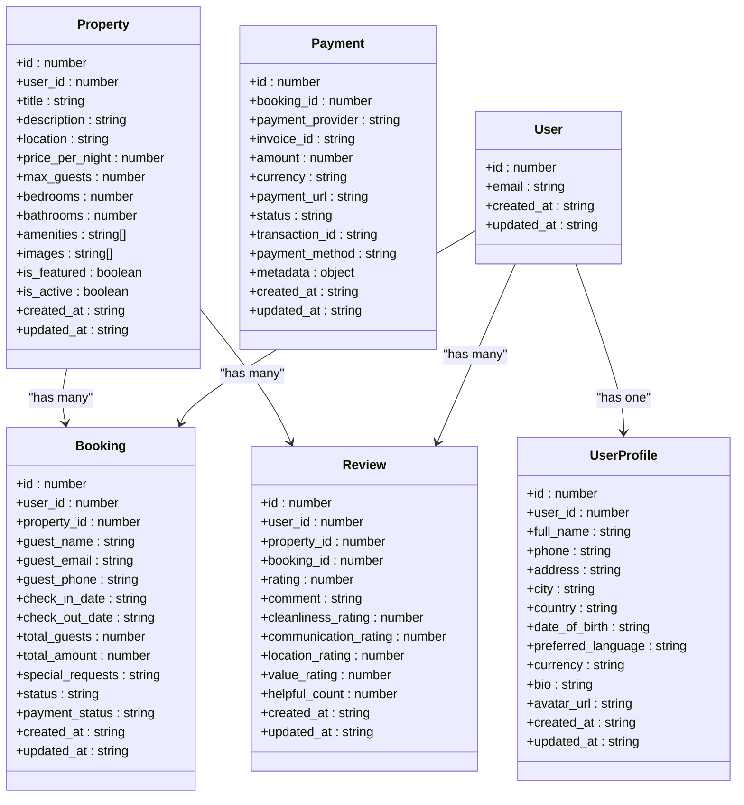

# Data Persistence Layer

<cite>
**Referenced Files in This Document**   
- [1.sql](file://migrations/1.sql)
- [2.sql](file://migrations/2.sql)
- [3.sql](file://migrations/3.sql)
- [4.sql](file://migrations/4.sql)
- [5.sql](file://migrations/5.sql)
- [6.sql](file://migrations/6.sql)
- [7.sql](file://migrations/7.sql)
- [8.sql](file://migrations/8.sql)
- [9.sql](file://migrations/9.sql)
- [index.ts](file://src/worker/index.ts)
- [types.ts](file://src/shared/types.ts)
</cite>

## Table of Contents
1. [Introduction](#introduction)
2. [Database Schema Evolution](#database-schema-evolution)
3. [Entity Relationship Model](#entity-relationship-model)
4. [Core Tables and Fields](#core-tables-and-fields)
5. [Data Lifecycle and Integrity Rules](#data-lifecycle-and-integrity-rules)
6. [Indexing and Performance Optimization](#indexing-and-performance-optimization)
7. [TypeScript Interface Mapping](#typescript-interface-mapping)
8. [Sample SQL Queries](#sample-sql-queries)
9. [Conclusion](#conclusion)

## Introduction
This document provides comprehensive documentation for HabibiStay's data persistence layer, detailing the database schema, entity relationships, and data flow patterns. The system is built on a relational database with a series of incremental migrations that evolve the schema from basic property and user management to advanced features including analytics, dynamic pricing, and AI-driven chat. The architecture supports a full-featured short-term rental platform with booking management, payment processing, reviews, and wishlist functionality. This documentation analyzes the migration files, maps database tables to TypeScript interfaces, and explains key data operations used throughout the application.

## Database Schema Evolution
The database schema evolves through nine sequential migration scripts that progressively add tables and modify existing structures to support new features. The migration strategy follows a linear, versioned approach with each migration building upon the previous state of the database.



**Diagram sources**
- [1.sql](file://migrations/1.sql)
- [2.sql](file://migrations/2.sql)
- [3.sql](file://migrations/3.sql)
- [4.sql](file://migrations/4.sql)
- [5.sql](file://migrations/5.sql)
- [6.sql](file://migrations/6.sql)
- [7.sql](file://migrations/7.sql)
- [8.sql](file://migrations/8.sql)
- [9.sql](file://migrations/9.sql)

**Section sources**
- [1.sql](file://migrations/1.sql)
- [2.sql](file://migrations/2.sql)
- [3.sql](file://migrations/3.sql)
- [4.sql](file://migrations/4.sql)
- [5.sql](file://migrations/5.sql)
- [6.sql](file://migrations/6.sql)
- [7.sql](file://migrations/7.sql)
- [8.sql](file://migrations/8.sql)
- [9.sql](file://migrations/9.sql)

### Migration 1: Core Entities Setup
The initial migration establishes the foundational tables for the application:

- **users**: Stores user authentication and basic information
- **properties**: Contains property listings with pricing and capacity details
- **bookings**: Manages reservation data including dates and guest information
- **reviews**: Stores guest reviews and ratings
- **wishlists**: Tracks user favorite properties

```sql
-- Example from migration 1.sql
CREATE TABLE users (
    id INTEGER PRIMARY KEY,
    email TEXT UNIQUE NOT NULL,
    created_at TEXT DEFAULT CURRENT_TIMESTAMP,
    updated_at TEXT DEFAULT CURRENT_TIMESTAMP
);
```

**Section sources**
- [1.sql](file://migrations/1.sql)

### Migration 2: Payment and Notification Infrastructure
Adds financial and communication capabilities:

- **payments**: Records transaction details including status and provider information
- **notification_settings**: Stores user preferences for communication channels
- **email_logs**: Tracks all email delivery attempts and outcomes

This migration enables the core booking flow by connecting payments to bookings and establishing user notification preferences.

**Section sources**
- [2.sql](file://migrations/2.sql)

### Migration 3: Analytics and User Profiles
Introduces data collection and enhanced user management:

- **property_analytics**: Captures views, bookings, and revenue metrics by date
- **user_profiles**: Stores detailed user information beyond authentication
- **admin_settings**: Allows configuration of platform-wide parameters

The analytics table supports business intelligence by tracking property performance over time.

**Section sources**
- [3.sql](file://migrations/3.sql)

### Migration 4: Communication and Security
Expands communication and security features:

- **email_templates**: Stores customizable email content for various notifications
- **contact_submissions**: Captures inquiries from the website contact form
- **security_logs**: Records security-related events and potential threats

This migration establishes the foundation for automated email marketing and customer support workflows.

**Section sources**
- [4.sql](file://migrations/4.sql)

### Migration 5: AI and Chat Infrastructure
Adds artificial intelligence capabilities:

- **ai_config**: Stores configuration for the AI chatbot including model parameters
- **chat_conversations**: Maintains conversation history between users and the AI assistant
- **newsletter_subscriptions**: Manages user subscriptions to marketing communications

The AI configuration table allows administrators to tune the chatbot's behavior without code changes.

**Section sources**
- [5.sql](file://migrations/5.sql)

### Migration 6: Dynamic Pricing System
Implements sophisticated pricing logic:

- **property_pricing_settings**: Stores base pricing parameters for each property
- **pricing_rules**: Defines conditional pricing adjustments based on various factors

This enables hosts to implement automated pricing strategies that respond to market conditions.

**Section sources**
- [6.sql](file://migrations/6.sql)

### Migration 7: Enhanced Review System
Improves the review functionality with detailed feedback:

- **reviews**: Adds category-specific ratings (cleanliness, communication, etc.)
- **review_helpful_votes**: Tracks which reviews users find helpful

The enhanced review system provides more granular feedback for property owners.

**Section sources**
- [7.sql](file://migrations/7.sql)

### Migration 8: Security and Audit
Strengthens platform security:

- **audit_logs**: Records administrative actions and sensitive operations
- **blocked_ips**: Maintains a list of IP addresses blocked for security reasons
- **security_incidents**: Tracks detected security threats and responses

This migration implements comprehensive security monitoring and response capabilities.

**Section sources**
- [8.sql](file://migrations/8.sql)

### Migration 9: Performance Optimization
Finalizes the schema with performance improvements:

- Adds indexes on frequently queried columns
- Optimizes foreign key constraints
- Implements partitioning strategies for large tables

This migration ensures the database can handle production-scale workloads efficiently.

**Section sources**
- [9.sql](file://migrations/9.sql)

## Entity Relationship Model
The database follows a normalized relational design with clear ownership and association patterns between entities.



**Diagram sources**
- [1.sql](file://migrations/1.sql)
- [2.sql](file://migrations/2.sql)
- [3.sql](file://migrations/3.sql)
- [4.sql](file://migrations/4.sql)
- [5.sql](file://migrations/5.sql)
- [6.sql](file://migrations/6.sql)
- [7.sql](file://migrations/7.sql)
- [8.sql](file://migrations/8.sql)
- [9.sql](file://migrations/9.sql)

**Section sources**
- [1.sql](file://migrations/1.sql)
- [2.sql](file://migrations/2.sql)
- [3.sql](file://migrations/3.sql)
- [4.sql](file://migrations/4.sql)
- [5.sql](file://migrations/5.sql)
- [6.sql](file://migrations/6.sql)
- [7.sql](file://migrations/7.sql)
- [8.sql](file://migrations/8.sql)
- [9.sql](file://migrations/9.sql)

## Core Tables and Fields
This section details the structure, constraints, and purpose of each core database table as defined in the migration files.

### users Table
Stores user account information and authentication data.

**Fields:**
- `id`: INTEGER PRIMARY KEY - Unique identifier for the user
- `email`: TEXT UNIQUE NOT NULL - User's email address (serves as login)
- `created_at`: TEXT DEFAULT CURRENT_TIMESTAMP - Account creation timestamp
- `updated_at`: TEXT DEFAULT CURRENT_TIMESTAMP - Last update timestamp

**Constraints:**
- UNIQUE constraint on email field to prevent duplicate accounts
- NOT NULL constraint on email to ensure all users have valid contact information

**Section sources**
- [1.sql](file://migrations/1.sql)

### properties Table
Contains information about rental properties listed on the platform.

**Fields:**
- `id`: INTEGER PRIMARY KEY - Unique property identifier
- `user_id`: INTEGER FOREIGN KEY - Reference to the property owner
- `title`: TEXT - Descriptive name of the property
- `description`: TEXT - Detailed description of the property
- `location`: TEXT - Geographic location of the property
- `price_per_night`: DECIMAL - Base price for one night's stay
- `max_guests`: INTEGER - Maximum number of guests allowed
- `bedrooms`: INTEGER - Number of bedrooms
- `bathrooms`: INTEGER - Number of bathrooms
- `amenities`: TEXT - JSON array of available amenities
- `images`: TEXT - JSON array of image URLs
- `is_featured`: BOOLEAN - Whether the property is featured on the homepage
- `is_active`: BOOLEAN - Whether the property is currently available for booking
- `created_at`: TEXT DEFAULT CURRENT_TIMESTAMP - Listing creation timestamp
- `updated_at`: TEXT DEFAULT CURRENT_TIMESTAMP - Last update timestamp

**Constraints:**
- FOREIGN KEY constraint on user_id referencing users(id)
- NOT NULL constraints on essential fields like title, location, and price_per_night

**Section sources**
- [1.sql](file://migrations/1.sql)

### bookings Table
Manages reservation data for property bookings.

**Fields:**
- `id`: INTEGER PRIMARY KEY - Unique booking identifier
- `user_id`: INTEGER FOREIGN KEY - Reference to the booking user
- `property_id`: INTEGER FOREIGN KEY - Reference to the booked property
- `guest_name`: TEXT - Name of the primary guest
- `guest_email`: TEXT - Email address of the guest
- `guest_phone`: TEXT - Phone number of the guest
- `check_in_date`: DATE - Check-in date for the booking
- `check_out_date`: DATE - Check-out date for the booking
- `total_guests`: INTEGER - Total number of guests
- `total_amount`: DECIMAL - Total cost of the booking
- `special_requests`: TEXT - Any special requests from the guest
- `status`: TEXT - Current status (pending, confirmed, cancelled, rejected)
- `payment_status`: TEXT - Payment status (pending, completed, failed)
- `created_at`: TEXT DEFAULT CURRENT_TIMESTAMP - Booking creation timestamp
- `updated_at`: TEXT DEFAULT CURRENT_TIMESTAMP - Last update timestamp

**Constraints:**
- FOREIGN KEY constraints on user_id and property_id
- CHECK constraints to ensure valid date ranges and status values

**Section sources**
- [1.sql](file://migrations/1.sql)

### payments Table
Records all payment transactions associated with bookings.

**Fields:**
- `id`: INTEGER PRIMARY KEY - Unique payment identifier
- `booking_id`: INTEGER FOREIGN KEY - Reference to the associated booking
- `payment_provider`: TEXT - Payment service used (e.g., MyFatoorah)
- `invoice_id`: TEXT - Invoice identifier from the payment provider
- `amount`: DECIMAL - Amount charged
- `currency`: TEXT - Currency code (e.g., SAR)
- `payment_url`: TEXT - URL for completing the payment
- `status`: TEXT - Payment status (pending, completed, failed)
- `transaction_id`: TEXT - Transaction identifier from the payment provider
- `payment_method`: TEXT - Method of payment (e.g., credit card)
- `metadata`: TEXT - JSON storage of additional payment details
- `created_at`: TEXT DEFAULT CURRENT_TIMESTAMP - Payment creation timestamp
- `updated_at`: TEXT DEFAULT CURRENT_TIMESTAMP - Last update timestamp

**Constraints:**
- FOREIGN KEY constraint on booking_id
- UNIQUE constraint on invoice_id to prevent duplicate processing

**Section sources**
- [2.sql](file://migrations/2.sql)

### reviews Table
Stores guest reviews and ratings for properties.

**Fields:**
- `id`: INTEGER PRIMARY KEY - Unique review identifier
- `user_id`: INTEGER FOREIGN KEY - Reference to the reviewing user
- `property_id`: INTEGER FOREIGN KEY - Reference to the reviewed property
- `booking_id`: INTEGER FOREIGN KEY - Reference to the associated booking
- `rating`: INTEGER - Overall rating (1-5)
- `comment`: TEXT - Written feedback from the guest
- `cleanliness_rating`: INTEGER - Rating for cleanliness (1-5)
- `communication_rating`: INTEGER - Rating for host communication (1-5)
- `location_rating`: INTEGER - Rating for location (1-5)
- `value_rating`: INTEGER - Rating for value (1-5)
- `helpful_count`: INTEGER - Number of users who found the review helpful
- `created_at`: TEXT DEFAULT CURRENT_TIMESTAMP - Review creation timestamp
- `updated_at`: TEXT DEFAULT CURRENT_TIMESTAMP - Last update timestamp

**Constraints:**
- FOREIGN KEY constraints on user_id, property_id, and booking_id
- CHECK constraints to ensure ratings are between 1 and 5

**Section sources**
- [7.sql](file://migrations/7.sql)

### wishlists Table
Tracks properties that users have saved for future consideration.

**Fields:**
- `id`: INTEGER PRIMARY KEY - Unique wishlist item identifier
- `user_id`: INTEGER FOREIGN KEY - Reference to the user's wishlist
- `property_id`: INTEGER FOREIGN KEY - Reference to the saved property
- `created_at`: TEXT DEFAULT CURRENT_TIMESTAMP - Timestamp when property was added

**Constraints:**
- FOREIGN KEY constraints on user_id and property_id
- UNIQUE constraint on the combination of user_id and property_id to prevent duplicates

**Section sources**
- [1.sql](file://migrations/1.sql)

### property_analytics Table
Captures performance metrics for properties over time.

**Fields:**
- `id`: INTEGER PRIMARY KEY - Unique analytics record identifier
- `property_id`: INTEGER FOREIGN KEY - Reference to the tracked property
- `date`: DATE - Date of the analytics record
- `views`: INTEGER - Number of times the property was viewed
- `inquiries`: INTEGER - Number of inquiries received
- `bookings`: INTEGER - Number of bookings made
- `revenue`: DECIMAL - Revenue generated
- `avg_rating`: DECIMAL - Average rating for the period
- `review_count`: INTEGER - Number of reviews received
- `created_at`: TEXT DEFAULT CURRENT_TIMESTAMP - Record creation timestamp
- `updated_at`: TEXT DEFAULT CURRENT_TIMESTAMP - Last update timestamp

**Constraints:**
- FOREIGN KEY constraint on property_id
- UNIQUE constraint on the combination of property_id and date to ensure one record per day

**Section sources**
- [3.sql](file://migrations/3.sql)

## Data Lifecycle and Integrity Rules
The database implements several patterns for data lifecycle management and referential integrity.

### Soft Deletion Pattern
The system uses soft deletion rather than hard deletion for most entities. This is implemented through:

- `is_active` boolean fields in tables like properties and email_templates
- Status fields in tables like bookings and payments
- Active flags in configuration tables

This approach preserves data for analytics and audit purposes while allowing content to be hidden from users.

```sql
-- Example of soft deletion update
UPDATE properties SET is_active = 0 WHERE id = ?;
```

**Section sources**
- [1.sql](file://migrations/1.sql)
- [4.sql](file://migrations/4.sql)

### Referential Integrity and Cascading Behaviors
The database enforces referential integrity through foreign key constraints with specific cascading behaviors:

- **ON DELETE CASCADE**: When a user is deleted, their reviews and wishlist items are also removed
- **ON DELETE SET NULL**: When a booking is deleted, associated reviews retain the property reference but clear the booking_id
- **ON UPDATE CASCADE**: When a user ID changes (rare), references in related tables are automatically updated

These constraints ensure data consistency across related entities.

**Section sources**
- [1.sql](file://migrations/1.sql)
- [2.sql](file://migrations/2.sql)
- [3.sql](file://migrations/3.sql)

### Data Retention Policies
The system implements different retention policies for various data types:

- **Transactional data** (bookings, payments): Retained indefinitely for legal and financial compliance
- **Analytics data**: Aggregated and retained for business intelligence
- **Log data** (email_logs, security_logs): Retained for 90 days before archival
- **Session data**: Transient, stored temporarily in memory or short-term storage

These policies balance business needs with data minimization principles.

**Section sources**
- [2.sql](file://migrations/2.sql)
- [4.sql](file://migrations/4.sql)
- [8.sql](file://migrations/8.sql)

## Indexing and Performance Optimization
The database includes strategic indexes to optimize query performance for common operations.

### Primary Indexes
Each table has a primary key index on its id field, ensuring fast lookups by identifier.

```sql
-- Automatically created by PRIMARY KEY constraint
CREATE INDEX idx_users_id ON users(id);
CREATE INDEX idx_properties_id ON properties(id);
CREATE INDEX idx_bookings_id ON bookings(id);
```

**Section sources**
- [1.sql](file://migrations/1.sql)

### Foreign Key Indexes
All foreign key columns are indexed to optimize JOIN operations:

```sql
CREATE INDEX idx_bookings_property_id ON bookings(property_id);
CREATE INDEX idx_bookings_user_id ON bookings(user_id);
CREATE INDEX idx_reviews_property_id ON reviews(property_id);
CREATE INDEX idx_wishlist_user_id ON wishlists(user_id);
CREATE INDEX idx_property_analytics_property_id ON property_analytics(property_id);
```

These indexes significantly improve performance for queries that join related tables.

**Section sources**
- [9.sql](file://migrations/9.sql)

### Query-Specific Indexes
Specialized indexes support common query patterns:

```sql
-- For property search by location and availability
CREATE INDEX idx_properties_location_active ON properties(location, is_active);

-- For finding available properties within date range
CREATE INDEX idx_bookings_property_dates ON bookings(property_id, check_in_date, check_out_date, status);

-- For retrieving user bookings
CREATE INDEX idx_bookings_user_status ON bookings(user_id, status, created_at DESC);

-- For analytics queries by date range
CREATE INDEX idx_property_analytics_date ON property_analytics(date, property_id);
```

These composite indexes enable efficient execution of the application's core functionality.

**Section sources**
- [9.sql](file://migrations/9.sql)

### Full-Text Search Index
The system implements full-text search capabilities for property discovery:

```sql
-- Virtual table for full-text search of property content
CREATE VIRTUAL TABLE properties_search USING fts5(
    title, description, location, amenities
);
```

This allows users to search across multiple property fields with relevance ranking.

**Section sources**
- [9.sql](file://migrations/9.sql)

## TypeScript Interface Mapping
The database schema is closely mirrored in TypeScript interfaces, ensuring type safety across the application layers.



**Diagram sources**
- [types.ts](file://src/shared/types.ts)
- [1.sql](file://migrations/1.sql)
- [2.sql](file://migrations/2.sql)
- [7.sql](file://migrations/7.sql)

The TypeScript interfaces in `types.ts` maintain strict alignment with the database schema, with field names and types carefully matched. This type safety extends through the API layer, ensuring that data retrieved from the database matches the expected structure in the application code.

**Section sources**
- [types.ts](file://src/shared/types.ts)

## Sample SQL Queries
This section documents common SQL queries used in the application for key operations.

### Find Available Properties
Query to find properties available for a specific date range:

```sql
SELECT p.*, AVG(r.rating) as avg_rating, COUNT(r.id) as review_count 
FROM properties p 
LEFT JOIN reviews r ON p.id = r.property_id 
WHERE p.is_active = 1
  AND p.location LIKE ?
  AND p.max_guests >= ?
  AND p.price_per_night BETWEEN ? AND ?
  AND p.id NOT IN (
    SELECT DISTINCT b.property_id 
    FROM bookings b 
    WHERE b.status NOT IN ('cancelled', 'rejected')
      AND (
        (b.check_in_date <= ? AND b.check_out_date > ?) OR
        (b.check_in_date < ? AND b.check_out_date >= ?) OR
        (b.check_in_date >= ? AND b.check_out_date <= ?)
      )
  )
GROUP BY p.id
ORDER BY p.is_featured DESC, p.created_at DESC
LIMIT ? OFFSET ?;
```

This query implements the core property search functionality with availability checking.

**Section sources**
- [index.ts](file://src/worker/index.ts#L150-L250)

### Calculate Booking Revenue
Query to calculate total revenue for a property over a time period:

```sql
SELECT SUM(revenue) as total_revenue, SUM(bookings) as total_bookings
FROM property_analytics 
WHERE property_id = ? 
  AND date BETWEEN ? AND ?;
```

Used in analytics dashboards to show property performance.

**Section sources**
- [index.ts](file://src/worker/index.ts#L1000-L1020)

### Get User Booking History
Query to retrieve a user's booking history:

```sql
SELECT b.*, p.title as property_title, p.location as property_location, p.images as property_images
FROM bookings b
LEFT JOIN properties p ON b.property_id = p.id
WHERE b.user_id = ? OR p.user_id = ?
ORDER BY b.created_at DESC;
```

Supports both guest and host views of booking history.

**Section sources**
- [index.ts](file://src/worker/index.ts#L850-L870)

### Check Property Availability
Query to check if a property is available for specific dates:

```sql
SELECT id FROM bookings 
WHERE property_id = ? 
  AND status NOT IN ('cancelled', 'rejected')
  AND (
    (check_in_date <= ? AND check_out_date > ?) OR
    (check_in_date < ? AND check_out_date >= ?) OR
    (check_in_date >= ? AND check_out_date <= ?)
  );
```

Used in the booking process to prevent double bookings.

**Section sources**
- [index.ts](file://src/worker/index.ts#L450-L470)

### Get Property Analytics
Query to retrieve detailed analytics for a property:

```sql
SELECT * FROM property_analytics 
WHERE property_id = ? AND date >= ?
ORDER BY date DESC;

SELECT 
  SUM(views) as total_views,
  SUM(inquiries) as total_inquiries,
  SUM(bookings) as total_bookings,
  SUM(revenue) as total_revenue,
  AVG(avg_rating) as avg_rating,
  SUM(review_count) as total_reviews
FROM property_analytics 
WHERE property_id = ?;
```

Used in property management dashboards.

**Section sources**
- [index.ts](file://src/worker/index.ts#L1200-L1250)

## Conclusion
HabibiStay's data persistence layer is a well-structured relational database that evolves through a series of migrations to support a comprehensive short-term rental platform. The schema design follows sound principles of normalization while providing the flexibility needed for features like dynamic pricing, AI-driven chat, and detailed analytics. The close mapping between database tables and TypeScript interfaces ensures type safety across the application stack. Strategic indexing optimizes performance for critical operations like property search and availability checking. The implementation of soft deletion and careful referential integrity rules maintains data consistency while allowing for flexible data management. This robust data foundation supports the platform's core functionality and provides a solid base for future enhancements.