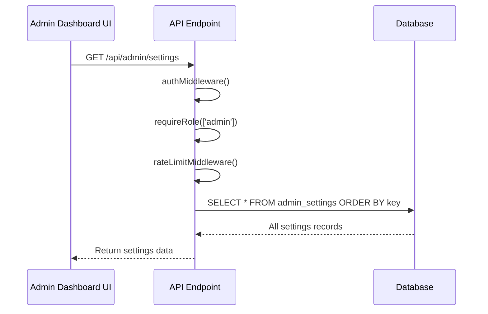
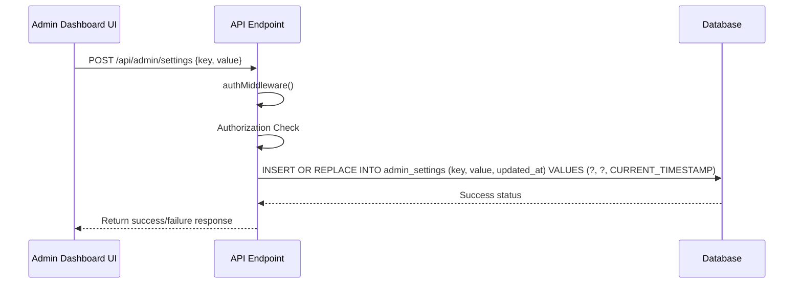
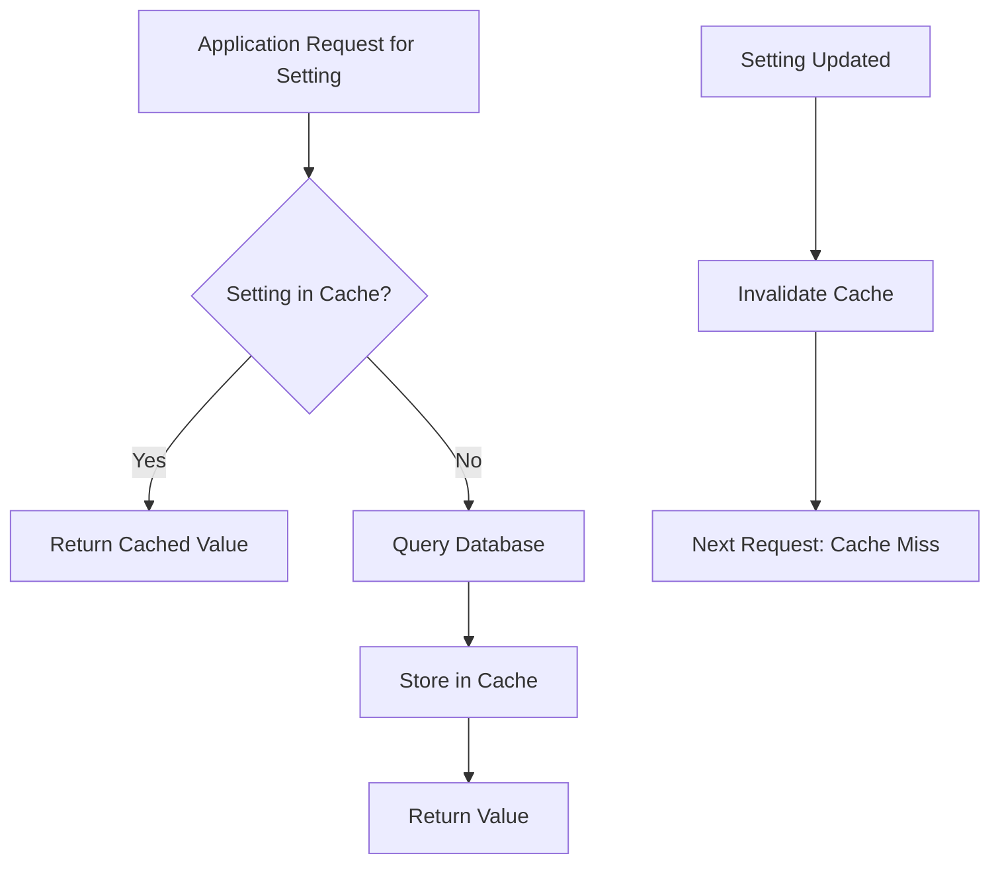

# Admin Settings Table Schema

<cite>
**Referenced Files in This Document**   
- [migrations/1.sql](file://migrations/1.sql#L150-L165)
- [src/shared/types.ts](file://src/shared/types.ts#L30-L38)
- [src/worker/index.ts](file://src/worker/index.ts#L916-L1021)
- [migrations/3.sql](file://migrations/3.sql#L29-L35)
</cite>

## Table of Contents
1. [Introduction](#introduction)
2. [Schema Definition](#schema-definition)
3. [Key-Value Configuration Structure](#key-value-configuration-structure)
4. [Configuration Types and Usage](#configuration-types-and-usage)
5. [Access Control and Security](#access-control-and-security)
6. [API Endpoints and Application Integration](#api-endpoints-and-application-integration)
7. [Caching Strategy](#caching-strategy)
8. [Audit and Maintenance](#audit-and-maintenance)

## Introduction
The admin_settings table provides a flexible key-value configuration system that enables dynamic platform configuration without requiring code deployment. This table serves as the central repository for application-wide settings that control various aspects of the HabibiStay platform, including business rules, feature flags, commission rates, and contact information. The design allows administrators to modify platform behavior in real-time through a dedicated admin interface.

**Section sources**
- [migrations/1.sql](file://migrations/1.sql#L150-L165)

## Schema Definition
The admin_settings table is defined with a comprehensive schema that supports flexible configuration management with proper metadata tracking:

```sql
CREATE TABLE admin_settings (
  id INTEGER PRIMARY KEY AUTOINCREMENT,
  key TEXT NOT NULL UNIQUE,
  value TEXT,
  category TEXT DEFAULT 'general',
  description TEXT,
  created_at DATETIME DEFAULT CURRENT_TIMESTAMP,
  updated_at DATETIME DEFAULT CURRENT_TIMESTAMP
);
```

The table structure includes the following fields:
- **id**: Primary key with auto-incrementing integer
- **key**: Unique text identifier for the setting (NOT NULL, UNIQUE constraint)
- **value**: Text field storing the setting value (nullable)
- **category**: Text field categorizing settings (defaults to 'general')
- **description**: Text field providing human-readable explanation of the setting
- **created_at**: Timestamp of record creation (defaults to current timestamp)
- **updated_at**: Timestamp of last modification (defaults to current timestamp, updated on changes)

This schema enables a flexible key-value store where any configuration parameter can be stored as a string value, with additional metadata for organization and documentation.

**Section sources**
- [migrations/1.sql](file://migrations/1.sql#L150-L165)

## Key-Value Configuration Structure
The admin_settings table implements a key-value store pattern that provides maximum flexibility for application configuration. This design choice enables several important capabilities:

- **Dynamic Configuration**: Settings can be modified at runtime without application restarts or code deployments
- **Schema Flexibility**: New settings can be added without database migrations by simply inserting new key-value pairs
- **Type Agnosticism**: All values are stored as TEXT, allowing storage of strings, numbers, JSON, or boolean values as strings
- **Easy Extensibility**: New configuration options can be introduced by application code that reads specific keys

The key field serves as the unique identifier for each setting, following a snake_case naming convention (e.g., "booking_commission", "site_maintenance"). The value field stores the setting's current value as text, which application code parses into appropriate data types (numbers, booleans, etc.) as needed.

This structure eliminates the need for dedicated columns for each configuration parameter, reducing schema complexity while increasing flexibility.

**Section sources**
- [migrations/1.sql](file://migrations/1.sql#L150-L165)
- [src/shared/types.ts](file://src/shared/types.ts#L30-L38)

## Configuration Types and Usage
The admin_settings table supports various types of configuration parameters that control different aspects of the platform. These settings are mapped to TypeScript interfaces in the application code and used to govern platform behavior.

### Platform Commission Settings
The booking_commission setting controls the percentage fee applied to bookings:
- **Key**: "booking_commission"
- **Value**: String representation of percentage (e.g., "10" for 10%)
- **Usage**: Applied during booking calculation to determine platform revenue
- **Example**: A value of "10" means a 10% commission on all bookings

```typescript
export const AdminSettingSchema = z.object({
  id: z.number(),
  key: z.string(),
  value: z.string().nullable(),
  created_at: z.string(),
  updated_at: z.string(),
});
```

### Booking Policies
Settings that control booking behavior and platform rules:
- **site_maintenance**: Boolean flag ("true"/"false") to enable maintenance mode
- **max_properties_per_owner**: Maximum number of properties a host can list
- **cancellation_policy**: Default cancellation policy for new listings

### Feature Flags
Boolean switches that enable or disable platform features:
- **booking_confirmation_enabled**: Controls whether booking confirmation emails are sent
- **ai_assistant_enabled**: Toggles the AI chatbot functionality
- **instant_book_enabled**: Allows properties to be booked without host approval

### Contact Information
Administrative contact details:
- **guest_support_email**: Email address for guest support inquiries
- **owner_support_email**: Email address for property owner support
- **investor_support_email**: Email address for investor relations

### AI Configuration
Settings related to the AI assistant "Sara":
- **openai_model**: Specifies the OpenAI model version to use
- **sara_personality**: Controls the tone of the AI assistant (friendly, professional, etc.)
- **featured_properties_count**: Number of properties to feature on the homepage

**Section sources**
- [src/shared/types.ts](file://src/shared/types.ts#L30-L38)
- [migrations/3.sql](file://migrations/3.sql#L29-L35)

## Access Control and Security
The admin_settings table implements role-based access control to ensure only authorized personnel can modify critical platform configurations.

### Authentication Requirements
Access to settings management requires authentication through the authMiddleware, which verifies user identity and session validity. The system checks for valid user credentials before allowing any read or write operations on settings.

### Authorization Rules
The application enforces authorization through email-based role checking:
- Users with "admin" in their email address have full access
- Users with "owner" in their email address have limited access
- Regular users (guests) cannot access settings endpoints

```typescript
if (!user || (!user.email.includes('admin') && !user.email.includes('owner'))) {
  return c.json<ApiResponse>({
    success: false,
    error: "Unauthorized",
  }, 403);
}
```

This approach provides a simple but effective access control mechanism, though in production it would be enhanced with proper role-based access control (RBAC) using dedicated role fields rather than email pattern matching.

### Security Considerations
- All setting modifications are logged with timestamps
- The updated_at field automatically records when settings are changed
- Rate limiting is applied to settings endpoints to prevent abuse
- Input validation should be implemented to prevent injection attacks

**Section sources**
- [src/worker/index.ts](file://src/worker/index.ts#L916-L925)

## API Endpoints and Application Integration
The admin_settings table is accessed through a set of REST API endpoints that provide CRUD operations for configuration management.

### GET /api/admin/settings
Retrieves all admin settings with authentication and rate limiting:
- Requires admin or owner privileges
- Rate-limited to 50 requests per 10 minutes
- Returns all settings ordered by key
- Used by the AdminDashboard to populate the settings interface



**Diagram sources**
- [src/worker/index.ts](file://src/worker/index.ts#L916-L935)

### GET /api/admin/settings/:key
Retrieves a specific setting by key:
- Public endpoint (no authentication required)
- Used by application components to retrieve specific configuration values
- Returns the complete setting record including metadata

### POST /api/admin/settings
Creates or updates a setting with the INSERT OR REPLACE semantic:
- Requires admin or owner privileges
- Uses INSERT OR REPLACE to upsert the setting
- Automatically updates the updated_at timestamp
- Returns success status and message



**Diagram sources**
- [src/worker/index.ts](file://src/worker/index.ts#L981-L1000)

**Section sources**
- [src/worker/index.ts](file://src/worker/index.ts#L916-L1021)

## Caching Strategy
Although explicit caching implementation is not present in the current codebase, the architecture suggests opportunities for performance optimization through caching.

### Current Behavior
- Settings are read directly from the database on each request
- No in-memory caching layer is implemented
- Each API call results in a database query

### Recommended Caching Implementation
A caching strategy should be implemented to improve performance:



**Diagram sources**
- [src/worker/index.ts](file://src/worker/index.ts#L981-L1021)

The recommended approach includes:
- Implementing an in-memory cache (e.g., Redis or in-process cache)
- Caching all settings on first access
- Setting appropriate TTL (Time to Live) for cache entries
- Invalidating cache when settings are updated
- Using the updated_at field to implement cache versioning

This would significantly reduce database load, especially for frequently accessed settings like feature flags and commission rates.

## Audit and Maintenance
The admin_settings table includes built-in audit capabilities through timestamp fields that track configuration changes.

### Audit Trail
- **created_at**: Records when a setting was first created
- **updated_at**: Automatically updated when a setting is modified
- These timestamps provide a basic audit trail for configuration changes

### Maintenance Operations
The database schema supports several maintenance operations:
- **Initial Setup**: Migration 1.sql creates the table structure
- **Sample Data**: Migration 3.sql inserts initial configuration values
- **Cleanup**: Down migrations remove settings with specific keys

Example initial settings from migration 3.sql:
```sql
INSERT INTO admin_settings (key, value) VALUES
('site_maintenance', 'false'),
('booking_commission', '10'),
('featured_property_fee', '500'),
('max_properties_per_owner', '20'),
('guest_support_email', 'support@habibistay.com'),
('owner_support_email', 'owners@habibistay.com'),
('investor_support_email', 'investors@habibistay.com');
```

### Best Practices for Management
- Document all settings with descriptive descriptions
- Use consistent naming conventions for keys
- Categorize settings appropriately
- Implement proper access controls
- Monitor setting changes through the updated_at field
- Consider adding a change log table for full audit capabilities

**Section sources**
- [migrations/1.sql](file://migrations/1.sql#L150-L165)
- [migrations/3.sql](file://migrations/3.sql#L29-L35)