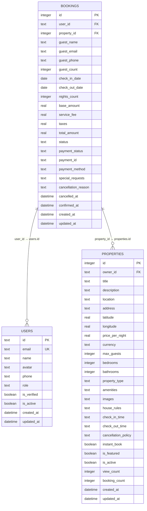
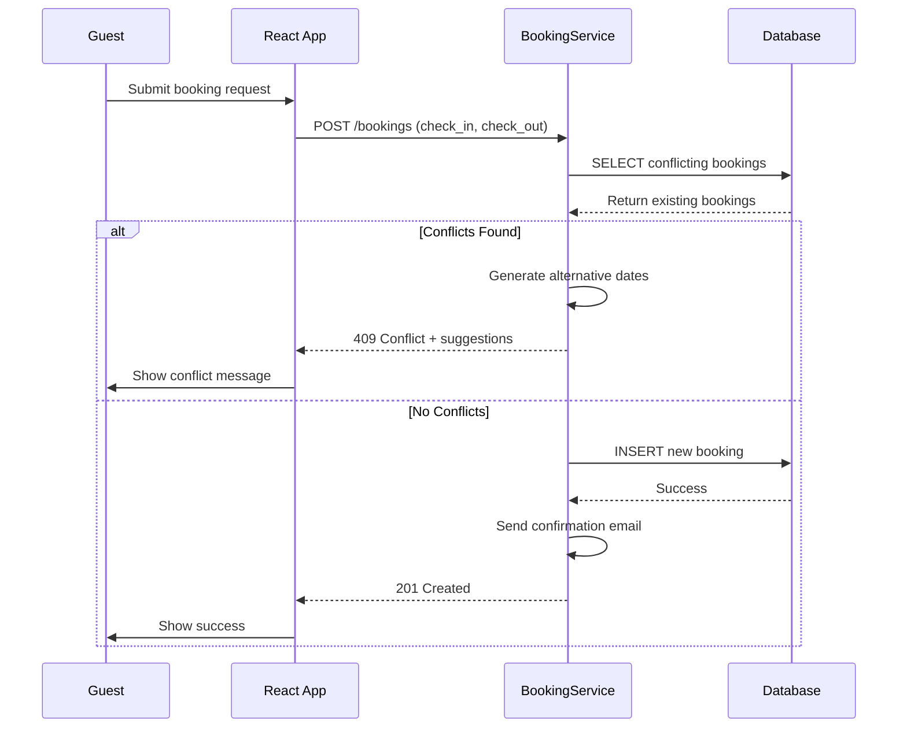

# Bookings Table Schema

<cite>
**Referenced Files in This Document**   
- [1.sql](file://migrations/1.sql#L46-L74)
- [types.ts](file://src/shared/types.ts#L34-L51)
- [BookingService.ts](file://src/server/services/BookingService.ts#L414-L456)
</cite>

## Table of Contents
1. [Bookings Table Schema](#bookings-table-schema)
2. [Field Definitions](#field-definitions)
3. [Referential Integrity and Foreign Keys](#referential-integrity-and-foreign-keys)
4. [Booking Status Lifecycle](#booking-status-lifecycle)
5. [Date Range Storage and Availability Checks](#date-range-storage-and-availability-checks)
6. [SQL Patterns for Overlapping Bookings](#sql-patterns-for-overlapping-bookings)
7. [Performance Considerations and Indexing](#performance-considerations-and-indexing)

## Field Definitions

The `bookings` table, defined in the `1.sql` migration file, captures reservation data for properties in the HabibiStay platform. Each field serves a specific purpose in managing the booking lifecycle.

**Field Details:**
- **id**: Primary key, auto-incrementing integer uniquely identifying each booking.
- **user_id**: Text field referencing the `id` in the `users` table, indicating the user who made the booking.
- **property_id**: Integer field referencing the `id` in the `properties` table, specifying the booked property.
- **guest_name**: Required text field storing the name of the guest.
- **guest_email**: Required text field storing the email address of the guest.
- **guest_phone**: Optional text field for the guest's phone number.
- **guest_count**: Integer field indicating the number of guests (renamed from `guests` in schema).
- **check_in_date**: Required DATE field specifying the check-in date.
- **check_out_date**: Required DATE field specifying the check-out date.
- **nights_count**: Integer field storing the calculated number of nights for the stay.
- **base_amount**: Real number representing the base cost before fees and taxes.
- **service_fee**: Real number with default 0, representing the service fee.
- **taxes**: Real number with default 0, representing applicable taxes.
- **total_amount**: Real number representing the final amount charged.
- **status**: Text field with default 'pending' and constrained to: 'pending', 'confirmed', 'cancelled', 'completed'.
- **payment_status**: Text field tracking payment progress: 'pending', 'processing', 'completed', 'failed', 'refunded'.
- **payment_id**: Optional text field storing the external payment gateway identifier.
- **payment_method**: Optional text field indicating the payment method used.
- **special_requests**: Optional text field for guest notes or requests.
- **cancellation_reason**: Optional text field capturing the reason for cancellation.
- **cancelled_at**: DATETIME field recording when the booking was cancelled.
- **confirmed_at**: DATETIME field recording when the booking was confirmed.
- **created_at**: DATETIME field with default `CURRENT_TIMESTAMP`, indicating creation time.
- **updated_at**: DATETIME field with default `CURRENT_TIMESTAMP`, indicating last update time.

**Section sources**
- [1.sql](file://migrations/1.sql#L46-L74)

## Referential Integrity and Foreign Keys

The `bookings` table maintains referential integrity through foreign key constraints that link to the `users` and `properties` tables. These constraints ensure that every booking references valid user and property records, preventing orphaned data.



**Diagram sources**
- [1.sql](file://migrations/1.sql#L46-L74)

**Section sources**
- [1.sql](file://migrations/1.sql#L46-L74)

## Booking Status Lifecycle

The `status` field in the `bookings` table is constrained to four valid values: `'pending'`, `'confirmed'`, `'cancelled'`, and `'completed'`. These values represent distinct stages in the booking lifecycle:

- **pending**: The booking has been created but not yet confirmed. Payment processing may still be underway.
- **confirmed**: The booking has been accepted and confirmed by the system or host. The property is reserved for the specified dates.
- **cancelled**: The booking was cancelled by the guest or host. The `cancelled_at` field records the cancellation timestamp.
- **completed**: The stay has been completed successfully. This status is typically set after the check-out date has passed.

This lifecycle ensures clear state management and enables appropriate business logic, such as sending confirmation emails upon confirmation or releasing inventory upon cancellation.

**Section sources**
- [1.sql](file://migrations/1.sql#L62)

## Date Range Storage and Availability Checks

The `check_in_date` and `check_out_date` fields are stored as DATE types, capturing the reservation period. These fields are critical for availability checks, which determine whether a property can be booked for a given date range.

When a new booking is requested, the system must verify that no existing confirmed or pending bookings overlap with the requested dates. This prevents double bookings and ensures accurate inventory management.

The `BookingService.ts` file implements the `checkAvailability` method, which queries the database to detect overlapping bookings. The logic accounts for partial overlaps where the requested dates intersect with existing bookings at any point.

**Section sources**
- [BookingService.ts](file://src/server/services/BookingService.ts#L414-L456)

## SQL Patterns for Overlapping Bookings

To detect overlapping bookings, the system uses a SQL query with a date range overlap condition. The pattern checks for any existing bookings where:

1. The requested check-in date falls within an existing booking period.
2. The requested check-out date falls within an existing booking period.
3. The requested period completely encompasses an existing booking.

```sql
SELECT * FROM bookings 
WHERE property_id = ? 
AND status IN ('confirmed', 'pending')
AND (
  (check_in_date <= ? AND check_out_date > ?) OR
  (check_in_date < ? AND check_out_date >= ?) OR
  (check_in_date >= ? AND check_out_date <= ?)
);
```

In this query:
- The first condition checks if the requested check-in date is during an existing stay.
- The second condition checks if the requested check-out date is during an existing stay.
- The third condition checks if the requested stay completely overlaps with an existing booking.

This comprehensive pattern ensures that all possible overlap scenarios are detected, maintaining data integrity and preventing double bookings.



**Diagram sources**
- [BookingService.ts](file://src/server/services/BookingService.ts#L414-L456)

**Section sources**
- [BookingService.ts](file://src/server/services/BookingService.ts#L414-L456)

## Performance Considerations and Indexing

High-frequency availability lookups require optimized database performance. While the initial migration (`1.sql`) does not explicitly create indexes on the `bookings` table, optimal performance for availability checks would benefit from strategic indexing.

Recommended indexes include:
- **Index on property_id**: Accelerates lookups for a specific property's bookings.
- **Composite index on (property_id, check_in_date, check_out_date)**: Optimizes date range queries for availability checks.
- **Index on status**: Speeds up filtering by booking status (e.g., 'confirmed', 'pending').

Although no explicit index creation statements for the `bookings` table were found in the migration files, adding such indexes in a future migration would significantly improve query performance for availability checks, especially as the dataset grows.

The absence of defined indexes suggests that performance optimization may be addressed in later migrations or through database tuning outside the version-controlled schema.

**Section sources**
- [1.sql](file://migrations/1.sql#L46-L74)
- [BookingService.ts](file://src/server/services/BookingService.ts#L414-L456)