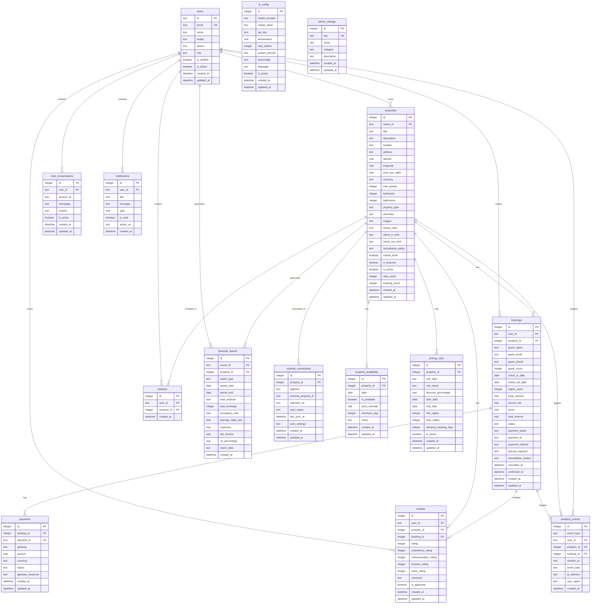
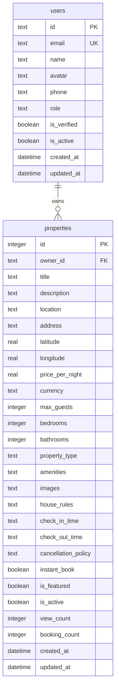
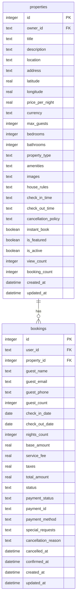
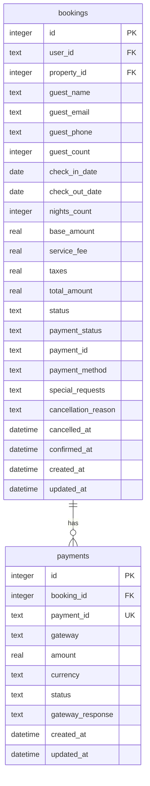
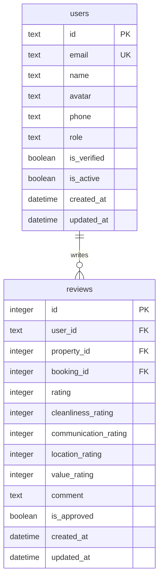

# Database Schema Overview

<cite>
**Referenced Files in This Document**   
- [1.sql](file://migrations/1.sql)
- [2.sql](file://migrations/2.sql)
- [3.sql](file://migrations/3.sql)
- [4.sql](file://migrations/4.sql)
- [5.sql](file://migrations/5.sql)
- [6.sql](file://migrations/6.sql)
- [7.sql](file://migrations/7.sql)
- [8.sql](file://migrations/8.sql)
- [9.sql](file://migrations/9.sql)
- [types.ts](file://src/shared/types.ts)
</cite>

## Table of Contents
1. [Database Schema Overview](#database-schema-overview)
2. [Schema Evolution Analysis](#schema-evolution-analysis)
3. [Core Entity Relationships](#core-entity-relationships)
4. [TypeScript Interface Mapping](#typescript-interface-mapping)
5. [Naming Conventions and Design Patterns](#naming-conventions-and-design-patterns)
6. [Performance and Scalability Considerations](#performance-and-scalability-considerations)

## Schema Evolution Analysis

The HabibiStay database schema has evolved through nine incremental migration scripts, each introducing new features and enhancing existing functionality. The schema progression follows a logical development path from core booking functionality to advanced features like AI integration, dynamic pricing, and comprehensive security.

### Migration 1: Core Entities and Basic Functionality
Migration 1 establishes the foundational schema with core entities for a property booking platform:



**Diagram sources**
- [1.sql](file://migrations/1.sql#L1-L260)

**Section sources**
- [1.sql](file://migrations/1.sql#L1-L260)

This initial migration establishes the core entities with comprehensive feature support:
- **Users table**: Implements role-based access control with guest, host, and admin roles
- **Properties table**: Includes rich metadata for property listings with JSON fields for amenities and images
- **Bookings table**: Captures complete booking lifecycle with status tracking and financial breakdown
- **Payments table**: Supports multiple payment gateways (MyFatoorah, PayPal, Stripe)
- **Reviews table**: Implements detailed rating system with category-specific ratings
- **AI Configuration**: Dedicated table for AI assistant settings, reflecting the platform's AI-first approach

### Migration 2: Seed Data for Core Entities
Migration 2 introduces seed data for demonstration and testing purposes:

```sql
INSERT INTO properties (owner_id, title, description, location, price_per_night, max_guests, bedrooms, bathrooms, amenities, images, is_featured, is_active) VALUES
('admin', 'Luxury Downtown Apartment', 'Experience the heart of Riyadh in this stunning modern apartment with panoramic city views. Perfect for business travelers and luxury seekers.', 'King Fahd District, Riyadh', 850, 4, 2, 2, '["WiFi", "Air Conditioning", "Kitchen", "Parking", "TV", "Gym"]', '["https://images.unsplash.com/photo-1564013799919-ab600027ffc6?auto=format&fit=crop&w=800&h=600", "https://images.unsplash.com/photo-1560448204-e1a3ecbdd6cc?auto=format&fit=crop&w=800&h=600"]', 1, 1),
('admin', 'Executive Suite with Pool', 'Elegant executive suite featuring a private pool, premium amenities, and concierge service. Ideal for extended stays and important meetings.', 'Al-Malaz District, Riyadh', 1200, 6, 3, 3, '["WiFi", "Pool", "Kitchen", "Parking", "TV", "Gym", "Air Conditioning"]', '["https://images.unsplash.com/photo-1571896349842-33c89424de2d?auto=format&fit=crop&w=800&h=600", "https://images.unsplash.com/photo-1566073771259-6a8506099945?auto=format&fit=crop&w=800&h=600"]', 1, 1),
('admin', 'Modern Family Villa', 'Spacious family villa in a quiet residential area with garden, multiple bedrooms, and traditional Saudi hospitality touches.', 'Al-Nakheel District, Riyadh', 950, 8, 4, 3, '["WiFi", "Kitchen", "Parking", "TV", "Air Conditioning", "Garden"]', '["https://images.unsplash.com/photo-1602941525421-8f8b81d3edbb?auto=format&fit=crop&w=800&h=600"]', 0, 1),
('admin', 'Business Traveler Studio', 'Compact yet comfortable studio perfect for business travelers. Located near major business districts with excellent connectivity.', 'Olaya District, Riyadh', 450, 2, 1, 1, '["WiFi", "Air Conditioning", "Kitchen", "TV", "Parking"]', '["https://images.unsplash.com/photo-1522708323590-d24dbb6b0267?auto=format&fit=crop&w=800&h=600"]', 0, 1);

INSERT INTO admin_settings (key, value) VALUES
('openai_model', 'gpt-4o-mini'),
('sara_personality', 'friendly_professional'),
('featured_properties_count', '2'),
('booking_confirmation_enabled', 'true');
```

**Section sources**
- [2.sql](file://migrations/2.sql#L1-L12)

This migration populates the database with sample properties and admin settings, establishing initial configuration for the AI assistant (Sara) and platform behavior.

### Migration 3: Comprehensive Seed Data and Sample Transactions
Migration 3 expands the seed data with more realistic scenarios:

```sql
-- Insert sample properties for HabibiStay
INSERT INTO properties (owner_id, title, description, location, price_per_night, max_guests, bedrooms, bathrooms, amenities, images, is_featured, is_active) VALUES
('owner1', 'Luxury Executive Suite in Olaya District', 'Modern luxury apartment in the heart of Riyadh''s business district. Perfect for executives and business travelers. Features panoramic city views, high-speed WiFi, and premium amenities.', 'Olaya District, Riyadh', 850, 4, 2, 2, '["WiFi", "Air Conditioning", "Kitchen", "Parking", "TV", "Gym", "Pool", "Concierge"]', '["https://images.unsplash.com/photo-1564013799919-ab600027ffc6?auto=format&fit=crop&w=800&h=600", "https://images.unsplash.com/photo-1560448204-e1a3ecbdd6cc?auto=format&fit=crop&w=800&h=600", "https://images.unsplash.com/photo-1571896349842-33c89424de2d?auto=format&fit=crop&w=800&h=600"]', 1, 1),

('owner2', 'Traditional Najdi Villa with Modern Amenities', 'Authentic Saudi experience in a beautifully restored traditional villa. Combines heritage architecture with modern comfort. Perfect for families and cultural enthusiasts.', 'Al-Diriyah, Riyadh', 1200, 8, 4, 3, '["WiFi", "Air Conditioning", "Kitchen", "Parking", "TV", "Traditional Decor", "Garden", "BBQ Area"]', '["https://images.unsplash.com/photo-1600880292203-757bb62b4baf?auto=format&fit=crop&w=800&h=600", "https://images.unsplash.com/photo-1590725175947-49d8c5c4bd8e?auto=format&fit=crop&w=800&h=600", "https://images.unsplash.com/photo-1449824913935-59a10b8d2000?auto=format&fit=crop&w=800&h=600"]', 1, 1),

('owner3', 'Premium Penthouse in King Fahd District', 'Stunning penthouse with breathtaking views of Riyadh skyline. Features luxury finishes, private terrace, and access to building amenities including spa and fitness center.', 'King Fahd District, Riyadh', 1500, 6, 3, 3, '["WiFi", "Air Conditioning", "Kitchen", "Parking", "TV", "Terrace", "Spa Access", "Fitness Center", "Doorman"]', '["https://images.unsplash.com/photo-1600566753190-17f0baa2a6c3?auto=format&fit=crop&w=800&h=600", "https://images.unsplash.com/photo-1600607687939-ce8a6c25118c?auto=format&fit=crop&w=800&h=600", "https://images.unsplash.com/photo-1600566753086-00f18fb6b3ea?auto=format&fit=crop&w=800&h=600"]', 0, 1),

('owner4', 'Cozy Studio Near King Saud University', 'Perfect for students and young professionals. Modern studio apartment with all essentials. Walking distance to KSU campus and public transportation.', 'Al-Malaz, Riyadh', 350, 2, 1, 1, '["WiFi", "Air Conditioning", "Kitchenette", "Study Desk", "TV", "Laundry"]', '["https://images.unsplash.com/photo-1522708323590-d24dbb6b0267?auto=format&fit=crop&w=800&h=600", "https://images.unsplash.com/photo-1586023492125-27b2c045efd7?auto=format&fit=crop&w=800&h=600"]', 0, 1),

('owner5', 'Family Compound in Diplomatic Quarter', 'Spacious family residence in the prestigious Diplomatic Quarter. Ideal for diplomats, executives, and large families. Features multiple bedrooms, garden, and security.', 'Diplomatic Quarter, Riyadh', 2000, 10, 5, 4, '["WiFi", "Air Conditioning", "Kitchen", "Parking", "TV", "Garden", "Security", "Maid Room", "Driver Room"]', '["https://images.unsplash.com/photo-1600585154340-be6161a56a0c?auto=format&fit=crop&w=800&h=600", "https://images.unsplash.com/photo-1600566752355-35792bedcfea?auto=format&fit=crop&w=800&h=600", "https://images.unsplash.com/photo-1600573472550-8090b5e0745e?auto=format&fit=crop&w=800&h=600"]', 0, 1),

('owner6', 'Modern Apartment in Al-Nakheel District', 'Contemporary 2-bedroom apartment perfect for business travelers and couples. Features modern amenities and easy access to major business centers and shopping malls.', 'Al-Nakheel, Riyadh', 650, 4, 2, 2, '["WiFi", "Air Conditioning", "Kitchen", "Parking", "TV", "Balcony", "Shopping Nearby"]', '["https://images.unsplash.com/photo-1560448075-bb485b067938?auto=format&fit=crop&w=800&h=600", "https://images.unsplash.com/photo-1567767292278-a4f21aa2d36e?auto=format&fit=crop&w=800&h=600"]', 0, 1);

-- Insert sample bookings
INSERT INTO bookings (user_id, property_id, guest_name, guest_email, guest_phone, check_in_date, check_out_date, nights_count, guest_count, base_amount, service_fee, taxes, total_amount, status, payment_status) VALUES
('guest1', 1, 'Ahmed Al-Hassan', 'ahmed.hassan@email.com', '+966501234567', '2024-12-28', '2024-12-31', 3, 2, 2550, 127, 382, 3059, 'confirmed', 'completed'),
('guest2', 2, 'Sarah Mitchell', 'sarah.mitchell@email.com', '+44987654321', '2025-01-05', '2025-01-10', 5, 6, 6000, 300, 900, 7200, 'confirmed', 'completed'),
('guest3', 1, 'Mohammad Al-Rashid', 'mohammad.rashid@email.com', '+966555123456', '2025-01-15', '2025-01-18', 3, 4, 2550, 127, 382, 3059, 'pending', 'pending');

-- Insert sample reviews
INSERT INTO reviews (user_id, property_id, booking_id, rating, comment) VALUES
('guest1', 1, 1, 5, 'Absolutely exceptional stay! The property exceeded all expectations. Perfect location, immaculate cleanliness, and Sara was incredibly helpful throughout the booking process.'),
('guest2', 2, 2, 5, 'A truly authentic Saudi experience in a beautiful traditional setting. The villa was stunning and the host was very accommodating. Highly recommend for families.'),
('guest4', 1, NULL, 4, 'Great property in excellent location. Modern amenities and professional service. Would definitely stay again on my next business trip to Riyadh.');

-- Insert admin settings
INSERT INTO admin_settings (key, value) VALUES
('site_maintenance', 'false'),
('booking_commission', '10'),
('featured_property_fee', '500'),
('max_properties_per_owner', '20'),
('guest_support_email', 'support@habibistay.com'),
('owner_support_email', 'owners@habibistay.com'),
('investor_support_email', 'investors@habibistay.com');
```

**Section sources**
- [3.sql](file://migrations/3.sql#L1-L36)

This migration adds comprehensive seed data including multiple property owners, sample bookings with realistic pricing calculations, and authentic review content that demonstrates the platform's focus on the Saudi market.

### Migration 4: User Profiles and Enhanced Payments
Migration 4 introduces user profiles and refines the payments system:

```sql
CREATE TABLE user_profiles (
  id INTEGER PRIMARY KEY AUTOINCREMENT,
  user_id TEXT NOT NULL UNIQUE,
  full_name TEXT,
  phone TEXT,
  address TEXT,
  city TEXT,
  country TEXT DEFAULT 'Saudi Arabia',
  date_of_birth DATE,
  preferred_language TEXT DEFAULT 'en',
  currency TEXT DEFAULT 'SAR',
  bio TEXT,
  avatar_url TEXT,
  created_at DATETIME DEFAULT CURRENT_TIMESTAMP,
  updated_at DATETIME DEFAULT CURRENT_TIMESTAMP
);

CREATE TABLE notification_settings (
  id INTEGER PRIMARY KEY AUTOINCREMENT,
  user_id TEXT NOT NULL UNIQUE,
  email_booking_updates BOOLEAN DEFAULT 1,
  email_marketing BOOLEAN DEFAULT 0,
  sms_booking_updates BOOLEAN DEFAULT 1,
  push_notifications BOOLEAN DEFAULT 1,
  created_at DATETIME DEFAULT CURRENT_TIMESTAMP,
  updated_at DATETIME DEFAULT CURRENT_TIMESTAMP
);

CREATE TABLE payments (
  id INTEGER PRIMARY KEY AUTOINCREMENT,
  booking_id INTEGER NOT NULL,
  payment_provider TEXT DEFAULT 'myfatoorah',
  payment_id TEXT,
  invoice_id TEXT,
  amount REAL NOT NULL,
  currency TEXT DEFAULT 'SAR',
  status TEXT DEFAULT 'pending',
  payment_method TEXT,
  transaction_id TEXT,
  payment_url TEXT,
  metadata TEXT,
  created_at DATETIME DEFAULT CURRENT_TIMESTAMP,
  updated_at DATETIME DEFAULT CURRENT_TIMESTAMP
);
```

**Section sources**
- [4.sql](file://migrations/4.sql#L1-L45)

This migration enhances user management by separating profile information from authentication data and introduces more comprehensive payment tracking with additional fields for transaction details.

### Migration 5: Email System and Property Analytics
Migration 5 implements a robust email system and property analytics:

```sql
CREATE TABLE email_templates (
  id INTEGER PRIMARY KEY AUTOINCREMENT,
  template_key TEXT NOT NULL UNIQUE,
  subject TEXT NOT NULL,
  html_content TEXT NOT NULL,
  variables TEXT,
  is_active BOOLEAN DEFAULT 1,
  created_at DATETIME DEFAULT CURRENT_TIMESTAMP,
  updated_at DATETIME DEFAULT CURRENT_TIMESTAMP
);

CREATE TABLE email_logs (
  id INTEGER PRIMARY KEY AUTOINCREMENT,
  recipient_email TEXT NOT NULL,
  template_key TEXT,
  subject TEXT,
  status TEXT DEFAULT 'pending',
  error_message TEXT,
  sent_at DATETIME,
  created_at DATETIME DEFAULT CURRENT_TIMESTAMP
);

CREATE TABLE property_analytics (
  id INTEGER PRIMARY KEY AUTOINCREMENT,
  property_id INTEGER NOT NULL,
  views INTEGER DEFAULT 0,
  inquiries INTEGER DEFAULT 0,
  bookings INTEGER DEFAULT 0,
  revenue REAL DEFAULT 0,
  avg_rating REAL DEFAULT 0,
  review_count INTEGER DEFAULT 0,
  occupancy_rate REAL DEFAULT 0,
  date DATE NOT NULL,
  created_at DATETIME DEFAULT CURRENT_TIMESTAMP,
  updated_at DATETIME DEFAULT CURRENT_TIMESTAMP
);
```

**Section sources**
- [5.sql](file://migrations/5.sql#L1-L37)

This migration adds critical marketing and analytics capabilities, enabling personalized email communication and detailed performance tracking for property owners.

### Migration 6: Email Template Content
Migration 6 populates the email system with professional templates:

```sql
-- Insert default email templates
INSERT OR REPLACE INTO email_templates (template_key, subject, html_content, variables, is_active) VALUES
(
  'booking_confirmation',
  'Booking Confirmation - HabibiStay',
  '<!DOCTYPE html>
<html>
  <head>
    <meta charset="utf-8">
    <title>Booking Confirmation</title>
    <style>
      body { font-family: Arial, sans-serif; margin: 0; padding: 20px; background-color: #f5f5f5; }
      .container { max-width: 600px; margin: 0 auto; background-color: white; padding: 30px; border-radius: 10px; }
      .header { text-align: center; margin-bottom: 30px; }
      .logo { color: #2957c3; font-size: 24px; font-weight: bold; }
      .content { line-height: 1.6; }
      .booking-details { background-color: #f8f9fa; padding: 20px; border-radius: 8px; margin: 20px 0; }
      .btn { display: inline-block; background-color: #2957c3; color: white; padding: 12px 24px; text-decoration: none; border-radius: 6px; margin: 20px 0; }
    </style>
  </head>
  <body>
    <div class="container">
      <div class="header">
        <div class="logo">HabibiStay</div>
        <h1>Booking Confirmation</h1>
      </div>
      <div class="content">
        <p>Dear {{ guest_name }},</p>
        <p>Thank you for your booking! We''re excited to host you at {{ property_title }}.</p>
        
        <div class="booking-details">
          <h3>Booking Details</h3>
          <p><strong>Property:</strong> {{ property_title }}</p>
          <p><strong>Location:</strong> {{ property_location }}</p>
          <p><strong>Check-in:</strong> {{ check_in_date }}</p>
          <p><strong>Check-out:</strong> {{ check_out_date }}</p>
          <p><strong>Guests:</strong> {{ total_guests }}</p>
          <p><strong>Total Amount:</strong> {{ total_amount }} SAR</p>
          <p><strong>Booking Reference:</strong> {{ booking_id }}</p>
        </div>
        
        <p>We look forward to welcoming you to Riyadh!</p>
        
        <a href="{{ property_url }}" class="btn">View Property Details</a>
        
        <p>Best regards,<br>The HabibiStay Team</p>
      </div>
    </div>
  </body>
</html>',
  '["guest_name", "property_title", "property_location", "check_in_date", "check_out_date", "total_guests", "total_amount", "booking_id", "property_url"]',
  1
),
(
  'payment_success',
  'Payment Successful - HabibiStay',
  '<!DOCTYPE html>
<html>
  <head>
    <meta charset="utf-8">
    <title>Payment Successful</title>
    <style>
      body { font-family: Arial, sans-serif; margin: 0; padding: 20px; background-color: #f5f5f5; }
      .container { max-width: 600px; margin: 0 auto; background-color: white; padding: 30px; border-radius: 10px; }
      .header { text-align: center; margin-bottom: 30px; }
      .logo { color: #2957c3; font-size: 24px; font-weight: bold; }
      .success { color: #28a745; text-align: center; font-size: 48px; margin: 20px 0; }
      .content { line-height: 1.6; }
      .payment-details { background-color: #f8f9fa; padding: 20px; border-radius: 8px; margin: 20px 0; }
    </style>
  </head>
  <body>
    <div class="container">
      <div class="header">
        <div class="logo">HabibiStay</div>
        <div class="success">✓</div>
        <h1>Payment Successful</h1>
      </div>
      <div class="content">
        <p>Dear {{ guest_name }},</p>
        <p>Your payment has been successfully processed. Your booking is now confirmed!</p>
        
        <div class="payment-details">
          <h3>Payment Details</h3>
          <p><strong>Amount Paid:</strong> {{ amount }} SAR</p>
          <p><strong>Transaction ID:</strong> {{ transaction_id }}</p>
          <p><strong>Payment Method:</strong> {{ payment_method }}</p>
          <p><strong>Date:</strong> {{ payment_date }}</p>
        </div>
        
        <p>You will receive a separate email with your booking confirmation details.</p>
        
        <p>Thank you for choosing HabibiStay!</p>
        
        <p>Best regards,<br>The HabibiStay Team</p>
      </div>
    </div>
  </body>
</html>',
  '["guest_name", "amount", "transaction_id", "payment_method", "payment_date"]',
  1
),
(
  'welcome',
  'Welcome to HabibiStay',
  '<!DOCTYPE html>
<html>
  <head>
    <meta charset="utf-8">
    <title>Welcome to HabibiStay</title>
    <style>
      body { font-family: Arial, sans-serif; margin: 0; padding: 20px; background-color: #f5f5f5; }
      .container { max-width: 600px; margin: 0 auto; background-color: white; padding: 30px; border-radius: 10px; }
      .header { text-align: center; margin-bottom: 30px; }
      .logo { color: #2957c3; font-size: 24px; font-weight: bold; }
      .content { line-height: 1.6; }
      .btn { display: inline-block; background-color: #2957c3; color: white; padding: 12px 24px; text-decoration: none; border-radius: 6px; margin: 20px 0; }
      .features { display: grid; grid-template-columns: 1fr 1fr; gap: 20px; margin: 30px 0; }
      .feature { text-align: center; padding: 20px; background-color: #f8f9fa; border-radius: 8px; }
    </style>
  </head>
  <body>
    <div class="container">
      <div class="header">
        <div class="logo">HabibiStay</div>
        <h1>Welcome to HabibiStay!</h1>
      </div>
      <div class="content">
        <p>Dear {{ user_name }},</p>
        <p>Welcome to HabibiStay, your gateway to exceptional accommodations in Riyadh! We''re thrilled to have you join our community.</p>
        
        <div class="features">
          <div class="feature">
            <h3>🏠 Premium Properties</h3>
            <p>Discover handpicked accommodations in the best locations</p>
          </div>
          <div class="feature">
            <h3>🤖 AI Assistant Sara</h3>
            <p>Get personalized help with bookings and recommendations</p>
          </div>
          <div class="feature">
            <h3>💰 Earn Income</h3>
            <p>List your property and start earning with us</p>
          </div>
          <div class="feature">
            <h3>📱 Easy Booking</h3>
            <p>Simple and secure booking process</p>
          </div>
        </div>
        
        <p>Ready to explore? Start by browsing our curated collection of properties or list your own to begin earning.</p>
        
        <a href="{{ dashboard_url }}" class="btn">Go to Dashboard</a>
        
        <p>If you have any questions, our AI assistant Sara is always here to help!</p>
        
        <p>Best regards,<br>The HabibiStay Team</p>
      </div>
    </div>
  </body>
</html>',
  '["user_name", "dashboard_url"]',
  1
);
```

**Section sources**
- [6.sql](file://migrations/6.sql#L1-L163)

This migration implements professional email templates for key user journeys, enhancing the platform's communication capabilities and brand presence.

### Migration 7: Contact and Newsletter Systems
Migration 7 adds contact management and newsletter functionality:

```sql
-- Create contact submissions table
CREATE TABLE contact_submissions (
  id INTEGER PRIMARY KEY AUTOINCREMENT,
  name TEXT NOT NULL,
  email TEXT NOT NULL,
  phone TEXT,
  interest TEXT NOT NULL,
  message TEXT NOT NULL,
  status TEXT DEFAULT 'new',
  created_at DATETIME DEFAULT CURRENT_TIMESTAMP,
  updated_at DATETIME DEFAULT CURRENT_TIMESTAMP
);

-- Create newsletter subscriptions table
CREATE TABLE newsletter_subscriptions (
  id INTEGER PRIMARY KEY AUTOINCREMENT,
  email TEXT NOT NULL UNIQUE,
  source TEXT DEFAULT 'website',
  is_active BOOLEAN DEFAULT 1,
  subscribed_at DATETIME DEFAULT CURRENT_TIMESTAMP,
  unsubscribed_at DATETIME,
  created_at DATETIME DEFAULT CURRENT_TIMESTAMP,
  updated_at DATETIME DEFAULT CURRENT_TIMESTAMP
);

-- Add additional email templates
INSERT OR REPLACE INTO email_templates (template_key, subject, html_content, variables, is_active) VALUES
(
  'contact_form_submission',
  'New Contact Form Submission - HabibiStay',
  '<!DOCTYPE html>
<html>
  <head>
    <meta charset="utf-8">
    <title>Contact Form Submission</title>
    <style>
      body { font-family: Arial, sans-serif; margin: 0; padding: 20px; background-color: #f5f5f5; }
      .container { max-width: 600px; margin: 0 auto; background-color: white; padding: 30px; border-radius: 10px; }
      .header { text-align: center; margin-bottom: 30px; }
      .logo { color: #2957c3; font-size: 24px; font-weight: bold; }
      .content { line-height: 1.6; }
      .submission-details { background-color: #f8f9fa; padding: 20px; border-radius: 8px; margin: 20px 0; }
    </style>
  </head>
  <body>
    <div class="container">
      <div class="header">
        <div class="logo">HabibiStay</div>
        <h1>New Contact Form Submission</h1>
      </div>
      <div class="content">
        <p>A new contact form has been submitted on the HabibiStay website.</p>
        
        <div class="submission-details">
          <h3>Contact Details</h3>
          <p><strong>Name:</strong> {{ name }}</p>
          <p><strong>Email:</strong> {{ email }}</p>
          <p><strong>Phone:</strong> {{ phone }}</p>
          <p><strong>Interest:</strong> {{ interest }}</p>
          <p><strong>Submitted At:</strong> {{ submitted_at }}</p>
        </div>
        
        <div class="submission-details">
          <h3>Message</h3>
          <p>{{ message }}</p>
        </div>
        
        <p>Please respond to this inquiry promptly.</p>
      </div>
    </div>
  </body>
</html>',
  '["name", "email", "phone", "interest", "message", "submitted_at"]',
  1
),
(
  'contact_form_confirmation',
  'Thank you for contacting HabibiStay',
  '<!DOCTYPE html>
<html>
  <head>
    <meta charset="utf-8">
    <title>Contact Confirmation</title>
    <style>
      body { font-family: Arial, sans-serif; margin: 0; padding: 20px; background-color: #f5f5f5; }
      .container { max-width: 600px; margin: 0 auto; background-color: white; padding: 30px; border-radius: 10px; }
      .header { text-align: center; margin-bottom: 30px; }
      .logo { color: #2957c3; font-size: 24px; font-weight: bold; }
      .content { line-height: 1.6; }
    </style>
  </head>
  <body>
    <div class="container">
      <div class="header">
        <div class="logo">HabibiStay</div>
        <h1>Thank You for Contacting Us</h1>
      </div>
      <div class="content">
        <p>Dear {{ name }},</p>
        <p>Thank you for reaching out to HabibiStay regarding <strong>{{ interest }}</strong>.</p>
        
        <p>We have received your message and our team will review it shortly. You can expect to hear back from us within 24 hours.</p>
        
        <p>In the meantime, feel free to explore our platform or chat with Sara, our AI assistant, for immediate assistance.</p>
        
        <p>Best regards,<br>The HabibiStay Team</p>
      </div>
    </div>
  </body>
</html>',
  '["name", "interest"]',
  1
),
(
  'newsletter_welcome',
  'Welcome to HabibiStay Newsletter',
  '<!DOCTYPE html>
<html>
  <head>
    <meta charset="utf-8">
    <title>Newsletter Welcome</title>
    <style>
      body { font-family: Arial, sans-serif; margin: 0; padding: 20px; background-color: #f5f5f5; }
      .container { max-width: 600px; margin: 0 auto; background-color: white; padding: 30px; border-radius: 10px; }
      .header { text-align: center; margin-bottom: 30px; }
      .logo { color: #2957c3; font-size: 24px; font-weight: bold; }
      .content { line-height: 1.6; }
      .btn { display: inline-block; background-color: #2957c3; color: white; padding: 12px 24px; text-decoration: none; border-radius: 6px; margin: 20px 0; }
    </style>
  </head>
  <body>
    <div class="container">
      <div class="header">
        <div class="logo">HabibiStay</div>
        <h1>Welcome to Our Newsletter!</h1>
      </div>
      <div class="content">
        <p>Thank you for subscribing to the HabibiStay newsletter!</p>
        
        <p>You''ll now receive:</p>
        <ul>
          <li>Market insights and trends</li>
          <li>New property listings</li>
          <li>Investment opportunities</li>
          <li>Exclusive offers and promotions</li>
          <li>Saudi real estate news</li>
        </ul>
        
        <p>Stay connected with the future of Saudi hospitality and real estate.</p>
        
        <p>Best regards,<br>The HabibiStay Team</p>
        
        <p style="font-size: 12px; color: #666; margin-top: 30px;">
          You can <a href="{{ unsubscribe_url }}">unsubscribe</a> at any time.
        </p>
      </div>
    </div>
  </body>
</html>',
  '["email", "unsubscribe_url"]',
  1
);
```

**Section sources**
- [7.sql](file://migrations/7.sql#L1-L161)

This migration extends the platform's marketing and customer service capabilities with contact management and newsletter subscription features.

### Migration 8: Dynamic Pricing System
Migration 8 introduces a sophisticated dynamic pricing system:

```sql
-- Migration 8: Add dynamic pricing tables

-- Property pricing settings
CREATE TABLE IF NOT EXISTS property_pricing_settings (
    property_id INTEGER PRIMARY KEY,
    base_price DECIMAL(10,2) NOT NULL DEFAULT 100.00,
    currency VARCHAR(3) NOT NULL DEFAULT 'SAR',
    minimum_price DECIMAL(10,2) NOT NULL DEFAULT 50.00,
    maximum_price DECIMAL(10,2) NOT NULL DEFAULT 1000.00,
    auto_pricing_enabled BOOLEAN NOT NULL DEFAULT 0,
    update_frequency VARCHAR(10) NOT NULL DEFAULT 'daily',
    early_bird_discount TEXT, -- JSON
    last_minute_discount TEXT, -- JSON
    weekly_discount TEXT, -- JSON
    monthly_discount TEXT, -- JSON
    aggressiveness VARCHAR(20) NOT NULL DEFAULT 'moderate',
    competitor_matching BOOLEAN NOT NULL DEFAULT 0,
    seasonal_adjustment BOOLEAN NOT NULL DEFAULT 1,
    demand_adjustment BOOLEAN NOT NULL DEFAULT 1,
    created_at DATETIME NOT NULL DEFAULT CURRENT_TIMESTAMP,
    updated_at DATETIME NOT NULL DEFAULT CURRENT_TIMESTAMP,
    FOREIGN KEY (property_id) REFERENCES properties(id) ON DELETE CASCADE
);

-- Pricing rules
CREATE TABLE IF NOT EXISTS pricing_rules (
    id INTEGER PRIMARY KEY AUTOINCREMENT,
    property_id INTEGER NOT NULL,
    rule_type VARCHAR(50) NOT NULL, -- seasonal, occupancy, advance_booking, etc.
    rule_name VARCHAR(255) NOT NULL,
    is_active BOOLEAN NOT NULL DEFAULT 1,
    priority INTEGER NOT NULL DEFAULT 1,
    conditions TEXT NOT NULL, -- JSON
    adjustment TEXT NOT NULL, -- JSON
    date_range_start DATE,
    date_range_end DATE,
    created_at DATETIME NOT NULL DEFAULT CURRENT_TIMESTAMP,
    updated_at DATETIME NOT NULL DEFAULT CURRENT_TIMESTAMP,
    FOREIGN KEY (property_id) REFERENCES properties(id) ON DELETE CASCADE
);

-- Market data for pricing decisions
CREATE TABLE IF NOT EXISTS market_data (
    id INTEGER PRIMARY KEY AUTOINCREMENT,
    property_id INTEGER NOT NULL,
    date DATE NOT NULL,
    local_occupancy_rate DECIMAL(5,2),
    competitor_average_price DECIMAL(10,2),
    demand_level VARCHAR(20), -- low, medium, high, very_high
    special_events TEXT, -- JSON array
    weather_impact VARCHAR(20), -- positive, negative, neutral
    created_at DATETIME NOT NULL DEFAULT CURRENT_TIMESTAMP,
    FOREIGN KEY (property_id) REFERENCES properties(id) ON DELETE CASCADE,
    UNIQUE(property_id, date)
);

-- Pricing history for analytics
CREATE TABLE IF NOT EXISTS pricing_history (
    id INTEGER PRIMARY KEY AUTOINCREMENT,
    property_id INTEGER NOT NULL,
    date DATE NOT NULL,
    base_price DECIMAL(10,2) NOT NULL,
    final_price DECIMAL(10,2) NOT NULL,
    applied_rules TEXT, -- JSON array of applied rule IDs
    occupancy_rate DECIMAL(5,2),
    bookings_count INTEGER DEFAULT 0,
    revenue DECIMAL(10,2) DEFAULT 0,
    created_at DATETIME NOT NULL DEFAULT CURRENT_TIMESTAMP,
    FOREIGN KEY (property_id) REFERENCES properties(id) ON DELETE CASCADE,
    UNIQUE(property_id, date)
);

-- Seasonal periods for pricing
CREATE TABLE IF NOT EXISTS seasonal_periods (
    id INTEGER PRIMARY KEY AUTOINCREMENT,
    name VARCHAR(100) NOT NULL,
    start_date VARCHAR(5) NOT NULL, -- MM-DD format
    end_date VARCHAR(5) NOT NULL, -- MM-DD format
    multiplier DECIMAL(4,2) NOT NULL DEFAULT 1.0,
    description TEXT,
    is_active BOOLEAN NOT NULL DEFAULT 1,
    created_at DATETIME NOT NULL DEFAULT CURRENT_TIMESTAMP
);

-- Special events affecting pricing
CREATE TABLE IF NOT EXISTS special_events (
    id INTEGER PRIMARY KEY AUTOINCREMENT,
    name VARCHAR(255) NOT NULL,
    date DATE NOT NULL,
    duration_days INTEGER NOT NULL DEFAULT 1,
    impact_radius_km INTEGER NOT NULL DEFAULT 10,
    price_impact VARCHAR(20) NOT NULL, -- low, medium, high, very_high
    adjustment_percentage DECIMAL(5,2) NOT NULL DEFAULT 0,
    description TEXT,
    created_at DATETIME NOT NULL DEFAULT CURRENT_TIMESTAMP
);

-- Insert default seasonal periods
INSERT OR IGNORE INTO seasonal_periods (name, start_date, end_date, multiplier, description) VALUES
('Winter Peak', '12-01', '02-28', 1.3, 'Winter holiday season with higher demand'),
('Spring', '03-01', '05-31', 1.0, 'Regular spring season'),
('Summer Peak', '06-01', '08-31', 1.5, 'Summer vacation peak season'),
('Fall', '09-01', '11-30', 1.1, 'Fall season with moderate demand');

-- Insert sample special events
INSERT OR IGNORE INTO special_events (name, date, duration_days, impact_radius_km, price_impact, adjustment_percentage, description) VALUES
('Saudi National Day', '2024-09-23', 3, 50, 'high', 25, 'National celebration affecting accommodation demand'),
('Riyadh Season', '2024-10-15', 120, 25, 'very_high', 40, 'Major entertainment season in Riyadh'),
('Hajj Pilgrimage', '2024-06-15', 10, 100, 'very_high', 60, 'Annual Islamic pilgrimage affecting Mecca and surrounding areas');

-- Create indexes for better performance
CREATE INDEX IF NOT EXISTS idx_pricing_rules_property_active ON pricing_rules(property_id, is_active);
CREATE INDEX IF NOT EXISTS idx_market_data_property_date ON market_data(property_id, date);
CREATE INDEX IF NOT EXISTS idx_pricing_history_property_date ON pricing_history(property_id, date);
CREATE INDEX IF NOT EXISTS idx_special_events_date ON special_events(date);
```

**Section sources**
- [8.sql](file://migrations/8.sql#L1-L114)

This migration implements a comprehensive dynamic pricing system that considers seasonal demand, special events, and market conditions to optimize property pricing.

### Migration 9: Security and Audit Systems
Migration 9 enhances security with comprehensive monitoring and protection:

```sql
-- Migration 9: Add security and audit tables

-- Audit logs for tracking all system activities
CREATE TABLE IF NOT EXISTS audit_logs (
    id INTEGER PRIMARY KEY AUTOINCREMENT,
    timestamp DATETIME NOT NULL DEFAULT CURRENT_TIMESTAMP,
    level VARCHAR(10) NOT NULL DEFAULT 'info', -- info, warning, error, critical
    event VARCHAR(100) NOT NULL,
    user_id VARCHAR(255),
    user_email VARCHAR(255),
    ip_address VARCHAR(45) NOT NULL,
    user_agent TEXT,
    location VARCHAR(255),
    resource VARCHAR(500),
    method VARCHAR(10),
    status_code INTEGER,
    details TEXT, -- JSON
    resolved BOOLEAN NOT NULL DEFAULT 0,
    resolved_by VARCHAR(255),
    resolved_at DATETIME,
    created_at DATETIME NOT NULL DEFAULT CURRENT_TIMESTAMP
);

-- Blocked IP addresses
CREATE TABLE IF NOT EXISTS blocked_ips (
    id INTEGER PRIMARY KEY AUTOINCREMENT,
    ip_address VARCHAR(45) NOT NULL UNIQUE,
    reason TEXT NOT NULL,
    blocked_by VARCHAR(255) NOT NULL,
    blocked_at DATETIME NOT NULL DEFAULT CURRENT_TIMESTAMP,
    expires_at DATETIME, -- NULL for permanent blocks
    attempts_count INTEGER DEFAULT 0,
    last_attempt_at DATETIME,
    is_active BOOLEAN NOT NULL DEFAULT 1
);

-- Failed login attempts tracking
CREATE TABLE IF NOT EXISTS failed_login_attempts (
    id INTEGER PRIMARY KEY AUTOINCREMENT,
    ip_address VARCHAR(45) NOT NULL,
    email VARCHAR(255),
    user_agent TEXT,
    attempt_count INTEGER NOT NULL DEFAULT 1,
    first_attempt_at DATETIME NOT NULL DEFAULT CURRENT_TIMESTAMP,
    last_attempt_at DATETIME NOT NULL DEFAULT CURRENT_TIMESTAMP,
    blocked_until DATETIME,
    created_at DATETIME NOT NULL DEFAULT CURRENT_TIMESTAMP
);

-- Security sessions for enhanced session management
CREATE TABLE IF NOT EXISTS security_sessions (
    id INTEGER PRIMARY KEY AUTOINCREMENT,
    session_id VARCHAR(255) NOT NULL UNIQUE,
    user_id VARCHAR(255) NOT NULL,
    ip_address VARCHAR(45) NOT NULL,
    user_agent TEXT,
    location VARCHAR(255),
    is_active BOOLEAN NOT NULL DEFAULT 1,
    last_activity DATETIME NOT NULL DEFAULT CURRENT_TIMESTAMP,
    expires_at DATETIME NOT NULL,
    created_at DATETIME NOT NULL DEFAULT CURRENT_TIMESTAMP
);

-- Security events for real-time monitoring
CREATE TABLE IF NOT EXISTS security_events (
    id INTEGER PRIMARY KEY AUTOINCREMENT,
    event_type VARCHAR(50) NOT NULL, -- login_failed, sql_injection, xss_attempt, etc.
    severity VARCHAR(10) NOT NULL, -- low, medium, high, critical
    ip_address VARCHAR(45) NOT NULL,
    user_id VARCHAR(255),
    description TEXT NOT NULL,
    payload TEXT, -- JSON data related to the event
    detected_at DATETIME NOT NULL DEFAULT CURRENT_TIMESTAMP,
    handled BOOLEAN NOT NULL DEFAULT 0,
    handled_by VARCHAR(255),
    handled_at DATETIME,
    false_positive BOOLEAN NOT NULL DEFAULT 0
);

-- Two-factor authentication setup
CREATE TABLE IF NOT EXISTS user_2fa (
    id INTEGER PRIMARY KEY AUTOINCREMENT,
    user_id VARCHAR(255) NOT NULL UNIQUE,
    secret VARCHAR(255) NOT NULL,
    backup_codes TEXT, -- JSON array of backup codes
    enabled BOOLEAN NOT NULL DEFAULT 0,
    enabled_at DATETIME,
    last_used DATETIME,
    created_at DATETIME NOT NULL DEFAULT CURRENT_TIMESTAMP,
    updated_at DATETIME NOT NULL DEFAULT CURRENT_TIMESTAMP
);

-- Password history to prevent reuse
CREATE TABLE IF NOT EXISTS password_history (
    id INTEGER PRIMARY KEY AUTOINCREMENT,
    user_id VARCHAR(255) NOT NULL,
    password_hash VARCHAR(255) NOT NULL,
    created_at DATETIME NOT NULL DEFAULT CURRENT_TIMESTAMP
);

-- Security configuration settings
CREATE TABLE IF NOT EXISTS security_settings (
    id INTEGER PRIMARY KEY AUTOINCREMENT,
    setting_key VARCHAR(100) NOT NULL UNIQUE,
    setting_value TEXT NOT NULL,
    description TEXT,
    updated_by VARCHAR(255),
    updated_at DATETIME NOT NULL DEFAULT CURRENT_TIMESTAMP
);

-- Rate limiting tracking
CREATE TABLE IF NOT EXISTS rate_limits (
    id INTEGER PRIMARY KEY AUTOINCREMENT,
    identifier VARCHAR(255) NOT NULL, -- IP or user ID
    endpoint VARCHAR(255) NOT NULL,
    request_count INTEGER NOT NULL DEFAULT 1,
    window_start DATETIME NOT NULL DEFAULT CURRENT_TIMESTAMP,
    blocked_until DATETIME,
    created_at DATETIME NOT NULL DEFAULT CURRENT_TIMESTAMP,
    UNIQUE(identifier, endpoint, window_start)
);

-- CSRF tokens
CREATE TABLE IF NOT EXISTS csrf_tokens (
    id INTEGER PRIMARY KEY AUTOINCREMENT,
    token VARCHAR(255) NOT NULL UNIQUE,
    session_id VARCHAR(255) NOT NULL,
    expires_at DATETIME NOT NULL,
    used BOOLEAN NOT NULL DEFAULT 0,
    created_at DATETIME NOT NULL DEFAULT CURRENT_TIMESTAMP
);

-- Data access logs for GDPR compliance
CREATE TABLE IF NOT EXISTS data_access_logs (
    id INTEGER PRIMARY KEY AUTOINCREMENT,
    user_id VARCHAR(255) NOT NULL,
    accessed_by VARCHAR(255) NOT NULL, -- admin user who accessed the data
    data_type VARCHAR(100) NOT NULL, -- personal_info, payment_data, etc.
    purpose VARCHAR(255) NOT NULL,
    ip_address VARCHAR(45) NOT NULL,
    accessed_at DATETIME NOT NULL DEFAULT CURRENT_TIMESTAMP
);

-- Create indexes for better performance
CREATE INDEX IF NOT EXISTS idx_audit_logs_timestamp ON audit_logs(timestamp);
CREATE INDEX IF NOT EXISTS idx_audit_logs_level ON audit_logs(level);
CREATE INDEX IF NOT EXISTS idx_audit_logs_user_id ON audit_logs(user_id);
CREATE INDEX IF NOT EXISTS idx_audit_logs_ip ON audit_logs(ip_address);
CREATE INDEX IF NOT EXISTS idx_audit_logs_event ON audit_logs(event);

CREATE INDEX IF NOT EXISTS idx_blocked_ips_address ON blocked_ips(ip_address);
CREATE INDEX IF NOT EXISTS idx_blocked_ips_active ON blocked_ips(is_active);

CREATE INDEX IF NOT EXISTS idx_failed_attempts_ip ON failed_login_attempts(ip_address);
CREATE INDEX IF NOT EXISTS idx_failed_attempts_email ON failed_login_attempts(email);
CREATE INDEX IF NOT EXISTS idx_failed_attempts_time ON failed_login_attempts(last_attempt_at);

CREATE INDEX IF NOT EXISTS idx_security_sessions_user ON security_sessions(user_id);
CREATE INDEX IF NOT EXISTS idx_security_sessions_active ON security_sessions(is_active);
CREATE INDEX IF NOT EXISTS idx_security_sessions_expires ON security_sessions(expires_at);

CREATE INDEX IF NOT EXISTS idx_security_events_type ON security_events(event_type);
CREATE INDEX IF NOT EXISTS idx_security_events_severity ON security_events(severity);
CREATE INDEX IF NOT EXISTS idx_security_events_ip ON security_events(ip_address);
CREATE INDEX IF NOT EXISTS idx_security_events_time ON security_events(detected_at);

CREATE INDEX IF NOT EXISTS idx_rate_limits_identifier ON rate_limits(identifier);
CREATE INDEX IF NOT EXISTS idx_rate_limits_endpoint ON rate_limits(endpoint);
CREATE INDEX IF NOT EXISTS idx_rate_limits_window ON rate_limits(window_start);

CREATE INDEX IF NOT EXISTS idx_data_access_user ON data_access_logs(user_id);
CREATE INDEX IF NOT EXISTS idx_data_access_time ON data_access_logs(accessed_at);

-- Insert default security settings
INSERT OR IGNORE INTO security_settings (setting_key, setting_value, description) VALUES
('max_failed_logins', '5', 'Maximum failed login attempts before temporary block'),
('login_block_duration', '900', 'Duration in seconds to block after max failed logins (15 minutes)'),
('session_timeout', '86400', 'Session timeout in seconds (24 hours)'),
('password_min_length', '8', 'Minimum password length'),
('password_require_special', 'true', 'Require special characters in passwords'),
('rate_limit_requests', '1000', 'Maximum requests per window'),
('rate_limit_window', '900', 'Rate limit window in seconds (15 minutes)'),
('require_2fa_admin', 'true', 'Require 2FA for admin users'),
('csrf_token_lifetime', '3600', 'CSRF token lifetime in seconds (1 hour)'),
('audit_retention_days', '365', 'Number of days to retain audit logs');

-- Insert some sample security events for demonstration
INSERT OR IGNORE INTO security_events (event_type, severity, ip_address, description, detected_at) VALUES
('login_failed', 'medium', '192.168.1.100', 'Multiple failed login attempts detected', datetime('now', '-2 hours')),
('sql_injection', 'high', '203.0.113.1', 'SQL injection attempt in search parameter', datetime('now', '-1 hour')),
('rate_limit_exceeded', 'medium', '198.51.100.2', 'Rate limit exceeded for API endpoint', datetime('now', '-30 minutes')),
('suspicious_activity', 'high', '10.0.0.5', 'Unusual request pattern detected', datetime('now', '-15 minutes'));
```

**Section sources**
- [9.sql](file://migrations/9.sql#L1-L191)

This migration implements comprehensive security measures including audit logging, IP blocking, two-factor authentication, and rate limiting to protect the platform and its users.

## Core Entity Relationships

The HabibiStay database schema features a well-designed relational model that supports the platform's complex functionality. The core relationships between entities enable the booking lifecycle and support advanced features.

### Users and Properties
The relationship between users and properties is central to the platform's functionality:



**Diagram sources**
- [1.sql](file://migrations/1.sql#L1-L260)

The `owner_id` field in the properties table references the `id` field in the users table, establishing a one-to-many relationship where each user can own multiple properties. This design supports the platform's focus on property owners (hosts) who can manage multiple listings.

### Properties and Bookings
The relationship between properties and bookings enables the core booking functionality:



**Diagram sources**
- [1.sql](file://migrations/1.sql#L1-L260)

The `property_id` field in the bookings table references the `id` field in the properties table, creating a one-to-many relationship where each property can have multiple bookings. This design supports the platform's booking system and enables features like availability tracking and booking history.

### Bookings and Payments
The relationship between bookings and payments ensures financial integrity:



**Diagram sources**
- [1.sql](file://migrations/1.sql#L1-L260)

The `booking_id` field in the payments table references the `id` field in the bookings table, establishing a one-to-one relationship where each booking has exactly one payment. This design ensures that financial transactions are properly linked to bookings and supports payment tracking and reconciliation.

### Users and Reviews
The relationship between users and reviews enables the platform's reputation system:



**Diagram sources**
- [1.sql](file://migrations/1.sql#L1-L260)

The `user_id` field in the reviews table references the `id` field in the users table, creating a one-to-many relationship where each user can write multiple reviews. This design supports the platform's review system and enables users to build their reputation through feedback.

## TypeScript Interface Mapping

The HabibiStay platform implements end-to-end type safety by mapping database tables to TypeScript interfaces in the shared types.ts file. This ensures consistency between the database schema and application code.

### Users Table to User Interface
The users table is mapped to the User interface:

```typescript
export const UserSchema = z.object({
  id: z.string(),
  email: z.string().email(),
  name: z.string(),
  avatar: z.string().optional(),
  phone: z.string().optional(),
  role: z.enum(['guest', 'host', 'admin']),
  is_verified: z.boolean(),
  is_active: z.boolean(),
  created_at: z.string(),
  updated_at: z.string(),
});

export type User = z.infer<typeof UserSchema>;
```

**Section sources**
- [types.ts](file://src/shared/types.ts#L388-L402)

This interface maps directly to the users table schema, with each field corresponding to a database column. The use of zod for validation ensures that data conforms to the expected types and constraints.

### Properties Table to Property Interface
The properties table is mapped to the Property interface:

```typescript
export const PropertySchema = z.object({
  id: z.number(),
  user_id: z.string(),
  title: z.string(),
  description: z.string().nullable(),
  location: z.string(),
  price_per_night: z.number(),
  max_guests: z.number(),
  bedrooms: z.number().nullable(),
  bathrooms: z.number().nullable(),
  amenities: z.string().nullable(),
  images: z.string().nullable(),
  is_featured: z.boolean(),
  is_active: z.boolean(),
  created_at: z.string(),
  updated_at: z.string(),
});

export type Property = z.infer<typeof PropertySchema>;
```

**Section sources**
- [types.ts](file://src/shared/types.ts#L1-L14)

This interface maps to the properties table schema, with appropriate type conversions (e.g., SQLite INTEGER to TypeScript number, TEXT to string). The nullable fields correspond to database columns that allow NULL values.

### Bookings Table to Booking Interface
The bookings table is mapped to the Booking interface:

```typescript
export const BookingSchema = z.object({
  id: z.number(),
  user_id: z.string(),
  property_id: z.number(),
  guest_name: z.string(),
  guest_email: z.string(),
  guest_phone: z.string().nullable(),
  check_in_date: z.string(),
  check_out_date: z.string(),
  total_guests: z.number(),
  total_amount: z.number(),
  status: z.string(),
  payment_status: z.string(),
  payment_id: z.string().nullable(),
  special_requests: z.string().nullable(),
  created_at: z.string(),
  updated_at: z.string(),
});

export type Booking = z.infer<typeof BookingSchema>;
```

**Section sources**
- [types.ts](file://src/shared/types.ts#L28-L42)

This interface maps to the bookings table schema, with date fields represented as strings (ISO format) to match the application's data handling. The interface includes all key booking information needed for the frontend.

### Reviews Table to Review Interface
The reviews table is mapped to the Review interface:

```typescript
export const ReviewSchema = z.object({
  id: z.number(),
  user_id: z.string(),
  property_id: z.number(),
  booking_id: z.number().nullable(),
  rating: z.number().int().min(1).max(5),
  comment: z.string().nullable(),
  created_at: z.string(),
  updated_at: z.string(),
});

export type Review = z.infer<typeof ReviewSchema>;
```

**Section sources**
- [types.ts](file://src/shared/types.ts#L57-L65)

This interface maps to the reviews table schema, with validation rules that enforce the database constraints (e.g., rating between 1 and 5). The nullable booking_id field accommodates reviews that may not be tied to a specific booking.

### Payments Table to Payment Interface
The payments table is mapped to the EnhancedPayment interface:

```typescript
export const EnhancedPaymentSchema = z.object({
  id: z.number(),
  booking_id: z.number(),
  payment_id: z.string(),
  gateway: z.enum(['myfatoorah', 'paypal', 'stripe']),
  amount: z.number(),
  currency: z.string(),
  status: z.enum(['pending', 'processing', 'completed', 'failed', 'refunded']),
  gateway_response: z.any().optional(),
  created_at: z.string(),
  updated_at: z.string(),
});

export type EnhancedPayment = z.infer<typeof EnhancedPaymentSchema>;
```

**Section sources**
- [types.ts](file://src/shared/types.ts#L348-L360)

This interface maps to the payments table schema, with an enum for the gateway field that matches the database CHECK constraint. The interface provides comprehensive payment information for transaction processing and display.

## Naming Conventions and Design Patterns

The HabibiStay database schema follows consistent naming conventions and design patterns that enhance readability and maintainability.

### Table Naming Conventions
The schema uses plural, lowercase table names with underscore separation:

- `users`
- `properties`
- `bookings`
- `payments`
- `wishlists`
- `reviews`

This convention is consistent across all tables and aligns with common SQL best practices.

### Field Naming Conventions
The schema uses lowercase field names with underscore separation:

- `user_id`
- `property_id`
- `check_in_date`
- `check_out_date`
- `price_per_night`
- `created_at`
- `updated_at`

This convention ensures consistency and readability across all tables.

### ID Generation Strategy
The schema uses different ID generation strategies for different tables:

- **Text IDs for users**: The users table uses text IDs (likely UUIDs or custom identifiers) to support integration with authentication systems.
- **Integer primary keys for other tables**: Most other tables use INTEGER PRIMARY KEY AUTOINCREMENT, which leverages SQLite's rowid optimization for performance.

This hybrid approach balances the need for secure, opaque user identifiers with the performance benefits of integer primary keys.

### Timestamp Patterns
The schema consistently includes timestamp fields for data tracking:

- `created_at`: Records when a record was created
- `updated_at`: Records when a record was last modified

These fields use DATETIME with DEFAULT CURRENT_TIMESTAMP, ensuring automatic timestamping without application-level intervention.

### Enum Implementation
The schema implements enumerated types using CHECK constraints:

```sql
role TEXT DEFAULT 'guest' CHECK (role IN ('guest', 'host', 'admin'))
status TEXT DEFAULT 'pending' CHECK (status IN ('pending', 'confirmed', 'cancelled', 'completed'))
payment_status TEXT DEFAULT 'pending' CHECK (payment_status IN ('pending', 'processing', 'completed', 'failed', 'refunded'))
```

This approach ensures data integrity at the database level while providing clear, constrained options for application logic.

### JSON Fields for Flexible Data
The schema uses TEXT fields to store JSON data for flexible, schema-less information:

- `amenities TEXT` -- JSON array
- `images TEXT` -- JSON array
- `messages TEXT` -- JSON array of messages
- `context TEXT` -- JSON object for conversation context
- `event_data TEXT` -- JSON
- `sync_settings TEXT` -- JSON
- `report_data TEXT` -- JSON with detailed breakdown

This pattern allows for flexible data storage without requiring additional tables or complex schema changes.

## Performance and Scalability Considerations

The HabibiStay database schema includes several design choices that support performance and scalability within Cloudflare D1.

### Indexing Strategy
The schema includes strategic indexes to optimize query performance:

- **Primary keys**: All tables have primary keys for efficient record lookup
- **Foreign keys**: Implicit indexes on foreign key columns for join performance
- **Unique constraints**: Indexes on unique fields like email and payment_id
- **Composite indexes**: Added in later migrations for common query patterns

The use of AUTOINCREMENT on integer primary keys leverages SQLite's rowid optimization for fast inserts and lookups.

### Data Types Optimization
The schema uses appropriate data types for optimal storage and performance:

- **TEXT for IDs**: Uses text for user IDs to support UUIDs or custom identifiers
- **INTEGER for counts**: Uses integer for count fields like view_count and booking_count
- **REAL for monetary values**: Uses real for price fields, with application-level handling of precision
- **BOOLEAN for flags**: Uses boolean for status flags like is_active and is_verified
- **DATETIME for timestamps**: Uses datetime for temporal data with automatic defaults

### Normalization and Denormalization Balance
The schema strikes a balance between normalization and denormalization:

- **Normalized**: Related data is stored in separate tables (e.g., users, properties, bookings)
- **Denormalized**: Frequently accessed data is duplicated for performance (e.g., guest_name and guest_email in bookings table)

This approach reduces the need for complex joins while maintaining data integrity.

### Cloudflare D1 Considerations
The schema design takes advantage of Cloudflare D1 characteristics:

- **Serverless architecture**: The schema supports the serverless, edge-native nature of Cloudflare D1
- **SQLite compatibility**: Uses SQLite-compatible data types and constraints
- **Edge performance**: Minimizes complex queries that could impact edge performance
- **Scalability**: Designed to handle growth in users, properties, and bookings

The use of JSON fields for flexible data storage aligns with modern database practices and supports the platform's evolving feature set.

### Query Optimization
The schema supports efficient querying through:

- **Selective indexing**: Indexes on commonly queried fields
- **Partitioning by time**: Tables like analytics_events and property_availability are naturally partitioned by date
- **Caching opportunities**: Frequently accessed data like property listings can be cached at the edge

These design choices ensure that the database can scale with the platform's growth while maintaining responsive performance.