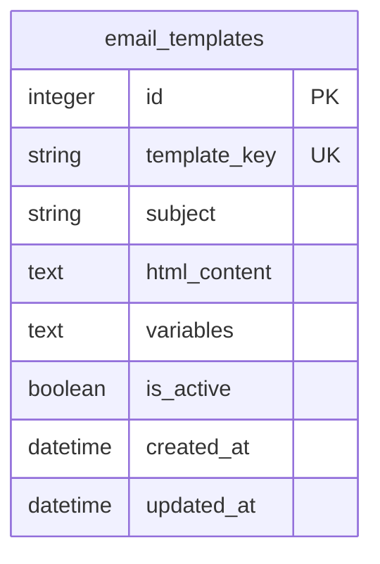
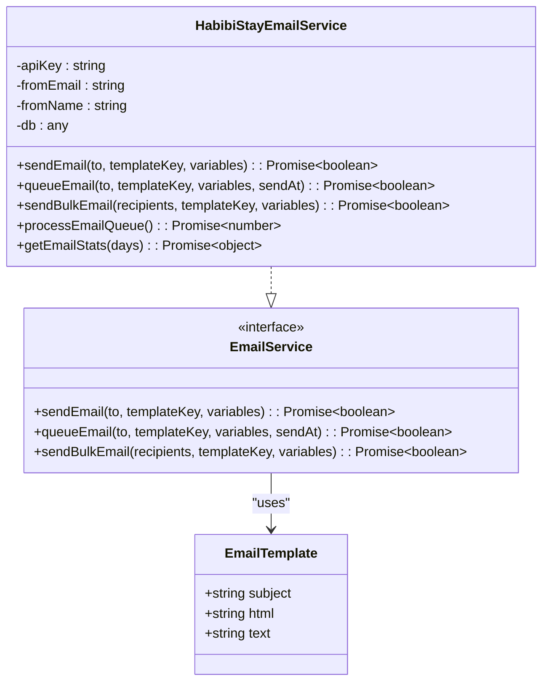
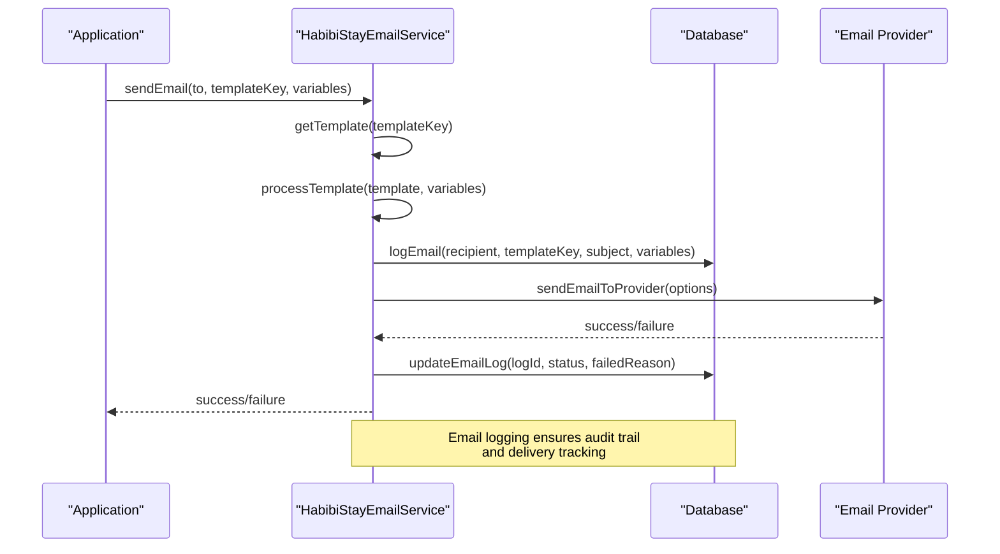
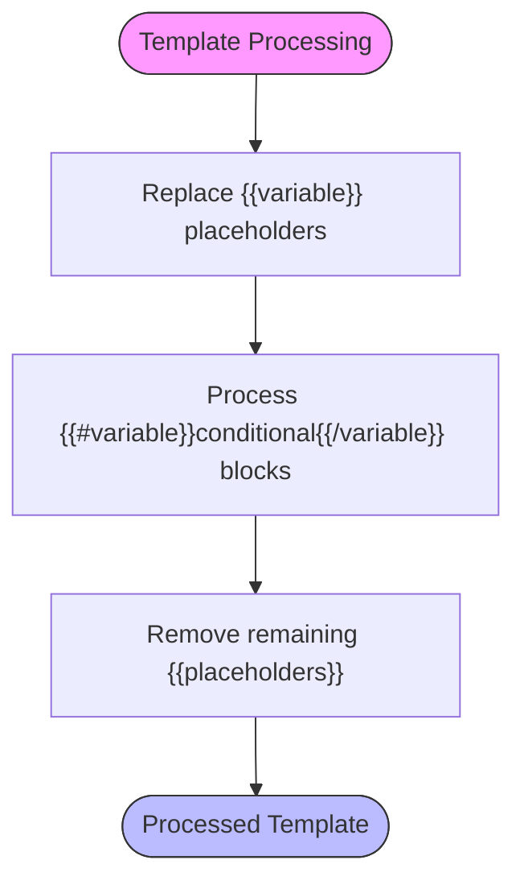
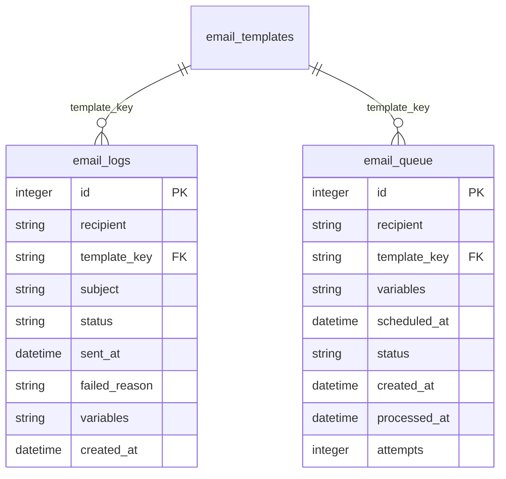

# Email Templates Table Schema

<cite>
**Referenced Files in This Document**   
- [email-templates.ts](file://src/shared/email-templates.ts)
- [additional-email-templates.ts](file://src/shared/additional-email-templates.ts)
- [email-service.ts](file://src/shared/email-service.ts)
- [migrations/5.sql](file://migrations/5.sql)
- [migrations/7.sql](file://migrations/7.sql)
- [worker/index.ts](file://src/worker/index.ts)
</cite>

## Table of Contents
1. [Introduction](#introduction)
2. [Email Templates Table Schema](#email-templates-table-schema)
3. [Template Structure and Content](#template-structure-and-content)
4. [Email Service Integration](#email-service-integration)
5. [Placeholder System and Template Processing](#placeholder-system-and-template-processing)
6. [Security Considerations](#security-considerations)
7. [Template Versioning and Management](#template-versioning-and-management)
8. [Email Logging and Monitoring](#email-logging-and-monitoring)
9. [Conclusion](#conclusion)

## Introduction
The email_templates table is a core component of the HabibiStay platform's communication system, enabling dynamic and personalized email generation for various use cases including booking confirmations, payment notifications, user onboarding, and marketing campaigns. This documentation provides a comprehensive overview of the table schema, its integration with the email service, and the overall email templating system architecture.

**Section sources**
- [migrations/5.sql](file://migrations/5.sql#L1-L36)
- [email-service.ts](file://src/shared/email-service.ts#L0-L52)

## Email Templates Table Schema
The email_templates table stores all email templates used throughout the HabibiStay platform. The schema is designed to support dynamic content generation with placeholders, template activation/deactivation, and version tracking.



**Diagram sources**
- [migrations/5.sql](file://migrations/5.sql#L1-L10)

### Field Definitions
- **id**: Unique identifier for each template record (Primary Key)
- **template_key**: Unique key identifying the template (e.g., "booking_confirmation", "welcome_email") - Must be unique across all templates
- **subject**: Email subject line with support for placeholders (e.g., {{property_title}})
- **html_content**: HTML body content of the email with full placeholder support
- **variables**: JSON array of placeholder variables used in the template (e.g., ["guest_name", "property_title", "check_in_date"])
- **is_active**: Boolean flag indicating whether the template is currently active (1) or inactive (0)
- **created_at**: Timestamp when the template was created
- **updated_at**: Timestamp when the template was last modified

The table includes a unique constraint on the template_key field to prevent duplicate template keys and supports soft activation/deactivation through the is_active flag rather than deletion.

**Section sources**
- [migrations/5.sql](file://migrations/5.sql#L1-L10)
- [worker/index.ts](file://src/worker/index.ts#L1357-L1392)

## Template Structure and Content
The email template system is implemented through a combination of database-stored templates and code-defined templates. The system supports both HTML and plain text content, with the current implementation focusing on HTML templates.

### Core Template Types
The system supports several categories of email templates:

1. **Booking-related templates**: Confirmation, reminders, and host notifications
2. **Payment-related templates**: Payment confirmations and receipts
3. **User engagement templates**: Welcome emails, password resets
4. **Marketing templates**: Newsletters and promotional content
5. **Operational templates**: Contact form confirmations and submissions

### Template Definition Structure
Templates are defined with the following structure:
- **Subject line**: Personalized with dynamic placeholders
- **HTML content**: Fully styled HTML with responsive design
- **Text content**: Plain text alternative for email clients that don't support HTML

The templates are defined in TypeScript files (email-templates.ts and additional-email-templates.ts) and then inserted into the database during initialization.



**Diagram sources**
- [email-templates.ts](file://src/shared/email-templates.ts#L0-L338)
- [additional-email-templates.ts](file://src/shared/additional-email-templates.ts#L0-L382)
- [email-service.ts](file://src/shared/email-service.ts#L0-L52)

**Section sources**
- [email-templates.ts](file://src/shared/email-templates.ts#L0-L338)
- [additional-email-templates.ts](file://src/shared/additional-email-templates.ts#L0-L382)

## Email Service Integration
The email service integrates with the email_templates table to provide a comprehensive email delivery system with logging, queuing, and analytics capabilities.

### Email Service Architecture
The HabibiStayEmailService class provides a complete interface for sending emails using templates. The service follows a layered architecture:

1. **Template retrieval**: Fetches template by key from the combined template registry
2. **Variable processing**: Replaces placeholders with actual values
3. **Email logging**: Records email attempts in the email_logs table
4. **Provider integration**: Sends email through external email service
5. **Status updating**: Updates log with final delivery status



**Diagram sources**
- [email-service.ts](file://src/shared/email-service.ts#L133-L227)

**Section sources**
- [email-service.ts](file://src/shared/email-service.ts#L133-L227)

### Key Integration Points
- **Template retrieval**: The service first attempts to retrieve the template by key from the in-memory template registry
- **Default variables**: System-wide variables (site_name, site_url, support_email, current_year) are automatically injected
- **Logging**: Every email attempt is logged in the email_logs table before sending
- **Status tracking**: Log is updated with final delivery status after provider response

## Placeholder System and Template Processing
The placeholder system enables dynamic content generation by replacing template variables with actual data at runtime.

### Placeholder Syntax
The system supports two types of placeholders:

1. **Standard placeholders**: `{{variable_name}}` - Replaced with the corresponding variable value
2. **Conditional blocks**: `{{#variable}}content{{/variable}}` - Content is included only if the variable has a truthy value

### Template Processing Workflow
The template processing follows a three-step approach:

1. **Variable replacement**: All standard placeholders are replaced with their corresponding values
2. **Conditional processing**: Conditional blocks are evaluated and included/excluded based on variable truthiness
3. **Cleanup**: Any remaining unprocessed placeholders are removed from the template



**Diagram sources**
- [email-service.ts](file://src/shared/email-service.ts#L54-L96)

**Section sources**
- [email-service.ts](file://src/shared/email-service.ts#L54-L96)

### Example Placeholder Usage
```typescript
// Example template
const template = {
  subject: 'Booking Confirmation - {{property_title}}',
  html: '<p>Hello {{guest_name}}, your booking for {{property_title}} is confirmed!</p>',
  text: 'Hello {{guest_name}}, your booking for {{property_title}} is confirmed!'
};

// Variables
const variables = {
  guest_name: 'John Doe',
  property_title: 'Luxury Villa in Riyadh',
  check_in_date: '2024-01-15'
};

// Processed result
// Subject: 'Booking Confirmation - Luxury Villa in Riyadh'
// HTML: '<p>Hello John Doe, your booking for Luxury Villa in Riyadh is confirmed!</p>'
```

## Security Considerations
The email template system incorporates several security measures to prevent common vulnerabilities.

### HTML Content Sanitization
While the current implementation does not explicitly show HTML sanitization, best practices would include:
- **Input validation**: Validating template content during creation/modification
- **Output encoding**: Properly encoding dynamic content to prevent XSS
- **Content filtering**: Removing potentially dangerous HTML elements and attributes

### Template Injection Prevention
The system prevents template injection attacks through:
- **Whitelisted variables**: Only predefined variables can be used in templates
- **Context-aware escaping**: Dynamic content is properly escaped based on context
- **Limited template logic**: The template system supports only basic variable replacement and simple conditionals, preventing complex logic injection

### Secure Template Management
- **Template activation control**: Templates can be deactivated without deletion using the is_active flag
- **Access control**: Template creation and modification should be restricted to authorized administrators
- **Audit logging**: All email sending is logged for security and compliance purposes

The system currently relies on the assumption that templates are created by trusted administrators, but could be enhanced with additional validation and sanitization for user-generated content scenarios.

**Section sources**
- [email-service.ts](file://src/shared/email-service.ts#L54-L96)
- [email-service.ts](file://src/shared/email-service.ts#L182-L227)

## Template Versioning and Management
The template system incorporates versioning and management features to support ongoing maintenance and updates.

### Database Schema Versioning
The email_templates table includes both created_at and updated_at timestamps, enabling:
- **Change tracking**: Monitoring when templates were created and last modified
- **Audit trails**: Maintaining a history of template changes
- **Rollback capability**: Potential to restore previous versions based on timestamps

### Template Initialization
Templates are initialized through a dedicated API endpoint that inserts default templates into the database:
- **Idempotent operations**: Uses INSERT OR IGNORE to prevent duplicate entries
- **Batch processing**: All default templates are inserted in a single operation
- **Status preservation**: Template activation status is maintained during initialization

### Preview Mechanisms
While not explicitly implemented in the current code, administrators can preview templates through:
- **Template retrieval API**: Fetching template content for display
- **Test email functionality**: Sending test emails with sample data
- **Direct database access**: Viewing template content in the database

Future enhancements could include a dedicated template preview interface in the admin dashboard.

**Section sources**
- [migrations/5.sql](file://migrations/5.sql#L1-L10)
- [worker/index.ts](file://src/worker/index.ts#L1357-L1392)

## Email Logging and Monitoring
The system includes comprehensive logging and monitoring capabilities to track email delivery and performance.

### Email Logs Table
The email_logs table tracks all email sending attempts with the following fields:
- **recipient**: Email address of the recipient
- **template_key**: Template used for the email
- **subject**: Final email subject after variable processing
- **status**: Delivery status (pending, sent, failed, bounced)
- **sent_at**: Timestamp when email was sent
- **failed_reason**: Reason for delivery failure
- **variables**: JSON string of variables used (for audit and debugging)
- **created_at**: Timestamp when log entry was created

### Email Queue System
The system supports scheduled and bulk email sending through the email_queue table:
- **Scheduled delivery**: Emails can be queued for future delivery using the scheduled_at field
- **Bulk processing**: The processEmailQueue method processes up to 50 queued emails at a time
- **Retry mechanism**: Failed emails can be retried by updating the queue status

### Analytics and Reporting
The getEmailStats method provides comprehensive email delivery analytics:
- **Delivery success rate**: Percentage of successfully delivered emails
- **Template performance**: Delivery statistics by template type
- **Time-based filtering**: Statistics can be filtered by date range (default: 30 days)



**Diagram sources**
- [migrations/5.sql](file://migrations/5.sql#L11-L20)
- [email-service.ts](file://src/shared/email-service.ts#L98-L131)
- [email-service.ts](file://src/shared/email-service.ts#L300-L341)

**Section sources**
- [email-service.ts](file://src/shared/email-service.ts#L98-L131)
- [email-service.ts](file://src/shared/email-service.ts#L300-L341)

## Conclusion
The email_templates table and associated email service provide a robust foundation for dynamic email generation in the HabibiStay platform. The system supports personalized communication for bookings, payments, and marketing through a flexible template system with placeholder replacement and conditional logic.

Key strengths of the implementation include:
- **Comprehensive template management**: Support for multiple template types with activation control
- **Reliable delivery tracking**: Detailed logging and monitoring of email delivery
- **Scalable architecture**: Support for queued and bulk email sending
- **Extensible design**: Clear separation between template definition and delivery logic

Potential areas for enhancement include:
- **Enhanced security**: Implementing HTML sanitization for user-generated content
- **Template versioning**: Adding explicit version numbers and rollback capabilities
- **Preview functionality**: Developing a dedicated template preview interface
- **Rich text editing**: Providing a WYSIWYG editor for template creation

The current implementation effectively meets the core requirements for dynamic email generation while providing a solid foundation for future enhancements.