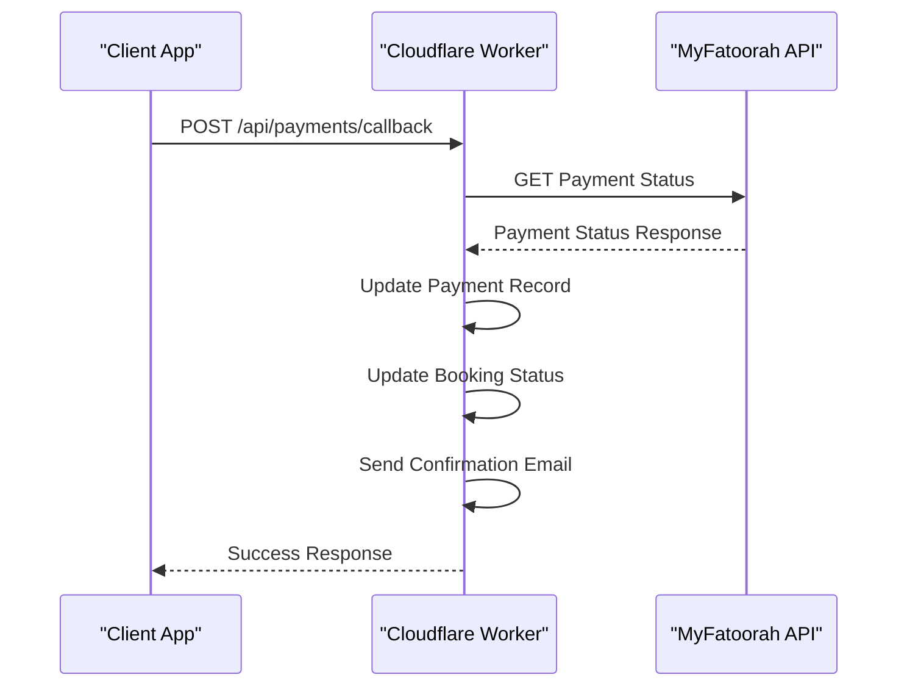
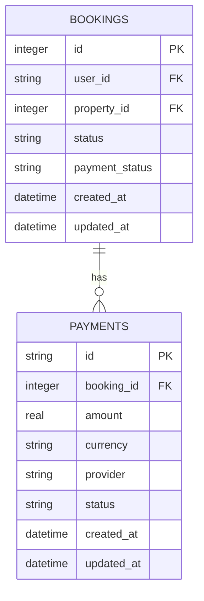
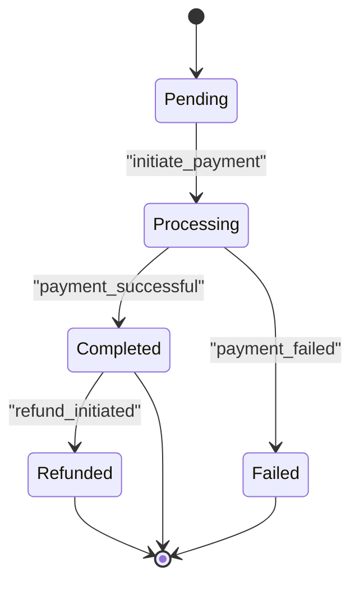
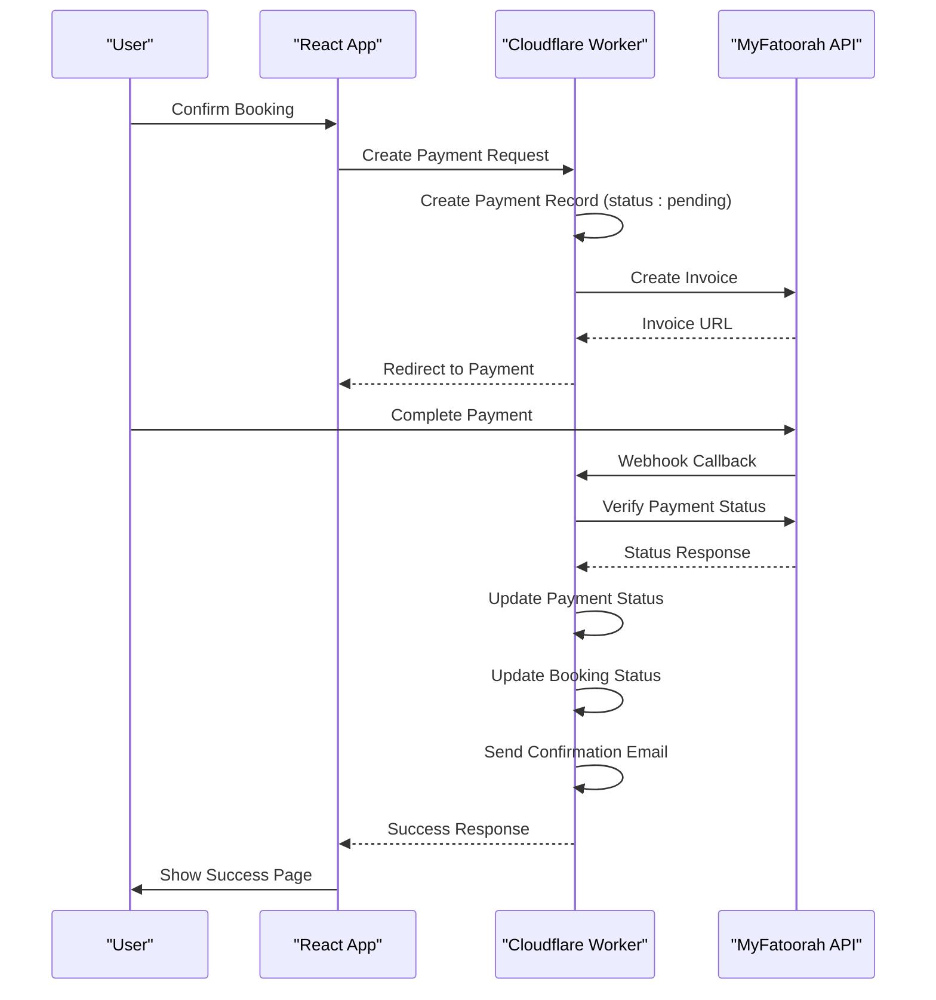
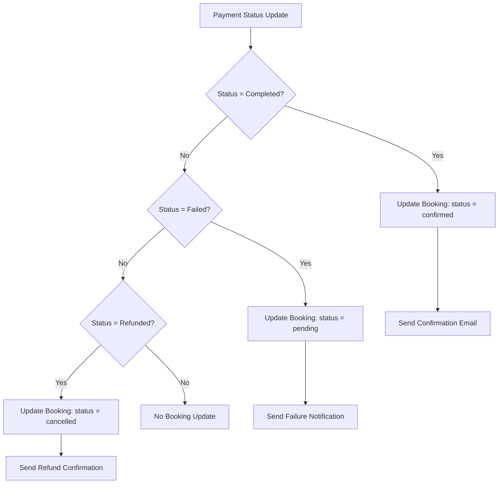

# Payments Table Schema

<cite>
**Referenced Files in This Document**   
- [2.sql](file://migrations/2.sql)
- [types.ts](file://src/shared/types.ts)
- [payment.ts](file://src/shared/payment.ts)
- [PaymentService.ts](file://src/server/services/PaymentService.ts)
- [index.ts](file://src/worker/index.ts)
</cite>

## Table of Contents
1. [Introduction](#introduction)
2. [Payments Table Schema](#payments-table-schema)
3. [Type Definitions and TypeScript Interfaces](#type-definitions-and-typescript-interfaces)
4. [MyFatoorah Integration](#myfatoorah-integration)
5. [Foreign Key Relationships](#foreign-key-relationships)
6. [Payment Lifecycle and Status Transitions](#payment-lifecycle-and-status-transitions)
7. [Payment Record Creation and Webhook Updates](#payment-record-creation-and-webhook-updates)
8. [Data Consistency Between Booking and Payment Status](#data-consistency-between-booking-and-payment-status)
9. [Idempotency Patterns in Payment Processing](#idempotency-patterns-in-payment-processing)

## Introduction
This document provides a comprehensive overview of the payments table schema introduced in migration 2.sql within the HabibiStay application. It details the database structure, corresponding TypeScript types, integration with the MyFatoorah payment gateway, foreign key relationships, status transitions, and mechanisms for ensuring data consistency and idempotency during payment processing. The documentation is designed to be accessible to both technical and non-technical stakeholders, offering clear explanations of how payments are managed throughout the booking lifecycle.

## Payments Table Schema
The payments table stores all payment transactions associated with bookings in the HabibiStay platform. Although the CREATE TABLE statement is not directly visible in the provided migration files, the schema can be accurately inferred from INSERT and UPDATE operations in the codebase, particularly in the `createPaymentRecord` method of the PaymentService.

Based on analysis of the code, the payments table includes the following fields:

- **id**: Unique identifier for the payment record (TEXT)
- **booking_id**: Foreign key linking to the bookings table (INTEGER)
- **amount**: Numeric value of the payment (REAL)
- **currency**: Currency code (e.g., SAR, USD) (TEXT)
- **provider**: Payment gateway used (e.g., myfatoorah, paypal) (TEXT)
- **status**: Current status of the payment (TEXT)
- **customer_name**: Name of the customer making the payment (TEXT)
- **customer_email**: Email address of the customer (TEXT)
- **customer_phone**: Phone number of the customer (TEXT)
- **description**: Optional description of the payment (TEXT)
- **metadata**: JSON field storing additional provider-specific data (TEXT)
- **created_at**: Timestamp when the payment record was created (DATETIME)
- **updated_at**: Timestamp when the payment record was last updated (DATETIME)
- **provider_transaction_id**: Transaction ID from the payment provider (TEXT)
- **payment_url**: URL for payment processing (TEXT)
- **provider_metadata**: Additional metadata from the payment provider (TEXT)

The schema supports multiple payment providers with flexible metadata storage, enabling integration with various payment gateways while maintaining a consistent internal structure.

**Section sources**
- [PaymentService.ts](file://src/server/services/PaymentService.ts#L715-L750)

## Type Definitions and TypeScript Interfaces
The application defines TypeScript interfaces that map directly to the payments table schema, ensuring type safety across the codebase. These types are defined in `types.ts` and provide a contract for payment-related operations.

The primary interface is `PaymentSchema`, which corresponds to the database structure:

```typescript
export const PaymentSchema = z.object({
  id: z.number(),
  booking_id: z.number(),
  payment_provider: z.string(),
  payment_id: z.string().nullable(),
  invoice_id: z.string().nullable(),
  amount: z.number(),
  currency: z.string(),
  status: z.string(),
  payment_method: z.string().nullable(),
  transaction_id: z.string().nullable(),
  payment_url: z.string().nullable(),
  metadata: z.string().nullable(),
  created_at: z.string(),
  updated_at: z.string(),
});
```

Additionally, enhanced payment types are defined for more specific use cases:

```typescript
export const EnhancedPaymentSchema = z.object({
  id: z.number(),
  booking_id: z.number(),
  payment_id: z.string(),
  gateway: z.enum(['myfatoorah', 'paypal', 'stripe']),
  amount: z.number(),
  currency: z.string(),
  status: z.enum(['pending', 'processing', 'completed', 'failed', 'refunded']),
  gateway_response: z.any().optional(),
  created_at: z.string(),
  updated_at: z.string(),
});
```

These type definitions ensure that payment data is validated and structured consistently throughout the application, reducing errors and improving maintainability.

**Section sources**
- [types.ts](file://src/shared/types.ts#L100-L150)

## MyFatoorah Integration
The application integrates with MyFatoorah as a primary payment gateway through dedicated service classes and API endpoints. The integration is implemented in `payment.ts` and orchestrated through the PaymentService.

Key components of the MyFatoorah integration include:

- **MyFatoorahService class**: A wrapper around the MyFatoorah API that handles authentication, request formatting, and response parsing
- **PaymentRequestSchema**: Defines the structure of requests sent to MyFatoorah, including amount, currency, customer information, and callback URLs
- **PaymentStatusSchema**: Defines the expected response structure when checking payment status
- **API endpoints**: The `/api/payments/callback` endpoint processes webhook notifications from MyFatoorah

The service uses Bearer token authentication and communicates with MyFatoorah's API endpoints to create invoices, check payment status, and handle cancellations. The integration supports both sandbox and production environments through configuration settings.



**Diagram sources**
- [payment.ts](file://src/shared/payment.ts#L1-L165)
- [index.ts](file://src/worker/index.ts#L1100-L1200)

## Foreign Key Relationships
The payments table maintains a critical relationship with the bookings table through the `booking_id` foreign key. This relationship ensures referential integrity between payment transactions and booking records.

When a payment is created, it is associated with a specific booking via the `booking_id` field. This enables:
- Tracking all payments associated with a particular booking
- Ensuring that payments are only created for valid bookings
- Updating booking status based on payment outcomes
- Generating financial reports that correlate bookings with payments

The relationship is enforced at the application level, as the database schema does not include explicit foreign key constraints in the provided migration files. However, the application logic consistently maintains this relationship through transactional operations.



**Diagram sources**
- [PaymentService.ts](file://src/server/services/PaymentService.ts#L715-L750)
- [index.ts](file://src/worker/index.ts#L1148-L1182)

## Payment Lifecycle and Status Transitions
The payment system implements a state machine that tracks the lifecycle of each payment through various status transitions. The valid status values are: 'pending', 'processing', 'completed', 'failed', and 'refunded'.

The typical lifecycle begins with 'pending' when a payment record is created during booking confirmation. The status transitions as follows:

1. **Pending**: Payment record created, awaiting processing
2. **Processing**: Payment is being processed by the gateway
3. **Completed**: Payment successfully processed
4. **Failed**: Payment attempt failed
5. **Refunded**: Payment has been refunded

Status transitions are triggered by:
- Direct API calls during payment creation
- Webhook callbacks from payment providers
- Manual refund operations

The system includes mapping functions that translate provider-specific status codes (e.g., 'Paid', 'Pending', 'Failed' from MyFatoorah) to the application's standardized status values.



**Diagram sources**
- [PaymentService.ts](file://src/server/services/PaymentService.ts#L672-L717)
- [types.ts](file://src/shared/types.ts#L150-L160)

## Payment Record Creation and Webhook Updates
Payment records are created during the booking confirmation process and subsequently updated via webhook callbacks from payment providers.

### Payment Record Creation
When a user confirms a booking, the system creates a payment record with initial status 'pending':

1. Generate a unique payment ID
2. Insert record into payments table with status 'pending'
3. Initiate payment with the selected provider (MyFatoorah)
4. Return payment URL to redirect user for payment completion

The `createPaymentRecord` method in PaymentService handles this process, ensuring all required fields are populated and the record is properly linked to the booking.

### Webhook Updates
The system receives asynchronous notifications from payment providers via webhook callbacks:

1. Receive POST request at `/api/payments/callback`
2. Validate the payment identifier (paymentId, Id, or InvoiceId)
3. Query MyFatoorah API for current payment status
4. Update the payment record with latest status and transaction details
5. Update the associated booking status accordingly
6. Send confirmation email if payment is successful

The webhook endpoint is idempotent and can safely handle duplicate notifications, ensuring reliable payment status synchronization.



**Diagram sources**
- [PaymentService.ts](file://src/server/services/PaymentService.ts#L715-L750)
- [index.ts](file://src/worker/index.ts#L1100-L1200)

## Data Consistency Between Booking and Payment Status
The system maintains strict data consistency between booking and payment statuses through coordinated updates. When a payment status changes, the associated booking status is updated accordingly.

Key consistency rules:
- Payment status 'completed' → Booking status 'confirmed'
- Payment status 'failed' → Booking status 'pending'
- Payment status 'refunded' → Booking status 'cancelled'

These updates are performed atomically within the same transaction when possible, or through compensating actions if distributed transactions are required. The system also includes reconciliation mechanisms to detect and resolve inconsistencies.

The `handlePaymentCompleted` and `handlePaymentFailed` methods in PaymentService ensure that booking status is updated in response to payment events, maintaining alignment between the two domains.



**Diagram sources**
- [PaymentService.ts](file://src/server/services/PaymentService.ts#L790-L823)
- [index.ts](file://src/worker/index.ts#L1148-L1182)

## Idempotency Patterns in Payment Processing
The payment system implements idempotency patterns to prevent duplicate charges and ensure safe retry mechanisms. This is critical for handling network failures, duplicate webhook notifications, and user refreshes.

Key idempotency mechanisms:

### Idempotent Payment Creation
Each payment request includes a unique identifier generated using timestamp and random string:
```typescript
const paymentId = `PAY_${Date.now()}_${Math.random().toString(36).substr(2, 9)}`;
```
This ensures that even if the same request is processed multiple times, it will reference the same payment record.

### Idempotent Webhook Processing
The webhook endpoint can safely process duplicate notifications:
1. Extract payment identifier from request
2. Query existing payment record by identifier
3. If record exists, update with current status (idempotent operation)
4. If record doesn't exist, create new record

This pattern ensures that multiple webhook calls for the same payment event do not create duplicate records or trigger duplicate actions.

### Idempotency Keys
The system could be enhanced with explicit idempotency keys in headers, but currently relies on the uniqueness of payment identifiers and transaction IDs to achieve idempotency.

### Safe Retry Logic
API clients are encouraged to implement retry logic with exponential backoff, knowing that the server-side operations are idempotent. This improves reliability without risking duplicate charges.

The combination of unique identifiers, atomic updates, and state-based processing ensures that payment operations are safe to retry, providing a robust user experience even under adverse network conditions.

**Section sources**
- [PaymentService.ts](file://src/server/services/PaymentService.ts#L715-L750)
- [index.ts](file://src/worker/index.ts#L1100-L1200)