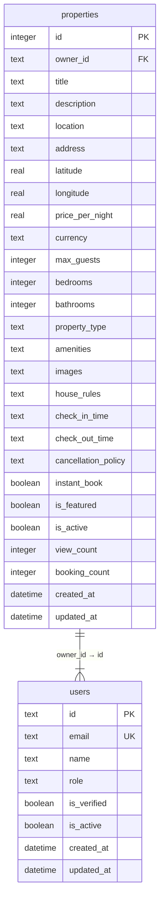

# Properties Table Schema

<cite>
**Referenced Files in This Document**   
- [1.sql](file://migrations/1.sql#L15-L50)
- [types.ts](file://src/shared/types.ts#L1-200)
- [PropertyForm.tsx](file://src/react-app/pages/PropertyForm.tsx#L0-L492)
- [PropertyDetail.tsx](file://src/react-app/pages/PropertyDetail.tsx#L0-L561)
</cite>

## Table of Contents
1. [Properties Table Schema Overview](#properties-table-schema-overview)
2. [Field Definitions](#field-definitions)
3. [Type Mapping to Property in types.ts](#type-mapping-to-property-in-typests)
4. [Foreign Key Constraints](#foreign-key-constraints)
5. [Business Rules and Database Constraints](#business-rules-and-database-constraints)
6. [Featured Properties Management](#featured-properties-management)
7. [Query Patterns for Property Search and Filtering](#query-patterns-for-property-search-and-filtering)
8. [Performance Considerations](#performance-considerations)

## Properties Table Schema Overview

The `properties` table is a central component of the HabibiStay platform, serving as the primary data store for accommodation listings. It captures comprehensive details about each property available for booking, including descriptive, pricing, capacity, and availability information. The schema is designed to support flexible listing management, search functionality, and business logic enforcement at the database level.



**Diagram sources**
- [1.sql](file://migrations/1.sql#L15-L50)

**Section sources**
- [1.sql](file://migrations/1.sql#L15-L50)

## Field Definitions

Each field in the `properties` table serves a specific purpose in representing a property listing:

- **id**: Unique identifier for the property (Primary Key, Auto-incrementing integer)
- **owner_id**: References the `id` in the `users` table, identifying the property owner
- **title**: Descriptive name of the property (Required, Text)
- **description**: Detailed description of the property and its features (Optional, Text)
- **location**: Geographic location of the property (Required, Text)
- **address**: Full street address of the property (Optional, Text)
- **latitude**: Geographic latitude coordinate (Optional, Real)
- **longitude**: Geographic longitude coordinate (Optional, Real)
- **price_per_night**: Base price per night in the specified currency (Required, Real)
- **currency**: Currency code for pricing (Default: 'SAR', Text)
- **max_guests**: Maximum number of guests allowed (Required, Integer)
- **bedrooms**: Number of bedrooms (Default: 1, Integer)
- **bathrooms**: Number of bathrooms (Default: 1, Integer)
- **property_type**: Type of property (e.g., apartment, villa, studio) (Optional, Text)
- **amenities**: JSON array of amenities offered (Optional, Text)
- **images**: JSON array of image URLs (Optional, Text)
- **house_rules**: Rules and policies for guests (Optional, Text)
- **check_in_time**: Standard check-in time (Default: '15:00', Text)
- **check_out_time**: Standard check-out time (Default: '11:00', Text)
- **cancellation_policy**: Policy for cancellations (Default: 'moderate', Text)
- **instant_book**: Whether guests can book without approval (Default: 0, Boolean)
- **is_featured**: Whether the property is featured in promotions (Default: 0, Boolean)
- **is_active**: Whether the property is currently available for booking (Default: 1, Boolean)
- **view_count**: Number of times the property has been viewed (Default: 0, Integer)
- **booking_count**: Number of successful bookings (Default: 0, Integer)
- **created_at**: Timestamp when the property was created (Default: CURRENT_TIMESTAMP)
- **updated_at**: Timestamp when the property was last updated (Default: CURRENT_TIMESTAMP)

**Section sources**
- [1.sql](file://migrations/1.sql#L15-L50)

## Type Mapping to Property in types.ts

The `Property` type defined in `types.ts` corresponds directly to the database schema, with appropriate TypeScript types for type safety in the application code:

```typescript
export const PropertySchema = z.object({
  id: z.number(),
  user_id: z.string(),
  title: z.string(),
  description: z.string().nullable(),
  location: z.string(),
  price_per_night: z.number(),
  max_guests: z.number(),
  bedrooms: z.number().nullable(),
  bathrooms: z.number().nullable(),
  amenities: z.string().nullable(),
  images: z.string().nullable(),
  is_featured: z.boolean(),
  is_active: z.boolean(),
  created_at: z.string(),
  updated_at: z.string(),
});

export type Property = z.infer<typeof PropertySchema>;
```

The `CreateProperty` type is used for form validation and property creation, with more specific validation rules:

```typescript
export const CreatePropertySchema = z.object({
  title: z.string().min(1),
  description: z.string().optional(),
  location: z.string().min(1),
  price_per_night: z.number().positive(),
  max_guests: z.number().int().positive(),
  bedrooms: z.number().int().positive().optional(),
  bathrooms: z.number().int().positive().optional(),
  amenities: z.array(z.string()).optional(),
  images: z.array(z.string()).optional(),
});
```

Note: The database uses `owner_id` while the TypeScript type uses `user_id`, but they refer to the same concept and are mapped appropriately in the API layer.

**Section sources**
- [types.ts](file://src/shared/types.ts#L1-200)

## Foreign Key Constraints

The `properties` table has a foreign key relationship with the `users` table:

- **owner_id → users.id**: This constraint ensures that every property is associated with a valid user account. The `owner_id` field references the `id` field in the `users` table, establishing the ownership relationship. This enforces referential integrity, preventing orphaned properties and ensuring that only registered users can list properties.

This relationship enables:
- User authentication and authorization for property management
- Owner-specific queries and dashboards
- Data integrity between users and their listings
- Cascading operations (though not explicitly defined with ON DELETE CASCADE in the current schema)

**Section sources**
- [1.sql](file://migrations/1.sql#L15-L50)

## Business Rules and Database Constraints

The database enforces several business rules through constraints and default values:

- **Required fields**: `owner_id`, `title`, `location`, and `price_per_night` are required, ensuring essential information is always present
- **Default values**: Several fields have sensible defaults to streamline the listing process:
  - `currency`: 'SAR' (Saudi Riyal)
  - `bedrooms` and `bathrooms`: 1
  - `check_in_time`: '15:00', `check_out_time`: '11:00'
  - `cancellation_policy`: 'moderate'
  - `instant_book`: 0 (false)
  - `is_featured` and `is_active`: 0 and 1 respectively
  - `view_count` and `booking_count`: 0

- **Data type constraints**: Numeric fields are properly typed (REAL for prices, INTEGER for counts)
- **Timestamp management**: `created_at` and `updated_at` are automatically managed by the database using `CURRENT_TIMESTAMP`

The `is_active` field (not `status` as mentioned in the documentation objective) serves as the primary indicator of a property's availability for booking. When `is_active` is 0 (false), the property is effectively "inactive" from a business perspective, even though there is no explicit ENUM status field in the current schema.

**Section sources**
- [1.sql](file://migrations/1.sql#L15-L50)

## Featured Properties Management

Featured properties are managed through the `is_featured` boolean field in the `properties` table. When this field is set to 1 (true), the property is designated as featured and receives special treatment in the application:

- **Prominent placement**: Featured properties are displayed more prominently in search results and on the homepage
- **Visual indicators**: The UI displays special badges or highlights for featured listings
- **Algorithmic prioritization**: Search and recommendation algorithms give preference to featured properties

The management of featured properties can be handled through:
- Admin dashboard controls
- Automated algorithms based on performance metrics
- Paid promotion systems (potentially configured through admin settings)

The `is_featured` status is independent of the `is_active` status, allowing properties to be featured only when they are also active and available for booking.

**Section sources**
- [1.sql](file://migrations/1.sql#L15-L50)
- [PropertyDetail.tsx](file://src/react-app/pages/PropertyDetail.tsx#L0-L561)

## Query Patterns for Property Search and Filtering

Common query patterns for property search and filtering include:

### Basic Property Retrieval
```sql
SELECT * FROM properties WHERE id = ?;
```

### Search by Location
```sql
SELECT * FROM properties 
WHERE location LIKE ? 
  AND is_active = 1 
  AND price_per_night BETWEEN ? AND ?
ORDER BY price_per_night;
```

### Filter by Capacity
```sql
SELECT * FROM properties 
WHERE max_guests >= ? 
  AND is_active = 1
ORDER BY created_at DESC;
```

### Featured Properties
```sql
SELECT * FROM properties 
WHERE is_featured = 1 
  AND is_active = 1
LIMIT ?;
```

### Advanced Search with Amenities
```sql
SELECT * FROM properties 
WHERE is_active = 1
  AND json_each(json_extract(amenities, '$')) IN (?, ?, ?)
  AND max_guests >= ?
ORDER BY is_featured DESC, price_per_night ASC;
```

Note: The actual implementation may use different JSON functions depending on the SQLite version and configuration.

**Section sources**
- [1.sql](file://migrations/1.sql#L15-L50)
- [PropertyForm.tsx](file://src/react-app/pages/PropertyForm.tsx#L0-L492)
- [PropertyDetail.tsx](file://src/react-app/pages/PropertyDetail.tsx#L0-L561)

## Performance Considerations

### Text Search on Title and Description
For efficient text search on `title` and `description` fields:

1. **Full-Text Search (FTS)**: Consider implementing SQLite FTS5 for advanced text search capabilities:
```sql
CREATE VIRTUAL TABLE properties_fts USING fts5(title, description, location, content='properties');
```

2. **Indexing**: Create indexes on frequently queried columns:
```sql
CREATE INDEX idx_properties_location_active ON properties(location, is_active);
CREATE INDEX idx_properties_price_active ON properties(price_per_night, is_active);
CREATE INDEX idx_properties_active_featured ON properties(is_active, is_featured);
```

3. **Query Optimization**: Use parameterized queries and avoid SELECT * when possible, retrieving only needed fields.

4. **JSON Query Performance**: Since `amenities` and `images` are stored as JSON text, queries that filter on specific amenities may be slow. Consider:
   - Extracting frequently queried amenities to separate columns
   - Using generated columns for common JSON extractions
   - Implementing application-level caching

5. **Pagination**: Always implement pagination for search results to prevent performance degradation with large datasets:
```sql
SELECT * FROM properties 
WHERE is_active = 1 
LIMIT ? OFFSET ?;
```

6. **Caching**: Implement application-level caching for frequently accessed properties, especially featured listings and search results.

**Section sources**
- [1.sql](file://migrations/1.sql#L15-L50)
- [PropertyForm.tsx](file://src/react-app/pages/PropertyForm.tsx#L0-L492)
- [PropertyDetail.tsx](file://src/react-app/pages/PropertyDetail.tsx#L0-L561)