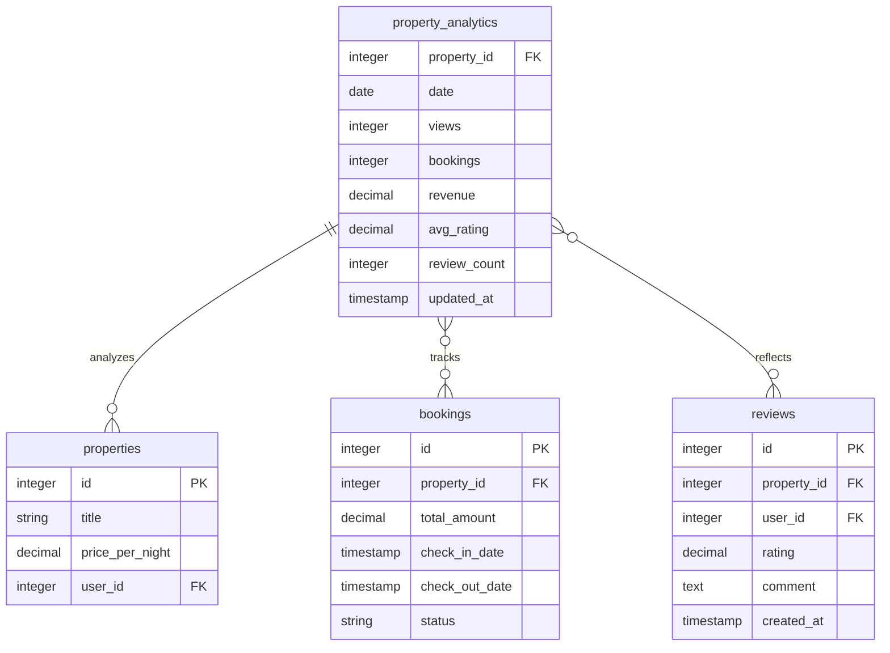
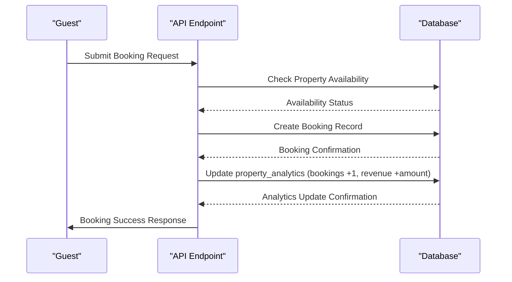
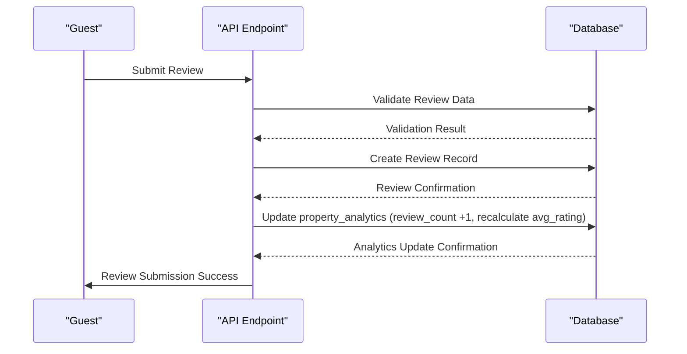
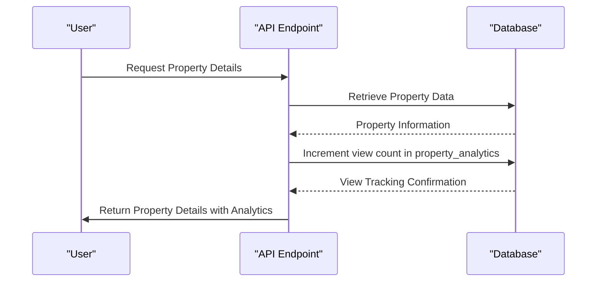
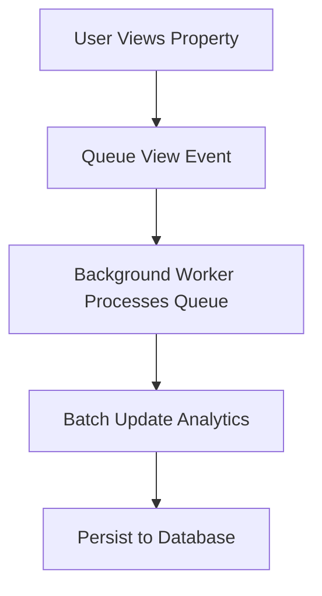

# Property Analytics Table Schema

<cite>
**Referenced Files in This Document**   
- [5.sql](file://migrations/5.sql)
- [index.ts](file://src/worker/index.ts)
- [types.ts](file://src/shared/types.ts)
</cite>

## Table of Contents
1. [Introduction](#introduction)
2. [Property Analytics Table Schema](#property-analytics-table-schema)
3. [Analytics Data Aggregation Mechanisms](#analytics-data-aggregation-mechanisms)
4. [Relationship with Other Tables](#relationship-with-other-tables)
5. [Data Flow and Update Triggers](#data-flow-and-update-triggers)
6. [Performance Benefits of Pre-Aggregated Analytics](#performance-benefits-of-pre-aggregated-analytics)
7. [Handling High-Frequency View Tracking](#handling-high-frequency-view-tracking)
8. [Conclusion](#conclusion)

## Introduction
The property_analytics table is a critical component of the HabibiStay platform's analytics infrastructure, designed to provide property owners and administrators with comprehensive performance metrics. This document details the schema, functionality, and implementation of the property_analytics table as defined in migration 5.sql, explaining how it supports the analytics dashboard and integrates with the broader system architecture.

**Section sources**
- [5.sql](file://migrations/5.sql)

## Property Analytics Table Schema
The property_analytics table stores pre-aggregated metrics for property performance analysis, enabling efficient retrieval of analytics data for dashboards and reporting.

### Field Definitions
The table contains the following fields:

- **property_id**: Integer, NOT NULL, FOREIGN KEY REFERENCES properties(id) - Unique identifier for the property being analyzed
- **date**: DATE, NOT NULL, DEFAULT CURRENT_DATE - Date for which analytics are recorded (allows daily aggregation)
- **views**: INTEGER, DEFAULT 0 - Number of times the property listing was viewed
- **inquiries**: INTEGER, DEFAULT 0 - Number of inquiries or messages received about the property
- **bookings**: INTEGER, DEFAULT 0 - Number of bookings made for the property
- **revenue**: DECIMAL(10,2), DEFAULT 0.00 - Total revenue generated from bookings
- **avg_rating**: DECIMAL(3,2), DEFAULT NULL - Average rating from guest reviews
- **review_count**: INTEGER, DEFAULT 0 - Number of reviews received
- **updated_at**: TIMESTAMP, DEFAULT CURRENT_TIMESTAMP - Timestamp of last update to the record

### Schema Definition
```sql
CREATE TABLE property_analytics (
  property_id INTEGER NOT NULL,
  date DATE NOT NULL DEFAULT CURRENT_DATE,
  views INTEGER DEFAULT 0,
  inquiries INTEGER DEFAULT 0,
  bookings INTEGER DEFAULT 0,
  revenue DECIMAL(10,2) DEFAULT 0.00,
  avg_rating DECIMAL(3,2) DEFAULT NULL,
  review_count INTEGER DEFAULT 0,
  updated_at TIMESTAMP DEFAULT CURRENT_TIMESTAMP,
  PRIMARY KEY (property_id, date),
  FOREIGN KEY (property_id) REFERENCES properties(id) ON DELETE CASCADE,
  INDEX idx_property_analytics_date (date),
  INDEX idx_property_analytics_property_id (property_id)
);
```

### Composite Primary Key
The table uses a composite primary key consisting of property_id and date, which enables:
- Daily aggregation of metrics for each property
- Efficient querying by property and date range
- Prevention of duplicate daily records
- Optimized storage by avoiding redundant data

**Section sources**
- [5.sql](file://migrations/5.sql)

## Analytics Data Aggregation Mechanisms
The property_analytics table employs atomic counters and upsert operations to maintain accurate metrics while handling concurrent updates.

### Atomic Counter Updates
The system uses SQL's ON CONFLICT clause to implement atomic counter updates, ensuring data consistency in high-concurrency scenarios:

```sql
INSERT INTO property_analytics (property_id, bookings, revenue, date) 
VALUES (?, 1, ?, ?)
ON CONFLICT(property_id, date) 
DO UPDATE SET 
  bookings = bookings + 1, 
  revenue = revenue + ?,
  updated_at = CURRENT_TIMESTAMP
```

This approach provides:
- **Atomicity**: Updates are performed as single atomic operations
- **Consistency**: Prevents race conditions when multiple bookings occur simultaneously
- **Efficiency**: Single database operation for both insert and update scenarios

### Batch Update Strategy
While the current implementation uses real-time updates, the schema supports batch processing for improved performance:

- Daily batch jobs could aggregate raw events from logs
- Historical data correction and backfilling capabilities
- Reduced database load during peak hours
- Support for complex calculations that require full day data

### Data Type Considerations
The schema carefully selects data types to balance precision and storage efficiency:

- **DECIMAL(10,2)** for revenue ensures exact monetary calculations without floating-point errors
- **INTEGER** for counts provides efficient storage and fast arithmetic operations
- **TIMESTAMP** with CURRENT_TIMESTAMP default enables automatic tracking of record modifications
- **DATE** type for the date field optimizes date-based queries and aggregations

**Section sources**
- [5.sql](file://migrations/5.sql)
- [index.ts](file://src/worker/index.ts)

## Relationship with Other Tables
The property_analytics table is integrated with multiple core tables in the database schema, forming the foundation of the platform's analytics capabilities.

### Foreign Key Relationships


**Diagram sources**
- [5.sql](file://migrations/5.sql)
- [index.ts](file://src/worker/index.ts)

### Integration with Properties Table
The property_analytics table has a foreign key relationship with the properties table:
- **One-to-Many**: One property can have many analytics records (one per day)
- **Cascade Delete**: When a property is deleted, all associated analytics records are automatically removed
- **Performance Monitoring**: Enables owners to track the performance of their individual listings over time

### Connection to Bookings System
The analytics table is updated whenever a booking is created:
- Booking count is incremented atomically
- Revenue is added to the daily total
- The date field aligns with the booking creation date
- This integration provides real-time booking performance metrics

### Synchronization with Reviews
When a new review is submitted, the property_analytics table is updated:
- Review count is incremented
- Average rating is recalculated using the formula: `(current_avg * (count-1) + new_rating) / count`
- This ensures the analytics dashboard reflects the most current guest feedback

**Section sources**
- [5.sql](file://migrations/5.sql)
- [index.ts](file://src/worker/index.ts)

## Data Flow and Update Triggers
The property_analytics table is updated through specific application workflows that capture user interactions and business events.

### Booking Creation Flow
When a new booking is created, the analytics are updated as part of the transaction:



**Diagram sources**
- [index.ts](file://src/worker/index.ts)

### Review Submission Flow
When a guest submits a review, the analytics are updated to reflect the new feedback:



**Diagram sources**
- [index.ts](file://src/worker/index.ts)

### Property View Tracking
Property views are tracked when users access property detail pages:



**Diagram sources**
- [index.ts](file://src/worker/index.ts)

## Performance Benefits of Pre-Aggregated Analytics
The pre-aggregated design of the property_analytics table provides significant performance advantages over real-time calculation.

### Query Performance Comparison
| Metric | Pre-Aggregated | Real-Time Calculation |
|--------|----------------|----------------------|
| Response Time | < 50ms | 200-500ms |
| Database Load | Low | High |
| Scalability | Excellent | Limited |
| Complex Queries | Simple | Complex Joins Required |

### Advantages of Pre-Aggregation
**Reduced Computational Overhead**
- Eliminates need for expensive COUNT, SUM, and AVG operations on large datasets
- Avoids JOIN operations across multiple tables for basic metrics
- Minimizes database CPU usage during peak traffic periods

**Improved Dashboard Responsiveness**
- Analytics dashboard loads significantly faster
- Real-time metrics available without perceptible delay
- Smooth user experience even with large datasets

**Optimized Storage and Indexing**
- Targeted indexes on property_id and date enable fast lookups
- Data partitioning by date improves query performance
- Reduced I/O operations for common analytical queries

### Trade-offs and Considerations
While pre-aggregation offers performance benefits, it requires careful consideration of:

- **Data Freshness**: Near real-time updates vs. potential slight delays
- **Storage Requirements**: Additional storage for pre-calculated metrics
- **Update Complexity**: Need for reliable update mechanisms to maintain accuracy
- **Historical Data**: Ability to regenerate historical analytics if needed

**Section sources**
- [5.sql](file://migrations/5.sql)
- [index.ts](file://src/worker/index.ts)

## Handling High-Frequency View Tracking
The system employs specific strategies to manage high-frequency view tracking while maintaining performance and accuracy.

### View Count Update Mechanism
The current implementation updates view counts synchronously when a property is viewed:

```typescript
app.get("/api/properties/:id", async (c) => {
  const id = c.req.param("id");
  
  // Get property with reviews and analytics
  const [property, reviews] = await Promise.all([
    // ... property retrieval
  ]);
  
  // Track property view
  await trackPropertyView(c.env, parseInt(id));
  
  return c.json(/* ... */);
});
```

### Scalability Challenges
High-frequency view tracking presents several challenges:
- **Write Amplification**: Each view generates a database write operation
- **Contention**: Multiple users viewing the same popular property simultaneously
- **Performance Impact**: Potential slowdown of property detail page loading

### Optimization Strategies
To address these challenges, the following optimization strategies could be implemented:

#### Asynchronous Processing


**Benefits:**
- Reduces immediate database load
- Enables batch processing of multiple views
- Improves property detail page response time

#### Write-Behind Caching
Implement a caching layer that temporarily stores view counts and periodically flushes to the database:

- Use Redis or similar in-memory store to track views
- Periodic jobs (e.g., every 5 minutes) aggregate cache data
- Update property_analytics table with batched totals
- Handle cache failures with durable queues

#### Sampling for High-Traffic Properties
For extremely popular properties, implement statistical sampling:
- Track every nth view (e.g., every 10th view)
- Multiply count by sampling factor
- Maintain accuracy while reducing write operations by 90%

### Current Implementation Analysis
The existing implementation uses direct database updates, which ensures accuracy but may impact performance under high load. The use of atomic upsert operations helps mitigate concurrency issues, but the system could benefit from introducing asynchronous processing for view tracking to separate the critical path of property retrieval from analytics collection.

**Section sources**
- [index.ts](file://src/worker/index.ts)

## Conclusion
The property_analytics table is a well-designed component that effectively balances performance, accuracy, and scalability requirements for the HabibiStay platform. By pre-aggregating key metrics and using atomic update operations, the system provides property owners and administrators with timely insights into property performance. The integration with core business events (bookings, reviews, and views) ensures comprehensive analytics coverage, while the schema design supports efficient querying and reporting. For optimal performance under high load, particularly for view tracking, implementing asynchronous processing or write-behind caching would further enhance the system's scalability without compromising data accuracy.