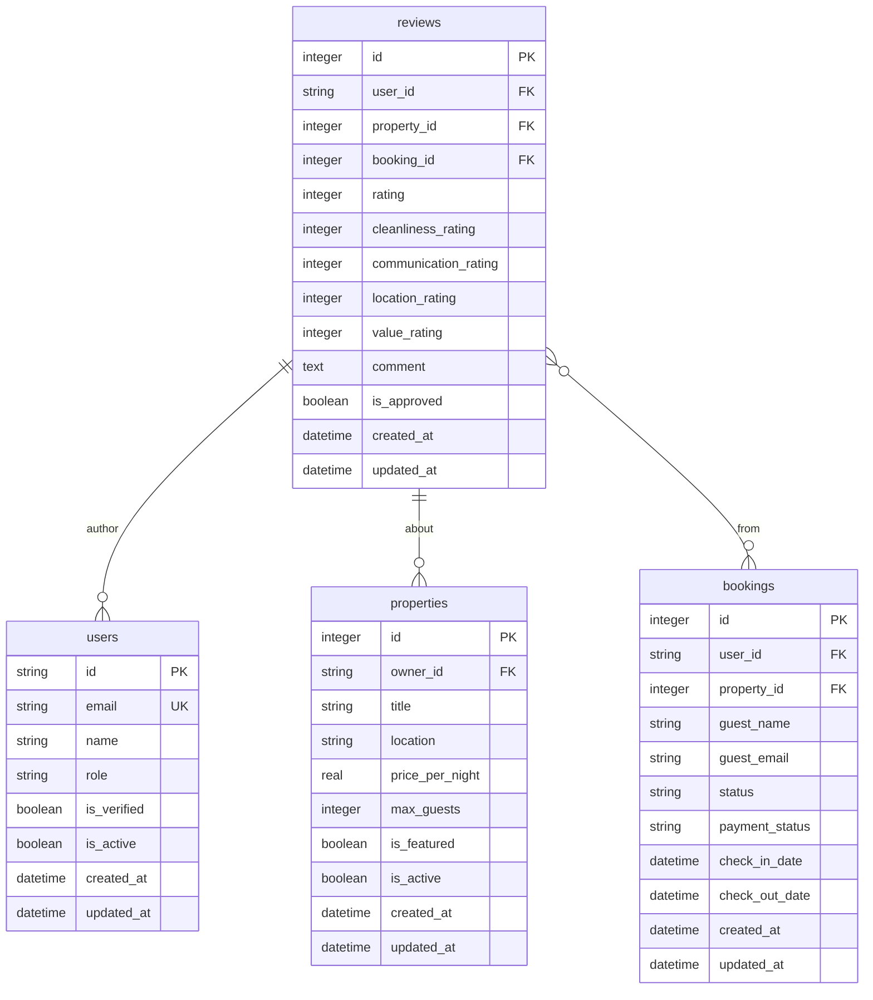
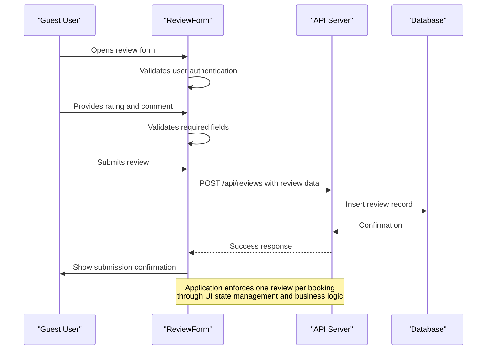

# Reviews Table Schema

<cite>
**Referenced Files in This Document**   
- [3.sql](file://migrations/3.sql)
- [types.ts](file://src/shared/types.ts)
- [ReviewForm.tsx](file://src/react-app/components/ReviewForm.tsx)
- [ReviewSummary.tsx](file://src/react-app/components/ReviewSummary.tsx)
- [1.sql](file://migrations/1.sql)
</cite>

## Table of Contents
1. [Introduction](#introduction)
2. [Reviews Table Schema](#reviews-table-schema)
3. [Referential Integrity Constraints](#referential-integrity-constraints)
4. [Interface Mapping](#interface-mapping)
5. [Business Rules](#business-rules)
6. [Query Patterns](#query-patterns)
7. [Data Quality and Spam Prevention](#data-quality-and-spam-prevention)

## Introduction
This document provides comprehensive documentation for the reviews table in the HabibiStay platform. The reviews table is a critical component of the platform's trust and quality system, enabling guests to share their experiences and helping future guests make informed decisions. This documentation covers the schema definition, relationships with other entities, business rules, and implementation details.

## Reviews Table Schema

The reviews table is defined in the migration file `3.sql` and contains the following fields that capture user feedback on properties:

**Field Definitions:**
- **id**: INTEGER PRIMARY KEY AUTOINCREMENT - Unique identifier for each review
- **user_id**: TEXT NOT NULL - Reference to the user who wrote the review
- **property_id**: INTEGER NOT NULL - Reference to the property being reviewed
- **booking_id**: INTEGER - Optional reference to the specific booking (nullable)
- **rating**: INTEGER NOT NULL CHECK (rating >= 1 AND rating <= 5) - Overall rating from 1 to 5 stars
- **cleanliness_rating**: INTEGER CHECK (cleanliness_rating >= 1 AND cleanliness_rating <= 5) - Cleanliness sub-rating
- **communication_rating**: INTEGER CHECK (communication_rating >= 1 AND communication_rating <= 5) - Host communication sub-rating
- **location_rating**: INTEGER CHECK (location_rating >= 1 AND location_rating <= 5) - Location sub-rating
- **value_rating**: INTEGER CHECK (value_rating >= 1 AND value_rating <= 5) - Value for money sub-rating
- **comment**: TEXT - Written feedback from the guest
- **is_approved**: BOOLEAN DEFAULT 1 - Approval status of the review (1 = approved, 0 = pending)
- **created_at**: DATETIME DEFAULT CURRENT_TIMESTAMP - Timestamp when the review was created
- **updated_at**: DATETIME DEFAULT CURRENT_TIMESTAMP - Timestamp when the review was last updated

The schema includes constraints to ensure data quality, such as the CHECK constraint on the rating field to restrict values between 1 and 5. The is_approved field defaults to 1, indicating that reviews are automatically approved upon submission.

**Section sources**
- [1.sql](file://migrations/1.sql#L150-L170)

## Referential Integrity Constraints

The reviews table maintains referential integrity through foreign key relationships with three core tables in the system:

**Foreign Key Relationships:**
- **users table**: The user_id field references the id field in the users table, establishing that each review is associated with a registered user. This relationship ensures that only authenticated users can submit reviews.
- **properties table**: The property_id field references the id field in the properties table, linking each review to a specific property listing. This enables the aggregation of reviews for property rating calculations.
- **bookings table**: The booking_id field references the id field in the bookings table, creating a connection between a review and the specific booking experience. This field is nullable to accommodate reviews from users who may want to provide feedback without linking to a specific booking.

These foreign key constraints ensure data consistency and prevent orphaned records. The CASCADE behavior is not explicitly defined, meaning that deletion of a referenced record would be prevented if reviews exist, maintaining data integrity.



**Diagram sources**
- [1.sql](file://migrations/1.sql#L150-L170)

## Interface Mapping

The reviews table schema is mapped to the Review interface defined in the shared types file, creating a type-safe contract between the database and application code:

**Review Interface Definition:**
```typescript
export const ReviewSchema = z.object({
  id: z.number(),
  user_id: z.string(),
  property_id: z.number(),
  booking_id: z.number().nullable(),
  rating: z.number().int().min(1).max(5),
  comment: z.string().nullable(),
  created_at: z.string(),
  updated_at: z.string(),
});
```

**Field Mapping:**
- **id**: Maps directly between database and interface
- **user_id**: String type in both database and interface
- **property_id**: Integer in database, number in TypeScript interface
- **booking_id**: Nullable integer in database, nullable number in interface
- **rating**: Integer with CHECK constraint in database, number with min/max validation in interface
- **comment**: TEXT in database, nullable string in interface
- **created_at** and **updated_at**: DATETIME in database, string in interface (ISO format)

The CreateReviewSchema interface extends this with optional fields for review creation:
```typescript
export const CreateReviewSchema = z.object({
  property_id: z.number(),
  booking_id: z.number().optional(),
  rating: z.number().int().min(1).max(5),
  comment: z.string().optional(),
});
```

This mapping ensures type safety throughout the application and provides validation rules that mirror database constraints.

**Section sources**
- [types.ts](file://src/shared/types.ts#L100-L115)

## Business Rules

The review system implements several business rules to ensure authenticity, prevent abuse, and maintain data quality:

### One Review Per Booking
The system enforces a business rule that allows only one review per booking. While the database schema does not include a unique constraint to enforce this at the database level, the application enforces this rule through the following mechanisms:

1. The ReviewForm component accepts a bookingId parameter, which is used to associate the review with a specific booking.
2. The frontend prevents multiple submissions by disabling the submit button during processing and showing a success state after submission.
3. The business logic assumes that each booking should generate at most one review, as reflected in the nullable booking_id field.

### Verification Logic
The system implements a verification process to ensure review authenticity:

- The is_approved field in the reviews table serves as a moderation flag, with a default value of 1 (approved).
- User verification is tied to the is_verified field in the users table, which is set to 0 by default and updated when users complete identity verification.
- Verified users (is_verified = 1) have their reviews given higher weight in calculations and display.
- The platform may implement additional verification steps for hosts, as indicated in the Terms page, which mentions identity verification for certain activities.

### Review Submission Process
The review submission process follows these steps:
1. Users must be authenticated to submit a review (checked in ReviewForm).
2. Users must provide an overall rating (validation prevents submission with rating = 0).
3. Users can optionally provide category ratings (cleanliness, communication, location, value).
4. Users can add a written comment (optional but encouraged).
5. The review is submitted via POST request to /api/reviews.
6. Upon successful submission, the UI shows a confirmation message.



**Diagram sources**
- [ReviewForm.tsx](file://src/react-app/components/ReviewForm.tsx#L0-L289)
- [1.sql](file://migrations/1.sql#L150-L170)

**Section sources**
- [ReviewForm.tsx](file://src/react-app/components/ReviewForm.tsx#L0-L289)

## Query Patterns

The system implements several query patterns to support review functionality and analytics:

### Average Rating Calculation
The average rating per property is calculated using the following pattern:

```sql
SELECT 
    property_id,
    AVG(rating) as average_rating,
    COUNT(*) as review_count,
    AVG(cleanliness_rating) as avg_cleanliness,
    AVG(communication_rating) as avg_communication,
    AVG(location_rating) as avg_location,
    AVG(value_rating) as avg_value
FROM reviews 
WHERE property_id = ? 
    AND is_approved = 1
GROUP BY property_id;
```

The frontend component ReviewSummary.tsx implements this calculation in the client:
- Receives averageRating and categoryRatings as props
- Displays the average rating with one decimal place
- Shows category-specific averages in a visual breakdown
- Calculates rating distribution percentages for the histogram

### Recent Verified Reviews Retrieval
To retrieve recent verified reviews for display:

```sql
SELECT r.*, u.name as user_name, u.avatar as user_avatar
FROM reviews r
JOIN users u ON r.user_id = u.id
WHERE r.property_id = ?
    AND r.is_approved = 1
    AND u.is_verified = 1
ORDER BY r.created_at DESC
LIMIT 10;
```

The ReviewList component implements pagination and filtering:
- Fetches reviews with user information for display
- Orders by created_at in descending order
- Implements "Load More" functionality for pagination
- Displays verified user indicators

### Review Aggregation for Property Listings
For property listing cards, the system calculates summary statistics:

```sql
SELECT 
    p.id,
    p.title,
    p.price_per_night,
    AVG(r.rating) as avg_rating,
    COUNT(r.id) as review_count
FROM properties p
LEFT JOIN reviews r ON p.id = r.property_id AND r.is_approved = 1
GROUP BY p.id, p.title, p.price_per_night;
```

The frontend displays these metrics prominently in property cards, showing the average rating and review count to help users evaluate properties.

**Section sources**
- [ReviewSummary.tsx](file://src/react-app/components/ReviewSummary.tsx#L0-L219)

## Data Quality and Spam Prevention

The system implements multiple layers of validation and business rules to maintain data quality and prevent review spam:

### Application-Level Validation
The ReviewForm component enforces several validation rules:
- **Authentication check**: Users must be signed in to submit a review
- **Rating requirement**: Users must provide an overall rating (cannot submit with rating = 0)
- **Input validation**: Comment field has character limits and guidelines
- **State management**: Form prevents multiple submissions through loading states

```typescript
if (!user) {
  alert('Please sign in to submit a review');
  return;
}

if (review.rating === 0) {
  alert('Please provide an overall rating');
  return;
}
```

### Category Rating System
The system uses a detailed rating system to encourage thoughtful reviews:
- Four category ratings: cleanliness, communication, location, and value
- Each category rated from 1 to 5 stars
- Overall rating is automatically calculated as the average of category ratings
- This structure encourages users to consider multiple aspects of their experience

### Review Guidelines
The platform provides clear guidelines to promote constructive feedback:
- "Be honest and fair in your review"
- "Focus on your personal experience"
- "Avoid discriminatory or offensive language"
- "Reviews are public and help other guests"

These guidelines are displayed in the review form to set expectations for appropriate content.

### Moderation and Approval
The system includes moderation capabilities:
- The is_approved field allows for manual or automated review of submissions
- Default value of 1 enables immediate visibility while allowing for future moderation needs
- The platform can implement additional spam detection algorithms that update the is_approved status

### Frontend Anti-Spam Measures
The UI implementation includes several anti-spam features:
- Loading states prevent duplicate submissions
- Success confirmation prevents form resubmission
- Character limits and counters for comments
- Clear visual feedback on submission status

These measures work together to ensure that the review system maintains high data quality while providing a smooth user experience for legitimate reviewers.

**Section sources**
- [ReviewForm.tsx](file://src/react-app/components/ReviewForm.tsx#L0-L289)
- [ReviewSummary.tsx](file://src/react-app/components/ReviewSummary.tsx#L0-L219)