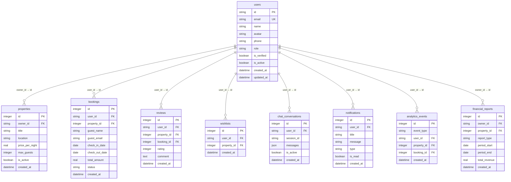

# Users Table Schema

<cite>
**Referenced Files in This Document**   
- [1.sql](file://migrations/1.sql#L1-L20)
- [types.ts](file://src/shared/types.ts#L292-L300)
- [AuthCallback.tsx](file://src/react-app/pages/AuthCallback.tsx#L1-L106)
- [index.ts](file://src/worker/index.ts#L185)
</cite>

## Table of Contents
1. [Users Table Schema](#users-table-schema)
2. [Field Definitions and Constraints](#field-definitions-and-constraints)
3. [Type Mapping to User Interface](#type-mapping-to-user-interface)
4. [Indexing and Performance Considerations](#indexing-and-performance-considerations)
5. [Entity Relationships](#entity-relationships)
6. [Google OAuth Integration and User Creation](#google-oauth-integration-and-user-creation)
7. [Common Queries and Access Patterns](#common-queries-and-access-patterns)

## Field Definitions and Constraints

The `users` table is the central identity store in HabibiStay's database, serving as the foundation for user authentication, authorization, and personalization. It is defined in the initial database migration file and contains essential user profile and system metadata.

**Field Descriptions:**

- **id**: `TEXT PRIMARY KEY`  
  A unique identifier for the user, typically generated as a UUID or derived from an external identity provider (e.g., Google). This field serves as the primary key and is used as a foreign key in related tables.

- **email**: `TEXT UNIQUE NOT NULL`  
  The user's email address, which must be unique across the system and is required for login and communication. Enforces data integrity via a `UNIQUE` constraint.

- **name**: `TEXT NOT NULL`  
  The full name of the user as provided during registration or retrieved from the OAuth provider. This is a required field for user identification in the UI.

- **avatar**: `TEXT`  
  A URL pointing to the user's profile picture. This is optional and is often populated from the Google OAuth profile.

- **phone**: `TEXT`  
  The user's contact phone number, stored as a string to accommodate international formats. Optional field.

- **role**: `TEXT DEFAULT 'guest' CHECK (role IN ('guest', 'host', 'admin'))`  
  Defines the user's permission level within the system:
  - `guest`: Standard user who can book properties.
  - `host`: User who can list and manage properties.
  - `admin`: System administrator with elevated privileges.
  The `CHECK` constraint ensures only valid roles are stored.

- **is_verified**: `BOOLEAN DEFAULT 0`  
  Indicates whether the user's email has been verified. Defaults to `false` (0). Google OAuth sign-ins typically set this to `true` upon successful authentication.

- **is_active**: `BOOLEAN DEFAULT 1`  
  A soft delete flag. If `false`, the user is deactivated but their data remains in the system. Defaults to `true` (1).

- **created_at**: `DATETIME DEFAULT CURRENT_TIMESTAMP`  
  Timestamp of when the user record was created.

- **updated_at**: `DATETIME DEFAULT CURRENT_TIMESTAMP`  
  Timestamp of the last update to the user record. Automatically updated on modifications.

**Section sources**
- [1.sql](file://migrations/1.sql#L1-L20)

## Type Mapping to User Interface

The database schema is mirrored in the frontend and backend TypeScript code through the `User` interface defined in `types.ts`. This ensures type consistency across the full stack and enables type-safe operations.

```typescript
export const UserSchema = z.object({
  id: z.string(),
  email: z.string().email(),
  name: z.string(),
  avatar: z.string().optional(),
  phone: z.string().optional(),
  role: z.enum(['guest', 'host', 'admin']),
  is_verified: z.boolean(),
  is_active: z.boolean(),
  created_at: z.string(),
  updated_at: z.string(),
});

export type User = z.infer<typeof UserSchema>;
```

**Schema Alignment:**
- All fields in the database have corresponding properties in the `User` type.
- Data types are consistently mapped (e.g., `TEXT` → `string`, `BOOLEAN` → `boolean`).
- Constraints are enforced at the application level using Zod validation (e.g., `email()` validator, `enum` for role).
- Optional fields (`avatar`, `phone`) are marked with `.optional()` in Zod, matching their nullable nature in the database.

This type is used throughout the application for:
- API request/response payloads
- React component props and state
- Form validation
- Database query results

**Section sources**
- [types.ts](file://src/shared/types.ts#L292-L300)

## Indexing and Performance Considerations

While the schema does not explicitly define additional indexes beyond the primary key, the following fields are natural candidates for indexing due to their frequent use in lookup operations:

- **email**: Frequently queried during login and user lookup. A unique constraint already creates a unique index, ensuring O(log n) lookup performance.
- **id**: The primary key is automatically indexed, enabling fast retrieval by user ID.

**Performance Implications:**
- Queries filtering by `email` or `id` will be efficient due to existing indexes.
- Lookups by `google_id` are not directly supported in the current schema. If Google ID becomes a primary lookup key, a new `google_id` column with a unique index should be added.
- The absence of an index on `role` means role-based queries (e.g., finding all admins) will require a full table scan. If such queries are common, an index on `role` should be considered.

```sql
-- Example: Adding an index for role-based queries if needed
CREATE INDEX idx_users_role ON users(role);
```

**Section sources**
- [1.sql](file://migrations/1.sql#L1-L20)

## Entity Relationships

The `users` table is the central hub of the HabibiStay data model, with multiple entities referencing it via foreign keys. These relationships enforce referential integrity and enable rich user-centric queries.



**Diagram sources**
- [1.sql](file://migrations/1.sql#L1-L260)

**Key Relationships:**
- **Properties**: A user (as a host) can own multiple properties (`owner_id` references `users.id`).
- **Bookings**: A user (as a guest) can make multiple bookings (`user_id` references `users.id`).
- **Reviews**: A user can write reviews for properties they've booked.
- **Wishlists**: Users can save properties to their wishlist.
- **Chat Conversations**: Users can have multiple AI chat sessions.
- **Notifications**: Users receive personalized notifications.
- **Analytics Events**: User actions are tracked for analytics.
- **Financial Reports**: Hosts receive financial reports for their properties.

## Google OAuth Integration and User Creation

HabibiStay uses Google OAuth for user authentication, which directly impacts user creation and management. The flow is implemented in the `AuthCallback` page and backend API.

**Authentication Flow:**
1. User clicks "Sign in with Google" on the frontend.
2. Redirected to Google's OAuth consent screen.
3. Upon approval, Google redirects back to `/auth/callback` with an authorization `code`.
4. The `AuthCallback` component exchanges this code with the backend for a session.

```tsx
// AuthCallback.tsx
const response = await fetch('/api/sessions', {
  method: 'POST',
  headers: { 'Content-Type': 'application/json' },
  body: JSON.stringify({ code }),
});
```

**User Creation Logic (Backend):**
- The backend (`/api/sessions`) verifies the Google `id_token`.
- If the user's email exists in the database, they are logged in.
- If the email does not exist, a new user record is created with:
  - `id`: Generated or taken from Google's `sub` claim
  - `email`: From Google's profile
  - `name`: From Google's profile
  - `avatar`: URL to Google profile picture
  - `is_verified`: Set to `true` (since Google verified the email)
  - `role`: Defaults to `'guest'`
- A session is created, and the user is redirected to the dashboard.

This integration ensures a seamless sign-up experience while maintaining data consistency and security.

**Section sources**
- [AuthCallback.tsx](file://src/react-app/pages/AuthCallback.tsx#L1-L106)
- [1.sql](file://migrations/1.sql#L1-L20)

## Common Queries and Access Patterns

The `users` table is accessed through several key endpoints, reflecting common application workflows.

**1. Get Current User Profile**
Used to populate the dashboard, navbar, and profile pages.

```sql
SELECT id, name, email, avatar, phone, role, is_verified, is_active, created_at, updated_at 
FROM users 
WHERE id = ?;
```

**API Endpoint:**
```ts
// src/worker/index.ts
app.get("/api/users/me", authMiddleware, async (c) => {
  const userId = c.get("userId");
  const user = await db.query.users.findFirst({
    where: eq(users.id, userId)
  });
  return c.json(user);
});
```

**Performance:** O(log n) due to primary key lookup.

**2. Find User by Email**
Used during login and user management.

```sql
SELECT id, email, role, is_verified, is_active 
FROM users 
WHERE email = ?;
```

**Performance:** O(log n) due to unique index on `email`.

**3. Update User Profile**
Allows users to update their information.

```sql
UPDATE users 
SET name = ?, avatar = ?, phone = ?, updated_at = CURRENT_TIMESTAMP 
WHERE id = ?;
```

**Best Practices:**
- Always use parameterized queries to prevent SQL injection.
- Update `updated_at` timestamp on modifications.
- Validate input using Zod schemas before database operations.
- Use transactions for multi-table updates (e.g., updating user and profile).

**Section sources**
- [index.ts](file://src/worker/index.ts#L185)
- [1.sql](file://migrations/1.sql#L1-L20)
- [types.ts](file://src/shared/types.ts#L292-L300)