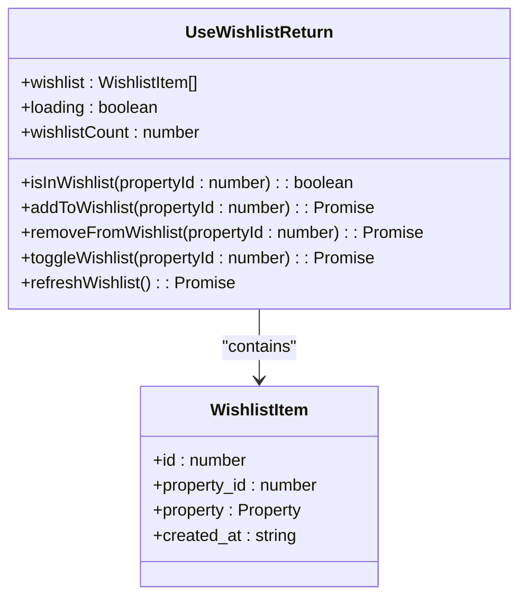
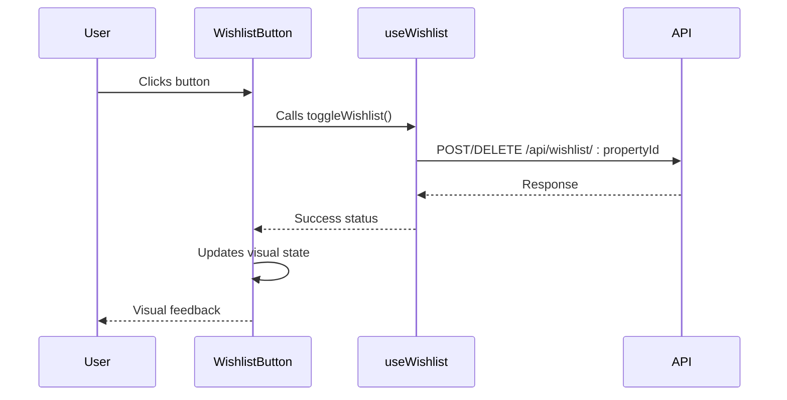
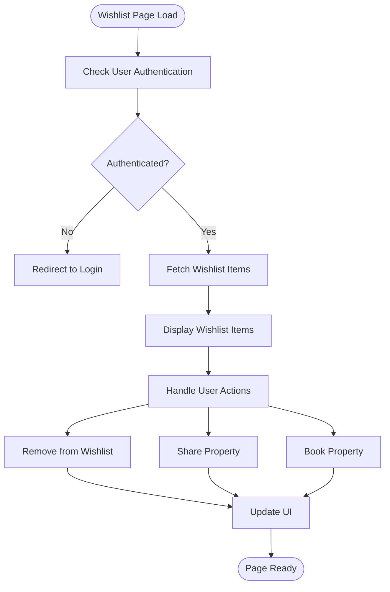
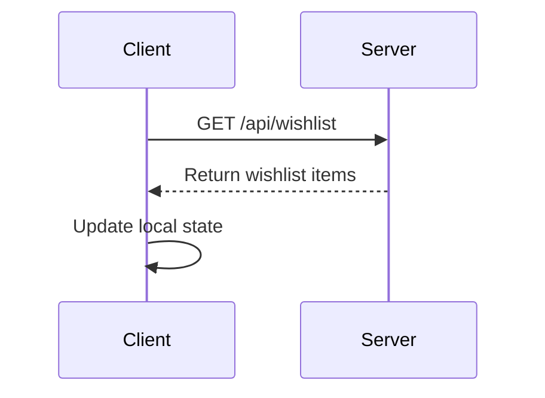
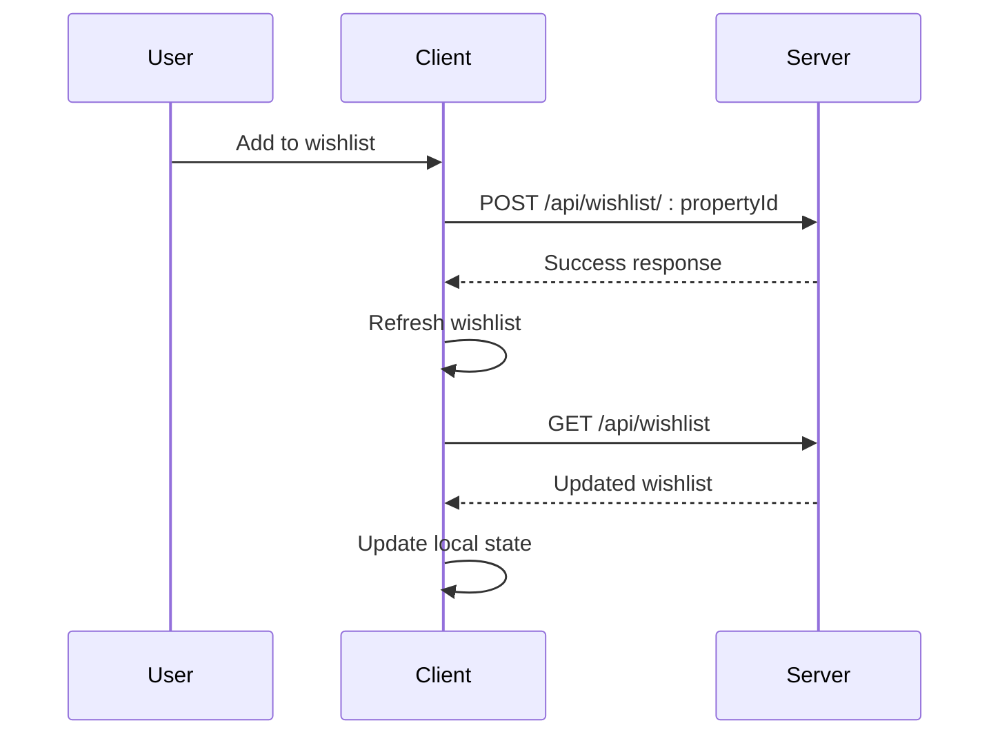

# Wishlist Table Schema

<cite>
**Referenced Files in This Document**   
- [migrations/1.sql](file://migrations/1.sql#L76-L100)
- [src/shared/types.ts](file://src/shared/types.ts#L50-L58)
- [src/worker/index.ts](file://src/worker/index.ts#L600-L684)
- [src/react-app/hooks/useWishlist.ts](file://src/react-app/hooks/useWishlist.ts#L0-L121)
- [src/react-app/components/WishlistButton.tsx](file://src/react-app/components/WishlistButton.tsx#L0-L118)
- [src/react-app/pages/Wishlist.tsx](file://src/react-app/pages/Wishlist.tsx#L0-L295)
</cite>

## Table of Contents
1. [Introduction](#introduction)
2. [Wishlist Table Schema](#wishlist-table-schema)
3. [TypeScript Type Definitions](#typescript-type-definitions)
4. [Backend API Implementation](#backend-api-implementation)
5. [Frontend Implementation](#frontend-implementation)
6. [Query Patterns](#query-patterns)
7. [Performance Considerations](#performance-considerations)
8. [Wishlist Synchronization](#wishlist-synchronization)

## Introduction
This document provides comprehensive documentation for the wishlist table schema and its implementation in the HabibiStay application. The wishlist functionality enables users to save properties they are interested in for future reference and booking. The system consists of a database schema, backend API endpoints, and frontend components that work together to provide a seamless user experience. This documentation covers the structure of the wishlist table, its relationship with other entities, the TypeScript type definitions, and the implementation details on both the frontend and backend.

**Section sources**
- [migrations/1.sql](file://migrations/1.sql#L76-L100)
- [src/shared/types.ts](file://src/shared/types.ts#L50-L58)

## Wishlist Table Schema
The wishlist table is designed to establish a many-to-many relationship between users and properties, allowing users to save multiple properties to their wishlist and properties to be saved by multiple users.

### Schema Definition
The wishlist table is defined in the database migration file with the following structure:

```sql
CREATE TABLE wishlists (
  id INTEGER PRIMARY KEY AUTOINCREMENT,
  user_id TEXT NOT NULL,
  property_id INTEGER NOT NULL,
  created_at DATETIME DEFAULT CURRENT_TIMESTAMP,
  UNIQUE(user_id, property_id),
  FOREIGN KEY (user_id) REFERENCES users(id),
  FOREIGN KEY (property_id) REFERENCES properties(id)
);
```

### Field Descriptions
- **id**: Primary key that uniquely identifies each wishlist entry. This is an auto-incrementing integer that serves as the unique identifier for each record in the table.
- **user_id**: Foreign key that references the user who created the wishlist entry. This field is of type TEXT to accommodate various user ID formats, particularly those from external authentication providers.
- **property_id**: Foreign key that references the property that has been added to the wishlist. This field is of type INTEGER to match the primary key type of the properties table.
- **created_at**: Timestamp that records when the wishlist entry was created. This field defaults to the current timestamp when a new record is inserted, enabling sorting and filtering of wishlist items by creation date.

### Constraints and Indexes
The table includes several constraints to ensure data integrity:
- **Primary Key Constraint**: The `id` field is designated as the primary key, ensuring each wishlist entry has a unique identifier.
- **Unique Constraint**: The combination of `user_id` and `property_id` is defined as unique with `UNIQUE(user_id, property_id)`, preventing a user from adding the same property to their wishlist multiple times.
- **Foreign Key Constraints**: The table has foreign key relationships with both the `users` and `properties` tables, ensuring referential integrity. These constraints prevent the creation of wishlist entries for non-existent users or properties.

### Relationship Modeling
The wishlist table serves as a junction table in a many-to-many relationship between users and properties. This design pattern allows:
- A single user to have multiple properties in their wishlist
- A single property to be included in multiple users' wishlists
- Efficient querying of a user's wishlist items
- Prevention of duplicate entries through the unique constraint

**Section sources**
- [migrations/1.sql](file://migrations/1.sql#L76-L100)

## TypeScript Type Definitions
The TypeScript type definitions provide a strongly-typed interface for the wishlist functionality, ensuring type safety across the application.

### Wishlist Schema Definition
The wishlist schema is defined in the shared types module using Zod for validation:

```typescript
export const WishlistSchema = z.object({
  id: z.number(),
  user_id: z.string(),
  property_id: z.number(),
  created_at: z.string(),
  updated_at: z.string(),
});
```

### Type Inference
The schema is used to infer the corresponding TypeScript type:

```typescript
export type Wishlist = z.infer<typeof WishlistSchema>;
```

### Wishlist Item Interface
In addition to the schema, there is an interface for wishlist items that includes the associated property data:

```typescript
interface WishlistItem {
  id: number;
  property_id: number;
  property: Property;
  created_at: string;
}
```

This interface extends the basic wishlist data by including the complete property object, which is useful for displaying wishlist items in the user interface without requiring additional API calls to fetch property details.

### UseWishlist Return Type
The `useWishlist` hook defines a comprehensive return type that exposes all wishlist functionality to components:

```typescript
interface UseWishlistReturn {
  wishlist: WishlistItem[];
  loading: boolean;
  isInWishlist: (propertyId: number) => boolean;
  addToWishlist: (propertyId: number) => Promise<boolean>;
  removeFromWishlist: (propertyId: number) => Promise<boolean>;
  toggleWishlist: (propertyId: number) => Promise<boolean>;
  refreshWishlist: () => Promise<void>;
  wishlistCount: number;
}
```

This type defines the complete API surface for wishlist functionality, including methods for checking, adding, removing, and toggling wishlist status, as well as utility functions for refreshing the wishlist and getting the count of items.

**Section sources**
- [src/shared/types.ts](file://src/shared/types.ts#L50-L58)

## Backend API Implementation
The backend API provides RESTful endpoints for managing wishlist functionality, implemented using a worker-based architecture.

### GET /api/wishlist
This endpoint retrieves all wishlist items for the authenticated user:

```typescript
app.get("/api/wishlist", authMiddleware, async (c) => {
  const user = c.get("user");
  if (!user) {
    return c.json<ApiResponse>({
      success: false,
      error: "User not authenticated",
    }, 401);
  }

  const { results } = await c.env.DB.prepare(`
    SELECT w.*, p.* FROM wishlists w
    JOIN properties p ON w.property_id = p.id
    WHERE w.user_id = ? AND p.is_active = 1
    ORDER BY w.created_at DESC
  `).bind(user.id).all();

  const wishlistItems = results.map((row: any) => ({
    id: row.id,
    property_id: row.property_id,
    created_at: row.created_at,
    property: {
      id: row.property_id,
      user_id: row.user_id,
      title: row.title,
      description: row.description,
      location: row.location,
      price_per_night: row.price_per_night,
      max_guests: row.max_guests,
      bedrooms: row.bedrooms,
      bathrooms: row.bathrooms,
      amenities: row.amenities,
      images: row.images,
      is_featured: row.is_featured,
      is_active: row.is_active,
      created_at: row.property_created_at,
      updated_at: row.property_updated_at,
    }
  }));

  return c.json<ApiResponse>({
    success: true,
    data: wishlistItems,
  });
});
```

The implementation joins the wishlists table with the properties table to include complete property details in the response. It also filters for active properties only and orders results by creation date in descending order.

### POST /api/wishlist/:propertyId
This endpoint adds a property to the authenticated user's wishlist:

```typescript
app.post("/api/wishlist/:propertyId", authMiddleware, async (c) => {
  const user = c.get("user");
  if (!user) {
    return c.json<ApiResponse>({
      success: false,
      error: "User not authenticated",
    }, 401);
  }

  const propertyId = c.req.param("propertyId");

  // Check if already in wishlist
  const existing = await c.env.DB.prepare(
    "SELECT id FROM wishlists WHERE user_id = ? AND property_id = ?"
  ).bind(user.id, propertyId).first();

  if (existing) {
    return c.json<ApiResponse>({
      success: false,
      error: "Property already in wishlist",
    }, 400);
  }

  const { success } = await c.env.DB.prepare(`
    INSERT INTO wishlists (user_id, property_id)
    VALUES (?, ?)
  `).bind(user.id, propertyId).run();

  return c.json<ApiResponse>({
    success,
    message: success ? "Added to wishlist" : "Failed to add to wishlist",
  });
});
```

The implementation first checks if the property is already in the user's wishlist to prevent duplicates, then inserts the new record if it doesn't exist.

### DELETE /api/wishlist/:propertyId
This endpoint removes a property from the authenticated user's wishlist:

```typescript
app.delete("/api/wishlist/:propertyId", authMiddleware, async (c) => {
  const user = c.get("user");
  if (!user) {
    return c.json<ApiResponse>({
      success: false,
      error: "User not authenticated",
    }, 401);
  }

  const propertyId = c.req.param("propertyId");

  const { success } = await c.env.DB.prepare(`
    DELETE FROM wishlists WHERE user_id = ? AND property_id = ?
  `).bind(user.id, propertyId).run();

  return c.json<ApiResponse>({
    success,
    message: success ? "Removed from wishlist" : "Failed to remove from wishlist",
  });
});
```

The implementation deletes the wishlist entry for the specified property and user, returning a success status and message.

**Section sources**
- [src/worker/index.ts](file://src/worker/index.ts#L600-L684)

## Frontend Implementation
The frontend implementation of the wishlist functionality consists of reusable components and custom hooks that provide a seamless user experience.

### useWishlist Hook
The `useWishlist` custom hook provides a comprehensive API for managing wishlist functionality:



**Diagram sources**
- [src/react-app/hooks/useWishlist.ts](file://src/react-app/hooks/useWishlist.ts#L0-L121)

The hook manages the state of the wishlist, provides methods for interacting with the backend API, and exposes utility functions for common operations.

### WishlistButton Component
The `WishlistButton` component provides a reusable UI element for adding and removing properties from the wishlist:



**Diagram sources**
- [src/react-app/components/WishlistButton.tsx](file://src/react-app/components/WishlistButton.tsx#L0-L118)

The component handles authentication checks, provides visual feedback through animations, and integrates with the `useWishlist` hook to manage the wishlist state.

### Wishlist Page
The `Wishlist` page component displays all items in the user's wishlist:



**Diagram sources**
- [src/react-app/pages/Wishlist.tsx](file://src/react-app/pages/Wishlist.tsx#L0-L295)

The page component handles authentication, data fetching, and provides a rich user interface for managing wishlist items, including filtering, sorting, and sharing functionality.

**Section sources**
- [src/react-app/hooks/useWishlist.ts](file://src/react-app/hooks/useWishlist.ts#L0-L121)
- [src/react-app/components/WishlistButton.tsx](file://src/react-app/components/WishlistButton.tsx#L0-L118)
- [src/react-app/pages/Wishlist.tsx](file://src/react-app/pages/Wishlist.tsx#L0-L295)

## Query Patterns
The wishlist functionality employs several query patterns to support different use cases.

### Checking Wishlist Status
To check if a specific property is in a user's wishlist, the application uses a direct query with the user_id and property_id:

```sql
SELECT id FROM wishlists WHERE user_id = ? AND property_id = ?
```

This query is used in both the backend (to prevent duplicate entries) and can be replicated on the frontend by checking the local wishlist state. The unique constraint on the user_id and property_id combination ensures this query will return at most one result.

### Retrieving All Wishlist Items
To retrieve all wishlist items for a user, the application uses a JOIN query to include property details:

```sql
SELECT w.*, p.* FROM wishlists w
JOIN properties p ON w.property_id = p.id
WHERE w.user_id = ? AND p.is_active = 1
ORDER BY w.created_at DESC
```

This query joins the wishlists table with the properties table to include complete property information in the result set. It filters for active properties only and orders the results by creation date in descending order to show the most recently added items first.

### Counting Wishlist Items
The application can count wishlist items either through a dedicated query or by counting the results from the retrieval query:

```sql
SELECT COUNT(*) FROM wishlists WHERE user_id = ?
```

However, in the current implementation, the count is derived from the length of the wishlist array on the frontend, which is more efficient as it avoids an additional database query.

## Performance Considerations
The wishlist implementation includes several performance optimizations to ensure a responsive user experience.

### Database Indexing
While the schema does not explicitly define indexes beyond the primary key and unique constraint, the unique constraint on (user_id, property_id) implicitly creates a composite index. This index optimizes queries that filter by both user_id and property_id, such as the check for existing wishlist items and the retrieval of a user's wishlist.

The composite index on (user_id, property_id) provides the following performance benefits:
- Fast lookup for checking if a specific property is in a user's wishlist
- Efficient retrieval of all wishlist items for a specific user
- Prevention of duplicate entries without requiring additional queries

### Frontend Caching
The `useWishlist` hook implements client-side caching by storing the wishlist data in React state. This reduces the number of API calls to the backend:

- The wishlist is fetched once when the hook is initialized
- The data is stored in the component state and reused across renders
- The `refreshWishlist` function allows explicit refreshing when needed
- The `isInWishlist` function checks the local state rather than making an API call

### Optimized Data Fetching
The backend API optimizes data fetching by:
- Using a single query with a JOIN to retrieve both wishlist and property data
- Filtering for active properties only to avoid showing unavailable listings
- Ordering results by creation date to provide a logical presentation
- Returning only the necessary data fields to minimize payload size

### Request Batching
The implementation avoids unnecessary requests by:
- Checking the local wishlist state before making API calls
- Using the `toggleWishlist` function to handle both add and remove operations
- Debouncing rapid consecutive requests to prevent overwhelming the server

## Wishlist Synchronization
The wishlist functionality implements a synchronization strategy between the client and server to ensure data consistency.

### Initial Synchronization
When the `useWishlist` hook is initialized, it synchronizes the client state with the server:



This initial synchronization ensures that the client has the most up-to-date wishlist data when the component mounts.

### Real-time Synchronization
After initial synchronization, the application maintains consistency through targeted updates:



When a user adds or removes a property from their wishlist, the client makes the appropriate API call and then refreshes the entire wishlist to ensure consistency.

### Conflict Resolution
The system handles potential conflicts through the following mechanisms:
- The unique constraint prevents duplicate entries at the database level
- The backend checks for existing entries before insertion
- The frontend uses the `isInWishlist` function to prevent redundant operations
- Error handling in the API routes provides clear feedback for failed operations

### Offline Support
While the current implementation does not include offline support, the architecture allows for potential enhancements:
- The local state in the `useWishlist` hook could be persisted to localStorage
- API calls could be queued when offline and synchronized when connectivity is restored
- Optimistic updates could provide immediate feedback while waiting for server confirmation

The current implementation prioritizes simplicity and data consistency over offline capabilities, ensuring that the wishlist state is always synchronized with the server.