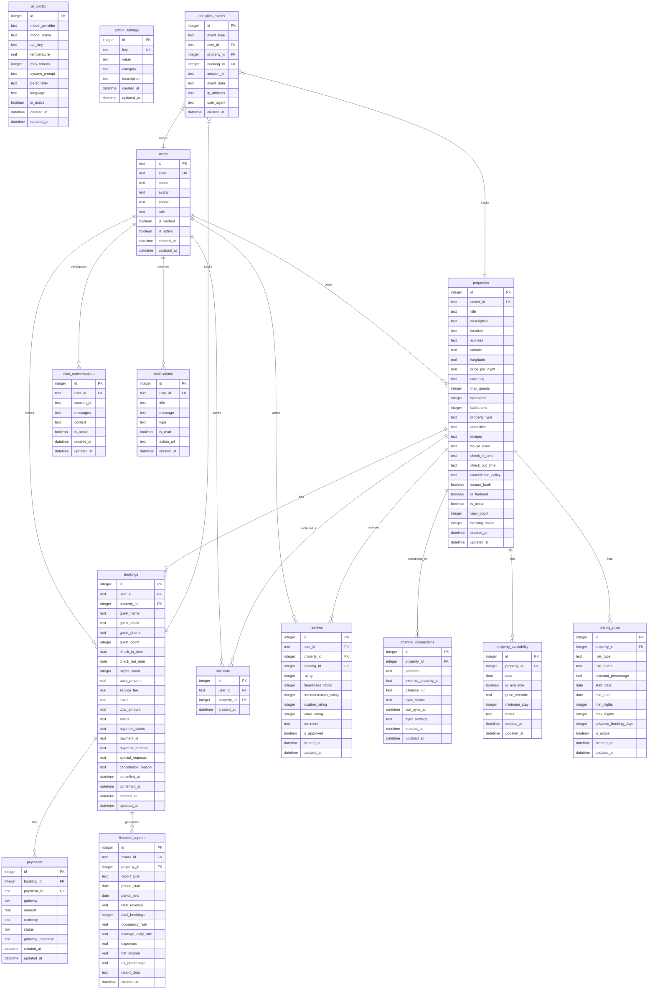

# Migration Strategy and Versioning

<cite>
**Referenced Files in This Document**   
- [migrations/1.sql](file://migrations/1.sql)
- [migrations/2.sql](file://migrations/2.sql)
- [migrations/3.sql](file://migrations/3.sql)
- [migrations/4.sql](file://migrations/4.sql)
- [migrations/5.sql](file://migrations/5.sql)
- [migrations/6.sql](file://migrations/6.sql)
- [migrations/7.sql](file://migrations/7.sql)
- [migrations/8.sql](file://migrations/8.sql)
- [migrations/9.sql](file://migrations/9.sql)
- [migrations/1/down.sql](file://migrations/1/down.sql)
- [migrations/2/down.sql](file://migrations/2/down.sql)
- [migrations/3/down.sql](file://migrations/3/down.sql)
- [migrations/4/down.sql](file://migrations/4/down.sql)
- [migrations/5/down.sql](file://migrations/5/down.sql)
- [migrations/6/down.sql](file://migrations/6/down.sql)
- [migrations/7/down.sql](file://migrations/7/down.sql)
</cite>

## Table of Contents
1. [Introduction](#introduction)
2. [Versioning and Migration Structure](#versioning-and-migration-structure)
3. [Schema Evolution Patterns](#schema-evolution-patterns)
4. [Data Seeding and Initialization](#data-seeding-and-initialization)
5. [Rollback Procedures and down.sql Files](#rollback-procedures-and-downsql-files)
6. [Idempotency and Transaction Safety](#idempotency-and-transaction-safety)
7. [CI/CD Integration and Migration Application](#cicd-integration-and-migration-application)
8. [Best Practices for New Migrations](#best-practices-for-new-migrations)
9. [Security and Audit Migrations](#security-and-audit-migrations)
10. [Conclusion](#conclusion)

## Introduction

HabibiStay implements a robust database migration strategy using incremental SQL scripts to manage schema evolution and data changes across development, staging, and production environments. This documentation details the migration framework, versioning discipline, and operational procedures that ensure reliable database changes throughout the application lifecycle. The system uses forward migration files (N.sql) for schema updates and backward migration files (N/down.sql) for rollback capabilities, enabling safe and reversible database modifications.

The migration strategy supports both structural changes (schema alterations) and data changes (seeding, configuration), with careful attention to transaction safety, idempotency, and production safety. This approach allows the development team to evolve the database schema incrementally while maintaining data integrity and providing rollback capabilities when needed.

## Versioning and Migration Structure

HabibiStay employs a sequential integer-based versioning system for database migrations, with each migration represented by a directory and corresponding SQL files. The structure follows a clear pattern where each migration number corresponds to a specific evolutionary step in the database schema.

The migration system consists of:
- Forward migration scripts (N.sql): Apply changes to the database
- Rollback scripts (N/down.sql): Revert changes made by the corresponding forward migration
- Sequential numbering: Ensures ordered application of migrations

This versioning approach provides several advantages:
- Clear audit trail of database changes
- Deterministic application order
- Easy identification of migration purpose by sequence
- Simplified rollback procedures

The migration files are stored in the `migrations/` directory, with each migration having both a forward script and, when applicable, a corresponding rollback script. This structure enables the migration system to track which migrations have been applied and to safely roll back changes when necessary.

**Section sources**
- [migrations/1.sql](file://migrations/1.sql#L1-L260)
- [migrations/2.sql](file://migrations/2.sql#L1-L12)
- [migrations/3.sql](file://migrations/3.sql#L1-L36)

## Schema Evolution Patterns

The migration files demonstrate several key schema evolution patterns that illustrate how HabibiStay's database has evolved from initial setup to advanced features.

### Initial Schema Setup (Migration 1)

The foundational migration (1.sql) establishes the core data model with comprehensive tables for users, properties, bookings, and related entities:



**Diagram sources**
- [migrations/1.sql](file://migrations/1.sql#L1-L260)

**Section sources**
- [migrations/1.sql](file://migrations/1.sql#L1-L260)

### Incremental Schema Additions

Subsequent migrations demonstrate the pattern of incremental schema additions:

**Migration 4**: Introduced user profiles and notification settings with new tables:
```sql
CREATE TABLE user_profiles (
  id INTEGER PRIMARY KEY AUTOINCREMENT,
  user_id TEXT NOT NULL UNIQUE,
  full_name TEXT,
  phone TEXT,
  address TEXT,
  city TEXT,
  country TEXT DEFAULT 'Saudi Arabia',
  date_of_birth DATE,
  preferred_language TEXT DEFAULT 'en',
  currency TEXT DEFAULT 'SAR',
  bio TEXT,
  avatar_url TEXT,
  created_at DATETIME DEFAULT CURRENT_TIMESTAMP,
  updated_at DATETIME DEFAULT CURRENT_TIMESTAMP
);

CREATE TABLE notification_settings (
  id INTEGER PRIMARY KEY AUTOINCREMENT,
  user_id TEXT NOT NULL UNIQUE,
  email_booking_updates BOOLEAN DEFAULT 1,
  email_marketing BOOLEAN DEFAULT 0,
  sms_booking_updates BOOLEAN DEFAULT 1,
  push_notifications BOOLEAN DEFAULT 1,
  created_at DATETIME DEFAULT CURRENT_TIMESTAMP,
  updated_at DATETIME DEFAULT CURRENT_TIMESTAMP
);
```

**Migration 5**: Added email templating and analytics with:
```sql
CREATE TABLE email_templates (
  id INTEGER PRIMARY KEY AUTOINCREMENT,
  template_key TEXT NOT NULL UNIQUE,
  subject TEXT NOT NULL,
  html_content TEXT NOT NULL,
  variables TEXT,
  is_active BOOLEAN DEFAULT 1,
  created_at DATETIME DEFAULT CURRENT_TIMESTAMP,
  updated_at DATETIME DEFAULT CURRENT_TIMESTAMP
);

CREATE TABLE property_analytics (
  id INTEGER PRIMARY KEY AUTOINCREMENT,
  property_id INTEGER NOT NULL,
  views INTEGER DEFAULT 0,
  inquiries INTEGER DEFAULT 0,
  bookings INTEGER DEFAULT 0,
  revenue REAL DEFAULT 0,
  avg_rating REAL DEFAULT 0,
  review_count INTEGER DEFAULT 0,
  occupancy_rate REAL DEFAULT 0,
  date DATE NOT NULL,
  created_at DATETIME DEFAULT CURRENT_TIMESTAMP,
  updated_at DATETIME DEFAULT CURRENT_TIMESTAMP
);
```

**Migration 8**: Enhanced pricing capabilities with dynamic pricing tables:
```sql
CREATE TABLE IF NOT EXISTS property_pricing_settings (
    property_id INTEGER PRIMARY KEY,
    base_price DECIMAL(10,2) NOT NULL DEFAULT 100.00,
    currency VARCHAR(3) NOT NULL DEFAULT 'SAR',
    minimum_price DECIMAL(10,2) NOT NULL DEFAULT 50.00,
    maximum_price DECIMAL(10,2) NOT NULL DEFAULT 1000.00,
    auto_pricing_enabled BOOLEAN NOT NULL DEFAULT 0,
    update_frequency VARCHAR(10) NOT NULL DEFAULT 'daily',
    early_bird_discount TEXT,
    last_minute_discount TEXT,
    weekly_discount TEXT,
    monthly_discount TEXT,
    aggressiveness VARCHAR(20) NOT NULL DEFAULT 'moderate',
    competitor_matching BOOLEAN NOT NULL DEFAULT 0,
    seasonal_adjustment BOOLEAN NOT NULL DEFAULT 1,
    demand_adjustment BOOLEAN NOT NULL DEFAULT 1,
    created_at DATETIME NOT NULL DEFAULT CURRENT_TIMESTAMP,
    updated_at DATETIME NOT NULL DEFAULT CURRENT_TIMESTAMP,
    FOREIGN KEY (property_id) REFERENCES properties(id) ON DELETE CASCADE
);
```

**Migration 9**: Added comprehensive security and audit tables:
```sql
CREATE TABLE IF NOT EXISTS audit_logs (
    id INTEGER PRIMARY KEY AUTOINCREMENT,
    timestamp DATETIME NOT NULL DEFAULT CURRENT_TIMESTAMP,
    level VARCHAR(10) NOT NULL DEFAULT 'info',
    event VARCHAR(100) NOT NULL,
    user_id VARCHAR(255),
    user_email VARCHAR(255),
    ip_address VARCHAR(45) NOT NULL,
    user_agent TEXT,
    location VARCHAR(255),
    resource VARCHAR(500),
    method VARCHAR(10),
    status_code INTEGER,
    details TEXT,
    resolved BOOLEAN NOT NULL DEFAULT 0,
    resolved_by VARCHAR(255),
    resolved_at DATETIME,
    created_at DATETIME NOT NULL DEFAULT CURRENT_TIMESTAMP
);
```

These incremental additions follow a consistent pattern of introducing new functionality through dedicated tables rather than modifying existing ones, which helps maintain backward compatibility and reduces the risk of breaking changes.

**Section sources**
- [migrations/4.sql](file://migrations/4.sql#L1-L45)
- [migrations/5.sql](file://migrations/5.sql#L1-L37)
- [migrations/8.sql](file://migrations/8.sql#L1-L114)
- [migrations/9.sql](file://migrations/9.sql#L1-L191)

## Data Seeding and Initialization

The migration strategy includes both structural changes and data initialization patterns, demonstrating how HabibiStay seeds essential configuration data and sample content.

### Configuration Data Seeding

**Migration 2**: Seeds initial admin settings and sample properties:
```sql
INSERT INTO admin_settings (key, value) VALUES
('openai_model', 'gpt-4o-mini'),
('sara_personality', 'friendly_professional'),
('featured_properties_count', '2'),
('booking_confirmation_enabled', 'true');
```

**Migration 3**: Expands configuration with business rules and contact information:
```sql
INSERT INTO admin_settings (key, value) VALUES
('site_maintenance', 'false'),
('booking_commission', '10'),
('featured_property_fee', '500'),
('max_properties_per_owner', '20'),
('guest_support_email', 'support@habibistay.com'),
('owner_support_email', 'owners@habibistay.com'),
('investor_support_email', 'investors@habibistay.com');
```

### Email Template Initialization

**Migration 6**: Seeds default email templates with HTML content:
```sql
INSERT OR REPLACE INTO email_templates (template_key, subject, html_content, variables, is_active) VALUES
(
  'booking_confirmation',
  'Booking Confirmation - HabibiStay',
  '<!DOCTYPE html>...',
  '["guest_name", "property_title", "property_location", "check_in_date", "check_out_date", "total_guests", "total_amount", "booking_id", "property_url"]',
  1
);
```

**Migration 7**: Adds additional email templates for contact forms and newsletters:
```sql
INSERT OR REPLACE INTO email_templates (template_key, subject, html_content, variables, is_active) VALUES
(
  'contact_form_submission',
  'New Contact Form Submission - HabibiStay',
  '<!DOCTYPE html>...',
  '["name", "email", "phone", "interest", "message", "submitted_at"]',
  1
);
```

### Sample Data and Default Values

The migration system also seeds sample data for demonstration and testing purposes:

**Migration 3**: Seeds sample properties, bookings, and reviews:
```sql
INSERT INTO properties (owner_id, title, description, location, price_per_night, max_guests, bedrooms, bathrooms, amenities, images, is_featured, is_active) VALUES
('owner1', 'Luxury Executive Suite in Olaya District', 'Modern luxury apartment...', 'Olaya District, Riyadh', 850, 4, 2, 2, '["WiFi", "Air Conditioning", "Kitchen", "Parking", "TV", "Gym", "Pool", "Concierge"]', '["https://images.unsplash.com/photo-1564013799919-ab600027ffc6?auto=format&fit=crop&w=800&h=600", "https://images.unsplash.com/photo-1560448204-e1a3ecbdd6cc?auto=format&fit=crop&w=800&h=600", "https://images.unsplash.com/photo-1571896349842-33c89424de2d?auto=format&fit=crop&w=800&h=600"]', 1, 1),
...
```

This data seeding approach ensures that the application has essential configuration data and sample content available immediately after migration, supporting both development and production environments.

**Section sources**
- [migrations/2.sql](file://migrations/2.sql#L1-L12)
- [migrations/3.sql](file://migrations/3.sql#L1-L36)
- [migrations/6.sql](file://migrations/6.sql#L1-L163)
- [migrations/7.sql](file://migrations/7.sql#L1-L161)

## Rollback Procedures and down.sql Files

HabibiStay implements a comprehensive rollback strategy through dedicated `down.sql` files that provide the inverse operations of their corresponding forward migrations. This approach enables safe rollback of database changes in both development and production environments.

### Rollback Implementation Patterns

The rollback files follow consistent patterns based on the type of migration:

**Schema Creation Rollback**: For migrations that create tables, the rollback drops those tables:
```sql
-- migrations/1/down.sql
DROP TABLE properties;
DROP TABLE bookings;
DROP TABLE wishlists;
DROP TABLE reviews;
DROP TABLE admin_settings;
```

**Data Deletion Rollback**: For migrations that insert data, the rollback deletes that specific data:
```sql
-- migrations/2/down.sql
DELETE FROM properties WHERE user_id = 'admin';
DELETE FROM admin_settings WHERE key IN ('openai_model', 'sara_personality', 'featured_properties_count', 'booking_confirmation_enabled');
```

**Comprehensive Data Cleanup**: For migrations with multiple data insertions:
```sql
-- migrations/3/down.sql
DELETE FROM reviews WHERE user_id IN ('guest1', 'guest2', 'guest4');
DELETE FROM bookings WHERE user_id IN ('guest1', 'guest2', 'guest3');
DELETE FROM properties WHERE user_id IN ('owner1', 'owner2', 'owner3', 'owner4', 'owner5', 'owner6');
DELETE FROM admin_settings WHERE key IN ('site_maintenance', 'booking_commission', 'featured_property_fee', 'max_properties_per_owner', 'guest_support_email', 'owner_support_email', 'investor_support_email');
```

**Table and Data Rollback**: For migrations that create tables and insert data:
```sql
-- migrations/7/down.sql
DROP TABLE contact_submissions;
DROP TABLE newsletter_subscriptions;
DELETE FROM email_templates WHERE template_key IN ('contact_form_submission', 'contact_form_confirmation', 'newsletter_welcome');
```

### Rollback Use Cases

The rollback procedures serve several important purposes:

**Development Environment**: Developers can easily reset the database to a previous state during development, allowing for iterative schema design and testing.

**Testing**: The test suite can use rollback operations to clean up test data and ensure test isolation.

**Production Rollback**: In the event of a problematic migration in production, the system can be rolled back to a previous stable state with minimal downtime.

**Migration Validation**: The existence of rollback scripts forces developers to consider the reversibility of their changes, leading to more thoughtful migration design.

The rollback strategy demonstrates a mature approach to database management, recognizing that not all migrations will succeed and that the ability to revert changes is as important as the ability to apply them.

**Section sources**
- [migrations/1/down.sql](file://migrations/1/down.sql#L1-L6)
- [migrations/2/down.sql](file://migrations/2/down.sql#L1-L3)
- [migrations/3/down.sql](file://migrations/3/down.sql#L1-L6)
- [migrations/4/down.sql](file://migrations/4/down.sql#L1-L4)
- [migrations/5/down.sql](file://migrations/5/down.sql#L1-L4)
- [migrations/6/down.sql](file://migrations/6/down.sql#L1-L1)
- [migrations/7/down.sql](file://migrations/7/down.sql#L1-L5)

## Idempotency and Transaction Safety

HabibiStay's migration strategy incorporates several practices to ensure idempotency and transaction safety, critical for reliable database operations in production environments.

### Idempotent Operations

The migration system uses idempotent SQL constructs to prevent errors when migrations are reapplied:

**Conditional Table Creation**: Migration 8 uses `CREATE TABLE IF NOT EXISTS` to avoid errors if the table already exists:
```sql
CREATE TABLE IF NOT EXISTS property_pricing_settings (
    property_id INTEGER PRIMARY KEY,
    ...
);
```

**Upsert Patterns**: Migration 6 and 7 use `INSERT OR REPLACE` and `INSERT OR IGNORE` to handle cases where data might already exist:
```sql
INSERT OR REPLACE INTO email_templates (template_key, subject, html_content, variables, is_active) VALUES
(
  'booking_confirmation',
  'Booking Confirmation - HabibiStay',
  '<!DOCTYPE html>...',
  '["guest_name", "property_title", "property_location", "check_in_date", "check_out_date", "total_guests", "total_amount", "booking_id", "property_url"]',
  1
);
```

This approach ensures that reapplying these migrations will not create duplicate records or fail due to unique constraint violations.

### Transaction Safety

While the SQL files themselves don't explicitly wrap operations in transactions, the migration system likely applies each migration file within a transaction context. This ensures that:

- All operations in a migration succeed or fail together
- Partial migrations don't leave the database in an inconsistent state
- Atomicity is maintained for each migration version

The forward migrations follow a pattern of first creating structural changes (tables, columns) and then populating data, which minimizes the window of inconsistency.

### Migration Design Principles

The migration files demonstrate several best practices for transaction safety:

**Separation of Concerns**: Structural changes are separated from data changes, reducing the complexity of individual migrations.

**Minimal Destructive Operations**: The migrations avoid destructive operations like dropping columns or tables in early versions, focusing instead on additive changes.

**Foreign Key Management**: When creating tables with foreign keys, the referenced tables are created first (in migration 1), ensuring referential integrity.

**Index Creation**: Migration 8 and 9 include index creation with `CREATE INDEX IF NOT EXISTS` for performance optimization:
```sql
CREATE INDEX IF NOT EXISTS idx_pricing_rules_property_active ON pricing_rules(property_id, is_active);
CREATE INDEX IF NOT EXISTS idx_market_data_property_date ON market_data(property_id, date);
```

These idempotency and transaction safety practices ensure that migrations can be reliably applied across different environments and that the database remains consistent even if migrations need to be reapplied.

**Section sources**
- [migrations/6.sql](file://migrations/6.sql#L1-L163)
- [migrations/8.sql](file://migrations/8.sql#L1-L114)
- [migrations/9.sql](file://migrations/9.sql#L1-L191)

## CI/CD Integration and Migration Application

The migration strategy is designed for seamless integration with CI/CD pipelines, enabling automated database updates as part of the deployment process.

### Migration Application Process

While the specific CI/CD configuration files are not in the provided context, the migration structure suggests an automated application process where:

1. Migration files are version-controlled alongside application code
2. A migration runner detects new migration files during deployment
3. Migrations are applied in numerical order
4. The system tracks which migrations have been applied to prevent reapplication
5. Rollback procedures are available for emergency situations

### Pipeline Integration Points

The migration system would integrate with CI/CD pipelines at several points:

**Testing Pipeline**: 
- Apply all migrations to a test database
- Run tests against the fully migrated schema
- Verify that rollback scripts work correctly

**Staging Pipeline**:
- Apply migrations to staging environment
- Perform integration testing
- Validate data integrity

**Production Pipeline**:
- Apply migrations during deployment windows
- Monitor for errors
- Have rollback procedures ready

### Migration Runner Requirements

The migration system implies the use of a migration runner that would need to:

- Track applied migrations (likely in a dedicated table)
- Apply migrations in correct order
- Handle both forward and backward migrations
- Provide status reporting
- Support dry-run capabilities for testing

The sequential numbering and clear forward/backward structure make the migrations well-suited for automation, allowing the CI/CD system to determine which migrations need to be applied based on the current database state.

**Section sources**
- [migrations/1.sql](file://migrations/1.sql#L1-L260)
- [migrations/2.sql](file://migrations/2.sql#L1-L12)
- [migrations/3.sql](file://migrations/3.sql#L1-L36)

## Best Practices for New Migrations

Based on the existing migration patterns, here are the recommended best practices for creating new migrations in the HabibiStay system.

### Migration Creation Guidelines

**Use Additive Changes**: Prefer adding new tables, columns, or constraints rather than modifying existing ones:
```sql
-- Good: Add new table
CREATE TABLE user_profiles (
  user_id TEXT NOT NULL UNIQUE,
  full_name TEXT,
  ...
);

-- Avoid: ALTER TABLE existing tables when possible
-- ALTER TABLE users ADD COLUMN full_name TEXT;
```

**Ensure Idempotency**: Use conditional statements to prevent errors on reapplication:
```sql
-- Use IF NOT EXISTS for tables
CREATE TABLE IF NOT EXISTS new_table (...);

-- Use INSERT OR REPLACE for configuration data
INSERT OR REPLACE INTO admin_settings (key, value) VALUES ('new_setting', 'value');
```

**Small, Focused Migrations**: Each migration should address a single concern:
- One migration for new tables
- One migration for data seeding
- One migration for indexes

### Testing Procedures

**Test Forward and Backward**: Verify that both the migration and rollback work correctly:
```bash
# Test applying migration
apply_migration 10

# Verify expected changes
verify_table_exists new_table
verify_data_exists admin_settings 'new_setting'

# Test rollback
rollback_migration 10

# Verify cleanup
verify_table_does_not_exist new_table
verify_data_does_not_exist admin_settings 'new_setting'
```

**Test in Isolation**: Test migrations independently to ensure they don't depend on unapplied migrations.

**Test Edge Cases**: Test with existing data to ensure migrations handle all scenarios.

### Production Safety

**Avoid Destructive Operations**: Never use DROP TABLE or DELETE FROM in production migrations without thorough review.

**Use Transactions**: Ensure migration runner applies each migration in a transaction.

**Backup First**: Always backup the database before applying migrations in production.

**Monitor Performance**: Large data migrations should be batched to avoid locking tables.

### Example New Migration

Following the established patterns, a new migration might look like:

```sql
-- migrations/10.sql
-- Add user preferences table

CREATE TABLE IF NOT EXISTS user_preferences (
    id INTEGER PRIMARY KEY AUTOINCREMENT,
    user_id TEXT NOT NULL UNIQUE,
    theme VARCHAR(10) NOT NULL DEFAULT 'light',
    notifications_enabled BOOLEAN NOT NULL DEFAULT 1,
    email_frequency VARCHAR(20) NOT NULL DEFAULT 'weekly',
    travel_preferences TEXT, -- JSON
    created_at DATETIME NOT NULL DEFAULT CURRENT_TIMESTAMP,
    updated_at DATETIME NOT NULL DEFAULT CURRENT_TIMESTAMP,
    FOREIGN KEY (user_id) REFERENCES users(id) ON DELETE CASCADE
);

-- Create index for performance
CREATE INDEX IF NOT EXISTS idx_user_preferences_user ON user_preferences(user_id);

-- Insert default preferences for existing users
INSERT OR IGNORE INTO user_preferences (user_id)
SELECT id FROM users WHERE id NOT IN (SELECT user_id FROM user_preferences);
```

With corresponding rollback:
```sql
-- migrations/10/down.sql
-- Remove user preferences table

DROP TABLE user_preferences;
```

These best practices ensure that new migrations maintain the reliability and safety standards established by the existing migration system.

**Section sources**
- [migrations/1.sql](file://migrations/1.sql#L1-L260)
- [migrations/4.sql](file://migrations/4.sql#L1-L45)
- [migrations/8.sql](file://migrations/8.sql#L1-L114)
- [migrations/9.sql](file://migrations/9.sql#L1-L191)

## Security and Audit Migrations

Migration 9 represents a comprehensive enhancement to the system's security and audit capabilities, demonstrating a mature approach to data protection and compliance.

### Security Schema Design

The security migration introduces multiple layers of protection:

**Audit Logging**: Comprehensive tracking of system activities:
```sql
CREATE TABLE IF NOT EXISTS audit_logs (
    id INTEGER PRIMARY KEY AUTOINCREMENT,
    timestamp DATETIME NOT NULL DEFAULT CURRENT_TIMESTAMP,
    level VARCHAR(10) NOT NULL DEFAULT 'info',
    event VARCHAR(100) NOT NULL,
    user_id VARCHAR(255),
    user_email VARCHAR(255),
    ip_address VARCHAR(45) NOT NULL,
    user_agent TEXT,
    location VARCHAR(255),
    resource VARCHAR(500),
    method VARCHAR(10),
    status_code INTEGER,
    details TEXT,
    resolved BOOLEAN NOT NULL DEFAULT 0,
    resolved_by VARCHAR(255),
    resolved_at DATETIME,
    created_at DATETIME NOT NULL DEFAULT CURRENT_TIMESTAMP
);
```

**Intrusion Detection**: Monitoring for suspicious activities:
```sql
CREATE TABLE IF NOT EXISTS security_events (
    id INTEGER PRIMARY KEY AUTOINCREMENT,
    event_type VARCHAR(50) NOT NULL,
    severity VARCHAR(10) NOT NULL,
    ip_address VARCHAR(45) NOT NULL,
    user_id VARCHAR(255),
    description TEXT NOT NULL,
    payload TEXT,
    detected_at DATETIME NOT NULL DEFAULT CURRENT_TIMESTAMP,
    handled BOOLEAN NOT NULL DEFAULT 0,
    handled_by VARCHAR(255),
    handled_at DATETIME,
    false_positive BOOLEAN NOT NULL DEFAULT 0
);
```

**Access Control**: Enhanced session and authentication security:
```sql
CREATE TABLE IF NOT EXISTS security_sessions (
    id INTEGER PRIMARY KEY AUTOINCREMENT,
    session_id VARCHAR(255) NOT NULL UNIQUE,
    user_id VARCHAR(255) NOT NULL,
    ip_address VARCHAR(45) NOT NULL,
    user_agent TEXT,
    location VARCHAR(255),
    is_active BOOLEAN NOT NULL DEFAULT 1,
    last_activity DATETIME NOT NULL DEFAULT CURRENT_TIMESTAMP,
    expires_at DATETIME NOT NULL,
    created_at DATETIME NOT NULL DEFAULT CURRENT_TIMESTAMP
);
```

### Security Best Practices Implemented

The migration demonstrates several security best practices:

**Defense in Depth**: Multiple security layers including audit logs, intrusion detection, rate limiting, and 2FA.

**Data Protection**: GDPR compliance through data access logs:
```sql
CREATE TABLE IF NOT EXISTS data_access_logs (
    id INTEGER PRIMARY KEY AUTOINCREMENT,
    user_id VARCHAR(255) NOT NULL,
    accessed_by VARCHAR(255) NOT NULL,
    data_type VARCHAR(100) NOT NULL,
    purpose VARCHAR(255) NOT NULL,
    ip_address VARCHAR(45) NOT NULL,
    accessed_at DATETIME NOT NULL DEFAULT CURRENT_TIMESTAMP
);
```

**Configuration Management**: Centralized security settings:
```sql
CREATE TABLE IF NOT EXISTS security_settings (
    id INTEGER PRIMARY KEY AUTOINCREMENT,
    setting_key VARCHAR(100) NOT NULL UNIQUE,
    setting_value TEXT NOT NULL,
    description TEXT,
    updated_by VARCHAR(255),
    updated_at DATETIME NOT NULL DEFAULT CURRENT_TIMESTAMP
);
```

**Performance Optimization**: Comprehensive indexing for security queries:
```sql
CREATE INDEX IF NOT EXISTS idx_audit_logs_timestamp ON audit_logs(timestamp);
CREATE INDEX IF NOT EXISTS idx_security_events_severity ON security_events(severity);
CREATE INDEX IF NOT EXISTS idx_failed_attempts_ip ON failed_login_attempts(ip_address);
```

This security migration transforms the system from a basic application to one with enterprise-grade security features, demonstrating how migrations can be used to incrementally enhance critical non-functional requirements.

**Section sources**
- [migrations/9.sql](file://migrations/9.sql#L1-L191)

## Conclusion

HabibiStay's database migration strategy exemplifies a mature, production-ready approach to database evolution. The system employs incremental SQL scripts with a clear versioning scheme, forward migration files (N.sql), and comprehensive rollback procedures (N/down.sql) to ensure reliable database changes across environments.

Key strengths of the migration strategy include:

**Structured Evolution**: The sequential migration numbering provides a clear audit trail and deterministic application order, making it easy to understand the database's evolutionary path.

**Comprehensive Rollback**: The dedicated `down.sql` files enable safe rollback of changes, a critical capability for both development and production environments.

**Idempotency**: The use of `IF NOT EXISTS` and `OR REPLACE` patterns ensures migrations can be safely reapplied without errors.

**Separation of Concerns**: Structural changes are separated from data seeding, making migrations more focused and easier to manage.

**Security-First Approach**: Migration 9 demonstrates how security enhancements can be systematically added through the migration framework.

**CI/CD Ready**: The clear structure and automation-friendly patterns make the migrations well-suited for integration with continuous integration and deployment pipelines.

The migration strategy supports HabibiStay's growth from a basic accommodation platform to a sophisticated system with AI chatbots, dynamic pricing, and comprehensive security features. By following best practices for transaction safety, avoiding destructive operations, and maintaining clear rollback procedures, the system ensures database reliability and integrity throughout its lifecycle.

This documentation provides a comprehensive guide to understanding, maintaining, and extending the migration system, ensuring that future database changes continue to follow these established patterns and best practices.