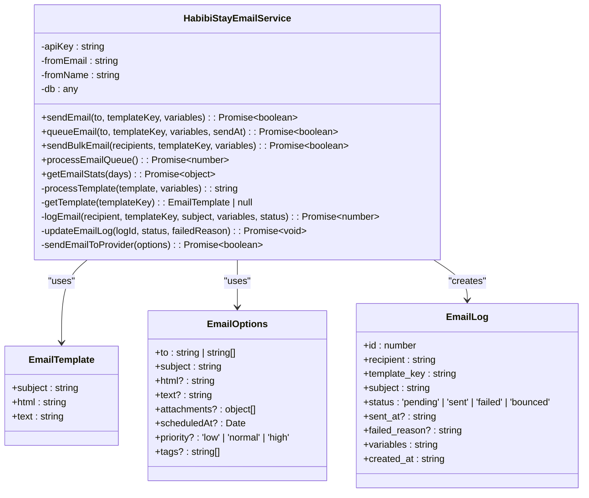
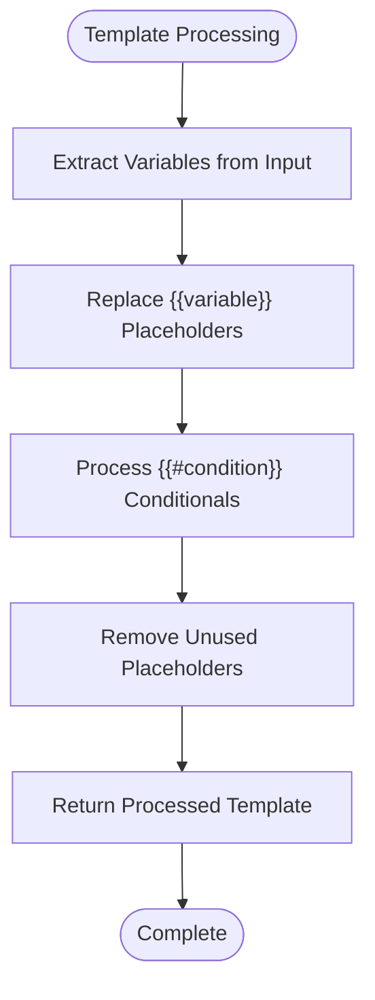
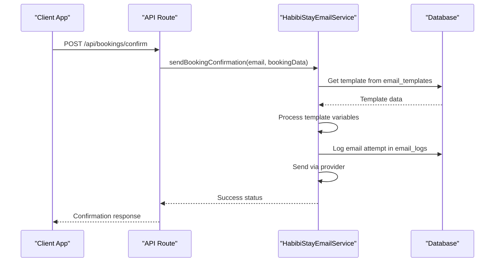
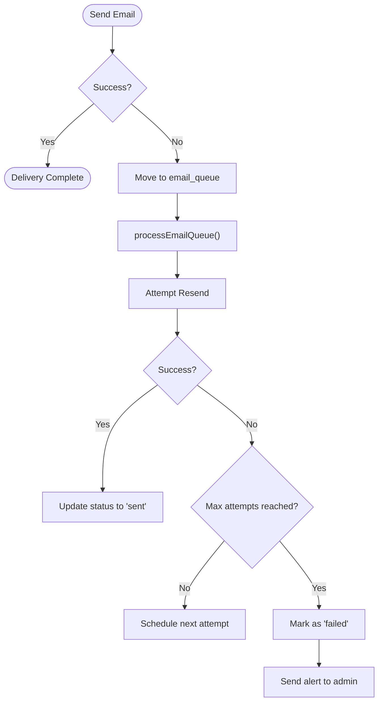
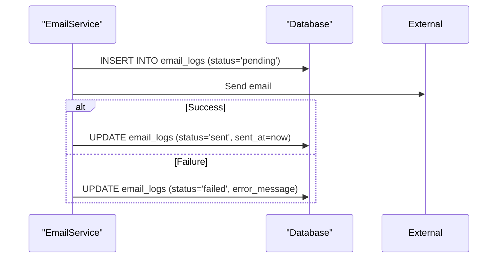
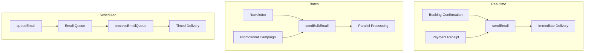

# Email Service Abstraction and Usage

<cite>
**Referenced Files in This Document**   
- [email.ts](file://src/shared/email.ts#L0-L250)
- [email-service.ts](file://src/shared/email-service.ts#L0-L382)
- [email-templates.ts](file://src/shared/email-templates.ts)
- [additional-email-templates.ts](file://src/shared/additional-email-templates.ts)
- [index.ts](file://src/worker/index.ts#L43-L83)
</cite>

## Table of Contents
1. [Introduction](#introduction)
2. [Email Service Architecture](#email-service-architecture)
3. [Supported Email Types](#supported-email-types)
4. [Template Structure and Dynamic Data Injection](#template-structure-and-dynamic-data-injection)
5. [Integration with Email Provider](#integration-with-email-provider)
6. [API Usage Examples](#api-usage-examples)
7. [Configuration via Environment Variables](#configuration-via-environment-variables)
8. [Deliverability Considerations](#deliverability-considerations)
9. [Error Handling and Retry Policies](#error-handling-and-retry-policies)
10. [Logging and Audit Trails](#logging-and-audit-trails)
11. [Real-time Notifications and Batch Operations](#real-time-notifications-and-batch-operations)

## Introduction
The email service in HabibiStay provides a unified abstraction layer for sending transactional and marketing emails. It supports various email types including booking confirmations, payment receipts, owner notifications, and newsletter subscriptions. The service is designed with scalability, reliability, and maintainability in mind, featuring template-based rendering, database logging, queue processing, and comprehensive error handling.

**Section sources**
- [email-service.ts](file://src/shared/email-service.ts#L0-L382)
- [email.ts](file://src/shared/email.ts#L0-L250)

## Email Service Architecture
The email service follows a modular architecture with clear separation of concerns between template management, email sending logic, and delivery mechanisms. The core component is the `HabibiStayEmailService` class that implements the `EmailService` interface.



**Diagram sources**
- [email-service.ts](file://src/shared/email-service.ts#L0-L382)

**Section sources**
- [email-service.ts](file://src/shared/email-service.ts#L0-L382)

## Supported Email Types
The email service supports multiple types of transactional and marketing emails through predefined template keys. These include:

- **Booking confirmations**: Sent when a booking is successfully created
- **Payment receipts**: Sent upon successful payment processing
- **Owner notifications**: Sent to property owners about booking events
- **Newsletter subscriptions**: Sent for marketing campaigns
- **Account-related emails**: Welcome emails, password resets, etc.

The supported templates are defined as constants in the system:

```typescript
export const EMAIL_TEMPLATES = {
  BOOKING_CONFIRMATION: 'booking_confirmation',
  BOOKING_CANCELLED: 'booking_cancelled',
  PAYMENT_SUCCESS: 'payment_success',
  PAYMENT_FAILED: 'payment_failed',
  PROPERTY_APPROVED: 'property_approved',
  PROPERTY_REJECTED: 'property_rejected',
  WELCOME: 'welcome',
  PASSWORD_RESET: 'password_reset',
  BOOKING_REMINDER: 'booking_reminder',
} as const;
```

**Section sources**
- [email.ts](file://src/shared/email.ts#L45-L76)

## Template Structure and Dynamic Data Injection
Email templates in HabibiStay follow a structured format with HTML content, subject lines, and variable placeholders. Templates support dynamic data injection through a simple templating system that replaces placeholders with actual values.

### Template Format
Each template contains:
- **Subject line**: The email subject with variable placeholders
- **HTML content**: Full HTML email body with styling
- **Variables**: List of required variables for the template

### Dynamic Data Injection
The service uses a template processing system that replaces placeholders in the format `{{variable_name}}` with actual values from the provided variables object. It also supports conditional blocks using `{{#variable}}content{{/variable}}` syntax.



**Diagram sources**
- [email-service.ts](file://src/shared/email-service.ts#L54-L96)
- [email.ts](file://src/shared/email.ts#L78-L99)

**Section sources**
- [email-service.ts](file://src/shared/email-service.ts#L54-L96)
- [email.ts](file://src/shared/email.ts#L78-L99)

## Integration with Email Provider
The email service is designed to integrate with external email providers through a pluggable architecture. Currently, it includes a placeholder implementation that can be extended to work with services like SendGrid, Amazon SES, or Resend.

### Provider Integration Points
The `sendEmailToProvider` method serves as the integration point with external email services:

```typescript
private async sendEmailToProvider(options: EmailOptions): Promise<boolean> {
  try {
    // Placeholder for actual email service integration
    // Would integrate with Resend, SendGrid, Amazon SES, etc.
    console.log('Sending email:', {
      to: options.to,
      subject: options.subject,
      timestamp: new Date().toISOString()
    });
    
    // Simulate success
    return true;
  } catch (error) {
    console.error('Email sending failed:', error);
    return false;
  }
}
```

The service supports additional features through the `EmailOptions` interface:
- **Attachments**: Support for file attachments
- **Scheduling**: Ability to send emails at specific times
- **Priority levels**: Low, normal, or high priority
- **Tags**: Categorization and tracking of emails

**Section sources**
- [email-service.ts](file://src/shared/email-service.ts#L132-L150)

## API Usage Examples
The email service is invoked through API routes in the worker/index.ts file. These routes handle various email sending scenarios including booking confirmations, payment receipts, and newsletter subscriptions.

### Booking Confirmation Example
```typescript
async function sendEmail(env: Env, to: string, templateKey: string, variables: Record<string, any> = {}): Promise<boolean> {
  try {
    // Get email template from database
    const template = await env.DB.prepare(
      "SELECT * FROM email_templates WHERE template_key = ? AND is_active = 1"
    ).bind(templateKey).first();
    
    if (!template) {
      console.error(`Email template not found: ${templateKey}`);
      return false;
    }

    // Render template with variables
    const subject = renderEmailTemplate((template as any).subject, variables);

    // Log email attempt
    await env.DB.prepare(`
      INSERT INTO email_logs (recipient_email, template_key, subject, status, sent_at)
      VALUES (?, ?, ?, ?, ?)
    `).bind(to, templateKey, subject, 'sent', new Date().toISOString()).run();

    return true;
  } catch (error) {
    console.error('Email sending failed:', error);
    return false;
  }
}
```

### API Route Integration
The service is used in API routes to send specific email types:



**Diagram sources**
- [index.ts](file://src/worker/index.ts#L43-L83)
- [email-service.ts](file://src/shared/email-service.ts#L182-L227)

**Section sources**
- [index.ts](file://src/worker/index.ts#L43-L83)
- [email-service.ts](file://src/shared/email-service.ts#L182-L227)

## Configuration via Environment Variables
The email service is configured through environment variables that provide essential settings for email operations:

- **SMTP/API settings**: API key for the email provider
- **Sender information**: From email address and sender name
- **Service enable/disable flags**: Feature toggles for email functionality

The configuration is passed to the service through the constructor:

```typescript
constructor(config: {
  apiKey: string;
  fromEmail: string;
  fromName: string;
  db: any;
}) {
  this.apiKey = config.apiKey;
  this.fromEmail = config.fromEmail;
  this.fromName = config.fromName;
  this.db = config.db;
}
```

Additional configuration is managed through database-stored templates and system defaults, allowing for runtime changes without code deployment.

**Section sources**
- [email-service.ts](file://src/shared/email-service.ts#L52-L60)

## Deliverability Considerations
The email service incorporates several features to ensure high deliverability rates and compliance with email standards.

### Technical Requirements
- **SPF/DKIM setup**: Proper DNS records should be configured for the domain
- **Domain authentication**: Verified sending domains with email providers
- **Content optimization**: Templates designed to avoid spam filters

### Fallback Mechanisms
The service includes robust fallback mechanisms:
- **Queue-based delivery**: Failed emails are queued for retry
- **Batch processing**: Bulk emails processed in manageable batches
- **Rate limiting**: Protection against sending limits

### Best Practices Implemented
- **Proper headers**: Correct MIME types and encoding
- **Unsubscribe links**: Required for marketing emails
- **Content balance**: Appropriate text-to-image ratio
- **Reputation monitoring**: Tracking of bounce and complaint rates

**Section sources**
- [email-service.ts](file://src/shared/email-service.ts#L229-L280)

## Error Handling and Retry Policies
The email service implements comprehensive error handling and retry mechanisms to ensure reliable delivery.

### Error Handling Strategy
- **Try-catch blocks**: Wrapped around all email operations
- **Detailed logging**: Error messages and stack traces
- **Graceful degradation**: Service continues despite individual failures

### Retry Policies
The service uses a multi-tiered approach to handling delivery failures:



The `processEmailQueue` method handles retry logic by processing queued emails in batches and updating their status accordingly.

**Diagram sources**
- [email-service.ts](file://src/shared/email-service.ts#L280-L300)

**Section sources**
- [email-service.ts](file://src/shared/email-service.ts#L280-L300)

## Logging and Audit Trails
The email service maintains comprehensive logs for all email operations, providing full audit trails for compliance and troubleshooting.

### Database Schema
Email logs are stored in the `email_logs` table with the following structure:
- **recipient_email**: Destination email address
- **template_key**: Type of email sent
- **subject**: Email subject line
- **status**: Delivery status (pending, sent, failed)
- **sent_at**: Timestamp of delivery attempt
- **error_message**: Error details if failed
- **variables**: JSON string of template variables
- **created_at**: Record creation timestamp

### Logging Workflow


The service also provides statistics through the `getEmailStats` method, which aggregates delivery performance over configurable time periods.

**Diagram sources**
- [email-service.ts](file://src/shared/email-service.ts#L98-L131)
- [email-service.ts](file://src/shared/email-service.ts#L300-L341)

**Section sources**
- [email-service.ts](file://src/shared/email-service.ts#L98-L131)
- [email-service.ts](file://src/shared/email-service.ts#L300-L341)

## Real-time Notifications and Batch Operations
The email service supports both real-time notifications and batch operations, making it suitable for various use cases.

### Real-time Notifications
For immediate delivery of transactional emails:
- **Direct sending**: `sendEmail()` method for instant delivery
- **Synchronous processing**: Immediate template rendering and sending
- **Low latency**: Optimized for quick response times

### Batch Operations
For marketing campaigns and bulk communications:
- **Bulk sending**: `sendBulkEmail()` method for multiple recipients
- **Queue processing**: `processEmailQueue()` for scheduled emails
- **Rate limiting**: Built-in protection against provider limits

The service can handle both scenarios efficiently:



**Diagram sources**
- [email-service.ts](file://src/shared/email-service.ts#L229-L280)
- [email-service.ts](file://src/shared/email-service.ts#L182-L227)

**Section sources**
- [email-service.ts](file://src/shared/email-service.ts#L182-L280)