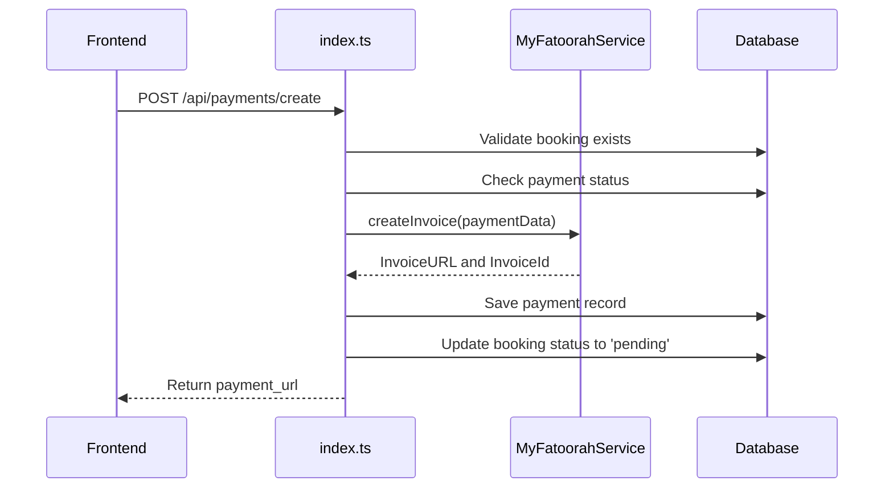
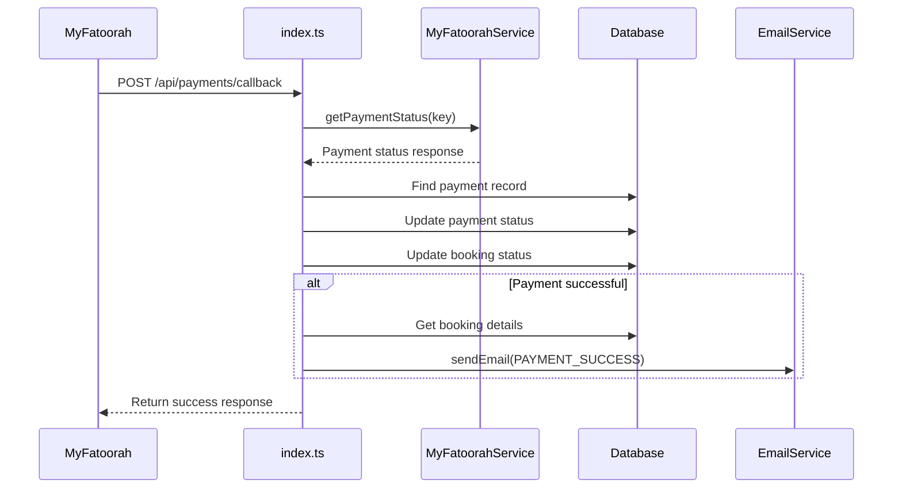
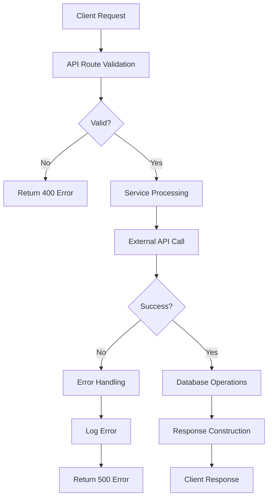
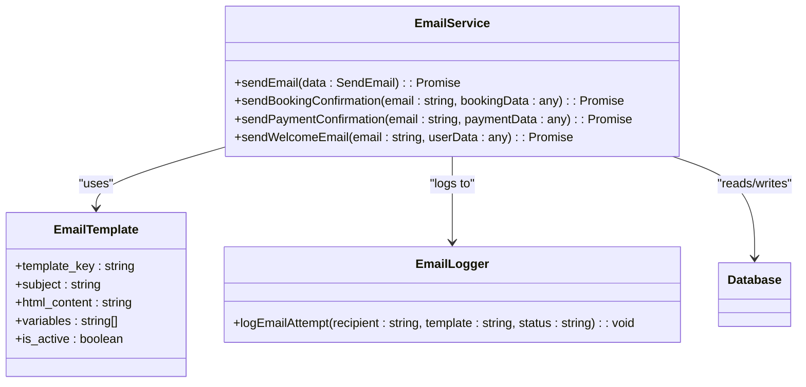
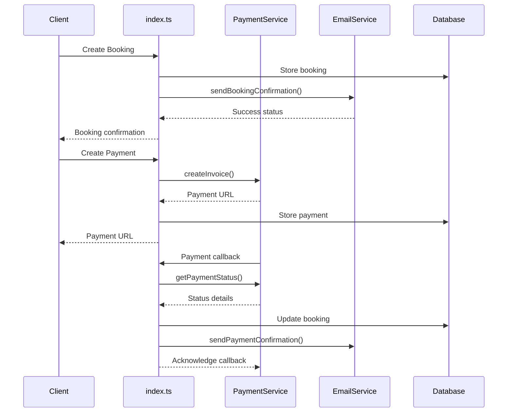
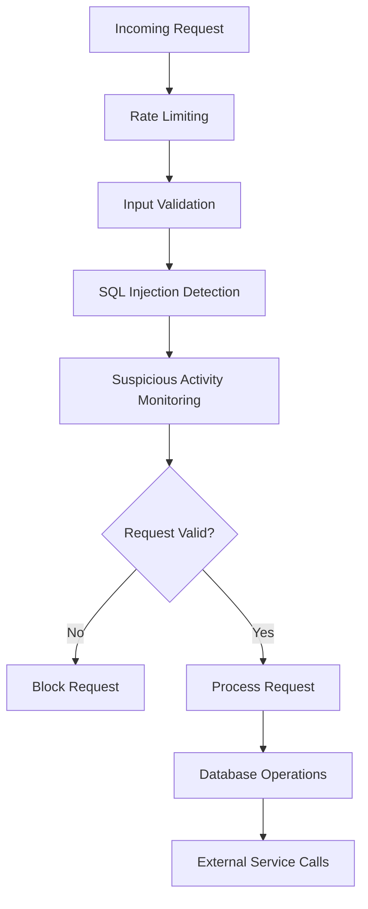
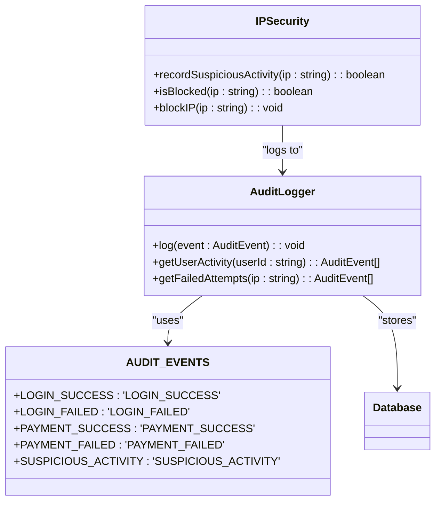

# External Service Integrations

<cite>
**Referenced Files in This Document**   
- [payment.ts](file://src/shared/payment.ts)
- [email.ts](file://src/shared/email.ts)
- [index.ts](file://src/worker/index.ts)
- [security-config.ts](file://src/shared/security-config.ts)
- [security-middleware.ts](file://src/shared/security-middleware.ts)
</cite>

## Table of Contents
1. [Introduction](#introduction)
2. [Payment Integration with MyFatoorah](#payment-integration-with-myfatoorah)
3. [Email Service Abstraction](#email-service-abstraction)
4. [API Route Integration](#api-route-integration)
5. [Security Considerations](#security-considerations)
6. [Error Handling and Retry Mechanisms](#error-handling-and-retry-mechanisms)
7. [Logging and Monitoring](#logging-and-monitoring)
8. [Conclusion](#conclusion)

## Introduction
This document provides a comprehensive overview of the external service integrations in HabibiStay's backend system. It focuses on two critical components: the MyFatoorah payment gateway integration and the transactional email service. The documentation covers implementation details, request/response flows, security measures, error handling strategies, and monitoring approaches. These integrations are essential for core business operations including booking management, payment processing, and customer communication.

## Payment Integration with MyFatoorah

### Payment Creation Process
The MyFatoorah integration enables secure payment processing for property bookings. The payment creation flow begins when a user initiates a payment through the frontend, triggering the `/api/payments/create` endpoint.

**Diagram sources**
- [index.ts](file://src/worker/index.ts#L1000-L1050)
- [payment.ts](file://src/shared/payment.ts#L100-L120)

**Section sources**
- [index.ts](file://src/worker/index.ts#L1000-L1050)
- [payment.ts](file://src/shared/payment.ts#L100-L120)

The payment creation process follows these steps:
1. The API validates the booking existence and ensures no prior successful payment exists
2. It constructs payment data using the `PaymentRequestSchema` with customer details, amount, and callback URLs
3. The `MyFatoorahService.createInvoice()` method sends a POST request to MyFatoorah's API endpoint
4. Upon successful response, the system stores payment details in the database and updates the booking status
5. The payment URL is returned to the frontend for redirection

### Callback Verification and Status Synchronization
The payment callback endpoint `/api/payments/callback` handles MyFatoorah's webhook notifications to verify payment status and synchronize booking records.

**Diagram sources**
- [index.ts](file://src/worker/index.ts#L1050-L1150)
- [payment.ts](file://src/shared/payment.ts#L120-L140)

**Section sources**
- [index.ts](file://src/worker/index.ts#L1050-L1150)
- [payment.ts](file://src/shared/payment.ts#L120-L140)

The callback verification process includes:
- **Signature validation**: The system uses the payment identifier (paymentId, Id, or InvoiceId) to query MyFatoorah's API for authoritative status
- **Status synchronization**: Payment and booking records are updated based on the verified status from MyFatoorah
- **Transaction finalization**: Successful payments trigger booking confirmation and email notifications
- **Idempotency**: The callback handler can process multiple notifications for the same payment without side effects

### Request/Response Flow
The payment integration follows a standardized request/response pattern using TypeScript interfaces and Zod validation schemas.

**Diagram sources**
- [index.ts](file://src/worker/index.ts#L1000-L1150)
- [payment.ts](file://src/shared/payment.ts#L1-L165)

The request/response flow demonstrates proper error handling and validation at multiple levels, ensuring data integrity and providing meaningful feedback to clients.

## Email Service Abstraction

### Transactional Email Implementation
The email service provides an abstraction layer for sending transactional emails including booking confirmations, payment receipts, and welcome messages.

**Diagram sources**
- [email.ts](file://src/shared/email.ts#L1-L250)
- [index.ts](file://src/worker/index.ts#L1150-L1200)

**Section sources**
- [email.ts](file://src/shared/email.ts#L1-L250)
- [index.ts](file://src/worker/index.ts#L1150-L1200)

The email system implements the following key features:
- **Template management**: Predefined templates for different email types with variable substitution
- **Variable rendering**: The `renderEmailTemplate()` function replaces placeholders like `{{guest_name}}` with actual values
- **Database integration**: Email templates are stored in the database with active/inactive status
- **Logging**: All email attempts are recorded in the `email_logs` table for auditing and troubleshooting

### Email Types and Usage
HabibiStay supports multiple transactional email types for different business scenarios:

**Booking Confirmation**
- Triggered when a new booking is created
- Contains booking details, property information, and total amount
- Sent to the guest's email address
- Uses the `BOOKING_CONFIRMATION` template key

**Payment Success**
- Triggered when a payment callback confirms successful payment
- Contains transaction details, payment method, and confirmation message
- Sent to the guest's email address
- Uses the `PAYMENT_SUCCESS` template key

**Welcome Email**
- Triggered when a new user registers
- Contains onboarding information and platform features
- Sent to the user's email address
- Uses the `WELCOME` template key

**Newsletter Subscription**
- Triggered when a user subscribes to the newsletter
- Contains welcome message and unsubscribe link
- Sent to the subscriber's email address
- Uses the `newsletter_welcome` template key

## API Route Integration

### Service Invocation Patterns
The worker entry point (`index.ts`) demonstrates how API routes invoke shared services for payment and email functionality.

**Diagram sources**
- [index.ts](file://src/worker/index.ts#L800-L1200)
- [payment.ts](file://src/shared/payment.ts#L1-L165)
- [email.ts](file://src/shared/email.ts#L1-L250)

**Section sources**
- [index.ts](file://src/worker/index.ts#L800-L1200)

The integration pattern shows:
- **Service initialization**: The `getMyFatoorahService()` and `sendEmail()` functions create service instances with environment-configured parameters
- **Error isolation**: Each service call is wrapped in try-catch blocks to prevent cascading failures
- **Database coordination**: Service operations are synchronized with database updates to maintain consistency
- **Asynchronous processing**: Email notifications are sent after primary operations complete, without blocking the main flow

### Environment Configuration
Service endpoints and credentials are configured through environment variables, enabling secure and flexible deployment across environments.

**Key Environment Variables:**
- `MYFATOORAH_API_KEY`: Authentication token for MyFatoorah API access
- `MYFATOORAH_API_URL`: Base URL for MyFatoorah API (defaults to test environment)
- `OPENAI_API_KEY`: API key for AI chat functionality
- `MOCHA_USERS_SERVICE_API_URL`: Endpoint for user authentication service
- `MOCHA_USERS_SERVICE_API_KEY`: Authentication key for user service

The configuration approach provides:
- **Security**: Sensitive credentials are not hardcoded in source code
- **Flexibility**: Different endpoints can be used for development, staging, and production
- **Testability**: Mock services can be configured for testing environments
- **Compliance**: Credentials are managed according to security best practices

## Security Considerations

### API Key Protection
The system implements multiple layers of protection for API keys and sensitive credentials:

- **Environment variables**: All API keys are stored in environment variables, never in source code
- **Access control**: Environment variables are only accessible to authorized services and personnel
- **Limited scope**: API keys have restricted permissions appropriate to their use case
- **Regular rotation**: Keys are rotated periodically according to security policies

### Webhook Payload Validation
The payment callback endpoint implements rigorous validation to prevent unauthorized or malicious requests:

- **Identifier verification**: The system validates payment identifiers against known records
- **Status confirmation**: Payment status is verified by querying MyFatoorah's API, not trusting the callback data alone
- **Input sanitization**: All input data is validated against Zod schemas before processing
- **Rate limiting**: The endpoint is protected by rate limiting middleware to prevent abuse

### Injection Attack Prevention
Multiple safeguards prevent injection attacks across the integration points:

- **SQL parameterization**: All database queries use parameterized statements to prevent SQL injection
- **Input validation**: Zod schemas validate and sanitize all incoming data
- **Content escaping**: Email templates escape special characters to prevent XSS
- **Middleware protection**: Security middleware filters potentially malicious requests

**Diagram sources**
- [security-middleware.ts](file://src/shared/security-middleware.ts#L1-L273)
- [index.ts](file://src/worker/index.ts#L50-L100)

**Section sources**
- [security-middleware.ts](file://src/shared/security-middleware.ts#L1-L273)

## Error Handling and Retry Mechanisms

### Failed Transaction Handling
The system implements comprehensive error handling for failed transactions:

- **Payment creation failures**: When `createInvoice()` fails, the system logs the error and returns a 500 status with descriptive message
- **Callback processing errors**: If a payment callback cannot be processed, the system logs the error but still acknowledges receipt to prevent retry loops
- **Database transaction integrity**: Critical operations use atomic transactions to prevent partial updates
- **Graceful degradation**: If email service fails, the primary booking and payment functions continue without interruption

### Retry Strategies
For service outages, the system employs the following retry mechanisms:

- **Client-side retry**: The frontend implements exponential backoff for failed API calls
- **Idempotent operations**: Payment creation and callback processing are designed to be safe for multiple executions
- **Fallback logging**: When external services are unavailable, critical information is logged locally for later processing
- **Manual recovery**: Admin interfaces allow manual status updates if automated processes fail

## Logging and Monitoring

### Audit Logging Implementation
The system implements comprehensive logging for integration points to aid troubleshooting and security monitoring.

**Diagram sources**
- [security-config.ts](file://src/shared/security-config.ts#L262-L301)
- [security-middleware.ts](file://src/shared/security-middleware.ts#L227-L273)

**Section sources**
- [security-config.ts](file://src/shared/security-config.ts#L262-L301)
- [security-middleware.ts](file://src/shared/security-middleware.ts#L227-L273)

The audit logging system captures:
- **Payment events**: Successful and failed payment attempts, status changes
- **Security events**: Suspicious activity, rate limit exceedances, potential attacks
- **System events**: Service availability, configuration changes
- **User activity**: Login attempts, booking modifications

### Monitoring and Alerting
The system provides monitoring capabilities through:

- **Health check endpoint**: `/api/health` returns system status
- **Admin dashboards**: Security audit interfaces show real-time metrics and events
- **Log aggregation**: All integration attempts are recorded in database tables
- **Performance metrics**: Request rates, response times, and error rates are tracked

These monitoring approaches enable rapid identification and resolution of integration issues, ensuring high availability and reliability of external service connections.

## Conclusion
HabibiStay's external service integrations demonstrate a robust, secure, and maintainable architecture for handling critical business functions. The MyFatoorah payment integration provides a reliable payment processing pipeline with proper error handling and status synchronization. The email service abstraction enables consistent transactional communication across multiple use cases. Security measures including API key protection, webhook validation, and injection attack prevention ensure the integrity of these integrations. Comprehensive logging and monitoring capabilities support effective troubleshooting and system observability. The implementation follows best practices for service-oriented architecture, making the system resilient, scalable, and maintainable.