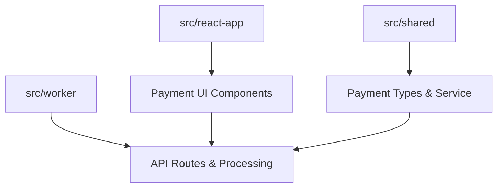
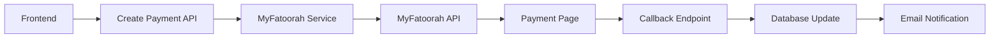
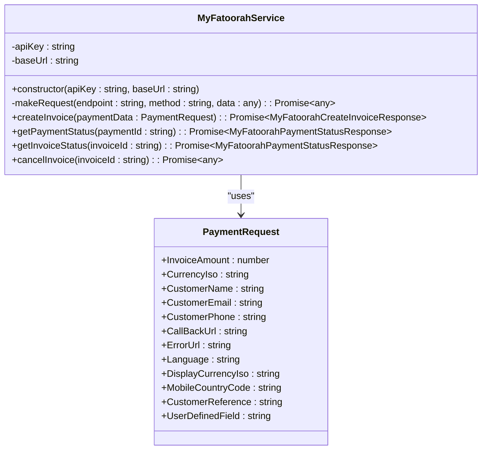
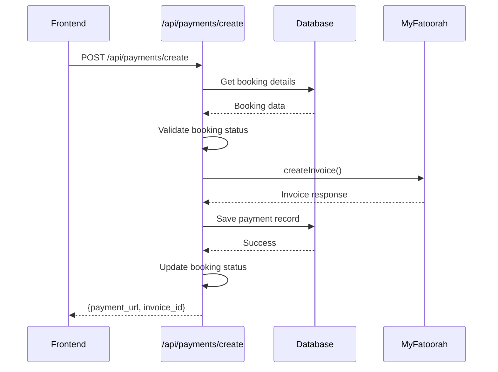
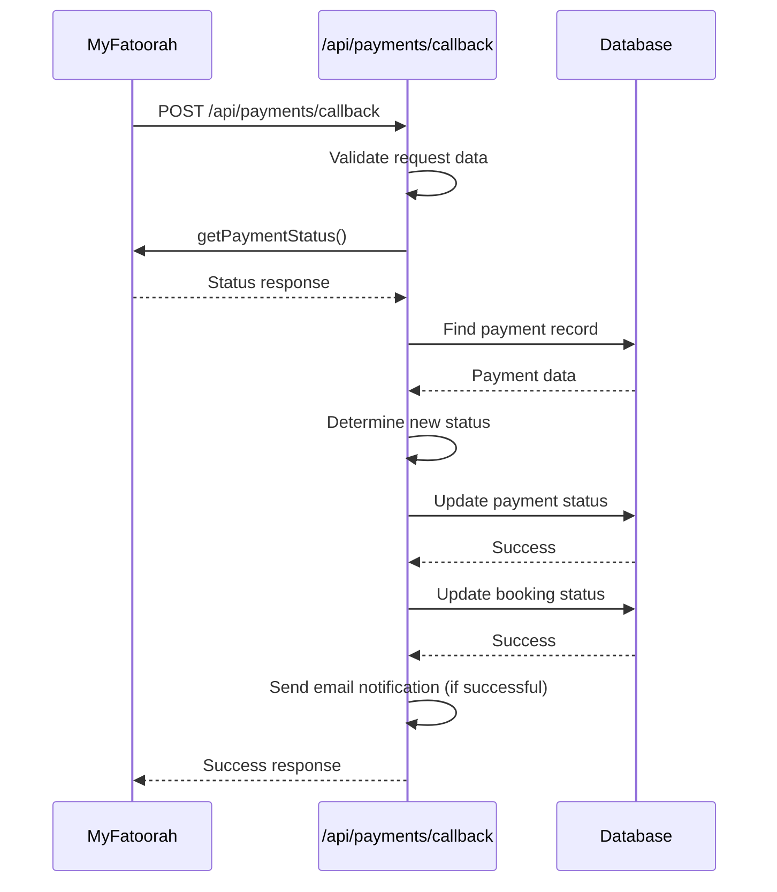
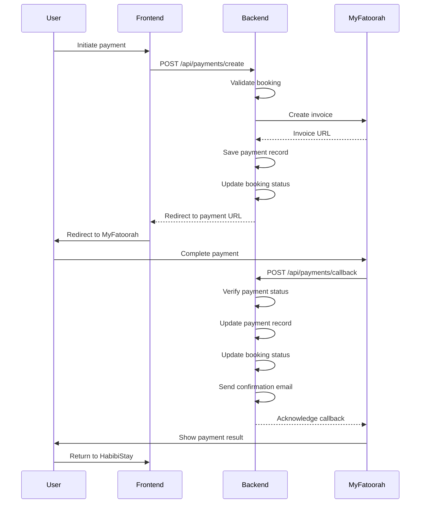

# Payment Integration with MyFatoorah

<cite>
**Referenced Files in This Document**   
- [src/shared/payment.ts](file://src/shared/payment.ts)
- [src/worker/index.ts](file://src/worker/index.ts)
- [src/shared/types.ts](file://src/shared/types.ts)
- [src/react-app/pages/PaymentSuccess.tsx](file://src/react-app/pages/PaymentSuccess.tsx)
- [src/react-app/pages/PaymentCancel.tsx](file://src/react-app/pages/PaymentCancel.tsx)
</cite>

## Table of Contents
1. [Introduction](#introduction)
2. [Project Structure](#project-structure)
3. [Core Components](#core-components)
4. [Payment Flow Architecture](#payment-flow-architecture)
5. [Detailed Component Analysis](#detailed-component-analysis)
6. [Error Handling and Security](#error-handling-and-security)
7. [Sequence Diagrams](#sequence-diagrams)
8. [Conclusion](#conclusion)

## Introduction
This document provides a comprehensive overview of the MyFatoorah payment integration within HabibiStay. It details the end-to-end payment process, including frontend triggers, backend processing, callback verification, and database updates. The system is designed to securely handle payments while providing a seamless user experience.

## Project Structure
The payment integration spans multiple directories in the HabibiStay application:
- `src/shared/`: Contains shared types and payment utility classes
- `src/worker/`: Houses the backend API routes and payment processing logic
- `src/react-app/`: Includes frontend components for payment success and cancellation handling

The modular structure separates concerns between frontend presentation, shared business logic, and backend processing.

**Diagram sources**
- [src/react-app/pages/PaymentSuccess.tsx](file://src/react-app/pages/PaymentSuccess.tsx)
- [src/shared/payment.ts](file://src/shared/payment.ts)
- [src/worker/index.ts](file://src/worker/index.ts)

## Core Components
The payment integration consists of several key components that work together to process payments through MyFatoorah:

- **MyFatoorahService**: A utility class that encapsulates the MyFatoorah API interactions
- **Payment Request/Response Schemas**: Zod schemas that validate payment data
- **API Routes**: Hono routes that handle payment creation and callback processing
- **Database Models**: Tables that store payment and booking information

These components ensure type safety, proper validation, and reliable payment processing.

**Section sources**
- [src/shared/payment.ts](file://src/shared/payment.ts#L1-L165)
- [src/worker/index.ts](file://src/worker/index.ts#L0-L2443)
- [src/shared/types.ts](file://src/shared/types.ts#L0-L599)

## Payment Flow Architecture
The payment architecture follows a clean separation of concerns between frontend and backend components. When a user initiates a payment, the frontend sends a request to the backend, which then communicates with MyFatoorah to create an invoice. The user is redirected to MyFatoorah's payment page, and upon completion, MyFatoorah sends a callback to our server to verify the payment status.

The architecture ensures secure handling of payment information by keeping sensitive credentials on the server-side and using environment variables for configuration.

**Diagram sources**
- [src/worker/index.ts](file://src/worker/index.ts#L0-L2443)
- [src/shared/payment.ts](file://src/shared/payment.ts#L1-L165)

## Detailed Component Analysis

### MyFatoorah Service Analysis
The MyFatoorahService class provides a clean interface for interacting with the MyFatoorah API. It handles authentication, request formatting, and response parsing.

**Diagram sources**
- [src/shared/payment.ts](file://src/shared/payment.ts#L1-L165)

**Section sources**
- [src/shared/payment.ts](file://src/shared/payment.ts#L1-L165)

### API Routes Analysis
The payment API routes handle the creation of payments and processing of callbacks from MyFatoorah. The routes are secured with validation middleware to ensure data integrity.

#### Payment Creation Route
The `/api/payments/create` endpoint creates a new payment request with MyFatoorah and returns the payment URL.

**Diagram sources**
- [src/worker/index.ts](file://src/worker/index.ts#L0-L2443)

**Section sources**
- [src/worker/index.ts](file://src/worker/index.ts#L0-L2443)

#### Payment Callback Route
The `/api/payments/callback` endpoint processes payment status updates from MyFatoorah and updates the booking status accordingly.

**Diagram sources**
- [src/worker/index.ts](file://src/worker/index.ts#L0-L2443)

**Section sources**
- [src/worker/index.ts](file://src/worker/index.ts#L0-L2443)

## Error Handling and Security
The payment system implements comprehensive error handling and security measures to ensure reliability and protect sensitive data.

### Error Handling Strategies
The system handles various error scenarios:
- **Timeout errors**: Network issues when communicating with MyFatoorah
- **Cancellation errors**: User-initiated payment cancellations
- **Server errors**: Internal server issues during processing

Error responses include appropriate HTTP status codes and descriptive messages while avoiding exposure of sensitive information.

### Security Practices
The implementation follows security best practices:
- **Environment-based credential storage**: API keys are stored in environment variables
- **Input sanitization**: All user inputs are validated using Zod schemas
- **Replay attack protection**: Unique invoice IDs prevent duplicate processing
- **HTTPS enforcement**: All payment-related endpoints require secure connections

The system also implements rate limiting and IP blocking to prevent abuse.

**Section sources**
- [src/worker/index.ts](file://src/worker/index.ts#L0-L2443)
- [src/shared/payment.ts](file://src/shared/payment.ts#L1-L165)

## Sequence Diagrams

### Complete Payment Flow
This diagram shows the complete end-to-end payment flow from initiation to completion.

**Diagram sources**
- [src/worker/index.ts](file://src/worker/index.ts#L0-L2443)
- [src/shared/payment.ts](file://src/shared/payment.ts#L1-L165)

## Conclusion
The MyFatoorah payment integration in HabibiStay provides a secure and reliable payment processing system. By following a clean architectural pattern with proper separation of concerns, the system ensures that payments are processed securely while providing a seamless user experience. The implementation includes comprehensive error handling, security measures, and monitoring capabilities to ensure reliability and protect user data.