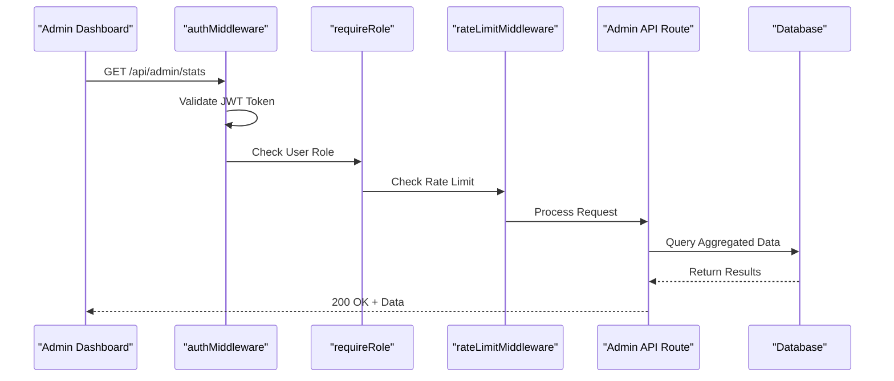
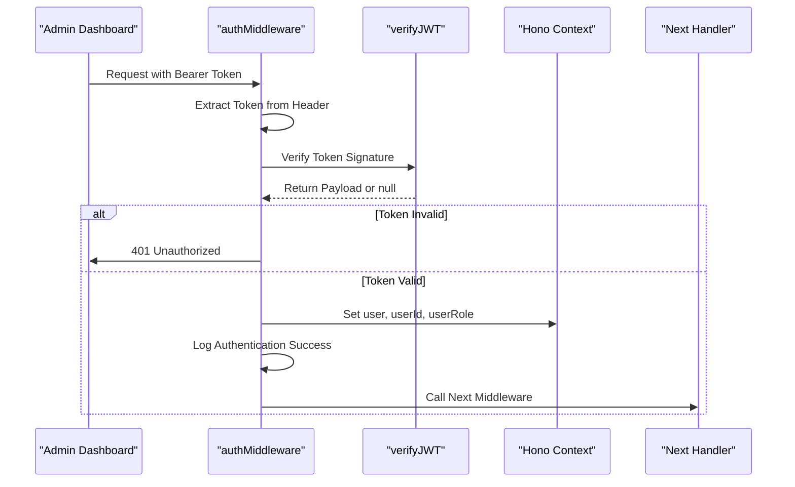
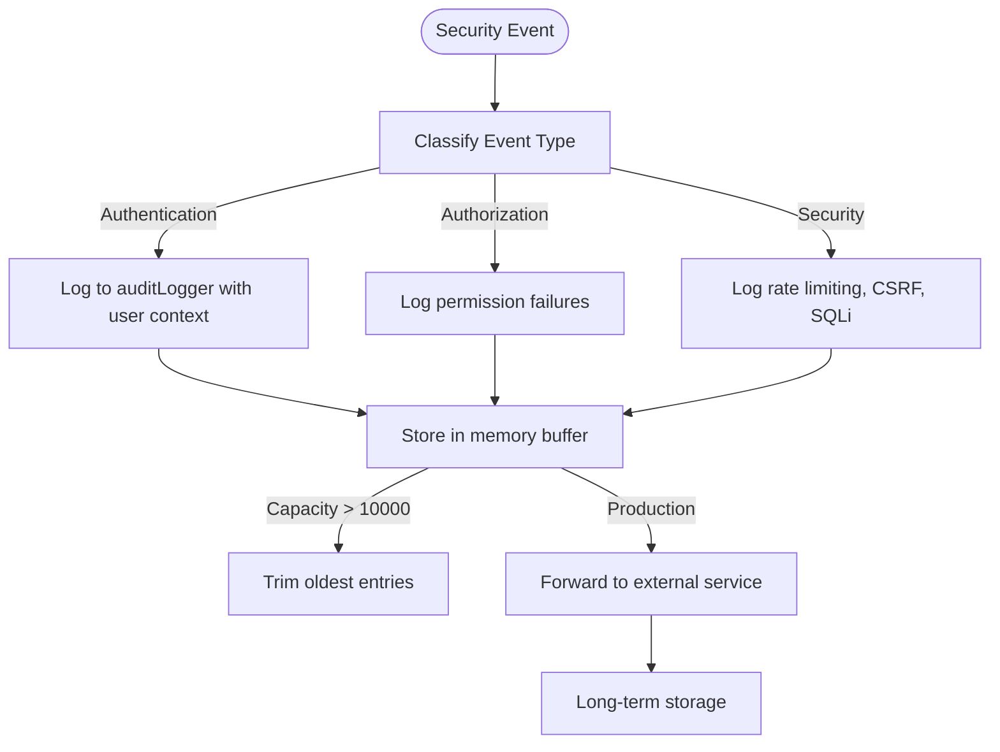

# Admin Platform Management

<cite>
**Referenced Files in This Document**   
- [index.ts](file://src/worker/index.ts#L845-L1044)
- [security-middleware.ts](file://src/shared/security-middleware.ts#L66-L114)
- [security-utils.ts](file://src/shared/security-utils.ts#L317-L349)
- [AdminDashboard.tsx](file://src/react-app/pages/AdminDashboard.tsx)
- [SecurityAuditDashboard.tsx](file://src/react-app/components/admin/SecurityAuditDashboard.tsx)
- [email.ts](file://src/shared/email.ts)
</cite>

## Table of Contents
1. [Introduction](#introduction)
2. [Project Structure](#project-structure)
3. [Core Components](#core-components)
4. [Architecture Overview](#architecture-overview)
5. [Detailed Component Analysis](#detailed-component-analysis)
6. [Dependency Analysis](#dependency-analysis)
7. [Performance Considerations](#performance-considerations)
8. [Troubleshooting Guide](#troubleshooting-guide)
9. [Conclusion](#conclusion)

## Introduction
The Admin Platform Management system serves as the central control panel for overseeing and managing the HabibiStay platform. It provides administrators with real-time analytics, user and property management tools, and security monitoring capabilities. This document details the architecture, functionality, and operational workflows of the admin dashboard, focusing on its backend API routes, security mechanisms, and integration points.

## Project Structure
The project follows a modular structure with clear separation between frontend, shared utilities, and backend worker logic. The admin functionality is primarily implemented in the worker layer, with corresponding UI components in the React frontend.

```mermaid
graph TB
subgraph "Frontend"
AdminDashboard[AdminDashboard.tsx]
SecurityAudit[SecurityAuditDashboard.tsx]
end
subgraph "Shared"
Email[email.ts]
Security[security-middleware.ts]
Utils[security-utils.ts]
end
subgraph "Backend"
Worker[index.ts]
end
AdminDashboard --> Worker : "HTTP Requests"
SecurityAudit --> Worker : "Security Actions"
Worker --> Email : "Send Notifications"
Worker --> Security : "Auth & RBAC"
Security --> Utils : "Audit Logging"
```

**Diagram sources**
- [index.ts](file://src/worker/index.ts#L845-L1044)
- [security-middleware.ts](file://src/shared/security-middleware.ts#L66-L114)
- [security-utils.ts](file://src/shared/security-utils.ts#L317-L349)
- [AdminDashboard.tsx](file://src/react-app/pages/AdminDashboard.tsx)
- [SecurityAuditDashboard.tsx](file://src/react-app/components/admin/SecurityAuditDashboard.tsx)

**Section sources**
- [index.ts](file://src/worker/index.ts#L845-L1044)
- [security-middleware.ts](file://src/shared/security-middleware.ts#L66-L114)

## Core Components
The core components of the admin platform include the Admin Dashboard UI, backend API routes for aggregated data, role-based access control middleware, and audit logging system. These components work together to provide secure, real-time oversight of platform operations.

**Section sources**
- [index.ts](file://src/worker/index.ts#L845-L1044)
- [AdminDashboard.tsx](file://src/react-app/pages/AdminDashboard.tsx)
- [security-middleware.ts](file://src/shared/security-middleware.ts#L66-L114)

## Architecture Overview
The admin platform follows a serverless architecture with Hono as the backend framework. The worker handles all API requests, applying middleware for authentication, authorization, rate limiting, and security validation before processing requests and returning data.



**Diagram sources**
- [index.ts](file://src/worker/index.ts#L845-L1044)
- [security-middleware.ts](file://src/shared/security-middleware.ts#L66-L114)

## Detailed Component Analysis

### Admin API Routes
The backend implements several API endpoints under the `/api/admin` namespace to serve aggregated data and handle administrative actions. These routes are protected by multiple layers of security middleware.

```mermaid
classDiagram
class AdminAPI {
+GET /api/admin/stats
+GET /api/admin/properties
+GET /api/admin/bookings
+GET /api/admin/settings
+PUT /api/admin/properties/{id}/status
+PUT /api/admin/bookings/{id}/status
+POST /api/admin/settings
+POST /api/admin/security/block-ip
}
class SecurityMiddleware {
+authMiddleware()
+requireRole()
+rateLimitMiddleware()
+inputValidationMiddleware()
}
class AuditLogger {
+log()
+getUserActivity()
+getFailedAttempts()
}
AdminAPI --> SecurityMiddleware : "Uses"
SecurityMiddleware --> AuditLogger : "Logs to"
```

**Diagram sources**
- [index.ts](file://src/worker/index.ts#L845-L1044)
- [security-middleware.ts](file://src/shared/security-middleware.ts#L66-L114)
- [security-utils.ts](file://src/shared/security-utils.ts#L317-L349)

**Section sources**
- [index.ts](file://src/worker/index.ts#L845-L1044)

### Authentication and Authorization
The system implements a robust security model using JWT-based authentication and role-based access control. The `authMiddleware` validates tokens and extracts user information, while `requireRole` enforces permission requirements.



**Diagram sources**
- [security-middleware.ts](file://src/shared/security-middleware.ts#L66-L114)

**Section sources**
- [security-middleware.ts](file://src/shared/security-middleware.ts#L66-L114)

### Audit Logging System
The audit logging system tracks all security-relevant events, providing visibility into user activities, authentication attempts, and potential threats. Logs are stored in memory with a rolling buffer and can be exported for analysis.



**Diagram sources**
- [security-utils.ts](file://src/shared/security-utils.ts#L317-L349)
- [security-middleware.ts](file://src/shared/security-middleware.ts#L66-L114)

**Section sources**
- [security-utils.ts](file://src/shared/security-utils.ts#L317-L349)

## Dependency Analysis
The admin platform components are tightly integrated, with clear dependency relationships between the frontend, backend, and shared security modules.

```mermaid
graph TD
AdminDashboard --> API : "Fetch stats, properties, bookings"
SecurityAudit --> API : "Block IPs, export reports"
API --> Auth : "Authentication"
API --> Role : "Authorization"
API --> RateLimit : "Rate limiting"
API --> DB : "Data queries"
Auth --> JWT : "Token verification"
Auth --> Audit : "Log events"
Role --> Audit : "Log permission checks"
RateLimit --> Audit : "Log rate limit events"
InputValidation --> Audit : "Log sanitization"
SQLInjection --> Audit : "Log attack attempts"
```

**Diagram sources**
- [index.ts](file://src/worker/index.ts#L845-L1044)
- [security-middleware.ts](file://src/shared/security-middleware.ts#L66-L114)
- [security-utils.ts](file://src/shared/security-utils.ts#L317-L349)

**Section sources**
- [index.ts](file://src/worker/index.ts#L845-L1044)
- [security-middleware.ts](file://src/shared/security-middleware.ts#L66-L114)

## Performance Considerations
The admin dashboard handles large datasets through several optimization strategies:
- **Aggregated queries**: The `/api/admin/stats` endpoint uses database aggregation to minimize data transfer
- **Rate limiting**: API endpoints are rate-limited to prevent abuse and ensure system stability
- **Caching**: While not explicitly shown, the architecture supports caching of frequently accessed data
- **Efficient queries**: Database queries are optimized to retrieve only necessary fields
- **Parallel execution**: Multiple statistics are fetched in parallel using `Promise.all()`

For large datasets, consider implementing:
- Database indexing on frequently queried fields
- Pagination for property and booking lists
- Caching layer for frequently accessed statistics
- Background job processing for heavy computations

## Troubleshooting Guide
Common admin issues and their solutions:

**Issue: Unable to access admin dashboard**
- **Cause**: Missing or invalid authentication token
- **Solution**: Ensure the Authorization header contains a valid Bearer token
- **Check**: Verify token expiration and user role

**Issue: 403 Forbidden on admin routes**
- **Cause**: Insufficient permissions (user role not 'admin')
- **Solution**: Ensure the user has admin privileges in the system
- **Check**: Verify the JWT token contains the correct role claim

**Issue: Rate limit exceeded (429)**
- **Cause**: Too many requests within the time window
- **Solution**: Implement request throttling in the frontend
- **Check**: Review rateLimitMiddleware configuration (100 requests/10 minutes for most admin routes)

**Issue: Slow dashboard loading**
- **Cause**: Large dataset queries
- **Solution**: Implement pagination, caching, or optimize database queries
- **Check**: Monitor query performance and add indexes as needed

**Issue: Failed to update property status**
- **Cause**: Database constraint violation or invalid property ID
- **Solution**: Verify the property ID exists and the request body is valid
- **Check**: Review server logs for specific error details

**Section sources**
- [index.ts](file://src/worker/index.ts#L845-L1044)
- [security-middleware.ts](file://src/shared/security-middleware.ts#L66-L114)

## Conclusion
The Admin Platform Management system provides a comprehensive suite of tools for platform oversight and management. Its architecture emphasizes security through layered middleware, real-time analytics through aggregated data endpoints, and operational efficiency through well-structured APIs. The integration of audit logging and security monitoring ensures that administrative actions are traceable and potential threats are detectable. By following the documented use cases and troubleshooting guidance, administrators can effectively manage the platform while maintaining high security and performance standards.