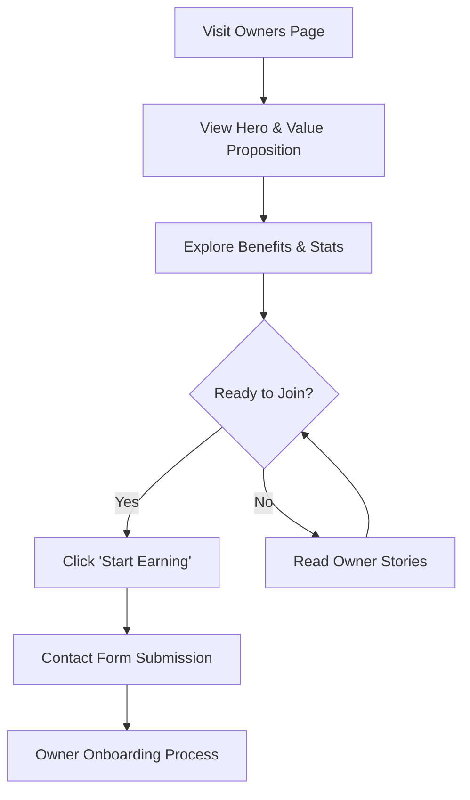
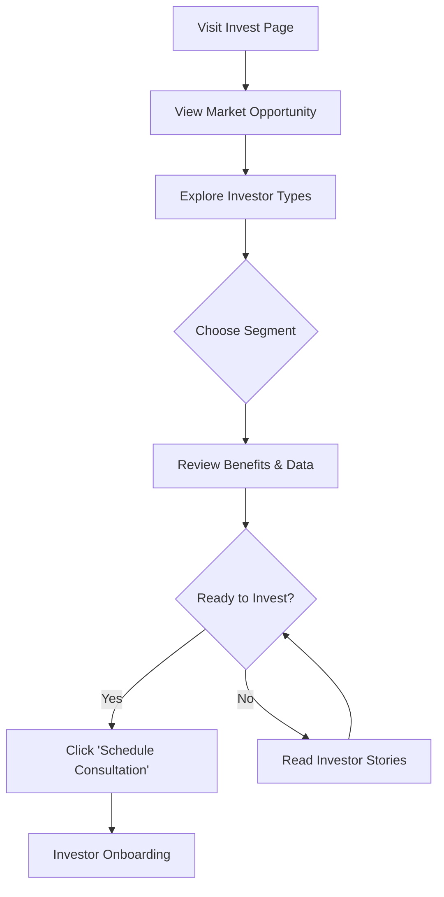
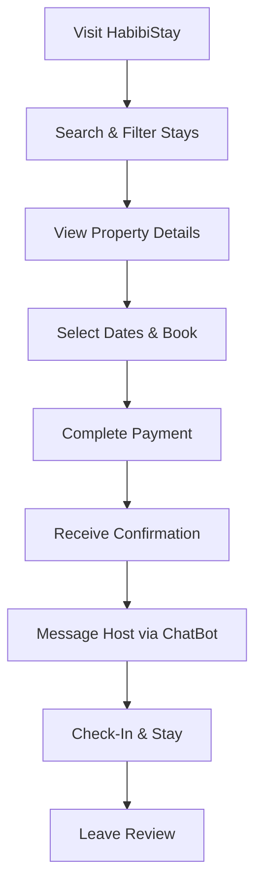
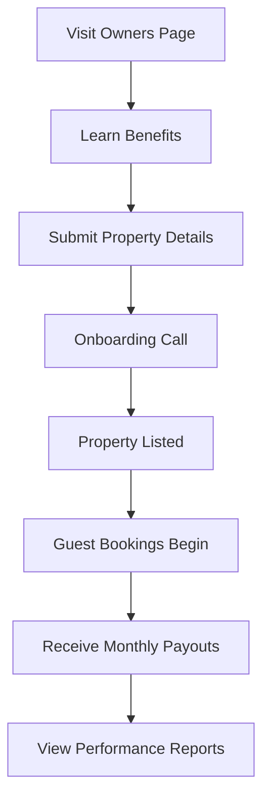
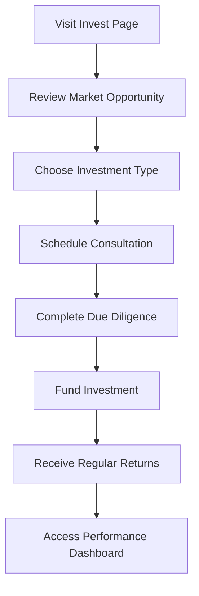

# Core Features

<cite>
**Referenced Files in This Document**   
- [Owners.tsx](file://src/react-app/pages/Owners.tsx)
- [Invest.tsx](file://src/react-app/pages/Invest.tsx)
- [AdminDashboard.tsx](file://src/react-app/pages/AdminDashboard.tsx)
- [types.ts](file://src/shared/types.ts)
</cite>

## Table of Contents
1. [User Value Propositions](#user-value-propositions)
2. [Stays Discovery and Booking Flow](#stays-discovery-and-booking-flow)
3. [Owner Onboarding Funnel](#owner-onboarding-funnel)
4. [Investor Engagement Platform](#investor-engagement-platform)
5. [AdminDashboard: Central Management Hub](#admindashboard-central-management-hub)
6. [System Integration Points](#system-integration-points)
7. [User Journey Diagrams](#user-journey-diagrams)

## User Value Propositions

HabibiStay delivers distinct value propositions tailored to three primary user personas: guests, property owners, and investors. Each journey is supported by dedicated platform features designed to maximize conversion, trust, and long-term engagement.

### Guest Journey: Booking Stays
The guest journey centers on seamless property discovery and booking. Users can browse curated listings, apply filters (location, price, amenities), view detailed property information, and complete secure bookings with integrated payment processing. The experience emphasizes transparency, ease of use, and confidence through verified reviews and real-time availability.

### Owner Journey: Generating Passive Income
Property owners leverage HabibiStay as a full-service management solution. By onboarding their properties, owners gain access to professional guest management, dynamic pricing optimization, maintenance coordination, and transparent revenue reporting. The platform eliminates operational burdens while maximizing rental income through data-driven strategies.

### Investor Journey: Real Estate Investment Opportunities
Investors are offered structured real estate investment opportunities in Riyadh’s high-growth market. The platform supports multiple investor profiles—capital investors, international investors, and buy-to-let investors—with tailored vehicles that provide passive income, portfolio diversification, and exposure to Saudi Vision 2030-driven development.

**Section sources**
- [Owners.tsx](file://src/react-app/pages/Owners.tsx#L1-L250)
- [Invest.tsx](file://src/react-app/pages/Invest.tsx#L1-L290)

## Stays Discovery and Booking Flow

The **Stays** page serves as the primary entry point for guests seeking accommodations. It enables property discovery through a combination of visual browsing, keyword search, and advanced filtering (e.g., price range, guest capacity, amenities). Each listing is presented via a **PropertyCard** component that displays key details such as location, nightly rate, rating, and image gallery.

Upon selecting a property, users are directed to the **PropertyDetail** page, where they can view comprehensive descriptions, availability calendars, house rules, and guest reviews. The **BookingModal** facilitates date selection and instant price calculation, integrating with the backend booking system to check real-time availability.

The booking process is finalized through the **PaymentModal**, which securely processes payments using the platform’s integrated payment gateway. Post-booking, users receive confirmation emails and gain access to a messaging interface for direct communication with the host or management team.

This end-to-end flow is supported by backend APIs for property search, availability checks, booking creation, and payment processing, ensuring a smooth and reliable user experience.

**Section sources**
- [Stays.tsx](file://src/react-app/pages/Stays.tsx)
- [PropertyDetail.tsx](file://src/react-app/pages/PropertyDetail.tsx)
- [BookingModal.tsx](file://src/react-app/components/BookingModal.tsx)
- [PaymentModal.tsx](file://src/react-app/components/PaymentModal.tsx)
- [payment.ts](file://src/shared/payment.ts)

## Owner Onboarding Funnel

The **Owners** page functions as a conversion funnel designed to attract and onboard property owners into the HabibiStay ecosystem. It communicates the core benefits of passive income generation through professional property management.

### Key Conversion Elements
The page is structured around three primary sections that guide the user through the value proposition:

1. **Hero Section**: Highlights the core promise—"Turn Your Keys into Consistent Cashflow"—with a compelling call-to-action (CTA) to "Start Earning" and a visual representation of monthly revenue.
2. **Benefits Section**: Showcases three key advantages:
   - **Full Management**: Complete operational handling of guest communication and maintenance.
   - **Pricing Optimization**: AI-powered dynamic pricing to maximize revenue.
   - **Complete Transparency**: Real-time performance analytics and reporting.
3. **How It Works**: Outlines a three-step onboarding process:
   - **01 Sign Up**: Create an account and submit property details.
   - **02 We Manage**: HabibiStay handles listings, bookings, cleaning, and maintenance.
   - **03 You Earn**: Receive monthly payouts with detailed performance reports.

### Social Proof and Trust Indicators
The page reinforces credibility through key performance metrics:
- **17% Average Annual ROI**
- **95% Occupancy Rate**
- **24/7 Support Available**
- **500+ Properties Managed**

These statistics are prominently displayed to build confidence in the platform’s effectiveness.

### Conversion Touchpoints
Strategic CTAs are placed throughout the page:
- Primary CTA: "Start Earning" (links to contact form)
- Secondary CTA: "Owner Stories" (links to testimonials)
- Footer CTA: "Get Started Today" and "Learn About Investing"

Backend integration includes form submission handling, property data ingestion, and owner account creation via the **PropertyForm** and authentication systems.



**Diagram sources**
- [Owners.tsx](file://src/react-app/pages/Owners.tsx#L1-L250)

**Section sources**
- [Owners.tsx](file://src/react-app/pages/Owners.tsx#L1-L250)
- [PropertyForm.tsx](file://src/react-app/pages/PropertyForm.tsx)

## Investor Engagement Platform

The **Invest** page serves as the conversion funnel for prospective investors interested in real estate opportunities within Saudi Arabia’s rapidly growing market, particularly aligned with Vision 2030 initiatives.

### Target Investor Segments
The platform caters to three distinct investor types:
- **Capital Investor**: Seeks portfolio diversification with passive income from real estate.
- **International Investor**: Wants remote access to high-growth Saudi markets with currency diversification.
- **Buy-to-Let Investor**: Prefers direct property ownership with guaranteed rental management.

Each segment is presented with tailored benefits and investment rationale to enhance relevance and conversion.

### Competitive Advantages
The page emphasizes three core advantages:
- **Proven Track Record**: 17% average annual returns across market conditions.
- **Data-Driven Approach**: Investment decisions supported by AI-powered market analysis.
- **Full Transparency**: Real-time dashboards and regular performance reporting.

### Investment Process
A four-step onboarding process is clearly outlined:
1. **Initial Consultation**: Discuss investment goals with the team.
2. **Due Diligence**: Review opportunities and financial projections.
3. **Investment**: Complete secure documentation and funding.
4. **Returns**: Receive regular payouts and performance updates.

### Market Opportunity
The page highlights Riyadh’s transformation as a global business hub, citing key drivers:
- Population growth of 400,000+ annually
- 25% year-over-year increase in business tourism
- Major international events and new visa policies
- Mega-projects creating sustained demand

### Conversion Strategy
CTAs are strategically placed to guide users toward engagement:
- Primary: "Request Investor Deck"
- Secondary: "Investor Stories"
- Footer: "Schedule Consultation" and "Market Insights"

Backend integration includes investor inquiry capture, document delivery, and CRM integration for follow-up.



**Diagram sources**
- [Invest.tsx](file://src/react-app/pages/Invest.tsx#L1-L290)

**Section sources**
- [Invest.tsx](file://src/react-app/pages/Invest.tsx#L1-L290)
- [Blog.tsx](file://src/react-app/pages/Blog.tsx)

## AdminDashboard: Central Management Hub

The **AdminDashboard** is the central control panel for platform administrators, enabling comprehensive oversight and management of all system operations. It integrates analytics, content moderation, configuration, and user management into a unified interface.

### Access Control and Authentication
Access is restricted to authorized users (admin or owner roles) via the **useAuth** hook. Unauthorized users are redirected to the login page or their respective dashboards.

### Core Functional Modules
The dashboard is organized into six navigable tabs:

1. **Overview**: Displays key performance metrics including total revenue, active properties, bookings, and occupancy rate.
2. **Properties**: Lists all managed properties with status controls (activate/deactivate), image previews, and quick actions.
3. **Bookings**: Provides a comprehensive view of all reservations with status management (pending, confirmed, cancelled).
4. **Users**: Offers user statistics and management capabilities.
5. **AI Configuration**: Hosts the **AIConfigPanel** for tuning AI-driven features like dynamic pricing and chatbot behavior.
6. **Settings**: Central location for platform-wide configuration.

### Data Integration and State Management
The dashboard fetches real-time data from multiple backend endpoints:
- `GET /api/admin/stats` → Performance metrics
- `GET /api/admin/properties` → Property inventory
- `GET /api/admin/bookings` → Booking records

State updates are handled via PUT requests:
- `PUT /api/admin/properties/{id}/status` → Toggle property activation
- `PUT /api/admin/bookings/{id}/status` → Update booking status

### User Interface Components
Key UI elements include:
- **Stats Cards**: Visualize KPIs with trend indicators
- **Data Tables**: Display paginated, sortable records
- **System Alerts**: Notify admins of pending reviews or high-activity periods
- **Tab Navigation**: Enables seamless switching between modules

The dashboard serves as the operational nerve center, ensuring platform integrity, responsiveness, and data-driven decision-making.

```mermaid
graph TB
A[Admin Login] --> B[Fetch Admin Data]
B --> C[Display Overview Stats]
C --> D{Manage Content?}
D --> |Properties| E[Properties Tab]
D --> |Bookings| F[Bookings Tab]
D --> |Users| G[Users Tab]
E --> H[Update Property Status]
F --> I[Update Booking Status]
H --> J[PUT /api/admin/properties/{id}/status]
I --> K[PUT /api/admin/bookings/{id}/status]
D --> |Configure AI| L[AI Configuration Tab]
D --> |Platform Settings| M[Settings Tab]
```

**Diagram sources**
- [AdminDashboard.tsx](file://src/react-app/pages/AdminDashboard.tsx#L1-L579)

**Section sources**
- [AdminDashboard.tsx](file://src/react-app/pages/AdminDashboard.tsx#L1-L579)
- [types.ts](file://src/shared/types.ts#L1-L50)

## System Integration Points

HabibiStay’s functionality is enabled through tight integration between frontend components and backend services. Key integration points include:

### Booking System
- **Frontend**: `BookingModal`, `PropertyDetail`, `PaymentModal`
- **Backend**: `/api/bookings` (CRUD operations)
- **Flow**: Date selection → Availability check → Booking creation → Payment processing

### Payment Processing
- **Frontend**: `PaymentModal`
- **Backend**: Integrated payment service via `payment.ts`
- **Integration**: Secure tokenization, transaction recording, and payout scheduling

### Messaging System
- **Frontend**: `ChatBot`, `ChatContext`
- **Backend**: Real-time messaging API
- **Function**: Enables guest-host communication with AI-assisted responses

### Analytics and Reporting
- **Frontend**: AdminDashboard (Overview, Properties, Bookings)
- **Backend**: `/api/admin/stats`, `/api/analytics`
- **Data Flow**: Aggregated metrics → Dashboard visualization

### AI-Powered Features
- **Dynamic Pricing**: Analyzes market demand to optimize nightly rates
- **Chatbot Assistance**: Provides 24/7 guest support using AI context
- **Investment Insights**: Generates data-driven recommendations for investors

These integrations ensure a cohesive, scalable, and intelligent platform experience across all user roles.

**Section sources**
- [payment.ts](file://src/shared/payment.ts)
- [ChatBot.tsx](file://src/react-app/components/ChatBot.tsx)
- [ChatContext.tsx](file://src/react-app/contexts/ChatContext.tsx)
- [AdminDashboard.tsx](file://src/react-app/pages/AdminDashboard.tsx)

## User Journey Diagrams

### Guest Journey


### Owner Journey


### Investor Journey


**Diagram sources**
- [Stays.tsx](file://src/react-app/pages/Stays.tsx)
- [Owners.tsx](file://src/react-app/pages/Owners.tsx)
- [Invest.tsx](file://src/react-app/pages/Invest.tsx)

**Section sources**
- [Stays.tsx](file://src/react-app/pages/Stays.tsx)
- [Owners.tsx](file://src/react-app/pages/Owners.tsx)
- [Invest.tsx](file://src/react-app/pages/Invest.tsx)