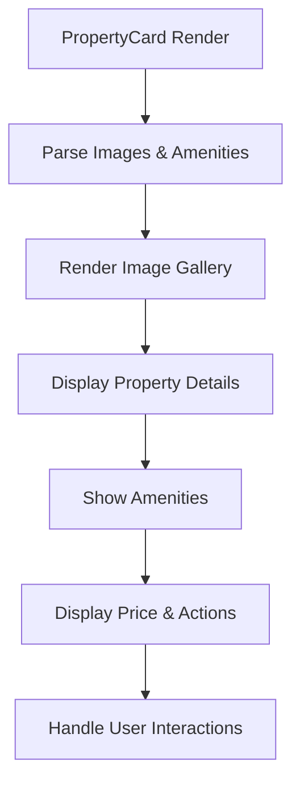
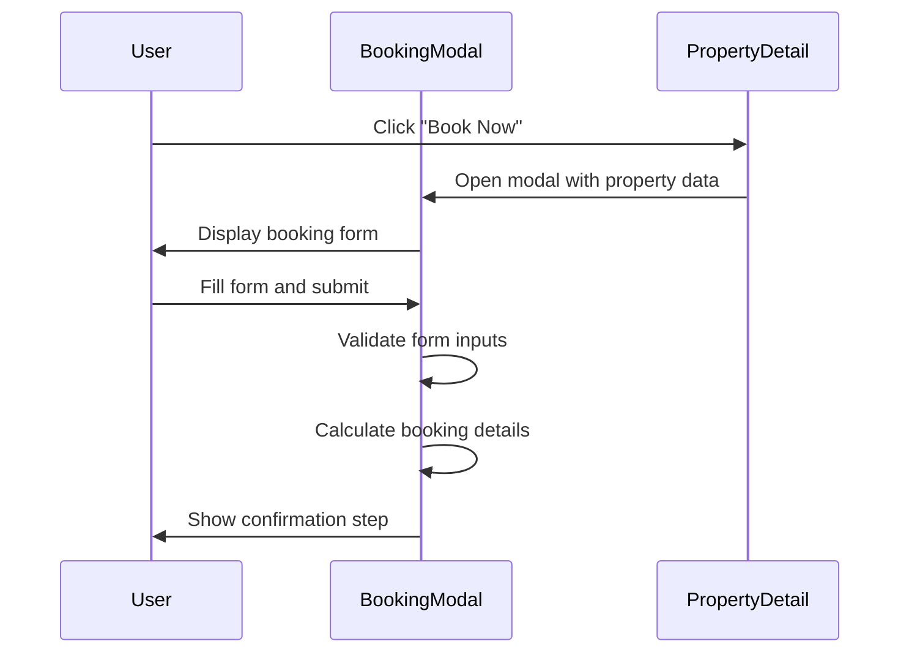
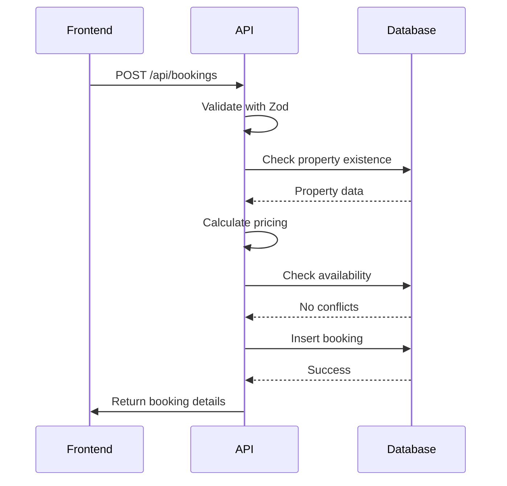
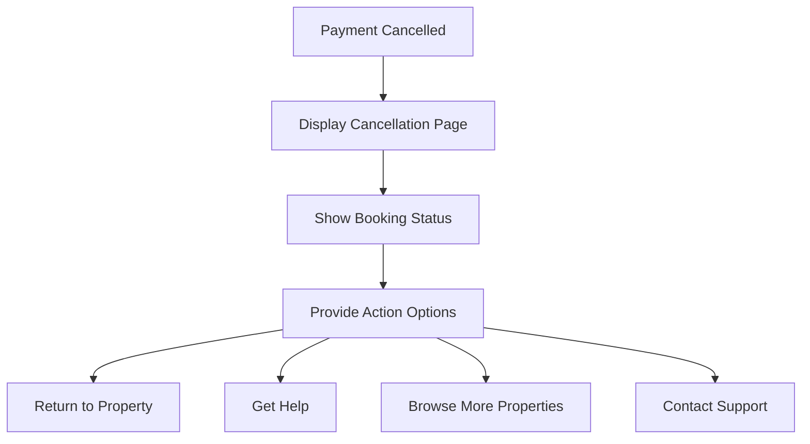
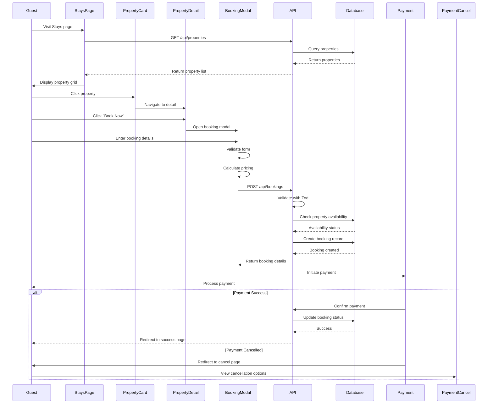

# Guest Booking Journey

<cite>
**Referenced Files in This Document**   
- [PropertyCard.tsx](file://src/react-app/components/PropertyCard.tsx)
- [BookingModal.tsx](file://src/react-app/components/BookingModal.tsx)
- [Stays.tsx](file://src/react-app/pages/Stays.tsx)
- [PaymentCancel.tsx](file://src/react-app/pages/PaymentCancel.tsx)
- [index.ts](file://src/worker/index.ts)
- [types.ts](file://src/shared/types.ts)
</cite>

## Table of Contents
1. [Property Discovery on Stays Page](#property-discovery-on-stays-page)
2. [PropertyCard Component](#propertycard-component)
3. [Property Detail View](#property-detail-view)
4. [Booking Modal Implementation](#booking-modal-implementation)
5. [API Booking Flow](#api-booking-flow)
6. [Payment Processing](#payment-processing)
7. [Booking Confirmation and Cancellation](#booking-confirmation-and-cancellation)
8. [Error Handling and Validation](#error-handling-and-validation)
9. [Sequence Diagram: Booking Flow](#sequence-diagram-booking-flow)

## Property Discovery on Stays Page

The guest booking journey begins on the Stays page, where users can search and filter available properties. The page provides a comprehensive search interface with location, date, guest count, price range, amenities, and rating filters.

The Stays page fetches property data from the `/api/properties` endpoint using the search parameters provided by the user. The results are displayed in a responsive grid layout using the PropertyCard component.

**Section sources**
- [Stays.tsx](file://src/react-app/pages/Stays.tsx#L0-L515)

## PropertyCard Component

The PropertyCard component renders individual property listings with key information including title, location, images, amenities, pricing, and booking actions.

### Key Features:
- **Image Gallery**: Displays multiple property images with navigation controls
- **Amenity Icons**: Visual representation of key amenities (WiFi, parking, pool, etc.)
- **Pricing Display**: Shows nightly rate with currency (SAR)
- **Interactive Elements**: "Details" and "Book Now" buttons for further actions
- **Wishlist Integration**: Heart icon for saving properties to wishlist

The component supports different variants (default, featured, compact, chat) to accommodate various use cases throughout the application.

**Diagram sources**
- [PropertyCard.tsx](file://src/react-app/components/PropertyCard.tsx#L0-L425)

**Section sources**
- [PropertyCard.tsx](file://src/react-app/components/PropertyCard.tsx#L0-L425)

## Property Detail View

When a user clicks on a property card, they are directed to the PropertyDetail page (not fully visible in the codebase but referenced in the Stays page). This page provides comprehensive information about the property including:

- Full image gallery
- Detailed description
- Complete list of amenities
- House rules
- Location map
- Guest reviews
- Availability calendar

The PropertyDetail component would render the PropertyCard in a larger format and provide the primary interface for initiating the booking process through the BookingModal component.

## Booking Modal Implementation

The BookingModal component manages the booking process by collecting guest information and validating availability.

### Key Functions:
- **Guest Information Collection**: Name, email, phone, special requests
- **Date Selection**: Check-in and check-out dates
- **Guest Count**: Number of guests
- **Availability Validation**: Real-time availability checking
- **Pricing Calculation**: Dynamic price calculation based on stay duration

The modal implements a multi-step process:
1. Form input collection
2. Availability and pricing validation
3. Booking confirmation
4. Payment initiation

**Diagram sources**
- [BookingModal.tsx](file://src/react-app/components/BookingModal.tsx#L87-L175)

**Section sources**
- [BookingModal.tsx](file://src/react-app/components/BookingModal.tsx#L349-L382)

## API Booking Flow

The booking process involves a POST request to the `/api/bookings` endpoint with validation handled by Zod and processed through the worker service.

### Request Flow:
1. Frontend sends booking data to `/api/bookings`
2. Server validates request with Zod schema
3. Property availability is checked against existing bookings
4. Pricing is calculated (base rate, service fee, taxes)
5. Booking record is created in the database
6. Confirmation email is sent to the guest
7. Analytics are updated

### Validation Rules:
- **Property Existence**: Verify property exists and is active
- **Date Validity**: Ensure check-out is after check-in
- **Availability**: Check for conflicting bookings
- **Guest Information**: Validate name, email format

**Diagram sources**
- [index.ts](file://src/worker/index.ts#L441-L522)

**Section sources**
- [index.ts](file://src/worker/index.ts#L441-L522)

## Payment Processing

After successful booking creation, the guest is redirected to the payment processing flow. The system supports both standard payment and AI-assisted booking through the chat interface.

The payment flow includes:
- Payment method selection
- Secure payment processing
- Payment success or cancellation handling
- Post-payment redirects

## Booking Confirmation and Cancellation

### Payment Success
Upon successful payment, guests are redirected to a confirmation page that displays:
- Booking details
- Reservation number
- Property information
- Check-in instructions
- Customer support contacts

### Payment Cancellation
If a guest cancels the payment process, they are directed to the PaymentCancel page which provides:

- Clear cancellation message
- Status of the pending booking
- Options to return to property, get help, or browse more properties
- Support contact information
- Reassurance that no charges were applied

**Diagram sources**
- [PaymentCancel.tsx](file://src/react-app/pages/PaymentCancel.tsx#L0-L114)

**Section sources**
- [PaymentCancel.tsx](file://src/react-app/pages/PaymentCancel.tsx#L0-L114)

## Error Handling and Validation

The booking system implements comprehensive error handling at multiple levels:

### Frontend Validation:
- Form field validation (required fields, email format)
- Date range validation
- Guest count validation
- Real-time error display

### Backend Validation:
- Zod schema validation for request body
- Property availability checks
- Database constraint validation
- Transactional integrity

### Error States:
- **Double Booking**: Prevented by availability checks
- **Invalid Dates**: Handled with clear error messages
- **Payment Failure**: Graceful cancellation flow
- **Network Errors**: Retry mechanisms and user feedback

## Sequence Diagram: Booking Flow

**Diagram sources**
- [Stays.tsx](file://src/react-app/pages/Stays.tsx#L0-L515)
- [PropertyCard.tsx](file://src/react-app/components/PropertyCard.tsx#L0-L425)
- [BookingModal.tsx](file://src/react-app/components/BookingModal.tsx#L87-L175)
- [index.ts](file://src/worker/index.ts#L441-L522)
- [PaymentCancel.tsx](file://src/react-app/pages/PaymentCancel.tsx#L0-L114)