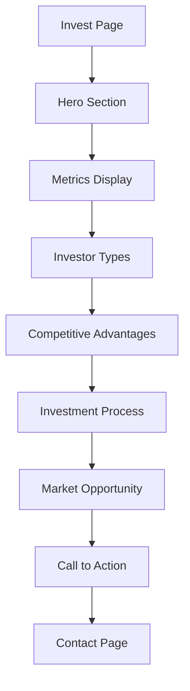
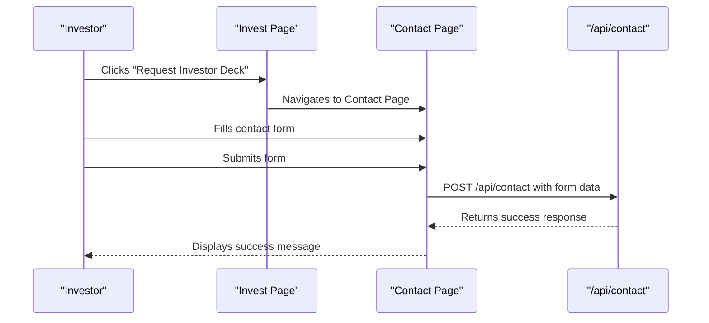
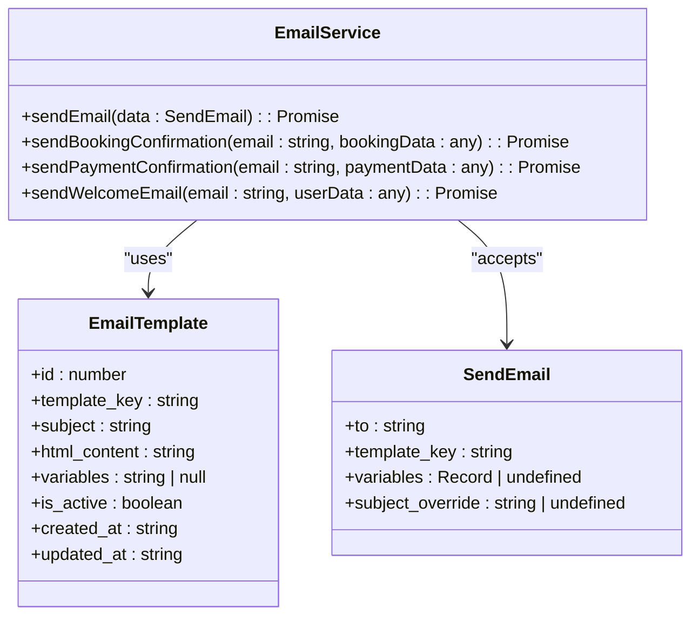

# Investment Opportunities

<cite>
**Referenced Files in This Document**   
- [Invest.tsx](file://src/react-app/pages/Invest.tsx)
- [Contact.tsx](file://src/react-app/pages/Contact.tsx)
- [email.ts](file://src/shared/email.ts)
- [index.ts](file://src/worker/index.ts)
- [7.sql](file://migrations/7.sql)
- [Stories.tsx](file://src/react-app/pages/Stories.tsx)
</cite>

## Table of Contents
1. [Investment Opportunities Overview](#investment-opportunities-overview)
2. [Invest Page Data Presentation](#invest-page-data-presentation)
3. [Contact Form Integration](#contact-form-integration)
4. [Email Notification System](#email-notification-system)
5. [Backend Processing and Data Storage](#backend-processing-and-data-storage)
6. [Follow-Up Workflow and Data Handling](#follow-up-workflow-and-data-handling)
7. [UX Considerations for Trust Building](#ux-considerations-for-trust-building)
8. [Feature Extension Recommendations](#feature-extension-recommendations)

## Investment Opportunities Overview

The Investment Opportunities feature enables users to explore and initiate investment partnerships in Riyadh's real estate market through a comprehensive, data-driven platform. The Invest page serves as the primary interface for potential investors, presenting compelling investment cases with projected ROI, market trends, and portfolio diversification benefits. This feature is designed to attract three primary investor types: Capital Investors seeking portfolio diversification, International Investors wanting access to Saudi markets, and Buy-to-Let Investors interested in traditional real estate ownership.

The investment platform leverages Saudi Arabia's Vision 2030 economic transformation, highlighting Riyadh's rapid growth with key metrics such as 400,000+ annual population growth and 25% year-over-year increase in business tourism. The platform emphasizes a proven track record with 17% average annual returns, $2M+ in assets under management, and 95% investor satisfaction based on annual surveys. The investment process is streamlined into four simple steps: initial consultation, due diligence, investment execution, and return realization.

**Section sources**
- [Invest.tsx](file://src/react-app/pages/Invest.tsx#L0-L290)

## Invest Page Data Presentation

The Invest page presents data-driven investment cases through multiple visual and informational components that build credibility and demonstrate value. The page features a metrics section that prominently displays key performance indicators including 17% average annual ROI, $2M+ in assets under management, 150+ active investors from 12 countries, and 95% investor satisfaction. These metrics are presented in a clean, grid-based layout with large, bold typography to emphasize their significance.

The page categorizes investment opportunities into three distinct types, each with specific benefits:
- **Capital Investor**: Focuses on portfolio diversification with benefits including passive income stream, professional management, and market diversification
- **International Investor**: Emphasizes global market access with benefits including remote investment capabilities, currency diversification, and emerging market exposure
- **Buy-to-Let Investor**: Highlights traditional real estate ownership with benefits including property ownership, long-term appreciation, and rental yield

Market opportunity data is presented to contextualize the investment potential, citing Riyadh's population growth, increasing business tourism, major international events, new visa policies, and mega-projects creating sustained demand. The page also emphasizes competitive advantages including a proven track record, data-driven approach using AI-powered insights, and full transparency with real-time dashboards and regular reports.



**Diagram sources**
- [Invest.tsx](file://src/react-app/pages/Invest.tsx#L0-L290)

**Section sources**
- [Invest.tsx](file://src/react-app/pages/Invest.tsx#L0-L290)

## Contact Form Integration

The Contact form serves as the primary conversion mechanism for investor inquiries, seamlessly integrated with the Invest page through strategic call-to-action buttons. Users can initiate contact by clicking "Request Investor Deck" or "Schedule Consultation" buttons on the Invest page, which navigate to the Contact page where they can submit detailed inquiries. The form captures essential investor information including name, email, phone number, interest category, and message content.

The form implementation includes several UX features to enhance conversion:
- Real-time form validation with required field indicators
- Loading state during submission to provide feedback
- Success state with confirmation message upon successful submission
- Responsive design that works across device sizes
- Clear interest categories including "Investor - Investment Opportunities"

The form submission process is handled through a POST request to the `/api/contact` endpoint, with the frontend managing loading states and error handling. Upon successful submission, users see a confirmation message indicating that the team will respond within 24 hours, building trust in the follow-up process. The form also integrates with the AI chatbot "Sara" through a "Chat with Sara" button, providing an alternative communication channel for immediate assistance.



**Diagram sources**
- [Invest.tsx](file://src/react-app/pages/Invest.tsx#L0-L290)
- [Contact.tsx](file://src/react-app/pages/Contact.tsx#L0-L314)

**Section sources**
- [Contact.tsx](file://src/react-app/pages/Contact.tsx#L0-L314)

## Email Notification System

The email notification system in email.ts handles alerts for new investor leads through a structured template-based approach. When an investor submits the contact form, two emails are automatically triggered: a notification to the business team and a confirmation to the investor. The system uses predefined email templates stored in the database with specific template keys for different communication purposes.

The notification email to the business team uses the template key "contact_form_submission" and includes all submitted information: investor name, email, phone number, interest category, message content, and submission timestamp. This ensures the business team has complete context to respond appropriately. The investor confirmation email uses the template key "contact_form_confirmation" and provides a personalized thank you message, reinforcing that their inquiry has been received.

The email system is built with scalability in mind, using a schema-based approach with Zod for type safety and validation. Email templates are defined with subject lines, HTML content, and variable placeholders that are dynamically replaced with actual data. The system supports variable injection through a renderEmailTemplate function that replaces placeholders like {{name}} and {{interest}} with actual values from the submission.



**Diagram sources**
- [email.ts](file://src/shared/email.ts#L0-L249)

**Section sources**
- [email.ts](file://src/shared/email.ts#L0-L249)
- [index.ts](file://src/worker/index.ts#L1540-L1590)

## Backend Processing and Data Storage

The backend logic for contact submissions is implemented in the worker/index.ts file, handling validation, storage, and spam prevention through a structured process. When a contact form submission is received at the /api/contact endpoint, the system first validates the input data and then stores it in the contact_submissions database table. The database schema includes fields for name, email, phone, interest category, message, status, and timestamps for creation and updates.

Data validation is enforced at multiple levels:
- Frontend validation ensures required fields are completed
- Backend validation through the API endpoint
- Database constraints requiring NOT NULL for essential fields

The system implements basic spam prevention through several mechanisms:
- Required fields that prevent empty submissions
- Server-side validation that checks for valid data formats
- Database constraints that enforce data integrity
- Error handling that prevents system crashes from malformed requests

Data retention policies are implemented through the database schema, which automatically timestamps submissions with created_at and updated_at fields. The contact_submissions table includes a status field that defaults to "new," allowing the business team to track and update the status of each inquiry as it is processed. The system does not currently implement automated data purging, suggesting that submissions are retained indefinitely for record-keeping and compliance purposes.

```mermaid
erDiagram
contact_submissions {
INTEGER id PK
TEXT name NOT NULL
TEXT email NOT NULL
TEXT phone
TEXT interest NOT NULL
TEXT message NOT NULL
TEXT status DEFAULT 'new'
DATETIME created_at DEFAULT CURRENT_TIMESTAMP
DATETIME updated_at DEFAULT CURRENT_TIMESTAMP
}
```

**Diagram sources**
- [7.sql](file://migrations/7.sql#L0-L23)

**Section sources**
- [index.ts](file://src/worker/index.ts#L1540-L1590)
- [7.sql](file://migrations/7.sql#L0-L23)

## Follow-Up Workflow and Data Handling

The follow-up workflow for investor inquiries is designed to ensure timely and professional responses while maintaining data security and privacy. When a new contact submission is received, it is immediately stored in the database with a "new" status, and the business team is alerted via email notification. This dual notification system ensures that inquiries are not missed and can be triaged appropriately.

Investor data is handled securely through several measures:
- Data is transmitted over HTTPS with secure form submission
- Sensitive information is stored in a protected database
- Access to contact submissions is likely restricted to authorized personnel
- The system separates investor data from other user data in dedicated tables

The follow-up process begins with the business team reviewing the email notification and accessing the full submission details in the database. The status field in the contact_submissions table allows the team to track the progress of each inquiry from "new" to "in progress" to "resolved." While the current implementation does not show automated status updates, the structure supports this functionality for future enhancement.

Data privacy is maintained by only collecting essential information needed for investment inquiries, with phone numbers marked as optional. The confirmation email sent to investors does not contain sensitive information beyond what they submitted, and the system does not appear to share investor data with third parties based on the available code.

**Section sources**
- [index.ts](file://src/worker/index.ts#L1540-L1590)
- [Contact.tsx](file://src/react-app/pages/Contact.tsx#L0-L314)

## UX Considerations for Trust Building

The investment platform incorporates several UX considerations to build trust with potential investors through social proof and transparent financial modeling. The most prominent trust-building element is the inclusion of investor testimonials on the Stories page, which features real investor success stories with names, photos, and specific results. These testimonials highlight tangible outcomes such as 19% ROI over two years and 400% portfolio growth, providing social proof of the platform's effectiveness.

The platform emphasizes transparency through multiple mechanisms:
- Clear presentation of average 17% annual returns with context about performance consistency
- Disclosure of 95% investor satisfaction based on annual surveys
- Specific metrics about assets under management ($2M+) and active investors (150+)
- Detailed breakdown of investment types and their specific benefits

Financial modeling is presented in a transparent manner through the metrics section, which shows verifiable data points rather than vague promises. The investment process is clearly outlined in four simple steps, reducing perceived complexity and building confidence in the onboarding experience. The inclusion of Riyadh-specific market data, such as population growth and business tourism trends, demonstrates a data-driven approach that reinforces the investment thesis.

Additional trust signals include:
- Professional design with consistent branding
- High-quality imagery of Riyadh's skyline
- Clear contact information and response time expectations (24 hours)
- Multiple communication channels (form, email, phone, chatbot)

**Section sources**
- [Invest.tsx](file://src/react-app/pages/Invest.tsx#L0-L290)
- [Stories.tsx](file://src/react-app/pages/Stories.tsx#L0-L250)

## Feature Extension Recommendations

To enhance the investment opportunities feature, several extensions could be implemented to improve functionality and user experience. An investor portal could be developed to provide authenticated investors with personalized dashboards showing their portfolio performance, upcoming distributions, and market insights. This portal could include features such as document storage for investment agreements, secure messaging with the investment team, and performance analytics with comparison benchmarks.

Automated qualification workflows could be implemented to streamline the investor onboarding process. This could include:
- Automated investor accreditation checks through integration with third-party services
- Risk assessment questionnaires that recommend appropriate investment products
- Document collection workflows with e-signature capabilities
- KYC/AML compliance checks integrated into the initial contact process

Additional enhancements could include:
- Investment calculator tools that allow users to model potential returns based on different scenarios
- Webinar registration for investor education sessions
- Portfolio simulation tools that show diversification benefits
- Automated drip campaigns that nurture leads with educational content based on their interest category

The system could also be extended with advanced analytics to track conversion rates from contact submission to investment, allowing the business to optimize the investor journey. Integration with CRM systems would enable better lead management and follow-up tracking, while adding multilingual support could further expand the platform's appeal to international investors.

**Section sources**
- [Invest.tsx](file://src/react-app/pages/Invest.tsx#L0-L290)
- [Contact.tsx](file://src/react-app/pages/Contact.tsx#L0-L314)
- [email.ts](file://src/shared/email.ts#L0-L249)