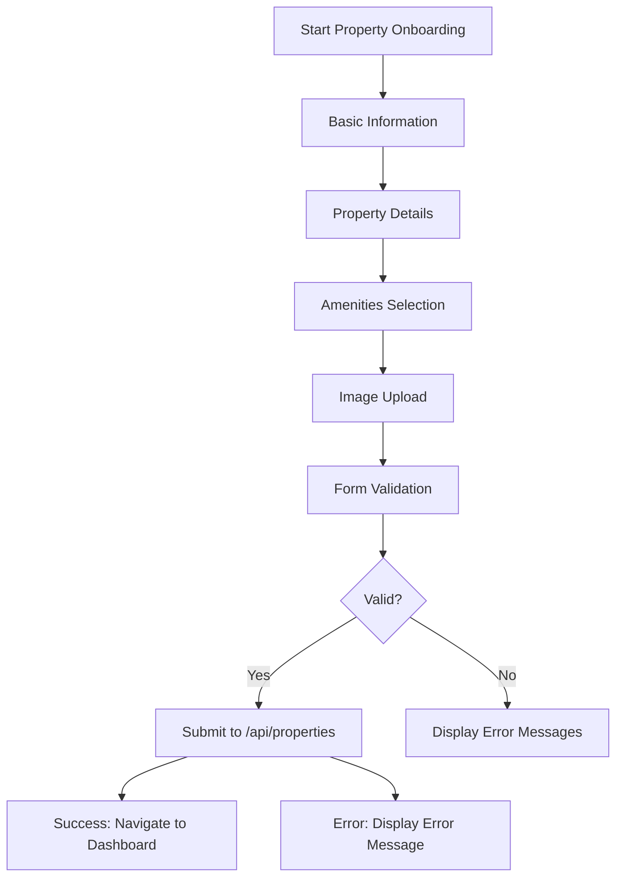
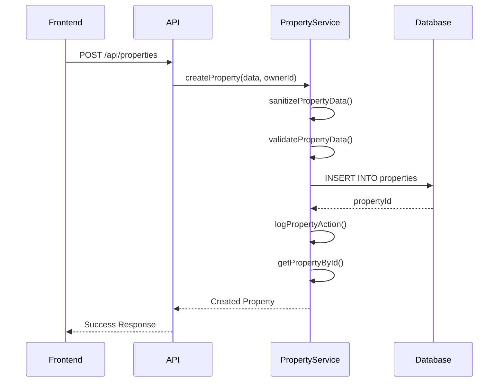
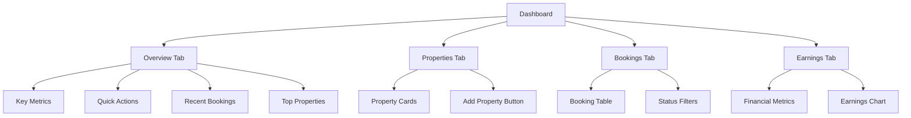
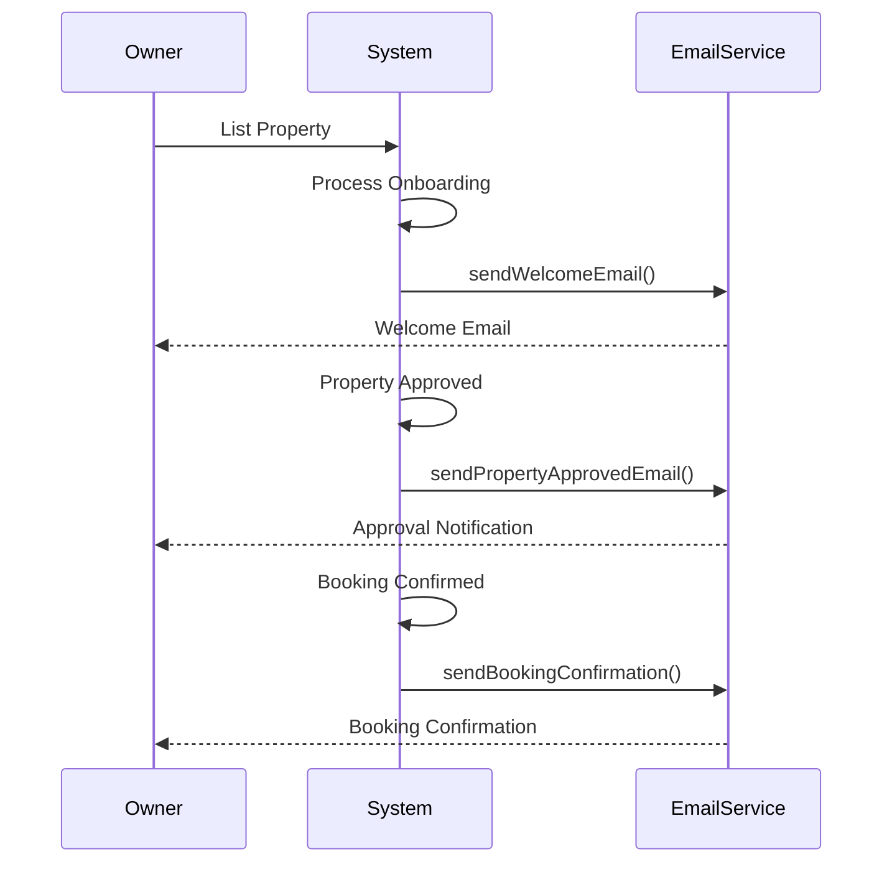

# Owner Income Generation

<cite>
**Referenced Files in This Document**   
- [Owners.tsx](file://src/react-app/pages/Owners.tsx)
- [PropertyForm.tsx](file://src/react-app/pages/PropertyForm.tsx)
- [Dashboard.tsx](file://src/react-app/pages/Dashboard.tsx)
- [email.ts](file://src/shared/email.ts)
- [PropertyService.ts](file://src/server/services/PropertyService.ts)
</cite>

## Table of Contents
1. [Introduction](#introduction)
2. [Onboarding Funnel: Owners Page](#onboarding-funnel-owners-page)
3. [Property Onboarding: PropertyForm](#property-onboarding-propertyform)
4. [Backend Property Management](#backend-property-management)
5. [Owner Dashboard: Operational Hub](#owner-dashboard-operational-hub)
6. [Data Flow and Persistence](#data-flow-and-persistence)
7. [Security and Data Privacy](#security-and-data-privacy)
8. [Owner Notifications](#owner-notifications)
9. [Analytics and Performance Reporting](#analytics-and-performance-reporting)
10. [Best Practices and Troubleshooting](#best-practices-and-troubleshooting)

## Introduction
This document provides a comprehensive overview of the property owner journey within the HabibiStay platform, focusing on generating passive income through property listing and management. It details the complete workflow from initial onboarding through the Owners page, property creation via the PropertyForm, backend processing through the API, and ongoing management via the Dashboard. The documentation covers data flow, security considerations, notification systems, and analytics aggregation, providing both technical implementation details and practical guidance for maximizing occupancy and earnings.

## Onboarding Funnel: Owners Page
The Owners page serves as the primary onboarding funnel for property owners, designed to convert visitors into active hosts by clearly communicating value propositions and guiding them through a simple three-step process.

The page features a compelling hero section with the headline "Turn Your Keys into Consistent Cashflow" and a strong call-to-action (CTA) button "Start Earning" that directs users to the contact page. Supporting this primary CTA is a secondary option "Owner Stories" that provides social proof.

The value proposition is communicated through three key benefits:
- **Full Management**: The platform handles guest communication, maintenance, and operations
- **Pricing Optimization**: AI-powered dynamic pricing maximizes revenue
- **Complete Transparency**: Real-time reporting and detailed analytics

These benefits are reinforced by impressive statistics displayed in the Stats section, including a 17% average annual ROI, 95% occupancy rate, 24/7 support availability, and over 500 properties managed.

The onboarding process is simplified into three clear steps:
1. **Sign Up**: Create an account and provide property information
2. **We Manage**: The platform handles listings, guests, cleaning, and maintenance
3. **You Earn**: Receive monthly payouts with detailed performance reports

Additional features include guest management, maintenance & cleaning, performance analytics, revenue optimization, and insurance & protection, all designed to minimize owner effort while maximizing returns.

**Section sources**
- [Owners.tsx](file://src/react-app/pages/Owners.tsx#L1-L251)

## Property Onboarding: PropertyForm
The PropertyForm component provides a comprehensive interface for owners to onboard new properties with all necessary details including images, location, pricing, and availability rules.

The form is structured into four main sections:

### Basic Information
This section captures essential property details:
- **Title**: Required field for the property name
- **Description**: Text area for detailed property features
- **Location**: Required field with a map pin icon, accepting location names like "Olaya District, Riyadh"

### Property Details
This section collects quantitative information:
- **Maximum Guests**: Number input (1-20)
- **Price per Night**: Currency input in SAR with dollar sign prefix
- **Bedrooms**: Number input (0-10)
- **Bathrooms**: Number input (0-10)

### Amenities
The amenities section provides a user-friendly interface with:
- Predefined common amenities (WiFi, Air Conditioning, Kitchen, Parking, TV, Balcony, Pool, Gym, Elevator, Security, Laundry, Garden, BBQ Area, Terrace, Fireplace, Hot Tub)
- Toggle buttons that highlight selected amenities
- Visual feedback showing selected amenities with removal options

### Images
The image management system includes:
- Sample images from Unsplash for quick addition
- Visual grid display of added images
- Main photo designation (first image is primary)
- Image removal functionality
- Support for multiple image uploads

The form handles both property creation (POST) and editing (PUT) operations, with appropriate loading states and validation. Form submission is processed through the `/api/properties` endpoint, with navigation to the dashboard upon successful completion.

**Diagram sources**
- [PropertyForm.tsx](file://src/react-app/pages/PropertyForm.tsx#L1-L493)

**Section sources**
- [PropertyForm.tsx](file://src/react-app/pages/PropertyForm.tsx#L1-L493)

## Backend Property Management
The backend property management system centers around the `/api/properties` endpoint and the PropertyService class, handling property creation, validation, and storage in the database.

### API Endpoint Structure
The API provides multiple endpoints for property management:
- **POST /api/properties**: Create new property
- **PUT /api/properties/:id**: Update existing property
- **GET /api/properties/:id**: Retrieve property details
- **GET /api/properties/my-properties**: List owner's properties
- **PUT /api/admin/properties/:propertyId/status**: Update property status (admin)

### Property Creation Workflow
The property creation process follows a structured workflow:

**Diagram sources**
- [PropertyService.ts](file://src/server/services/PropertyService.ts#L34-L100)
- [PropertyForm.tsx](file://src/react-app/pages/PropertyForm.tsx#L100-L150)

### Data Validation and Sanitization
The system implements comprehensive validation:
- **Title**: Minimum 5 characters
- **Description**: Minimum 20 characters
- **Location**: Required field
- **Max Guests**: Between 1-20
- **Price per Night**: Between 10-10,000 SAR
- **HTML Sanitization**: Input fields are sanitized to prevent XSS attacks
- **JSON Storage**: Amenities and images are stored as JSON strings in the database

### Database Schema
The properties table includes comprehensive fields:
- Core information (title, description, location)
- Capacity details (max_guests, bedrooms, bathrooms)
- Pricing (price_per_night)
- Features (amenities, images as JSON)
- Ownership (owner_id)
- Status flags (is_active, is_featured)
- Timestamps (created_at, updated_at)

**Section sources**
- [PropertyService.ts](file://src/server/services/PropertyService.ts#L34-L605)

## Owner Dashboard: Operational Hub
The Dashboard page serves as the owner's operational hub, providing comprehensive visibility into bookings, earnings, and property performance analytics.

### Navigation and Tabs
The dashboard features four main tabs:
- **Overview**: Summary of key metrics
- **Properties**: Management of listed properties
- **Bookings**: Booking history and management
- **Earnings**: Financial performance and analytics

### Key Metrics and Statistics
The dashboard displays four primary statistics:
- **Total Earnings**: Sum of completed booking amounts
- **Active Properties**: Count of properties with is_active flag
- **Completed Bookings**: Count of bookings with "completed" status
- **Average Rating**: Property rating average

These metrics include percentage changes from the previous period with visual indicators (green for positive, red for negative).

### Quick Actions
The Overview tab provides three quick action buttons:
- **Add New Property**: Navigate to property creation form
- **View Wishlist**: Access saved properties
- **Account Settings**: Manage profile information

### Property Management
The Properties tab displays all owner's listings in a card-based grid, showing:
- Property image
- Title and location
- Price per night
- Active/inactive status
- View and Edit actions

For owners without properties, a call-to-action encourages listing their first property.

### Booking Management
The Bookings tab presents a comprehensive table with columns for:
- Guest information (name, email)
- Property name
- Check-in and check-out dates
- Booking amount
- Status (confirmed, pending, cancelled)
- Action buttons

### Earnings Analytics
The Earnings tab provides detailed financial reporting:
- Total earnings with month-over-month comparison
- This month's earnings
- Average earnings per completed booking
- Placeholder for earnings chart visualization

**Diagram sources**
- [Dashboard.tsx](file://src/react-app/pages/Dashboard.tsx#L1-L485)

**Section sources**
- [Dashboard.tsx](file://src/react-app/pages/Dashboard.tsx#L1-L485)

## Data Flow and Persistence
The data flow from form submission to database persistence follows a well-defined pattern with specific handling for images and moderation workflows.

### Complete Data Flow

```mermaid
flowchart LR
A[PropertyForm] --> B[Form Submission]
B --> C[API Request to /api/properties]
C --> D[PropertyService.createProperty]
D --> E[Data Validation]
E --> F[Data Sanitization]
F --> G[Database Insertion]
G --> H[Image Upload Processing]
H --> I[Cloud Storage]
I --> J[Database Update with Image URLs]
J --> K[Audit Logging]
K --> L[Success Response]
L --> M[Dashboard Update]
```

**Diagram sources**
- [PropertyForm.tsx](file://src/react-app/pages/PropertyForm.tsx#L1-L493)
- [PropertyService.ts](file://src/server/services/PropertyService.ts#L34-L605)

### Image Handling Workflow
The image handling system follows these steps:
1. Client-side validation of file type and size
2. Direct upload to cloud storage (implementation placeholder)
3. Storage of image URLs in the database as JSON array
4. First image designated as primary/main photo
5. Support for image removal with cloud storage cleanup

The system validates images to ensure:
- File size under 10MB
- Allowed types: JPEG, PNG, WebP, GIF
- Proper file extensions

### Moderation Workflows
While explicit moderation workflows are not detailed in the code, the system includes several safeguards:
- Property creation triggers a notification that the property "will be reviewed within 24 hours"
- Admin endpoints exist for property status management
- Audit logging tracks all property actions
- Input sanitization prevents XSS attacks

The PropertyService includes methods for admin-only status updates, suggesting a moderation process where administrators can activate or feature properties after review.

**Section sources**
- [PropertyForm.tsx](file://src/react-app/pages/PropertyForm.tsx#L1-L493)
- [PropertyService.ts](file://src/server/services/PropertyService.ts#L34-L605)

## Security and Data Privacy
The system implements multiple security layers to protect owner authentication and ensure data privacy.

### Authentication and Authorization
- **JWT-based authentication**: Secure token verification
- **Role-based access control**: Different permissions for owners, admins
- **Ownership validation**: PropertyService verifies owner ownership before operations
- **Admin verification**: Specific email patterns identify admin users

### Data Protection
- **Encryption**: SSL/TLS for data transmission
- **Input sanitization**: HTML sanitization to prevent XSS
- **Data validation**: Comprehensive schema validation
- **Rate limiting**: Protection against brute force attacks
- **IP blocking**: Security system can block suspicious IPs

### Security Features
- **Two-factor authentication**: Recommended in security notifications
- **Password policies**: Minimum 8 characters with complexity requirements
- **Session management**: Configurable session timeout
- **Security audits**: Regular audit logging of property actions
- **Compliance**: GDPR and PCI DSS compliance configurations

The system also includes a security status indicator that evaluates:
- 2FA status
- Password age
- Email verification
- Recent login locations

**Section sources**
- [PropertyService.ts](file://src/server/services/PropertyService.ts#L34-L605)
- [SecurityNotifications.tsx](file://src/react-app/components/SecurityNotifications.tsx#L296-L400)
- [security-config.ts](file://src/shared/security-config.ts#L303-L336)

## Owner Notifications
The notification system uses templated emails to keep owners informed about key events in their property management journey.

### Email Template System
The system defines a comprehensive template schema with:
- Template key identifiers
- Subject lines
- HTML content with variables
- Variable definitions
- Active status flag

Key email templates include:
- **PROPERTY_APPROVED**: Notifies owners when their property is approved
- **PROPERTY_REJECTED**: Informs owners if their property doesn't meet standards
- **WELCOME**: Onboarding email for new owners
- **BOOKING_CONFIRMATION**: Booking notifications
- **PAYMENT_SUCCESS**: Payment processing confirmations

### Template Variables
Templates use mustache-style variables ({{variable_name}}) that are replaced with actual data:
- Owner names
- Property details (title, location, URL)
- Booking information (dates, amounts, IDs)
- Dashboard links

### Email Service Interface
The system defines an interface for email services with methods for:
- Generic email sending
- Booking confirmations
- Payment confirmations
- Welcome emails

The renderEmailTemplate function processes templates by replacing variables with actual values from the data object.

**Diagram sources**
- [email.ts](file://src/shared/email.ts#L0-L250)

**Section sources**
- [email.ts](file://src/shared/email.ts#L0-L250)

## Analytics and Performance Reporting
The system aggregates analytics from booking data to provide owners with comprehensive performance insights.

### Data Aggregation
Analytics are derived from multiple data sources:
- **Booking data**: Revenue, occupancy, booking patterns
- **Property views**: Marketing effectiveness
- **Reviews**: Guest satisfaction
- **Search data**: Market demand

### Key Performance Metrics
The Dashboard displays several key metrics:
- **Total Earnings**: Sum of completed booking amounts
- **Occupancy Rate**: Implied by booking frequency
- **Average Rating**: Guest satisfaction metric
- **Booking Conversion**: Inferred from views to bookings

### Reporting Structure
The PropertyService includes methods for:
- **getPropertyStats**: Aggregates property statistics including total properties, active properties, average rating, total views, and total bookings
- **searchProperties**: Enables filtering and sorting of properties with analytics
- **getPropertyById**: Includes average rating and review count in property details

### Future Analytics
The Earnings tab includes a placeholder for a chart visualization, indicating planned enhancements for:
- Monthly earnings trends
- Seasonal performance patterns
- Comparative analysis
- Market benchmarking

The system is designed to support comprehensive business intelligence for property owners, helping them optimize pricing, marketing, and operations.

**Section sources**
- [Dashboard.tsx](file://src/react-app/pages/Dashboard.tsx#L1-L485)
- [PropertyService.ts](file://src/server/services/PropertyService.ts#L34-L605)

## Best Practices and Troubleshooting
This section addresses common issues with incomplete listings and provides best practices for maximizing occupancy and earnings.

### Common Issues
**Incomplete Listings:**
- Missing property title or description
- Insufficient images (especially lack of main photo)
- Incomplete location information
- Missing pricing details
- No amenities selected

**Resolution Strategies:**
- Implement form validation with clear error messages
- Provide sample content for descriptions
- Offer quick-add sample images
- Use progressive disclosure for complex fields
- Implement auto-save functionality

### Best Practices for Maximizing Occupancy
**Property Presentation:**
- Use high-quality images (minimum 5, with professional photography)
- Write compelling descriptions highlighting unique features
- Select relevant amenities that match the property
- Set competitive pricing based on market research
- Complete all optional fields (house rules, cancellation policy)

**Pricing Optimization:**
- Utilize the platform's AI-powered dynamic pricing
- Consider seasonal demand patterns
- Offer competitive rates during low-demand periods
- Implement minimum and maximum stay requirements
- Consider offering discounts for longer stays

**Availability Management:**
- Keep calendar updated regularly
- Set realistic check-in/check-out times
- Plan for cleaning and maintenance windows
- Consider local events and holidays
- Use the platform's availability rules

**Performance Monitoring:**
- Regularly check dashboard metrics
- Respond promptly to booking inquiries
- Maintain high property standards
- Encourage guest reviews
- Address any negative feedback promptly

By following these best practices, property owners can maximize their occupancy rates, improve their property rankings, and increase their overall earnings on the HabibiStay platform.

**Section sources**
- [PropertyForm.tsx](file://src/react-app/pages/PropertyForm.tsx#L1-L493)
- [Dashboard.tsx](file://src/react-app/pages/Dashboard.tsx#L1-L485)
- [Owners.tsx](file://src/react-app/pages/Owners.tsx#L1-L251)