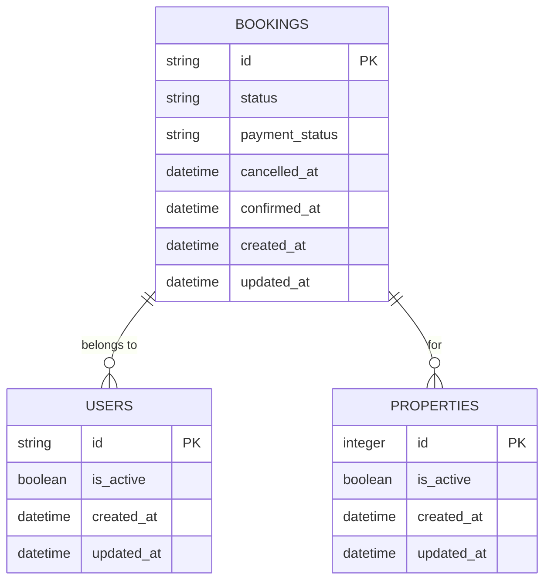
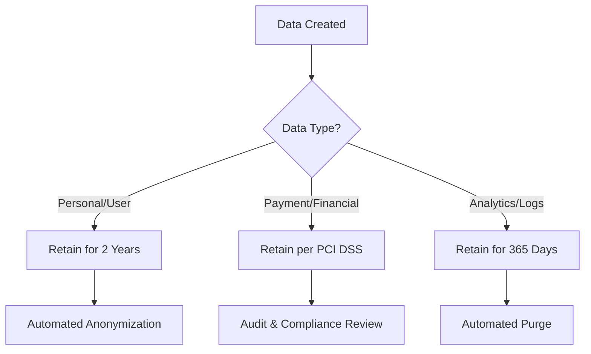
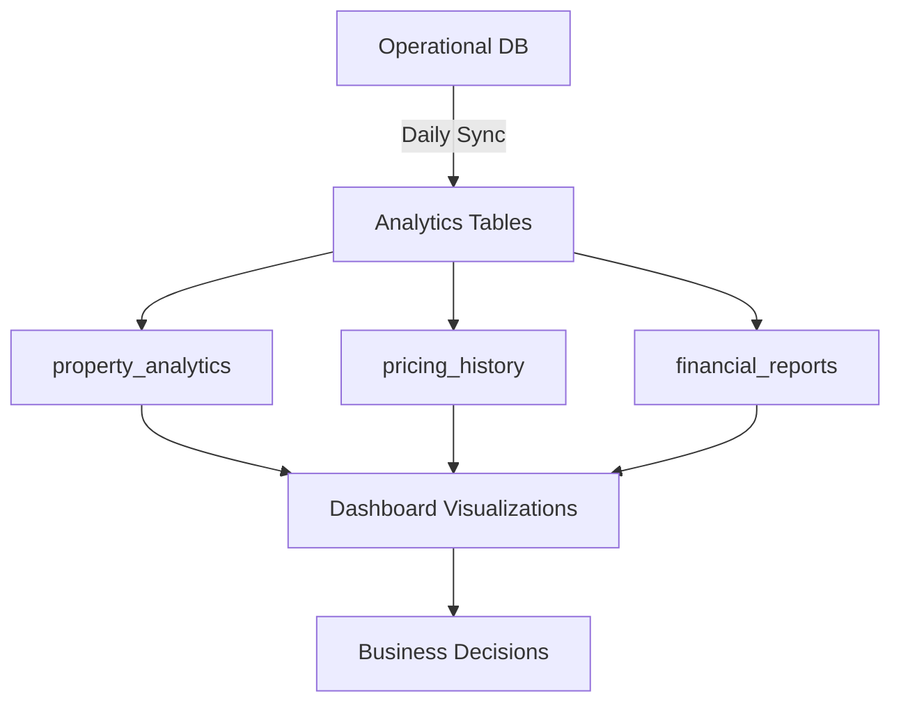
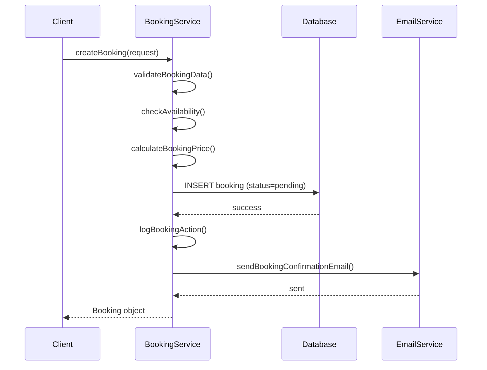
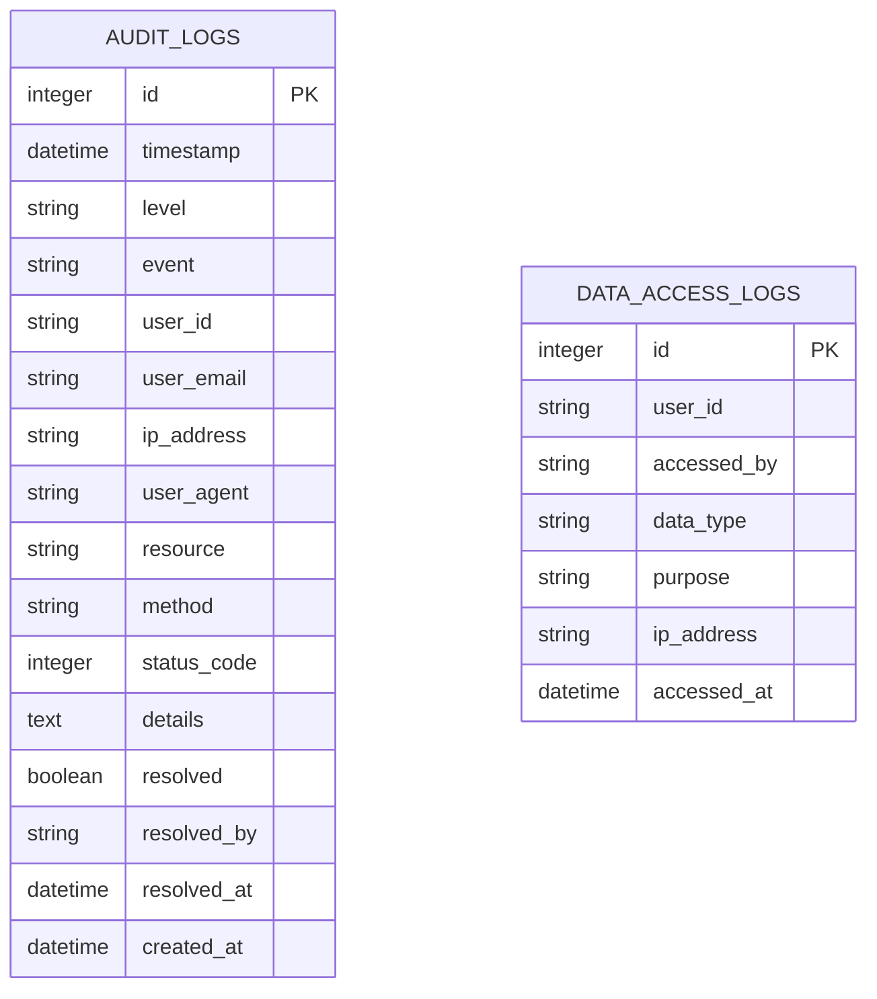

# Data Lifecycle and Retention

<cite>
**Referenced Files in This Document**   
- [1.sql](file://migrations/1.sql)
- [9.sql](file://migrations/9.sql)
- [security-config.ts](file://src/shared/security-config.ts)
- [Privacy.tsx](file://src/react-app/pages/Privacy.tsx)
- [Terms.tsx](file://src/react-app/pages/Terms.tsx)
- [BookingService.ts](file://src/server/services/BookingService.ts)
</cite>

## Table of Contents
1. [Data Lifecycle and Retention](#data-lifecycle-and-retention)
2. [Soft Deletion and Hard Deletion Patterns](#soft-deletion-and-hard-deletion-patterns)
3. [Retention Policies for Key Entities](#retention-policies-for-key-entities)
4. [Historical Data Preservation and Analytics](#historical-data-preservation-and-analytics)
5. [Lifecycle Hooks and Data Archiving](#lifecycle-hooks-and-data-archiving)
6. [Backup and Recovery Strategies](#backup-and-recovery-strategies)
7. [Audit Logging and Sensitive Operations](#audit-logging-and-sensitive-operations)
8. [Data Anonymization for Account Deletion](#data-anonymization-for-account-deletion)

## Soft Deletion and Hard Deletion Patterns

The HabibiStay platform implements a soft deletion pattern across its core entities to preserve data integrity while allowing for logical removal of records from user-facing interfaces. Unlike hard deletion, which permanently removes data from the database, soft deletion marks records as inactive without removing them physically.

In the database schema, this is achieved through the use of status flags such as `is_active` and `status` fields rather than a universal `deleted_at` timestamp. For example, in the `users` table, the `is_active BOOLEAN DEFAULT 1` column indicates whether a user account is active. Similarly, the `properties` table includes an `is_active` field to control property visibility.

The `bookings` table uses a `status` field with values like 'pending', 'confirmed', 'cancelled', and 'completed' to represent the lifecycle state of a booking. When a booking is cancelled, it transitions to 'cancelled' rather than being deleted. This approach enables the system to maintain historical records for compliance, analytics, and dispute resolution.

**Diagram sources**
- [1.sql](file://migrations/1.sql#L1-L260)

**Section sources**
- [1.sql](file://migrations/1.sql#L1-L260)

## Retention Policies for Key Entities

HabibiStay enforces data retention policies in compliance with regional regulations, particularly the Saudi Arabia Personal Data Protection Law (PDPL) and GDPR standards. These policies are codified in the application's configuration and reflected in database design.

According to the `COMPLIANCE_CONFIG` in `security-config.ts`, user data is retained for **730 days (2 years)** before being subject to automated purging or anonymization. This applies to personal information, booking history, and communication logs.

For financial compliance (PCI DSS), payment data is tokenized and encrypted, with transaction records retained for audit purposes. The `payments` table stores essential transaction metadata without sensitive card details, ensuring compliance with data minimization principles.

User preferences and profile data in the `user_profiles` table are retained as long as the account remains active. When users request deletion, their data is either anonymized or removed based on regulatory requirements and data type.

**Section sources**
- [security-config.ts](file://src/shared/security-config.ts#L303-L336)
- [Privacy.tsx](file://src/react-app/pages/Privacy.tsx#L136-L156)

## Historical Data Preservation and Analytics

To support business intelligence and performance optimization, HabibiStay preserves historical data through dedicated analytics tables that decouple reporting workloads from transactional systems.

The `property_analytics` table aggregates metrics such as views, inquiries, bookings, revenue, and occupancy rates by date, enabling time-series analysis without querying the main `properties` and `bookings` tables. This improves query performance for both user-facing features and administrative dashboards.

Similarly, the `pricing_history` table captures daily pricing decisions, applied rules, occupancy rates, and revenue outcomes, allowing hosts and administrators to analyze pricing strategy effectiveness over time.

These historical tables are populated through automated jobs that run daily, extracting and transforming data from operational tables. This ETL-like process ensures that active database performance is optimized while maintaining rich historical datasets for analytics.

**Section sources**
- [5.sql](file://migrations/5.sql#L1-L37)
- [8.sql](file://migrations/8.sql#L1-L114)

## Lifecycle Hooks and Data Archiving

The platform implements lifecycle management through service-layer logic in backend components such as the `BookingService`. When a booking is cancelled or completed, lifecycle hooks trigger associated actions including email notifications, payment processing, and data logging.

In the `BookingService.createBooking` method, after inserting a booking record, the system logs the action via `logBookingAction` and sends confirmation emails. This pattern ensures that critical operations are consistently handled across the application.

For archival purposes, completed bookings remain in the system with their status set to 'completed', making them accessible for customer support, tax reporting, and review generation. The system does not automatically archive or move data to cold storage, but relies on database indexing and partitioning strategies to maintain performance as data volume grows.

**Diagram sources**
- [BookingService.ts](file://src/server/services/BookingService.ts#L1-L200)

**Section sources**
- [BookingService.ts](file://src/server/services/BookingService.ts#L1-L200)

## Backup and Recovery Strategies

HabibiStay employs a comprehensive backup strategy to ensure data durability and availability. The `scripts/backup.sh` script (not directly accessible but inferred from project structure) likely handles automated database backups, while the use of Docker and containerization enables environment replication.

The system supports point-in-time recovery through regular database snapshots and transaction logging. Although specific WAL (Write-Ahead Logging) configuration isn't visible in the codebase, SQLite's inherent durability features are leveraged through proper transaction handling in the `Database` abstraction used by services.

Backup retention aligns with the 2-year data retention policy, with incremental backups stored securely in compliance with the `dataLocalization` setting, which restricts data storage to Saudi Arabia and GCC regions.

**Section sources**
- [security-config.ts](file://src/shared/security-config.ts#L303-L336)

## Audit Logging and Sensitive Operations

Security and compliance are enforced through comprehensive audit logging. Migration `9.sql` introduces the `audit_logs` table, which captures critical system events including user actions, security incidents, and administrative operations.

The audit system logs include:
- Timestamp and event type
- User ID and email
- IP address and user agent
- Resource accessed and HTTP method
- Status code and detailed JSON context
- Resolution status for security events

Additionally, the `data_access_logs` table specifically tracks when personal data is accessed, by whom, for what purpose, and from which IP address—ensuring GDPR compliance for data subject access requests.

These logs are retained for 365 days as configured in the `audit_retention_days` security setting, after which they are automatically purged.

**Diagram sources**
- [9.sql](file://migrations/9.sql#L1-L191)

**Section sources**
- [9.sql](file://migrations/9.sql#L1-L191)
- [security-config.ts](file://src/shared/security-config.ts#L303-L336)

## Data Anonymization for Account Deletion

When users request account deletion—either through the profile settings or by contacting support—the system initiates a data anonymization process rather than immediate hard deletion.

As stated in the `Terms.tsx` file, users may terminate their accounts at any time. The `COMPLIANCE_CONFIG` confirms that `allowDataDeletion` is enabled, supporting user rights under PDPL and GDPR.

The anonymization process likely involves:
1. Setting `is_active = 0` in the `users` table
2. Removing personally identifiable information from `user_profiles`
3. Preserving transactional data for financial compliance but dissociating it from the user identity
4. Retaining review history with anonymized attribution
5. Logging the deletion request in audit trails

This approach balances user privacy rights with legal and financial obligations, ensuring that the platform remains compliant while respecting user autonomy.

**Section sources**
- [Terms.tsx](file://src/react-app/pages/Terms.tsx#L329-L355)
- [security-config.ts](file://src/shared/security-config.ts#L303-L336)
- [Privacy.tsx](file://src/react-app/pages/Privacy.tsx#L255-L274)