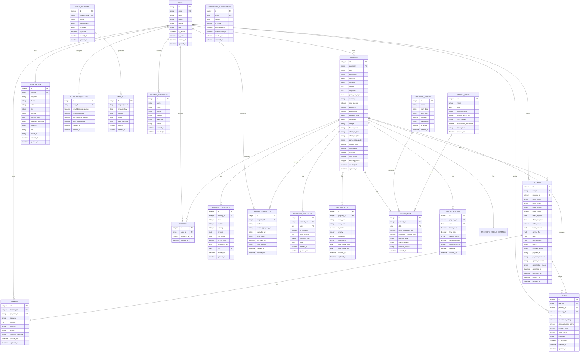

# Data Persistence

<cite>
**Referenced Files in This Document**   
- [1.sql](file://migrations/1.sql)
- [2.sql](file://migrations/2.sql)
- [3.sql](file://migrations/3.sql)
- [4.sql](file://migrations/4.sql)
- [5.sql](file://migrations/5.sql)
- [6.sql](file://migrations/6.sql)
- [7.sql](file://migrations/7.sql)
- [8.sql](file://migrations/8.sql)
- [1/down.sql](file://migrations/1/down.sql)
- [2/down.sql](file://migrations/2/down.sql)
- [3/down.sql](file://migrations/3/down.sql)
- [4/down.sql](file://migrations/4/down.sql)
- [5/down.sql](file://migrations/5/down.sql)
- [6/down.sql](file://migrations/6/down.sql)
- [7/down.sql](file://migrations/7/down.sql)
- [types.ts](file://src/shared/types.ts)
</cite>

## Table of Contents
1. [Introduction](#introduction)
2. [Database Schema Evolution](#database-schema-evolution)
3. [Entity-Relationship Model](#entity-relationship-model)
4. [Type Contract Alignment](#type-contract-alignment)
5. [Data Lifecycle and Retention](#data-lifecycle-and-retention)
6. [Migration Best Practices](#migration-best-practices)

## Introduction
This document provides comprehensive documentation of the database schema for HabibiStay, a hospitality platform offering property rentals, bookings, and AI-powered guest services. The system implements a progressive migration strategy to evolve its data model from core entities (users, properties, bookings) to advanced features (dynamic pricing, analytics, email automation). The schema supports a full-stack application with React frontend, TypeScript shared types, and SQLite database backend. This documentation details each migration step, maps database tables to TypeScript interfaces, explains rollback procedures, and illustrates the complete entity-relationship model.

## Database Schema Evolution

### Migration 1: Core Entities and Relationships
The initial migration establishes the foundational data model for HabibiStay, creating tables for users, properties, bookings, payments, wishlists, reviews, and administrative components.

```sql
-- Core Users and Roles
CREATE TABLE users (
  id TEXT PRIMARY KEY,
  email TEXT UNIQUE NOT NULL,
  name TEXT NOT NULL,
  avatar TEXT,
  phone TEXT,
  role TEXT DEFAULT 'guest' CHECK (role IN ('guest', 'host', 'admin')),
  is_verified BOOLEAN DEFAULT 0,
  is_active BOOLEAN DEFAULT 1,
  created_at DATETIME DEFAULT CURRENT_TIMESTAMP,
  updated_at DATETIME DEFAULT CURRENT_TIMESTAMP
);
```

The `users` table serves as the central identity system with role-based access control. The `properties` table represents rental listings with comprehensive details including location, pricing, amenities, and availability settings. The `bookings` table manages reservation lifecycle with status tracking and payment integration. Supporting tables include `payments` for transaction processing, `wishlists` for user favorites, and `reviews` for post-stay feedback with detailed rating dimensions.

Additional specialized tables support AI functionality (`ai_config`, `chat_conversations`), business operations (`admin_settings`, `financial_reports`), and technical infrastructure (`analytics_events`, `channel_connections`). The schema implements referential integrity through foreign key constraints and ensures data quality with check constraints on enumerated fields.

**Section sources**
- [1.sql](file://migrations/1.sql#L1-L260)

### Migration 2: Seed Data for Core Properties
The second migration populates the database with initial property listings and administrative settings to enable immediate platform functionality.

```sql
INSERT INTO properties (user_id, title, description, location, price_per_night, max_guests, bedrooms, bathrooms, amenities, images, is_featured, is_active) VALUES
('admin', 'Luxury Downtown Apartment', 'Experience the heart of Riyadh in this stunning modern apartment with panoramic city views. Perfect for business travelers and luxury seekers.', 'King Fahd District, Riyadh', 850, 4, 2, 2, '["WiFi", "Air Conditioning", "Kitchen", "Parking", "TV", "Gym"]', '["https://images.unsplash.com/photo-1564013799919-ab600027ffc6?auto=format&fit=crop&w=800&h=600", "https://images.unsplash.com/photo-1560448204-e1a3ecbdd6cc?auto=format&fit=crop&w=800&h=600"]', 1, 1),
('admin', 'Executive Suite with Pool', 'Elegant executive suite featuring a private pool, premium amenities, and concierge service. Ideal for extended stays and important meetings.', 'Al-Malaz District, Riyadh', 1200, 6, 3, 3, '["WiFi", "Pool", "Kitchen", "Parking", "TV", "Gym", "Air Conditioning"]', '["https://images.unsplash.com/photo-1571896349842-33c89424de2d?auto=format&fit=crop&w=800&h=600", "https://images.unsplash.com/photo-1566073771259-6a8506099945?auto=format&fit=crop&w=800&h=600"]', 1, 1);
```

This migration adds four premium properties with detailed descriptions, pricing, amenities, and high-quality images. It also configures key administrative settings including the default AI model (`gpt-4o-mini`), chatbot personality (`friendly_professional`), and business rules for featured properties and booking confirmations. These seed data entries enable immediate platform demonstration and testing.

**Section sources**
- [2.sql](file://migrations/2.sql#L1-L12)

### Migration 3: Sample Data Population
The third migration expands the dataset with additional property listings, sample bookings, reviews, and comprehensive administrative configurations.

```sql
-- Insert sample properties for HabibiStay
INSERT INTO properties (user_id, title, description, location, price_per_night, max_guests, bedrooms, bathrooms, amenities, images, is_featured, is_active) VALUES
('owner1', 'Luxury Executive Suite in Olaya District', 'Modern luxury apartment in the heart of Riyadh''s business district. Perfect for executives and business travelers. Features panoramic city views, high-speed WiFi, and premium amenities.', 'Olaya District, Riyadh', 850, 4, 2, 2, '["WiFi", "Air Conditioning", "Kitchen", "Parking", "TV", "Gym", "Pool", "Concierge"]', '["https://images.unsplash.com/photo-1564013799919-ab600027ffc6?auto=format&fit=crop&w=800&h=600", "https://images.unsplash.com/photo-1560448204-e1a3ecbdd6cc?auto=format&fit=crop&w=800&h=600", "https://images.unsplash.com/photo-1571896349842-33c89424de2d?auto=format&fit=crop&w=800&h=600"]', 1, 1);
```

This migration adds six additional properties representing diverse property types and ownership scenarios. It creates three sample bookings with realistic check-in/check-out dates and pricing calculations. Three sample reviews demonstrate the rating system with both positive feedback and constructive criticism. The administrative settings are expanded to include business commission rates (10%), support email addresses, and operational limits such as maximum properties per owner (20).

**Section sources**
- [3.sql](file://migrations/3.sql#L1-L36)

### Migration 4: User Profiles and Notification System
The fourth migration enhances user management with detailed profile information and configurable notification preferences.

```sql
CREATE TABLE user_profiles (
  id INTEGER PRIMARY KEY AUTOINCREMENT,
  user_id TEXT NOT NULL UNIQUE,
  full_name TEXT,
  phone TEXT,
  address TEXT,
  city TEXT,
  country TEXT DEFAULT 'Saudi Arabia',
  date_of_birth DATE,
  preferred_language TEXT DEFAULT 'en',
  currency TEXT DEFAULT 'SAR',
  bio TEXT,
  avatar_url TEXT,
  created_at DATETIME DEFAULT CURRENT_TIMESTAMP,
  updated_at DATETIME DEFAULT CURRENT_TIMESTAMP
);
```

The `user_profiles` table extends the basic user information with personal details, localization preferences, and biographical information. The `notification_settings` table allows users to control their communication preferences across multiple channels (email, SMS, push notifications). This migration also redefines the `payments` table with additional fields for invoice management, transaction tracking, and metadata storage, enhancing the financial transaction capabilities.

**Section sources**
- [4.sql](file://migrations/4.sql#L1-L45)

### Migration 5: Email Automation and Analytics
The fifth migration introduces a comprehensive email templating system and property-level analytics tracking.

```sql
CREATE TABLE email_templates (
  id INTEGER PRIMARY KEY AUTOINCREMENT,
  template_key TEXT NOT NULL UNIQUE,
  subject TEXT NOT NULL,
  html_content TEXT NOT NULL,
  variables TEXT,
  is_active BOOLEAN DEFAULT 1,
  created_at DATETIME DEFAULT CURRENT_TIMESTAMP,
  updated_at DATETIME DEFAULT CURRENT_TIMESTAMP
);
```

The `email_templates` table stores reusable email templates with dynamic variables for personalized communication. The `email_logs` table tracks email delivery status and errors for monitoring and troubleshooting. The `property_analytics` table captures key performance indicators for each property including views, inquiries, bookings, revenue, and occupancy rates, enabling data-driven decision making for property owners and administrators.

**Section sources**
- [5.sql](file://migrations/5.sql#L1-L37)

### Migration 6: Email Template Content
The sixth migration populates the email system with fully designed HTML templates for critical user communications.

```sql
INSERT OR REPLACE INTO email_templates (template_key, subject, html_content, variables, is_active) VALUES
(
  'booking_confirmation',
  'Booking Confirmation - HabibiStay',
  '<!DOCTYPE html>
<html>
  <head>
    <meta charset="utf-8">
    <title>Booking Confirmation</title>
    <style>
      body { font-family: Arial, sans-serif; margin: 0; padding: 20px; background-color: #f5f5f5; }
      .container { max-width: 600px; margin: 0 auto; background-color: white; padding: 30px; border-radius: 10px; }
      .header { text-align: center; margin-bottom: 30px; }
      .logo { color: #2957c3; font-size: 24px; font-weight: bold; }
      .content { line-height: 1.6; }
      .booking-details { background-color: #f8f9fa; padding: 20px; border-radius: 8px; margin: 20px 0; }
      .btn { display: inline-block; background-color: #2957c3; color: white; padding: 12px 24px; text-decoration: none; border-radius: 6px; margin: 20px 0; }
    </style>
  </head>
  <body>
    <div class="container">
      <div class="header">
        <div class="logo">HabibiStay</div>
        <h1>Booking Confirmation</h1>
      </div>
      <div class="content">
        <p>Dear {{ guest_name }},</p>
        <p>Thank you for your booking! We''re excited to host you at {{ property_title }}.</p>
        
        <div class="booking-details">
          <h3>Booking Details</h3>
          <p><strong>Property:</strong> {{ property_title }}</p>
          <p><strong>Location:</strong> {{ property_location }}</p>
          <p><strong>Check-in:</strong> {{ check_in_date }}</p>
          <p><strong>Check-out:</strong> {{ check_out_date }}</p>
          <p><strong>Guests:</strong> {{ total_guests }}</p>
          <p><strong>Total Amount:</strong> {{ total_amount }} SAR</p>
          <p><strong>Booking Reference:</strong> {{ booking_id }}</p>
        </div>
        
        <p>We look forward to welcoming you to Riyadh!</p>
        
        <a href="{{ property_url }}" class="btn">View Property Details</a>
        
        <p>Best regards,<br>The HabibiStay Team</p>
      </div>
    </div>
  </body>
</html>',
  '["guest_name", "property_title", "property_location", "check_in_date", "check_out_date", "total_guests", "total_amount", "booking_id", "property_url"]',
  1
);
```

This migration adds three professionally designed email templates: booking confirmation, payment success, and welcome message. Each template includes responsive HTML design, branded styling, and clearly defined dynamic variables for personalization. The booking confirmation template provides comprehensive reservation details, while the payment success template confirms transaction completion. The welcome template introduces new users to the platform's key features and value propositions.

**Section sources**
- [6.sql](file://migrations/6.sql#L1-L163)

### Migration 7: Contact and Newsletter System
The seventh migration implements customer engagement features with contact form management and newsletter subscription capabilities.

```sql
-- Create contact submissions table
CREATE TABLE contact_submissions (
  id INTEGER PRIMARY KEY AUTOINCREMENT,
  name TEXT NOT NULL,
  email TEXT NOT NULL,
  phone TEXT,
  interest TEXT NOT NULL,
  message TEXT NOT NULL,
  status TEXT DEFAULT 'new',
  created_at DATETIME DEFAULT CURRENT_TIMESTAMP,
  updated_at DATETIME DEFAULT CURRENT_TIMESTAMP
);
```

The `contact_submissions` table captures inquiries from potential guests, hosts, and investors with structured fields for name, contact information, interest type, and message content. The `newsletter_subscriptions` table manages email marketing subscriptions with source tracking and opt-out functionality. This migration also adds three additional email templates: contact form submission notification (for internal staff), contact form confirmation (for submitters), and newsletter welcome message. These templates complete the platform's communication infrastructure.

**Section sources**
- [7.sql](file://migrations/7.sql#L1-L161)

### Migration 8: Dynamic Pricing Engine
The eighth migration introduces a sophisticated dynamic pricing system that enables automated rate optimization based on market conditions.

```sql
-- Property pricing settings
CREATE TABLE IF NOT EXISTS property_pricing_settings (
    property_id INTEGER PRIMARY KEY,
    base_price DECIMAL(10,2) NOT NULL DEFAULT 100.00,
    currency VARCHAR(3) NOT NULL DEFAULT 'SAR',
    minimum_price DECIMAL(10,2) NOT NULL DEFAULT 50.00,
    maximum_price DECIMAL(10,2) NOT NULL DEFAULT 1000.00,
    auto_pricing_enabled BOOLEAN NOT NULL DEFAULT 0,
    update_frequency VARCHAR(10) NOT NULL DEFAULT 'daily',
    early_bird_discount TEXT, -- JSON
    last_minute_discount TEXT, -- JSON
    weekly_discount TEXT, -- JSON
    monthly_discount TEXT, -- JSON
    aggressiveness VARCHAR(20) NOT NULL DEFAULT 'moderate',
    competitor_matching BOOLEAN NOT NULL DEFAULT 0,
    seasonal_adjustment BOOLEAN NOT NULL DEFAULT 1,
    demand_adjustment BOOLEAN NOT NULL DEFAULT 1,
    created_at DATETIME NOT NULL DEFAULT CURRENT_TIMESTAMP,
    updated_at DATETIME NOT NULL DEFAULT CURRENT_TIMESTAMP,
    FOREIGN KEY (property_id) REFERENCES properties(id) ON DELETE CASCADE
);
```

This comprehensive pricing system includes multiple components: `property_pricing_settings` for base configuration, `pricing_rules` for conditional pricing logic, `market_data` for external market intelligence, `pricing_history` for audit and analysis, `seasonal_periods` for recurring demand patterns, and `special_events` for one-time market disruptions. The system supports automated price adjustments based on occupancy rates, competitor pricing, seasonal demand, and special events like Riyadh Season or Saudi National Day. Performance is optimized with strategic indexes on frequently queried columns.

**Section sources**
- [8.sql](file://migrations/8.sql#L1-L114)

## Entity-Relationship Model



**Diagram sources**
- [1.sql](file://migrations/1.sql#L1-L260)
- [4.sql](file://migrations/4.sql#L1-L45)
- [5.sql](file://migrations/5.sql#L1-L37)
- [7.sql](file://migrations/7.sql#L1-L161)
- [8.sql](file://migrations/8.sql#L1-L114)

## Type Contract Alignment

### Property Schema Alignment
The TypeScript `Property` interface in `types.ts` aligns closely with the database `properties` table, ensuring type safety across the application stack.

```typescript
export const PropertySchema = z.object({
  id: z.number(),
  user_id: z.string(),
  title: z.string(),
  description: z.string().nullable(),
  location: z.string(),
  price_per_night: z.number(),
  max_guests: z.number(),
  bedrooms: z.number().nullable(),
  bathrooms: z.number().nullable(),
  amenities: z.string().nullable(),
  images: z.string().nullable(),
  is_featured: z.boolean(),
  is_active: z.boolean(),
  created_at: z.string(),
  updated_at: z.string(),
});
```

The interface uses Zod for runtime type validation, mirroring the database schema with appropriate data types. The `user_id` field corresponds to the `owner_id` foreign key in the database, maintaining referential integrity. The `amenities` and `images` fields are stored as JSON strings in the database but validated as string arrays in the TypeScript schema, with proper serialization/deserialization handling in the application layer.

**Section sources**
- [1.sql](file://migrations/1.sql#L1-L260)
- [types.ts](file://src/shared/types.ts#L1-L50)

### Booking Schema Alignment
The `Booking` interface aligns with the `bookings` table, capturing the complete reservation lifecycle.

```typescript
export const BookingSchema = z.object({
  id: z.number(),
  user_id: z.string(),
  property_id: z.number(),
  guest_name: z.string(),
  guest_email: z.string(),
  guest_phone: z.string().nullable(),
  check_in_date: z.string(),
  check_out_date: z.string(),
  total_guests: z.number(),
  total_amount: z.number(),
  status: z.string(),
  payment_status: z.string(),
  payment_id: z.string().nullable(),
  special_requests: z.string().nullable(),
  created_at: z.string(),
  updated_at: z.string(),
});
```

The schema includes validation rules that correspond to database constraints, such as required fields and data type enforcement. The `status` and `payment_status` fields use string enums that match the database CHECK constraints, ensuring consistency between frontend validation and database integrity rules.

**Section sources**
- [1.sql](file://migrations/1.sql#L1-L260)
- [types.ts](file://src/shared/types.ts#L51-L70)

### Review Schema Alignment
The `Review` interface extends beyond basic ratings to include detailed feedback dimensions.

```typescript
export const ReviewSchema = z.object({
  id: z.number(),
  user_id: z.string(),
  property_id: z.number(),
  booking_id: z.number().nullable(),
  rating: z.number().int().min(1).max(5),
  comment: z.string().nullable(),
  created_at: z.string(),
  updated_at: z.string(),
});
```

This aligns with the database `reviews` table which includes additional rating dimensions (cleanliness, communication, location, value) not exposed in the base interface. The interface uses Zod's validation methods to enforce business rules such as rating between 1-5, providing client-side validation that complements database constraints.

**Section sources**
- [1.sql](file://migrations/1.sql#L1-L260)
- [types.ts](file://src/shared/types.ts#L71-L80)

### User Schema Alignment
The `User` interface provides a comprehensive representation of user identity and roles.

```typescript
export const UserSchema = z.object({
  id: z.string(),
  email: z.string().email(),
  name: z.string(),
  avatar: z.string().optional(),
  phone: z.string().optional(),
  role: z.enum(['guest', 'host', 'admin']),
  is_verified: z.boolean(),
  is_active: z.boolean(),
  created_at: z.string(),
  updated_at: z.string(),
});
```

This corresponds directly to the `users` table in the database, with the `role` field using a Zod enum that matches the database CHECK constraint. The email validation ensures data quality at the application level, preventing invalid email addresses from being submitted to the database.

**Section sources**
- [1.sql](file://migrations/1.sql#L1-L260)
- [types.ts](file://src/shared/types.ts#L200-L215)

## Data Lifecycle and Retention

### Soft Deletion Patterns
The database implements soft deletion through `is_active` boolean flags rather than physical record deletion. This pattern is applied consistently across core entities:

- `users.is_active` - Deactivates user accounts while preserving history
- `properties.is_active` - Removes properties from search results without losing data
- `notifications.is_read` - Tracks notification status without deletion

This approach enables data recovery, maintains referential integrity, and preserves historical records for analytics and compliance purposes. Administrative interfaces can filter active vs. inactive records, and background processes can archive old inactive records if needed.

### Data Retention Rules
The system implements tiered retention policies based on data sensitivity and business requirements:

- **Transactional Data**: Bookings, payments, and reviews are retained indefinitely as they represent contractual agreements and user-generated content
- **Analytics Data**: Property analytics are aggregated and retained for 5 years, with daily records summarized into monthly/yearly aggregates over time
- **Communication Logs**: Email logs are retained for 2 years for compliance and troubleshooting
- **Session Data**: Chat conversations are retained for 1 year, with older conversations archived
- **Contact Submissions**: Inquiries are retained for 3 years, with resolved tickets potentially marked as closed

These policies balance business needs with data minimization principles, ensuring compliance with privacy regulations while maintaining operational capabilities.

### Indexing Strategy
The database employs strategic indexing to optimize query performance:

```sql
-- Migration 8: Create indexes for better performance
CREATE INDEX IF NOT EXISTS idx_pricing_rules_property_active ON pricing_rules(property_id, is_active);
CREATE INDEX IF NOT EXISTS idx_market_data_property_date ON market_data(property_id, date);
CREATE INDEX IF NOT EXISTS idx_pricing_history_property_date ON pricing_history(property_id, date);
CREATE INDEX IF NOT EXISTS idx_special_events_date ON special_events(date);
```

These indexes support common query patterns such as retrieving active pricing rules for a property, accessing market data for a specific date range, and analyzing pricing history. The composite indexes on `(property_id, date)` and `(property_id, is_active)` enable efficient filtering and sorting for dashboard displays and reporting functions.

**Section sources**
- [1.sql](file://migrations/1.sql#L1-L260)
- [8.sql](file://migrations/8.sql#L1-L114)

## Migration Best Practices

### Rollback Procedures
Each migration includes a corresponding `down.sql` file that defines the rollback operations, enabling safe deployment and recovery from errors.

```sql
-- migrations/1/down.sql
DROP TABLE properties;
DROP TABLE bookings;
DROP TABLE wishlists;
DROP TABLE reviews;
DROP TABLE admin_settings;
```

The rollback strategy follows a reverse dependency order, removing child tables before parent tables to maintain referential integrity. For data migrations, the rollback typically removes only the data added by the migration:

```sql
-- migrations/2/down.sql
DELETE FROM properties WHERE user_id = 'admin';
DELETE FROM admin_settings WHERE key IN ('openai_model', 'sara_personality', 'featured_properties_count', 'booking_confirmation_enabled');
```

This approach preserves existing data while removing migration-specific additions. The `INSERT OR REPLACE` and `INSERT OR IGNORE` statements in later migrations ensure idempotency, allowing migrations to be safely re-applied if needed.

### Deployment Strategy
The migration system supports production deployment through the following practices:

- **Atomic Operations**: Each migration file contains a single logical change that can be committed or rolled back as a unit
- **Idempotent Design**: Migration scripts can be safely re-executed without causing errors or data duplication
- **Versioned Migrations**: Sequential numbering (1.sql, 2.sql, etc.) ensures ordered application and prevents conflicts
- **Downward Compatibility**: Schema changes maintain backward compatibility during deployment windows
- **Data Migration Safety**: Data modifications are isolated in separate migrations from structural changes

The system uses a simple but effective migration runner that tracks applied migrations and applies pending ones in order. This ensures consistent database state across development, staging, and production environments.

**Section sources**
- [1/down.sql](file://migrations/1/down.sql#L1-L6)
- [2/down.sql](file://migrations/2/down.sql#L1-L3)
- [3/down.sql](file://migrations/3/down.sql#L1-L6)
- [4/down.sql](file://migrations/4/down.sql#L1-L4)
- [5/down.sql](file://migrations/5/down.sql#L1-L4)
- [6/down.sql](file://migrations/6/down.sql#L1-L1)
- [7/down.sql](file://migrations/7/down.sql#L1-L1)