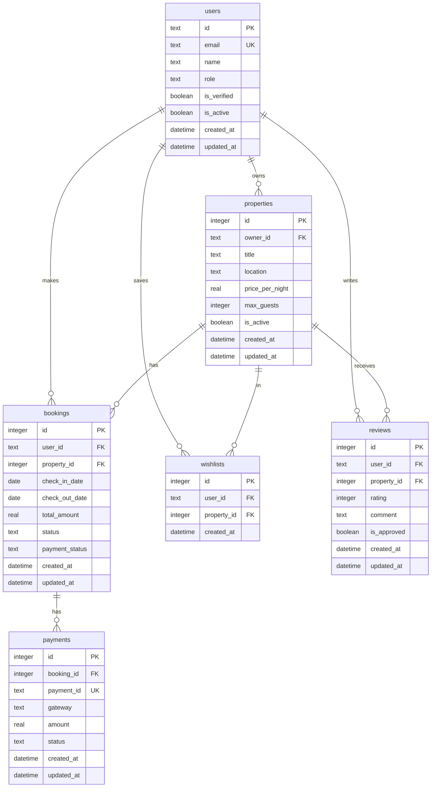

# Database Migrations

<cite>
**Referenced Files in This Document**   
- [1.sql](file://migrations/1.sql)
- [1/down.sql](file://migrations/1/down.sql)
- [2.sql](file://migrations/2.sql)
- [2/down.sql](file://migrations/2/down.sql)
- [3.sql](file://migrations/3.sql)
- [3/down.sql](file://migrations/3/down.sql)
- [4.sql](file://migrations/4.sql)
- [4/down.sql](file://migrations/4/down.sql)
- [5.sql](file://migrations/5.sql)
- [5/down.sql](file://migrations/5/down.sql)
- [6.sql](file://migrations/6.sql)
- [6/down.sql](file://migrations/6/down.sql)
- [7.sql](file://migrations/7.sql)
- [7/down.sql](file://migrations/7/down.sql)
- [8.sql](file://migrations/8.sql)
- [9.sql](file://migrations/9.sql)
</cite>

## Table of Contents
1. [Introduction](#introduction)
2. [Migration 1: Core Schema Creation](#migration-1-core-schema-creation)
3. [Migration 2: Initial Data Seeding](#migration-2-initial-data-seeding)
4. [Migration 3: Sample Data Population](#migration-3-sample-data-population)
5. [Migration 4: User Profile and Notification Systems](#migration-4-user-profile-and-notification-systems)
6. [Migration 5: Email and Analytics Infrastructure](#migration-5-email-and-analytics-infrastructure)
7. [Migration 6: Email Template Configuration](#migration-6-email-template-configuration)
8. [Migration 7: Contact and Newsletter Systems](#migration-7-contact-and-newsletter-systems)
9. [Migration 8: Dynamic Pricing Engine](#migration-8-dynamic-pricing-engine)
10. [Migration 9: Security and Audit Framework](#migration-9-security-and-audit-framework)
11. [Migration Execution and Best Practices](#migration-execution-and-best-practices)
12. [Conclusion](#conclusion)

## Introduction
This document provides a comprehensive analysis of the database migration system in HabibiStay, detailing the incremental evolution of the database schema from initial setup to advanced features. The migrations follow a structured approach to database versioning, ensuring data integrity, supporting complex business logic, and enabling safe rollback procedures. Each migration file introduces specific schema changes or data modifications that build upon the previous state, forming a coherent progression of the application's data model.

The migration system uses a sequential numbering scheme (1.sql, 2.sql, etc.) with corresponding rollback scripts (down.sql) in dedicated directories. This approach enables atomic, reversible changes to the database structure and content. The migrations cover core entities like users, properties, and bookings, as well as advanced features including dynamic pricing, security auditing, email templating, and analytics.

**Section sources**
- [1.sql](file://migrations/1.sql)
- [2.sql](file://migrations/2.sql)
- [3.sql](file://migrations/3.sql)
- [4.sql](file://migrations/4.sql)
- [5.sql](file://migrations/5.sql)
- [6.sql](file://migrations/6.sql)
- [7.sql](file://migrations/7.sql)
- [8.sql](file://migrations/8.sql)
- [9.sql](file://migrations/9.sql)

## Migration 1: Core Schema Creation
Migration 1.sql establishes the foundational database schema for HabibiStay, creating all core tables necessary for the platform's operation. This initial migration defines the primary entities and their relationships, setting the stage for all subsequent functionality.

The schema includes:
- **users**: Stores user accounts with role-based access (guest, host, admin)
- **properties**: Contains property listings with detailed attributes and pricing
- **bookings**: Manages reservation data with status tracking and payment information
- **payments**: Handles transaction records with multiple payment gateway support
- **wishlists**: Enables users to save favorite properties
- **reviews**: Supports guest feedback and rating system
- **ai_config**: Stores AI assistant configuration (Sara)
- **chat_conversations**: Maintains chat history with AI assistant
- **admin_settings**: Configuration parameters for platform management
- **analytics_events**: Tracks user interactions and system events
- **financial_reports**: Stores financial summaries for owners
- **channel_connections**: Integrates with external booking platforms
- **property_availability**: Manages calendar availability
- **pricing_rules**: Defines pricing strategies
- **notifications**: Handles user notification system

The schema implements referential integrity through foreign key constraints and ensures data validity with check constraints on fields like role, status, and payment status. Timestamps with default values are included for auditability.



**Diagram sources**
- [1.sql](file://migrations/1.sql)

**Section sources**
- [1.sql](file://migrations/1.sql)
- [1/down.sql](file://migrations/1/down.sql)

## Migration 2: Initial Data Seeding
Migration 2.sql populates the database with initial seed data required for basic platform operation. This migration inserts sample property listings and essential administrative settings that enable core functionality from the outset.

The data seeding includes:
- Four premium property listings with detailed descriptions, amenities, and images
- Key administrative settings that control platform behavior:
  - OpenAI model configuration
  - AI assistant personality settings
  - Featured properties display count
  - Booking confirmation system status

These initial records provide a functional baseline for the application, ensuring that when the platform launches, there are immediately available properties for users to browse and that critical system parameters are properly configured.

The corresponding rollback script (2/down.sql) removes this seed data by deleting the specific property records created by the admin user and removing the administrative settings that were inserted. This ensures a clean reversal of the data changes without affecting any user-generated content.

**Section sources**
- [2.sql](file://migrations/2.sql)
- [2/down.sql](file://migrations/2/down.sql)

## Migration 3: Sample Data Population
Migration 3.sql significantly expands the database content by adding comprehensive sample data that demonstrates the platform's capabilities with realistic usage scenarios. This migration populates the system with diverse property listings, actual bookings, guest reviews, and extended administrative configurations.

Key additions include:
- Six diverse property listings representing different owner types and property categories
- Three booking records showing various booking statuses (confirmed, pending)
- Three review entries with ratings and comments
- Extended administrative settings covering:
  - Site maintenance status
  - Booking commission rate
  - Featured property fees
  - Maximum properties per owner limits
  - Support email addresses for different user types

This sample data creates a rich, realistic environment for testing and demonstration purposes, showcasing the platform's functionality with authentic-looking content. The properties represent various types (executive suites, traditional villas, family compounds) and price points, while the bookings and reviews demonstrate the transactional flow.

The rollback script (3/down.sql) precisely reverses these changes by removing all sample data based on the specific identifiers used during insertion. It deletes reviews, bookings, properties, and administrative settings that were added in this migration, ensuring a complete and safe rollback.

**Section sources**
- [3.sql](file://migrations/3.sql)
- [3/down.sql](file://migrations/3/down.sql)

## Migration 4: User Profile and Notification Systems
Migration 4.sql enhances the user management system by introducing dedicated tables for user profiles and notification preferences, while also redefining the payments table to support more comprehensive transaction processing.

New schema elements:
- **user_profiles**: Stores detailed user information beyond basic account data, including full name, phone, address, and preferences
- **notification_settings**: Allows users to customize their notification preferences across email, SMS, and push channels
- **payments**: Redefined to include additional fields for payment providers, invoice IDs, transaction IDs, and metadata

This migration separates profile information from core user authentication data, enabling more flexible user management and personalization. The notification settings table empowers users to control how they receive platform communications, improving user experience and compliance with privacy regulations.

The rollback script (4/down.sql) removes these enhancements by dropping the newly created tables. This reversal is straightforward since these tables were newly introduced and no dependent data exists elsewhere in the system.

**Section sources**
- [4.sql](file://migrations/4.sql)
- [4/down.sql](file://migrations/4/down.sql)

## Migration 5: Email and Analytics Infrastructure
Migration 5.sql establishes the foundation for the platform's communication and analytics capabilities by creating tables for email templating, email delivery tracking, and property performance analytics.

New components:
- **email_templates**: Stores reusable email templates with variables for dynamic content
- **email_logs**: Tracks the status and delivery information of sent emails
- **property_analytics**: Captures performance metrics for individual properties including views, inquiries, bookings, and revenue

This infrastructure enables automated, personalized email communications and provides data-driven insights into property performance. The email system supports template variables that can be populated with dynamic data, while the analytics table allows owners and administrators to monitor key performance indicators.

The rollback script (5/down.sql) removes this infrastructure by dropping all three tables. Since these are newly created tables without dependencies, their removal is a simple operation that completely reverses the migration.

**Section sources**
- [5.sql](file://migrations/5.sql)
- [5/down.sql](file://migrations/5/down.sql)

## Migration 6: Email Template Configuration
Migration 6.sql populates the email template system with predefined templates for key user interactions. This data migration inserts three essential email templates that handle critical communication workflows.

Configured templates:
- **booking_confirmation**: Notifies guests when their booking is confirmed, including all reservation details
- **payment_success**: Informs users when their payment has been successfully processed
- **welcome**: Sends a welcome message to new users, introducing platform features and benefits

Each template includes HTML content with embedded CSS styling and defined variables that will be replaced with actual data during email generation. The templates are designed to be visually appealing and responsive, providing a professional communication experience.

The rollback script (6/down.sql) removes these templates by deleting the specific records based on their template keys. This targeted approach ensures that only the templates added in this migration are removed, preserving any other templates that might exist.

**Section sources**
- [6.sql](file://migrations/6.sql)
- [6/down.sql](file://migrations/6/down.sql)

## Migration 7: Contact and Newsletter Systems
Migration 7.sql expands the platform's communication capabilities by adding systems for handling contact form submissions and newsletter subscriptions, along with additional email templates to support these features.

New schema elements:
- **contact_submissions**: Stores messages from users who contact the platform through the website
- **newsletter_subscriptions**: Manages email addresses of users who subscribe to marketing communications

Additional email templates:
- **contact_form_submission**: Internal notification when a new contact form is submitted
- **contact_form_confirmation**: Auto-reply to users who submit a contact form
- **newsletter_welcome**: Welcome message for new newsletter subscribers

This migration enables two-way communication between the platform and its users, supporting customer service operations and marketing initiatives. The contact system allows users to reach out with inquiries, while the newsletter system facilitates ongoing engagement with subscribers.

The rollback script (7/down.sql) performs a comprehensive reversal by dropping the two newly created tables and removing the three email templates that were added. This ensures a complete cleanup of all changes introduced in this migration.

**Section sources**
- [7.sql](file://migrations/7.sql)
- [7/down.sql](file://migrations/7/down.sql)

## Migration 8: Dynamic Pricing Engine
Migration 8.sql introduces a sophisticated dynamic pricing system that enables properties to automatically adjust their rates based on market conditions, demand, and business rules.

Key components of the pricing engine:
- **property_pricing_settings**: Stores configuration for automated pricing including price ranges and adjustment strategies
- **pricing_rules**: Defines specific pricing rules with conditions and adjustments
- **market_data**: Captures external market factors affecting pricing decisions
- **pricing_history**: Maintains historical pricing data for analytics and auditing
- **seasonal_periods**: Defines recurring seasonal pricing patterns
- **special_events**: Stores information about events that impact accommodation demand

The migration also inserts default seasonal periods (Winter Peak, Spring, Summer Peak, Fall) and sample special events (Saudi National Day, Riyadh Season, Hajj Pilgrimage) that automatically influence pricing. Additionally, it creates database indexes to optimize query performance for the new pricing tables.

This comprehensive pricing system allows property owners to maximize revenue by automatically responding to market dynamics while maintaining control over pricing parameters.

The rollback process for this migration would require dropping all pricing-related tables and removing the inserted seasonal periods and special events, though no explicit down.sql is shown in the provided context.

**Section sources**
- [8.sql](file://migrations/8.sql)

## Migration 9: Security and Audit Framework
Migration 9.sql implements a comprehensive security and auditing framework to protect the platform and ensure compliance with data protection regulations.

Security components:
- **audit_logs**: Records all significant system activities for accountability and troubleshooting
- **blocked_ips**: Manages IP addresses that have been blocked due to suspicious activity
- **failed_login_attempts**: Tracks failed login attempts to detect potential brute force attacks
- **security_sessions**: Enhances session management with additional security features
- **security_events**: Monitors and records potential security threats
- **user_2fa**: Supports two-factor authentication for enhanced account security
- **password_history**: Prevents password reuse by storing historical passwords
- **security_settings**: Centralizes security configuration parameters
- **rate_limits**: Implements rate limiting to prevent abuse
- **csrf_tokens**: Protects against cross-site request forgery attacks
- **data_access_logs**: Tracks access to sensitive data for GDPR compliance

The migration also creates numerous database indexes to ensure efficient querying of security data and inserts default security settings that define platform security policies. Additionally, it includes sample security events for demonstration purposes.

This robust security framework provides multiple layers of protection, monitoring, and auditing capabilities that are essential for a platform handling sensitive user data and financial transactions.

**Section sources**
- [9.sql](file://migrations/9.sql)

## Migration Execution and Best Practices
The HabibiStay migration system follows industry best practices for database versioning and change management:

**Atomic Migrations**: Each migration represents a single, coherent change to the database schema or data, making it easier to understand, test, and roll back if necessary.

**Versioning Strategy**: The sequential numbering system (1.sql, 2.sql, etc.) ensures migrations are applied in the correct order and provides a clear history of database evolution.

**Safe Rollbacks**: Each migration has a corresponding down.sql script that safely reverses the changes, enabling recovery from deployment issues or unwanted changes.

**Data Integrity**: The schema consistently uses foreign key constraints, check constraints, and appropriate data types to maintain data quality and consistency.

**Indexing Strategy**: Later migrations (8.sql and 9.sql) demonstrate thoughtful indexing to optimize query performance on critical fields.

**Testing in Isolation**: The migration structure supports testing in isolated environments by allowing the complete database schema to be rebuilt from scratch using the migration sequence.

**Deployment Integration**: Migrations can be integrated into the deployment pipeline using standard database migration tools that apply the scripts in order during deployment.

**Migration Commands Example**:
```bash
# Apply all migrations
db-migrate up

# Apply a specific migration
db-migrate up 5

# Roll back the last migration
db-migrate down

# Roll back to a specific version
db-migrate down 3
```

The migration order is enforced by the sequential numbering, and conflicts during team development are typically resolved through coordination and potentially branching strategies or migration locking mechanisms in the deployment pipeline.

**Section sources**
- [1.sql](file://migrations/1.sql)
- [2.sql](file://migrations/2.sql)
- [3.sql](file://migrations/3.sql)
- [4.sql](file://migrations/4.sql)
- [5.sql](file://migrations/5.sql)
- [6.sql](file://migrations/6.sql)
- [7.sql](file://migrations/7.sql)
- [8.sql](file://migrations/8.sql)
- [9.sql](file://migrations/9.sql)

## Conclusion
The database migration system in HabibiStay demonstrates a well-structured approach to database versioning and evolution. The migrations progress logically from core schema creation to advanced features, with each step building upon the previous foundation. The system incorporates best practices including atomic changes, reversible operations, data integrity constraints, and performance optimization.

The comprehensive nature of the migrations covers all aspects of the platform, from basic user and property management to sophisticated features like dynamic pricing and security auditing. The inclusion of rollback scripts for each migration ensures that changes can be safely reversed, reducing the risk associated with database modifications.

This migration strategy enables the HabibiStay platform to evolve its data model in a controlled, predictable manner while maintaining data integrity and supporting continuous deployment practices. The system provides a solid foundation for ongoing development and feature expansion.