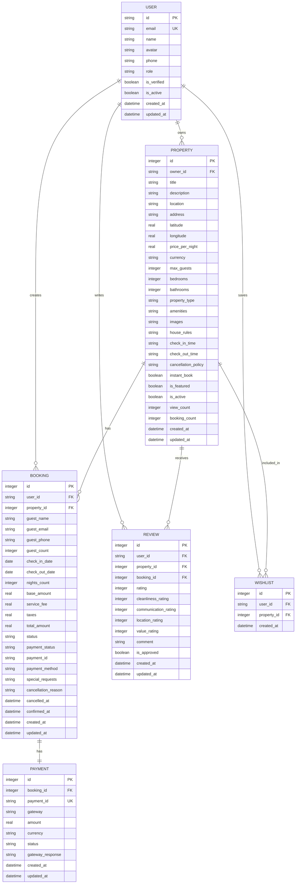

# Entity Relationships and Constraints

<cite>
**Referenced Files in This Document**   
- [1.sql](file://migrations/1.sql)
- [8.sql](file://migrations/8.sql)
- [9.sql](file://migrations/9.sql)
- [types.ts](file://src/shared/types.ts)
- [BookingService.ts](file://src/server/services/BookingService.ts)
- [secure-validation.ts](file://src/shared/secure-validation.ts)
- [security-utils.ts](file://src/shared/security-utils.ts)
</cite>

## Table of Contents
1. [Entity Relationship Overview](#entity-relationship-overview)
2. [Core Entity Relationships](#core-entity-relationships)
3. [Database Constraints and Referential Integrity](#database-constraints-and-referential-integrity)
4. [Data Validation and Integrity Enforcement](#data-validation-and-integrity-enforcement)
5. [Entity-Relationship Diagram](#entity-relationship-diagram)
6. [Query Examples and Data Access Patterns](#query-examples-and-data-access-patterns)
7. [Orphaned Record Prevention and Data Consistency](#orphaned-record-prevention-and-data-consistency)
8. [Performance Implications and Indexing Strategies](#performance-implications-and-indexing-strategies)

## Entity Relationship Overview

The HabibiStay platform implements a comprehensive relational database schema that models the core entities of a property booking system. The database design follows normalization principles while optimizing for the specific use cases of short-term rental management. The primary entities include Property, Booking, User, Payment, Review, and Wishlist, each with well-defined relationships and constraints that ensure data integrity and consistency.

The system employs a combination of foreign key constraints, unique indexes, check constraints, and application-level validation to maintain referential integrity across the data model. These constraints work together to prevent invalid data states, ensure relationship consistency, and enforce business rules throughout the application lifecycle.

**Section sources**
- [1.sql](file://migrations/1.sql#L1-L300)

## Core Entity Relationships

### Property-User Relationship
The Property entity has a many-to-one relationship with the User entity, where each property is owned by a single user, but a user can own multiple properties. This relationship is implemented through the `owner_id` foreign key in the properties table that references the `id` field in the users table.

```sql
CREATE TABLE properties (
  id INTEGER PRIMARY KEY AUTOINCREMENT,
  owner_id TEXT NOT NULL,
  -- other fields
  FOREIGN KEY (owner_id) REFERENCES users(id)
);
```

This relationship enables the platform to support hosts who manage multiple properties while maintaining clear ownership attribution for financial reporting, communication, and access control purposes.

### Booking Relationships
The Booking entity serves as a central hub in the data model, establishing relationships with multiple other entities:

- **User-Booking**: One-to-many relationship where a user can create multiple bookings
- **Property-Booking**: One-to-many relationship where a property can have multiple bookings over time
- **Payment-Booking**: One-to-one relationship where each booking has exactly one payment transaction

These relationships are implemented through foreign key constraints that ensure every booking is associated with valid user, property, and payment records.

### Review Relationships
The Review entity establishes relationships with three core entities:

- **User-Review**: One-to-many relationship where users can write multiple reviews
- **Property-Review**: One-to-many relationship where properties can have multiple reviews
- **Booking-Review**: Optional one-to-one relationship where reviews are typically associated with completed bookings

The optional relationship with bookings allows for both verified reviews (from actual guests) and unverified reviews (from users who haven't stayed but want to provide feedback).

### Wishlist Relationships
The Wishlist entity implements a many-to-many relationship between Users and Properties through a junction table. This design allows users to save multiple properties to their wishlist and enables properties to be included in multiple users' wishlists.

```sql
CREATE TABLE wishlists (
  id INTEGER PRIMARY KEY AUTOINCREMENT,
  user_id TEXT NOT NULL,
  property_id INTEGER NOT NULL,
  created_at DATETIME DEFAULT CURRENT_TIMESTAMP,
  UNIQUE(user_id, property_id),
  FOREIGN KEY (user_id) REFERENCES users(id),
  FOREIGN KEY (property_id) REFERENCES properties(id)
);
```

The unique constraint on the combination of `user_id` and `property_id` prevents duplicate entries, ensuring that a user cannot add the same property to their wishlist multiple times.

**Section sources**
- [1.sql](file://migrations/1.sql#L1-L300)
- [types.ts](file://src/shared/types.ts#L1-L600)

## Database Constraints and Referential Integrity

### Foreign Key Implementations
The database schema implements foreign key constraints across all related entities to enforce referential integrity. These constraints prevent the creation of orphaned records and ensure that relationships between entities remain valid.

For example, the bookings table includes foreign key constraints that reference both the users and properties tables:

```sql
CREATE TABLE bookings (
  -- fields
  FOREIGN KEY (user_id) REFERENCES users(id),
  FOREIGN KEY (property_id) REFERENCES properties(id)
);
```

These constraints ensure that every booking is associated with an existing user and property, preventing data inconsistencies that could arise from referencing non-existent records.

### Cascade Behaviors
The system implements specific cascade behaviors to maintain data integrity when related records are modified or deleted. While the initial migration files do not explicitly define cascade behaviors, the application logic includes mechanisms to handle related data appropriately.

For example, when a user account is deactivated, the system maintains historical booking and review data for auditing and reporting purposes rather than deleting these records. This approach preserves the integrity of transaction history while respecting user privacy preferences.

### Referential Integrity Enforcement
Referential integrity is enforced through a combination of database-level constraints and application-level validation. The database constraints provide a first line of defense against invalid data, while the application logic ensures that business rules are consistently applied across all data access patterns.

The system uses foreign key constraints with the `REFERENCES` clause to ensure that related records exist before allowing insert or update operations. This prevents the creation of dangling references that could lead to data inconsistencies and application errors.

**Section sources**
- [1.sql](file://migrations/1.sql#L1-L300)
- [9.sql](file://migrations/9.sql#L1-L200)

## Data Validation and Integrity Enforcement

### Unique Constraints
The database implements unique constraints on critical fields to prevent duplicate records and ensure data consistency. The most important unique constraint is on the user email field:

```sql
CREATE TABLE users (
  id TEXT PRIMARY KEY,
  email TEXT UNIQUE NOT NULL,
  -- other fields
);
```

This constraint ensures that each email address is associated with only one user account, preventing duplicate registrations and enabling reliable communication with users.

Additional unique constraints include:
- Composite unique constraint on the wishlists table (`user_id`, `property_id`) to prevent duplicate wishlist entries
- Unique constraint on payment transaction IDs to prevent duplicate processing
- Unique constraint on admin settings keys to ensure configuration consistency

### Date Validation in Bookings
The system implements comprehensive date validation for booking records to ensure logical consistency and prevent invalid reservations. The validation rules include:

- Check-in date cannot be in the past
- Check-out date must be after check-in date
- Booking duration must be positive
- Dates must be within valid ranges for the property's availability calendar

These validations are enforced at both the application level and through business logic in the BookingService:

```typescript
private async validateBookingData(data: BookingCreate): Promise<void> {
  const checkIn = new Date(data.check_in_date);
  const checkOut = new Date(data.check_out_date);
  const today = new Date();

  if (checkIn < today) {
    throw new Error('Check-in date cannot be in the past');
  }

  if (checkOut <= checkIn) {
    throw new Error('Check-out date must be after check-in date');
  }
}
```

### Rating Bounds in Reviews
Review ratings are constrained to ensure consistent and meaningful feedback. The database schema enforces rating bounds through check constraints:

```sql
CREATE TABLE reviews (
  rating INTEGER NOT NULL CHECK (rating >= 1 AND rating <= 5),
  cleanliness_rating INTEGER CHECK (cleanliness_rating >= 1 AND cleanliness_rating <= 5),
  communication_rating INTEGER CHECK (communication_rating >= 1 AND communication_rating <= 5),
  location_rating INTEGER CHECK (location_rating >= 1 AND location_rating <= 5),
  value_rating INTEGER CHECK (value_rating >= 1 AND value_rating <= 5),
  -- other fields
);
```

These constraints ensure that all ratings fall within the expected 1-5 scale, maintaining data consistency for analytics, sorting, and display purposes. The application also validates these constraints before submitting data to the database, providing immediate feedback to users.

**Section sources**
- [1.sql](file://migrations/1.sql#L1-L300)
- [BookingService.ts](file://src/server/services/BookingService.ts#L569-L610)
- [secure-validation.ts](file://src/shared/secure-validation.ts#L25-L65)

## Entity-Relationship Diagram



**Diagram sources**
- [1.sql](file://migrations/1.sql#L1-L300)
- [types.ts](file://src/shared/types.ts#L1-L600)

## Query Examples and Data Access Patterns

### Fetching Property with Reviews and Bookings
The backend implements efficient queries to retrieve properties with their associated reviews and booking information. This is typically accomplished through JOIN operations that combine data from multiple tables:

```sql
SELECT p.*, r.*, u.name as reviewer_name
FROM properties p
LEFT JOIN reviews r ON p.id = r.property_id
LEFT JOIN users u ON r.user_id = u.id
WHERE p.id = ? AND r.is_approved = 1
ORDER BY r.created_at DESC;
```

The application also implements pagination and filtering options to manage large result sets and improve performance:

```typescript
async getPropertyWithReviews(propertyId: number, page: number = 1, limit: number = 10) {
  const offset = (page - 1) * limit;
  
  return this.db.prepare(`
    SELECT 
      p.*, 
      r.id as review_id,
      r.rating,
      r.comment,
      r.created_at as review_date,
      u.name as reviewer_name,
      u.avatar as reviewer_avatar
    FROM properties p
    LEFT JOIN reviews r ON p.id = r.property_id AND r.is_approved = 1
    LEFT JOIN users u ON r.user_id = u.id
    WHERE p.id = ? AND p.is_active = 1
    ORDER BY r.created_at DESC
    LIMIT ? OFFSET ?
  `).bind(propertyId, limit, offset).all();
}
```

### Booking History Queries
The system provides comprehensive booking history queries that join booking, property, and payment information to present a complete view of user reservations:

```sql
SELECT 
  b.*,
  p.title as property_title,
  p.location as property_location,
  p.images as property_images,
  p.price_per_night,
  p.currency,
  pay.status as payment_status,
  pay.amount as payment_amount
FROM bookings b
JOIN properties p ON b.property_id = p.id
JOIN payments pay ON b.id = pay.booking_id
WHERE b.user_id = ?
ORDER BY b.check_in_date DESC;
```

These queries are optimized with appropriate indexes on the foreign key columns and frequently queried fields to ensure responsive performance even with large datasets.

**Section sources**
- [1.sql](file://migrations/1.sql#L1-L300)
- [types.ts](file://src/shared/types.ts#L1-L600)

## Orphaned Record Prevention and Data Consistency

### Preventing Orphaned Records
The system employs multiple strategies to prevent orphaned records and maintain data consistency across concurrent operations. The primary mechanism is the use of foreign key constraints with appropriate actions:

- When a user account is deactivated, associated bookings and reviews are preserved for historical accuracy
- When a property is deactivated, existing bookings are honored but new bookings are prevented
- Payment records are never deleted to maintain financial audit trails

The application also implements transactional integrity for critical operations that affect multiple related records. For example, when creating a booking, the system uses database transactions to ensure that both the booking and payment records are created atomically:

```typescript
async createBookingWithPayment(bookingData: BookingCreate, paymentData: PaymentData) {
  const transaction = await this.db.transaction();
  
  try {
    // Create booking
    const bookingResult = await transaction.prepare(`
      INSERT INTO bookings (...) VALUES (...)
    `).bind(...).run();
    
    // Create payment
    const paymentResult = await transaction.prepare(`
      INSERT INTO payments (...) VALUES (...)
    `).bind(...).run();
    
    await transaction.commit();
    
    return { bookingId: bookingResult.lastInsertRowid, paymentId: paymentResult.lastInsertRowid };
  } catch (error) {
    await transaction.rollback();
    throw error;
  }
}
```

### Data Consistency During Concurrent Operations
To maintain data consistency during concurrent operations, the system implements several strategies:

- **Optimistic locking**: Using timestamps to detect and resolve conflicts when multiple users attempt to modify the same record
- **Unique constraints**: Preventing duplicate submissions through database-level unique constraints
- **Application-level locks**: Implementing temporary locks for critical operations like booking creation
- **Queue processing**: Using worker queues to serialize operations that could conflict

The system also includes comprehensive logging and monitoring to detect and resolve data inconsistencies that may arise from edge cases or system failures.

**Section sources**
- [1.sql](file://migrations/1.sql#L1-L300)
- [BookingService.ts](file://src/server/services/BookingService.ts#L569-L610)
- [security-utils.ts](file://src/shared/security-utils.ts#L280-L339)

## Performance Implications and Indexing Strategies

### Performance Implications of Joins
The extensive use of JOIN operations in the HabibiStay data model has significant performance implications that are addressed through careful indexing and query optimization. Complex queries that join multiple tables (such as retrieving a property with its reviews, bookings, and user information) can become performance bottlenecks if not properly optimized.

The system addresses these challenges by:
- Limiting the number of JOINs in a single query
- Using appropriate indexes on foreign key columns
- Implementing pagination to limit result set sizes
- Caching frequently accessed data
- Using database views for common query patterns

### Indexing Strategies
The database implements a comprehensive indexing strategy to optimize common queries and maintain performance as the dataset grows. Key indexes include:

- **Primary key indexes**: Automatically created on primary key columns for fast record lookup
- **Foreign key indexes**: Created on all foreign key columns to optimize JOIN operations
- **Unique indexes**: Implemented on unique constraints to ensure data integrity and fast lookups
- **Composite indexes**: Created on frequently queried column combinations

For example, the system creates indexes on commonly queried fields:

```sql
-- Indexes for user queries
CREATE INDEX IF NOT EXISTS idx_users_email ON users(email);
CREATE INDEX IF NOT EXISTS idx_users_role ON users(role);

-- Indexes for property queries
CREATE INDEX IF NOT EXISTS idx_properties_owner ON properties(owner_id);
CREATE INDEX IF NOT EXISTS idx_properties_location ON properties(location);
CREATE INDEX IF NOT EXISTS idx_properties_price ON properties(price_per_night);
CREATE INDEX IF NOT EXISTS idx_properties_active ON properties(is_active);

-- Indexes for booking queries
CREATE INDEX IF NOT EXISTS idx_bookings_user ON bookings(user_id);
CREATE INDEX IF NOT EXISTS idx_bookings_property ON bookings(property_id);
CREATE INDEX IF NOT EXISTS idx_bookings_dates ON bookings(check_in_date, check_out_date);
CREATE INDEX IF NOT EXISTS idx_bookings_status ON bookings(status);

-- Indexes for review queries
CREATE INDEX IF NOT EXISTS idx_reviews_property ON reviews(property_id);
CREATE INDEX IF NOT EXISTS idx_reviews_rating ON reviews(rating);
CREATE INDEX IF NOT EXISTS idx_reviews_approved ON reviews(is_approved);
```

These indexing strategies ensure that common operations such as user authentication, property search, booking lookup, and review retrieval perform efficiently even with large datasets. The system also includes periodic index maintenance and performance monitoring to identify and address potential bottlenecks.

**Section sources**
- [1.sql](file://migrations/1.sql#L1-L300)
- [8.sql](file://migrations/8.sql#L1-L200)
- [9.sql](file://migrations/9.sql#L1-L200)