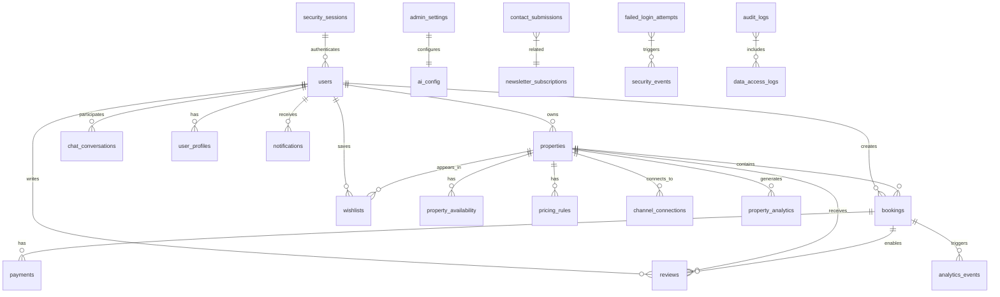
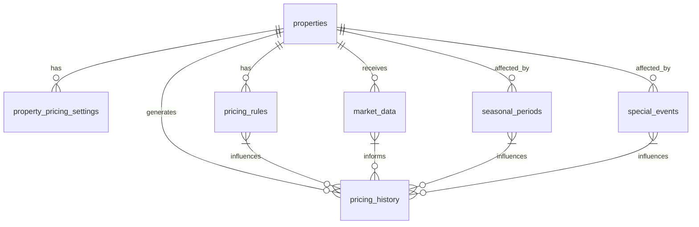
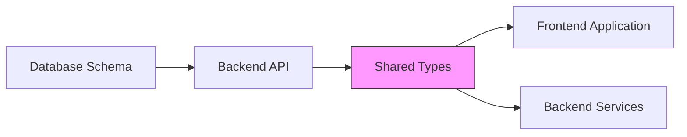
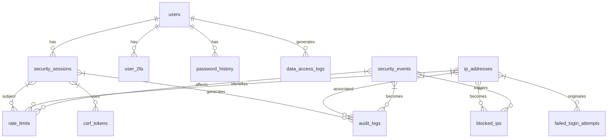

# Schema-to-Model Mapping

<cite>
**Referenced Files in This Document**   
- [1.sql](file://migrations/1.sql)
- [4.sql](file://migrations/4.sql)
- [5.sql](file://migrations/5.sql)
- [8.sql](file://migrations/8.sql)
- [9.sql](file://migrations/9.sql)
- [types.ts](file://src/shared/types.ts)
</cite>

## Table of Contents
1. [Database Schema Overview](#database-schema-overview)
2. [Core Table-to-Type Mappings](#core-table-to-type-mappings)
3. [Advanced Schema Features](#advanced-schema-features)
4. [Type Safety and Validation Strategy](#type-safety-and-validation-strategy)
5. [Schema Evolution and Versioning](#schema-evolution-and-versioning)
6. [Security and Audit Schema](#security-and-audit-schema)

## Database Schema Overview

The HabibiStay application implements a comprehensive database schema across multiple migration files, evolving from core entities to advanced features. The schema is defined through a series of SQL migration files (1.sql through 9.sql) that progressively build the database structure.

The initial schema in 1.sql establishes core entities including users, properties, bookings, payments, wishlists, reviews, and administrative settings. Subsequent migrations add specialized tables for email management, security, dynamic pricing, and audit logging. The schema demonstrates a thoughtful evolution from basic functionality to sophisticated features that support a complete hospitality platform.



**Diagram sources**
- [1.sql](file://migrations/1.sql)
- [4.sql](file://migrations/4.sql)
- [5.sql](file://migrations/5.sql)
- [8.sql](file://migrations/8.sql)
- [9.sql](file://migrations/9.sql)

**Section sources**
- [1.sql](file://migrations/1.sql)
- [4.sql](file://migrations/4.sql)
- [5.sql](file://migrations/5.sql)
- [8.sql](file://migrations/8.sql)
- [9.sql](file://migrations/9.sql)

## Core Table-to-Type Mappings

### Users Table and User Type

The `users` table defined in 1.sql maps directly to the `User` type in types.ts. This mapping demonstrates a clean alignment between database schema and TypeScript model.

**Database Schema (1.sql):**
```sql
CREATE TABLE users (
  id TEXT PRIMARY KEY,
  email TEXT UNIQUE NOT NULL,
  name TEXT NOT NULL,
  avatar TEXT,
  phone TEXT,
  role TEXT DEFAULT 'guest' CHECK (role IN ('guest', 'host', 'admin')),
  is_verified BOOLEAN DEFAULT 0,
  is_active BOOLEAN DEFAULT 1,
  created_at DATETIME DEFAULT CURRENT_TIMESTAMP,
  updated_at DATETIME DEFAULT CURRENT_TIMESTAMP
);
```

**TypeScript Model (types.ts):**
```typescript
export const UserSchema = z.object({
  id: z.string(),
  email: z.string().email(),
  name: z.string(),
  avatar: z.string().optional(),
  phone: z.string().optional(),
  role: z.enum(['guest', 'host', 'admin']),
  is_verified: z.boolean(),
  is_active: z.boolean(),
  created_at: z.string(),
  updated_at: z.string(),
});
```

**Mapping Analysis:**
- **Primary Key**: The `id` column (TEXT PRIMARY KEY) maps to `id: z.string()` in the type definition
- **Unique Constraint**: The `email UNIQUE` constraint is reflected in the type system through validation rather than a structural constraint
- **Check Constraints**: The `role` check constraint with allowed values ('guest', 'host', 'admin') is precisely mirrored by `z.enum(['guest', 'host', 'admin'])`
- **Nullability**: Optional fields like `avatar` and `phone` are represented as optional in the type definition using `.optional()`
- **Default Values**: Database defaults (is_verified=0, is_active=1) are not explicitly represented in the type but are handled at the application layer
- **Data Types**: DATETIME columns are represented as strings in the type system, following the common practice of serializing dates as ISO strings

**Section sources**
- [1.sql](file://migrations/1.sql#L1-L15)
- [types.ts](file://src/shared/types.ts#L175-L190)

### Properties Table and Property Type

The `properties` table is one of the most complex entities in the schema, and its mapping to the `Property` type demonstrates sophisticated type modeling.

**Database Schema (1.sql):**
```sql
CREATE TABLE properties (
  id INTEGER PRIMARY KEY AUTOINCREMENT,
  owner_id TEXT NOT NULL,
  title TEXT NOT NULL,
  description TEXT,
  location TEXT NOT NULL,
  address TEXT,
  latitude REAL,
  longitude REAL,
  price_per_night REAL NOT NULL,
  currency TEXT DEFAULT 'SAR',
  max_guests INTEGER NOT NULL,
  bedrooms INTEGER DEFAULT 1,
  bathrooms INTEGER DEFAULT 1,
  property_type TEXT,
  amenities TEXT, -- JSON array
  images TEXT, -- JSON array
  house_rules TEXT,
  check_in_time TEXT DEFAULT '15:00',
  check_out_time TEXT DEFAULT '11:00',
  cancellation_policy TEXT DEFAULT 'moderate',
  instant_book BOOLEAN DEFAULT 0,
  is_featured BOOLEAN DEFAULT 0,
  is_active BOOLEAN DEFAULT 1,
  view_count INTEGER DEFAULT 0,
  booking_count INTEGER DEFAULT 0,
  created_at DATETIME DEFAULT CURRENT_TIMESTAMP,
  updated_at DATETIME DEFAULT CURRENT_TIMESTAMP,
  FOREIGN KEY (owner_id) REFERENCES users(id)
);
```

**TypeScript Model (types.ts):**
```typescript
export const PropertySchema = z.object({
  id: z.number(),
  user_id: z.string(),
  title: z.string(),
  description: z.string().nullable(),
  location: z.string(),
  price_per_night: z.number(),
  max_guests: z.number(),
  bedrooms: z.number().nullable(),
  bathrooms: z.number().nullable(),
  amenities: z.string().nullable(),
  images: z.string().nullable(),
  is_featured: z.boolean(),
  is_active: z.boolean(),
  created_at: z.string(),
  updated_at: z.string(),
});
```

**Mapping Analysis:**
- **Column Omissions**: The TypeScript model omits several columns present in the database (address, latitude, longitude, currency, house_rules, etc.), indicating a subset of data is exposed to the frontend
- **Naming Convention**: The database uses `owner_id` while the type uses `user_id`, suggesting a transformation layer normalizes these differences
- **Data Type Representation**: JSON columns (amenities, images) are stored as TEXT in the database but represented as stringified JSON in the type system
- **Default Values**: Database defaults (bedrooms=1, bathrooms=1, is_featured=0, etc.) are not reflected in the type definition, placing responsibility for defaults on the application layer
- **Foreign Key**: The `owner_id` foreign key referencing `users(id)` is represented as `user_id: z.string()` in the type, maintaining the relationship conceptually

**Section sources**
- [1.sql](file://migrations/1.sql#L17-L50)
- [types.ts](file://src/shared/types.ts#L3-L19)

### Bookings Table and Booking Type

The `bookings` table represents a core business entity with complex state management, and its type mapping shows careful consideration of business rules.

**Database Schema (1.sql):**
```sql
CREATE TABLE bookings (
  id INTEGER PRIMARY KEY AUTOINCREMENT,
  user_id TEXT NOT NULL,
  property_id INTEGER NOT NULL,
  guest_name TEXT NOT NULL,
  guest_email TEXT NOT NULL,
  guest_phone TEXT,
  guest_count INTEGER NOT NULL,
  check_in_date DATE NOT NULL,
  check_out_date DATE NOT NULL,
  nights_count INTEGER NOT NULL,
  base_amount REAL NOT NULL,
  service_fee REAL DEFAULT 0,
  taxes REAL DEFAULT 0,
  total_amount REAL NOT NULL,
  status TEXT DEFAULT 'pending' CHECK (status IN ('pending', 'confirmed', 'cancelled', 'completed')),
  payment_status TEXT DEFAULT 'pending' CHECK (payment_status IN ('pending', 'processing', 'completed', 'failed', 'refunded')),
  payment_id TEXT,
  payment_method TEXT,
  special_requests TEXT,
  cancellation_reason TEXT,
  cancelled_at DATETIME,
  confirmed_at DATETIME,
  created_at DATETIME DEFAULT CURRENT_TIMESTAMP,
  updated_at DATETIME DEFAULT CURRENT_TIMESTAMP,
  FOREIGN KEY (user_id) REFERENCES users(id),
  FOREIGN KEY (property_id) REFERENCES properties(id)
);
```

**TypeScript Model (types.ts):**
```typescript
export const BookingSchema = z.object({
  id: z.number(),
  user_id: z.string(),
  property_id: z.number(),
  guest_name: z.string(),
  guest_email: z.string(),
  guest_phone: z.string().nullable(),
  check_in_date: z.string(),
  check_out_date: z.string(),
  total_guests: z.number(),
  total_amount: z.number(),
  status: z.string(),
  payment_status: z.string(),
  payment_id: z.string().nullable(),
  special_requests: z.string().nullable(),
  created_at: z.string(),
  updated_at: z.string(),
});
```

**Mapping Analysis:**
- **Column Selection**: The type includes only essential booking information for frontend display, excluding financial details like service_fee and taxes
- **State Enumeration**: The database CHECK constraints for `status` and `payment_status` are not enforced in the type system, allowing any string value
- **Date Representation**: DATE columns are represented as strings in the type system, consistent with the application's date serialization approach
- **Nullability**: Optional fields like `guest_phone`, `payment_id`, and `special_requests` are properly marked as nullable
- **Missing Fields**: The type omits `cancellation_reason`, `cancelled_at`, and `confirmed_at` which are present in the database, suggesting these are handled in specialized contexts

**Section sources**
- [1.sql](file://migrations/1.sql#L52-L80)
- [types.ts](file://src/shared/types.ts#L21-L38)

### Reviews Table and Review Type

The `reviews` table demonstrates a hierarchical rating system that is simplified in the type definition for frontend consumption.

**Database Schema (1.sql):**
```sql
CREATE TABLE reviews (
  id INTEGER PRIMARY KEY AUTOINCREMENT,
  user_id TEXT NOT NULL,
  property_id INTEGER NOT NULL,
  booking_id INTEGER,
  rating INTEGER NOT NULL CHECK (rating >= 1 AND rating <= 5),
  cleanliness_rating INTEGER CHECK (cleanliness_rating >= 1 AND cleanliness_rating <= 5),
  communication_rating INTEGER CHECK (communication_rating >= 1 AND cleanliness_rating <= 5),
  location_rating INTEGER CHECK (location_rating >= 1 AND location_rating <= 5),
  value_rating INTEGER CHECK (value_rating >= 1 AND value_rating <= 5),
  comment TEXT,
  is_approved BOOLEAN DEFAULT 1,
  created_at DATETIME DEFAULT CURRENT_TIMESTAMP,
  updated_at DATETIME DEFAULT CURRENT_TIMESTAMP,
  FOREIGN KEY (user_id) REFERENCES users(id),
  FOREIGN KEY (property_id) REFERENCES properties(id),
  FOREIGN KEY (booking_id) REFERENCES bookings(id)
);
```

**TypeScript Model (types.ts):**
```typescript
export const ReviewSchema = z.object({
  id: z.number(),
  user_id: z.string(),
  property_id: z.number(),
  booking_id: z.number().nullable(),
  rating: z.number().int().min(1).max(5),
  comment: z.string().nullable(),
  created_at: z.string(),
  updated_at: z.string(),
});
```

**Mapping Analysis:**
- **Simplified Ratings**: The database stores multiple dimension ratings (cleanliness, communication, etc.) but the type only exposes the overall `rating`, indicating the frontend displays only the aggregate score
- **Validation Enforcement**: The type system enforces the 1-5 range constraint with `.min(1).max(5)` rather than relying solely on database constraints
- **Optional Relationship**: The `booking_id` is properly represented as nullable since reviews can exist without a booking reference
- **Moderation Status**: The `is_approved` column is not exposed in the type, suggesting review moderation is an administrative concern not exposed to regular users

**Section sources**
- [1.sql](file://migrations/1.sql#L107-L125)
- [types.ts](file://src/shared/types.ts#L40-L48)

## Advanced Schema Features

### Dynamic Pricing System

Migration 8.sql introduces a sophisticated dynamic pricing system with multiple interrelated tables that support algorithmic price adjustments based on market conditions.



**Key Tables:**
- **property_pricing_settings**: Stores configuration for automated pricing, including price bounds and adjustment strategies
- **pricing_rules**: Defines conditional rules for price modifications based on various factors
- **market_data**: Captures external market conditions that influence pricing decisions
- **pricing_history**: Maintains an audit trail of price changes for analytics
- **seasonal_periods**: Defines recurring time periods with associated price multipliers
- **special_events**: Represents one-time events that impact demand and pricing

The TypeScript types do not directly expose these pricing entities, suggesting they are primarily backend concerns managed through administrative interfaces rather than exposed to end users.

**Section sources**
- [8.sql](file://migrations/8.sql)

### Email Management System

Migrations 5.sql and 6.sql establish a comprehensive email management system that supports templated messaging with delivery tracking.

**Database Schema (5.sql and 6.sql):**
```sql
CREATE TABLE email_templates (
  id INTEGER PRIMARY KEY AUTOINCREMENT,
  template_key TEXT NOT NULL UNIQUE,
  subject TEXT NOT NULL,
  html_content TEXT NOT NULL,
  variables TEXT,
  is_active BOOLEAN DEFAULT 1,
  created_at DATETIME DEFAULT CURRENT_TIMESTAMP,
  updated_at DATETIME DEFAULT CURRENT_TIMESTAMP
);

CREATE TABLE email_logs (
  id INTEGER PRIMARY KEY AUTOINCREMENT,
  recipient_email TEXT NOT NULL,
  template_key TEXT,
  subject TEXT,
  status TEXT DEFAULT 'pending',
  error_message TEXT,
  sent_at DATETIME,
  created_at DATETIME DEFAULT CURRENT_TIMESTAMP
);
```

This system enables:
- Template management with variable substitution (e.g., {{ guest_name }})
- Delivery status tracking (pending, sent, failed)
- Error logging for troubleshooting
- Historical record of all email communications

The absence of corresponding TypeScript types suggests email management is an internal system not directly exposed to the frontend application.

**Section sources**
- [5.sql](file://migrations/5.sql#L1-L10)
- [6.sql](file://migrations/6.sql)

## Type Safety and Validation Strategy

HabibiStay employs a sophisticated type safety strategy using Zod for runtime type validation and TypeScript for compile-time type checking. This dual-layer approach ensures data integrity across the application.

### Zod Schema Design Patterns

The application uses Zod schemas to define data structures with comprehensive validation rules:

```typescript
// Input validation with constraints
export const CreateBookingSchema = z.object({
  property_id: z.number(),
  guest_name: z.string().min(1),
  guest_email: z.string().email(),
  guest_phone: z.string().optional(),
  check_in_date: z.string(),
  check_out_date: z.string(),
  total_guests: z.number().int().positive(),
  special_requests: z.string().optional(),
});

// Enum-like validation using z.enum
export const UserSchema = z.object({
  role: z.enum(['guest', 'host', 'admin']),
  // ...
});

// Numeric range constraints
export const ReviewSchema = z.object({
  rating: z.number().int().min(1).max(5),
  // ...
});
```

**Validation Strategy Analysis:**
- **Input Validation**: Create schemas (e.g., CreateBookingSchema) include comprehensive validation rules for user input
- **Output Validation**: Full schemas (e.g., BookingSchema) define the structure of data returned from the API
- **Type Inference**: The `z.infer<typeof Schema>` pattern generates TypeScript types from Zod schemas, ensuring consistency
- **Null Safety**: The use of `.nullable()` and `.optional()` explicitly defines nullability, preventing null reference errors
- **Data Transformation**: The schema definitions act as a transformation layer between database storage and application consumption

### Shared Type Architecture

The shared/types.ts file represents a critical architectural decision to maintain type consistency across frontend and backend:



**Benefits of Shared Types:**
- **Consistency**: Ensures frontend and backend agree on data structures
- **Refactoring Safety**: Changes to types are automatically reflected across the codebase
- **Documentation**: Types serve as living documentation of the data contract
- **Error Detection**: Type mismatches are caught at compile time rather than runtime
- **Developer Experience**: Provides autocomplete and type checking in both frontend and backend code

The shared types approach creates a single source of truth for data structures, reducing the risk of bugs caused by schema-type mismatches.

**Section sources**
- [types.ts](file://src/shared/types.ts)

## Schema Evolution and Versioning

The migration-based schema evolution demonstrates a disciplined approach to database changes:

### Migration Strategy Analysis

| Migration | Purpose | Schema Changes |
|---------|--------|----------------|
| 1.sql | Core entities | Users, properties, bookings, payments, reviews |
| 4.sql | User profiles | user_profiles, notification_settings |
| 5.sql | Email system | email_templates, email_logs, property_analytics |
| 8.sql | Dynamic pricing | property_pricing_settings, pricing_rules, market_data |
| 9.sql | Security | audit_logs, security_sessions, failed_login_attempts |

**Versioning Patterns:**
- **Incremental Changes**: Each migration builds upon the previous state rather than defining the complete schema
- **Downward Migrations**: Each migration includes a corresponding down.sql file for rollback capability
- **Data Preservation**: Migrations include sample data for demonstration and testing
- **Index Management**: Performance-critical indexes are created alongside tables

### Backward Compatibility Strategy

The type system demonstrates several backward compatibility patterns:

1. **Field Omission**: Types expose only a subset of database columns, allowing schema additions without breaking existing code
2. **Optional Fields**: New fields can be added as optional in types, allowing gradual adoption
3. **Flexible Enums**: String-based status fields allow new values to be introduced without type changes
4. **JSON Columns**: TEXT columns storing JSON data provide schema flexibility for complex, evolving data structures

This approach enables schema evolution while maintaining API stability, allowing frontend and backend components to be updated independently.

**Section sources**
- [1.sql](file://migrations/1.sql)
- [4.sql](file://migrations/4.sql)
- [5.sql](file://migrations/5.sql)
- [8.sql](file://migrations/8.sql)
- [9.sql](file://migrations/9.sql)

## Security and Audit Schema

Migration 9.sql introduces a comprehensive security and audit framework that addresses modern application security requirements.

### Security Schema Components



**Key Security Features:**
- **Authentication Security**: Two-factor authentication (user_2fa) and password history to prevent reuse
- **Session Management**: Security sessions with IP tracking and expiration
- **Attack Prevention**: Failed login attempt tracking and IP blocking
- **Rate Limiting**: Protection against brute force and denial-of-service attacks
- **CSRF Protection**: Token-based cross-site request forgery prevention
- **Audit Logging**: Comprehensive activity tracking for compliance and forensics
- **Data Access Control**: Logging of sensitive data access for GDPR compliance

The absence of corresponding TypeScript types indicates these security entities are primarily server-side concerns, with only authentication state exposed to the frontend through session management.

**Section sources**
- [9.sql](file://migrations/9.sql)