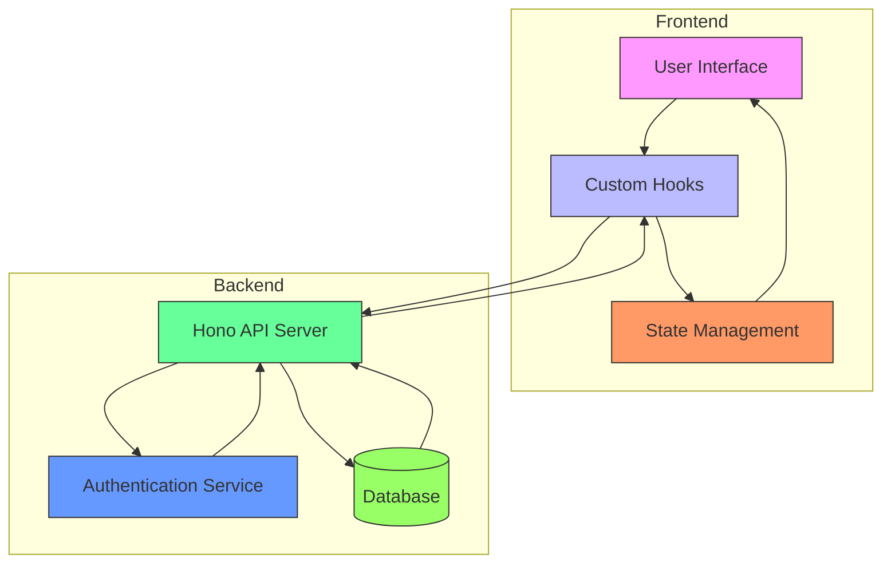
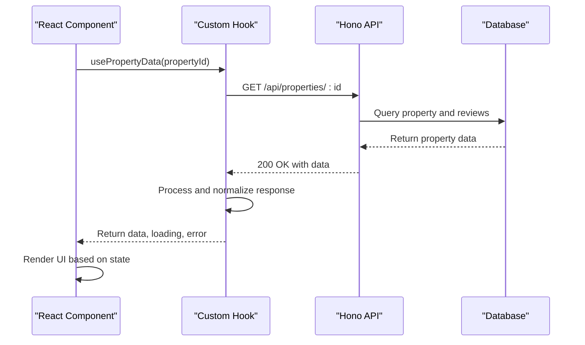
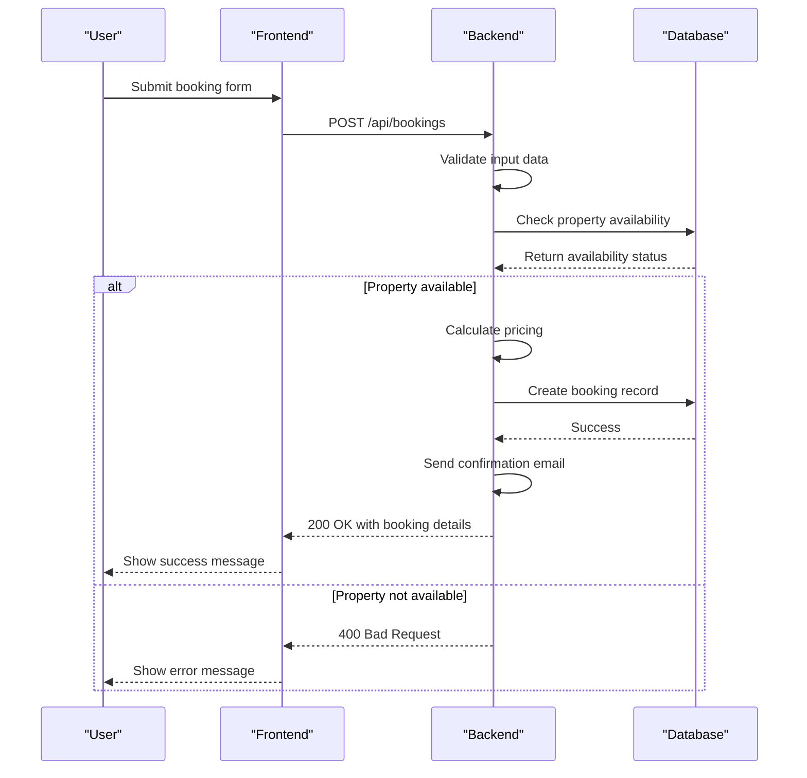
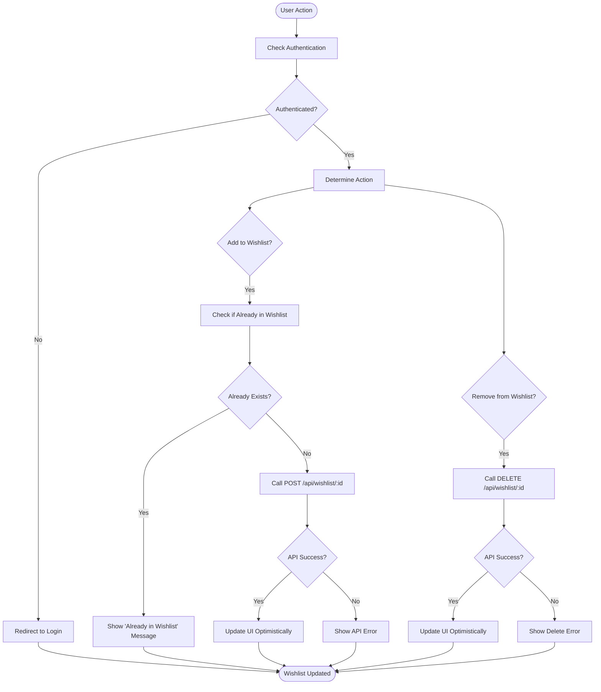
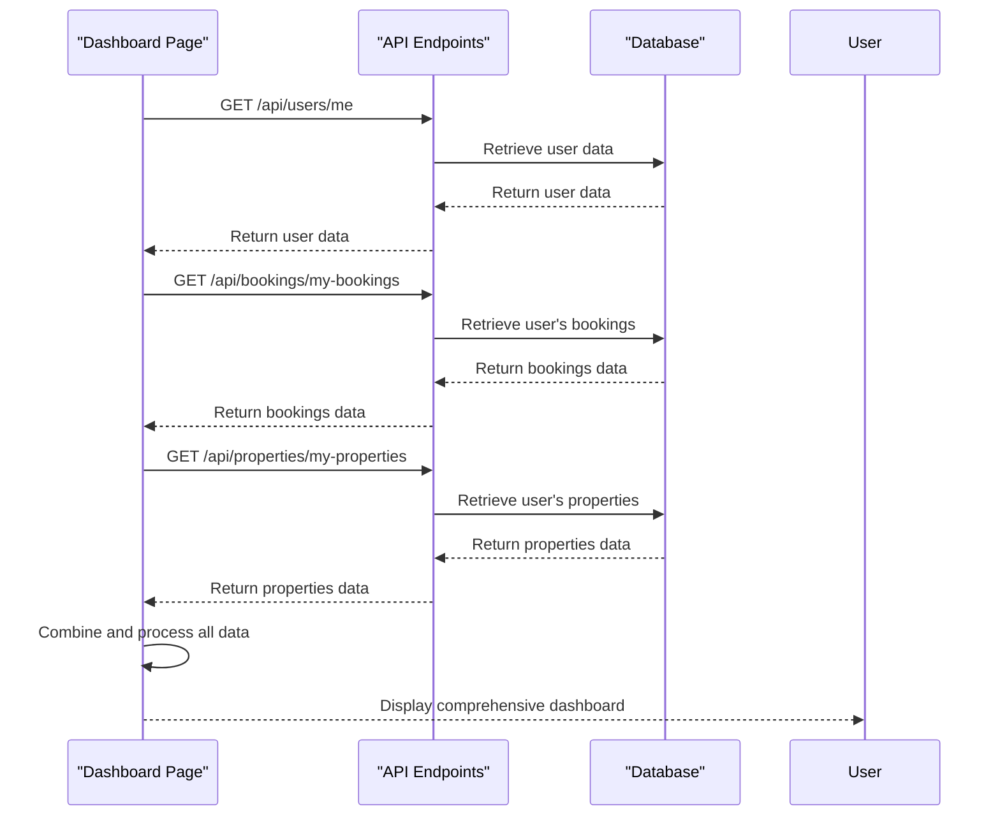
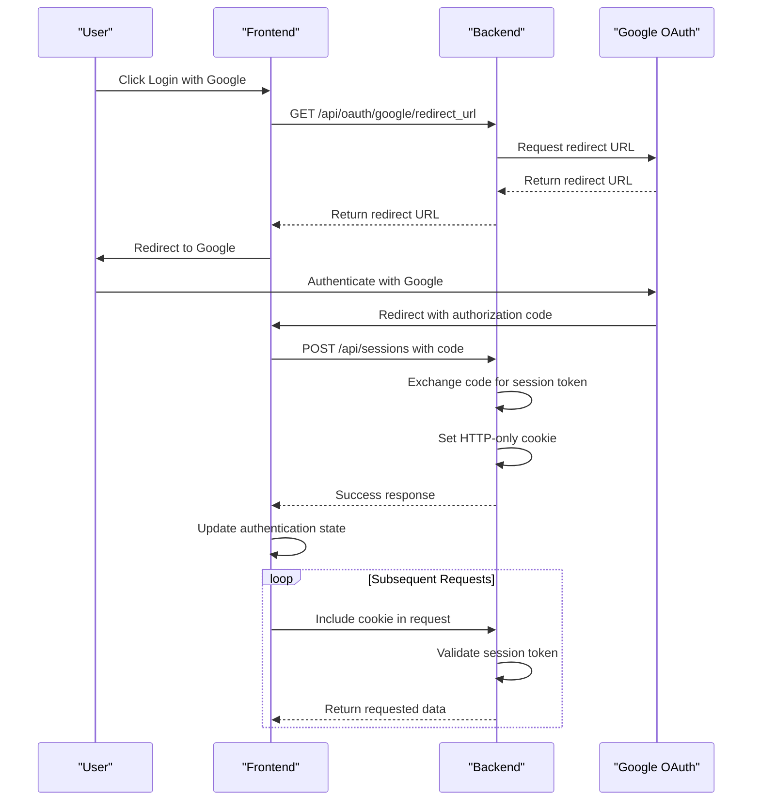
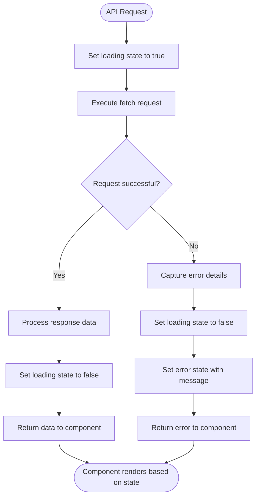
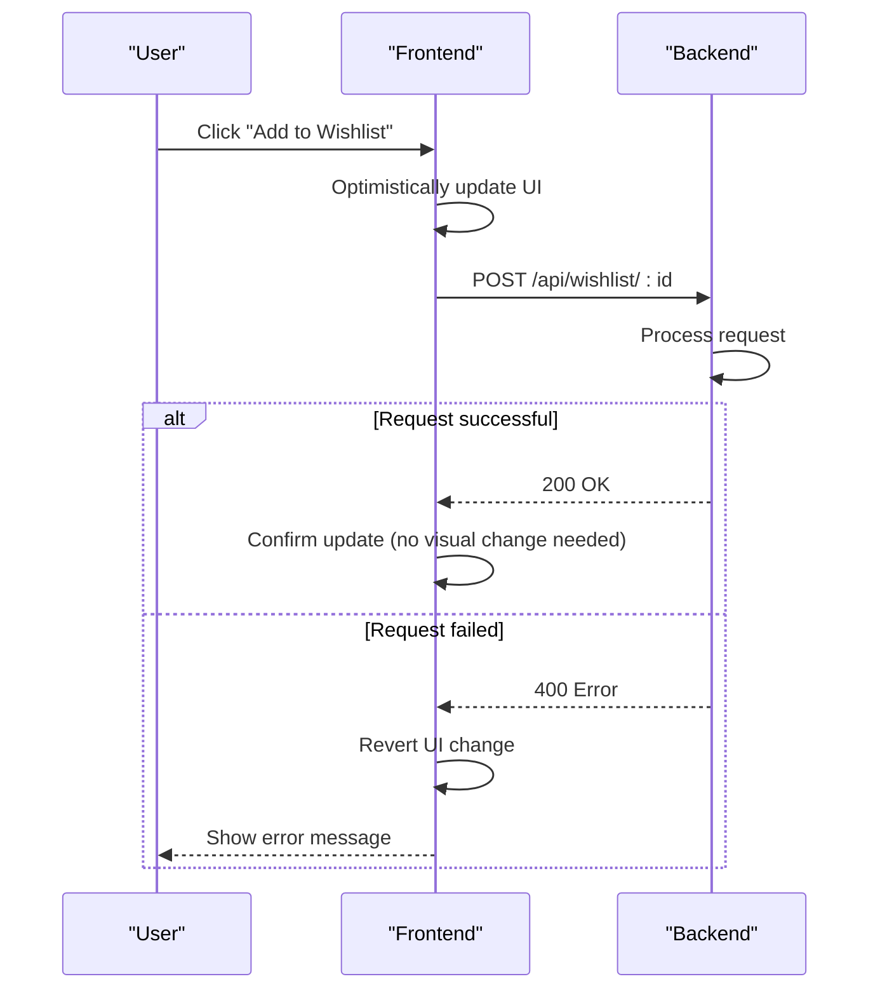
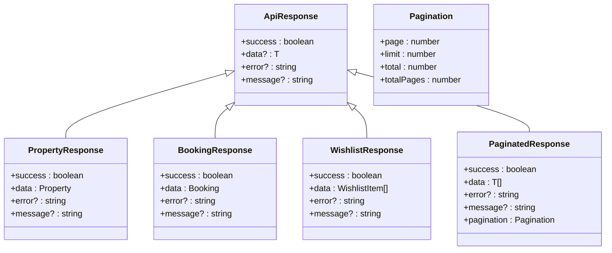
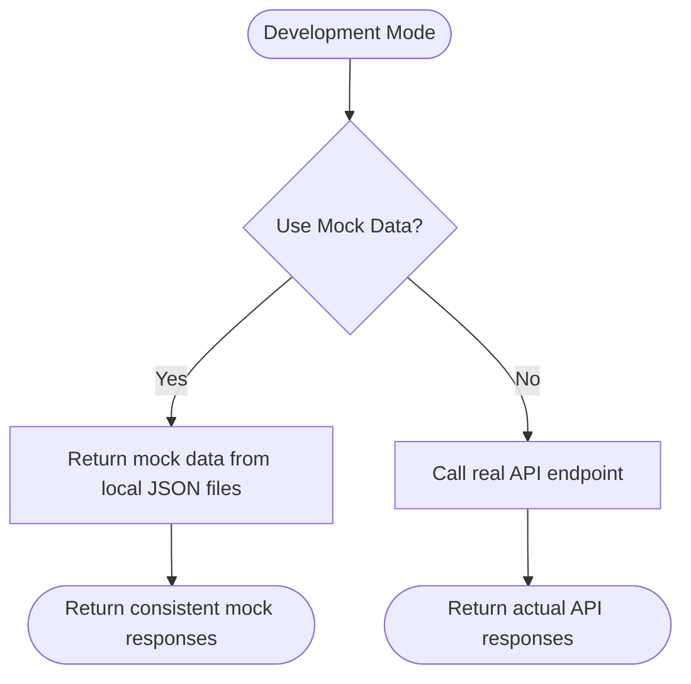

# API Integration Layer

<cite>
**Referenced Files in This Document**   
- [index.ts](file://src/worker/index.ts)
- [types.ts](file://src/shared/types.ts)
- [Dashboard.tsx](file://src/react-app/pages/Dashboard.tsx)
- [PropertyDetail.tsx](file://src/react-app/pages/PropertyDetail.tsx)
- [BookingModal.tsx](file://src/react-app/components/BookingModal.tsx)
- [WishlistButton.tsx](file://src/react-app/components/WishlistButton.tsx)
</cite>

## Table of Contents
1. [Introduction](#introduction)
2. [Architecture Overview](#architecture-overview)
3. [Data Fetching Patterns](#data-fetching-patterns)
4. [Type Safety with Shared Types](#type-safety-with-shared-types)
5. [CRUD Operations Implementation](#crud-operations-implementation)
6. [Authentication and JWT Management](#authentication-and-jwt-management)
7. [Error Handling and Loading States](#error-handling-and-loading-states)
8. [Optimistic UI Updates](#optimistic-ui-updates)
9. [Response Normalization Strategies](#response-normalization-strategies)
10. [Development and Debugging](#development-and-debugging)

## Introduction
This document details the API integration layer in HabibiStay, focusing on how the frontend communicates with the backend API endpoints powered by Hono. The integration follows modern patterns for data fetching, type safety, authentication, and error handling. The system is designed to provide a seamless user experience while maintaining robust security and performance characteristics.

## Architecture Overview



**Diagram sources**
- [index.ts](file://src/worker/index.ts#L1-L2442)
- [types.ts](file://src/shared/types.ts#L1-L599)

**Section sources**
- [index.ts](file://src/worker/index.ts#L1-L2442)
- [types.ts](file://src/shared/types.ts#L1-L599)

## Data Fetching Patterns

The frontend uses a combination of native fetch and custom React hooks to communicate with the Hono-powered backend endpoints. The primary pattern involves creating custom hooks that encapsulate the fetch logic, error handling, and loading states.



**Diagram sources**
- [index.ts](file://src/worker/index.ts#L400-L450)
- [PropertyDetail.tsx](file://src/react-app/pages/PropertyDetail.tsx)

**Section sources**
- [index.ts](file://src/worker/index.ts#L400-L450)
- [PropertyDetail.tsx](file://src/react-app/pages/PropertyDetail.tsx)

## Type Safety with Shared Types

HabibiStay ensures type safety between frontend and backend through shared TypeScript types defined in `types.ts`. This approach eliminates type duplication and ensures consistency across the entire stack.

```mermaid
classDiagram
class Property {
+id : number
+user_id : string
+title : string
+description : string | null
+location : string
+price_per_night : number
+max_guests : number
+bedrooms : number | null
+bathrooms : number | null
+amenities : string | null
+images : string | null
+is_featured : boolean
+is_active : boolean
+created_at : string
+updated_at : string
}
class Booking {
+id : number
+user_id : string
+property_id : number
+guest_name : string
+guest_email : string
+guest_phone : string | null
+check_in_date : string
+check_out_date : string
+total_guests : number
+total_amount : number
+status : string
+payment_status : string
+payment_id : string | null
+special_requests : string | null
+created_at : string
+updated_at : string
}
class Wishlist {
+id : number
+user_id : string
+property_id : number
+created_at : string
+updated_at : string
}
class Review {
+id : number
+user_id : string
+property_id : number
+booking_id : number | null
+rating : number
+comment : string | null
+created_at : string
+updated_at : string
}
class ApiResponse {
+success : boolean
+data? : T
+error? : string
+message? : string
}
class PaginatedResponse {
+success : boolean
+data : T[]
+error? : string
+message? : string
+pagination : {
page : number
limit : number
total : number
totalPages : number
}
}
Property <|-- CreateProperty
Booking <|-- CreateBooking
ApiResponse <|-- PaginatedResponse
```

**Diagram sources**
- [types.ts](file://src/shared/types.ts#L1-L200)

**Section sources**
- [types.ts](file://src/shared/types.ts#L1-L200)

## CRUD Operations Implementation

### Property Data Retrieval
The frontend retrieves property details using the `/api/properties/:id` endpoint, which returns comprehensive information including property details, reviews, and analytics.

**Section sources**
- [index.ts](file://src/worker/index.ts#L400-L450)
- [PropertyDetail.tsx](file://src/react-app/pages/PropertyDetail.tsx)

### Booking Creation
Bookings are created through the `/api/bookings` endpoint, which validates availability, calculates pricing, and creates the booking record.



**Diagram sources**
- [index.ts](file://src/worker/index.ts#L450-L550)
- [BookingModal.tsx](file://src/react-app/components/BookingModal.tsx)

**Section sources**
- [index.ts](file://src/worker/index.ts#L450-L550)
- [BookingModal.tsx](file://src/react-app/components/BookingModal.tsx)

### Wishlist Management
The wishlist functionality allows users to save properties for later viewing. The frontend interacts with three endpoints: GET `/api/wishlist` to retrieve the user's wishlist, POST `/api/wishlist/:propertyId` to add a property, and DELETE `/api/wishlist/:propertyId` to remove a property.



**Diagram sources**
- [index.ts](file://src/worker/index.ts#L600-L650)
- [WishlistButton.tsx](file://src/react-app/components/WishlistButton.tsx)

**Section sources**
- [index.ts](file://src/worker/index.ts#L600-L650)
- [WishlistButton.tsx](file://src/react-app/components/WishlistButton.tsx)

### User-Specific Data in Dashboard
The Dashboard page fetches user-specific data including bookings, properties, and profile information through multiple endpoints: GET `/api/users/me` for user information, GET `/api/bookings/my-bookings` for bookings, and GET `/api/properties/my-properties` for owned properties.



**Diagram sources**
- [index.ts](file://src/worker/index.ts#L800-L850)
- [Dashboard.tsx](file://src/react-app/pages/Dashboard.tsx)

**Section sources**
- [index.ts](file://src/worker/index.ts#L800-L850)
- [Dashboard.tsx](file://src/react-app/pages/Dashboard.tsx)

## Authentication and JWT Management

The authentication flow in HabibiStay follows a secure pattern using JWT tokens stored in HTTP-only cookies. The frontend initiates authentication through Google OAuth, receives a session token, and includes it in subsequent requests.



**Diagram sources**
- [index.ts](file://src/worker/index.ts#L200-L300)

**Section sources**
- [index.ts](file://src/worker/index.ts#L200-L300)

## Error Handling and Loading States

The frontend implements comprehensive error handling and loading states to provide a smooth user experience. Each API call includes loading indicators and error messages that are displayed appropriately.



**Diagram sources**
- [index.ts](file://src/worker/index.ts#L100-L150)
- [Dashboard.tsx](file://src/react-app/pages/Dashboard.tsx)

**Section sources**
- [index.ts](file://src/worker/index.ts#L100-L150)
- [Dashboard.tsx](file://src/react-app/pages/Dashboard.tsx)

## Optimistic UI Updates

For certain operations like wishlist management, the frontend implements optimistic UI updates to provide immediate feedback to users while the API request is processing in the background.



**Diagram sources**
- [WishlistButton.tsx](file://src/react-app/components/WishlistButton.tsx)
- [index.ts](file://src/worker/index.ts#L600-L650)

**Section sources**
- [WishlistButton.tsx](file://src/react-app/components/WishlistButton.tsx)
- [index.ts](file://src/worker/index.ts#L600-L650)

## Response Normalization Strategies

The backend API returns consistently structured responses using the `ApiResponse` interface, which includes a success flag, data payload, and optional error and message fields. This standardization simplifies frontend handling of API responses.



**Diagram sources**
- [types.ts](file://src/shared/types.ts#L500-L599)
- [index.ts](file://src/worker/index.ts#L1-L2442)

**Section sources**
- [types.ts](file://src/shared/types.ts#L500-L599)
- [index.ts](file://src/worker/index.ts#L1-L2442)

## Development and Debugging

### Debugging API Calls
To debug API calls during development, developers can use browser developer tools to inspect network requests, check request and response payloads, and monitor HTTP status codes. The API endpoints are accessible at the configured base URL with appropriate authentication headers.

### Mocking Responses
During development, API responses can be mocked using various strategies:
- Create a mock API service that implements the same interfaces as the real API
- Use environment variables to switch between real and mock endpoints
- Implement conditional logic in custom hooks to return mock data when in development mode



**Section sources**
- [index.ts](file://src/worker/index.ts#L1-L2442)
- [types.ts](file://src/shared/types.ts#L1-L599)