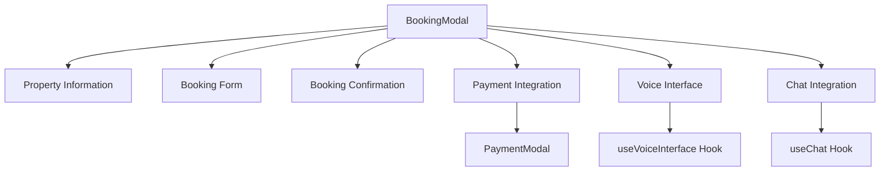
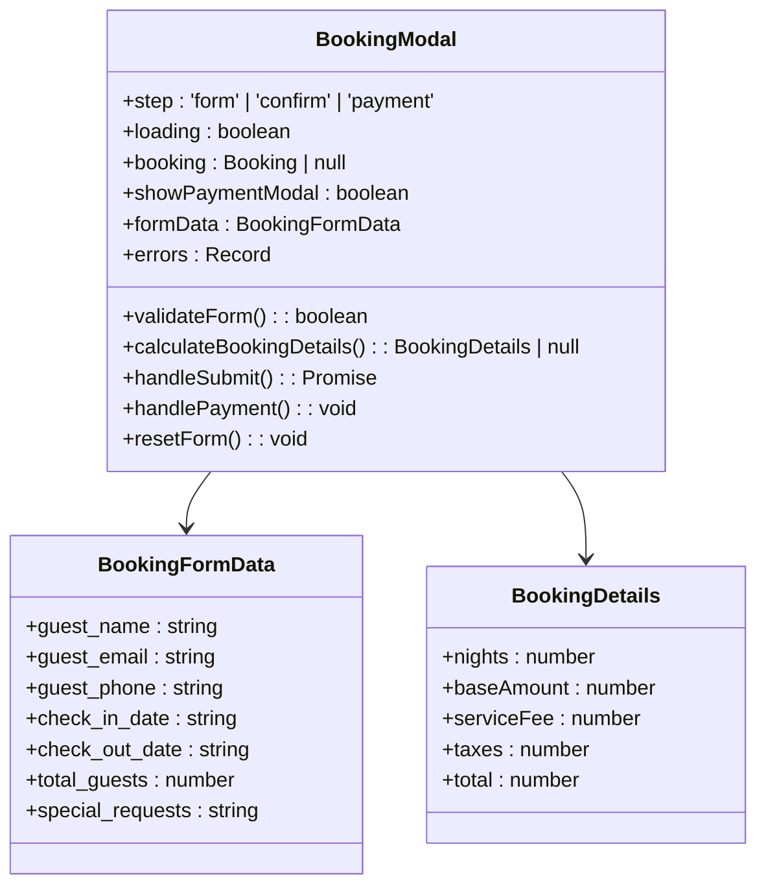
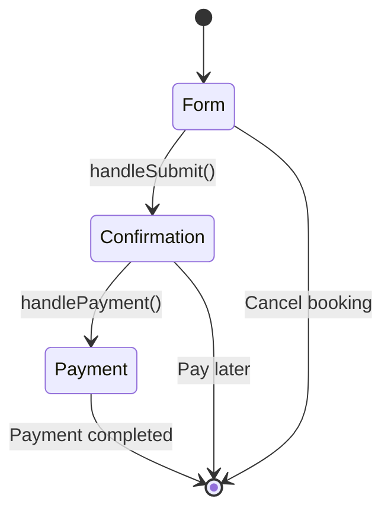
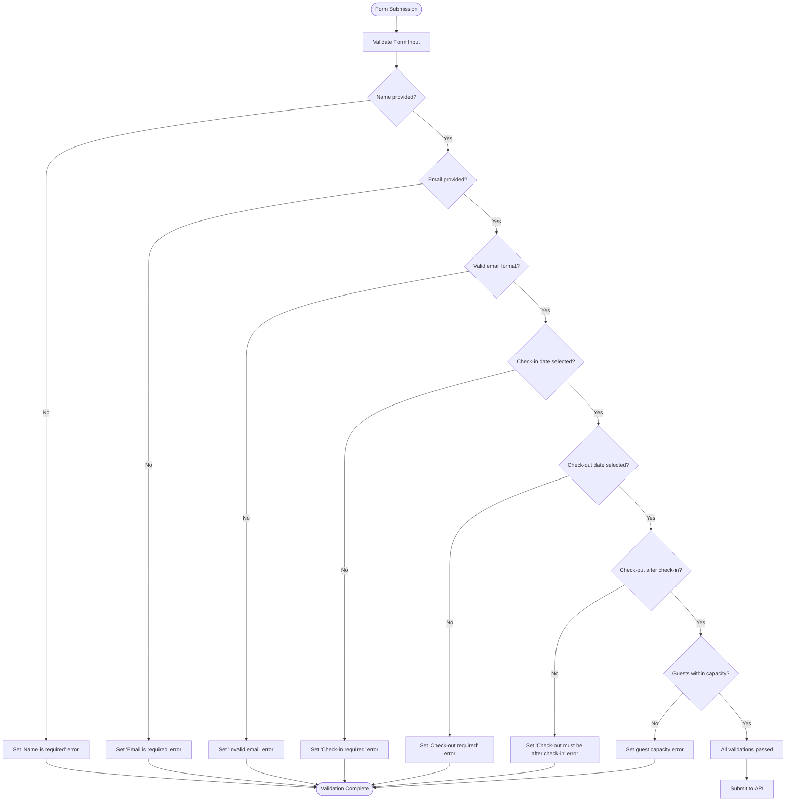
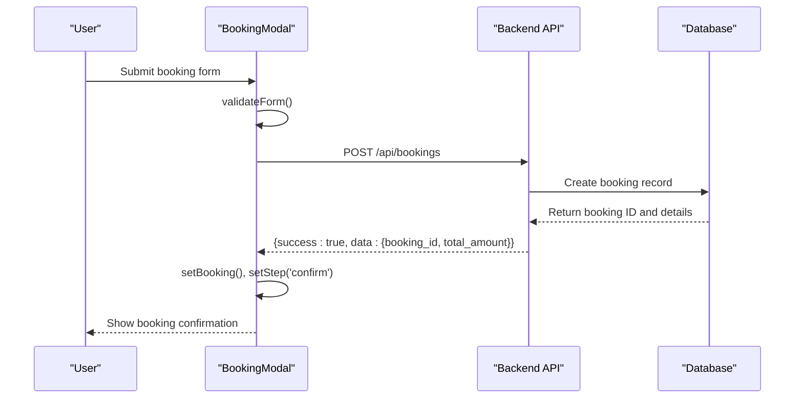
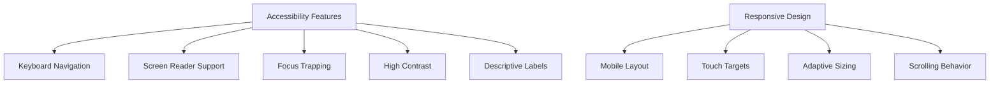
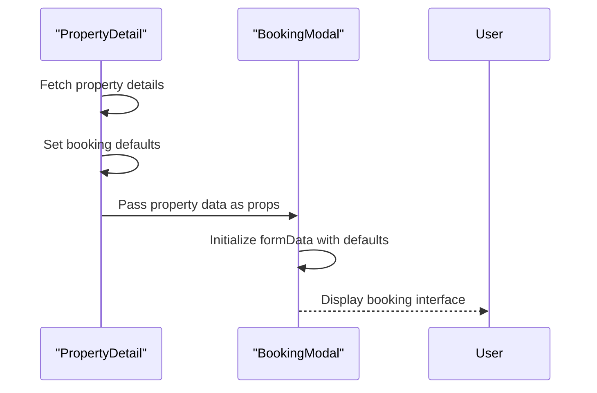
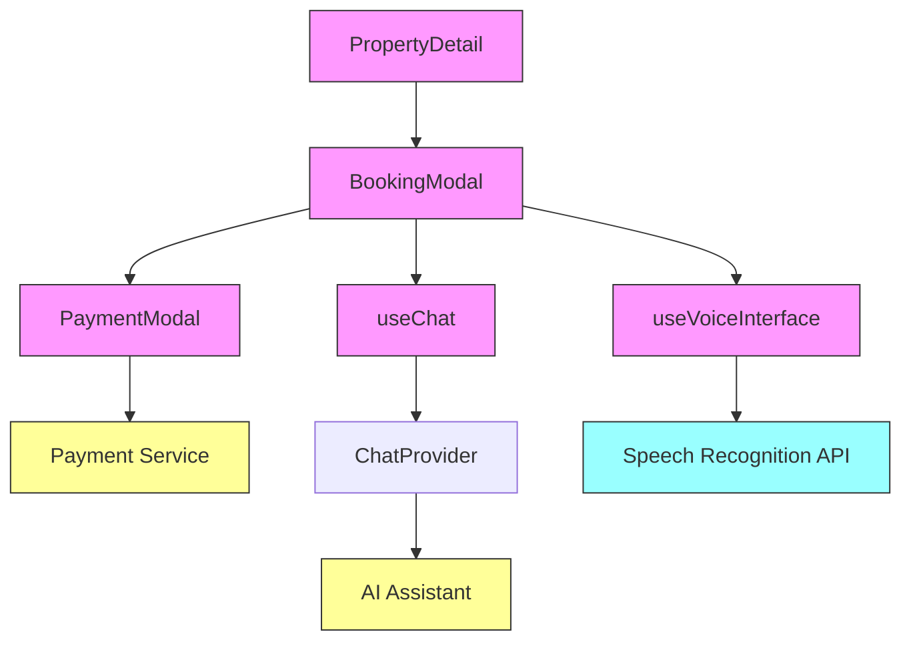

# BookingModal Component

<cite>
**Referenced Files in This Document**   
- [BookingModal.tsx](file://src/react-app/components/BookingModal.tsx)
- [PaymentModal.tsx](file://src/react-app/components/PaymentModal.tsx)
- [PropertyDetail.tsx](file://src/react-app/pages/PropertyDetail.tsx)
- [types.ts](file://src/shared/types.ts)
- [useVoiceInterface.ts](file://src/react-app/hooks/useVoiceInterface.ts)
- [ChatContext.tsx](file://src/react-app/contexts/ChatContext.tsx)
</cite>

## Table of Contents
1. [Introduction](#introduction)
2. [Component Architecture](#component-architecture)
3. [State Management and React Hooks](#state-management-and-react-hooks)
4. [Booking Flow and Step Progression](#booking-flow-and-step-progression)
5. [Form Validation and User Input Handling](#form-validation-and-user-input-handling)
6. [Integration with Backend Services](#integration-with-backend-services)
7. [Accessibility and Responsive Design](#accessibility-and-responsive-design)
8. [Cancellation and Closing Logic](#cancellation-and-closing-logic)
9. [Usage in PropertyDetail Component](#usage-in-propertydetail-component)
10. [Voice Interface Integration](#voice-interface-integration)
11. [Component Hierarchy and Relationships](#component-hierarchy-and-relationships)

## Introduction
The BookingModal component in HabibiStay provides a comprehensive booking interface that guides users through the reservation process. It serves as the primary booking mechanism for property reservations, offering a multi-step workflow that collects guest information, validates dates and capacity, calculates pricing, and coordinates with payment services. The modal integrates with various system components including date selection, guest input forms, payment processing, and voice-assisted booking through the AI assistant Sara. This documentation provides a detailed analysis of the BookingModal's architecture, functionality, and integration points within the HabibiStay application.

## Component Architecture
The BookingModal component implements a container-based architecture that manages the complete booking workflow through a series of conditional rendering states. The component is designed as a self-contained booking interface that can be triggered from various parts of the application, most commonly from the PropertyDetail page.

The architecture follows a clear separation of concerns, with distinct sections for property information display, form input collection, booking confirmation, and payment initiation. The component manages its own state for the booking process while delegating payment processing to a separate PaymentModal component, following the principle of single responsibility.



**Diagram sources**
- [BookingModal.tsx](file://src/react-app/components/BookingModal.tsx)
- [PaymentModal.tsx](file://src/react-app/components/PaymentModal.tsx)
- [useVoiceInterface.ts](file://src/react-app/hooks/useVoiceInterface.ts)
- [ChatContext.tsx](file://src/react-app/contexts/ChatContext.tsx)

**Section sources**
- [BookingModal.tsx](file://src/react-app/components/BookingModal.tsx#L1-L473)

## State Management and React Hooks
The BookingModal component utilizes React's useState and useEffect hooks to manage its internal state and lifecycle. The component maintains several state variables that track the booking process, form data, validation errors, and loading states.

Key state variables include:
- **step**: Controls the current stage of the booking process (form, confirm, payment)
- **loading**: Indicates when the component is processing a booking request
- **booking**: Stores the created booking object after successful submission
- **showPaymentModal**: Controls the visibility of the payment modal
- **formData**: Contains all user input for the booking form
- **errors**: Tracks validation errors for form fields



**Diagram sources**
- [BookingModal.tsx](file://src/react-app/components/BookingModal.tsx#L15-L473)

**Section sources**
- [BookingModal.tsx](file://src/react-app/components/BookingModal.tsx#L15-L473)

## Booking Flow and Step Progression
The BookingModal implements a three-step booking process that guides users through the reservation workflow. The step state variable controls which view is displayed to the user, enabling a progressive disclosure approach that simplifies the booking experience.

The booking flow progresses as follows:
1. **Form Step**: Users enter their personal information, select dates, and specify guest count
2. **Confirmation Step**: After form submission, users see a booking confirmation with details
3. **Payment Step**: Users are directed to complete payment through the integrated PaymentModal



The step progression is managed through button interactions and form submission. When users submit the booking form, the handleSubmit function validates the input and creates a booking record via the API. Upon success, the step state transitions from 'form' to 'confirm', displaying the booking confirmation view.

**Diagram sources**
- [BookingModal.tsx](file://src/react-app/components/BookingModal.tsx#L15-L473)

**Section sources**
- [BookingModal.tsx](file://src/react-app/components/BookingModal.tsx#L15-L473)

## Form Validation and User Input Handling
The BookingModal implements comprehensive client-side validation to ensure data integrity before submitting to the backend. The validateForm function checks multiple conditions including required fields, email format, date validity, and guest capacity limits.

Key validation rules include:
- **Required fields**: Guest name, email, check-in date, and check-out date must be provided
- **Email format**: Email address must pass regex validation
- **Date validation**: Check-in cannot be in the past; check-out must be after check-in
- **Guest capacity**: Total guests cannot exceed the property's maximum capacity



The component provides immediate visual feedback for validation errors, highlighting problematic fields in red and displaying descriptive error messages below the respective inputs. This real-time validation helps users correct issues before form submission.

**Diagram sources**
- [BookingModal.tsx](file://src/react-app/components/BookingModal.tsx#L50-L100)

**Section sources**
- [BookingModal.tsx](file://src/react-app/components/BookingModal.tsx#L50-L100)

## Integration with Backend Services
The BookingModal integrates with the backend API through fetch requests to create booking records and retrieve property information. The component communicates with the /api/bookings endpoint to submit booking data and receive confirmation.

When users submit the booking form, the handleSubmit function makes a POST request to the bookings API with the form data:



The API response includes the booking ID and total amount, which are used to create a Booking object for display in the confirmation step and for payment processing. Error handling is implemented to catch network issues and validation errors from the backend, displaying appropriate messages to the user.

**Diagram sources**
- [BookingModal.tsx](file://src/react-app/components/BookingModal.tsx#L102-L150)
- [types.ts](file://src/shared/types.ts#L20-L40)

**Section sources**
- [BookingModal.tsx](file://src/react-app/components/BookingModal.tsx#L102-L150)

## Accessibility and Responsive Design
The BookingModal is designed with accessibility and responsive behavior in mind, ensuring a consistent experience across different devices and for users with various needs.

Accessibility features include:
- **Keyboard navigation**: Users can navigate through form fields using tab keys
- **Screen reader support**: Semantic HTML elements and ARIA labels provide context
- **Focus trapping**: When the modal is open, focus remains within the modal
- **High contrast**: Sufficient color contrast for text and interactive elements
- **Descriptive labels**: Form fields have clear labels with visual indicators

The component is fully responsive, adapting its layout to different screen sizes:
- On mobile devices, the modal takes up most of the screen with appropriate padding
- Form elements are sized for touch interaction with adequate tap targets
- The layout adjusts to maintain readability on smaller screens
- Scrolling is enabled for longer content on mobile devices



**Diagram sources**
- [BookingModal.tsx](file://src/react-app/components/BookingModal.tsx)

**Section sources**
- [BookingModal.tsx](file://src/react-app/components/BookingModal.tsx)

## Cancellation and Closing Logic
The BookingModal implements clear cancellation and closing logic to allow users to exit the booking process at any stage. The component provides multiple ways to close the modal, each with appropriate state cleanup.

Closing mechanisms include:
- **Close button**: The X icon in the top-right corner closes the modal
- **Cancel button**: In the confirmation step, users can choose "Pay Later"
- **Overlay click**: Clicking outside the modal content closes it
- **Escape key**: Pressing the Escape key closes the modal

When the modal is closed, the resetForm function is called to clear all booking data and reset the step state to 'form'. This ensures that when the modal is reopened, it starts fresh without any previous data.

```mermaid
flowchart TD
A[Close Modal] --> B{Close Method}
B --> C[X Button]
B --> D[Cancel Button]
B --> E[Overlay Click]
B --> F[Escape Key]
C --> G[Call resetForm()]
D --> G
E --> G
F --> G
G --> H[Set step to 'form']
H --> I[Clear formData]
I --> J[Clear errors]
J --> K[Clear booking]
K --> L[Call onClose()]
```

**Diagram sources**
- [BookingModal.tsx](file://src/react-app/components/BookingModal.tsx#L200-L250)

**Section sources**
- [BookingModal.tsx](file://src/react-app/components/BookingModal.tsx#L200-L250)

## Usage in PropertyDetail Component
The BookingModal is primarily used within the PropertyDetail component, which displays detailed information about a specific property. The PropertyDetail component passes the necessary property data as props to the BookingModal when it is triggered.

In the PropertyDetail component, the booking functionality is initially presented as a "Reserve" button. When clicked, this button sets the showBookingForm state to true, which could either display an inline booking form or trigger the BookingModal (depending on implementation details).

The PropertyDetail component pre-fills certain booking parameters based on the authenticated user's information:



**Diagram sources**
- [PropertyDetail.tsx](file://src/react-app/pages/PropertyDetail.tsx#L1-L561)
- [BookingModal.tsx](file://src/react-app/components/BookingModal.tsx#L1-L473)

**Section sources**
- [PropertyDetail.tsx](file://src/react-app/pages/PropertyDetail.tsx#L1-L561)

## Voice Interface Integration
The BookingModal integrates with the voice interface through the useVoiceInterface hook, enabling voice-assisted booking capabilities. While the BookingModal itself doesn't directly use the voice hook, it provides an alternative booking method through the AI assistant Sara.

The component includes a "Book with Sara (AI Assistant)" button that opens the chat interface and closes the booking modal. This allows users to complete their booking through voice commands via the AI assistant.

```mermaid
graph TD
A[BookingModal] --> B[Book with Sara Button]
B --> C[handleChatBooking()]
C --> D[openChat()]
D --> E[ChatProvider]
E --> F[useVoiceInterface]
F --> G[Speech Recognition]
F --> H[Speech Synthesis]
G --> I[Voice Commands]
H --> J[Voice Responses]
```

The voice interface functionality is implemented in the useVoiceInterface hook, which provides speech recognition and synthesis capabilities. When users interact with Sara through voice, they can perform booking-related tasks such as selecting dates, specifying guest counts, and confirming reservations using natural language commands.

**Diagram sources**
- [BookingModal.tsx](file://src/react-app/components/BookingModal.tsx#L350-L360)
- [useVoiceInterface.ts](file://src/react-app/hooks/useVoiceInterface.ts)
- [ChatContext.tsx](file://src/react-app/contexts/ChatContext.tsx)

**Section sources**
- [BookingModal.tsx](file://src/react-app/components/BookingModal.tsx#L350-L360)
- [useVoiceInterface.ts](file://src/react-app/hooks/useVoiceInterface.ts)

## Component Hierarchy and Relationships
The BookingModal exists within a well-defined component hierarchy, serving as a container for the booking workflow while integrating with various specialized components.



The BookingModal acts as a parent component to the PaymentModal, controlling its visibility and passing booking data. It consumes context from the ChatProvider through the useChat hook, allowing integration with the AI assistant. While it doesn't directly use the voice interface, it facilitates access to voice-assisted booking by providing a pathway to the chat interface.

**Diagram sources**
- [BookingModal.tsx](file://src/react-app/components/BookingModal.tsx)
- [PaymentModal.tsx](file://src/react-app/components/PaymentModal.tsx)
- [PropertyDetail.tsx](file://src/react-app/pages/PropertyDetail.tsx)
- [ChatContext.tsx](file://src/react-app/contexts/ChatContext.tsx)

**Section sources**
- [BookingModal.tsx](file://src/react-app/components/BookingModal.tsx)
- [PaymentModal.tsx](file://src/react-app/components/PaymentModal.tsx)
- [PropertyDetail.tsx](file://src/react-app/pages/PropertyDetail.tsx)