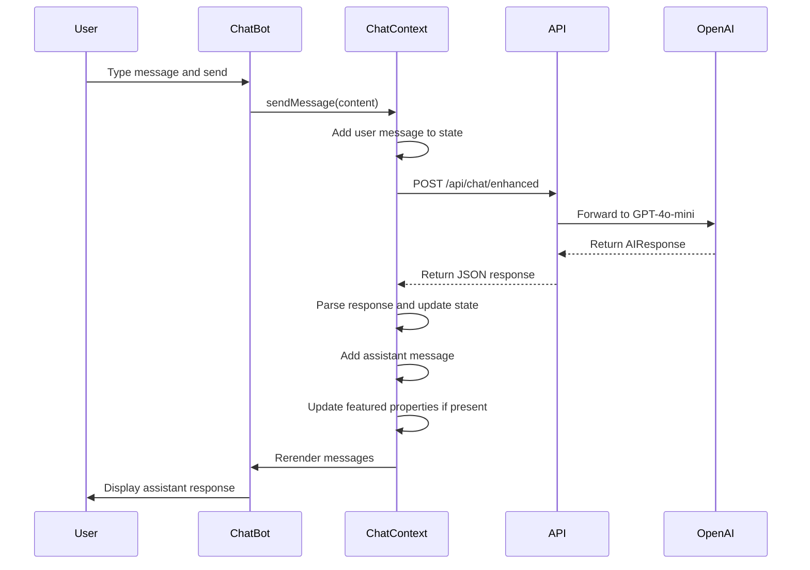
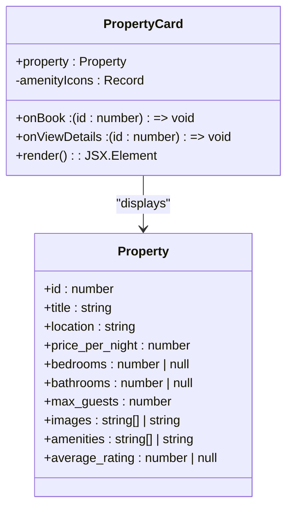
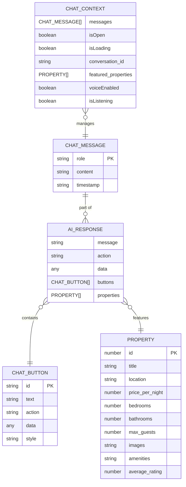

# ChatBot Component

<cite>
**Referenced Files in This Document**   
- [ChatBot.tsx](file://src/react-app/components/ChatBot.tsx#L1-L451)
- [ChatContext.tsx](file://src/react-app/contexts/ChatContext.tsx#L1-L452)
- [types.ts](file://src/shared/types.ts#L1-L599)
</cite>

## Table of Contents
1. [Introduction](#introduction)
2. [Project Structure](#project-structure)
3. [Core Components](#core-components)
4. [Architecture Overview](#architecture-overview)
5. [Detailed Component Analysis](#detailed-component-analysis)
6. [Dependency Analysis](#dependency-analysis)
7. [Performance Considerations](#performance-considerations)
8. [Troubleshooting Guide](#troubleshooting-guide)
9. [Conclusion](#conclusion)

## Introduction
The ChatBot component is an AI-powered assistant named Sara, designed to provide real-time guest support for the HabibiStay platform. Built using React and integrated with OpenAI's GPT-4o-mini model, Sara operates as a floating UI widget accessible from any page. The component enables users to search for accommodations, view property details, initiate bookings, and receive personalized assistance through natural language interaction. It supports both text and voice input via a speech recognition interface, and features rich message rendering including property cards and interactive buttons. The chat maintains persistent session history using localStorage and integrates with a backend API to deliver dynamic, context-aware responses.

## Project Structure
The ChatBot component is part of a modular React application structured around feature-based organization. The core chat functionality resides in the `src/react-app` directory, with components, contexts, and shared types separated into dedicated folders. The chat interface is implemented in `ChatBot.tsx`, while global state management is handled by `ChatContext.tsx`. Shared type definitions are centralized in `src/shared/types.ts`, ensuring consistency across frontend and backend systems. The worker logic for API handling is located in `src/worker/index.ts`, which processes chat requests and communicates with the AI model.

```mermaid
graph TB
subgraph "Frontend"
A[ChatBot.tsx] --> B[ChatContext.tsx]
B --> C[types.ts]
A --> D[lucide-react Icons]
A --> E[clsx Utility]
end
subgraph "Backend"
F[index.ts] --> G[OpenAI API]
end
A --> F[/api/chat/enhanced]
B --> F[/api/chat/enhanced]
B --> H[/api/properties/featured]
```

**Diagram sources**
- [ChatBot.tsx](file://src/react-app/components/ChatBot.tsx#L1-L451)
- [ChatContext.tsx](file://src/react-app/contexts/ChatContext.tsx#L1-L452)
- [types.ts](file://src/shared/types.ts#L1-L599)

**Section sources**
- [ChatBot.tsx](file://src/react-app/components/ChatBot.tsx#L1-L451)
- [ChatContext.tsx](file://src/react-app/contexts/ChatContext.tsx#L1-L452)
- [types.ts](file://src/shared/types.ts#L1-L599)

## Core Components
The core components of the ChatBot system include the `ChatBot` UI component, the `ChatProvider` context manager, and the shared type definitions that govern message structure and AI response formats. The `ChatBot` component renders a floating widget with message history, input field, and voice controls. The `ChatContext` manages global state including messages, loading status, voice settings, and booking context. Type definitions in `types.ts` ensure type safety across the application, particularly for AI responses, property data, and user interactions.

**Section sources**
- [ChatBot.tsx](file://src/react-app/components/ChatBot.tsx#L1-L451)
- [ChatContext.tsx](file://src/react-app/contexts/ChatContext.tsx#L1-L452)
- [types.ts](file://src/shared/types.ts#L1-L599)

## Architecture Overview
The ChatBot architecture follows a client-server pattern with React managing UI state and a worker process handling AI inference. The frontend uses a Context API to manage global chat state, enabling components across the app to access and update chat data. When a user sends a message, it is forwarded via `fetch` to the `/api/chat/enhanced` endpoint, which processes the request using OpenAI's GPT-4o-mini model. The response is streamed back and rendered in the chat interface with support for rich content such as property cards and action buttons. Voice interaction is enabled through Web Speech API for both speech recognition and synthesis.

```mermaid
graph TD
A[User] --> B[ChatBot UI]
B --> C{Is Voice Enabled?}
C --> |Yes| D[Start Speech Recognition]
C --> |No| E[Text Input]
D --> F[Transcribe Speech]
F --> G[Send Message]
E --> G
G --> H[/api/chat/enhanced]
H --> I[OpenAI GPT-4o-mini]
I --> J[Generate Response]
J --> K[Return AIResponse]
K --> L[Update ChatContext]
L --> M[Render Message]
M --> N[Speech Synthesis if Enabled]
N --> B
```

**Diagram sources**
- [ChatBot.tsx](file://src/react-app/components/ChatBot.tsx#L1-L451)
- [ChatContext.tsx](file://src/react-app/contexts/ChatContext.tsx#L1-L452)

## Detailed Component Analysis

### ChatBot Component Analysis
The `ChatBot` component implements a floating UI widget that appears as a circular button when closed and expands into a full chat window when opened. It uses the `useChat` hook to access global state from `ChatContext`, including messages, loading status, and voice settings. The component renders a message list with distinct styling for user and assistant messages, an input field with keyboard submission, and voice input controls. It also handles property card rendering and action button interactions.

#### UI Structure and Flow
```mermaid
flowchart TD
Start([Component Render]) --> CheckOpen{"Chat Open?"}
CheckOpen --> |No| RenderButton[Render Floating Button]
CheckOpen --> |Yes| RenderWindow[Render Chat Window]
RenderWindow --> Header[Render Header with Controls]
RenderWindow --> Messages[Render Message List]
RenderWindow --> Input[Render Input Section]
Input --> VoiceStatus{Is Listening?}
VoiceStatus --> |Yes| ShowListening[Show "Listening..." Indicator]
VoiceStatus --> |No| HideListening
Messages --> ProcessMessage[Process Each Message]
ProcessMessage --> IsAssistant{"Role: Assistant?"}
IsAssistant --> |Yes| RenderContent[Render MessageContent]
IsAssistant --> |No| RenderText[Render Plain Text]
RenderContent --> HasProperty{"Has Property Data?"}
HasProperty --> |Yes| RenderPropertyCard[Render PropertyCard]
HasProperty --> |No| CheckButtons{"Has Buttons?"}
CheckButtons --> |Yes| RenderButtons[Render ChatButtonComponent]
CheckButtons --> |No| End
```

**Diagram sources**
- [ChatBot.tsx](file://src/react-app/components/ChatBot.tsx#L1-L451)

**Section sources**
- [ChatBot.tsx](file://src/react-app/components/ChatBot.tsx#L1-L451)

### ChatContext Analysis
The `ChatProvider` component implements global state management for the chat system using React Context. It maintains state for messages, conversation ID, voice settings, and booking context. The context initializes with a greeting message and fetches featured properties on load. It handles message sending via the `/api/chat/enhanced` endpoint, manages voice input through Web Speech API, and persists conversation state in localStorage.

#### State Management and API Flow


**Diagram sources**
- [ChatContext.tsx](file://src/react-app/contexts/ChatContext.tsx#L1-L452)

**Section sources**
- [ChatContext.tsx](file://src/react-app/contexts/ChatContext.tsx#L1-L452)

### Message Rendering Components
The chat interface includes specialized components for rendering rich message content, including `PropertyCard` and `ChatButtonComponent`. These components enable Sara to display property listings with images, amenities, and booking actions, as well as interactive buttons that trigger specific workflows.

#### PropertyCard Component


**Diagram sources**
- [ChatBot.tsx](file://src/react-app/components/ChatBot.tsx#L1-L451)

### Type System Analysis
The chat functionality relies on a robust type system defined in `types.ts`, which includes schemas for chat messages, AI responses, and interactive elements. These types ensure consistency between frontend and backend systems and enable type-safe handling of dynamic content.

#### Chat Type Definitions


**Diagram sources**
- [types.ts](file://src/shared/types.ts#L1-L599)

**Section sources**
- [types.ts](file://src/shared/types.ts#L1-L599)

## Dependency Analysis
The ChatBot component has well-defined dependencies on React, Lucide icons, and shared type definitions. It relies on the `ChatContext` for state management and uses browser Web Speech API for voice functionality. The component imports types from `shared/types.ts` to ensure consistency with backend data structures. There are no circular dependencies, and the component is loosely coupled with the rest of the application through the context API.

```mermaid
graph TD
A[ChatBot.tsx] --> B[React]
A --> C[lucide-react]
A --> D[clsx]
A --> E[ChatContext]
A --> F[types.ts]
E --> G[Web Speech API]
E --> H[localStorage]
E --> I[/api/chat/enhanced]
E --> J[/api/properties/featured]
```

**Diagram sources**
- [ChatBot.tsx](file://src/react-app/components/ChatBot.tsx#L1-L451)
- [ChatContext.tsx](file://src/react-app/contexts/ChatContext.tsx#L1-L452)

**Section sources**
- [ChatBot.tsx](file://src/react-app/components/ChatBot.tsx#L1-L451)
- [ChatContext.tsx](file://src/react-app/contexts/ChatContext.tsx#L1-L452)

## Performance Considerations
The ChatBot is optimized for real-time interaction with several performance considerations. Message rendering uses React's keying system for efficient list updates, and the component implements `useCallback` to prevent unnecessary re-renders. Voice input is only initialized if the browser supports Web Speech API, and speech synthesis is handled asynchronously. Conversation state is persisted in localStorage to avoid reinitialization on page reload. The component also implements a 30-minute session timeout to manage storage usage.

## Troubleshooting Guide
Common issues with the ChatBot component include voice input not working, messages not sending, and property cards not displaying. Voice input requires HTTPS and browser support for Web Speech API; it will be disabled otherwise. If messages fail to send, check the network connection and verify that the `/api/chat/enhanced` endpoint is reachable. Property cards require properly formatted property data with images and amenities as arrays; stringified JSON may need parsing. Conversation persistence relies on localStorage, which may be disabled in private browsing modes.

**Section sources**
- [ChatBot.tsx](file://src/react-app/components/ChatBot.tsx#L1-L451)
- [ChatContext.tsx](file://src/react-app/contexts/ChatContext.tsx#L1-L452)

## Conclusion
The ChatBot component provides a comprehensive AI-powered guest support system for HabibiStay, combining natural language interaction with rich UI elements and voice capabilities. Its modular architecture, type-safe design, and persistent session management make it a robust solution for real-time user assistance. The integration with OpenAI's GPT-4o-mini model enables intelligent, context-aware responses, while the extensible type system allows for future enhancements such as multi-language support and advanced booking workflows.